# AutoDev Architect — Documento de Referência da Plataforma v2.0

> **Status:** Proposta de arquitetura (Draft) · **Versão do documento:** `2.0.0-draft.1` · **Idioma:** pt-BR
> **Escopo:** desenho completo da versão 2.0 — plataforma open-source e self-hostable de engenharia de software com IA, **altamente customizável e expansível** (plugins, novos agents, configuração de fluxo, reasoning, roteamento/seleção/avaliação de agentes, skills e UI/UX de excelência).

Este documento é a **referência única** que orienta o desenho e a entrega da v2.0.
Ele define a visão, os princípios, a arquitetura, cada subsistema e seus pontos de
extensão, os requisitos funcionais e **não-funcionais**, e um **roadmap por etapas**
(épicos → histórias → subtarefas) em que **cada etapa e subetapa é governada por
critérios funcionais/não-funcionais explícitos e por *Definition of Ready* (DoR) e
*Definition of Done* (DoD)** — ver a seção 18 e os templates do apêndice (seção 21).

**Como ler:** as seções 1–3 dão a base (visão, princípios, glossário canônico);
4 descreve a arquitetura; 5–14 detalham os subsistemas e contratos; 15 cobre a
experiência (UI/UX); 16–17 os requisitos não-funcionais e de qualidade; 18 o
roadmap de execução com DoR/DoD; 19–20 governança e métricas; 21 reúne os
templates prontos para uso. Os termos em **maiúsculas/itálico** e os nomes de
componentes seguem o glossário da seção 3.

## Sumário

- [1. Visão, Objetivos, Não-Objetivos, Personas e Casos de Uso](#1-visão-objetivos-não-objetivos-personas-e-casos-de-uso)
- [2. Princípios Norteadores (Produto + Arquitetura)](#2-princípios-norteadores-produto--arquitetura)
- [3. Glossário e Definições](#3-glossário-e-definições)
- [4. Arquitetura de Alto Nível](#4-arquitetura-de-alto-nível)
- [5. Sistema de Plugins e Extensibilidade](#5-sistema-de-plugins-e-extensibilidade)
- [6. Framework de Agentes](#6-framework-de-agentes)
- [7. Motor de Fluxos e Orquestração](#7-motor-de-fluxos-e-orquestração)
- [8. Reasoning (Estratégias Plugáveis)](#8-reasoning-estratégias-plugáveis)
- [9. Roteamento, Seleção e Avaliação de Agentes](#9-roteamento-seleção-e-avaliação-de-agentes)
- [10. Skills (Habilidades)](#10-skills-habilidades)
- [11. Repository Intelligence e Contexto de Código](#11-repository-intelligence-e-contexto-de-código)
- [12. Patches, Execução e Validação](#12-patches-execução-e-validação)
- [13. Persistência, Estado e Modelo de Dados](#13-persistência-estado-e-modelo-de-dados)
- [14. APIs, Contratos, Eventos e Interoperabilidade](#14-apis-contratos-eventos-e-interoperabilidade)
- [15. UI/UX e Design System](#15-uiux-e-design-system)
- [16. Requisitos Não-Funcionais](#16-requisitos-não-funcionais)
- [17. Estratégia de Qualidade, Testes e Avaliação](#17-estratégia-de-qualidade-testes-e-avaliação)
- [18. Roadmap de Entrega por Etapas](#18-roadmap-de-entrega-por-etapas)
- [19. Governança, Versionamento e Compatibilidade](#19-governança-versionamento-e-compatibilidade)
- [20. Métricas de Sucesso e KPIs](#20-métricas-de-sucesso-e-kpis)
- [21. Apêndices — Templates e Checklists](#21-apêndices--templates-e-checklists)

---

## 1. Visão, Objetivos, Não-Objetivos, Personas e Casos de Uso

### 1.1 Visão v2.0

O **AutoDev Architect v2.0** é uma **plataforma open-source e self-hostable de engenharia de software com IA**, projetada para ser **altamente customizável e expansível**. A tese central da v2 é uma inversão de arquitetura em relação à v1: onde a v1 entrega um **orquestrador com pipeline linear fixo** (Navigator → Analyzer → Architect → Coder → DevOps → Validator → Responder), a v2 transforma **cada capacidade central** — agentes, fluxos, reasoning, roteamento, avaliação, skills, contexto/RAG e até painéis de UI — em **Pontos de Extensão** tipados, habitados por **Plugins** versionados. O **núcleo (core) fica pequeno e estável**; o valor cresce pelas bordas.

Três compromissos estruturam a visão:

1. **Tudo como configuração, versionado.** Fluxos, agentes, skills, políticas de roteamento e evals são **declarativos** (`flow.yaml`, `agent.yaml`, `skill.yaml`, `eval.yaml`, `plugin.yaml`) e versionados por SemVer. Comportamento é dado, não código enterrado.
2. **Contratos estáveis entre core e extensões.** O core expõe interfaces SemVer (`hostApi: ">=2.0 <3.0"`); extensões dependem de contratos, nunca de internals. Isso viabiliza um ecossistema e um **Marketplace** de plugins/agents/skills.
3. **Local-first com upgrade progressivo.** A mesma base roda no laptop sem dependências externas (SQLite + provider de LLM *stub*) e escala para produção multi-tenant (PostgreSQL + pgvector, Redis, MinIO) **sem reescrever nada**.

A experiência é **observável por padrão** (traços, métricas, replay determinístico a partir do estado durável) e a **Web UI (Next.js)** prioriza usabilidade e acessibilidade de nível profissional (WCAG 2.2 AA). A ambição de produto é dupla: **(a)** ser a base sobre a qual uma comunidade publica extensões via Marketplace; **(b)** ser confiável o bastante para operar fluxos reais de engenharia — **planejar → codificar → aplicar patch → validar em sandbox → avaliar** — com governança, segurança e custo sob controle.

> **Enunciado de visão (uma frase):** ser a plataforma OSS de referência onde qualquer capacidade de engenharia com IA pode ser plugada, versionada, isolada e avaliada — do laptop ao cluster — sem lock-in.

### 1.2 Objetivos mensuráveis

Os objetivos abaixo são **verificáveis** e ancorados nas metas não-funcionais globais do brief. Cada um conecta a épicos (E0–E13).

| # | Objetivo | Métrica / alvo | Épicos |
|---|----------|----------------|--------|
| O1 | Núcleo extensível com contratos estáveis | 100% das capacidades centrais expostas como Pontos de Extensão; **contract tests obrigatórios** em cada um | E1, E2, E6, E12 |
| O2 | Fluxos como configuração | Fluxo definido só em `flow.yaml` executa com checkpointing, retries e human-in-the-loop; editor visual round-trip sem perda | E3 |
| O3 | Roteamento e seleção governados por política | Router/Selector escolhem agent/modelo/estratégia por capability + política + custo; decisão registrada em Trace | E5, E4 |
| O4 | Avaliação contínua com feedback fechado | Evals offline/online que **realimentam** o roteamento; resultados persistidos e comparáveis entre versões | E5, E12 |
| O5 | Latência de plano de controle | **p95 < 300 ms** em endpoints de leitura; **início de streaming de run < 1 s** | E9, E11 |
| O6 | Disponibilidade em produção | **SLO 99.9%** para o Control Plane | E11 |
| O7 | Escala horizontal de execução | **≥ 100 runs concorrentes** por nó de trabalho de referência; workers escaláveis | E8, E11 |
| O8 | Governança de custo e segurança | RBAC obrigatório em produção; **Budgets** (tokens/USD/tempo/passos) que **falham fechado**; quotas por Tenant | E11 |
| O9 | Isolamento de plugins e execução | Plugins com permissões explícitas; **Execution Sandbox sem rede por padrão** | E1, E11 |
| O10 | Qualidade de código do núcleo | **Cobertura ≥ 85%** de linhas no core; quality gates de CI | E12 |
| O11 | Confiabilidade de dados | **RPO ≤ 5 min, RTO ≤ 30 min**; migrações versionadas e reversíveis quando possível | E0, E8 |
| O12 | Acessibilidade e usabilidade | **WCAG 2.2 AA** em todas as telas; navegação **100% por teclado** | E10 |
| O13 | Determinismo e replay | Todo run reproduzível a partir do estado persistido + Trace | E3, E8 |
| O14 | Interoperabilidade e ecossistema | Interop **MCP**; publicação/instalação de plugins com assinatura/verificação até o **GA** | E9, E13 |

### 1.3 Não-objetivos (explícitos)

Para manter o núcleo pequeno e o escopo honesto, a v2.0 **não** persegue:

- **NÃO** ser um IDE ou editor de código completo — a UI orquestra e observa; a edição de código acontece via Patches e ferramentas do usuário.
- **NÃO** treinar, ajustar (*fine-tuning*) ou hospedar modelos de fundação próprios — a plataforma **consome** providers de LLM (stub, OpenAI, Ollama, e afins) via contrato.
- **NÃO** obrigar dependência de nuvem ou de APIs pagas — paid APIs são suportadas, mas **nunca o único caminho** (OSS-first, self-host).
- **NÃO** oferecer execução de código sem isolamento — não haverá caminho "sem sandbox" em produção; sandbox sem rede é o padrão.
- **NÃO** implementar um agente monolítico "faz-tudo" — capacidades vivem em agents/skills plugáveis e compostas por fluxos.
- **NÃO** garantir compatibilidade retroativa de dados/API da v1 sem migração — a v2 introduz API `/v2` e modelo multi-tenant; migração é assistida, não transparente.
- **NÃO** entregar um app SaaS gerenciado como produto principal — o alvo é a plataforma self-hostable; um serviço gerenciado pode existir depois, fora do escopo do documento.
- **NÃO** cobrir domínios fora de engenharia de software (ex.: agentes de atendimento genéricos) — o Marketplace pode, mas o core é focado no ciclo de engenharia.
- **NÃO** substituir o julgamento humano em ações críticas — human-in-the-loop e Validation Gates permanecem obrigatórios em pontos sensíveis.

### 1.4 Personas

| Persona | Papel | Dores na v1 | O que a v2 entrega | Épicos-chave |
|---------|-------|-------------|--------------------|--------------|
| **Mara — Mantenedora OSS** | Mantém o projeto/repos e revisa contribuições | Pipeline fixo; difícil aceitar extensões externas; sem contratos estáveis | Pontos de Extensão versionados, contract tests, RFC/ADR, governança de plugins | E1, E12, E13 |
| **Diego — Dev individual** | Usa a plataforma no laptop para evoluir código | Precisa de infra pesada; poucos fluxos; sem streaming | Modo local-first (SQLite + stub), fluxos declarativos, UI acessível, replay | E0, E3, E10 |
| **Lia — Líder de plataforma** | Governa uso em uma organização multi-time | Sem RBAC, sem quotas, custo opaco, sem SLO | Multi-tenant, RBAC, Budgets/quotas, medição de custo por run/tenant, SLOs | E8, E11, E5 |
| **Otto — Operador self-host** | Instala e opera em infraestrutura própria | Compose parcial; Postgres/Redis/MinIO stub; sem runbooks | Stack OSS completo, migrações reversíveis, RPO/RTO, observabilidade (OTel), runbooks | E0, E8, E11 |
| **Pris — Autora de plugin** | Publica agents/skills/reasoning no ecossistema | Sem SDK, sem manifest, sem isolamento nem publicação | SDK (Py/TS), manifests, Plugin Host isolado, Marketplace com assinatura | E1, E2, E6, E13 |
| **Rui — Engenheiro de qualidade/IA** | Mede e melhora qualidade de agents/roteamento | Sem evals, sem feedback ao roteamento | Evaluation Service, datasets+rubricas, LLM-as-judge, feedback fechado no Selector | E5, E12 |

### 1.5 Casos de uso ponta-a-ponta (narrativas)

**CU-1 — Diego evolui um repositório existente (dev individual, local-first).**
Diego abre a Web UI local, inicia uma **Sessão** e descreve a tarefa ("adicionar rate limiting ao endpoint X"). O **Router** classifica a intenção; o **Selector** escolhe, por capability e Budget, o `autodev/agent-coder` com estratégia *Plan-and-Execute*. O **Context/RAG Service** (tree-sitter + recuperação híbrida) monta o contexto com os símbolos relevantes. O fluxo declarativo executa: um nó de plano pausa em **human-in-the-loop** para Diego aprovar; o **Agent Runtime** gera um **Patch** (diff unificado com guarda de path e dry-run); o nó de validação roda lint+testes na **Execution Sandbox** (sem rede). O **Validation Gate** passa, o run conclui e Diego vê o **Trace** completo, com custo em tokens/USD, e pode dar **replay**. Nenhuma infra externa foi necessária.
*Objetivos exercidos: O2, O5, O9, O13.*

**CU-2 — Pris publica e distribui um plugin (autora de plugin → Marketplace).**
Pris usa o **SDK** (`autodev sdk scaffold`) para criar `acme/agent-migrator`, declara `agent.yaml` (capabilities, IO schema, tools/skills, budgets, `hostApi: ">=2.0 <3.0"`) e escreve contract tests contra o Ponto de Extensão. O **Plugin Host** carrega o plugin isolado, com permissões explícitas. Após CI verde (contract + agent evals), Pris publica no **Marketplace**; o pacote é **assinado e verificado**. Mara, mantenedora de outra instância, instala o plugin por id `acme/agent-migrator@1.2.0`, que passa a ser descoberto pelo **Agent Registry** e casado pelo Selector.
*Objetivos exercidos: O1, O9, O10, O14.*

**CU-3 — Lia governa uso multi-time em produção (líder de plataforma).**
Lia provisiona dois **Tenants**, define **RBAC** por papéis e configura **quotas** e **Budgets** padrão (teto de tokens/USD/tempo por run, com *fail-closed*). Times criam fluxos versionados; o **Evaluation Service** roda evals online e realimenta o **Selector**, que passa a preferir agents com melhor score/custo. Um dashboard mostra p95 de latência, custo por tenant e taxa de aprovação de patches. Ao estourar a quota, novos runs falham fechado com mensagem clara. Alertas de SLO (99.9%) disparam via observabilidade.
*Objetivos exercidos: O3, O4, O6, O8.*

**CU-4 — Otto opera e recupera a instância self-host (operador self-host).**
Otto sobe a stack completa (Control Plane API, Orchestration Engine, workers, PostgreSQL+pgvector, Redis, MinIO) via Compose/K8s. Aplica migrações versionadas (E0/E8), configura backups atendendo **RPO ≤ 5 min / RTO ≤ 30 min** e habilita **OpenTelemetry**. Ao escalar, adiciona nós de workers para sustentar **≥ 100 runs concorrentes**. Diante de um incidente, segue um **runbook**, restaura o State Store e usa o **Event Bus** + Traces para auditar o que ocorreu.
*Objetivos exercidos: O6, O7, O11.*

**CU-5 — Rui mede e melhora a qualidade dos agents (engenharia de qualidade/IA).**
Rui define um **Eval** (`eval.yaml`: dataset + rubrica + métricas) para a tarefa de correção de bugs. O **Evaluation Service** executa offline comparando duas versões de `autodev/agent-coder` e uma nova **Reasoning Strategy** (*Reflection*). Os resultados são persistidos e comparáveis; os melhores parâmetros são promovidos e o feedback fecha o loop no **Router & Selector**. Regressões bloqueiam o merge via quality gate de CI.
*Objetivos exercidos: O3, O4, O10.*

**CU-6 — Mara aceita uma contribuição externa com segurança (mantenedora OSS).**
Uma contribuição adiciona uma nova **Skill** (`skill.yaml` com permissões e gatilhos). Mara revê o manifest, os contract tests e as permissões declaradas; o **Plugin Host** garante isolamento e menor privilégio. Um **RFC/ADR** documenta a decisão. A skill entra no **Skill Registry** versionada, componível em fluxos, sem tocar o core.
*Objetivos exercidos: O1, O9, O14.*

### 1.6 Proposta de valor vs. v1

| Dimensão | v1 (atual) | v2.0 | Impacto |
|----------|------------|------|---------|
| Arquitetura | Pipeline linear fixo de 7 agentes (`orchestrator/service.py`) | Núcleo pequeno + Pontos de Extensão plugáveis | Extensibilidade, evolução sem reescrita |
| Fluxos | Ordem de agentes em código; orquestração dinâmica atrás de flag (`AUTODEV_DYNAMIC_ORCH`) | **Fluxo-como-configuração** (`flow.yaml`), grafo, checkpointing, human-in-the-loop, editor visual | Fluxos versionados e auditáveis |
| Extensões | Sem SDK, sem manifest, sem isolamento | **Plugin Host + SDK + manifests + Marketplace** assinado | Ecossistema e comunidade |
| Persistência | SQLite default; **Postgres/Redis/MinIO stub ou planned** | PostgreSQL+pgvector, Redis, MinIO **produção-ready**, local-first preservado | Durabilidade e escala reais |
| Roteamento/Avaliação | `SupervisorPolicy` definida mas **não conectada**; sem evals | **Router & Selector** por política + **Evaluation Service** com feedback fechado | Qualidade medida e melhorada |
| Reasoning | Prompt→texto; sem estratégias plugáveis | **Reasoning Engine** com ReAct/Plan-and-Execute/Reflection/Debate | Raciocínio adequado à tarefa |
| Execução/Patch | Patch dry-run; escrita e sandbox atrás de flags; integração planned | Patches versionados + **Validation Gates** + Sandbox endurecido sem rede | Segurança e confiabilidade |
| Observabilidade | Request-ID + `/metrics`; OTel e trace de execução planned | **OpenTelemetry nativo**, Traces, replay determinístico | Auditoria e reprodutibilidade |
| Segurança/Multi-tenancy | Sem RBAC, sem tenants, sem quotas | **RBAC + Tenants + Budgets/quotas** de primeira classe | Uso organizacional governado |
| UI | Tema escuro, CSS puro, 6 páginas, polling | **Design System** (shadcn/ui+Tailwind), WCAG 2.2 AA, streaming, editor de fluxos | Usabilidade profissional |
| API | Endpoints ad hoc | **Control Plane API `/v2`** versionada, streaming, eventos, **MCP** | Interoperabilidade estável |

### 1.7 Mapa de capacidades da plataforma

As capacidades da v2 organizam-se em **Control Plane** (decisão/coordenação) e **Data Plane** (execução/estado), sobre uma base de fundações transversais. Cada capacidade mapeia a componentes canônicos e épicos.

| Camada | Capacidade | Componentes canônicos | Épicos |
|--------|-----------|------------------------|--------|
| **Fundações** | Config, segurança, observabilidade, migração Postgres-padrão | State Store, Event Bus, OpenTelemetry | E0, E11 |
| **Control Plane** | API, autenticação, RBAC, streaming, catálogo de eventos, MCP | Control Plane API `/v2` | E9, E11 |
| **Control Plane** | Orquestração de fluxos declarativos | Orchestration Engine, editor visual | E3 |
| **Control Plane** | Roteamento, seleção e avaliação | Router & Selector, Evaluation Service | E5 |
| **Extensibilidade** | Ciclo de vida, isolamento e SDK de plugins | Plugin Host, SDK | E1 |
| **Extensibilidade** | Agents como plugin + registro | Agent Runtime, Agent Registry | E2 |
| **Extensibilidade** | Skills como plugin + registro + composição | Skill Registry | E6 |
| **Extensibilidade** | Estratégias de raciocínio plugáveis | Reasoning Engine | E4 |
| **Data Plane** | Contexto e recuperação de código | Context/RAG Service, Vector Store (pgvector) | E7 |
| **Data Plane** | Execução isolada e validação | Execution Sandbox, Validation Gate | E3, E12 |
| **Data Plane** | Estado durável, eventos e artefatos | State Store (PostgreSQL), Cache/Queue/Locks (Redis), Artifact Store (MinIO) | E8 |
| **Experiência** | Design System, telas-chave, acessibilidade | Web UI (Next.js) | E10 |
| **Ecossistema** | Publicação, instalação, assinatura e GA | Marketplace | E13 |
| **Qualidade** | Pirâmide de testes, contract tests, agent evals, gates de CI | Evaluation Service + CI | E12 |

**Legenda funcional × não-funcional.** As capacidades **funcionais** (o que a plataforma faz: fluxos, agents, skills, RAG, patches, evals, marketplace) são entregues por E1–E7, E13. Os critérios **não-funcionais** (como faz: latência O5, disponibilidade O6, escala O7, segurança/custo O8–O9, dados O11, acessibilidade O12, determinismo O13) são garantidos transversalmente por **E0, E8, E11 e E12** e verificados por **contract tests e quality gates** — sendo condição de DoD para todas as demais capacidades.


---

## 2. Princípios Norteadores (Produto + Arquitetura)

Os princípios abaixo formam o contrato conceitual da v2.0: são as regras que
resolvem ambiguidades de projeto quando duas soluções parecem igualmente válidas.
Cada princípio é expandido em **racional** (por que existe), **implicações de
projeto** (o que ele obriga a construir) e **trade-offs** (o que custa). Ao final,
a tabela "Princípio → Como será verificado" fixa um mecanismo concreto e auditável
para cada um — nenhum princípio é aceito como aspiração; todos têm um teste.

Os 12 princípios não são independentes: eles se tensionam entre si. A extensibilidade
(1) pressiona a estabilidade de contratos (3); o isolamento (5) custa latência que
disputa com as metas de usabilidade (10); o determinismo (7) restringe a liberdade
das Reasoning Strategies (parte de 1). A regra de desempate geral é a Visão da §1:
**núcleo pequeno e estável, valor nas bordas**. Quando um conflito não for resolvível
por princípio, ele vira um **ADR**.

---

### 2.1. Extensibilidade por padrão

**Racional.** A v1 fixou o fluxo no core; cada nova capacidade exigia alterar o
núcleo, o que não escala com uma comunidade. Na v2.0 toda capacidade central —
agentes, fluxos, reasoning, roteamento, avaliação, skills, contexto/RAG e painéis
de UI — é um **Ponto de Extensão** tipado, habitado por **Plugins** versionados.
Extensibilidade "por padrão" significa que a decisão default de qualquer feature
nova é *nascer como extensão*, e a exceção (entrar no core) precisa ser justificada.

**Implicações de projeto.**

| Área | Implicação |
|---|---|
| Core | Só coordena: descoberta, contratos, ciclo de vida (via **Plugin Host**). Não hospeda features de domínio. |
| Contratos | Cada Ponto de Extensão publica uma interface tipada versionada (SemVer). |
| SDK | **SDK** (Python/TS) com scaffolding, contratos e testes de conformidade para autores. |
| Descoberta | **Agent Registry**, **Skill Registry** e o **Marketplace** listam extensões instaláveis. |

**Trade-offs.** Indireção e custo cognitivo: uma feature que caberia em 20 linhas
no core exige manifest, contrato e testes de contrato. Risco de fragmentação
(múltiplos plugins concorrentes de baixa qualidade). Superfície de ataque maior
(ver 2.5). Mitiga-se com um core enxuto, contratos estáveis (2.3) e curadoria de
Marketplace (E13).

---

### 2.2. Tudo como configuração

**Racional.** Comportamento embutido em código é opaco, não versionável por não-devs
e impossível de auditar/reproduzir. Fluxos, agentes, skills, políticas de roteamento
e evals passam a ser **declarativos e versionados** (`flow.yaml`, `agent.yaml`,
`skill.yaml`, `plugin.yaml`, `eval.yaml`), separando *o que* deve acontecer de *como*
o motor executa.

**Implicações de projeto.**

- Esquemas versionados (`schemaVersion`) para cada tipo de manifest, com validação
  na borda (o Control Plane rejeita config inválida antes de persistir).
- Config é dado de primeira classe no **State Store**: versionada, diffável,
  promovível entre ambientes (dev → prod).
- O **Orchestration Engine** interpreta o grafo declarativo; o editor visual (E3) é
  uma projeção reversível do YAML (round-trip sem perda).
- Separação estrita entre **resumo visível ao usuário** e **metadados de controle**
  (conforme CLAUDE.md), refletida nos schemas.

**Trade-offs.** Configuração declarativa tem teto de expressividade: lógica muito
dinâmica tende a "vazar" para expressões embutidas (arestas condicionais) que podem
recriar a complexidade que se queria evitar. Versão de schema exige migração de
config antiga. Erros de config migram do tempo de compilação para o tempo de
validação/execução, exigindo mensagens de erro excelentes.

---

### 2.3. Contratos estáveis e versionados

**Racional.** Extensões (2.1) só são viáveis se o alvo não se mover. O core expõe
interfaces com **SemVer** e as extensões dependem de *contratos*, nunca de
*internals*. Compatibilidade é declarada por faixa (`hostApi: ">=2.0 <3.0"`).

**Implicações de projeto.**

| Mecanismo | Descrição |
|---|---|
| Versionamento | Contratos e APIs seguem SemVer; API HTTP sob prefixo `/v2`. |
| Contract tests | Toda implementação de Ponto de Extensão passa por testes de conformidade (E12). |
| Negociação | O Plugin Host verifica `hostApi` no carregamento e recusa incompatíveis. |
| Deprecação | Mudanças breaking exigem bump MAJOR + janela de deprecação documentada (ADR/RFC). |

**Trade-offs.** Estabilidade freia a evolução: corrigir um contrato mal desenhado
custa um ciclo MAJOR. Manter compatibilidade retroativa acumula dívida (adaptadores,
caminhos legados). O equilíbrio é manter a superfície de contrato **pequena** —
o que reforça 2.4.

---

### 2.4. Núcleo pequeno, bordas ricas

**Racional.** Quanto menor o core, menor a superfície que precisa ser estável (2.3),
segura (2.5) e testada a 85%+ (E12). O core **coordena**; recursos vivem em plugins.

**Implicações de projeto.**

- Fronteira explícita: o core inclui Plugin Host, Orchestration Engine, Agent Runtime,
  registries, State Store e Event Bus — não inclui agents, skills, reasoning strategies
  ou context providers concretos (todos são extensões, mesmo os "oficiais" `autodev/*`).
- Os componentes de referência da Anthropic/AutoDev são publicados como plugins que
  *consomem* os mesmos contratos públicos — dogfooding do SDK.
- Métrica de saúde: tamanho/estabilidade do core (LOC do core, nº de contratos,
  taxa de breaking changes) é acompanhado como indicador.

**Trade-offs.** Uma experiência "out-of-the-box" completa exige empacotar um conjunto
default de plugins — o que borra a fronteira percebida pelo usuário. Fluxos que
cruzam muitos plugins pagam custo de coordenação (serialização, isolamento). Risco
de "core anêmico" que empurra responsabilidade demais para autores de plugin.

---

### 2.5. Isolamento e menor privilégio

**Racional.** Código de terceiros (plugins) e execução de código gerado (patches,
comandos) são inerentemente não confiáveis. Todo plugin/execução roda com **permissões
explícitas** e **sandbox**. Default é *negar*: sem declaração, sem acesso.

**Implicações de projeto.**

| Vetor | Controle |
|---|---|
| Plugins | Permissões declaradas no `plugin.yaml`; Plugin Host concede só o declarado. |
| Execução de código | **Execution Sandbox** (Docker endurecido), **sem rede por padrão**. |
| Patches | **Patch** com guarda de path + dry-run antes de aplicar. |
| Segredos | Nunca expostos a plugins por default; acesso mediado e auditado. |

**Trade-offs.** Isolamento custa latência e overhead (spin-up de sandbox, IPC entre
processos), tensionando 2.10. Permissões granulares aumentam a fricção de instalação
(usuário precisa entender/conceder). Sandbox sem rede quebra plugins que legitimamente
precisam de rede, exigindo concessão explícita e auditável.

---

### 2.6. Observabilidade nativa

**Racional.** Sistemas agênticos falham de formas difusas (loop, deriva, custo
explosivo). Observabilidade não pode ser adicionada depois: todo **run/step/decisão**
emite **traços**, métricas e eventos por construção.

**Implicações de projeto.**

- **Trace** estruturado e ordenado por run; cada **Step** com status e tentativas.
- Instrumentação OpenTelemetry no core e nos contratos (E11); o **Event Bus** publica
  eventos no padrão `dominio.entidade.acao` (ex.: `run.step.completed`).
- Métricas de tokens/custo/latência por run/tenant de primeira classe (liga com 2.11).
- Extensões recebem um contexto de tracing propagado — instrumentação é do contrato,
  não opcional do autor.

**Trade-offs.** Overhead de volume (traços/eventos geram dados que crescem rápido —
retenção, amostragem, custo de armazenamento). Traços podem vazar dados sensíveis
(exige redaction). Instrumentação obrigatória adiciona peso aos contratos que autores
de plugin devem respeitar.

---

### 2.7. Determinismo e replay

**Racional.** Auditoria, depuração e testes de regressão de agentes exigem reproduzir
uma execução. Runs são **reproduzíveis a partir do estado persistido**: dado o mesmo
estado + entradas registradas, o **Orchestration Engine** reexecuta o caminho.

**Implicações de projeto.**

| Requisito | Mecanismo |
|---|---|
| Checkpointing | Estado de run/step durável no State Store; retomável. |
| Registro de I/O | Chamadas não determinísticas (LLM, tools) têm entradas/saídas gravadas no Trace. |
| Replay | Reexecução a partir de checkpoint ou reprodução de trace gravado. |
| Sementes | Parâmetros de amostragem/seed capturados quando aplicável. |

**Trade-offs.** LLMs são não determinísticos por natureza; replay "verdadeiro" depende
de gravar/reproduzir saídas, não de reexecutar o modelo. Isso infla o armazenamento
(payloads de I/O) e cria tensão com privacidade/retenção. Efeitos colaterais externos
(escritas, side-effects de tools) não são triviais de reproduzir e exigem fronteiras
claras de idempotência.

---

### 2.8. Local-first, produção-ready

**Racional.** Adoção OSS começa no laptop; a plataforma deve rodar sem dependências
externas (SQLite, provider de LLM "stub") e **escalar para produção multi-tenant
sem reescrever nada**. Upgrade é progressivo, não uma migração de reescrita.

**Implicações de projeto.**

- Abstração de armazenamento: SQLite ↔ PostgreSQL+pgvector atrás da mesma interface;
  cache/fila/locks em memória (local) ↔ Redis (prod); artefatos em disco ↔ MinIO.
- Separação **Control Plane** / **Data Plane** permite escalar workers horizontalmente
  (≥100 runs concorrentes por nó de referência — §6) sem tocar no plano de controle.
- Perfis de configuração (dev/prod) selecionam backends sem mudar código de domínio.

**Trade-offs.** Manter paridade entre backends dobra o custo de teste e cria risco de
divergência (feature que só funciona em Postgres). O denominador comum pode limitar
otimizações específicas de backend (ex.: recursos avançados de pgvector indisponíveis
no modo SQLite). Complexidade de configuração para cobrir o espectro laptop→cluster.

---

### 2.9. OSS-first e self-host

**Racional.** A proposta de valor é ser open-source e self-hostable sem **lock-in
obrigatório**. Escolhas de stack são abertas e substituíveis; provedores proprietários
(inclusive de LLM) são plugáveis, nunca requisito.

**Implicações de projeto.**

| Camada | Escolha OSS | Substituível por |
|---|---|---|
| Estado | PostgreSQL / SQLite | (via contrato de State Store) |
| Vetores | pgvector | Vector Store dedicado (plugin) |
| Fila/cache/locks | Redis | (via contrato) |
| Artefatos | MinIO (S3-compat) | qualquer S3 |
| LLM | provider "stub" / open weights | qualquer provider (plugin) |

**Trade-offs.** Recusar dependências proprietárias pode custar recursos "premium" e
mais trabalho de integração. Abstrair provedores atrás de contratos adiciona indireção
e pode subutilizar recursos específicos de um fornecedor. Self-host transfere ao
operador o ônus de operação, backup e segurança (mitigado por runbooks — E11).

---

### 2.10. Usabilidade e acessibilidade como requisito

**Racional.** A UI não é acessório: é a interface primária para operar fluxos,
catálogos e dashboards. Usabilidade e **WCAG 2.2 AA** são *requisitos*, não metas
de "melhor esforço".

**Implicações de projeto.**

- **Design System** (base shadcn/ui + Tailwind) com **Design Tokens** e **Componentes**
  acessíveis por padrão; **Web UI** em Next.js (E10).
- Navegação **100% por teclado**; contraste, foco visível, ARIA nos componentes base.
- Metas de performance percebida: início de streaming de um run < 1 s; p95 de leitura
  do Control Plane < 300 ms (§6) — latência é atributo de UX.

**Trade-offs.** Acessibilidade rigorosa restringe escolhas de UI e desacelera a
entrega de telas (cada componente precisa de auditoria a11y). Metas de latência
tensionam com isolamento (2.5) e com observabilidade (2.6). Componentes complexos
(editor de fluxos) são difíceis de tornar totalmente navegáveis por teclado.

---

### 2.11. Segurança e custo governados

**Racional.** Operar fluxos reais exige governança: **RBAC**, **budgets** e **quotas**
são de primeira classe, e o sistema **falha fechado** (default seguro). Custo é tratado
como recurso governável, não como surpresa no fim do mês.

**Implicações de projeto.**

| Controle | Descrição |
|---|---|
| RBAC | Obrigatório em produção; aplicado no Control Plane (autenticação/autorização). |
| Tenants | Isolamento de dados, quotas e RBAC por **Tenant**. |
| Budgets | Teto de tokens/custo(USD)/tempo/passos por agent/reasoning/run; default falha fechado. |
| Quotas | Por tenant, com medição de tokens/custo por run/tenant. |
| Guardrails | Verificações que bloqueiam/corrigem saídas fora de política. |

**Trade-offs.** Falhar fechado pode interromper trabalho legítimo (budget estourado
aborta run), exigindo bons defaults e overrides auditáveis. RBAC/quotas adicionam
fricção e complexidade de administração. Medição precisa de custo por run depende de
telemetria confiável dos providers (nem sempre exata).

---

### 2.12. Avaliação contínua

**Racional.** Qualidade de agentes/roteamento não é opinião: é medida. **Evals**
(dataset + rubrica + métricas) rodam offline/online e **realimentam** o **Router &
Selector** — o sistema aprende qual agent/modelo/estratégia serve melhor cada tarefa.

**Implicações de projeto.**

- **Evaluation Service** roda evals, armazena resultados e fecha o loop com o Selector
  (E5); **Evaluator** como Ponto de Extensão (rubricas, LLM-as-judge, métricas).
- **Eval** declarativa (`eval.yaml`), versionada como qualquer config (2.2).
- **Agent evals** e **quality gates** de CI (E12): regressão de qualidade bloqueia merge,
  análogo a testes.
- Feedback fechado usa traços/métricas de 2.6 como insumo.

**Trade-offs.** Evals custam tempo e tokens (rodar LLM-as-judge não é grátis) e podem
ter viés (juiz LLM com preferências próprias). Loop de feedback fechado pode introduzir
instabilidade (roteamento oscilante) se não amortecido. Datasets de eval envelhecem e
exigem manutenção; overfitting ao dataset é risco real.

---

### 2.13. Tabela de verificação — Princípio → Como será verificado

Cada princípio tem um mecanismo concreto e auditável. "Verificado" significa que
existe um artefato (teste, gate, métrica ou relatório) que **falha** quando o princípio
é violado.

| # | Princípio | Mecanismo concreto de verificação |
|---|---|---|
| 1 | Extensibilidade por padrão | Auditoria de arquitetura: toda capacidade central tem um Ponto de Extensão correspondente + pelo menos uma implementação-plugin (mesmo os `autodev/*`). Gate de revisão: PR que adiciona feature de domínio ao core exige ADR justificando a exceção. |
| 2 | Tudo como configuração | Validação de schema na borda (Control Plane rejeita manifest inválido); teste de round-trip editor↔YAML sem perda; ausência de comportamento de domínio não expresso em `*.yaml` verificada em revisão. |
| 3 | Contratos estáveis e versionados | **Contract tests** obrigatórios por Ponto de Extensão (E12); CI de compatibilidade SemVer que detecta breaking change sem bump MAJOR; Plugin Host recusa `hostApi` incompatível (teste de integração). |
| 4 | Núcleo pequeno, bordas ricas | Métrica versionada de tamanho/estabilidade do core (LOC do core, nº de contratos, taxa de breaking changes por release) com limiar em revisão; verificação de que plugins oficiais só consomem contratos públicos. |
| 5 | Isolamento e menor privilégio | Testes de segurança: sandbox sem rede por default (teste de negação de rede); plugin sem permissão declarada tem acesso negado (teste); dry-run + path guard de patches (teste); security-review de PRs sensíveis. |
| 6 | Observabilidade nativa | Teste de contrato: todo run/step emite trace + evento no padrão `dominio.entidade.acao`; presença de spans OpenTelemetry verificada em teste de integração; dashboard de cobertura de instrumentação. |
| 7 | Determinismo e replay | Teste de replay: reexecutar a partir de checkpoint/trace reproduz o mesmo caminho e saídas gravadas; verificação de que chamadas não determinísticas são registradas no Trace. |
| 8 | Local-first, produção-ready | Suíte de testes roda contra ambos os backends (SQLite e PostgreSQL+pgvector); smoke test "zero-dependência" (subir com stub/SQLite) no CI; teste de paridade de features entre perfis. |
| 9 | OSS-first e self-host | Verificação de licenças (scan de dependências: sem componente proprietário obrigatório); teste de que providers (LLM, vetores, storage) são substituíveis via contrato; deploy self-host reproduzível documentado. |
| 10 | Usabilidade e acessibilidade | Testes automatizados de a11y (axe) em todas as telas contra WCAG 2.2 AA; teste de navegação 100% por teclado; medição de latência p95 < 300 ms e início de streaming < 1 s como gate de performance. |
| 11 | Segurança e custo governados | Teste de RBAC (acesso não autorizado é negado); teste de budget que falha fechado ao estourar teto; teste de quota por tenant; medição de tokens/custo por run/tenant reportada e verificada. |
| 12 | Avaliação contínua | **Quality gate** de CI: regressão em agent evals bloqueia merge; verificação de que resultados de eval alimentam o Selector (teste do loop de feedback); evals versionadas (`eval.yaml`) e executáveis offline/online. |


---

## 3. Glossário e Definições

Esta seção estabelece o vocabulário canônico da plataforma AutoDev Architect
v2.0. Todos os termos abaixo DEVEM ser usados de forma uniforme (mesma grafia e
mesmo significado) em todas as demais seções deste documento, na base de código,
nos manifests e na documentação. A coluna **Componente/Onde se aplica** indica o
subsistema, plano ou artefato em que o termo é primariamente materializado,
conectando o vocabulário à arquitetura canônica (Seção 4) e aos épicos E0–E13
(Seção 18).

### 3.1 Glossário canônico

| Termo | Definição | Componente/Onde se aplica |
| --- | --- | --- |
| **Plugin** | Pacote versionado que estende a plataforma habitando um ou mais pontos de extensão do core; unidade instalável e distribuível com identidade, versão e permissões próprias. | Plugin Host (E1); Marketplace (E13) |
| **Ponto de Extensão (Extension Point)** | Interface tipada e estável exposta pelo core que um plugin pode implementar para injetar comportamento sem alterar internals. | Core / Plugin Host (E1) |
| **Plugin Host** | Subsistema que descobre, carrega, isola e gerencia o ciclo de vida (instalar, habilitar, atualizar, remover) dos plugins, aplicando permissões explícitas. | Plugin Host (E1) |
| **SDK** | Kit de desenvolvimento (Python/TS) com contratos, scaffolding, tipos e utilitários para autores de plugin; formaliza a experiência do desenvolvedor (DX). | SDK (E1) |
| **Agent** | Unidade autônoma que recebe uma tarefa, raciocina e produz saída conforme seu contrato de IO declarado. | Agent Runtime; Agent Registry (E2) |
| **Agent Manifest** | Descritor declarativo de um agent (id, versão, capabilities, IO schema, tools/skills, política, budgets), publicado como `agent.yaml`. | Agent Registry (E2) |
| **Capability** | Rótulo/contrato de habilidade que um agent declara e que o Selector usa para casar tarefas a agents adequados. | Agent Registry; Selector (E2, E5) |
| **Runtime de Agente (Agent Runtime)** | Ambiente que instancia e executa agents, aplica budgets/guardrails e medeia acesso a tools e skills. | Agent Runtime (E2) |
| **Skill** | Função reutilizável e declarável, determinística ou assistida por LLM, invocável por agents e por fluxos. | Skill Registry; Agent Runtime (E6) |
| **Skill Manifest** | Descritor de uma skill (id, versão, IO, permissões, dependências, gatilhos), publicado como `skill.yaml`. | Skill Registry (E6) |
| **Tool** | Capacidade de baixo nível (chamada de função) exposta a um agent, ex.: ler arquivo, rodar comando; primitiva sobre a qual skills e agents operam. | Agent Runtime (E2, E6) |
| **Fluxo (Flow)** | Grafo declarativo e versionado de nós que orquestra agents, skills, tools e humanos, publicado como `flow.yaml`. | Orchestration Engine (E3) |
| **Nó de Fluxo (Flow Node)** | Unidade executável do fluxo: agent, skill, tool, condicional, humano, sub-fluxo ou map/reduce. | Orchestration Engine (E3) |
| **Aresta Condicional** | Transição entre nós governada por expressão/predicado avaliado sobre o estado do fluxo. | Orchestration Engine (E3) |
| **Gatilho (Trigger)** | Evento que inicia um fluxo: mensagem, webhook, cron ou evento do Event Bus. | Orchestration Engine; Event Bus (E3, E9) |
| **Human-in-the-loop** | Nó que pausa o fluxo aguardando decisão ou edição humana antes de prosseguir. | Orchestration Engine; Web UI (E3, E10) |
| **Reasoning Strategy** | Estratégia plugável de raciocínio, ex.: ReAct, Plan-and-Execute, Reflection, Debate/ToT. | Reasoning Engine (E4) |
| **Política (Policy)** | Regra declarativa que governa seleção, budgets, guardrails ou roteamento. | Reasoning Engine; Router & Selector (E4, E5) |
| **Budget** | Limite de tokens, custo, tempo ou passos imposto a um agent, reasoning ou run; padrão seguro que falha fechado. | Agent Runtime; Reasoning Engine (E2, E4) |
| **Trace** | Registro estruturado e ordenado das decisões/passos de uma execução, base para replay e auditoria. | Observabilidade; State Store (E11) |
| **Run** | Execução concreta de um fluxo ou tarefa, com estado durável e reproduzível. | Orchestration Engine; State Store (E3, E8) |
| **Step** | Unidade atômica dentro de um run (uma ativação de nó/agent), com status e tentativas. | Orchestration Engine; State Store (E3, E8) |
| **Sessão (Session)** | Contexto conversacional/de trabalho que agrupa runs e histórico relacionados. | Control Plane API; State Store (E8, E9) |
| **Context Provider** | Extensão que fornece contexto (arquivos, símbolos, memória) a agents e fluxos. | Context/RAG Service (E7) |
| **Retriever** | Componente que recupera trechos relevantes (léxico e/ou vetorial) para compor o contexto. | Context/RAG Service (E7) |
| **RAG** | Recuperação aumentada por geração; pipeline de indexação + recuperação de contexto de código. | Context/RAG Service; Vector Store (E7) |
| **Router** | Componente que classifica a intenção/tarefa e decide o caminho de execução. | Router & Selector (E5) |
| **Selector** | Componente que escolhe agent/modelo/estratégia com base em capabilities, políticas e custo. | Router & Selector (E5) |
| **Evaluator** | Extensão que pontua saídas/decisões via rubricas, LLM-as-judge ou métricas. | Evaluation Service (E5, E12) |
| **Eval** | Especificação de avaliação (dataset + rubrica + métricas) executável offline/online, publicada como `eval.yaml`. | Evaluation Service (E5, E12) |
| **Guardrail** | Verificação que bloqueia ou corrige saídas fora de política (segurança, formato, conteúdo). | Agent Runtime; Reasoning Engine (E4) |
| **Sandbox / Execution Sandbox** | Ambiente isolado (Docker endurecido, sem rede por padrão) para executar comandos e validação. | Execution Sandbox (E3, E11) |
| **Patch** | Diff unificado gerado e aplicado com guarda de path e dry-run. | Execution Sandbox; Artifact Store (E3, E8) |
| **Validation Gate** | Portão de qualidade (lint/testes/cobertura/segurança) que um resultado deve passar. | Execution Sandbox; Qualidade & Evals (E12) |
| **Event Bus** | Barramento de eventos assíncronos entre subsistemas e plugins. | Event Bus (E9) |
| **Control Plane** | Plano de controle (API, orquestração, gestão): decisões e coordenação. | Control Plane API; Orchestration Engine (E9) |
| **Data Plane** | Plano de dados (execução, armazenamento, artefatos): trabalho pesado e estado. | Execution Sandbox; State/Vector/Artifact Stores (E8) |
| **Design Token** | Valor de design nomeado (cor, tipografia, espaçamento, raio, sombra) do Design System. | Web UI / Design System (E10) |
| **Componente** | Bloco de UI reutilizável do Design System (base shadcn/ui + Tailwind). | Web UI / Design System (E10) |
| **Tenant** | Unidade de isolamento multi-inquilino (dados, quotas, RBAC). | Multi-tenant; State Store (E11) |
| **RBAC** | Controle de acesso baseado em papéis. | Control Plane API; Segurança (E11) |
| **DoR (Definition of Ready)** | Checklist que uma etapa deve cumprir para entrar em execução. | Processo / Épicos e Histórias (E12) |
| **DoD (Definition of Done)** | Checklist que uma etapa deve cumprir para ser considerada concluída. | Processo / Épicos e Histórias (E12) |
| **Épico** | Agrupamento de histórias que entrega uma capacidade de plataforma. | Roadmap / Épicos E0–E13 |
| **História** | Unidade de valor com critérios de aceite; decomposta em subtarefas. | Roadmap / Épicos E0–E13 |
| **Subtarefa** | Passo técnico executável dentro de uma história. | Roadmap / Épicos E0–E13 |
| **SLO** | Objetivo de nível de serviço (disponibilidade, latência). | Observabilidade; metas não-funcionais (E11) |
| **ADR** | Registro de decisão de arquitetura. | Documentação / `docs/` |
| **RFC** | Proposta formal de mudança para discussão. | Documentação / `docs/` |
| **SemVer** | Versionamento semântico (MAJOR.MINOR.PATCH). | Contratos; manifests; Marketplace |
| **Marketplace** | Catálogo de plugins/agents/skills publicáveis e instaláveis. | Marketplace (E13) |

### 3.2 Convenções de nomenclatura

As convenções abaixo são normativas e derivam da Seção 7 do brief canônico.
Devem ser respeitadas em ids, versões, manifests, eventos, contratos de API e na
nomenclatura de épicos/histórias/subtarefas.

- **Ids de plugin/agent/skill**: formato `namespace/nome` em kebab-case, ex.:
  `autodev/agent-coder`, `acme/skill-jira-sync`. O namespace identifica o
  publicador e o nome descreve o artefato.
- **Versão**: SemVer `MAJOR.MINOR.PATCH`. A compatibilidade com o core é
  declarada por faixa, ex.: `hostApi: ">=2.0 <3.0"`. Mudanças incompatíveis
  incrementam MAJOR; extensões dependem de contratos, não de internals.
- **Arquivos de manifest**: nomes fixos por tipo — `plugin.yaml`, `agent.yaml`,
  `skill.yaml`, `flow.yaml`, `eval.yaml`.
- **Eventos**: formato `dominio.entidade.acao`, com a ação no passado, ex.:
  `run.step.completed`, `plugin.installed`, `flow.run.started`. Publicados no
  Event Bus e consumidos por subsistemas e plugins.
- **Contratos de API**: expostos sob o prefixo `/v2`; os tipos são versionados
  com o campo `schemaVersion`, garantindo evolução compatível.
- **Épicos/Histórias/Subtarefas**: identificadores hierárquicos `E<n>`,
  `E<n>-S<m>` e `E<n>-S<m>-T<k>`, ex.: `E3`, `E3-S2`, `E3-S2-T1`.


---

## 4. Arquitetura de Alto Nível

Esta seção descreve a arquitetura de referência da plataforma AutoDev Architect
v2.0: as camadas e componentes canônicos, a separação entre **Control Plane** e
**Data Plane**, o papel do **Event Bus**, o ciclo de vida de uma
requisição/sessão/run, os modos de implantação e como os pontos de extensão se
encaixam. A arquitetura materializa os princípios do brief — núcleo pequeno,
bordas ricas; tudo como configuração; contratos estáveis e versionados;
local-first com upgrade progressivo. Ela conecta diretamente **E0 — Fundações &
Hardening** (base de segurança/config/observabilidade e PostgreSQL como padrão),
**E9 — APIs, Eventos & MCP** (Control Plane API `/v2`, streaming, catálogo de
eventos, interop MCP) e **E11 — Observabilidade, Segurança & Multi-tenant**
(OpenTelemetry, RBAC, tenants, quotas).

### 4.1 Camadas e componentes canônicos

A plataforma se organiza em seis camadas lógicas. Os nomes dos componentes são
os do brief e devem ser usados sem variação:

- **Web UI (Next.js)** — camada de experiência: Design System, editor de
  fluxos, catálogos (agents/skills/plugins) e dashboards; consome a Control
  Plane API `/v2` e o stream de eventos.
- **Control Plane API** — API HTTP (FastAPI) que expõe sessões, fluxos, runs,
  config, registries e streaming; é o ponto de entrada e o responsável por
  autenticação e **RBAC**. Hoje corresponde ao serviço FastAPI em
  `backend/api/main.py`, que na v2.0 ganha o prefixo `/v2` e contratos
  versionados por `schemaVersion` (E9).
- **Orchestration Engine (Motor de Fluxos)** — executa **Fluxos** declarativos
  (grafo de **Flow Nodes**), com checkpointing, retries, arestas condicionais e
  **human-in-the-loop**; é a evolução do uso de LangGraph.
- **Agent Runtime** — instancia e executa **Agents**, aplica **Budgets** e
  **Guardrails** e medeia o acesso a **Tools** e **Skills**.
- **Plugin Host** — descobre, carrega, isola, autoriza (menor privilégio) e
  gerencia o ciclo de vida de **Plugins** que habitam os **Pontos de Extensão**.
- **Serviços de dados** — **State Store (PostgreSQL)**, **Vector Store
  (pgvector)**, **Cache/Queue/Locks (Redis)** e **Artifact Store (MinIO)**.

Além destes, subsistemas de domínio operam sobre as camadas acima: **Reasoning
Engine**, **Router & Selector**, **Evaluation Service**, **Skill Registry**,
**Agent Registry**, **Context/RAG Service** e **Execution Sandbox**. Todos se
comunicam de forma assíncrona pelo **Event Bus**.

#### Diagrama de contexto (C4 nível 1)

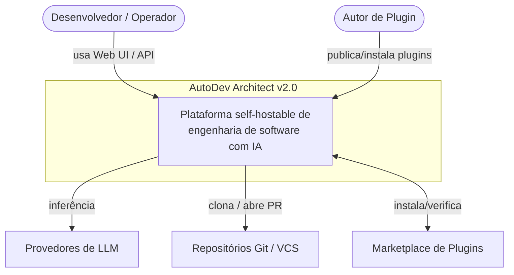

#### Diagrama de contêiner (C4 nível 2)

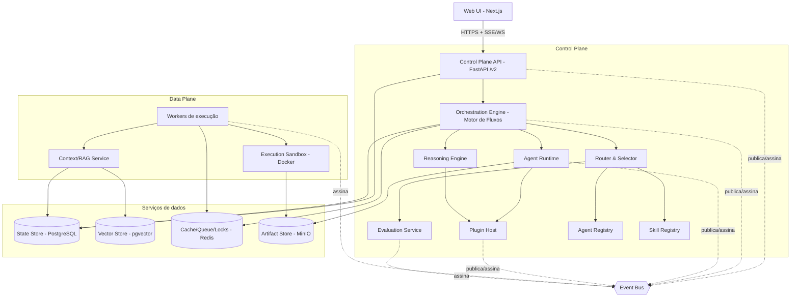

### 4.2 Separação Control Plane vs Data Plane

A arquitetura separa **decisão/coordenação** de **trabalho pesado/estado**,
conforme o glossário:

- **Control Plane** — Control Plane API, Orchestration Engine, Agent Runtime,
  Plugin Host, Reasoning Engine, Router & Selector, Evaluation Service e os
  registries (Agent/Skill). Aqui vivem autenticação, RBAC, políticas, seleção,
  checkpointing e a coordenação dos runs. É stateless na medida do possível: o
  estado durável reside no State Store; a coordenação efêmera usa Redis.
- **Data Plane** — Context/RAG Service, Execution Sandbox, workers de execução e
  os serviços de dados (PostgreSQL, pgvector, Redis, MinIO). Aqui ocorre o
  trabalho intensivo: indexação (tree-sitter/embeddings), recuperação híbrida,
  aplicação de **Patch** e execução de **Validation Gates** em sandbox.

Essa separação permite escalar horizontalmente os **workers de execução** de
forma independente da API (meta de ≥ 100 runs concorrentes por nó de referência,
seção 6 do brief), isolar falhas do plano de dados e aplicar limites de
segurança distintos (o Data Plane roda sandbox **sem rede por padrão** e com
permissões explícitas). O Control Plane nunca executa código não confiável de
plugins ou de repositórios diretamente; ele delega ao Data Plane, que o confina.

A fronteira entre os planos é atravessada de duas formas: (1) **comandos**
síncronos via contratos tipados (a API/Engine enfileira jobs no Redis) e (2)
**eventos** assíncronos pelo Event Bus. Isso mantém o Control Plane responsivo
(meta de p95 < 300 ms em leituras) enquanto o Data Plane processa runs longos.

### 4.3 Event Bus e fluxo de eventos

O **Event Bus** é o barramento de eventos assíncronos entre subsistemas e
plugins. Ele é o mecanismo primário de desacoplamento e a base da
**observabilidade nativa**: todo run/step/decisão emite eventos que alimentam
traços, métricas, o stream de UI (SSE/WebSocket) e o **event store** durável
(E8), permitindo **replay** determinístico a partir do estado persistido.

- **Nomenclatura** (seção 7 do brief): eventos seguem `dominio.entidade.acao`
  no passado, ex.: `flow.run.started`, `run.step.completed`, `plugin.installed`.
- **Entrega**: publicação/assinatura desacoplada; consumidores incluem workers,
  Evaluation Service, coletores de telemetria e plugins que assinam **Gatilhos**
  (`Trigger`) para iniciar fluxos.
- **Catálogo de eventos** versionado é entregue em **E9**; a persistência
  ordenada (event store) e a durabilidade em **E8**.
- **Governança e tenant**: cada evento carrega `tenant_id`, `session_id`,
  `run_id` e o contexto de trace (E11) para correlação e isolamento.

O Event Bus tem implementação progressiva: no modo local pode ser um broker
in-process; em produção usa Redis (streams/pub-sub) como transporte de
`Cache/Queue/Locks`, mantendo o mesmo contrato de eventos.

### 4.4 Ciclo de vida de uma requisição / sessão / run

Uma **Sessão** agrupa **Runs** e histórico; um **Run** é a execução concreta de
um **Fluxo**, composta por **Steps** (ativações de nós/agents). O ciclo de vida
canônico de um run — planejar → codificar → aplicar patch → validar → avaliar —
atravessa Control Plane e Data Plane e é totalmente rastreado no Event Bus.

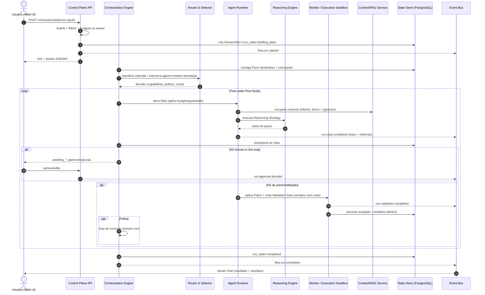

Pontos-chave do ciclo:

- **Estados duráveis**: o `run_state`/`step_state` (ex.: `drafting_plan`,
  `awaiting_plan_approval`, `running_validation`, `completed`, `failed`) são
  persistidos no State Store, garantindo determinismo e replay.
- **Failing closed**: budgets (tokens/custo/tempo/passos) e guardrails são
  aplicados no Agent Runtime; ao esgotar um budget, o run falha fechado.
- **Streaming**: o início do streaming de um run deve ocorrer em < 1 s (seção 6
  do brief), servido a partir dos eventos do Event Bus.

### 4.5 Pontos de extensão e onde se encaixam

Coerente com o princípio "toda capacidade central é um ponto de extensão", cada
subsistema expõe **Extension Points** tipados e versionados (SemVer, `hostApi`),
habitados por **Plugins** carregados pelo **Plugin Host**:

| Ponto de extensão | Habita | Contrato/Manifest |
|---|---|---|
| Agent | Agent Runtime / Agent Registry | `agent.yaml` (Agent Manifest) |
| Skill | Agent Runtime / Skill Registry | `skill.yaml` (Skill Manifest) |
| Reasoning Strategy | Reasoning Engine | política + budgets |
| Router / Selector | Router & Selector | política declarativa |
| Evaluator | Evaluation Service | `eval.yaml` |
| Context Provider / Retriever | Context/RAG Service | contrato de recuperação |
| Flow / Flow Node | Orchestration Engine | `flow.yaml` |
| Painel de UI | Web UI | contrato de painel |

Todo plugin roda com **menor privilégio**: permissões explícitas no
`plugin.yaml`, isolamento pelo Plugin Host e — quando executa código — dentro do
Execution Sandbox. O **SDK** (Python/TS) fornece os contratos, scaffolding e
utilitários; **contract tests** obrigatórios (E12) garantem a estabilidade das
interfaces. A publicação/instalação/verificação de plugins é entregue pelo
**Marketplace** (E13).

### 4.6 Modos de implantação

A mesma base roda do laptop ao cluster (local-first, produção-ready), variando
apenas a materialização dos serviços de dados e do transporte de eventos:

- **Local (single-process, sem dependências externas)** — Control Plane API +
  Orchestration Engine no mesmo processo; **SQLite** como State Store, provider
  de LLM "stub", Event Bus in-process, artefatos no sistema de arquivos e
  sandbox opcional. Alvo de onboarding em minutos, sem Docker obrigatório.
- **docker-compose (self-host de referência)** — serviços separados:
  Control Plane API, workers de execução, **PostgreSQL + pgvector**, **Redis**,
  **MinIO** e Web UI. É o modo recomendado para times pequenos e para avaliar a
  plataforma com o stack completo.
- **Kubernetes (produção multi-tenant)** — API e workers como deployments
  escaláveis independentemente (HPA sobre profundidade de fila no Redis);
  PostgreSQL/pgvector gerenciado, Redis e MinIO como serviços; Execution
  Sandbox com política de rede restritiva; OpenTelemetry/Prometheus/Grafana/Loki
  para observabilidade (E11). Suporta RBAC obrigatório, tenants e quotas.

O upgrade entre modos é progressivo e **sem reescrita**: trocar SQLite por
PostgreSQL, o Event Bus in-process por Redis e o FS local por MinIO é uma
mudança de configuração, não de código — condição garantida por **E0** (migração
PostgreSQL como padrão) e **E8** (persistência multi-tenant e migrações
versionadas).

### 4.7 Critérios não-funcionais arquiteturais

A arquitetura é desenhada para atender as metas globais do brief (seção 6):

- **Latência** — Control Plane stateless + leituras servidas do State Store com
  cache Redis: p95 < 300 ms em leituras; início de streaming de run < 1 s via
  Event Bus.
- **Disponibilidade** — SLO 99.9% do Control Plane; API sem estado local permite
  réplicas atrás de balanceador; workers reprocessam jobs idempotentes.
- **Escalabilidade** — separação Control/Data Plane e filas no Redis permitem
  escalar workers horizontalmente (≥ 100 runs concorrentes por nó de
  referência).
- **Segurança e menor privilégio** — RBAC obrigatório em produção; plugins com
  permissões explícitas; sandbox sem rede por padrão; secrets fora do Control
  Plane (E11).
- **Confiabilidade de dados** — State Store como sistema de registro; event
  store para replay; migrações versionadas e reversíveis; RPO ≤ 5 min,
  RTO ≤ 30 min (E8/E11).
- **Custo governado** — budgets por run e quotas por tenant; medição de
  tokens/custo emitida como eventos e agregada por tenant.
- **Observabilidade e determinismo** — OpenTelemetry ponta a ponta com
  correlação por `tenant_id`/`session_id`/`run_id`; todo run reproduzível a
  partir do estado persistido.

Em conjunto, estes critérios expressam a tese arquitetural da v2.0: um **núcleo
pequeno e estável** que coordena, planos separados que escalam e se isolam, e um
Event Bus que torna o comportamento observável, extensível e reproduzível.


---

## 5. Sistema de Plugins e Extensibilidade

O Sistema de Plugins é o coração da promessa de arquitetura da v2.0: **núcleo pequeno, bordas ricas**. Toda capacidade central — agents, skills, tools, estratégias de reasoning, roteamento/seleção, avaliação, contexto/RAG, portões de validação, painéis de UI e handlers de eventos — é exposta como um **Ponto de Extensão (Extension Point)** tipado que um **Plugin** versionado pode implementar. O **Plugin Host** descobre, carrega, isola e gerencia o ciclo de vida desses plugins, mediando o acesso ao **Host API** por meio de um modelo de permissões/capabilities explícito.

Esta seção é a especificação normativa do **épico E1 — Núcleo de Plugins & SDK**. Ela define a taxonomia dos pontos de extensão, o formato do **Manifesto de plugin** (`plugin.yaml`), o ciclo de vida, o isolamento/sandbox, o versionamento e a matriz de compatibilidade, o SDK/DX do autor e as estratégias de carregamento, encerrando com critérios funcionais e não-funcionais.

> Base atual (v1): os "seams" aditivos de auto-descoberta (`backend/api/routers/__init__.py::include_all_routers`, `backend/agents/registry.py`, `backend/cli_plugins/__init__.py`) já provam o padrão de "nova capacidade = novo arquivo em diretório observado, sem tocar arquivos quentes". A v2.0 generaliza esses seams para um Plugin Host único com contratos tipados, permissões, versionamento e isolamento.

### 5.1 Taxonomia de pontos de extensão

Cada Ponto de Extensão é uma interface SemVer do core (contrato tipado). Um único plugin pode habitar vários pontos ao mesmo tempo. A tabela abaixo é a taxonomia canônica.

| Ponto de extensão | Contrato (kind) | Subsistema host | O que o plugin fornece | Épico relacionado |
|---|---|---|---|---|
| **Agents** | `agent` | Agent Runtime + Agent Registry | Unidade autônoma com Agent Manifest (capabilities, IO schema, tools/skills, política, budgets) | E2 |
| **Skills** | `skill` | Skill Registry | Função reutilizável (determinística ou assistida por LLM) com Skill Manifest | E6 |
| **Tools** | `tool` | Agent Runtime | Chamada de função de baixo nível exposta a agents (ler arquivo, rodar comando) | E2 |
| **Reasoning strategies** | `reasoning` | Reasoning Engine | Estratégia plugável (ReAct, Plan-and-Execute, Reflection, Debate/ToT) | E4 |
| **Routers/Selectors** | `router` / `selector` | Router & Selector | Classificação de intenção (Router) e escolha de agent/modelo/estratégia (Selector) | E5 |
| **Evaluators** | `evaluator` | Evaluation Service | Pontuação de saídas/decisões (rubrica, LLM-as-judge, métrica) | E5 / E12 |
| **Context providers / Retrievers** | `context_provider` / `retriever` | Context/RAG Service | Fornecimento de contexto (arquivos, símbolos, memória) e recuperação léxica/vetorial | E7 |
| **Validation gates** | `validation_gate` | Execution Sandbox + Orchestration Engine | Portão de qualidade (lint/testes/cobertura/segurança) executado em sandbox | E3 / E12 |
| **Painéis de UI** | `ui_panel` | Web UI (Next.js) | Painel/rota/widget declarado por manifesto, montado via slot registrado | E10 |
| **Event handlers** | `event_handler` | Event Bus | Assinatura de eventos `dominio.entidade.acao` e reação assíncrona | E9 |

Regras transversais:

- Todo ponto de extensão tem um **contract test** obrigatório publicado pelo core (ver 5.7). Um plugin só é ativável se passar o contract test da versão de contrato que declara.
- Pontos de extensão são **compostos, não herdados**: um plugin declara os pontos que habita no manifesto; o core resolve e injeta o Host API correspondente com escopo mínimo.
- Fluxos (Flows), embora declarativos e versionados, são **conteúdo/config** publicável (não interface de código) e por isso não figuram como ponto de extensão de plugin — são consumidos pelo Orchestration Engine.

### 5.2 Manifesto de plugin (`plugin.yaml`)

O manifesto é o descritor declarativo único do plugin. Ele identifica, versiona, declara permissões e enumera os pontos de extensão fornecidos. Ids seguem `namespace/nome` em kebab-case; versão em SemVer; compatibilidade com o host declarada por faixa em `hostApi`.

```yaml
# plugin.yaml — manifesto completo de exemplo
schemaVersion: "1.0"                 # versão do schema do próprio manifesto

id: acme/coder-plus                  # namespace/nome (kebab-case), globalmente único
name: "Coder Plus"                   # nome legível para humanos
version: 2.3.1                       # SemVer MAJOR.MINOR.PATCH do plugin
description: >
  Agent de codificação com estratégia de reflection, retriever híbrido
  e um portão de validação de testes.
author:
  name: "ACME Engineering"
  email: "plugins@acme.example"
  url: "https://acme.example"
license: "Apache-2.0"
homepage: "https://github.com/acme/coder-plus"

# --- Compatibilidade host <-> plugin ---------------------------------------
compat:
  hostApi: ">=2.0 <3.0"              # faixa de versão do Host API (contratos do core)
  platform: ">=2.0.0"               # faixa de versão da plataforma AutoDev
  python: ">=3.11 <3.14"            # runtime exigido (para plugins in-process Python)
  contracts:                         # versão de cada contrato de ponto de extensão usado
    agent: "^1.2"
    reasoning: "^1.0"
    retriever: "^1.1"
    validation_gate: "^1.0"

# --- Estratégia de carregamento e isolamento -------------------------------
runtime:
  loader: in-process                 # in-process | subprocess | wasm
  entrypoint: "coder_plus:register"  # callable de registro (módulo:função)
  isolation: process                 # none | thread | process | container | wasm
  resources:                         # tetos aplicados pelo Plugin Host
    memory_mb: 512
    cpu_millis: 1000
    timeout_s: 120

# --- Modelo de permissões / capabilities -----------------------------------
# Menor privilégio: nada é concedido por padrão; tudo abaixo é explícito.
permissions:
  hostApi:                           # superfícies do Host API que o plugin pode chamar
    - registry.agents:read
    - context.retriever:read
    - events:subscribe
    - artifacts:write
  network:                           # egress; vazio => sem rede (padrão)
    egress:
      - "api.openai.com:443"
  filesystem:
    read:  ["${workspace}/src", "${workspace}/tests"]
    write: ["${workspace}/.autodev/cache"]
  secrets:                           # segredos declarados; injetados pelo host, nunca no manifesto
    - name: OPENAI_API_KEY
      required: true
  events:
    subscribe: ["run.step.completed", "flow.run.started"]
    publish:   ["plugin.coder_plus.suggestion.created"]

# --- Pontos de extensão fornecidos -----------------------------------------
extensionPoints:
  - kind: agent
    id: acme/coder-plus.agent
    contract: "^1.2"
    manifest: "agent.yaml"           # Agent Manifest detalhado (capabilities, IO schema, budgets)
    capabilities: ["code.generate", "code.refactor", "test.write"]
  - kind: reasoning
    id: acme/coder-plus.reflection
    contract: "^1.0"
    strategy: reflection
  - kind: retriever
    id: acme/coder-plus.hybrid
    contract: "^1.1"
    mode: hybrid                     # lexical + vetorial (pgvector)
  - kind: validation_gate
    id: acme/coder-plus.pytest-gate
    contract: "^1.0"
    runsIn: sandbox                  # executa no Execution Sandbox (Docker endurecido)
  - kind: ui_panel
    id: acme/coder-plus.panel
    contract: "^1.0"
    slot: "run.detail.sidebar"       # slot de montagem registrado pela Web UI
    entry: "ui/panel.js"

# --- Dependências ----------------------------------------------------------
dependencies:
  plugins:                           # outros plugins exigidos, por faixa SemVer
    - id: autodev/skill-fs
      version: "^1.4"
  python:                            # libs de terceiros (resolvidas em ambiente isolado)
    - "unidiff>=0.7,<1.0"

# --- Configuração exposta ao operador (validada por JSON Schema) -----------
config:
  schema: "config.schema.json"
  defaults:
    max_reflection_rounds: 3
    temperature: 0.2

# --- Assinatura / proveniência (verificada no Marketplace, E13) ------------
signing:
  publisher: "acme"
  fingerprint: "sha256:…"
```

Campos obrigatórios mínimos: `schemaVersion`, `id`, `version`, `compat.hostApi`, `runtime.loader`, `runtime.entrypoint` e ao menos um item em `extensionPoints`. O Plugin Host **rejeita** manifestos que declarem qualquer permissão não reconhecida ou que omitam `compat.hostApi`.

### 5.3 Ciclo de vida

O Plugin Host gerencia o plugin através de cinco estágios: **descoberta → carregamento → ativação → hot-reload → desativação**. A descoberta ocorre por varredura de diretórios observados (evolução dos seams v1) e do registro instalado pelo Marketplace (E13). A ativação só ocorre após validação de manifesto, resolução de compatibilidade, concessão de permissões e aprovação nos contract tests.

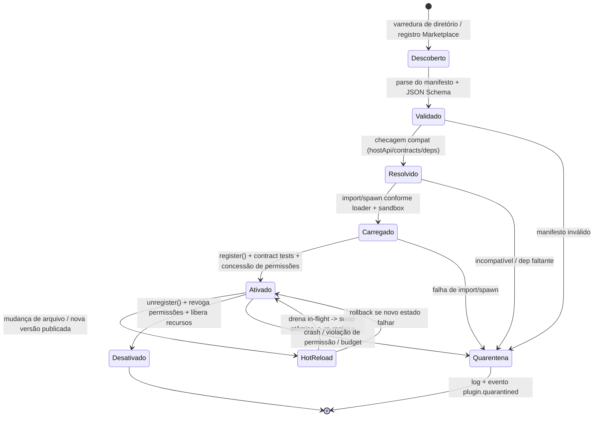

Notas de ciclo de vida:

- **Descoberta**: fontes são diretório local (`plugins/`), pacotes instalados e o registro do Marketplace. Cada fonte produz um manifesto candidato.
- **Carregamento**: para `in-process`, importa o módulo e resolve `entrypoint`; para `subprocess`/`wasm`, provisiona o worker isolado e estabelece o canal RPC.
- **Ativação**: chama `register(host)` passando um Host API com escopo restrito às permissões concedidas; executa contract tests; publica `plugin.activated`.
- **Hot-reload**: troca atômica com drenagem de trabalho em voo (in-flight). Falha na nova versão dispara **rollback** para a versão anterior. Runs ativos continuam determinísticos porque o estado durável não depende do binário do plugin.
- **Desativação**: `unregister()` remove os pontos de extensão do registro, revoga permissões e libera recursos; entidades já persistidas (traces, runs) permanecem.
- **Quarentena**: qualquer falha (manifesto, compat, crash, violação de permissão/budget) move o plugin para estado inativo e auditado — **falha fechado**, nunca derruba o host (mesma garantia do loader de routers v1).

Cada transição emite um evento no Event Bus (`plugin.discovered`, `plugin.activated`, `plugin.reloaded`, `plugin.deactivated`, `plugin.quarantined`) para observabilidade e auditoria.

### 5.4 Isolamento, sandbox e modelo de permissões

O princípio **isolamento e menor privilégio** é aplicado em duas camadas: isolamento de *execução* (onde o código roda) e controle de *capacidades* (o que o código pode fazer).

- **Permissões negadas por padrão**: um plugin não tem rede, filesystem, segredos, eventos nem acesso ao Host API a menos que declarados em `permissions` e concedidos pelo operador/tenant na instalação. Toda chamada ao Host API passa por um **broker** que verifica a capability concedida antes de executar.
- **Capabilities escopadas**: permissões são granulares (`registry.agents:read`, `artifacts:write`, `events:subscribe`, egress por host:porta, paths de FS). Segredos nunca aparecem no manifesto; são referenciados por nome e injetados pelo host em tempo de execução.
- **Sandbox de execução**: código não confiável e validação rodam no **Execution Sandbox** (Docker endurecido), **sem rede por padrão**, com tetos de CPU/memória/tempo (`runtime.resources`). Validation gates sempre executam em sandbox.
- **Budgets e guardrails**: plugins que consomem LLM herdam budgets (tokens/custo/tempo/passos) do run; estouro é interrompido (falha fechado).
- **Auditoria**: toda concessão/uso de capability e toda violação são registradas como eventos e traços, alimentando RBAC/quotas por tenant (E11).

### 5.5 Versionamento e matriz de compatibilidade host↔plugin

O core expõe **contratos SemVer estáveis** (Host API e contratos por ponto de extensão). Plugins dependem de contratos, não de internals. As regras:

- **Host API** versionado globalmente; plugin declara faixa em `compat.hostApi` (ex.: `">=2.0 <3.0"`).
- **Contratos por ponto de extensão** versionados independentemente (ex.: `agent: ^1.2`). Um MAJOR de contrato é breaking; MINOR é aditivo/retrocompatível; PATCH é correção.
- **Resolução na ativação**: o Host recusa ativar se qualquer faixa não for satisfeita, movendo o plugin para Quarentena com diagnóstico.

Matriz de compatibilidade (semântica de resolução):

| Host API | Contrato `agent` | Plugin exige `hostApi` | Plugin exige `agent` | Resultado |
|---|---|---|---|---|
| 2.1 | 1.3 | `>=2.0 <3.0` | `^1.2` | Compatível (ativa) |
| 2.5 | 1.3 | `>=2.0 <3.0` | `^1.4` | Incompatível (contrato agent < exigido) → Quarentena |
| 3.0 | 2.0 | `>=2.0 <3.0` | `^1.2` | Incompatível (host MAJOR) → Quarentena |
| 2.2 | 1.5 | `>=2.2 <3.0` | `^1.2` | Compatível (MINOR aditivo cobre `^1.2`) |

Deprecações seguem política de janela: um contrato marcado `deprecated` continua funcional por ao menos um ciclo MINOR antes de ser removido em MAJOR, com aviso emitido em `plugin.compat.deprecated`.

### 5.6 Estratégias de carregamento (trade-offs)

O campo `runtime.loader` seleciona o modelo de execução. A escolha equilibra desempenho, isolamento e linguagem do autor.

| Loader | Isolamento | Latência/overhead | Linguagens | Blast radius | Quando usar |
|---|---|---|---|---|---|
| **in-process** | Baixo (thread/GIL do host) | Mínimo (chamada direta) | Python (host) | Alto — crash pode afetar o host | Plugins confiáveis/first-party, hot paths (retrievers, selectors) |
| **out-of-process / subprocess** | Alto (processo separado, cgroups) | Médio (IPC/RPC, serialização) | Qualquer (poliglota) | Contido — crash isola no worker | Plugins de terceiros, código não confiável, tools que executam comandos |
| **WASM** | Muito alto (sandbox capability-based) | Baixo-médio (sem sistema de arquivos/rede salvo import) | Rust/Go/AssemblyScript → WASM | Mínimo — sandbox determinístico | Plugins não confiáveis com necessidade de portabilidade e determinismo forte |

Trade-offs principais: **in-process** maximiza desempenho mas exige confiança (roda no processo do host); **subprocess** dá isolamento forte e suporte poliglota ao custo de IPC; **WASM** oferece o sandbox mais rígido e determinístico, porém limita bibliotecas e I/O. A recomendação v2.0: **in-process apenas para plugins first-party assinados**; **subprocess como padrão** para terceiros; **WASM** para o caminho de máxima segurança/portabilidade do Marketplace. Independentemente do loader, permissões e budgets são aplicados pelo broker do Host API.

### 5.7 SDK e experiência do autor (DX)

O **SDK** (Python e TypeScript para painéis de UI) reduz o atrito de autoria e garante conformidade com os contratos.

- **Scaffolding**: `autodev plugin new <namespace/nome>` gera esqueleto com `plugin.yaml`, `entrypoint`, `config.schema.json`, testes e workflow de CI.
- **Contratos tipados**: o SDK exporta as interfaces de cada ponto de extensão (types/protocols), de modo que o autor implemente contra o contrato, com autocompletar e checagem estática.
- **Testes locais**: `autodev plugin test` roda o plugin contra um host efêmero (local-first, SQLite + provider stub) sem infraestrutura externa.
- **Contract tests**: cada ponto de extensão vem com um conjunto de contract tests publicado pelo core; `autodev plugin verify` executa esses testes e é **gate obrigatório** de ativação e de publicação no Marketplace (E12/E13).
- **Empacotamento/publicação**: `autodev plugin package` valida manifesto, resolve deps, assina o artefato e produz o pacote instalável; `autodev plugin publish` envia ao Marketplace com verificação de assinatura (E13).
- **Inspeção**: `autodev plugin inspect` mostra pontos de extensão, permissões exigidas e compat resolvida antes da instalação.

### 5.8 Critérios de aceite

**Funcionais**

- FR-1: O Plugin Host descobre, valida, carrega, ativa, hot-reloada e desativa plugins a partir de manifesto `plugin.yaml`, sem reiniciar o processo do host.
- FR-2: Um único plugin pode habitar múltiplos pontos de extensão declarados; cada um é registrado no subsistema/registry correto.
- FR-3: Ativação é bloqueada e o plugin vai para Quarentena se manifesto for inválido, compat não resolver, dependência faltar ou contract test falhar — sempre com diagnóstico e evento.
- FR-4: Permissões são negadas por padrão e concedidas explicitamente; toda chamada ao Host API é verificada pelo broker contra as capabilities concedidas.
- FR-5: Hot-reload troca a versão atomicamente, drenando trabalho em voo, com rollback automático em falha; runs em andamento permanecem determinísticos.
- FR-6: Suporte aos três loaders (in-process, subprocess, WASM) com aplicação uniforme de permissões/budgets.
- FR-7: SDK oferece scaffolding, testes locais, contract tests, empacotamento assinado e inspeção; contract tests são gate de ativação e de publicação.

**Não-funcionais**

- NFR-1 (segurança): plugins rodam com menor privilégio; sandbox sem rede por padrão; segredos nunca no manifesto; RBAC/quotas por tenant aplicáveis à instalação e ao uso (E11).
- NFR-2 (isolamento/robustez): falha de qualquer plugin nunca derruba o host (falha fechado); blast radius limitado pelo loader escolhido.
- NFR-3 (compatibilidade): contratos SemVer estáveis; resolução de compat determinística; janela de deprecação de ao menos um ciclo MINOR.
- NFR-4 (desempenho): overhead de resolução/broker de permissão insignificante em hot paths in-process; contract tests do core executam em CI dentro do orçamento de tempo do épico E12.
- NFR-5 (observabilidade): cada transição de ciclo de vida e cada violação de permissão/budget emite evento e traço auditável.
- NFR-6 (cobertura/qualidade): contract tests obrigatórios para todos os pontos de extensão; núcleo do Plugin Host ≥ 85% de cobertura de linhas.
- NFR-7 (DX/local-first): autor consegue criar, testar e verificar um plugin em ambiente local sem dependências externas.

Este sistema materializa o **épico E1 — Núcleo de Plugins & SDK** e é a fundação sobre a qual os épicos E2 (agents), E4 (reasoning), E5 (roteamento/avaliação), E6 (skills), E7 (context/RAG), E10 (painéis de UI) e E13 (Marketplace) entregam suas capacidades como plugins.


---

## 6. Framework de Agentes

Esta seção especifica o **Framework de Agentes** da v2.0, materializado no épico
**E2 — Framework de Agentes** e sustentado, em tempo de execução, pelo componente
canônico **Agent Runtime**. O objetivo é transformar o que na v1 são classes Python
acopladas ao orquestrador (ver `backend/agents/base.py`, `registry.py`,
`contracts.py`) em **agents-como-plugin**: unidades declarativas, versionadas e
descobríveis, com **contratos de IO tipados e estáveis**, executadas sob budgets e
guardrails, e adicionáveis **sem tocar no core** através do **Plugin Host** (E1).

### 6.1 Definição de Agent na v2

Conforme o glossário canônico, um **Agent** é uma *unidade autônoma que recebe uma
tarefa, raciocina e produz saída conforme seu contrato*. Na v2.0 essa definição é
reforçada por três invariantes:

1. **Declarativo antes de imperativo** — a identidade de um agent (id, versão,
   capabilities, contratos de IO, tools/skills permitidas, reasoning padrão, budgets,
   prompts e requisitos de contexto) vive em um **Agent Manifest** (`agent.yaml`),
   não em código. A implementação é apenas o *handler* que o runtime invoca.
2. **Contrato antes de implementação** — todo agent expõe um **contrato de IO
   tipado e versionado** (JSON Schema/Pydantic). O core depende do contrato, nunca
   dos internals do agent (Princípio 3).
3. **Executado, não auto-executor** — o agent não decide sozinho seus limites de
   custo, não acessa tools diretamente e não escolhe a si mesmo. Quem instancia,
   aplica **budgets/guardrails** e **medeia o acesso a tools/skills** é o
   **Agent Runtime**; quem o escolhe é o **Selector** (E5); quem o orquestra é o
   **Orchestration Engine** (E3).

Comparação com a v1 (evolução, não ruptura):

| Aspecto | v1 (atual) | v2.0 (alvo) |
| --- | --- | --- |
| Identidade | `class`/`name` em código | `agent.yaml` versionado (SemVer) |
| Descoberta | decorator `@register_agent` + `discover_agents` | **Agent Registry** + **Plugin Host** |
| Contrato de saída | `AGENT_METADATA_MODELS` (Pydantic, não versionado) | contrato de IO tipado **e** versionado (`schemaVersion`) |
| Contexto | `AgentContext` (dataclass in-process) | **requisitos de contexto** declarados + Context/RAG Service (E7) |
| Reasoning | fixo dentro de `run()` | **Reasoning Strategy** plugável (E4) referenciada no manifest |
| Limites | implícitos | **budgets** (tokens/custo/tempo/passos) declarados, falha-fechado |
| Acesso a tools | acoplado ao agent | mediado por **Agent Runtime** com permissões explícitas |

### 6.2 Agent Manifest (`agent.yaml`)

O **Agent Manifest** é o descritor declarativo completo de um agent. Segue as
convenções canônicas: `id` no formato `namespace/nome` em kebab-case, `version` em
SemVer, e faixa de compatibilidade com o host (`hostApi`). O manifest é o único
artefato que o **Agent Registry** precisa para registrar, versionar e descobrir um
agent, e o único que o **Selector** precisa para casar tarefas via `capabilities`.

Exemplo COMPLETO — remodelagem do atual `coder` como plugin:

```yaml
# agent.yaml — manifesto completo de um agent v2.0
schemaVersion: "2.0"                 # versão do formato de manifest
kind: Agent

# --- Identidade ---
id: autodev/agent-coder              # namespace/nome, kebab-case (canônico)
version: 2.1.0                       # SemVer do agent
hostApi: ">=2.0 <3.0"                # faixa de compatibilidade com o core
displayName: "Coder Agent"
description: "Decompõe uma mudança em tarefas de código e gera patches."
license: Apache-2.0
maintainers: ["autodev-core"]
tags: ["engineering", "codegen", "patch"]

# --- Capabilities (rótulos/contratos que o Selector usa para casar tarefas) ---
capabilities:
  - id: code.implementation          # capability declarada
    level: primary                   # primary | secondary
    languages: ["python", "typescript", "go"]
  - id: code.refactor
    level: secondary

# --- Contrato de IO tipado e VERSIONADO ---
io:
  contract: autodev/coder-io         # id do contrato (registrado no Agent Registry)
  contractVersion: 1.2.0             # SemVer do contrato de IO
  input:
    $ref: "./contracts/coder.input.schema.json"
  output:
    $ref: "./contracts/coder.output.schema.json"
  # Failure mode: saída estruturada mesmo em erro (falha-fechado)
  onInvalidOutput: repair-then-fail  # repair-then-fail | fail | passthrough

# --- Tools e Skills permitidas (menor privilégio — Princípio 5) ---
permissions:
  tools:
    - id: fs.read                    # leitura de arquivos (sandbox)
    - id: fs.write
      constraints: { pathGlobs: ["src/**", "tests/**"] }  # guarda de path
    - id: patch.apply
      constraints: { dryRunFirst: true }
  skills:
    - id: autodev/skill-unified-diff # >=1.0 <2.0
      versionRange: ">=1.0 <2.0"
    - id: autodev/skill-test-scaffold
      versionRange: ">=0.3 <1.0"
  network: none                      # sandbox sem rede por padrão (canônico)

# --- Reasoning strategy padrão (plugável via E4) ---
reasoning:
  default: autodev/reasoning-plan-and-execute
  versionRange: ">=1.0 <2.0"
  allowOverrideBy: [selector, flow]  # quem pode sobrescrever a estratégia
  params:
    maxPlanSteps: 12
    reflection: true

# --- Budgets (tokens/custo/tempo/passos) — falha-fechado por padrão ---
budgets:
  tokens: { input: 120000, output: 16000 }
  costUsd: 0.75
  wallClockSeconds: 180
  maxSteps: 24
  maxToolCalls: 40
  onExceeded: fail-closed            # fail-closed | degrade | ask-human

# --- Prompts / templates (versionados junto ao manifest) ---
prompts:
  system:
    template: "./prompts/coder.system.md.j2"
    engine: jinja2
    variables: [goal, constraints, style_guide]
  user:
    template: "./prompts/coder.user.md.j2"
    engine: jinja2
    variables: [user_request, plan, context_bundle]
  fewShots: "./prompts/coder.fewshots.yaml"

# --- Requisitos de contexto (o que o agent precisa receber) ---
context:
  requires:
    - kind: repository.files         # via Context/RAG Service (E7)
      selector: { relatedTo: "task", topK: 20 }
      required: true
    - kind: symbols.tree-sitter
      required: false
    - kind: memory.long-term         # memória de longo prazo (ver 6.5)
      scope: session
      required: false
  budgetTokens: 60000                # teto de contexto injetado
  redaction: [secrets, pii]          # guardrails de contexto

# --- Memória (curto e longo prazo) ---
memory:
  shortTerm: { scope: run, ttl: run }          # descartada ao fim do run
  longTerm:  { scope: session, store: state }  # persistida no State Store

# --- Observabilidade (nativa — Princípio 6) ---
observability:
  emitTrace: true
  metrics: [tokens, costUsd, latencyMs, toolCalls, outputValid]
  redactPromptsInTrace: true

# --- Handler (implementação carregada pelo Plugin Host — E1) ---
entrypoint:
  runtime: python
  ref: "autodev_coder.agent:CoderAgent"   # classe que implementa o contrato
```

### 6.3 Contrato de IO tipado e versionado

Todo agent publica um **contrato de IO** com `schemaVersion`/`contractVersion`
independentes do código, registrado no **Agent Registry**. O contrato é a fronteira
estável entre core e agent (Princípio 3): o **Orchestration Engine** valida a
entrada antes de invocar e a saída depois de invocar; violações acionam
`onInvalidOutput`. Isso substitui `AGENT_METADATA_MODELS` da v1 por algo versionável
e language-agnostic.

Entrada — JSON Schema (`coder.input.schema.json`):

```json
{
  "$schema": "https://json-schema.org/draft/2020-12/schema",
  "$id": "autodev/coder-io/1.2.0/input",
  "title": "CoderInput",
  "type": "object",
  "additionalProperties": false,
  "required": ["schemaVersion", "task", "context"],
  "properties": {
    "schemaVersion": { "const": "1.2.0" },
    "task": {
      "type": "object",
      "required": ["goal"],
      "properties": {
        "goal": { "type": "string", "minLength": 1 },
        "constraints": { "type": "array", "items": { "type": "string" } },
        "plan": { "type": "array", "items": { "type": "string" } }
      }
    },
    "context": {
      "type": "object",
      "properties": {
        "files": {
          "type": "array",
          "items": {
            "type": "object",
            "required": ["path", "content"],
            "properties": {
              "path": { "type": "string" },
              "content": { "type": "string" }
            }
          }
        },
        "symbols": { "type": "array", "items": { "type": "string" } }
      }
    }
  }
}
```

Saída — contrato TypeScript equivalente (fonte da geração de tipos no SDK):

```typescript
/** autodev/coder-io — output contract v1.2.0 */
export interface CoderOutput {
  schemaVersion: "1.2.0";
  /** Modo do resultado: sempre estruturado, mesmo em erro (falha-fechado). */
  status: "ok" | "partial" | "error";
  codingTasks: CodingTask[];
  testUpdates: string[];
  touchedComponents: string[];
  /** Patch em diff unificado, aplicado com guarda de path + dry-run. */
  patch?: { format: "unified-diff"; content: string };
  /** Preenchido quando status !== "ok". */
  diagnostics?: Array<{ severity: "warn" | "error"; message: string }>;
}

export interface CodingTask {
  component: string;
  task: string;
}
```

**Versionamento do contrato** segue SemVer: adicionar campo opcional é MINOR;
remover/renomear campo ou apertar restrição é MAJOR. O Agent Registry mantém
múltiplas versões coexistindo, e o Orchestration Engine negocia a versão suportada
via `contractVersion` (compat retroativa dentro da mesma MAJOR).

### 6.4 Agent Registry — registro, descoberta e versionamento

O **Agent Registry** (componente canônico) é a fonte de verdade sobre quais agents
existem, em quais versões, com quais capabilities e contratos. Evolui o atual
`register_agent`/`discover_agents` (in-process, sem versão) para um registro durável
e multi-tenant no **State Store**.

Responsabilidades:

- **Registro**: ao instalar um plugin, o **Plugin Host** (E1) valida o `agent.yaml`
  contra o schema de manifest e o registra `(id, version)`; contratos de IO são
  registrados por `(contract, contractVersion)`.
- **Descoberta**: consulta por `id`, por `capability` (usada pelo **Selector** de
  E5), por `tag` ou por faixa de versão (`>=2.0 <3.0`).
- **Versionamento**: múltiplas versões coexistem; resolução por faixa SemVer;
  `latest` estável vs. `preview`. Depreciação marca versões e emite
  `agent.version.deprecated` no **Event Bus**.
- **Interface programática** (contrato do core, estável):

```python
class AgentRegistry(Protocol):
    def register(self, manifest: AgentManifest) -> AgentRef: ...
    def resolve(self, id: str, version_range: str = "*") -> AgentRef: ...
    def find_by_capability(self, capability: str) -> list[AgentRef]: ...
    def deprecate(self, id: str, version: str, reason: str) -> None: ...
```

### 6.5 Ciclo de vida e memória do agente

**Ciclo de vida** de um agent (governado pelo **Agent Runtime**):

1. **Resolve** — Selector/Flow pede `(id, versionRange)`; o Registry resolve a versão.
2. **Load** — o Plugin Host carrega o `entrypoint` isolado, com as permissões do manifest.
3. **Bind** — o Runtime injeta o **contexto requerido** (via Context/RAG Service),
   a memória, os proxies de tools/skills permitidas e a Reasoning Strategy.
4. **Validate-in** — a entrada é validada contra o contrato de IO.
5. **Reason/Act** — o agent raciocina sob a estratégia plugável, chamando tools/skills
   **sempre** através do Runtime (nunca diretamente), sob budgets e guardrails.
6. **Validate-out** — a saída é validada; violação aciona `onInvalidOutput`.
7. **Persist** — memória de longo prazo, trace, métricas e artefatos são gravados.
8. **Teardown** — memória de curto prazo é descartada; recursos liberados.

**Memória** (dois níveis, declarados no manifest e ligados ao State Store — E8):

- **Curto prazo** (`shortTerm`): escopo `run`/`step`, volátil; guarda estado de
  raciocínio, resultados intermediários de tools e o histórico local. Descartada no
  teardown. Substitui o `AgentContext.artifacts` in-process da v1 por algo governado.
- **Longo prazo** (`longTerm`): escopo `session`/`tenant`, persistida no **State
  Store**; fatos, preferências e resumos recuperáveis entre runs. Recuperação pode
  ser assistida pelo **Context/RAG Service** (E7) quando semântica. Acesso é sempre
  mediado pelo Runtime, com `redaction` de secrets/PII.

### 6.6 Acesso a tools/skills e guardrails via Agent Runtime

O **Agent Runtime** é o mediador obrigatório. Ele:

- **Injeta apenas** as tools/skills declaradas em `permissions`, como *proxies* que
  aplicam `constraints` (ex.: `pathGlobs`, `dryRunFirst`) — menor privilégio (Princípio 5).
- **Aplica budgets** por chamada e acumulados no run; ao exceder, executa
  `onExceeded` (padrão `fail-closed`, alinhado às metas não-funcionais globais).
- **Executa guardrails** de entrada, contexto e saída (segurança, formato, conteúdo);
  guardrails podem ser Guardrails-como-plugin.
- **Impõe isolamento**: `network: none` por padrão; execução de comandos vai ao
  **Execution Sandbox** endurecido.
- **Emite observabilidade**: cada step gera `run.step.*` no Event Bus, com trace e
  métricas para replay/auditoria (Princípios 6 e 7).

### 6.7 Adicionar um novo agent SEM tocar no core (via plugin, ligação a E1)

Um novo agent é entregue como **Plugin** (E1). O core nunca é modificado:

1. **Scaffold** com o **SDK**: `autodev plugin new agent acme/agent-reviewer` gera
   `plugin.yaml`, `agent.yaml`, `contracts/*.schema.json`, `prompts/*` e o handler.
2. **Declare** capabilities, contrato de IO, tools/skills permitidas, reasoning,
   budgets e requisitos de contexto no `agent.yaml`.
3. **Implemente** o handler contra o **Ponto de Extensão** `AgentHandler` (contrato
   tipado do SDK) — depende de contratos, não de internals do core.
4. **Empacote e assine**; publique no **Marketplace** (E13).
5. **Instale**: o **Plugin Host** descobre, valida o manifest, isola, aplica
   permissões e registra o agent no **Agent Registry**. A partir daí o **Selector**
   já pode casá-lo por capability, sem redeploy do core.

Ponto de extensão (SDK):

```python
class AgentHandler(Protocol):
    manifest: AgentManifest                     # carregado do agent.yaml
    def run(self, req: AgentRequest) -> AgentResponse: ...
    #  req.input já validado; req.tools/req.skills são proxies do Runtime;
    #  req.memory expõe short/long term; retorno é validado contra o contrato.
```

Isso substitui o mecanismo v1 de `@register_agent` + `discover_agents` (que exigia
importar módulos no processo do orquestrador) por instalação isolada e versionada.

### 6.8 Testes de contrato

Alinhado a **E12 — Qualidade & Evals** (contract tests obrigatórios para pontos de
extensão) e às metas não-funcionais (núcleo ≥ 85% de linhas):

- **Validação de manifest**: `agent.yaml` valida contra o JSON Schema do manifest;
  `id`, SemVer e `hostApi` conformes às convenções.
- **Conformidade de IO**: para cada versão de contrato, um *golden dataset* de
  entradas válidas/invalidas verifica que a entrada é aceita/rejeitada e que toda
  saída satisfaz o schema — inclusive o caminho de erro (`status: "error"` continua
  válido → falha-fechado).
- **Compatibilidade de versão**: um consumidor na MAJOR `1.x` deve continuar
  funcionando contra qualquer `1.y` (teste de retrocompatibilidade automatizado).
- **Permissões/budgets**: testes garantem que o Runtime nega tools não declaradas e
  interrompe ao exceder budget (`fail-closed`).
- **Registro**: registrar/resolver por faixa de versão e por capability tem cobertura.

Estes testes rodam como **quality gates** de CI (E12) e são pré-requisito de
publicação no Marketplace (E13).

### 6.9 Remodelagem dos agents atuais

Os agents da v1 (`planner`, `coder`, `security`/`validator`, etc., hoje em
`AGENT_METADATA_MODELS`) passam a ser plugins com manifest e contrato próprios:

| Agent v1 | id v2 | capabilities | contrato de IO | reasoning padrão |
| --- | --- | --- | --- | --- |
| planner | `autodev/agent-planner` | `planning.decompose` | `planner-io` (`steps[]`) | `plan-and-execute` |
| coder | `autodev/agent-coder` | `code.implementation`, `code.refactor` | `coder-io` (tasks + patch) | `plan-and-execute` + reflection |
| security | `autodev/agent-security` | `security.review` | `security-io` (findings + severity) | `reflection` |
| validator | `autodev/agent-validator` | `validation.plan` | `validator-io` (steps + criteria) | `react` |

Notas de migração:

- **planner**: `PlannerOutput.steps` vira `planner-io v1.0.0`; ganha budgets e
  contexto declarado (goal + repo summary).
- **coder**: absorve `CoderOutput` (coding_tasks, test_updates, touched_components) e
  passa a emitir `patch` (diff unificado) mediado por `patch.apply` com `dryRunFirst`.
- **security**: novo agent de `security.review` com guardrails fortes, `network:
  none`, e contrato de findings com severidade; alimenta **Validation Gates**.
- **validator**: `ValidatorOutput` (validation_steps, success_criteria) vira
  `validator-io`; passos executáveis rodam no **Execution Sandbox**, ligando o agent
  aos **Validation Gates** (lint/testes/cobertura/segurança).

### 6.10 Critérios funcionais e não-funcionais

**Funcionais (FR):**

- **FR1** — Um agent é totalmente definido por `agent.yaml`; nenhuma mudança de core
  é necessária para adicionar/remover/versionar um agent.
- **FR2** — Toda invocação valida entrada e saída contra o contrato de IO versionado.
- **FR3** — O Agent Registry permite registrar, descobrir (por id/capability/tag/faixa)
  e depreciar agents, com múltiplas versões coexistindo.
- **FR4** — O Runtime injeta apenas tools/skills declaradas e aplica seus constraints.
- **FR5** — Agents expõem memória de curto e longo prazo com escopos declarados.
- **FR6** — Selector casa tarefas a agents por capability (integração com E5).

**Não-funcionais (NFR):**

- **NFR1 — Segurança**: menor privilégio; `network: none` por padrão; permissões
  explícitas; RBAC obrigatório em produção; `redaction` de secrets/PII.
- **NFR2 — Custo/Budgets**: budgets de tokens/custo/tempo/passos por agent e por run,
  com padrão **falha-fechado**; medição por run/tenant.
- **NFR3 — Estabilidade de contratos**: SemVer nos manifests e contratos de IO;
  retrocompatibilidade garantida dentro da MAJOR; contract tests obrigatórios.
- **NFR4 — Observabilidade/Replay**: todo step emite trace, métricas e eventos
  (`run.step.*`); execuções reproduzíveis a partir do estado persistido.
- **NFR5 — Isolamento**: falha ou erro de um agent/plugin não derruba o core nem os
  demais agents (carregamento isolado pelo Plugin Host).
- **NFR6 — Desempenho**: overhead do Runtime (validação + mediação) não deve
  comprometer o alvo global de início de streaming de um run < 1 s.
- **NFR7 — Portabilidade**: mesmo manifest roda local-first (SQLite/stub) e em
  produção (PostgreSQL/pgvector/Redis/MinIO) sem alterações.

Este framework é a espinha dorsal do épico **E2** e o principal cliente do
**Plugin Host** e do SDK definidos em **E1**, consumindo Reasoning (E4), Roteamento/
Seleção/Avaliação (E5), Skills (E6), Context/RAG (E7) e Persistência (E8) através de
contratos estáveis.


---

## 7. Motor de Fluxos e Orquestração

O **Orchestration Engine (Motor de Fluxos)** é o subsistema do Control Plane que
executa **Fluxos** — grafos declarativos e versionados que coordenam Agents,
Skills, Tools e decisões humanas. Ele materializa a capacidade central do épico
**E3 — Motor de Fluxos** e é a evolução direta do uso atual de LangGraph no
`OrchestratorService` (hoje um grafo linear fixo, compilado em
`backend/orchestrator/service.py::_compile_graph`, com um esboço de roteamento
condicional em `backend/orchestrator/routing.py`/`graphs.py`).

O princípio norteador é **fluxo-como-configuração** (Princípio 2): a topologia,
o roteamento, os budgets, os retries e os pontos de intervenção humana vivem em
um artefato `flow.yaml` versionado, não em código Python. O core apenas
interpreta, executa e persiste; o comportamento cresce nas bordas via Agents
(E2), Skills (E6), Reasoning (E4) e Router/Selector (E5).

### 7.1. Fluxo-como-configuração (declarativo e versionado)

Um Fluxo é um documento `flow.yaml` que descreve um DAG (com ciclos controlados
permitidos para loops de reflexão/retry). Suas características:

- **Declarativo**: nós, arestas, gatilhos, políticas e handlers de erro são
  dados, não imperativo. O mesmo documento é lido pelo motor de execução, pelo
  **editor visual** (E10) e pelas ferramentas de validação/lint.
- **Versionado**: cada Fluxo tem `id` (`namespace/nome`, kebab-case) e `version`
  (**SemVer**). Publicar uma nova versão nunca muta uma existente; **Runs** em
  andamento continuam presos à versão com que iniciaram (imutabilidade de
  execução → habilita replay determinístico).
- **Contratado**: declara `hostApi` (faixa SemVer do core que suporta),
  `inputs`/`outputs` com JSON Schema, e as capabilities/skills que consome. O
  motor recusa carregar um Fluxo cujo `hostApi` seja incompatível.
- **Portável**: `flow.yaml` é um recurso do **Marketplace** (E13) e pode ser
  instalado, herdado e reutilizado como **sub-fluxo**.

### 7.2. Modelo de grafo/DAG

O estado do Fluxo (**Flow State**) é um documento tipado, versionado por
`schemaVersion`, propagado e reduzido (merge) entre nós — generalização do
`AgentGraphState` atual. Cada nó lê e produz um _patch_ do estado; o motor aplica
reducers determinísticos para permitir replay.

#### Tipos de Nó de Fluxo

| Tipo | Papel | Consome | Emite |
|------|-------|---------|-------|
| `agent` | Ativa um Agent do **Agent Registry** por capability/id (E2) | tarefa + contexto | saída tipada, artefatos |
| `tool` | Invoca uma Tool de baixo nível (ler arquivo, rodar comando) | args | resultado |
| `skill` | Invoca uma Skill versionada do **Skill Registry** (E6) | args tipados | saída tipada |
| `conditional` | Roteia via predicado/expressão sobre o Flow State | estado | escolha de aresta |
| `router` | Delega a decisão de caminho ao **Router & Selector** (E5) | intenção/tarefa | rota escolhida |
| `human` | **Human-in-the-loop**: pausa aguardando decisão/edição | proposta | aprovação/edição/rejeição |
| `subflow` | Executa outro Fluxo versionado como nó (reuso) | inputs mapeados | outputs mapeados |
| `map` | Fan-out: aplica um nó/sub-fluxo sobre uma coleção | lista | resultados paralelos |
| `reduce` | Fan-in: agrega os resultados de um `map` | resultados | agregado |
| `parallel` | Ramos concorrentes com junção (join) | estado | merges |
| `timer` | Espera/agenda (delay, deadline, cron interno) | — | continuação |
| `noop`/`terminal` | Marcadores de início/fim (`START`/`END`) | — | — |

#### Arestas, gatilhos e timers

- **Arestas condicionais**: cada aresta pode carregar um predicado (`when:`)
  avaliado sobre o Flow State por um expression engine **sandboxed**
  (subconjunto seguro, sem I/O, sem acesso a rede). A primeira aresta cujo
  predicado é verdadeiro (ou `default`) é seguida. Ciclos são permitidos, porém
  limitados por `maxIterations` e por **Budget** de passos/tempo (fail-closed).
- **Gatilhos (triggers)**: iniciam um Run. Tipos: `message` (chat/sessão),
  `webhook` (HTTP assinado), `cron` (agendado), `event` (assinatura de tópico do
  **Event Bus**, ex.: `run.step.completed`). Todo gatilho emite
  `flow.run.started`.
- **Timers**: `timer` para atrasos/deadlines; `timeout` por nó e por Run; SLA
  por nó `human` (escalar/expirar). Timers são duráveis (sobrevivem a reinícios
  do worker via checkpoint).

### 7.3. Exemplo completo de `flow.yaml`

```yaml
schemaVersion: "2.0"
id: autodev/flow-repo-change
version: "2.1.0"
hostApi: ">=2.0 <3.0"
name: "Mudança em repositório existente"
description: >
  Planeja, codifica, aplica patch, valida em sandbox e avalia uma mudança,
  com aprovação humana antes de mesclar e rollback em caso de falha.

inputs:
  schema:
    type: object
    required: [repo, task]
    properties:
      repo: { type: string }
      task: { type: string }
      branch: { type: string, default: "main" }
outputs:
  schema:
    type: object
    properties:
      pr_url: { type: string }
      status: { type: string, enum: [merged, rejected, failed] }

# Configuração global de execução (herdável por nó)
defaults:
  timeout: "10m"
  retry:
    maxAttempts: 3
    backoff: { strategy: exponential, initialDelay: "2s", maxDelay: "1m", jitter: true }
    retryOn: [transient_error, rate_limited, timeout]
  budgets:
    tokens: 400000
    costUsd: 5.00
    wallClock: "45m"
    steps: 60

triggers:
  - type: message
    channel: session
  - type: webhook
    path: "/v2/flows/autodev/flow-repo-change/hooks/run"
    auth: hmac
  - type: event
    topic: "repo.push.received"

# Nós do grafo
nodes:
  - id: plan
    type: agent
    agent: { capability: "planning", selector: "cheapest-capable" }
    inputs: { goal: "${inputs.task}", repo: "${inputs.repo}" }
    reasoning: { strategy: "plan-and-execute" }

  - id: route
    type: router
    router: autodev/router-run-type
    outputs: { runType: "$.decision" }

  - id: code
    type: agent
    agent: { capability: "coding" }
    inputs: { plan: "${nodes.plan.output}", repo: "${inputs.repo}" }
    retry: { maxAttempts: 2, retryOn: [transient_error] }
    timeout: "15m"

  - id: apply_patch
    type: tool
    tool: autodev/tool-apply-patch
    inputs: { diff: "${nodes.code.output.patch}", branch: "${inputs.branch}", dryRun: false }
    onError:
      compensate: rollback_patch      # dispara nó de compensação

  - id: validate
    type: subflow
    subflow: { id: autodev/flow-validation-gate, version: ">=1.2 <2.0" }
    inputs: { repo: "${inputs.repo}", branch: "${inputs.branch}" }
    # roda lint/testes/cobertura/segurança na Execution Sandbox

  - id: gate
    type: conditional
    branches:
      - when: "${nodes.validate.output.passed} == true"
        to: evaluate
      - when: "${nodes.validate.output.passed} == false && ${state.iteration} < 2"
        to: code                      # loop de correção (ciclo controlado)
        effect: { increment: "state.iteration" }
      - default: true
        to: rollback_patch

  - id: evaluate
    type: agent
    agent: { capability: "evaluation" }   # Evaluation Service (E5)
    inputs: { patch: "${nodes.code.output.patch}", results: "${nodes.validate.output}" }

  - id: human_review
    type: human
    role: "reviewer"                       # exige RBAC 'reviewer'
    prompt: "Aprovar merge do patch?"
    present:
      - { kind: diff, value: "${nodes.code.output.patch}" }
      - { kind: report, value: "${nodes.evaluate.output.score}" }
    options: [approve, request_changes, reject]
    sla: { deadline: "24h", onExpire: reject }

  - id: merge
    type: tool
    tool: autodev/tool-merge-pr
    inputs: { branch: "${inputs.branch}" }
    outputs: { pr_url: "$.url" }

  - id: rollback_patch
    type: tool
    tool: autodev/tool-revert-patch
    inputs: { branch: "${inputs.branch}" }
    outputs: { status: "failed" }

  - id: notify_reject
    type: skill
    skill: { id: autodev/skill-notify, version: ">=1.0 <2.0" }
    inputs: { message: "Mudança rejeitada na revisão." }

# Arestas explícitas (as não-condicionais)
edges:
  - { from: START, to: plan }
  - { from: plan, to: route }
  - { from: route, to: code }
  - { from: code, to: apply_patch }
  - { from: apply_patch, to: validate }
  - { from: validate, to: gate }
  - { from: gate }                         # arestas via branches do nó
  - { from: evaluate, to: human_review }
  - from: human_review
    branches:
      - { when: "${nodes.human_review.output.decision} == 'approve'", to: merge }
      - { when: "${nodes.human_review.output.decision} == 'request_changes'", to: code }
      - { default: true, to: notify_reject }
  - { from: merge, to: END }
  - { from: rollback_patch, to: notify_reject }
  - { from: notify_reject, to: END }

# Compensação/rollback declarativa (saga)
compensation:
  - node: apply_patch
    with: rollback_patch                   # desfaz efeitos se um nó posterior falhar
```

### 7.4. Diagrama do grafo

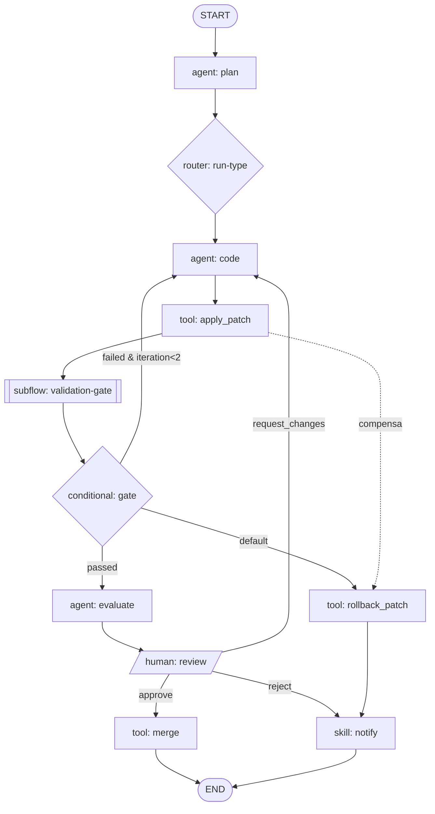

### 7.5. Motor de execução (evolução do LangGraph e generalização)

A v1 usa LangGraph com um `StateGraph` compilado a partir de uma ordem fixa de
agentes. A v2 **generaliza** isso em um interpretador de Fluxos com estas
responsabilidades:

1. **Compilação**: `flow.yaml` → grafo executável validado (schema, referências
   de nós/arestas, capabilities existentes no Registry, `hostApi`). LangGraph
   permanece como um _backend de execução_ possível atrás de uma interface
   `FlowExecutor` estável, mas a semântica (nós, budgets, compensação, human-in-
   the-loop) é definida pelo core, não pela lib.
2. **Escalonamento (scheduling)**: enfileira nós prontos (dependências
   satisfeitas) em **Redis**; workers do **Data Plane** os consomem, permitindo
   paralelismo (`parallel`, `map`) e escala horizontal (≥ 100 Runs concorrentes
   por nó de referência).
3. **Execução de nó**: cada tipo de nó tem um handler que medeia acesso ao
   **Agent Runtime**, **Skill Registry**, Tools ou Router/Selector, aplicando
   **Budgets** e **Guardrails**.
4. **Controle de erro**: `retry` (backoff exponencial com jitter), `timeout`,
   circuit-break por budget e disparo de **compensação** (saga) — desfazendo
   efeitos colaterais (ex.: `rollback_patch`) na ordem inversa.
5. **Observabilidade nativa** (Princípio 6): cada nó emite `Trace`/`Step` e
   eventos (`flow.run.started`, `run.step.completed`, `flow.run.completed`) no
   **Event Bus**, com métricas OpenTelemetry (E11).

### 7.6. Persistência de estado, checkpointing, replay e resumo

Alinhado com E8 (**Persistência & Dados**) e o Princípio 7 (Determinismo e
replay):

- **Estado durável**: `Run`, `Step` e Flow State vivem no **State Store**
  (PostgreSQL; SQLite no modo local-first). Artefatos grandes (patches, logs,
  diffs) vão para o **Artifact Store (MinIO)**, referenciados por ponteiro.
- **Checkpointing**: após cada nó bem-sucedido (ou em pontos de barreira), o
  motor grava um **checkpoint** transacional (Flow State + cursor do grafo +
  versões de nós). Isso permite **resumo (resume)** de Runs após falha de worker
  ou reinício sem repetir trabalho concluído (idempotência por `step_key` +
  `attempt`, generalizando o `RunStep` atual).
- **Suspensão durável**: nós `human` e `timer` **suspendem** o Run (liberando o
  worker) e persistem um _wait token_. A retomada é disparada por evento (decisão
  humana, expiração de timer, webhook), sem manter processo vivo.
- **Replay determinístico**: como a versão do Fluxo é imutável e cada nó registra
  entradas/saídas no `Trace`, um Run pode ser **reexecutado** de qualquer
  checkpoint. Chamadas não-determinísticas (LLM, rede) são gravadas e podem ser
  **reproduzidas do trace** (record/replay) para depuração e auditoria.
- **RPO/RTO**: checkpoints frequentes sustentam a meta global RPO ≤ 5 min,
  RTO ≤ 30 min.

### 7.7. Editor visual de fluxos (UX, ligação com E10)

O **Web UI (Next.js)** oferece um editor visual que é uma projeção fiel do
`flow.yaml` (round-trip: YAML ⇄ canvas sem perda). Requisitos de UX (detalhados
em E10):

- **Canvas de grafo**: arrastar/soltar nós tipados (agent, tool, skill,
  condicional, humano, sub-fluxo, map/reduce, timer), conectar arestas e editar
  predicados de arestas condicionais com autocompletar sobre o schema do Flow
  State.
- **Paleta de recursos**: puxa capabilities do **Agent Registry**, Skills do
  **Skill Registry** e sub-fluxos disponíveis; validação em tempo real de
  contratos IO e `hostApi`.
- **Diff de versões e revisão**: comparar versões SemVer do Fluxo lado a lado;
  visualizar histórico e publicar nova versão sem mutar as anteriores.
- **Depuração/replay**: sobrepor um `Trace` de Run ao grafo, destacando o
  caminho percorrido, `Step`s com status/tentativas, custo/tokens por nó e
  pontos de human-in-the-loop; permitir "replay a partir daqui".
- **Acessibilidade**: WCAG 2.2 AA, navegação e edição do grafo 100% por teclado
  (Meta não-funcional global e Princípio 10).

### 7.8. Sub-fluxos, reutilização e versionamento

- **Sub-fluxos**: o nó `subflow` referencia outro Fluxo por `id` + faixa SemVer,
  mapeando `inputs`/`outputs` pelos schemas contratados. Isso encapsula padrões
  reutilizáveis (ex.: `autodev/flow-validation-gate`) e reduz duplicação.
- **Reutilização & Marketplace**: Fluxos e sub-fluxos são publicáveis/instaláveis
  via **Marketplace** (E13), com assinatura/verificação.
- **Versionamento** (Convenção 7): `id` = `namespace/nome` (kebab-case),
  `version` = SemVer. Regras: mudança incompatível de schema de IO ou remoção de
  nó exigido → **MAJOR**; novo nó/aresta opcional retrocompatível → **MINOR**;
  correção sem impacto de contrato → **PATCH**. Runs fixam a versão de início
  (imutabilidade). Referências por faixa (`>=1.2 <2.0`) resolvem para a maior
  versão compatível no momento da compilação.

### 7.9. Critérios de aceite

#### Funcionais

- **F1** — O motor compila e executa um `flow.yaml` válido contendo todos os
  tipos de nó (agent, tool, skill, conditional, router, human, subflow,
  map/reduce, parallel, timer).
- **F2** — Arestas condicionais roteiam com base em predicados sobre o Flow
  State; ramo `default` é seguido quando nenhum predicado casa.
- **F3** — Retries com backoff exponencial + jitter, timeouts por nó/Run e
  budgets (tokens/custo/tempo/passos) são aplicados e **falham fechado** ao
  estourar.
- **F4** — Compensação/rollback (saga) desfaz efeitos de nós já executados
  quando um nó posterior falha, na ordem inversa.
- **F5** — Nós `human` suspendem o Run duravelmente e retomam sob decisão,
  respeitando RBAC do papel e SLA/expiração.
- **F6** — Gatilhos `message`, `webhook`, `cron` e `event` iniciam Runs e emitem
  `flow.run.started`.
- **F7** — Sub-fluxos executam com mapeamento de IO contratado; incompatibilidade
  de `hostApi`/schema impede a compilação com erro claro.
- **F8** — Replay reexecuta um Run a partir de um checkpoint reproduzindo o
  `Trace`; resume retoma Runs interrompidos sem repetir passos concluídos.
- **F9** — O editor visual faz round-trip YAML ⇄ canvas sem perda e valida
  contratos em tempo real.

#### Não-funcionais

- **NF1** — Início de streaming de um Run < 1 s; overhead de orquestração por nó
  (excluindo o trabalho do handler) com p95 baixo, não dominando a latência.
- **NF2** — Escala horizontal de workers; ≥ 100 Runs concorrentes por nó de
  trabalho de referência (Meta global de escala).
- **NF3** — Checkpointing garante RPO ≤ 5 min e RTO ≤ 30 min; nenhum Step
  concluído é reexecutado após reinício (idempotência).
- **NF4** — Execução determinística/reproduzível a partir do estado persistido
  (Princípio 7); versões de Fluxo são imutáveis.
- **NF5** — Todo Run/Step/decisão emite Trace, métricas OpenTelemetry e eventos
  no Event Bus (Princípio 6, E11).
- **NF6** — Segurança: predicados de arestas rodam em expression engine
  sandboxed (sem I/O/rede); nós `tool`/`agent` respeitam permissões explícitas e
  sandbox sem rede por padrão; ações sensíveis exigem RBAC.
- **NF7** — Cobertura de testes do núcleo do motor ≥ 85% de linhas; contract
  tests obrigatórios para a interface `FlowExecutor` e handlers de nó.
- **NF8** — Editor e telas do fluxo em conformidade WCAG 2.2 AA, navegação 100%
  por teclado.

### 7.10. Relação com outros épicos

E3 é o coordenador que consome E2 (nós `agent` via Agent Registry/Runtime), E6
(nós `skill`), E4 (`reasoning` por nó), E5 (nós `router`/`evaluate`), E7
(contexto injetado no Flow State), E8 (persistência/checkpoint/artefatos), E9
(gatilhos webhook/event, streaming, eventos `flow.*`/`run.*`), E10 (editor
visual) e E11 (observabilidade, RBAC, budgets/quotas por tenant).


---

## 8. Reasoning (Estratégias Plugáveis)

Esta seção especifica o **Reasoning Engine** e o contrato de **Reasoning Strategy**, entregues pelo épico **E4 — Reasoning**. O Reasoning Engine é o componente do **Agent Runtime** responsável por _como_ um agent pensa: ele provê e executa estratégias de raciocínio plugáveis, aplica **políticas** e **budgets** de forma _fail-closed_, emite **traços** para replay determinístico e coopera com **Router & Selector** (E5) na escolha da estratégia. Novas estratégias entram no sistema como **plugins** (E1), habitando o ponto de extensão `reasoning.strategy`.

### 8.1 Papel e fronteiras

O Reasoning Engine é intencionalmente estreito: ele coordena o ciclo de raciocínio de um agent, mas **não** implementa tools/skills (mediadas pelo Agent Runtime), **não** decide qual agent roda (Router & Selector, E5) e **não** persiste estado de fluxo (Orchestration Engine, E3). Sua responsabilidade é: (a) selecionar/instanciar a estratégia adequada; (b) executar o loop de raciocínio dentro de limites; (c) invocar tools/skills de forma mediada e verificar saídas via guardrails; (d) emitir traços estruturados. Isso mantém o **núcleo pequeno** e move a inteligência para as bordas (estratégias plugáveis).

### 8.2 Estratégias de raciocínio suportadas

A v2.0 provê um conjunto de estratégias de referência como plugins de primeira parte (`autodev/reasoning-*`), todas implementando o mesmo contrato:

- **ReAct** (`reasoning-react`): ciclo `Thought → Action → Observation` com tool-calling; adequado a tarefas exploratórias e uso intensivo de tools.
- **Plan-and-Execute** (`reasoning-plan-execute`): gera um plano explícito e o executa passo a passo, com re-planejamento condicional; adequado a tarefas de múltiplas etapas e horizonte longo.
- **Reflection / Self-critique** (`reasoning-reflection`): executa, autocritica a saída contra critérios e revisa em N iterações limitadas; melhora qualidade em geração de código/patches.
- **Debate / Tree-of-Thought** (`reasoning-tot`): expande múltiplos ramos de raciocínio (ou personas em debate), pontua e converge; usado quando há alta incerteza e vale explorar alternativas sob budget.
- **Tool-calling nativo** (`reasoning-native-tools`): delega o loop de ferramentas ao mecanismo nativo do provider de LLM (function/tool calling), minimizando overhead quando o modelo já orquestra bem as tools.

O catálogo é aberto: qualquer combinação (ex.: Plan-and-Execute + Reflection nos ramos) é expressável como uma nova estratégia plugável.

### 8.3 Contrato de uma Reasoning Strategy

O contrato é uma interface **tipada e versionada** (SemVer, `hostApi: ">=2.0 <3.0"`). A estratégia recebe um contexto imutável (tarefa, mensagens, tools disponíveis, budget e política), um mediador de efeitos (`ReasoningContext`) para invocar tools/LLM e emitir traços, e retorna um resultado estruturado. Todo efeito colateral passa pelo mediador — a estratégia nunca chama provider/tool diretamente —, o que garante imposição de budget, guardrails e replay.

```python
from __future__ import annotations
from dataclasses import dataclass
from typing import Any, AsyncIterator, Protocol, Sequence

@dataclass(frozen=True)
class ReasoningInput:
    task: str                          # descrição da tarefa/objetivo
    messages: Sequence[dict[str, Any]] # histórico da sessão (papéis)
    tools: Sequence["ToolSpec"]        # tools/skills disponíveis (schemas)
    policy: "ReasoningPolicy"          # guardrails + seleção declarativa
    budget: "Budget"                   # tokens/custo/tempo/passos
    seed: int | None = None            # semente p/ replay determinístico

@dataclass(frozen=True)
class ReasoningOutput:
    content: Any                       # saída final (texto/estruturada)
    stop_reason: str                   # "completed" | "budget_exhausted" |
                                       # "guardrail_blocked" | "error"
    usage: "Usage"                     # tokens/custo/tempo/passos consumidos
    trace_id: str                      # âncora do traço para replay/auditoria

class ReasoningContext(Protocol):
    """Mediador de efeitos: único caminho para LLM/tools/traços.
    Cada chamada debita o budget e é registrada no trace."""
    async def call_llm(self, messages: Sequence[dict], **opts) -> "LLMResult": ...
    async def call_tool(self, name: str, args: dict) -> "ToolResult": ...
    async def check_budget(self) -> None: ...          # lança BudgetExceeded (fail-closed)
    async def verify(self, output: Any) -> "GuardrailResult": ...  # guardrails
    def emit(self, event: "TraceEvent") -> None: ...    # passo de raciocínio -> trace

class ReasoningStrategy(Protocol):
    id: str                 # ex.: "autodev/reasoning-react"
    version: str            # SemVer da estratégia
    host_api: str           # faixa de compatibilidade, ex.: ">=2.0 <3.0"

    def config_schema(self) -> dict: ...   # JSON Schema dos parâmetros da estratégia

    async def run(
        self, input: ReasoningInput, ctx: ReasoningContext
    ) -> AsyncIterator["TraceEvent"] | ReasoningOutput: ...
    # implementações podem transmitir TraceEvents (streaming) e finalizar
    # com um ReasoningOutput; o Engine agrega usage e valida o stop_reason.
```

Regras do contrato: (1) toda I/O externa ocorre por `ReasoningContext`; (2) a estratégia é **stateless entre runs** — estado vive no trace/estado do run (E3/E8); (3) `run` deve respeitar `budget` chamando `ctx.check_budget()` antes de cada passo custoso; (4) a saída final deve passar por `ctx.verify()` (guardrails) antes de ser retornada. Contract tests (E12) validam qualquer implementação contra esse contrato.

### 8.4 Políticas e budgets (imposição fail-closed)

Uma **Política** de reasoning é declarativa e versionada. Ela define seleção de estratégia, budgets, guardrails e comportamento de falha. **Budgets** limitam quatro dimensões — tokens, custo (USD), tempo (wall-clock) e nº de passos — e são impostos pelo Reasoning Engine, não pela estratégia: o mediador debita cada `call_llm`/`call_tool` e, ao ultrapassar qualquer teto, **falha fechado** (`stop_reason = "budget_exhausted"`, sem novos efeitos). O padrão seguro é herdado das metas não-funcionais globais (teto de tokens/custo/tempo por run, falha fechada por padrão).

```yaml
# reasoning-policy.yaml — política de raciocínio (declarativa, versionada)
schemaVersion: 1
id: autodev/reasoning-policy-default
version: 1.2.0
hostApi: ">=2.0 <3.0"

# Seleção de estratégia (coopera com Router & Selector, E5)
selection:
  default: autodev/reasoning-react
  rules:
    - when: { task.kind: "planning", complexity: ">=high" }
      use: autodev/reasoning-plan-execute
    - when: { task.kind: "code_patch" }
      use: autodev/reasoning-reflection
      config: { max_revisions: 2 }
    - when: { uncertainty: "high", budget.tokens: ">=20000" }
      use: autodev/reasoning-tot
      config: { branches: 3, beam: 2 }

# Budgets impostos pelo Engine (fail-closed ao exceder qualquer teto)
budget:
  tokens: 24000          # teto de tokens (prompt + completion)
  cost_usd: 0.75         # teto de custo por run
  wall_clock_ms: 45000   # teto de tempo
  max_steps: 12          # nº máximo de passos/iterações
  on_exceed: fail_closed # fail_closed | degrade_to: <strategy>

# Guardrails de verificação de saída (E4 + interoperam com Validation Gate)
guardrails:
  - id: schema_conformance   # saída deve casar o IO schema do agent
    on_violation: repair_once
  - id: no_secret_leakage
    on_violation: block
  - id: patch_path_guard     # patches restritos a paths permitidos
    on_violation: block

# Telemetria / replay
tracing:
  level: full            # full | steps | summary
  record_prompts: true   # armazenados no Artifact Store (redação aplicada)
  deterministic_replay: true
```

Precedência de budgets: teto do **run** > teto do **agent** (Agent Manifest) > default da política. O menor teto aplicável vence. Quotas por tenant (E11) podem reduzir ainda mais o efetivo.

### 8.5 Guardrails e verificação de saídas

Guardrails são verificações aplicadas antes de a saída ser aceita: conformidade de schema (contra o IO schema do agent), políticas de segurança/conteúdo (ex.: vazamento de segredos), e guardas específicas de domínio (ex.: `patch_path_guard`). Cada guardrail declara `on_violation`: `block` (falha fechado, `stop_reason = "guardrail_blocked"`), `repair_once` (reinjeta a violação para uma tentativa de correção dentro do budget) ou `warn` (registra e prossegue). Guardrails de reasoning complementam — não substituem — os **Validation Gates** (lint/testes/segurança em sandbox) executados a jusante no fluxo.

### 8.6 Traços, telemetria e replay determinístico

Todo passo de raciocínio emite um **TraceEvent** ordenado (ex.: `reasoning.step.thought`, `reasoning.tool.called`, `reasoning.guardrail.evaluated`), publicado no **Event Bus** e persistido no trace do run. O trace captura: entradas normalizadas, prompts/respostas (com redação de dados sensíveis, artefatos grandes no **Artifact Store**), tool calls e resultados, decisões de guardrail e o `usage` acumulado. **Replay determinístico** é possível porque (a) toda não-determinismo passa pelo mediador — `seed` fixa amostragem quando o provider suporta e respostas de LLM/tool ficam registradas — e (b) a estratégia é stateless. O replay reexecuta a partir do trace, servindo depuração, auditoria e realimentação de evals (E5/E12).

### 8.7 Seleção de estratégia (relação com E5)

A escolha da estratégia é resolvida por camadas, com precedência crescente: (1) default da plataforma; (2) declaração no **Agent Manifest** (`reasoning.strategy`); (3) override no **Flow Node** (E3); (4) decisão dinâmica do **Selector** (E5), que combina capabilities, custo e sinais de eval para escolher estratégia/modelo por tarefa. A `reasoning-policy.yaml` (§8.4) expressa as regras que o Selector consome. O resultado da seleção é registrado no trace para reprodutibilidade, e o **Evaluation Service** (E5) fecha o laço, ajustando políticas com base em métricas de qualidade/custo por estratégia.

### 8.8 Como plugar uma nova estratégia (via plugin, E1)

Uma nova estratégia é entregue como plugin que habita o ponto de extensão `reasoning.strategy`:

1. Implementar `ReasoningStrategy` (§8.3) usando o **SDK** (Python/TS) e expor `config_schema()`.
2. Declarar o `plugin.yaml` com `id` `namespace/nome`, `version` SemVer, `hostApi`, permissões explícitas (menor privilégio) e o extension point.
3. Passar nos **contract tests** do ponto de extensão (obrigatório, E12).
4. Publicar no **Marketplace** (E13) com assinatura/verificação; instalar via **Plugin Host**, que isola e gerencia o ciclo de vida.

A estratégia então fica disponível para seleção via política/Manifest/Selector, sem alterações no core.

### 8.9 Critérios de aceite

**Funcionais**

- O Reasoning Engine executa qualquer estratégia que satisfaça o contrato (§8.3) sem código específico no core.
- As cinco estratégias de referência (ReAct, Plan-and-Execute, Reflection, Debate/ToT, tool-calling nativo) são entregues como plugins de primeira parte e passam nos contract tests.
- Budgets (tokens, custo, tempo, passos) são impostos pelo Engine e falham fechado ao exceder qualquer teto; a saída indica `stop_reason` correto.
- Guardrails avaliam a saída final com ações `block`/`repair_once`/`warn` conforme política.
- A seleção de estratégia respeita a precedência default → Manifest → Flow Node → Selector, e é registrada no trace.
- Cada run produz um trace completo, replayável de forma determinística a partir do estado persistido.
- Novas estratégias são instaláveis via Plugin Host sem redeploy do core.

**Não-funcionais**

- **Overhead**: o Engine adiciona < 50 ms de p95 por passo, excluída a latência de LLM/tool.
- **Determinismo**: replay a partir do trace reproduz a mesma sequência de passos e saída (dado o mesmo `seed`/respostas registradas) em 100% dos casos de teste.
- **Fail-closed**: nenhum efeito externo ocorre após o budget ser excedido; verificado por teste.
- **Observabilidade**: 100% dos passos emitem TraceEvent no Event Bus; prompts sensíveis redigidos por padrão.
- **Compatibilidade**: contrato versionado por SemVer; quebra só em MAJOR; contract tests obrigatórios para o ponto de extensão.
- **Segurança/custo**: estratégias rodam com permissões explícitas; budgets e quotas por tenant respeitados (E11).


---

## 9. Roteamento, Seleção e Avaliação de Agentes

Esta seção especifica o subsistema **Router & Selector** e o **Evaluation Service**, entregues pelo épico **E5 — Roteamento/Seleção/Avaliação** com **feedback fechado**. O objetivo é transformar a decisão de "qual caminho de execução tomar" e "qual agent/modelo/estratégia usar" — hoje um mapa estático (ver `backend/orchestrator/routing.py`, com `RunTypeRouter` e `SupervisorPolicy`) — em capacidades **plugáveis, declarativas, medidas e auto-ajustáveis**. O Router & Selector consome capabilities publicadas pelo **Agent Registry** (E2) e opera sobre as **Reasoning Strategies** do **Reasoning Engine** (E4); o Evaluation Service pontua as saídas e realimenta as políticas de roteamento, fechando o ciclo.

### 9.1 Posição na arquitetura e relação com E4 e E2

- **Router** classifica a intenção/tarefa a partir do estado do run (mensagem, sessão, contexto, metadados) e produz uma **Route Decision**: o tipo de tarefa, o caminho de execução (fluxo/nós) e restrições aplicáveis.
- **Selector** recebe a Route Decision e, casando **Capabilities** declaradas no **Agent Registry (E2)** com a política vigente, escolhe **agent + modelo + Reasoning Strategy (E4) + budget**, produzindo uma **Selection Decision**.
- **Evaluation Service** observa os resultados desses agents/estratégias (offline e online) e alimenta um **store de scores** que as políticas de roteamento leem para se ajustar.

```
Router (intenção/tarefa) ──► Selector (agent/modelo/estratégia) ──► Agent Runtime (E2) + Reasoning Engine (E4)
        ▲                             ▲                                        │
        └───── políticas ◄── scores ──┴──────────── Evaluation Service ◄───────┘ (traços/saídas)
```

A separação é deliberada: **Router decide "o quê/por onde"; Selector decide "com o quê"**. Ambos são pontos de extensão versionados (contratos SemVer, conforme princípio 3 do brief), permitindo múltiplas implementações plugáveis sem tocar no core.

### 9.2 Contratos do Router e do Selector

Contratos tipados e estáveis (`schemaVersion`), expostos como pontos de extensão. Toda decisão é serializável e vai para o **Trace** (replay/auditoria).

```yaml
# Contrato lógico (representação YAML dos schemas tipados)
RouteRequest:
  schemaVersion: "1.0"
  session_id: string
  run_id: string
  input:            # entrada do usuário/gatilho
    text: string
    attachments: [uri]
  context_digest:   # resumo do Context/RAG Service (E7), opcional
    repo: string
    signals: {has_tests: bool, languages: [string]}

RouteDecision:
  schemaVersion: "1.0"
  task_type: string            # ex.: existing-repo-change, validation-only
  intent: string               # ex.: fix-bug, add-feature, refactor, docs
  path: [string]               # nós/etapas sugeridas do Fluxo (E3)
  confidence: number           # 0..1
  constraints:
    max_cost_usd: number
    latency_class: "interactive" | "batch"
  rationale: string            # texto human-readable (separado do metadata)

SelectRequest:
  schemaVersion: "1.0"
  route: RouteDecision
  required_capabilities: [string]   # ex.: code.python, patch.unified, test.run
  budget: {tokens: int, cost_usd: number, time_s: int}

SelectDecision:
  schemaVersion: "1.0"
  agent_id: string             # namespace/nome (E2), ex.: autodev/agent-coder
  agent_version: string        # SemVer
  model: string                # ex.: provider/model
  reasoning_strategy: string   # E4: react | plan-and-execute | reflection | debate
  budget: {tokens: int, cost_usd: number, time_s: int}
  fallbacks: [ {agent_id, model, reasoning_strategy} ]
  score_basis: string          # id do snapshot de scores usado (do Eval Service)
```

Interfaces (SDK, Python) resumidas:

```python
class RouterPlugin(Protocol):
    def route(self, req: RouteRequest, policy: RoutingPolicy) -> RouteDecision: ...

class SelectorPlugin(Protocol):
    def select(self, req: SelectRequest, policy: SelectionPolicy,
               registry: AgentRegistry, scores: ScoreSnapshot) -> SelectDecision: ...
```

### 9.3 Políticas plugáveis de roteamento e seleção

O core não fixa uma estratégia de decisão; oferece **políticas plugáveis** combináveis em pipeline (ordem determinística, primeira que resolve com confiança suficiente vence, senão cascata para a próxima):

- **Rules (regras)** — predicados declarativos sobre sinais do estado (padrão determinístico; evolução direta do `_ROUTE_MAP` atual). Barato, auditável, previsível.
- **Embeddings** — classificação por similaridade contra exemplos rotulados (usa pgvector/E7). Robusto a paráfrases, sem custo de LLM por decisão.
- **LLM-as-router** — um LLM classifica intenção/tarefa e/ou escolhe o agent quando as anteriores têm baixa confiança. Mais caro; usado como desempate.
- **Cost-aware (custo-consciente)** — reordena/filtra candidatos por custo e latência esperados sob o budget do run e as quotas do tenant (E11).
- **Capability matching** — casa `required_capabilities` da tarefa com as capabilities declaradas no Agent Manifest (E2); descarta agents incompatíveis antes de qualquer custo de LLM.

Exemplo de **política de roteamento** declarativa e versionada (`routing.yaml`):

```yaml
schemaVersion: "1.0"
id: autodev/routing-default
version: 1.4.0
hostApi: ">=2.0 <3.0"

router:
  pipeline:                       # avaliadas em ordem; short-circuit por confiança
    - kind: rules
      confidence_floor: 0.0
      rules:
        - when: "input.text ~= /(?i)\\b(doc|readme|changelog)\\b/"
          set: {task_type: documentation-update, path: [navigator, analyzer, responder]}
        - when: "context.signals.has_tests and intent == 'validate'"
          set: {task_type: validation-only, path: [navigator, validator, responder]}
    - kind: embeddings
      dataset: autodev/intents@2026-06
      threshold: 0.72
    - kind: llm-router
      model: provider/router-small
      max_cost_usd: 0.01
      only_if_confidence_below: 0.72

selector:
  pipeline:
    - kind: capability-matching
      require_all: true
    - kind: cost-aware
      objective: minimize_cost         # minimize_cost | minimize_latency | maximize_quality
      respect: {run_budget: true, tenant_quota: true}
    - kind: score-weighted             # usa snapshot do Evaluation Service
      weights: {quality: 0.6, cost: 0.25, latency: 0.15}
  tie_breaker: lowest_cost

guardrails:
  input:  [pii-filter, prompt-injection-scan]
  output: [schema-validate, secret-scan, policy-content]

fallback:
  on_guardrail_block: {action: retry_with, agent_id: autodev/agent-coder-safe}
  on_budget_exceeded: {action: downgrade_model, then: fail_closed}
  on_agent_error:     {action: next_fallback, max_attempts: 2}
  default:            fail_closed
```

### 9.4 Evaluation Service

O Evaluation Service executa **Evals** (dataset + rubrica + métricas) offline e online, persiste resultados no **State Store** e publica **snapshots de scores** consumidos pelas políticas de seleção. Métricas de primeira classe em três dimensões: **qualidade**, **custo** e **latência**.

- **Offline** — reproduzível e pré-merge/CI (integra com E12):
  - **Datasets & golden sets**: entradas versionadas com saídas de referência (golden) e/ou casos com verificação determinística (ex.: patch aplica limpo, testes passam no sandbox/E-execução).
  - **LLM-as-judge & rubricas**: `Evaluator` pontua saídas contra rubrica declarativa (0–1 por critério), com judge model fixado e prompt versionado para comparabilidade.
  - **Métricas**: pass@k, exatidão de patch, cobertura pós-patch, aderência de formato, custo médio (USD/tokens), latência p50/p95.
- **Online** — em produção, sob amostragem e com guardrails:
  - **Feedback**: sinais implícitos (patch aceito/revertido, gate de validação passou) e explícitos (thumbs, revisão humana).
  - **A/B e canário**: roteia fração do tráfego para uma variante (agent/modelo/estratégia/política), compara métricas com significância; canário promove/reverte automaticamente por thresholds.

Exemplo de **spec de eval** (`eval.yaml`):

```yaml
schemaVersion: "1.0"
id: autodev/eval-coder-bugfix
version: 2.1.0
target:
  kind: agent
  agent_id: autodev/agent-coder
  reasoning_strategy: plan-and-execute   # avalia combinação agent+estratégia (E4)

mode: offline
dataset:
  ref: autodev/bugfix-golden@2026-06
  split: test
  size: 240

evaluators:
  - kind: deterministic
    id: patch-applies
    check: "patch.dry_run.ok == true"
  - kind: deterministic
    id: tests-pass
    check: "sandbox.tests.exit_code == 0"     # Execution Sandbox, sem rede
  - kind: llm-as-judge
    id: solution-quality
    model: provider/judge-large
    rubric:
      correctness:   {weight: 0.5, scale: [0, 1]}
      minimality:    {weight: 0.3, scale: [0, 1]}
      style:         {weight: 0.2, scale: [0, 1]}

metrics:
  quality: {primary: tests-pass, aggregate: mean, min_pass_rate: 0.80}
  cost:    {budget_usd_p95: 0.35}
  latency: {p95_seconds: 45}

gate:                      # quality gate para CI (E12)
  fail_if: "quality.tests-pass.mean < 0.80 or cost.usd_p95 > 0.35"

online:                    # opcional: promoção do resultado para roteamento
  publish_scores: true
  ab_test:
    control: {policy: autodev/routing-default@1.4.0}
    variant: {policy: autodev/routing-default@1.5.0-rc}
    traffic: {variant_pct: 10}
    promote_if: "variant.quality >= control.quality and variant.cost <= control.cost"
    min_samples: 500
```

### 9.5 Ciclo de feedback fechado

O diferencial da v2 é fechar o laço: avaliações realimentam as políticas de roteamento/seleção de forma **medida e reversível**. Snapshots de scores são versionados e referenciados por `score_basis`/`score_basis` na decisão, garantindo replay determinístico (princípio 7).

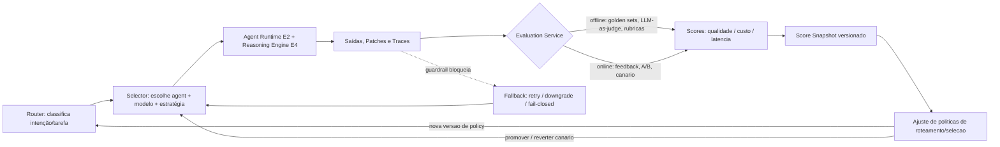

Fluxo: (1) Router e Selector decidem sob a política vigente; (2) o run executa e emite traços e saídas; (3) o Evaluation Service pontua offline (em CI/agendado) e online (amostragem em produção); (4) scores viram um snapshot versionado; (5) o ajuste de políticas atualiza pesos/thresholds ou promove/reverte uma variante (A/B, canário); (6) a nova versão de política entra em vigor para os próximos runs. Ajustes são **propostos e auditáveis** (nova versão SemVer de policy), nunca mutação silenciosa.

### 9.6 Guardrails e fallback

- **Guardrails de entrada**: filtro de PII e detecção de prompt-injection antes do roteamento.
- **Guardrails de saída**: validação de schema, secret-scan e verificação de conteúdo/política antes de aceitar a saída de um agent.
- **Fallback em cascata**: em bloqueio de guardrail, erro de agent ou estouro de budget, o Selector percorre `fallbacks` (agent/modelo alternativo, downgrade de modelo) e, esgotadas as tentativas, aplica **fail-closed** — o padrão seguro do brief (meta NF de budgets que "falha fechado"). Todo fallback é registrado no Trace com a razão.
- **Budgets**: cada decisão respeita o budget do run e as quotas do tenant (E11); custo/latência estimados entram na função-objetivo da política cost-aware.

### 9.7 Critérios de aceite

**Funcionais**

1. Router produz `RouteDecision` tipada com `task_type`, `path`, `confidence` e `rationale`; Selector produz `SelectDecision` com agent+modelo+estratégia+budget e lista de `fallbacks`.
2. Políticas de roteamento e seleção são declarativas, versionadas (SemVer) e plugáveis: rules, embeddings, LLM-as-router, cost-aware e capability matching, combináveis em pipeline com short-circuit por confiança.
3. Selector casa `required_capabilities` contra o Agent Registry (E2) e escolhe Reasoning Strategy do Reasoning Engine (E4).
4. Evaluation Service executa evals offline (datasets, golden sets, LLM-as-judge, rubricas, checks determinísticos no sandbox) e online (feedback, A/B, canário), persistindo resultados e publicando snapshots de scores.
5. Ciclo fechado: scores realimentam políticas via nova versão de policy ou promoção/reversão de variante, com replay determinístico via `score_basis`.
6. Guardrails de entrada/saída ativos e fallback em cascata terminando em fail-closed; toda decisão e fallback vão para o Trace.
7. Quality gates de eval integráveis à CI (E12), reprovando merge abaixo de thresholds de qualidade/custo/latência.

**Não-funcionais**

1. **Latência**: overhead de decisão do Router+Selector com política determinística (rules/capability/cost-aware) < 50 ms p95; caminho com LLM-as-router é opcional e disparado só por baixa confiança.
2. **Custo**: LLM-as-router e LLM-as-judge têm budget explícito por chamada; custo de decisão medido e atribuído por run/tenant.
3. **Determinismo/replay**: dada a mesma entrada, política e snapshot de scores, a decisão é reproduzível; snapshots são imutáveis e versionados.
4. **Observabilidade**: cada RouteDecision/SelectDecision/Eval emite traço e métricas (qualidade/custo/latência) via OpenTelemetry (E11).
5. **Extensibilidade**: novas políticas e evaluators são plugins com contract tests obrigatórios (E1/E12); adicionar um não exige mudança no core.
6. **Segurança/governança**: guardrails obrigatórios em produção; fail-closed por padrão; decisões auditáveis e reversíveis.
7. **Cobertura**: núcleo de Router/Selector/Evaluation ≥ 85% de linhas; contract tests para todos os pontos de extensão.


---

## 10. Skills (Habilidades)

Uma **Skill** é uma função reutilizável e declarável — determinística ou assistida por LLM — invocável por agents, fluxos, pela Control Plane API ou pela CLI. Skills encapsulam uma capacidade nomeada, com contrato de entrada/saída (IO) explícito, permissões declaradas e versionamento SemVer. Na v2.0 as skills deixam de ser apenas classes Python auto-registradas em processo e passam a ser **artefatos de primeira classe, versionados e publicáveis** através do **Skill Registry** e, quando distribuídas por terceiros, empacotadas como **plugins** (ver [E1](#) e o épico [E6](#) — Skills v2).

Esta seção define a fronteira entre Skill, Tool e Agent, especifica o **Skill Manifest** (`skill.yaml`), o **Skill Registry**, os mecanismos de invocação/composição/encadeamento, o modelo de permissões e sandbox, a política de versionamento e compatibilidade, a relação com o subsistema de plugins e o caminho de evolução das builtin skills atuais.

### 10.1 Skill vs. Tool vs. Agent

Os três conceitos são distintos e complementares. A regra prática: **Tools** são chamadas de baixo nível que um agent aciona diretamente; **Skills** são capacidades de nível intermediário, nomeadas, versionadas e testáveis isoladamente; **Agents** são unidades autônomas que raciocinam sobre uma tarefa e compõem tools e skills para produzir uma saída conforme seu contrato.

| Dimensão | **Tool** | **Skill** | **Agent** |
|---|---|---|---|
| Definição | Capacidade de baixo nível (chamada de função) exposta a um agent | Função reutilizável e declarável, determinística ou assistida por LLM | Unidade autônoma que recebe tarefa, raciocina e produz saída |
| Autonomia | Nenhuma — executada quando invocada | Baixa — executa um passo bem definido | Alta — planeja, decide e itera |
| Raciocínio (LLM) | Não | Opcional (skill pode ser determinística ou LLM-assistida) | Sim, por definição (via Reasoning Engine) |
| Estado | Sem estado | Idealmente sem estado; efeitos via contexto/permissões | Mantém estado do run/sessão |
| Contrato | Assinatura de função | **Skill Manifest** (IO schema, permissões, deps) | **Agent Manifest** (capabilities, IO, tools/skills, budgets) |
| Versionamento | Acompanha o host/plugin | **SemVer próprio** (`skill.yaml`) | SemVer próprio (`agent.yaml`) |
| Descoberta | Registrada no Agent Runtime | **Skill Registry** | **Agent Registry** |
| Invocação | `tool.call(args)` pelo agent | `invoke_skill(id, ctx)` por agent/fluxo/API/CLI | ativação de nó de fluxo / Selector |
| Composição | Não compõe outras | **Compõe tools e outras skills** (encadeamento) | Compõe skills, tools e sub-agents |
| Granularidade | Ex.: `read_file`, `run_command` | Ex.: `summarize_diff`, `extract_symbols` | Ex.: `agent-coder`, `agent-planner` |
| Custo/budget | Trivial (chamada) | Trivial se determinística; sob budget se LLM | Governado por budgets do Agent Runtime |
| Ponto de extensão | Registrado pelo Agent Runtime | **E6 / plugin de skill** | **E2 / plugin de agent** |

Resumo direcional: uma Tool "faz uma coisa"; uma Skill "faz uma coisa reutilizável, contratada e versionada"; um Agent "decide o que fazer e usa skills/tools para fazê-lo".

### 10.2 Skill Manifest (`skill.yaml`)

Toda skill v2 é descrita por um manifest declarativo `skill.yaml`, o descritor canônico de uma skill (id, versão, IO, permissões, dependências, gatilhos). O manifest é a única fonte de verdade para descoberta, validação de contrato, checagem de permissões e resolução de dependências. O código da skill implementa o contrato; o manifest o declara.

Campos:

- **id** — `namespace/nome` em kebab-case (ex.: `autodev/summarize-diff`).
- **version** — SemVer `MAJOR.MINOR.PATCH` da própria skill.
- **hostApi** — faixa SemVer de compatibilidade com a API do core (ex.: `">=2.0 <3.0"`).
- **io** — JSON Schema de `input` e `output` (contrato tipado e estável).
- **permissions** — capabilities explícitas exigidas (menor privilégio): FS, rede, execução, LLM.
- **dependencies** — outras skills (por faixa SemVer), pacotes e requisito de LLM.
- **discovery / triggers** — gatilhos de descoberta e casamento (tags, capability, padrões de intenção usados pelo Router/Selector).
- **determinism** — `deterministic | llm-assisted` (afeta replay e cache).
- **sandbox** — perfil de isolamento exigido para execução.

```yaml
# skill.yaml — Skill Manifest (AutoDev Architect v2.0)
schemaVersion: "1.0"

id: autodev/summarize-diff          # namespace/nome (kebab-case)
version: 2.0.0                       # SemVer da skill
hostApi: ">=2.0 <3.0"                # compatibilidade com a API do core

name: Summarize Diff
description: >
  Resume um diff unificado: conta arquivos alterados e linhas
  adicionadas/removidas e produz um sumário legível.
kind: deterministic                  # deterministic | llm-assisted
labels: [code, git, review]

# --- Contrato de IO (JSON Schema) ---------------------------------------
io:
  input:
    type: object
    additionalProperties: false
    required: [diff]
    properties:
      diff:
        type: string
        description: Diff unificado (unified diff).
      max_files:
        type: integer
        minimum: 1
        default: 200
  output:
    type: object
    required: [content, data, success]
    properties:
      content: { type: string, description: Sumário legível (Markdown). }
      data:
        type: object
        properties:
          files_changed: { type: integer }
          lines_added:   { type: integer }
          lines_removed: { type: integer }
      success: { type: boolean }

# --- Permissões (menor privilégio; nada é implícito) --------------------
permissions:
  filesystem:
    read:  []                        # nenhum acesso a FS
    write: []
  network: none                      # sandbox sem rede por padrão
  execution: none                    # não roda comandos
  llm: none                          # skill puramente determinística

# --- Dependências -------------------------------------------------------
dependencies:
  skills: []                         # ex.: [{ id: autodev/parse-hunk, version: ">=1.2 <2.0" }]
  packages: []                       # pip/uv; vazio para builtins puras
  llm: null                          # { capability: text, minContext: 8000 } quando llm-assisted

# --- Descoberta / gatilhos (usados por Router & Selector) ---------------
discovery:
  capability: code.diff.summarize    # rótulo casável com tarefas
  triggers:
    tags: [diff, changelog, review]
    intents:
      - "resumir alterações"
      - "summarize changes"
    inputMatch:                      # heurística: aciona quando há um diff no contexto
      - field: diff
        present: true

# --- Isolamento / execução ----------------------------------------------
sandbox:
  profile: pure                      # pure | fs-read | fs-write | exec | network
  timeoutMs: 5000
  memoryMb: 128

# --- Metadados de publicação (Marketplace / E13) ------------------------
maintainer: autodev
license: Apache-2.0
homepage: https://github.com/autodev/architect
tests:
  contract: true                     # possui contract tests do IO schema
entrypoint: "autodev.skills.summarize_diff:SummarizeDiff"
```

### 10.3 Skill Registry

O **Skill Registry** é o componente canônico de registro, descoberta e versionamento de skills. Ele generaliza o registry atual (`backend/skills/registry.py`, `_REGISTRY: Dict[str, Skill]` com o decorador `register_skill`) para um índice **versionado, multi-fonte e consciente de manifest**.

Responsabilidades:

- **Registro** — indexa skills por `id@version`; builtins auto-registram no import; skills de plugins são registradas pelo **Plugin Host** durante o carregamento; múltiplas versões coexistem.
- **Descoberta** — resolve skills por `id`, por faixa SemVer, por `capability` ou por `triggers` (tags/intents/inputMatch) para consumo do Router & Selector.
- **Validação** — no registro, valida `skill.yaml` contra o schema do manifest, confere compatibilidade `hostApi` e verifica que o `entrypoint` satisfaz o contrato de IO.
- **Resolução de dependências** — resolve `dependencies.skills` por faixa SemVer, detecta ciclos e falha fechado em conflito.
- **Metadados** — expõe descrição, permissões e versões via Control Plane API (`GET /v2/skills`, `GET /v2/skills/{id}`) para catálogos da Web UI.

O Registry é a fonte única consultada pela invocação; a assinatura evolui de `invoke_skill(name, context)` para `invoke_skill(id, context, version=None)`, resolvendo a maior versão compatível quando `version` é omitida.

### 10.4 Invocação, composição e encadeamento

**Invocação.** Uma skill é invocada com um `SkillContext` (inputs validados contra o `io.input` do manifest) e retorna um `SkillResult` (`content` legível + `data` machine-readable + `success`), mantendo a separação entre sumário visível ao usuário e metadados de controle. Pontos de invocação:

1. **Agent Runtime** — o agent seleciona a skill por `capability`/`id` e a executa mediada pelo runtime (aplicando budgets/guardrails quando `kind: llm-assisted`).
2. **Nó de Fluxo (Skill node)** — o Orchestration Engine ativa a skill como um Flow Node, com checkpointing e retries.
3. **Control Plane API** — `POST /v2/skills/{id}/invoke` com corpo `{"inputs": {...}, "version": "..."}`.
4. **CLI** — `autodev skills invoke <id> --input k=v`.

**Composição.** Uma skill pode declarar outras skills como `dependencies.skills` e invocá-las via o mesmo Registry, permitindo capacidades de alto nível a partir de blocos determinísticos menores (ex.: uma skill `code.review.brief` que compõe `summarize-diff` + `extract-symbols` + `render-checklist`).

**Encadeamento.** No nível de fluxo, o `data` de uma skill alimenta o `input` da próxima; o Orchestration Engine faz o binding entre `output` e `input` conforme os schemas. Como skills determinísticas são puras, o Registry pode **cachear** resultados por (id, version, hash(input)) — habilitando determinismo e replay (Princípio 7). Skills `llm-assisted` só são cacheáveis quando a política do run permitir.

### 10.5 Permissões e sandbox

Skills executam sob **menor privilégio** e **falham fechado**: nada que não esteja em `permissions` é permitido. O bloco `sandbox.profile` seleciona um perfil de isolamento aplicado pela **Execution Sandbox** (Docker endurecido) quando a skill toca FS, rede ou execução:

- `pure` — sem FS/rede/exec; roda in-process; ideal para builtins determinísticas.
- `fs-read` / `fs-write` — acesso a caminhos declarados em `permissions.filesystem`, com guarda de path (relativo ao `project_root`).
- `exec` — pode rodar comandos, sempre dentro da Execution Sandbox.
- `network` — acesso de rede, **negado por padrão** (sandbox sem rede é o default global, ver Metas NF).

O Plugin Host aplica as permissões declaradas no carregamento; o Agent Runtime as reaplica na invocação. Skills `llm-assisted` consomem budget de tokens/custo do run e passam por guardrails de saída. Toda invocação emite eventos (`skill.invoked`, `skill.completed`, `skill.failed`) e um Trace, para observabilidade e auditoria.

### 10.6 Versionamento e compatibilidade

- **SemVer por skill** — `version` no manifest evolui independentemente do core. MAJOR quebra o contrato de IO/permissões; MINOR adiciona campos opcionais/capabilities retrocompatíveis; PATCH corrige sem alterar contrato.
- **Compatibilidade com o core** — `hostApi` declara a faixa suportada; o Registry recusa skills incompatíveis no registro.
- **Coexistência de versões** — o Registry indexa por `id@version`; consumidores fixam faixas (`">=2.0 <3.0"`). Skills compostas dependem de faixas, não de versões exatas, evitando lock rígido.
- **Contract tests** — obrigatórios para o par (io.input, io.output); mudanças de contrato exigem bump MAJOR e são validadas em CI (ligação com E12).
- **Depreciação** — versões podem ser marcadas `deprecated`; o Registry continua servindo mas sinaliza a substituição no catálogo.

### 10.7 Relação com plugins (skills-como-plugin) e E1/E6

Sob o princípio "extensibilidade por padrão", skills de terceiros são distribuídas como **plugins** habitando o ponto de extensão de skills. Um `plugin.yaml` pode declarar uma ou mais skills, cada uma com seu `skill.yaml`. O **Plugin Host** (E1) descobre, carrega, isola (aplicando `sandbox`/`permissions`) e gerencia o ciclo de vida; ao carregar, registra as skills no **Skill Registry**. O **SDK** oferece scaffolding do `skill.yaml`, tipos do `SkillContext`/`SkillResult` e utilitários de contract test.

**E6 — Skills v2** entrega: o Skill Manifest, o Skill Registry versionado, composição/encadeamento e skills-como-plugin. A publicação/instalação/assinatura de skills-plugin ocorre pelo **Marketplace** (E13); a interop externa (ex.: expor skills via MCP) é tratada em E9.

### 10.8 Evolução das builtin skills

As builtins atuais (puras, sem dependência de LLM, idênticas sob o provider `stub`) são o alicerce e migram para o formato v2 ganhando manifest, IO schema e id namespacedo, sem perder pureza:

| Builtin atual | Id v2 | Evolução |
|---|---|---|
| `summarize_diff` | `autodev/summarize-diff` | Ganha `skill.yaml` com IO schema; `data` estruturado (files_changed, lines_added/removed); `capability: code.diff.summarize`. |
| `render_checklist` | `autodev/render-checklist` | Manifest com input `items[]` e output Markdown; base para DoR/DoD; `capability: text.checklist.render`. |
| `extract_symbols` (hoje `extract_symbols_lexical`, regex) | `autodev/extract-symbols` | Contrato estável mantido; implementação pode passar a usar **tree-sitter** (via Context/RAG Service) sob MINOR/backend alternativo, preservando o IO. |

Regra de migração: o **id** e o **IO schema** são o contrato público; a implementação (regex → tree-sitter) pode evoluir sob compatibilidade retroativa. Builtins permanecem `sandbox.profile: pure` e `permissions` vazias, garantindo execução sem custo no modo local-first.

### 10.9 Critérios funcionais e não-funcionais

**Funcionais**

- **CF1** — Toda skill possui `skill.yaml` válido (schema, `hostApi`, IO, permissões, deps, triggers); o Registry recusa manifests inválidos ou incompatíveis.
- **CF2** — O Skill Registry registra, descobre (por id/faixa SemVer/capability/triggers), versiona e resolve dependências, com múltiplas versões coexistindo.
- **CF3** — Skills são invocáveis por agent, Flow Node, API (`/v2/skills`) e CLI, com inputs validados contra o schema e retorno `SkillResult` (content/data/success).
- **CF4** — Skills compõem e encadeiam outras skills; o Orchestration Engine faz binding de `output`→`input`.
- **CF5** — Skills de terceiros carregam como plugins (E1) e aparecem no catálogo da Web UI e no Marketplace (E13).
- **CF6** — As builtins (`summarize-diff`, `render-checklist`, `extract-symbols`) operam idênticas sob o provider `stub`.

**Não-funcionais**

- **NF1 (isolamento/segurança)** — menor privilégio; falha fechado; sandbox sem rede por padrão; permissões aplicadas por Plugin Host e Agent Runtime (Metas NF: Segurança).
- **NF2 (determinismo/replay)** — skills `deterministic` são puras e cacheáveis por (id, version, hash(input)); resultados reproduzíveis a partir do estado (Princípio 7).
- **NF3 (contratos/qualidade)** — contract tests obrigatórios para o IO schema; cobertura do núcleo ≥ 85% (E12).
- **NF4 (desempenho)** — skills puras executam in-process com `timeoutMs`/`memoryMb` do manifest; invocação de leitura não deve degradar o p95 < 300 ms do Control Plane.
- **NF5 (observabilidade)** — cada invocação emite Trace e eventos (`skill.invoked`/`completed`/`failed`) e contabiliza tokens/custo quando `llm-assisted`.
- **NF6 (compatibilidade)** — SemVer estrito; mudança de contrato exige MAJOR; `hostApi` garante interoperabilidade core↔skill entre versões.


---

## 11. Repository Intelligence e Contexto de Código

O **Context/RAG Service** é o subsistema responsável por transformar repositórios
de código em contexto recuperável e citável para agents, fluxos e Reasoning
Strategies. Ele implementa o pipeline canônico de **RAG** (indexação +
recuperação) sobre código, expõe **Context Providers** plugáveis (habitando o
ponto de extensão de contexto definido no Núcleo de Plugins & SDK, **E1**) e
materializa o épico **E7 — Context & RAG**. Alinha-se aos princípios de núcleo
pequeno/bordas ricas, local-first com upgrade progressivo (índice em SQLite +
fallback léxico no laptop; **PostgreSQL + pgvector** em produção) e
observabilidade nativa (toda recuperação emite traços e métricas).

O estado atual do repositório expõe uma base mínima e degradável: o
`RepositoryIntelligenceService`
(`backend/repository/intelligence.py`) faz varredura de arquivos e ranking
puramente léxico por termos, e o `TreeSitterProvider`
(`backend/repository/providers/treesitter_provider.py`) já define o contrato de
extração de símbolos com **degradação graciosa** para um `LexicalProvider`
quando `tree_sitter` não está instalado. A v2.0 promove essa base a um serviço
completo de indexação incremental, embeddings e recuperação híbrida, mantendo o
fallback léxico como o piso local-first.

### 11.1 Arquitetura e pipeline

O serviço tem duas metades simétricas: um **caminho de ingestão** (offline,
dirigido por eventos do **Event Bus**) e um **caminho de recuperação** (online,
no caminho crítico de latência de um **Run**).

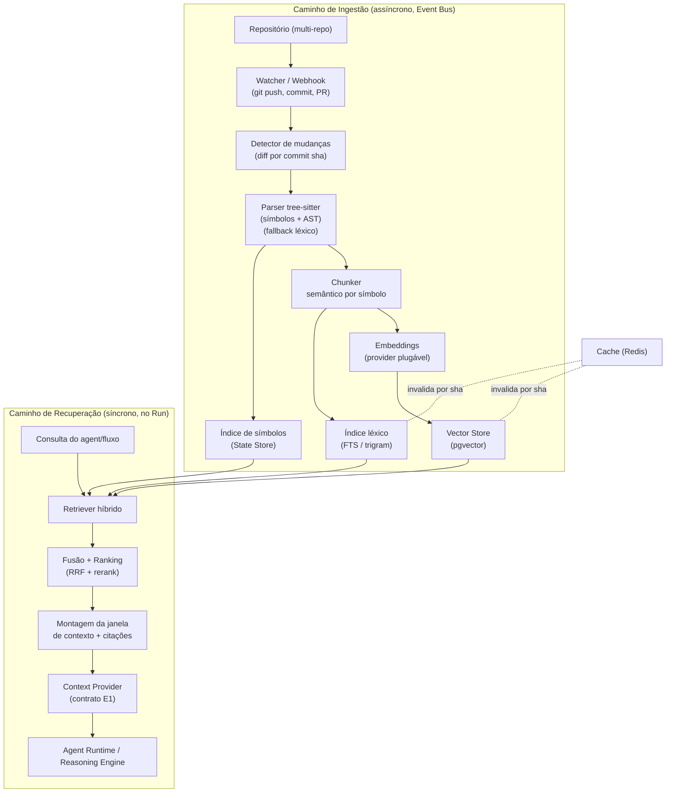

### 11.2 Indexação incremental

A indexação é **incremental e idempotente**, ancorada no `commit sha` de cada
repositório:

- **Gatilho**: eventos `repo.commit.pushed` / `repo.pr.updated` no Event Bus,
  varredura periódica (cron) ou indexação sob demanda na primeira consulta a um
  repo frio.
- **Delta**: apenas arquivos alterados/adicionados/removidos entre o sha
  indexado e o sha alvo são reprocessados; renomeações preservam identidade de
  símbolo quando possível. Isso mantém o custo de reindexação proporcional ao
  diff, não ao tamanho do repositório.
- **Unidade de trabalho**: um job por arquivo (enfileirado em **Redis**),
  permitindo paralelismo horizontal e retomada após falha (determinismo/replay).
- **Filtros**: reaproveita a lista de diretórios ignorados e extensões
  preferidas já presentes em `RepositoryIntelligenceService` (ex.: ignora
  `.git`, `node_modules`, `.venv`), evitando indexar artefatos e dependências.
- **Versionamento do índice**: cada linha do índice carrega `(tenant_id,
  repo_id, commit_sha, file_path, chunk_id, embedding_model, schema_version)`,
  o que permite coexistência de versões durante rebuilds e rollback seguro.

### 11.3 tree-sitter, símbolos e chunking

O parsing usa **tree-sitter** para produzir uma AST por linguagem e extrair
símbolos (funções, classes, métodos, imports), mantendo o contrato já definido
em `TreeSitterProvider.extract_symbols(code, language)` e sua **degradação
graciosa** para o `LexicalProvider` (regex) quando a biblioteca nativa não está
disponível — coerente com o modo local-first.

O **chunking é semântico**, não por janela fixa de caracteres:

- Cada símbolo de nível superior (função/classe/método) vira um chunk candidato,
  preservando limites sintáticos e evitando cortar corpos no meio.
- Chunks grandes são subdivididos respeitando blocos; chunks pequenos vizinhos
  podem ser coalescidos até um teto de tokens.
- Cada chunk retém metadados estruturais: `symbol_name`, `symbol_kind`,
  `language`, `start_line`/`end_line`, `parent_symbol`, docstring/comentário de
  cabeçalho e o caminho de arquivo. Esses metadados alimentam ranking e citação.
- Arquivos sem parser (config, markdown) caem em chunking por seções/headings.

### 11.4 Embeddings e Vector Store (pgvector)

- **Embeddings** são produzidos por um provider **plugável** (contrato do
  Núcleo de Plugins/E1), com um provider "stub" determinístico no modo local e
  providers reais (ex.: modelos de código) em produção. O `embedding_model` fica
  registrado por chunk para invalidação ao trocar de modelo.
- **Vector Store**: **pgvector** sobre PostgreSQL (decisão OSS-first; nenhum
  banco vetorial dedicado antes do pgvector). Índice **HNSW** (ou IVFFlat como
  fallback) com métrica de cosseno; dimensão fixada por modelo.
- **Multi-tenant**: filtros por `tenant_id` e `repo_id` são aplicados na própria
  consulta vetorial (predicados + partial index), garantindo isolamento de dados
  entre tenants.

### 11.5 Recuperação híbrida, ranking e janelas de contexto

A recuperação combina três sinais e funde os resultados:

1. **Léxico**: full-text search / trigram sobre conteúdo e nomes de símbolo
   (evolução do ranking por termos de `_rank_files`, que já pontua por
   filename/path/directory).
2. **Vetorial**: busca de vizinhos mais próximos no pgvector sobre os embeddings
   dos chunks.
3. **Estrutural/símbolo**: casamento direto por nome de símbolo e vizinhança de
   grafo (chamadores/chamados, imports) para trazer contexto relacionado.

O **ranking** funde os rankings por **Reciprocal Rank Fusion (RRF)** e aplica um
**rerank** opcional (cross-encoder plugável) sobre o top-k, com boosts
determinísticos por recência de commit, proximidade de path ao arquivo em
edição e tipo de símbolo — preservando explicabilidade (todo resultado carrega
`reasons`, como já faz `RepositoryFileMatch`).

A **montagem da janela de contexto** respeita o **Budget** de tokens do agent
(E4/Reasoning e Agent Runtime): seleciona chunks até o teto, deduplica sobreposições,
e produz **citações** estruturadas — cada trecho entregue vem com
`{repo_id, commit_sha, file_path, start_line, end_line, symbol_name, score,
retriever}` — para rastreabilidade, auditoria e para permitir que a UI ligue a
resposta ao código-fonte exato.

### 11.6 Contrato de Context Provider (ponto de extensão de E1)

Um **Context Provider** é uma extensão plugável que fornece contexto a
agents/fluxos. O `Context/RAG Service` embarca o provider de código nativo, mas
qualquer plugin (memória de sessão, docs externas, tickets) pode implementar o
mesmo contrato tipado e estável (SemVer), habitando o ponto de extensão definido
em **E1** e resolvido pelo **Plugin Host** com permissões explícitas.

```python
# Contrato estável (hostApi: ">=2.0 <3.0"), habitando o ponto de
# extensão "context.provider" do Núcleo de Plugins & SDK (E1).

class ContextQuery(TypedDict):
    text: str                       # consulta em linguagem natural / termos
    tenant_id: str
    repo_ids: list[str]             # multi-repo: escopo da busca
    commit_sha: NotRequired[str]    # âncora de versão (default: HEAD indexado)
    token_budget: int               # teto para a janela de contexto
    filters: NotRequired[dict]      # linguagem, path glob, symbol_kind...
    top_k: NotRequired[int]

class Citation(TypedDict):
    repo_id: str
    commit_sha: str
    file_path: str
    start_line: int
    end_line: int
    symbol_name: NotRequired[str]

class ContextChunk(TypedDict):
    content: str
    score: float
    retriever: str                  # "lexical" | "vector" | "symbol" | "fused"
    reasons: list[str]              # explicabilidade do ranking
    citation: Citation

class ContextResult(TypedDict):
    chunks: list[ContextChunk]      # já ordenados e dentro do token_budget
    matched_terms: list[str]
    total_candidates: int
    truncated: bool                 # True se o budget cortou resultados

class ContextProvider(Protocol):
    id: str                         # ex.: "autodev/context-code"
    version: str                    # SemVer

    def capabilities(self) -> list[str]: ...        # p.ex. ["code", "symbols"]
    def retrieve(self, query: ContextQuery) -> ContextResult: ...
    def health(self) -> dict: ...                   # readiness / índice frio
```

O core mescla resultados de múltiplos providers ativos (fusão por RRF entre
providers), respeitando o mesmo `token_budget` global e mantendo a proveniência
(`retriever`/`reasons`) de cada chunk.

### 11.7 Cache, invalidação e multi-repo

- **Cache (Redis)**: resultados de recuperação e embeddings de consulta são
  cacheados com chave `(tenant_id, repo_ids, commit_sha, hash(query),
  embedding_model)`. Como a chave inclui o sha, o cache é naturalmente
  correto por versão.
- **Invalidação**: um novo commit indexado publica `repo.index.updated` no Event
  Bus; entradas de cache atreladas ao sha antigo expiram/são despejadas.
  Trocar `embedding_model` ou `schema_version` invalida a partição correspondente
  do índice e força rebuild incremental.
- **Multi-repo**: consultas aceitam uma lista de `repo_ids`; a fusão ocorre entre
  repositórios com normalização de score, e citações sempre carregam `repo_id`
  para desambiguar. O isolamento por `tenant_id` é aplicado em todas as camadas
  (índice léxico, vetorial e cache).

### 11.8 Critérios de qualidade de recuperação (métricas)

A qualidade da recuperação é medida continuamente e realimenta o sistema,
integrando-se ao **Evaluation Service** (E5/E12):

- **Recall@k / Precision@k**: proporção de chunks relevantes recuperados no
  top-k contra um dataset rotulado de consultas→arquivos/símbolos.
- **MRR / nDCG@k**: qualidade de ordenação do ranking fundido.
- **Context precision / recall (RAG)**: fração da janela entregue que é
  efetivamente útil e cobertura do contexto necessário.
- **Groundedness / citação verificável**: toda afirmação de um agent que usa
  contexto deve ser rastreável a uma `Citation` válida (linhas existentes no
  `commit_sha`).
- **Latência de recuperação**: p95 do `retrieve` no caminho do Run.
- **Frescor do índice (index lag)**: atraso entre `commit.pushed` e
  `index.updated`.

### 11.9 Critérios funcionais

- Indexar repositórios de forma **incremental** por `commit_sha`, reprocessando
  apenas o diff.
- Extrair símbolos via **tree-sitter** com **fallback léxico** garantido quando a
  lib nativa está ausente (contrato de `TreeSitterProvider`).
- Suportar **chunking semântico** por símbolo com metadados estruturais.
- Executar **recuperação híbrida** (léxica + vetorial + símbolo) com fusão RRF e
  rerank opcional.
- Respeitar o **token budget** ao montar a janela e retornar **citações**
  estruturadas e verificáveis.
- Expor o contrato **Context Provider** plugável (E1), com múltiplos providers
  ativos fundidos pelo core.
- Suportar consultas **multi-tenant e multi-repo** com isolamento estrito.
- Operar **local-first** (SQLite + fallback léxico) e escalar para
  **PostgreSQL + pgvector** sem reescrita.

### 11.10 Critérios não-funcionais

- **Latência**: p95 do `retrieve` (top-k, sem rerank) < 300 ms alinhado à meta
  do Control Plane; início de streaming de um Run que depende de contexto < 1 s.
- **Frescor**: index lag p95 < 60 s após `repo.commit.pushed` para repositórios
  quentes.
- **Escala**: indexação horizontalmente escalável via jobs Redis; suportar
  repositórios grandes com custo de reindexação proporcional ao diff.
- **Isolamento e segurança**: filtros por `tenant_id`/`repo_id` obrigatórios;
  providers-plugin executam com permissões explícitas sob o Plugin Host;
  nenhum acesso a repositório fora do escopo autorizado do tenant.
- **Determinismo/replay**: dada a mesma consulta e `commit_sha`, o resultado é
  reproduzível (RRF e boosts determinísticos; embeddings versionados).
- **Observabilidade**: cada recuperação emite trace (candidatos, scores,
  `reasons`, provider) e métricas (§11.8) via OpenTelemetry (E11).
- **Confiabilidade**: índice reconstruível a partir do repositório fonte; perda
  do índice não implica perda de dado durável (RPO/RTO herdados de E8/E11).
- **Contratos estáveis**: `ContextProvider` versionado por SemVer com contract
  tests obrigatórios (E12) para o ponto de extensão.

### 11.11 Relação com épicos e componentes

Esta seção detalha o **E7 — Context & RAG** e o componente canônico
**Context/RAG Service**. Depende de **E1** (ponto de extensão e contrato de
Context Provider, Plugin Host), **E8** (Vector Store pgvector, State Store,
modelo multi-tenant), **Redis** (cache/filas) e do **Event Bus** (gatilhos de
indexação e invalidação). Serve o **Agent Runtime** e o **Reasoning Engine**
(E2/E4) respeitando seus Budgets, e alimenta/ é medido pelo **Evaluation
Service** (E5/E12) através das métricas de qualidade de recuperação.


---

## 12. Patches, Execução e Validação

Esta seção especifica a espinha dorsal de mudança de código da plataforma
AutoDev Architect v2.0: como um agent transforma uma intenção em um **Patch**
(diff unificado), como esse patch é aplicado sob guarda de path e dry-run, como
os comandos de verificação rodam no **Execution Sandbox** (Docker endurecido) e
como os **Validation Gates** decidem, de forma auditável, se o resultado é
aceito. O ciclo canônico de engenharia da plataforma — planejar → codificar →
**aplicar patch → validar em sandbox** → avaliar — se concretiza aqui.

O subsistema é governado pelos princípios do brief: **isolamento e menor
privilégio** (P5), **segurança e custo governados** (P11), **determinismo e
replay** (P7) e **observabilidade nativa** (P6). Ele se apoia diretamente em
**E8 — Persistência & Dados** (estado durável de jobs/resultados e o
**Artifact Store**/MinIO) e em **E11 — Observabilidade, Segurança &
Multi-tenant** (RBAC, quotas, traços e o postura de segurança fail-closed).
As melhorias de segurança já entregues na v1 — descritas em `docs/security.md`
— são o ponto de partida e permanecem válidas na v2.0.

### 12.1 Visão geral do fluxo

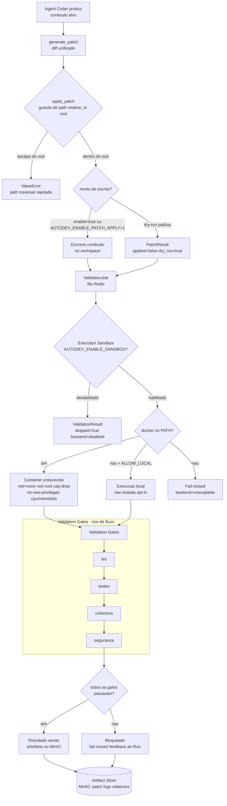

O fluxo é modelado como **Nós de Fluxo** (Flow Nodes) no **Orchestration
Engine**: a geração e aplicação do patch, a submissão do `ValidationJob` ao
Sandbox e cada gate são nós discretos, com checkpointing e retries. Isso torna
o pipeline reproduzível a partir do estado persistido (replay) e observável por
padrão (cada transição emite eventos e traços).

### 12.2 Fluxo baseado em patches

A plataforma nunca deixa um agent escrever arquivos diretamente. Toda mudança de
código é intermediada por um **Patch** — um diff unificado — o que dá
revisabilidade, auditoria e a possibilidade de dry-run antes de qualquer efeito
colateral no filesystem.

**Geração de diff.** A partir do conteúdo original e do conteúdo proposto pelo
agent, o motor produz um diff unificado (`fromfile=a/<path>`,
`tofile=b/<path>`). Quando não há mudança, o diff é a string vazia. A
implementação de referência é `backend/patches/engine.py::generate_patch`.

**Aplicação com guarda de path.** A aplicação resolve o caminho alvo contra um
`root` e exige que ele permaneça dentro dele (`Path.resolve()` +
`relative_to(root)`); qualquer caminho que escape do root é rejeitado com
`ValueError` (guarda de path-traversal). Este é o mesmo confinamento de
filesystem descrito em `docs/security.md` e já vigente na v1.

**Dry-run por padrão (fail-closed de escrita).** A escrita no disco é
**desabilitada por padrão**. Ela só ocorre quando explicitamente habilitada
(`enable=True`) ou via a variável de ambiente `AUTODEV_ENABLE_PATCH_APPLY=1`.
No modo padrão, o resultado é um `PatchResult` com `applied=false` e
`dry_run=true`, permitindo revisão humana ou automática antes de efetivar a
mudança. Referência: `backend/patches/engine.py::apply_patch`.

Contrato de patch (resumo):

| Campo (`Patch`) | Descrição |
| --- | --- |
| `path` | caminho lógico usado no cabeçalho do diff e como alvo relativo ao root |
| `original` | conteúdo original |
| `updated` | conteúdo proposto |
| `diff` | diff unificado (vazio quando não há mudança) |

| Campo (`PatchResult`) | Descrição |
| --- | --- |
| `path` | caminho alvo |
| `applied` | `true` se escrito no disco |
| `dry_run` | `true` quando a escrita foi pulada |
| `message` | descrição legível do que ocorreu |

### 12.3 Execution Sandbox endurecido

O **Execution Sandbox** executa os comandos de verificação (lint, testes etc.)
de forma isolada. A implementação de referência é
`backend/validation/sandbox.py::SandboxRunner`.

**Gate de execução.** A execução é **desabilitada por padrão**; só roda quando
`AUTODEV_ENABLE_SANDBOX` está definido. Sem o flag, `run` retorna um
`ValidationResult` com `skipped=true` e `backend="disabled"` — nenhum
subprocesso é criado.

**Allowlist de comandos.** O `SandboxRunner` valida o basename de
`command[0]` contra uma allowlist (padrão: `pytest`, `ruff`, `npm`, `python`,
`python3`). Um comando fora da lista retorna `backend="blocked"`. Ressalva de
segurança (ver `docs/security.md`): interpretadores na allowlist ainda executam
código arbitrário — **o isolamento do container, não a allowlist, é a fronteira
de segurança real**.

**Container Docker endurecido.** Quando `docker` está no PATH, o job roda em um
container com as seguintes proteções (menor privilégio, defesa em profundidade):

- **sem rede por padrão** — `--network=none` (reabilitável por deployment via
  `AUTODEV_SANDBOX_DOCKER_NETWORK` para cargas legítimas, ex.: instalar deps);
- **não-root** — `--user=65534:65534` (usuário `nobody`);
- **capabilities zeradas** — `--cap-drop=ALL`;
- **sem escalonamento de privilégio** — `--security-opt=no-new-privileges`;
- **limites de recursos** — `--pids-limit=256`, `--memory=512m`, `--cpus=1`;
- workdir fixo `/workspace` sobre a imagem `python:3.11-slim`.

**Política fail-closed sem Docker.** Se o Docker não estiver disponível, o
runner **falha fechado**: retorna `backend="unavailable"` e `skipped=true`, sem
executar nada. A execução direta no host (sem isolamento) só ocorre quando o
operador opta explicitamente por `AUTODEV_SANDBOX_ALLOW_LOCAL=1` — o deployment
padrão nunca pode ser induzido a executar comandos no host sem sandbox. Isso
concretiza a meta não-funcional global "sandbox sem rede por padrão" e o
princípio de menor privilégio (E11).

### 12.4 Contratos: ValidationJob e ValidationResult

Os contratos são tipados e estáveis (SemVer; `schemaVersion` conforme §7 do
brief) e trafegam entre o **Control Plane** (que enfileira jobs) e o **Data
Plane** (Sandbox + Gates). São persistidos em **E8** e enfileirados via Redis.

`ValidationJob` (entrada):

| Campo | Tipo | Descrição |
| --- | --- | --- |
| `job_id` | `str` | identificador único do job (para correlação/replay) |
| `command` | `list[str]` | comando a executar; `command[0]` sujeito à allowlist |
| `cwd` | `str \| None` | diretório de trabalho (execução local) |

`ValidationResult` (saída):

| Campo | Tipo | Descrição |
| --- | --- | --- |
| `job_id` | `str` | correlaciona com o `ValidationJob` |
| `returncode` | `int` | código de saída (`0` = sucesso) |
| `stdout` | `str` | saída padrão capturada |
| `stderr` | `str` | erro padrão / mensagem de bloqueio |
| `backend` | `str` | `docker` \| `local` \| `disabled` \| `blocked` \| `unavailable` |
| `skipped` | `bool` | `true` quando nenhum subprocesso foi executado |

O campo `backend` é o discriminador de auditoria: torna explícito, em cada
resultado, se houve isolamento real (`docker`), execução não isolada opt-in
(`local`), ou uma condição fail-closed/gate (`disabled`/`blocked`/`unavailable`).

### 12.5 Validation Gates

Os **Validation Gates** são portões de qualidade encadeados como **Nós de
Fluxo** no Orchestration Engine. Cada gate consome um ou mais
`ValidationResult` e produz um veredito. Um resultado só é **aceito** quando
todos os gates aplicáveis passam; caso contrário o pipeline **falha fechado** e
realimenta o **Run** com o motivo (feedback para replanejamento pelo agent).

Gates canônicos:

- **lint** — estilo e erros estáticos (ex.: `ruff`).
- **testes** — suíte automatizada (ex.: `pytest`, `npm test`).
- **cobertura** — cobertura mínima; alinhada às metas não-funcionais globais
  (núcleo ≥ 85% de linhas; contract tests obrigatórios para pontos de extensão).
- **segurança** — verificações de segurança (SAST/dependências/segredos),
  coerentes com os follow-ups de `docs/security.md`.

Por serem nós de fluxo declarativos, os gates são configuráveis por fluxo/tenant
e versionados — permitindo políticas distintas (ex.: gate de cobertura mais
rígido no core do que em plugins). Isso conecta o subsistema a **E12 —
Qualidade & Evals** (quality gates de CI) sem reescrever o pipeline.

### 12.6 Artefatos (Artifact Store / MinIO)

Todo o material produzido pelo pipeline é persistido no **Artifact Store**
(MinIO, compatível com S3): o **patch** (diff), os logs de execução (stdout /
stderr por job), os relatórios dos gates (lint, cobertura, segurança) e
quaisquer builds resultantes. Os artefatos são referenciados pelo `job_id`/`Run`
correspondente, o que dá rastreabilidade fim-a-fim e habilita **replay** e
auditoria (E8/E11). Metadados leves e ponteiros ficam no **State Store**
(PostgreSQL); o conteúdo pesado vive no MinIO.

### 12.7 Critérios de aceite

**Funcionais**

- `generate_patch` produz diff unificado correto; diff vazio quando não há
  mudança.
- `apply_patch` rejeita caminhos que escapam do `root` (path-traversal) e é
  dry-run por padrão; escrita apenas com `enable=True` ou
  `AUTODEV_ENABLE_PATCH_APPLY=1`.
- Sem `AUTODEV_ENABLE_SANDBOX`, `run` retorna resultado `skipped`/`disabled`.
- Com Docker disponível e sandbox habilitado, o job roda no container endurecido
  e retorna `backend="docker"`.
- Cada gate (lint/testes/cobertura/segurança) produz veredito; um resultado só é
  aceito com todos os gates aplicáveis aprovados.
- Patch, logs e relatórios são persistidos no Artifact Store e correlacionáveis
  ao `job_id`/Run.

**Não-funcionais e segurança**

- **Fail-closed por padrão**: escrita de patch, execução de sandbox e veredito de
  gate assumem o estado seguro na ausência de opt-in explícito.
- **Sandbox sem rede por padrão** e execução **não-root** com `cap-drop=ALL`,
  `no-new-privileges` e limites de cpu/mem/pids (meta não-funcional global; E11).
- **Menor privilégio**: sem Docker, nenhuma execução ocorre a menos que
  `AUTODEV_SANDBOX_ALLOW_LOCAL=1` seja definido.
- **Confinamento de filesystem**: nenhuma escrita fora do `root`.
- **Observabilidade/replay**: `job_id` correlaciona job, resultado, artefatos e
  eventos; `backend` audita o modo de execução (P6/P7).
- **Governança de custo** (E11): jobs de validação respeitam budgets/quotas por
  run/tenant.

**Riscos residuais** (herdados de `docs/security.md`, follow-ups): interpretadores
na allowlist executam código arbitrário (o isolamento é a fronteira real);
imagens de container usam tags mutáveis (`python:3.11-slim`) — considerar fixar
por digest; dependências sem lockfile — considerar pinagem para builds
auditáveis.


---

## 13. Persistência, Estado e Modelo de Dados

Esta seção define como o AutoDev Architect v2.0 armazena estado durável,
organiza seu modelo de dados multi-tenant, versiona migrações e garante
recuperabilidade. Ela materializa o **Épico E8 — Persistência & Dados** e
depende das fundações de segurança/observabilidade estabelecidas por **E0** e
consumidas por **E11**.

### 13.1 Princípios de persistência

O desenho segue quatro regras invariantes, herdadas da direção de modelo de
dados atual e promovidas a contrato da v2:

1. **A verdade durável vive no State Store (PostgreSQL).** Sessões, runs, steps
   e todas as entidades de negócio têm sua fonte canônica no banco relacional.
2. **Artefatos vivem no Artifact Store (MinIO)**, referenciados por linhas de
   metadados no State Store (nunca blobs grandes no banco).
3. **Redis guarda apenas estado efêmero** — filas, cache e locks — nunca a
   verdade do sistema. Perder o Redis degrada throughput, não integridade.
4. **Embeddings permanecem consultáveis via pgvector** dentro do PostgreSQL,
   até que a escala justifique um serviço vetorial dedicado (decisão OSS-first).

A plataforma é **local-first com upgrade progressivo**: a mesma base roda em
SQLite no laptop (zero dependências externas) e escala para produção
multi-tenant (PostgreSQL + pgvector, Redis, MinIO) sem reescrever camada de
domínio. Os repositórios do core dependem de **protocolos de repositório**
(SessionRepository, RunRepository, MessageRepository, PlanRepository, etc.), e
os adaptadores (`SQLiteStore`, `PostgresStore`) implementam esses protocolos.

### 13.2 State Store: PostgreSQL (produção) e SQLite (local)

| Aspecto | SQLite (modo local) | PostgreSQL (produção, padrão) |
|---|---|---|
| Uso | dev, demos, single-user | multi-tenant, alta concorrência |
| Concorrência | escrita serializada | MVCC, escritas concorrentes |
| Multi-tenant | tenant único implícito | `tenant_id` + RLS |
| Vetores | não (RAG degradado) | pgvector |
| JSON | `json`/texto | `jsonb` + índices GIN |
| Migrações | MigrationRunner (namespaced) | mesmas migrações, dialeto PG |

O estado atual do repositório já provê o `SQLiteStore` com um `MigrationRunner`
namespaced (`store`, `plan_store`) e um `PostgresStore` como scaffold
(`get_store()` roteia por `DATABASE_URL`). A v2 completa o `PostgresStore` como
adaptador de produção padrão, mantendo o SQLite como caminho local suportado. A
seleção é feita exclusivamente pela URL de conexão, preservando o contrato de
`get_store()` já existente.

### 13.3 Modelo de dados (diagrama ER)

O modelo canônico da v2 introduz entidades de plataforma (`tenant`, `agent`,
`plugin`, `skill`, `flow`, `flow_version`, `eval`, `eval_result`) além das
entidades operacionais já existentes (`session`, `run`, `step`, `artifact`) e do
`event`/auditoria. Todas as tabelas de dados de negócio carregam `tenant_id`.

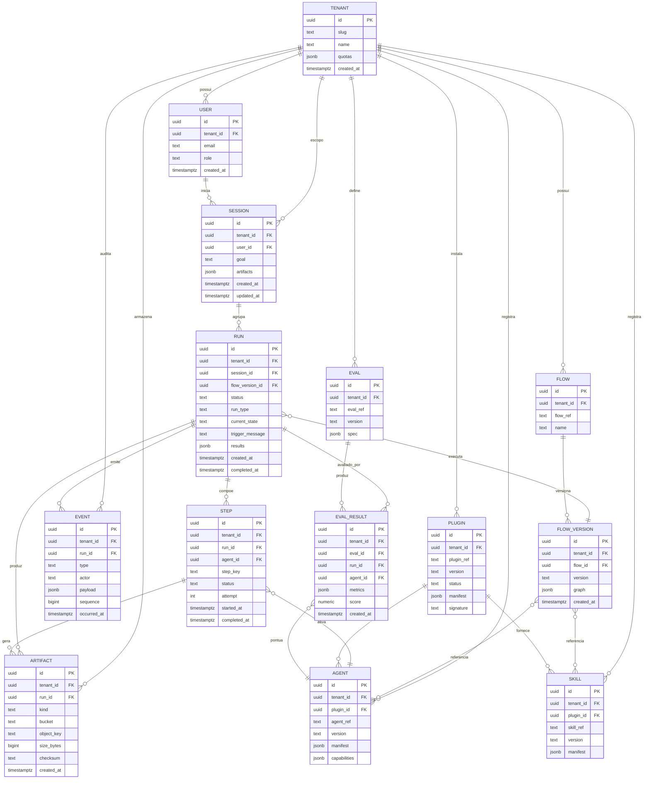

Notas de modelagem:

- **`flow` vs `flow_version`**: o fluxo é a identidade estável (`namespace/nome`);
  cada mudança gera um `flow_version` imutável (grafo declarativo versionado). Um
  `run` sempre aponta para um `flow_version` concreto, garantindo **determinismo
  e replay** (Princípio 7 do brief).
- **`agent`/`skill`/`plugin`**: agents e skills são fornecidos por plugins
  (relação `plugin ||--o{ agent`); ids seguem `namespace/nome` em kebab-case e
  versão SemVer, conforme convenções do brief. `manifest` guarda o descritor
  declarativo completo em `jsonb`.
- **`eval` / `eval_result`**: a especificação de avaliação é versionada; cada
  execução produz um `eval_result` ligado a `run` e ao `agent` avaliado,
  fechando o laço de feedback consumido por **E5** (Router & Selector).
- **`artifact`**: apenas metadados (bucket, chave de objeto, checksum, tamanho);
  o conteúdo reside no MinIO.
- **`event`**: registro append-only com `sequence` monotônica por tenant/run,
  base do event store/auditoria (ver 13.6).

### 13.4 Redis: fila, cache e locks

O Redis é o substrato de coordenação efêmera do **Data Plane**:

- **Filas**: fila de runs, fila de indexação (RAG), jobs assíncronos de eval e
  publicação de plugins.
- **Cache**: resultados de recuperação, catálogos de registries, respostas de
  leitura quentes do Control Plane.
- **Locks distribuídos**: lock por workspace/repositório (evita indexação ou
  aplicação de patch concorrentes) e leases de worker.
- **Rate limiting / quotas curtas**: contadores por tenant alinhados às quotas
  de **E11**.

Regra: qualquer dado em Redis deve ser **reconstruível** a partir do PostgreSQL.
Nenhuma transição de estado de negócio é confirmada apenas no Redis.

### 13.5 pgvector (RAG) e MinIO (artefatos)

- **pgvector**: embeddings de código/documentos vivem em tabelas com coluna
  `vector`, filtradas por `tenant_id` e indexadas por HNSW/IVFFlat. Isso mantém
  recuperação híbrida (léxica + vetorial) dentro de uma única transação
  relacional, evitando um serviço vetorial dedicado até que a escala o exija —
  detalhado no Context/RAG Service (**E7**). No modo SQLite local, a via vetorial
  é degradada (apenas recuperação léxica).
- **MinIO** (compatível com S3): buckets `patch-artifacts`, `validation-artifacts`,
  `run-exports` e `logs`. Cada objeto é referenciado por uma linha em `artifact`
  com `bucket`, `object_key`, `checksum` e `size_bytes`, permitindo verificação
  de integridade e coleta de lixo orfã.

### 13.6 Event store e auditoria

A tabela `event` é um **log append-only** que serve simultaneamente como event
store (para replay/observabilidade) e trilha de auditoria (para segurança e
conformidade). Cada transição relevante emite um evento com nomenclatura
canônica `dominio.entidade.acao` no passado (ex.: `run.step.completed`,
`plugin.installed`, `flow.run.started`), consistente com o catálogo de eventos
de **E9** e o Event Bus.

Eventos mínimos exigidos (herdados da guidance atual): `run.created`,
`plan.generated`, `approval.requested`, `approval.granted`/`approval.rejected`,
`patch.created`, `patch.approved`/`patch.rejected`, `validation.started`/
`validation.completed`, `run.completed`/`run.failed`/`run.cancelled`.

Propriedades: eventos são **imutáveis**, ordenados por `sequence` monotônica por
run, carregam `actor` (usuário, agent ou sistema) e `payload` estruturado.
O Event Bus publica de forma assíncrona; o `event` no PostgreSQL é a fonte
durável (padrão outbox — a publicação nunca precede o commit do estado).

### 13.7 Migrações versionadas

A v2 evolui o `MigrationRunner` já existente (hoje aplicando
`STORE_MIGRATIONS` e `PLAN_STORE_MIGRATIONS` de forma namespaced no SQLite) para
um runner unificado que:

- mantém migrações **versionadas, ordenadas e idempotentes**, com tabela de
  controle de versão por namespace;
- suporta os dois dialetos (SQLite e PostgreSQL) a partir de um conjunto único
  de definições, com divergências explícitas quando necessário (ex.: `jsonb`,
  `vector`, RLS);
- exige que migrações sejam **reversíveis quando possível** (down migrations) e
  registra cada aplicação como evento de auditoria;
- roda automaticamente na inicialização em dev e via passo explícito e gated em
  produção (nunca migração destrutiva implícita).

### 13.8 Multi-tenant e isolamento de dados

**Decisão recomendada: coluna `tenant_id` + Row-Level Security (RLS) do
PostgreSQL como padrão**, em vez de schema-por-tenant.

| Critério | Coluna `tenant_id` + RLS (recomendado) | Schema por tenant |
|---|---|---|
| Densidade / custo | alta (milhares de tenants) | baixa (overhead por schema) |
| Migrações | uma vez, para todos | N vezes (uma por schema) |
| Isolamento | forte via RLS + `app.tenant_id` | físico, mais forte |
| Operação | simples | complexa em escala |
| Noisy-neighbor | mitigado por quotas (E11) | isolado por design |

Justificativa: `tenant_id` + RLS oferece o melhor equilíbrio entre isolamento e
operabilidade para uma plataforma OSS self-hostable com muitos tenants, e evita
a explosão de migrações do schema-por-tenant. Toda tabela de negócio inclui
`tenant_id` (NOT NULL, FK para `tenant`), com políticas RLS que filtram por uma
variável de sessão `app.tenant_id` definida pelo Control Plane após
autenticação/RBAC. Índices compostos começam por `tenant_id`. Schema-por-tenant
permanece como opção documentada para clientes que exijam isolamento físico
(compliance), sem alterar a camada de domínio.

### 13.9 Retenção, backup e recuperação (RPO/RTO)

Metas de confiabilidade de dados (alinhadas às metas globais do brief):

- **RPO ≤ 5 min** e **RTO ≤ 30 min** em produção.
- **PostgreSQL**: backups base periódicos + **WAL archiving contínuo** (PITR)
  para atingir RPO ≤ 5 min; réplica de standby para acelerar RTO.
- **MinIO**: versionamento de objetos + replicação de bucket; artefatos são
  referenciados por checksum para detecção de corrupção.
- **Redis**: tratado como cache; recuperação = repopular a partir do PostgreSQL
  (não entra no cálculo de RPO).
- **Retenção**: políticas por tenant e por tipo — eventos/auditoria com retenção
  longa (compliance), traços e artefatos intermediários com TTL configurável e
  arquivamento para storage frio; expurgo respeita obrigações legais.

### 13.10 Critérios de aceite

**Funcionais**

- `get_store()` seleciona SQLite ou PostgreSQL pela `DATABASE_URL` sem mudança
  na camada de domínio; `PostgresStore` implementa todos os protocolos de
  repositório.
- Todas as entidades canônicas (13.3) existem com FKs e `tenant_id` conforme o
  diagrama ER; um `run` é sempre associado a um `flow_version` imutável.
- Cada transição relevante grava um `event` append-only com nomenclatura
  canônica; o histórico permite replay determinístico de um run.
- Artefatos são gravados no MinIO e referenciados por linha `artifact` com
  checksum verificável.
- Migrações versionadas aplicam-se de forma idempotente em ambos os dialetos e
  ficam registradas.

**Não-funcionais**

- Isolamento multi-tenant garantido por RLS: nenhuma consulta retorna dados de
  outro tenant (verificado por testes de contrato de isolamento).
- RPO ≤ 5 min e RTO ≤ 30 min demonstrados em ensaio de recuperação (PITR).
- Consultas de leitura quentes sob os alvos de latência do Control Plane
  (p95 < 300 ms), suportadas por índices `tenant_id`-first e cache Redis.
- Backups e retenção auditáveis; nenhuma migração destrutiva implícita em
  produção.
- Embeddings consultáveis via pgvector com filtro por tenant, sem dependência de
  serviço vetorial externo.


---

## 14. APIs, Contratos, Eventos e Interoperabilidade

Esta seção especifica a superfície de integração externa da plataforma AutoDev
Architect v2.0: a **Control Plane API** (REST versionada em `/v2`), os canais de
**streaming** (SSE/WebSocket), o **catálogo de eventos** do **Event Bus**, os
**webhooks assinados** e a **interoperabilidade** com o ecossistema de agentes,
tendo o **MCP (Model Context Protocol)** como cidadão de primeira classe. Ela
concretiza o **Épico E9 — APIs, Eventos & MCP** e é a fronteira contratual entre
o **Control Plane** e todos os consumidores (Web UI, CLIs, CI, plugins,
frameworks de terceiros).

Princípios aplicáveis do brief: **contratos estáveis e versionados** (P3),
**observabilidade nativa** (P6), **isolamento e menor privilégio** (P5) e
**OSS-first/self-host** (P9). Todos os tipos de payload carregam `schemaVersion`
e todos os nomes de evento seguem `dominio.entidade.acao` no passado (§7 do
brief).

### 14.1 Control Plane API (REST /v2)

A Control Plane API é servida pelo componente **Control Plane API** (FastAPI) e
exposta sob o prefixo `/v2`. A v1 atual (endpoints `/plan`, `/chat`, `/config`,
`/sessions`, etc., em `backend/api/main.py`) permanece disponível como
`/v1` durante a janela de deprecação (§14.7). A v2 é o contrato de longo prazo.

Convenções transversais:

- **Formato**: JSON (`application/json`), UTF-8. Datas em ISO-8601/RFC-3339 UTC.
- **Envelope de tipos**: todo recurso e todo payload de evento inclui
  `schemaVersion` (SemVer do schema do recurso, independente da versão de rota).
- **Erros**: formato **RFC 9457 (Problem Details)** em `application/problem+json`.
- **Tenancy**: o tenant é resolvido pelo token/claim (`tenant_id`); não vai na URL.
- **Correlação**: aceita/propaga `traceparent` (W3C Trace Context) para ligar
  chamadas a traços (E11); ecoa `X-Request-Id`.

Exemplo de erro (Problem Details):

```json
{
  "type": "https://docs.autodev.dev/errors/budget-exceeded",
  "title": "Run budget exceeded",
  "status": 409,
  "detail": "Token budget of 120000 exceeded for run run_01HZ...",
  "instance": "/v2/runs/run_01HZ...",
  "code": "budget.tokens.exceeded",
  "traceId": "0af7651916cd43dd8448eb211c80319c"
}
```

#### Tabela de endpoints /v2 (representativa)

| Método | Caminho | Descrição | Escopo RBAC | Idempotência |
|---|---|---|---|---|
| `GET` | `/v2/health` | Liveness (público, sem auth) | — | — |
| `GET` | `/v2/meta` | Versão da API, `schemaVersion`, features | — | — |
| `POST` | `/v2/sessions` | Cria sessão de trabalho | `session:write` | `Idempotency-Key` |
| `GET` | `/v2/sessions` | Lista sessões (paginado) | `session:read` | — |
| `GET` | `/v2/sessions/{id}` | Detalha sessão | `session:read` | — |
| `POST` | `/v2/flows` | Registra/atualiza fluxo (flow.yaml) | `flow:write` | `Idempotency-Key` |
| `GET` | `/v2/flows` | Lista fluxos (paginado) | `flow:read` | — |
| `POST` | `/v2/runs` | Inicia um run (dispara fluxo) | `run:write` | `Idempotency-Key` |
| `GET` | `/v2/runs` | Lista runs (paginado, filtros) | `run:read` | — |
| `GET` | `/v2/runs/{id}` | Estado durável de um run | `run:read` | — |
| `POST` | `/v2/runs/{id}/cancel` | Cancela run | `run:write` | `Idempotency-Key` |
| `POST` | `/v2/runs/{id}/resume` | Retoma run (human-in-the-loop) | `run:write` | `Idempotency-Key` |
| `GET` | `/v2/runs/{id}/steps` | Lista steps de um run (paginado) | `run:read` | — |
| `GET` | `/v2/runs/{id}/events` | **Stream SSE** de eventos do run | `run:read` | — |
| `GET` | `/v2/runs/{id}/trace` | Trace estruturado (replay/auditoria) | `trace:read` | — |
| `GET` | `/v2/agents` | Catálogo do **Agent Registry** | `agent:read` | — |
| `GET` | `/v2/agents/{id}/contract` | Contrato de IO/capabilities | `agent:read` | — |
| `GET` | `/v2/skills` | Catálogo do **Skill Registry** | `skill:read` | — |
| `GET` | `/v2/plugins` | Plugins instalados (**Plugin Host**) | `plugin:read` | — |
| `POST` | `/v2/plugins` | Instala plugin | `plugin:admin` | `Idempotency-Key` |
| `GET`/`PUT` | `/v2/config` | Lê/atualiza RuntimeConfig | `config:read`/`config:admin` | `PUT` usa `If-Match` |
| `GET` | `/v2/evals` / `POST` `/v2/evals/{id}/run` | Evals (**Evaluation Service**) | `eval:read`/`eval:write` | `Idempotency-Key` |
| `GET`/`POST` | `/v2/webhooks` | Lista/registra endpoints de webhook | `webhook:admin` | `Idempotency-Key` |
| `GET`/`POST` | `/v2/mcp` (JSON-RPC) | **Servidor MCP** (§14.6) | `mcp:invoke` | — |
| `WS` | `/v2/ws` | Canal WebSocket bidirecional | conforme tópico | — |

Exemplo — criar um run:

```json
POST /v2/runs
Authorization: Bearer <access_token>
Idempotency-Key: 5f3c1e2a-1c2b-4a7d-9f10-2b6c8e0a1d33
Content-Type: application/json

{
  "schemaVersion": "2.0.0",
  "flowId": "autodev/flow-implement-feature",
  "flowVersion": ">=1.2 <2.0",
  "input": { "goal": "Adicionar rate limiting ao endpoint /login" },
  "budget": { "tokens": 120000, "costUsd": 2.50, "timeSeconds": 900 },
  "labels": { "source": "ci", "pr": "org/repo#412" }
}
```

Resposta (`201 Created`):

```json
{
  "schemaVersion": "2.0.0",
  "id": "run_01HZX7M9Q0",
  "sessionId": "ses_01HZX7...",
  "status": "queued",
  "flowId": "autodev/flow-implement-feature",
  "flowVersion": "1.3.0",
  "createdAt": "2026-07-02T14:03:11Z",
  "links": {
    "self": "/v2/runs/run_01HZX7M9Q0",
    "events": "/v2/runs/run_01HZX7M9Q0/events",
    "trace": "/v2/runs/run_01HZX7M9Q0/trace"
  }
}
```

### 14.2 Autenticação, autorização e RBAC

A v2 evolui o mecanismo atual (bearer opcional via `AUTODEV_API_TOKEN` em
`backend/api/security.py`, comparado com `hmac.compare_digest`) sem quebrar o
**local-first zero-config**:

- **Modo local (default)**: sem token configurado → API aberta (DX preservada),
  exatamente como hoje. `/v2/health` e docs permanecem públicos.
- **Token estático (compat)**: `AUTODEV_API_TOKEN` continua válido como um
  **Personal Access Token** de tenant único, mapeado ao papel `admin`. É a ponte
  de migração para instalações existentes.
- **Produção (obrigatório, brief §6)**: **OAuth2 / OIDC** com **Bearer JWT**.
  Fluxos suportados: `client_credentials` (serviço/CI), `authorization_code +
  PKCE` (Web UI). Tokens de curta duração + `refresh_token`. Chaves publicadas
  via JWKS; validação de `iss`, `aud`, `exp`, `tenant_id` e `scope`.
- **API Keys de serviço**: chaves longas por tenant (prefixadas, ex.
  `adk_live_...`), armazenadas apenas como hash, para integrações máquina-a-máquina
  que não usam OIDC.

**RBAC** (brief §6, ligado a E11): escopos no formato `recurso:ação`
(`run:read`, `flow:write`, `plugin:admin`, `mcp:invoke`). Papéis padrão:
`viewer` (read-only), `operator` (opera runs/sessões), `author` (publica
flows/agents/skills), `admin` (config/plugins/webhooks/tenant). O tenant e os
escopos vêm das claims do token; toda rota declara o escopo exigido e falha
**fechada** (`403`) quando ausente em produção.

```json
// Claims relevantes de um access token (JWT)
{
  "iss": "https://auth.autodev.local/",
  "aud": "autodev-control-plane",
  "sub": "user_01HZ...",
  "tenant_id": "acme",
  "scope": "run:read run:write flow:read session:write mcp:invoke",
  "exp": 1751465000
}
```

### 14.3 Paginação, idempotência e concorrência

**Paginação** — cursor opaco (estável sob inserções), preferido sobre
offset para as tabelas de runs/steps/eventos (E8):

```
GET /v2/runs?limit=50&cursor=eyJvZmZzZXQiOiJydW5fMDFIWi4uLiJ9&status=running
```

```json
{
  "schemaVersion": "2.0.0",
  "items": [ { "id": "run_01HZ...", "status": "running" } ],
  "page": { "limit": 50, "nextCursor": "eyJvZmZzZXQiOiJydW5fMDF...", "hasMore": true }
}
```

**Idempotência** — toda mutação criadora (POST que gera entidade/efeito) aceita
o header `Idempotency-Key` (UUID gerado pelo cliente). O Control Plane persiste
`(tenant_id, key, hash_do_corpo) → resposta` por 24h (chave em Redis, brief §4):

- Repetição com **mesmo corpo** → retorna a resposta original (mesmo `id`), sem
  duplicar o efeito. Resposta marcada com `Idempotency-Replayed: true`.
- Repetição com **corpo diferente** para a mesma chave → `409 Conflict`
  (`code: idempotency.key.reuse`).

**Concorrência otimista** — recursos mutáveis (ex. `/v2/config`, `flow`) expõem
`ETag`; `PUT`/`PATCH` exigem `If-Match`. Divergência → `412 Precondition Failed`.

### 14.4 Streaming: SSE e WebSocket

Requisito não-funcional (brief §6): **início de streaming de um run < 1 s**.

**SSE (Server-Sent Events)** — canal unidirecional, simples e proxy-friendly,
padrão para observar um único run/trace em tempo real:

```
GET /v2/runs/run_01HZX7M9Q0/events
Accept: text/event-stream
Last-Event-ID: 42        # retomada após reconexão
```

```
event: run.step.started
id: 43
data: {"schemaVersion":"2.0.0","runId":"run_01HZX7M9Q0","stepKey":"coder","agent":"autodev/agent-coder","ts":"2026-07-02T14:03:14Z"}

event: agent.token.delta
id: 44
data: {"schemaVersion":"2.0.0","runId":"run_01HZX7M9Q0","stepKey":"coder","delta":"Aplicando patch em backend/..."}

event: run.step.completed
id: 45
data: {"schemaVersion":"2.0.0","runId":"run_01HZX7M9Q0","stepKey":"coder","status":"succeeded"}
```

O header `Last-Event-ID` permite **retomada sem perda** a partir do último
evento entregue (os ids são o offset do event store por run). Um `event: ping`
periódico mantém a conexão viva.

**WebSocket** (`/v2/ws`) — canal bidirecional para casos que exigem
interação/multiplexação: assinar múltiplos runs, enviar respostas
human-in-the-loop, ou o editor de fluxos da Web UI. Protocolo baseado em
mensagens `{"op": "subscribe|unsubscribe|input|ping", ...}`:

```json
{ "op": "subscribe", "topics": ["run:run_01HZX7M9Q0", "trace:run_01HZX7M9Q0"] }
```

Escolha: **SSE por padrão** (observação read-only, retomável); **WebSocket** quando
há input do cliente ou fan-in de múltiplos tópicos.

### 14.5 Event Bus, catálogo de eventos e webhooks

O **Event Bus** (brief §4) transporta eventos assíncronos entre subsistemas e
plugins. Garantia de entrega **at-least-once**: consumidores DEVEM ser
**idempotentes** por `eventId`. Ordenação é garantida **por chave de partição**
(tipicamente `runId`), não globalmente. Eventos são persistidos no **event
store** (E8), o que habilita replay determinístico (P7) e alimenta o SSE.

**Envelope canônico** de evento (idêntico no bus, no SSE e no webhook):

```json
{
  "schemaVersion": "2.0.0",
  "eventId": "evt_01HZX7N2A4",
  "type": "run.step.completed",
  "occurredAt": "2026-07-02T14:03:15Z",
  "tenantId": "acme",
  "partitionKey": "run_01HZX7M9Q0",
  "traceId": "0af7651916cd43dd8448eb211c80319c",
  "subject": { "runId": "run_01HZX7M9Q0", "stepKey": "coder" },
  "data": { "status": "succeeded", "agent": "autodev/agent-coder", "attempt": 1 }
}
```

#### Catálogo de eventos (nome `dominio.entidade.acao`)

| Evento | Emitido por | Partição | `data` (resumo) |
|---|---|---|---|
| `session.created` | Control Plane API | tenantId | `sessionId`, `goal` |
| `flow.run.started` | Orchestration Engine | runId | `flowId`, `flowVersion` |
| `run.step.started` | Orchestration Engine | runId | `stepKey`, `agent` |
| `run.step.completed` | Orchestration Engine | runId | `stepKey`, `status`, `attempt` |
| `run.step.failed` | Orchestration Engine | runId | `stepKey`, `error`, `attempt` |
| `agent.token.delta` | Agent Runtime | runId | `stepKey`, `delta` (só streaming) |
| `run.human.requested` | Orchestration Engine | runId | `stepKey`, `prompt` |
| `run.human.resolved` | Control Plane API | runId | `stepKey`, `decision` |
| `flow.run.completed` | Orchestration Engine | runId | `status`, `costUsd`, `tokens` |
| `flow.run.failed` | Orchestration Engine | runId | `error`, `failedStep` |
| `run.budget.exceeded` | Agent Runtime | runId | `dimension`, `limit`, `used` |
| `guardrail.violation.blocked` | Agent Runtime | runId | `guardrailId`, `reason` |
| `patch.applied` | Execution Sandbox | runId | `files`, `additions`, `deletions` |
| `validation.gate.passed` / `.failed` | Execution Sandbox | runId | `gate`, `report` |
| `eval.run.completed` | Evaluation Service | tenantId | `evalId`, `score`, `metrics` |
| `plugin.installed` / `plugin.removed` | Plugin Host | tenantId | `pluginId`, `version` |
| `agent.registered` / `skill.registered` | Registries | tenantId | `id`, `version` |

Os schemas JSON de cada `type` são publicados (JSON Schema) e versionados via
`schemaVersion`; contract tests (E12) validam produtores e consumidores contra
eles.

#### Webhooks assinados

Endpoints externos são registrados em `/v2/webhooks` com uma lista de `type`s de
interesse. A entrega usa o **mesmo envelope** acima, via `POST` HTTPS, com
assinatura **HMAC-SHA256** para autenticidade e proteção contra replay:

```
POST https://cliente.example.com/hooks/autodev
Content-Type: application/json
Webhook-Id: evt_01HZX7N2A4
Webhook-Timestamp: 1751465000
Webhook-Signature: v1,3q2+7f...base64hmac...=
```

A assinatura é `HMAC(secret, "{id}.{timestamp}.{body}")`. O receptor DEVE
recusar timestamps fora de uma janela de tolerância (ex. ±5 min) e deduplicar
por `Webhook-Id`. Reentregas com **backoff exponencial** em caso de falha
(at-least-once); resposta `2xx` do receptor confirma a entrega. Segredos por
endpoint, rotacionáveis. Este é o ponto de integração com **Gatilhos (Triggers)**
de fluxo (o webhook de entrada `POST /v2/triggers/{flowId}` inicia runs).

### 14.6 Interoperabilidade: MCP e adaptadores

**MCP (Model Context Protocol) como cidadão de primeira classe** (E9): a
plataforma atua nas duas pontas.

- **AutoDev como servidor MCP** (`/v2/mcp`, JSON-RPC 2.0 sobre HTTP streamable /
  SSE): expõe capacidades internas para clientes MCP externos (IDEs, Claude
  Desktop, outros agentes). Mapeamento canônico:
  - **Tools MCP** ← **Skills** do Skill Registry e **Tools** de agente (invocar
    skill, iniciar run, aplicar patch em sandbox).
  - **Resources MCP** ← **Context Providers** e artefatos (arquivos do repo,
    traces, saídas de run no Artifact Store).
  - **Prompts MCP** ← templates de fluxos/agentes reutilizáveis.
  A autorização reusa o RBAC (§14.2): a sessão MCP porta um token e `mcp:invoke`,
  e cada tool herda o escopo do recurso subjacente (menor privilégio, P5).

- **AutoDev como cliente MCP**: o **Agent Runtime** pode consumir servidores MCP
  externos, expondo suas tools/resources aos agents como **Tools** nativas. Os
  servidores MCP são declarados como um tipo de **plugin**/config, com permissões
  explícitas (rede, escopos) governadas pelo Plugin Host.

**Adaptadores para outros frameworks de agentes**: pontos de extensão que
traduzem contratos externos para os contratos v2 (Agent Manifest / IO schema).
Alvos previstos: LangGraph (já usado internamente pelo Orchestration Engine),
LangChain tools, OpenAI-compatible "assistants/tools" e A2A. Cada adaptador é um
plugin versionado que declara `hostApi: ">=2.0 <3.0"` e converte
requisições/eventos externos no envelope canônico, preservando traços e budgets.

### 14.7 Versionamento e política de deprecação

- **Versão de rota**: prefixo maior em `/v2` (mudanças incompatíveis criam `/v3`).
- **Versão de schema**: `schemaVersion` (SemVer) por tipo de recurso/evento;
  adições retrocompatíveis são MINOR, quebras são MAJOR e não ocorrem dentro de
  uma versão de rota estável.
- **Compatibilidade**: dentro de `/v2`, apenas mudanças **aditivas** (novos
  campos opcionais, novos eventos, novos endpoints). Consumidores devem ignorar
  campos desconhecidos.
- **Deprecação**: um endpoint/campo deprecado passa a emitir os headers
  `Deprecation: true` e `Sunset: <RFC-1123 date>` e é anunciado em `/v2/meta` e
  no CHANGELOG/ADR. **Janela mínima de 6 meses** entre anúncio e remoção; a v1
  legada é mantida como `/v1` durante a migração e removida por ADR.
- **Descoberta**: `GET /v2/meta` retorna versão da API, `schemaVersion`s
  suportados, flags de feature e avisos de deprecação ativos. OpenAPI 3.1
  publicado em `/v2/openapi.json`.

### 14.8 Critérios de aceite

**Funcionais**

- F1. Todo endpoint listado em §14.1 responde sob `/v2`, com OpenAPI 3.1
  publicado e validado; a v1 permanece acessível em `/v1` na janela de migração.
- F2. `POST /v2/runs` com `Idempotency-Key` repetida (mesmo corpo) não cria um
  segundo run e retorna a resposta original; corpo divergente retorna `409`.
- F3. Autenticação: sem token → aberto (local); `AUTODEV_API_TOKEN` → acesso
  admin; OIDC/JWT válido → escopos aplicados; escopo ausente em produção → `403`.
- F4. `GET /v2/runs/{id}/events` (SSE) começa a emitir em < 1 s e retoma sem
  perda a partir de `Last-Event-ID` após reconexão.
- F5. Cada evento do catálogo (§14.5) é emitido no envelope canônico, persistido
  no event store e reproduzível via `GET /v2/runs/{id}/trace`.
- F6. Webhooks assinados são entregues com header `Webhook-Signature` válido,
  reentregues com backoff em falha e deduplicáveis por `Webhook-Id`.
- F7. O servidor MCP `/v2/mcp` lista e invoca tools mapeadas a skills; o cliente
  MCP expõe tools de um servidor externo a um agent respeitando permissões.
- F8. Paginação por cursor é estável sob inserções concorrentes.

**Não-funcionais** (alinhados ao brief §6)

- NF1. p95 dos endpoints de leitura `/v2` < 300 ms; início de streaming < 1 s.
- NF2. Disponibilidade do Control Plane 99.9% (SLO); erros em `application/problem+json`.
- NF3. Entrega de eventos/webhooks **at-least-once** com consumidores idempotentes;
  ordenação garantida por `partitionKey`.
- NF4. Segurança: RBAC obrigatório em produção (falha fechada); tokens de curta
  duração; webhooks e MCP com menor privilégio; sem segredos em logs.
- NF5. Contratos versionados com contract tests obrigatórios (E12) para toda
  rota `/v2` e todo `type` de evento; deprecação com janela mínima de 6 meses.
- NF6. Compatibilidade retroativa: nenhuma mudança quebra clientes `/v2`
  existentes; toda quebra exige `/v3`.

> **Ligação com E9** — esta seção é a especificação de referência do Épico
> **E9 — APIs, Eventos & MCP**. Ela depende do event store e do modelo
> multi-tenant de **E8** (persistência), do RBAC/tenancy de **E11**
> (observabilidade/segurança) e dos contratos de **E1/E2/E6** (plugins, agents,
> skills) que os endpoints de registro e o servidor MCP expõem.


---

## 15. UI/UX e Design System

Esta seção especifica a experiência de uso e o Design System da **Web UI (Next.js)** do AutoDev Architect v2.0. Ela materializa o princípio norteador nº 10 ("Usabilidade e acessibilidade como requisito") e é a contraparte de produto do épico **E10 — UI/UX & Design System**. A UI é uma casca fina sobre a **Control Plane API /v2** (streaming, catálogos, registries, runs/traces): toda tela consome contratos tipados com `schemaVersion` e nunca acessa internals. Painéis de UI são, eles próprios, **pontos de extensão** — plugins podem contribuir telas, widgets e visualizações dentro das mesmas convenções aqui definidas.

### 15.1 Princípios de UX

1. **Clareza** — cada tela tem um objetivo primário evidente; hierarquia visual conduz o olhar do "o quê" para o "como". Metadados de controle (ids, versões, budgets) ficam visualmente subordinados ao conteúdo de valor.
2. **Foco** — uma ação primária por contexto; densidade calibrada por papel (operador vs. autor de plugin). O modo `focus` do `ChatLayout` já expressa isso: esconde navegação lateral quando a tarefa é conversacional.
3. **Feedback imediato** — toda ação produz retorno em ≤ 100 ms (estado visual) mesmo quando o resultado do servidor demora; streaming de tokens, barras de progresso de step e toasts de evento (`run.step.completed`) tornam o sistema "vivo".
4. **Previsibilidade** — mesma gramática de interação em todas as telas: navegação, atalhos, posição de ações primárias/destrutivas e padrões de confirmação são idênticos. Nada de comportamentos surpresa.
5. **Progressive disclosure** — o simples primeiro, o poderoso a um clique. Configuração de agent/fluxo mostra o essencial; avançado (budgets, guardrails, políticas de roteamento) fica em seções colapsáveis e "modo avançado". O Marketplace mostra o cartão antes do manifest completo.

Regras transversais: separar **resumo visível ao usuário** de **metadados de controle** (conforme working style do projeto); estados destrutivos exigem confirmação com o nome do recurso; toda operação longa é cancelável.

### 15.2 Design System

Base tecnológica: **shadcn/ui + Tailwind** (conforme glossário de Componente), com tokens expostos como CSS variables em HSL — alinhado ao `tailwind.config.ts` atual (`--background`, `--foreground`, `--primary`, `--radius` etc.). A camada de tokens é a fonte única; Tailwind e componentes apenas referenciam.

#### 15.2.1 Design tokens (amostra)

Tokens primitivos e semânticos. Cores em HSL (compatíveis com `hsl(var(--token))`). Amostra representativa, não exaustiva:

```jsonc
// design-tokens.json (amostra)
{
  "color": {
    "primitive": {
      "blue-600": "221 83% 53%",
      "slate-50": "210 40% 98%",
      "slate-900": "222 47% 11%",
      "red-600": "0 72% 51%",
      "amber-500": "38 92% 50%",
      "green-600": "142 71% 45%"
    },
    "semantic": {
      "light": {
        "background": "0 0% 100%",
        "foreground": "222 47% 11%",
        "primary": "221 83% 53%",
        "primary-foreground": "210 40% 98%",
        "muted": "210 40% 96%",
        "muted-foreground": "215 16% 47%",
        "border": "214 32% 91%",
        "destructive": "0 72% 51%",
        "success": "142 71% 45%",
        "warning": "38 92% 50%",
        "ring": "221 83% 53%"
      },
      "dark": {
        "background": "222 47% 11%",
        "foreground": "210 40% 98%",
        "primary": "217 91% 60%",
        "primary-foreground": "222 47% 11%",
        "muted": "217 33% 17%",
        "muted-foreground": "215 20% 65%",
        "border": "217 33% 24%",
        "destructive": "0 63% 55%",
        "success": "142 64% 52%",
        "warning": "38 92% 60%",
        "ring": "217 91% 60%"
      }
    }
  },
  "typography": {
    "fontFamily": { "sans": "Inter, ui-sans-serif, system-ui", "mono": "JetBrains Mono, ui-monospace" },
    "scale": { "xs": "0.75rem", "sm": "0.875rem", "base": "1rem", "lg": "1.125rem", "xl": "1.25rem", "2xl": "1.5rem", "3xl": "1.875rem" },
    "lineHeight": { "tight": "1.25", "normal": "1.5", "relaxed": "1.7" },
    "weight": { "regular": 400, "medium": 500, "semibold": 600 }
  },
  "space": { "0": "0", "1": "0.25rem", "2": "0.5rem", "3": "0.75rem", "4": "1rem", "6": "1.5rem", "8": "2rem", "12": "3rem" },
  "radius": { "sm": "calc(var(--radius) - 4px)", "md": "calc(var(--radius) - 2px)", "lg": "var(--radius)", "base": "0.5rem" },
  "shadow": {
    "sm": "0 1px 2px 0 hsl(222 47% 11% / 0.05)",
    "md": "0 4px 6px -1px hsl(222 47% 11% / 0.1)",
    "lg": "0 10px 15px -3px hsl(222 47% 11% / 0.1)"
  },
  "motion": {
    "duration": { "fast": "120ms", "base": "200ms", "slow": "320ms" },
    "easing": { "standard": "cubic-bezier(0.2, 0, 0, 1)", "decelerate": "cubic-bezier(0, 0, 0, 1)" }
  }
}
```

Equivalente em CSS variables (tema é trocado pela classe `.dark`, coerente com `darkMode: ["class"]`):

```css
:root {
  --background: 0 0% 100%;
  --foreground: 222 47% 11%;
  --primary: 221 83% 53%;
  --primary-foreground: 210 40% 98%;
  --muted: 210 40% 96%;
  --muted-foreground: 215 16% 47%;
  --border: 214 32% 91%;
  --destructive: 0 72% 51%;
  --success: 142 71% 45%;
  --warning: 38 92% 50%;
  --ring: 221 83% 53%;
  --radius: 0.5rem;
  --duration-base: 200ms;
}
.dark {
  --background: 222 47% 11%;
  --foreground: 210 40% 98%;
  --primary: 217 91% 60%;
  --muted: 217 33% 17%;
  --muted-foreground: 215 20% 65%;
  --border: 217 33% 24%;
  --success: 142 64% 52%;
  --warning: 38 92% 60%;
  --ring: 217 91% 60%;
}
```

#### 15.2.2 Temas claro/escuro

Estratégia `class` (`.dark` na raiz), com três modos: **claro**, **escuro** e **sistema** (`prefers-color-scheme`). Todos os pares de cor foreground/background nos tokens semânticos satisfazem contraste AA (≥ 4.5:1 texto normal; ≥ 3:1 texto grande/ícones). Nenhum componente hard-coda cor; tudo passa pelos tokens semânticos para que a troca de tema seja atômica e sem "flash".

#### 15.2.3 Biblioteca de componentes

Camadas: **primitivos** (tokens) → **base shadcn/ui** (Button, Input, Select, Dialog, Tooltip, Tabs, Command, Toast, Sheet, Table, Badge, Skeleton) → **compostos AutoDev** (StatusBadge de Run/Step, TraceTimeline, TokenStream, FlowCanvasNode, PluginCard, BudgetMeter, EmptyState, DataChart) → **layouts** (`ChatLayout` com modos `sidebar`/`focus`, AppShell com command palette `⌘K`). Todo componente compõe variantes por tokens, expõe `aria-*` e é navegável por teclado por padrão.

### 15.3 Telas-chave (wireframes)

Notação ASCII; caixas indicam regiões, `[ ]` botões, `▸` navegação.

#### 15.3.1 Workspace / Chat com streaming de tokens (modo `focus`)

```
┌───────────────────────────────────────────────────────────────┐
│ AutoDev Architect · Chat workspace          [Config] [Tema ◐]   │
├───────────────────────────────────────────────────────────────┤
│                                                                 │
│  ● você        Implemente cache no Retriever                    │
│                                                                 │
│  ◆ agent-coder   ┌─ trace ─────────────────────────┐           │
│    ▌streaming…   │ step 1 plan     ✓  1.2s          │           │
│    Vou aplicar…▌ │ step 2 patch    ⟳  running       │           │
│                  │ budget  tokens ▓▓▓▓░ 3.1k/5k     │           │
│                  └─────────────────────────────────┘           │
│                  [ ver diff ]  [ abrir trace ]  [ ⏹ cancelar ]  │
│                                                                 │
├───────────────────────────────────────────────────────────────┤
│  [ Digite uma mensagem…                        ] [ ⏎ Enviar ]   │
│  contexto: repo/main · agent: autodev/agent-coder ▾             │
└───────────────────────────────────────────────────────────────┘
```

Tokens chegam via streaming (SSE/WebSocket); cursor `▌` + `aria-live="polite"` anunciam progresso sem inundar leitores de tela. Início do streaming < 1 s (meta não-funcional §6).

#### 15.3.2 Editor visual de fluxos (canvas de nós)

```
┌── Fluxo: entregar-feature@1.3 ───────────────── [Validar][Salvar]┐
│ Paleta        │  Canvas                          │ Inspetor      │
│ ┌───────────┐ │   ┌────────┐   cond: ok?         │ Nó: patch     │
│ │▸ Agent    │ │   │ plan   │──────┐              │ tipo: agent   │
│ │▸ Skill    │ │   └────────┘      ▼              │ agent: coder  │
│ │▸ Tool     │ │        │       ┌────────┐        │ budget tokens │
│ │▸ Condição │ │        └──────▶│ patch  │        │ [ 5000    ]   │
│ │▸ Humano   │ │               └────────┘         │ retries [ 2 ] │
│ │▸ Sub-fluxo│ │                    │ falha        │ guardrails ▸  │
│ └───────────┘ │                    ▼              │               │
│               │               ┌────────┐          │ [avançado ▾]  │
│               │               │ humano │          │               │
│  [+] minimapa │               └────────┘          │               │
└───────────────┴──────────────────────────────────┴───────────────┘
```

Nós arrastáveis (drag por teclado também: mover com setas + `Enter` para conectar). Arestas condicionais rotuladas. Canvas é o front-end do **Orchestration Engine**; salvar produz `flow.yaml` versionado.

#### 15.3.3 Marketplace — catálogo/instalação de plugins

```
┌── Marketplace ───────────────────────── [🔍 buscar plugins    ]┐
│ Filtros        │  ┌───────────────┐  ┌───────────────┐         │
│ □ Agents       │  │ autodev/      │  │ acme/skill-   │         │
│ □ Skills       │  │ agent-coder   │  │ jira-sync     │         │
│ □ Reasoning    │  │ ★ 4.8  v2.1.0 │  │ ★ 4.2  v1.0.3 │         │
│ □ Context/RAG  │  │ hostApi >=2.0 │  │ verif. ✓      │         │
│ □ Dataviz      │  │ [ Instalar ]  │  │ [ Instalar ]  │         │
│ Verificado ✓   │  └───────────────┘  └───────────────┘         │
│                │  ── ao instalar ──────────────────────────    │
│                │  Permissões solicitadas:                       │
│                │   • rede: nenhuma   • fs: leitura repo         │
│                │   • tools: run_tests                           │
│                │  [ Revisar manifest ]   [ Cancelar ][Confirmar]│
└────────────────┴───────────────────────────────────────────────┘
```

Instalação sempre expõe permissões declaradas (menor privilégio) e verificação de assinatura antes de confirmar — liga a E13.

#### 15.3.4 Gestão de Agents / Skills

```
┌── Agent Registry ───────────────────────── [+ Novo agent]──────┐
│ Nome                 Versão  Capabilities        Status         │
│ autodev/agent-coder  2.1.0   code.patch, plan    ● ativo        │
│ autodev/agent-review 1.4.2   code.review         ● ativo        │
│ acme/agent-docs      0.9.0   docs.write          ○ rascunho     │
│ …                                                               │
│ [ linha selecionada → painel lateral: manifest, IO schema,      │
│   tools/skills, budgets, políticas, evals recentes ]            │
└─────────────────────────────────────────────────────────────────┘
```

Skills usam a mesma tabela (colunas: id, versão, IO, permissões, gatilhos). Editar abre formulário com progressive disclosure (avançado = budgets/guardrails).

#### 15.3.5 Dashboards de execução (Runs / Traces)

```
┌── Runs ──────────────────── [período ▾][status ▾][🔍]──────────┐
│ id        fluxo            status   dur    tokens  custo        │
│ run_8f2   entregar-feature ● ok     42s    12.4k   $0.09        │
│ run_8f1   corrigir-bug     ✕ falhou 11s     3.1k   $0.02        │
│ run_8ee   entregar-feature ⟳ ativo  —       —       —           │
├─────────────────────── run_8f2 · Trace ────────────────────────┤
│ 0s   ├ plan          ✓ 1.2s                                     │
│ 1.2s ├ patch         ✓ 8.4s   ▓ tokens 5.0k                     │
│ 9.6s ├ validate      ✓ 30s    (sandbox: testes 42/42)           │
│ 39s  └ evaluate      ✓ 3s     score 0.92                        │
│  [ replay ]  [ baixar artefatos ]  [ exportar trace (JSON) ]    │
└─────────────────────────────────────────────────────────────────┘
```

Timeline de steps é o front-end de **Trace/Replay** (princípio nº 7). Custo/tokens por run visíveis (meta de custo §6).

#### 15.3.6 Dashboard de Evals

```
┌── Evals ─────────────────────────────── [rodar eval ▾]─────────┐
│ Suite: coder-golden@3   dataset: 120 casos                      │
│ ┌ score médio 0.87 ▲0.03 ┐ ┌ pass rate 91% ┐ ┌ regressões 2 ┐ │
│ │  (linha temporal)      │ │  (barra)       │ │  (lista)     │ │
│ └────────────────────────┘ └────────────────┘ └──────────────┘ │
│ por rubrica:  correção ▓▓▓▓▓ 0.93  estilo ▓▓▓░ 0.71            │
│ [ comparar versões agent v2.0 ↔ v2.1 ]  [ abrir casos falhos ] │
└─────────────────────────────────────────────────────────────────┘
```

Alimenta o feedback fechado do **Evaluation Service** (E5/E12).

#### 15.3.7 Configurações / RBAC

```
┌── Configurações ▸ Acesso (RBAC) ───────────────────────────────┐
│ Tenant: acme            │  Papéis                                │
│ ▸ Perfil                │  owner    · tudo                       │
│ ▸ Provedores LLM        │  maintainer · fluxos, agents, plugins  │
│ ▸ Budgets & Quotas      │  operator · rodar, ver runs            │
│ ▸ Acesso (RBAC)  ◀      │  viewer   · somente leitura            │
│ ▸ Segurança/Sandbox     │  ──────────────────────────────────   │
│ ▸ Aparência (tema)      │  Membros: [+ convidar]                 │
│                         │  alice@…  maintainer ▾   [remover]     │
│                         │  bob@…    operator   ▾   [remover]     │
└─────────────────────────┴───────────────────────────────────────┘
```

RBAC obrigatório em produção; ações fora do papel ficam desabilitadas com tooltip explicando a permissão faltante (não escondidas silenciosamente).

### 15.4 Padrões de estado (vazio / carregando / erro / sucesso)

Componente `EmptyState` e convenções uniformes:

- **Vazio** — ilustração/ícone discreto + título + 1 ação primária (ex.: "Nenhum run ainda — [Iniciar fluxo]"). Nunca uma tela em branco.
- **Carregando** — **skeletons** com o formato do conteúdo final (não spinners genéricos onde houver layout previsível); spinner só para ações pontuais < 1 s. Skeletons respeitam `prefers-reduced-motion` (sem shimmer animado).
- **Erro** — mensagem humana + causa técnica colapsável + ação de recuperação ([Tentar de novo]/[Ver trace]). Erros de API mapeados por `schemaVersion`/código; nunca stack trace cru ao usuário final.
- **Sucesso** — confirmação discreta (toast) + atualização otimista do estado; ações destrutivas confirmam com desfazer quando viável.
- **Parcial/streaming** — estado intermediário explícito (ex.: "gerando…") com possibilidade de cancelar.

### 15.5 Acessibilidade (WCAG 2.2 AA)

- **Contraste** — texto ≥ 4.5:1, texto grande/ícones ≥ 3:1; validado por tokens (§15.2.1) e por teste automatizado no CI (axe-core).
- **Teclado** — 100% das funções operáveis por teclado (meta §6), incluindo canvas de fluxos (mover/conectar nós). Ordem de foco lógica; sem armadilhas de foco; `Skip to content`.
- **Foco visível** — anel de foco via `--ring` sempre visível (`:focus-visible`), nunca `outline: none` sem substituto; atende WCAG 2.2 (2.4.11 Focus Not Obscured, 2.4.13 Focus Appearance).
- **ARIA** — landmarks (`main`, `nav[aria-label]`, como já em `ChatLayout`), `aria-live="polite"` para streaming/toasts, `role`/`aria-selected` em tabs e nós, rótulos em ícones-botão. ARIA só quando HTML semântico não basta.
- **Alvos de toque** — mínimo 24×24 px (WCAG 2.2 2.5.8 Target Size).
- **Movimento** — `prefers-reduced-motion` desativa animações não essenciais (streaming vira atualização por blocos; skeletons sem shimmer); transições respeitam tokens de motion.
- **Sem cor como único meio** — status sempre combina cor + ícone + texto (ex.: `✓ ok`, `✕ falhou`).

### 15.6 Internacionalização (i18n)

- Todas as strings externalizadas (catálogos por locale); pt-BR e en como base, arquitetura pronta para mais.
- Formatação de datas, números, custo (USD) e durações via `Intl`; sem concatenação de frases.
- Layout tolerante a expansão de texto (+30%) e a **RTL** (uso de propriedades lógicas `inline-start/end`).
- Locale do usuário persistido no perfil; independente do tema.

### 15.7 Performance percebida

- **Skeletons** para telas com layout previsível; **streaming** de tokens e de steps para tornar a espera produtiva.
- **UI otimista** em ações reversíveis (renomear, mover nó, toggles), com reconciliação e rollback em erro.
- Início de streaming < 1 s e p95 de leituras < 300 ms (metas §6) refletidos em orçamentos de front-end: TTI e INP monitorados; virtualização de listas longas (runs, catálogos).
- Code-splitting por rota (canvas, dataviz e Marketplace carregam sob demanda).

### 15.8 Dataviz acessível

Componente `DataChart` centraliza regras (ver skill de dataviz do projeto):

- **Paleta categórica acessível** — sequência de tons distinguíveis por luminância, testada para deuteranopia/protanopia; nunca depender só de matiz. Sequenciais (ex.: heatmap de latência) usam escala perceptualmente uniforme; divergentes só quando há ponto neutro real (ex.: regressão vs. melhora de eval).
- **Contraste** — séries e rótulos ≥ 3:1 contra o fundo; funciona em claro e escuro (cores derivadas de tokens).
- **Uso correto de tipo de gráfico**:
  - **Linha** — séries temporais contínuas (score de eval ao longo de versões, tokens/tempo do run).
  - **Barra** — comparação de categorias discretas (pass rate por suite, custo por agent). Barras horizontais quando os rótulos são longos.
  - **Área empilhada** — composição ao longo do tempo (custo por tenant), com moderação.
  - **Sparkline** — tendência inline em tabelas de runs.
  - Evitar pizza (>2 fatias) e eixos truncados enganosos; começar eixo de quantidade em zero.
- **Redundância não-visual** — tooltip com valor exato, rótulos diretos quando cabível, tabela alternativa acessível (`aria`/"ver dados"), legenda associada por texto além de cor.
- **Densidade** — no máximo ~6 séries categóricas; acima disso, agregar ou facetar.

### 15.9 Critérios de aceitação

**Funcionais**
- Chat renderiza streaming de tokens incremental com cancelamento e exibição de budget/trace.
- Editor de fluxos cria/edita/valida grafo (nós agent/skill/tool/condicional/humano/sub-fluxo) e persiste `flow.yaml` versionado.
- Marketplace lista, filtra, mostra permissões/assinatura e instala plugins com confirmação explícita.
- Registries de Agents e Skills permitem CRUD com manifest, IO schema, budgets e políticas.
- Dashboards de Runs/Traces exibem status, duração, tokens, custo, timeline de steps e replay/export.
- Dashboard de Evals mostra score, pass rate, regressões, por-rubrica e comparação entre versões.
- Configurações expõem RBAC por tenant, budgets/quotas, provedores e tema; ações fora do papel ficam desabilitadas e explicadas.
- Todos os quatro estados (vazio/carregando/erro/sucesso) implementados por tela.

**Não-funcionais**
- WCAG 2.2 AA em todas as telas; navegação 100% por teclado; axe-core sem violações críticas no CI.
- Contraste ≥ 4.5:1 (texto) e ≥ 3:1 (gráficos/ícones) em claro e escuro.
- Início de streaming < 1 s; p95 de leituras < 300 ms; INP dentro de orçamento.
- `prefers-reduced-motion` e temas claro/escuro/sistema respeitados sem flash.
- i18n sem strings hard-coded; suporte a expansão de texto e RTL.
- Design tokens como fonte única; zero cor hard-coded em componentes.

### 15.10 Relação com E10

Esta seção é a especificação de produto e design que o épico **E10 — UI/UX & Design System** implementa: Design System (tokens, temas, biblioteca shadcn/ui + Tailwind), as telas-chave (com destaque para o **editor visual de fluxos**, entregue em conjunto com E3 — Motor de Fluxos), acessibilidade WCAG 2.2 AA e dataviz. Depende de E9 (Control Plane API /v2 e streaming) para dados, integra E11 (RBAC/tenants/quotas) nas Configurações, e consome E5/E12 nos dashboards de Runs/Traces e Evals. Como os painéis de UI são pontos de extensão (E1), o Design System aqui definido é o contrato visual que plugins de UI devem seguir.


---

## 16. Requisitos Não-Funcionais

Esta seção consolida os requisitos não-funcionais (RNF) transversais da plataforma AutoDev Architect v2.0. Todas as metas numéricas são coerentes com as **Metas não-funcionais globais** (seção 6 do brief canônico) e são operacionalizadas pelo épico **E11 — Observabilidade, Segurança & Multi-tenant**, com dependências em **E0 — Fundações & Hardening** (base de segurança/config/observabilidade e migração para PostgreSQL) e **E8 — Persistência & Dados** (modelo multi-tenant, migrações, RPO/RTO). A postura de segurança implementada atualmente e as variáveis de ambiente que a governam estão documentadas em `docs/security.md`, que é a referência normativa para os controles descritos aqui.

Princípio geral: **local-first com upgrade progressivo**. No modo local (SQLite, provider stub, loopback) muitos controles são opt-in para preservar frictionless dev; em **produção multi-tenant** eles são **obrigatórios e falham fechado**.

### 16.1 Segurança

#### 16.1.1 Autenticação, autorização e RBAC

- **Autenticação** no **Control Plane API** via `Authorization: Bearer <token>`. Hoje é opt-in por `AUTODEV_API_TOKEN` (comparação constant-time com `hmac.compare_digest`), com `/health` e OpenAPI/docs públicos (ver `docs/security.md`). Em produção a autenticação é **obrigatória**; a v2.0 evolui para tokens por identidade (usuário/serviço) e chaves de API por tenant, com expiração e rotação.
- **Autorização/RBAC** obrigatório em produção (princípio 11 e meta de segurança da seção 6). Papéis mínimos: `owner`, `admin`, `maintainer`, `operator`, `viewer`. As permissões são avaliadas no ponto de entrada do Control Plane API e cobrem também routers de plugin auto-descobertos (dependência global de segurança do FastAPI).
- **Menor privilégio** (princípio 5): agents, skills, tools e plugins recebem apenas as permissões declaradas em seus manifests; qualquer capacidade não declarada é negada.

| Escopo | Ação de exemplo | viewer | operator | maintainer | admin | owner |
|---|---|---|---|---|---|---|
| Sessões/Runs | Ler traços e resultados | ✅ | ✅ | ✅ | ✅ | ✅ |
| Runs | Iniciar/cancelar run | ❌ | ✅ | ✅ | ✅ | ✅ |
| Fluxos/Agents/Skills | Publicar/editar versão | ❌ | ❌ | ✅ | ✅ | ✅ |
| Plugins | Instalar/atualizar/remover | ❌ | ❌ | ❌ | ✅ | ✅ |
| Config/Secrets | Ler (redigido)/gravar | ❌ | ❌ | parcial | ✅ | ✅ |
| Tenant/Quotas/RBAC | Gerenciar membros e limites | ❌ | ❌ | ❌ | ✅ | ✅ |

#### 16.1.2 Gestão de secrets

- Chaves de LLM e demais segredos **nunca são logados** e são **redigidos** (`***`) em `GET/PUT /config` e em `/features`; o `PUT` do placeholder preserva o valor previamente armazenado (ver `docs/security.md`).
- `autodev.config.json` é gravado com permissão `0600` e é git-ignored no modo local.
- Roadmap v2.0: backend de secrets plugável (variáveis de ambiente por padrão; integração opcional com cofre externo), rotação de chaves e **allowlist de `base_url` do LLM** para mitigar o risco residual de exfiltração via `base_url` controlado pelo cliente.

| Controle de secrets | Meta |
|---|---|
| Segredos em logs/traces | 0 ocorrências (redação obrigatória) |
| Permissão do arquivo de config local | `0600` |
| Rotação de chave de API (produção) | ≤ 90 dias; revogação imediata sob demanda |
| Comparação de token | Constant-time (`hmac.compare_digest`) |

#### 16.1.3 Supply chain e assinatura de plugins

Ligado a **E13 — Marketplace & GA** e consumido por E11 na verificação em runtime:

- Plugins publicados no **Marketplace** são **assinados**; o **Plugin Host** verifica assinatura e integridade (hash) antes de instalar/carregar e recusa artefatos não verificados em produção.
- Compatibilidade declarada via `hostApi` (faixa SemVer) e versão SemVer do plugin.
- **Dependências pinadas** e lockfiles para builds reproduzíveis/auditáveis; imagens base fixadas por digest (follow-ups registrados em `docs/security.md`).
- SBOM e varredura de dependências/segredos no CI (integra com E12).

| Controle de supply chain | Meta |
|---|---|
| Plugins instaláveis em produção | 100% assinados e verificados |
| Verificação de integridade (hash) no load | Obrigatória; falha fechada |
| Builds com lockfile/pin de dependências | 100% (backend e frontend) |
| Imagens de container | Pinadas por digest |

#### 16.1.4 Isolamento de plugin e sandbox de execução

- **Plugin Host** carrega plugins com permissões explícitas e isolamento; capacidades sensíveis (rede, filesystem, execução) exigem grant no manifest.
- **Execution Sandbox** (Docker endurecido) é a fronteira real de isolamento: execução desabilitada por padrão (`AUTODEV_ENABLE_SANDBOX`); quando habilitada, roda `--network=none` (sem rede por padrão), `--user` não-root, `--cap-drop=ALL`, `--security-opt=no-new-privileges` e limites de CPU/memória/pids. Sem Docker, **falha fechado** (host local exige opt-in explícito `AUTODEV_SANDBOX_ALLOW_LOCAL=1`).
- **Confinamento de filesystem**: leitura de símbolos e o **Patch** engine resolvem paths contra a raiz do projeto e rejeitam (`403`) escapes; patches são dry-run por padrão (`AUTODEV_ENABLE_PATCH_APPLY=1` para gravar).

| Controle de isolamento | Padrão |
|---|---|
| Rede na sandbox | Desligada (`--network=none`) |
| Privilégios do processo | Não-root, `cap-drop=ALL`, `no-new-privileges` |
| Aplicação de patch | Dry-run por padrão; path-guarded |
| Comportamento sem Docker | Fail-closed |

#### 16.1.5 Threat model resumido

Ativos de maior valor (conforme `docs/security.md`): **chave de API do LLM**, **filesystem do host** (leitura para intel de código, escrita via patch engine) e **execução de comandos** via sandbox. Superfícies e mitigações:

| Ameaça | Vetor | Mitigação principal |
|---|---|---|
| Exfiltração da chave de LLM | Log/config exposto; `base_url` malicioso | Redação, `0600`, `AUTODEV_API_TOKEN`, allowlist de base_url (roadmap) |
| Leitura arbitrária do host | Path traversal em endpoints/patches | `relative_to(root)` guard, `403` em escape |
| RCE via execução | Comando/interpretador na sandbox | Docker endurecido sem rede, fail-closed, allowlist de comando |
| Plugin malicioso | Pacote não confiável | Assinatura/verificação, permissões explícitas, isolamento |
| Acesso não autorizado à API | Bind aberto sem token | Loopback por padrão; token + RBAC obrigatórios ao expor |
| Cross-tenant | Vazamento de dados entre tenants | Isolamento por `tenant_id`, RBAC, quotas (§16.2) |

### 16.2 Privacidade e Multi-tenant

- **Isolamento de dados por Tenant**: toda entidade durável (sessões, runs, steps, artefatos, embeddings) é escopada por `tenant_id`; o acesso cross-tenant é negado por padrão e validado por contract tests (E12). Modelo definido em E8.
- **Privacidade**: dados de um tenant (código, prompts, traços) não são compartilhados nem usados para treinar modelos; retenção configurável por tenant e expurgo sob solicitação.
- **Quotas por tenant** de primeira classe (princípio 11): tokens/custo, runs concorrentes, storage de artefatos e taxa de requisições; ao exceder, o comportamento **falha fechado**.

| Recurso | Métrica de quota (por tenant, configurável) | Padrão de referência |
|---|---|---|
| Runs concorrentes | Nº simultâneo | conforme plano do tenant |
| Custo/tokens | USD e tokens por janela | teto mensal + alerta em 80% |
| Artefatos (MinIO) | GB armazenados | cota por tenant |
| Requisições ao Control Plane | req/s (rate limit) | limite por chave de API |
| Isolamento cross-tenant | Vazamentos detectados | 0 (obrigatório) |

### 16.3 Performance e Escalabilidade

Coerente com a seção 6 do brief:

| Métrica | Meta |
|---|---|
| Latência p95 — Control Plane (endpoints de leitura) | < 300 ms |
| Início de streaming de um run | < 1 s |
| Runs concorrentes por nó de trabalho de referência | ≥ 100 |
| Escala de workers de execução | Horizontal (stateless, sem afinidade) |

- **Escala horizontal**: Control Plane API e workers são stateless; o estado durável vive no **State Store (PostgreSQL)** e o trabalho assíncrono é coordenado por **filas Redis** (Cache/Queue/Locks). Novos workers entram/saem sem reconfiguração.
- **Filas Redis**: jobs de execução, retries e locks distribuídos; backpressure quando filas saturam, respeitando quotas por tenant.
- **Data Plane vs Control Plane**: trabalho pesado (execução/validação/RAG) roda no Data Plane, isolando a latência do Control Plane.

### 16.4 Confiabilidade e SLOs

| Objetivo | Meta |
|---|---|
| Disponibilidade (SLO) do Control Plane em produção | 99.9% |
| RPO (perda máxima de dados) | ≤ 5 min |
| RTO (tempo máximo de recuperação) | ≤ 30 min |
| Migrações | Versionadas e reversíveis quando possível |
| Error budget mensal (99.9%) | ~43 min de indisponibilidade |

- **Degradação graciosa**: quando provider de LLM ou dependência externa falha, o sistema degrada (fila/retry, fallback de modelo via Selector, respostas parciais) em vez de falhar por completo.
- **Circuit breakers** em chamadas a dependências externas (LLM, sandbox, stores) com timeouts, retries com backoff e limite de tentativas; runs preservam estado durável para **replay** e retomada a partir de checkpoints do **Orchestration Engine**.
- **Determinismo e replay** (princípio 7): execuções são reproduzíveis a partir do estado persistido, sustentando RTO baixo e diagnóstico pós-incidente.

### 16.5 Observabilidade

Núcleo do E11 (princípio 6 — observabilidade nativa):

- **Logs estruturados** (JSON) com correlação por `run_id`/`step_id`/`tenant_id`; segredos redigidos.
- **Métricas** (RED/USE): taxa, erros, latência (p50/p95/p99) por endpoint; saturação de filas Redis; utilização de workers.
- **Traces OpenTelemetry** end-to-end (Control Plane → Orchestration Engine → Agent Runtime → tools/sandbox), correlacionados com o **Trace** de decisões do run.
- **Dashboards** de saúde do serviço, custo/tokens por tenant e qualidade de agentes (via Evaluation Service).
- **Alertas** ligados às metas de SLO/quota (ex.: burn rate do error budget, p95 acima do alvo, quota em 80%).
- **Runbooks** por alerta para resposta operacional.

| Sinal | Instrumentação | Meta |
|---|---|---|
| Logs | Estruturados, com correlação e redação | 100% dos serviços |
| Métricas | RED/USE + custo por tenant | p95 exportado por endpoint |
| Traces | OpenTelemetry distribuído | Cobrindo o caminho crítico de um run |
| Alertas | Baseados em SLO/quota | Todo alerta com runbook associado |

### 16.6 Custo

Custo governado (princípio 11) e ligado a budgets/quotas:

- **Budgets por run**: teto de tokens, custo (USD), tempo e passos, configuráveis; **padrão seguro que falha fechado** (seção 6).
- **Medição de tokens/custo por run e por tenant**, exposta em métricas e dashboards; base para cobrança/rateio e para o Selector otimizar custo.
- **Quotas por tenant** (§16.2) delimitam consumo agregado.

| Controle de custo | Meta |
|---|---|
| Budget padrão por run | Teto de tokens/custo/tempo/passos; fail-closed |
| Medição de tokens/custo | Por run e por tenant (100% dos runs) |
| Quota agregada por tenant | Teto mensal + alerta em 80% |

### 16.7 Conformidade e Licenciamento OSS

- **OSS-first e self-host** (princípio 9): stack aberta (PostgreSQL, Redis, pgvector, MinIO, tree-sitter, FastAPI, Next.js), sem lock-in obrigatório.
- **Licenciamento**: o core adota licença OSS permissiva; plugins do **Marketplace** declaram sua licença no manifest, verificada na publicação (E13). Compatibilidade de licenças é um quality gate.
- **Conformidade**: trilhas de auditoria (traces/eventos imutáveis), controles de retenção/expurgo por tenant e RBAC dão a base para regimes de privacidade (ex.: LGPD/GDPR); a operação self-host mantém os dados sob controle do operador.
- **Trilha de auditoria**: eventos no padrão `dominio.entidade.acao` (ex.: `plugin.installed`, `run.step.completed`) registram quem fez o quê e quando.

| Item de conformidade | Meta |
|---|---|
| Licença do core | OSS permissiva declarada |
| Licença de plugin | Declarada no manifest + verificada (gate) |
| Trilha de auditoria | Eventos imutáveis por ação sensível |
| Retenção/expurgo de dados | Configurável por tenant |


---

## 17. Estratégia de Qualidade, Testes e Avaliação

Esta seção define como o AutoDev Architect v2.0 garante qualidade funcional e não-funcional de forma contínua e mensurável. A estratégia materializa o épico **E12 — Qualidade & Evals** e se apoia em dois pilares complementares: (a) uma **pirâmide de testes** tradicional (unit → integração → contract → e2e), reforçada por **contract tests obrigatórios** em todos os **Pontos de Extensão (Extension Points)**; e (b) **agent/prompt evals** — avaliação contínua de agents, prompts e roteamento — operada pelo **Evaluation Service** (épico **E5**). Ambos os pilares desembocam em **quality gates** de CI/CD e no **Validation Gate** de tempo de execução, aplicando o princípio canônico de **Avaliação contínua** e a meta global de **cobertura do núcleo ≥ 85%**.

Coerente com o modelo **local-first com upgrade progressivo**, toda a suíte roda em um checkout de código puro (`make test`) sem dependências externas (SQLite, provider de LLM `stub`) e escala para os mesmos gates em CI multi-tenant (PostgreSQL + pgvector, Redis, MinIO) sem reescrever nada.

### 17.1 Pirâmide de testes

A pirâmide equilibra velocidade e confiança: muitos testes rápidos e determinísticos na base, poucos testes caros e realistas no topo. A camada de **contract tests** é a inovação estrutural da v2.0 — ela protege os **Contratos estáveis e versionados** entre o core e as extensões.

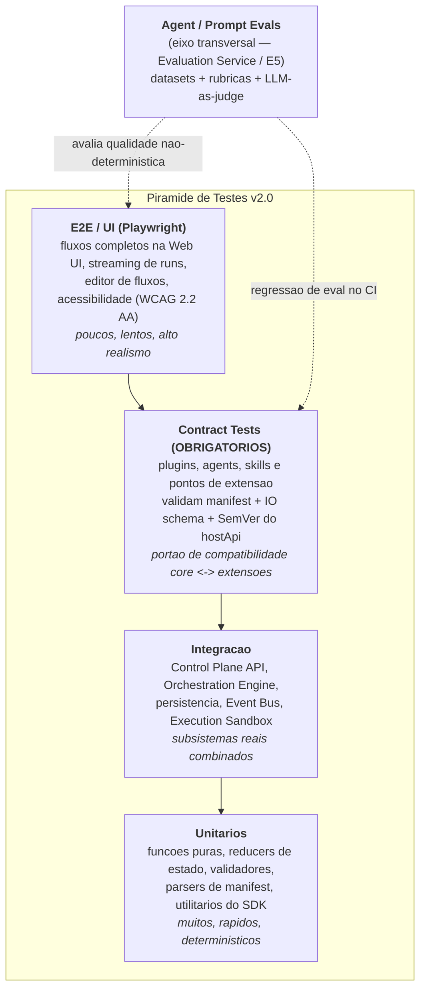

Descrição das camadas:

- **Unitários** — cobrem lógica determinística do core e do SDK: parsing e validação de `plugin.yaml`/`agent.yaml`/`skill.yaml`/`flow.yaml`/`eval.yaml`, resolução de capabilities, expressões de arestas condicionais, cálculo de budgets, redatores de traços. Backend em `pytest`; frontend (`lib/`) em `vitest`. São a base numérica da meta de cobertura.
- **Integração** — exercitam subsistemas reais combinados: rotas `/v2` do **Control Plane API**, execução de grafo no **Orchestration Engine** (checkpointing, retries, human-in-the-loop), durabilidade no **State Store**, publicação/consumo no **Event Bus**, e execução real no **Execution Sandbox**. Rodam contra SQLite no modo local e contra PostgreSQL/Redis/MinIO no perfil de produção.
- **Contract Tests (OBRIGATÓRIOS)** — todo **Ponto de Extensão** publica uma suíte de conformidade que qualquer **Plugin/Agent/Skill** DEVE passar para ser considerado válido. Verificam: aderência do manifest ao schema, conformidade do IO ao contrato tipado do ponto de extensão, respeito à faixa de compatibilidade (`hostApi: ">=2.0 <3.0"`), declaração explícita de permissões, e comportamento correto sob budgets e guardrails. O **Plugin Host** recusa carregar extensões que falhem o contrato; o **Marketplace (E13)** exige o selo de contrato verde na publicação. Estes testes são o mecanismo que impede que extensões dependam de internals.
- **E2E / UI (Playwright)** — dirigem a **Web UI (Next.js)** em fluxos ponta-a-ponta: criar sessão, montar um fluxo no editor visual, disparar um run, observar streaming de steps/traços, aprovar um nó human-in-the-loop, instalar um plugin do catálogo. Incluem verificações de **acessibilidade** (navegação 100% por teclado, checagens automatizadas WCAG 2.2 AA via axe).

### 17.2 Agent e prompt evals

Componentes não-determinísticos (agents, Reasoning Strategies, Router & Selector) não podem ser validados apenas por asserts exatos. Eles são avaliados por **Evals** — a especificação canônica **dataset + rubrica + métricas** — executadas pelo **Evaluation Service** e realimentando o **Router & Selector** (épico **E5**, feedback fechado).

- **Datasets** — conjuntos versionados de casos (`eval.yaml`) com entradas, contexto e, quando aplicável, saídas de referência (gold). Incluem casos felizes, adversariais e de regressão (bugs reprodutíveis capturados como caso). São armazenados de forma durável e versionados junto ao código.
- **Rubricas** — critérios explícitos e pontuáveis (correção, completude, aderência ao formato/IO schema, segurança, custo). Combinam checagens determinísticas (schema válido, patch aplica, testes passam) com julgamento qualitativo.
- **LLM-as-judge** — um **Evaluator** plugável pontua saídas contra a rubrica usando um modelo juiz, com prompt de julgamento versionado, saída estruturada (nota + justificativa) e mitigação de viés (ordem randomizada, calibração contra amostra rotulada por humanos). O julgamento nunca é a única fonte: gates duros continuam determinísticos.
- **Regressão de eval no CI** — o pipeline roda um subconjunto barato e estável de evals a cada PR que toca agents/prompts/reasoning/roteamento e falha se a métrica agregada cair abaixo do baseline registrado (limiar configurável, ex.: sem regressão > 2 pontos percentuais na taxa de aprovação da rubrica). Suítes de eval completas e caras rodam em cadência agendada (nightly), não bloqueando cada PR.
- **Online / feedback fechado** — em produção, evals online amostram runs reais e alimentam métricas que o **Selector** usa para ajustar escolha de agent/modelo/estratégia por política, fechando o ciclo de **Avaliação contínua**.

### 17.3 Testes de performance e carga

Validam as **Metas não-funcionais globais** do brief:

- **Latência** — verifica p95 do Control Plane (endpoints de leitura) **< 300 ms** e **início de streaming de um run < 1 s** sob carga nominal.
- **Carga e concorrência** — cenários que sustentam **≥ 100 runs concorrentes por nó de trabalho de referência**, confirmando o escalonamento horizontal dos workers de execução.
- **Soak/estabilidade** — execuções prolongadas para detectar vazamentos de memória, crescimento de filas Redis e degradação de latência ao longo do tempo.
- Executados fora do caminho crítico de cada PR (perfil dedicado), com resultados publicados como artefatos no **Artifact Store (MinIO)** e comparados contra baselines de latência/throughput; regressão significativa é um gate na promoção para release.

### 17.4 Testes de segurança

Alinhados ao princípio **Isolamento e menor privilégio** e às metas de segurança do brief:

- **SAST** — análise estática do código do core e do SDK a cada PR (regras para injeção, deserialização insegura, path traversal na aplicação de **Patch**, segredos hardcoded).
- **Dependency scan** — varredura de vulnerabilidades e licenças em dependências Python e Node; falha o gate em vulnerabilidades de severidade alta/crítica sem exceção aprovada.
- **Teste de escape de sandbox** — suíte específica que tenta violar o **Execution Sandbox** (Docker endurecido): acesso à rede (que deve estar **desligada por padrão**), fuga do filesystem montado, escalonamento de privilégio, esgotamento de recursos além do budget. É um teste de contrato de segurança obrigatório para qualquer mudança no sandbox.
- **RBAC/tenant isolation** — testes que confirmam que um tenant não acessa dados/quotas de outro e que endpoints sensíveis exigem papel adequado (ver E11).

### 17.5 Quality gates (CI/CD e Validation Gate)

Os gates aparecem em dois lugares: no **CI/CD** (antes do merge/release) e no **Validation Gate** de tempo de execução (portão que um resultado de fluxo — ex.: um patch gerado por agent — deve passar antes de ser aceito). A meta canônica de **cobertura do núcleo ≥ 85%** é um gate duro em ambos os contextos aplicáveis.

| Gate | Critério (bloqueia se falhar) | Onde aplica | Épico(s) |
|------|-------------------------------|-------------|----------|
| Lint & format | `ruff`/`eslint` sem erros; formatação consistente | CI | E12 |
| Typecheck | `mypy` (backend) + `tsc --noEmit` (frontend) sem erros | CI | E12 |
| Testes unit + integração | 100% verdes (`make test`) | CI + Validation Gate | E12 |
| **Cobertura do núcleo** | **≥ 85% de linhas no core** | CI | E12 / meta global |
| **Contract tests** | **100% dos pontos de extensão tocados passam** | CI + Plugin Host (load-time) + Marketplace | E1, E2, E6, E12, E13 |
| Regressão de eval | métrica agregada ≥ baseline (limiar configurável) | CI (PRs de agent/prompt) | E5, E12 |
| SAST | sem findings alta/crítica não suprimidos | CI | E11, E12 |
| Dependency scan | sem CVE alta/crítica sem exceção aprovada | CI | E11, E12 |
| Escape de sandbox | nenhum vetor de fuga bem-sucedido | CI (mudanças no sandbox) | E11, E12 |
| Performance/latência | p95 leitura < 300 ms; streaming < 1 s; ≥ 100 runs concorrentes | perfil dedicado / pré-release | E11, E12 |
| Acessibilidade | axe/WCAG 2.2 AA sem violações; navegação por teclado | CI frontend / E2E | E10, E12 |
| Build | build de produção do frontend conclui | CI | E12 |

O **Validation Gate** de execução reutiliza os mesmos verificadores (lint/testes/cobertura/segurança) aplicados ao workspace produzido por um agent: um patch só é aceito se passar lint, testes e checagens de segurança no **Execution Sandbox**, com **falha fechada** por padrão. Isso torna o mesmo conceito de qualidade coerente entre desenvolvimento da plataforma e operação dos fluxos.

### 17.6 Ambientes e dados de teste

- **Local (dev/CI padrão)** — SQLite, provider de LLM `stub` (respostas determinísticas para tornar evals e integração reproduzíveis), sandbox Docker opcional. É o modo em que `make check` reproduz o pipeline de CI.
- **Integração/produção-like** — PostgreSQL + pgvector, Redis e MinIO reais (via `make docker-up` ou serviços de CI), exercitando o caminho multi-tenant e as migrações versionadas.
- **Dados de teste** — fixtures determinísticas e factories por tenant; datasets de eval versionados (`eval.yaml`); nenhum dado sensível real. Bancos são criados e destruídos por execução, e migrações são testadas para frente e (quando possível) para trás, apoiando as metas de RPO ≤ 5 min / RTO ≤ 30 min.
- **Determinismo e replay** — traços e estado persistido permitem reexecutar (replay) um run como caso de teste, transformando incidentes de produção em regressões versionadas.

### 17.7 Critérios funcionais e não-funcionais

- **Funcionais** — o comportamento observável casa com o contrato: manifests validam contra schema; IO de agents/skills adere ao IO schema declarado; fluxos executam o grafo esperado (incluindo condicionais, human-in-the-loop, retries); patches aplicam com guarda de path e dry-run; a UI cumpre os fluxos-chave. Verificados por unit, integração, contract e e2e; para saídas não-determinísticas, por evals contra rubrica.
- **Não-funcionais** — latência, disponibilidade (SLO 99.9%), escala (≥ 100 runs concorrentes), segurança (RBAC, sandbox sem rede, isolamento de tenant), custo/budgets (medição de tokens e falha fechada), acessibilidade (WCAG 2.2 AA) e confiabilidade de dados (RPO/RTO, migrações reversíveis). Verificados por testes de performance/carga, testes de segurança, gates de acessibilidade e ensaios de recuperação.

Em conjunto, a pirâmide de testes, os contract tests obrigatórios, os agent/prompt evals e os quality gates operacionalizam o épico **E12** e sustentam a promessa da v2.0 de um **núcleo pequeno e estável com bordas ricas e confiáveis**.


---

## 18. Roadmap de Entrega por Etapas

Esta seção define **como** cada etapa (Épico) e subetapa (História → Subtarefa) do AutoDev Architect v2.0 é governada: pelo **fluxo de trabalho com portas (gates)**, por **Definition of Ready (DoR)** e **Definition of Done (DoD)** globais, por um **template padrão de História** e por **critérios funcionais e não-funcionais** explícitos. As metas não-funcionais aqui referenciadas herdam integralmente os alvos da Seção 6 do brief (latência p95 < 300 ms, SLO 99.9%, cobertura de núcleo ≥ 85%, WCAG 2.2 AA, RPO ≤ 5 min / RTO ≤ 30 min, budgets que falham fechado). O sequenciamento fino (dependências entre histórias, ondas e cronograma) é detalhado nas subseções **18.7–18.9**; aqui fica a **visão de fases** e o **detalhamento dos épicos E0–E6**.

> Convenções de identificação (brief §7): Épico `E<n>`, História `E<n>-S<m>`, Subtarefa `E<n>-S<m>-T<k>`. Ids de plugin/agent/skill em `namespace/nome` kebab-case; versões em SemVer; eventos em `dominio.entidade.acao` no passado.

---

### 18.1 Fluxo de trabalho e estados

Toda unidade de trabalho (História e, recursivamente, Subtarefa) transita por seis estados. Entre estados há **portas (gates)**: um conjunto de condições verificáveis que DEVEM ser verdadeiras para a transição ocorrer. Nenhuma transição é manual-sem-evidência: cada gate exige artefato ou sinal (CI verde, revisão aprovada, trace de validação, checklist marcado).

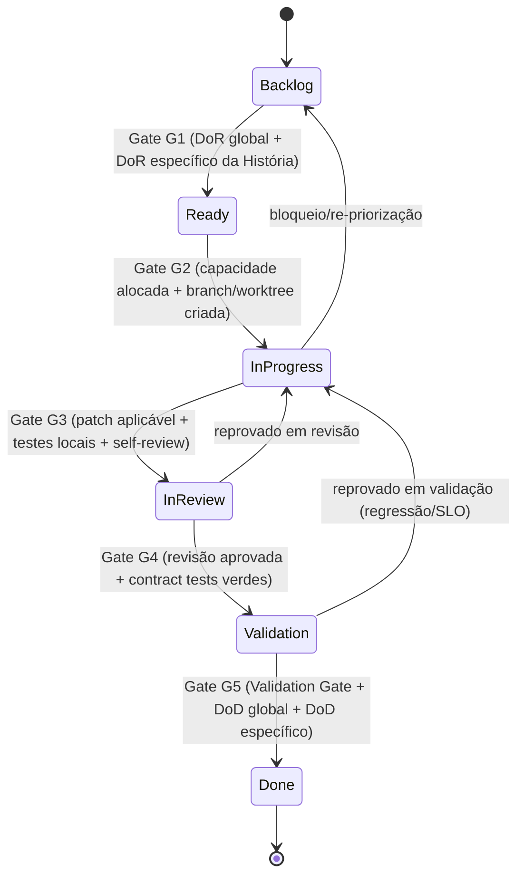

Definição das portas (o que precisa ser verdade para transitar):

| Gate | Transição | Condições verificáveis (todas obrigatórias) | Evidência |
| --- | --- | --- | --- |
| **G1** | Backlog → Ready | DoR global (18.2) atendido; DoR específico da História atendido; dependências resolvidas ou mockáveis; estimativa registrada | Checklist DoR marcado no card; issue linkada |
| **G2** | Ready → In Progress | Owner definido; capacidade/worker alocado; branch ou worktree criada; feature flag reservada quando aplicável | Branch criada; card atribuído |
| **G3** | In Progress → In Review | Patch (diff unificado) aplica com dry-run em path guardado; testes unitários locais verdes; self-review feito; sem segredos no diff | PR aberto; `run_secret_scanning` limpo |
| **G4** | In Review → Validation | ≥1 revisão humana aprovada; **contract tests** dos pontos de extensão tocados verdes; ADR/RFC referenciado quando há decisão de arquitetura | Aprovação no PR; CI de contratos verde |
| **G5** | Validation → Done | **Validation Gate** (lint + testes + cobertura + segurança) verde no Execution Sandbox; SLOs não regridem; DoD global + específico completos; docs e observabilidade entregues | Trace de validação; dashboards; DoD marcado |

Regras de retrocesso: reprovar em G4 devolve para In Progress; reprovar em G5 (regressão de SLO, cobertura abaixo do piso, falha de segurança) devolve para In Progress com a causa registrada como evento `run.step.failed` correlacionado.

---

### 18.2 Definition of Ready (DoR) — GLOBAL

Uma História só entra em **Ready** (Gate G1) quando **todos** os itens abaixo estão satisfeitos:

- [ ] **Objetivo e valor** descritos em 1–3 frases, com o resultado-chave do épico ao qual pertence.
- [ ] **Escopo e não-escopo** explícitos (o que entra e o que fica de fora).
- [ ] **Critérios de aceite funcionais** redigidos em forma verificável (Given/When/Then ou lista testável).
- [ ] **Critérios não-funcionais** aplicáveis citados com alvo numérico (latência, cobertura, budget, a11y).
- [ ] **Contratos afetados** identificados (ponto de extensão, schema de IO, evento, endpoint `/v2`) com faixa `hostApi` quando aplicável.
- [ ] **Dependências** mapeadas (histórias/épicos precedentes) e desbloqueadas ou mockáveis.
- [ ] **Dados/fixtures** e ambiente necessários disponíveis (SQLite local, provider stub, seeds).
- [ ] **Riscos** conhecidos listados com mitigação inicial.
- [ ] **Estimativa** registrada (tamanho relativo) e cabe em uma iteração.
- [ ] **Métricas de sucesso** definidas (o que será medido para declarar valor entregue).
- [ ] **Impacto de segurança/RBAC/tenant** avaliado (menor privilégio, permissões de plugin, isolamento).

---

### 18.3 Definition of Done (DoD) — GLOBAL

Uma História só transita para **Done** (Gate G5) quando **todos** os itens abaixo são verdadeiros e evidenciados:

- [ ] **Todos os critérios de aceite funcionais** verificados por teste automatizado.
- [ ] **Critérios não-funcionais** medidos e dentro do alvo (sem regressão de SLO).
- [ ] **Testes passando** em todos os níveis aplicáveis da pirâmide (unit → integração → e2e).
- [ ] **Cobertura**: núcleo ≥ 85% de linhas; a área tocada não reduz a cobertura global.
- [ ] **Contract tests** obrigatórios verdes para todo ponto de extensão/endpoint/evento tocado.
- [ ] **Documentação atualizada** em `docs/` e raiz (ADR/RFC quando há decisão; changelog; exemplos no SDK).
- [ ] **Observabilidade**: traços, métricas e eventos emitidos (OpenTelemetry) e visíveis em dashboard; replay possível a partir do estado persistido.
- [ ] **Segurança**: RBAC aplicado; plugins com permissões explícitas; sandbox sem rede por padrão; `run_secret_scanning` limpo; dependências sem CVE crítico.
- [ ] **Acessibilidade (quando há UI)**: WCAG 2.2 AA verificado; navegação 100% por teclado; contraste e foco validados; sem regressão em teste de a11y.
- [ ] **Budgets**: caminhos de execução respeitam tetos de tokens/custo/tempo/passos e **falham fechado**.
- [ ] **Migrações** versionadas e reversíveis quando possível; RPO ≤ 5 min / RTO ≤ 30 min preservados.
- [ ] **Feature flag** e rollback documentados; release notes preparadas.

---

### 18.4 Template padrão de História

Todo `E<n>-S<m>` DEVE seguir este template. Os campos são obrigatórios; "N/A" é permitido apenas com justificativa.

```yaml
# história: E<n>-S<m> — <título curto>
id: E<n>-S<m>
epico: E<n>
titulo: <título curto e acionável>

objetivo: |
  <1-3 frases: que capacidade de plataforma entrega e por quê>

escopo:
  inclui:
    - <item no escopo>
  nao_inclui:
    - <item fora do escopo>

criterios_aceite_funcionais:
  - id: AC-1
    given_when_then: "Dado ... Quando ... Então ..."   # verificável por teste
  - id: AC-2
    given_when_then: "..."

criterios_nao_funcionais:
  - dimensao: latencia|cobertura|seguranca|a11y|budget|disponibilidade|escala
    alvo: <valor numérico do brief §6 ou específico>
    como_medir: <métrica/dashboard/teste>

dor_especifico:                # além do DoR global (18.2)
  - <pré-condição específica desta história>

dod_especifico:                # além do DoD global (18.3)
  - <critério de conclusão específico>

dependencias:
  - <E<n>-S<m> ou componente>   # ver 18.8 para sequenciamento

riscos:
  - risco: <descrição>
    prob_impacto: <baixo|médio|alto>
    mitigacao: <ação>

estimativa: <XS|S|M|L|XL>       # tamanho relativo, cabe em 1 iteração

metricas_sucesso:
  - <indicador mensurável de valor entregue>

subtarefas:
  - id: E<n>-S<m>-T1
    desc: <passo técnico executável>
  - id: E<n>-S<m>-T2
    desc: <...>
```

---

### 18.5 Fases e ondas de release (visão geral)

Três marcos de maturidade. O sequenciamento detalhado (quais histórias em cada onda, gráfico de dependências) está nas subseções **18.7–18.9**.

| Marco | Objetivo do marco | Épicos-âncora | Portão de saída do marco | Estabilidade dos contratos |
| --- | --- | --- | --- | --- |
| **Alpha** | Fundação plugável utilizável internamente; núcleo pequeno e observável | E0, E1, E2, E3 | Plugin Host carrega/isola plugins; um Flow declarativo executa um Agent-como-plugin com trace; PostgreSQL padrão | Contratos `experimental`; podem quebrar entre minors |
| **Beta** | Plataforma completa em capacidade, endurecida, aberta a early adopters | E4, E5, E6, E7, E8, E9 | Reasoning + Router/Selector + Evals fechando o loop; Skills v2; RAG; API `/v2` + MCP estáveis | Contratos `stable` sob SemVer; deprecations anunciadas |
| **GA** | Produção multi-tenant, segura, com Marketplace | E10, E11, E12, E13 | UI/Design System WCAG 2.2 AA; RBAC/tenants/quotas; quality gates de CI; publicação/verificação de plugins | Contratos `stable` com garantia de compatibilidade dentro do major |

Critérios não-funcionais mínimos por marco:

| Dimensão | Alpha | Beta | GA |
| --- | --- | --- | --- |
| Cobertura núcleo | ≥ 70% | ≥ 80% | ≥ 85% |
| Contract tests | pontos-chave | todos os pontos de extensão | todos + fuzz de contrato |
| Latência p95 (leitura CP) | best-effort | < 400 ms | < 300 ms |
| Disponibilidade | dev | staging monitorado | SLO 99.9% |
| a11y | — | telas-chave AA | 100% AA + teclado |
| Segurança | segredos + sandbox | RBAC + permissões de plugin | RBAC obrigatório + assinatura de plugin |

---

### 18.6 Detalhamento dos épicos E0–E6

Para cada épico: objetivo, resultado-chave e 3–6 histórias; cada história com subtarefas e um bloco de critérios (Funcionais, Não-Funcionais, DoR específico, DoD específico, Dependências).

---

#### E0 — Fundações & Hardening

**Objetivo.** Estabelecer a base de segurança, configuração e observabilidade e tornar **PostgreSQL** o padrão de persistência (mantendo SQLite no modo local-first).
**Resultado-chave.** Um esqueleto de plataforma que sobe local (SQLite + provider stub) e em produção (PostgreSQL + Redis + MinIO) sem mudança de código, já emitindo traços/métricas via OpenTelemetry e com configuração declarativa validada.

**Histórias.**

- **E0-S1 — Camada de configuração declarativa e tipada**
  - Subtarefas: `E0-S1-T1` esquema de config (Pydantic Settings) com perfis local/prod; `E0-S1-T2` carregamento por env/arquivo com precedência; `E0-S1-T3` validação fail-fast + comando `config validate`.

  | Critério | Detalhe |
  | --- | --- |
  | Funcionais | Config inválida aborta o boot com mensagem acionável; perfis `local` (SQLite/stub) e `prod` (PostgreSQL/Redis/MinIO) selecionáveis por variável; segredos nunca logados |
  | Não-Funcionais | Boot com config válida < 2 s; 100% dos campos com tipo e default seguro; cobertura do módulo ≥ 85% |
  | DoR específico | Inventário de todas as variáveis atuais da v1 levantado |
  | DoD específico | `docs/config.md` publicado; matriz local×prod testada em CI |
  | Dependências | — (raiz do épico) |

- **E0-S2 — Migração para PostgreSQL como padrão (State Store)**
  - Subtarefas: `E0-S2-T1` modelagem inicial (sessões/runs/steps) com Alembic; `E0-S2-T2` abstração de repositório agnóstica (SQLite↔PostgreSQL); `E0-S2-T3` migração/seed reversível.

  | Critério | Detalhe |
  | --- | --- |
  | Funcionais | Mesma suíte de testes passa em SQLite e PostgreSQL; migrações aplicam e revertem; seeds de dev disponíveis |
  | Não-Funcionais | Migração versionada e reversível; RPO ≤ 5 min / RTO ≤ 30 min documentados; sem downtime em migração aditiva |
  | DoR específico | ADR "PostgreSQL como padrão" aprovado |
  | DoD específico | Runbook de backup/restore em `docs/ops/`; teste de round-trip de migração no CI |
  | Dependências | E0-S1 |

- **E0-S3 — Observabilidade base (OpenTelemetry)**
  - Subtarefas: `E0-S3-T1` tracing de requisição/step; `E0-S3-T2` métricas (contadores/histogramas) e exporter OTLP; `E0-S3-T3` correlação trace↔run↔step.

  | Critério | Detalhe |
  | --- | --- |
  | Funcionais | Toda requisição e todo step geram span correlacionado a `run_id`/`step_id`; métricas de latência e erro expostas |
  | Não-Funcionais | Overhead de tracing < 5% de latência; amostragem configurável; sem PII em spans |
  | DoR específico | Convenção de nomes de spans/métricas definida |
  | DoD específico | Dashboard base publicado; alerta de erro-rate ativo em staging |
  | Dependências | E0-S1 |

- **E0-S4 — Baseline de segurança e higiene de segredos**
  - Subtarefas: `E0-S4-T1` gestão de segredos (env/secret store) sem hardcode; `E0-S4-T2` scanning de segredos e SCA no CI; `E0-S4-T3` cabeçalhos/segurança HTTP default.

  | Critério | Detalhe |
  | --- | --- |
  | Funcionais | Nenhum segredo em repositório; pipeline bloqueia PR com segredo/CVE crítico |
  | Não-Funcionais | Sandbox padrão sem rede; dependências sem CVE crítico; scanning < 3 min no CI |
  | DoR específico | Política de severidade de CVE acordada |
  | DoD específico | `run_secret_scanning` integrado; `docs/security/baseline.md` |
  | Dependências | E0-S1 |

- **E0-S5 — Redis (Cache/Queue/Locks) e MinIO (Artifact Store)**
  - Subtarefas: `E0-S5-T1` conexão Redis com locks distribuídos; `E0-S5-T2` cliente MinIO/S3 para artefatos; `E0-S5-T3` fallback local sem essas dependências.

  | Critério | Detalhe |
  | --- | --- |
  | Funcionais | Locks distribuídos evitam execução duplicada; artefatos (patch/log) persistem e são recuperáveis; modo local degrada sem crash |
  | Não-Funcionais | Lock com timeout/renovação; put/get de artefato p95 < 200 ms local; cobertura ≥ 85% |
  | DoR específico | Convenção de chaves/buckets definida |
  | DoD específico | Teste de contenção de lock; `docs/ops/storage.md` |
  | Dependências | E0-S1 |

---

#### E1 — Núcleo de Plugins & SDK

**Objetivo.** Criar o **Plugin Host** e os **pontos de extensão** tipados, com manifest, isolamento, permissões e um **SDK** (Python/TS) com DX de primeira classe.
**Resultado-chave.** Um plugin de exemplo é descoberto, carregado, isolado e ativado a partir de `plugin.yaml`, respeitando permissões declaradas, com contrato versionado (`hostApi`).

**Histórias.**

- **E1-S1 — Especificação de `plugin.yaml` e pontos de extensão**
  - Subtarefas: `E1-S1-T1` schema JSON do manifest (id, versão, `hostApi`, permissões, extension points); `E1-S1-T2` catálogo tipado de pontos de extensão; `E1-S1-T3` validador de manifest.

  | Critério | Detalhe |
  | --- | --- |
  | Funcionais | Manifest com `namespace/nome`, SemVer e faixa `hostApi` valida/rejeita corretamente; ponto de extensão desconhecido é recusado |
  | Não-Funcionais | Validação de manifest < 50 ms; **contract tests** cobrem cada ponto de extensão declarado |
  | DoR específico | Lista canônica de pontos de extensão v2 acordada (RFC) |
  | DoD específico | Schema publicado no SDK; `docs/plugins/manifest.md` |
  | Dependências | E0-S1 |

- **E1-S2 — Descoberta e ciclo de vida (Plugin Host)**
  - Subtarefas: `E1-S2-T1` descoberta (diretório/entry points); `E1-S2-T2` estados install→enable→disable→uninstall; `E1-S2-T3` resolução de versão/compatibilidade `hostApi`.

  | Critério | Detalhe |
  | --- | --- |
  | Funcionais | Plugin incompatível com `hostApi` é rejeitado com motivo; ciclo de vida emite `plugin.installed`/`plugin.enabled`/`plugin.disabled` |
  | Não-Funcionais | Carregamento de 50 plugins < 1 s; falha de um plugin não derruba o host (fail isolado) |
  | DoR específico | Convenção de eventos de plugin definida (§7) |
  | DoD específico | Máquina de estados testada; eventos no Event Bus documentados |
  | Dependências | E1-S1, E0-S3 |

- **E1-S3 — Isolamento e permissões (menor privilégio)**
  - Subtarefas: `E1-S3-T1` modelo de permissões declaradas (fs/net/exec/segredos); `E1-S3-T2` sandbox de import/execução; `E1-S3-T3` broker que medeia acessos.

  | Critério | Detalhe |
  | --- | --- |
  | Funcionais | Plugin sem permissão de rede não faz I/O de rede; acesso a arquivo é limitado a paths concedidos; violação é bloqueada e auditada |
  | Não-Funcionais | Default nega tudo (fail-closed); overhead do broker < 10%; sem escalonamento de privilégio em teste adversarial |
  | DoR específico | Taxonomia de permissões aprovada |
  | DoD específico | Teste de negação por permissão; auditoria via evento; `docs/plugins/permissions.md` |
  | Dependências | E1-S2, E0-S4 |

- **E1-S4 — SDK e DX (scaffolding)**
  - Subtarefas: `E1-S4-T1` contratos tipados Python/TS; `E1-S4-T2` CLI `sdk new plugin` (scaffold); `E1-S4-T3` harness de teste de contrato para autores.

  | Critério | Detalhe |
  | --- | --- |
  | Funcionais | `sdk new plugin` gera projeto que compila, roda e passa contract tests; exemplos executáveis incluídos |
  | Não-Funcionais | Scaffold → primeiro teste verde < 5 min; contratos com tipos estáveis SemVer |
  | DoR específico | Superfície mínima do SDK definida |
  | DoD específico | Guia "Escreva seu primeiro plugin" em `docs/sdk/`; SDK publicado versionado |
  | Dependências | E1-S1 |

- **E1-S5 — Registro e resolução de plugins ativos**
  - Subtarefas: `E1-S5-T1` índice de plugins/pontos habitados; `E1-S5-T2` API de consulta ao Control Plane; `E1-S5-T3` hot-reload seguro em dev.

  | Critério | Detalhe |
  | --- | --- |
  | Funcionais | Control Plane lista plugins ativos e pontos habitados; recarregar em dev não corrompe estado |
  | Não-Funcionais | Consulta ao registro p95 < 100 ms; consistente após enable/disable |
  | DoR específico | Contrato de leitura do registro definido |
  | DoD específico | Endpoint `/v2` documentado; teste de hot-reload |
  | Dependências | E1-S2 |

---

#### E2 — Framework de Agentes

**Objetivo.** Definir **Agent Manifest**, contratos de IO tipados e o **Agent Registry**, tornando agents **plugins** de primeira classe com **capabilities** declaradas.
**Resultado-chave.** Um `agent.yaml` publica um agent com capabilities e IO schema; o Agent Runtime o instancia, aplica budgets/guardrails e o executa produzindo saída conforme contrato.

**Histórias.**

- **E2-S1 — Especificação de `agent.yaml` e IO schema**
  - Subtarefas: `E2-S1-T1` schema (id, versão, capabilities, IO, tools/skills, política, budgets); `E2-S1-T2` validação de IO tipado; `E2-S1-T3` versionamento de capability.

  | Critério | Detalhe |
  | --- | --- |
  | Funcionais | Agent declara capabilities e IO schema; entrada/saída fora do schema é rejeitada; budgets herdam default seguro |
  | Não-Funcionais | Validação de IO < 20 ms; contract tests por capability |
  | DoR específico | Vocabulário inicial de capabilities acordado |
  | DoD específico | Schema no SDK; `docs/agents/manifest.md` |
  | Dependências | E1-S1 |

- **E2-S2 — Agent Registry (registro/descoberta/versão)**
  - Subtarefas: `E2-S2-T1` persistência do registro; `E2-S2-T2` busca por capability; `E2-S2-T3` resolução de versão SemVer.

  | Critério | Detalhe |
  | --- | --- |
  | Funcionais | Buscar agents por capability retorna candidatos ordenáveis; múltiplas versões coexistem; deprecation sinalizada |
  | Não-Funcionais | Busca p95 < 100 ms; registro consistente com Plugin Host |
  | DoR específico | Contrato de query do registro definido |
  | DoD específico | Endpoint `/v2` de catálogo; teste de resolução de versão |
  | Dependências | E2-S1, E1-S5 |

- **E2-S3 — Agent Runtime (execução, budgets, guardrails)**
  - Subtarefas: `E2-S3-T1` ciclo de execução do agent; `E2-S3-T2` imposição de budgets (tokens/custo/tempo/passos); `E2-S3-T3` guardrails de saída.

  | Critério | Detalhe |
  | --- | --- |
  | Funcionais | Agent excede budget → interrompido e marcado; guardrail bloqueia/corrige saída fora de política; falha registra step |
  | Não-Funcionais | Budgets **falham fechado**; overhead do runtime < 8%; trace por step |
  | DoR específico | Definição de budgets default por run (brief §6) |
  | DoD específico | Teste de estouro de budget e de guardrail; métricas de tokens/custo emitidas |
  | Dependências | E2-S1, E0-S3 |

- **E2-S4 — Mediação de tools/skills e provider de LLM**
  - Subtarefas: `E2-S4-T1` broker de tools com permissões; `E2-S4-T2` abstração de provider (stub local ↔ real); `E2-S4-T3` medição de tokens/custo por chamada.

  | Critério | Detalhe |
  | --- | --- |
  | Funcionais | Agent só acessa tools/skills concedidas; provider stub roda offline; troca de provider sem mudar o agent |
  | Não-Funcionais | Menor privilégio nas tools; contabilização de custo por run/tenant; sem rede na sandbox por default |
  | DoR específico | Interface de provider definida |
  | DoD específico | Teste com stub e com provider real mockado; `docs/agents/runtime.md` |
  | Dependências | E2-S3, E1-S3 |

- **E2-S5 — Agent de referência `autodev/agent-coder` como plugin**
  - Subtarefas: `E2-S5-T1` empacotar agent existente da v1 como plugin; `E2-S5-T2` declarar capabilities/IO; `E2-S5-T3` migrar comportamento com paridade.

  | Critério | Detalhe |
  | --- | --- |
  | Funcionais | `autodev/agent-coder` roda via Agent Runtime com paridade funcional à v1; instalável/desinstalável |
  | Não-Funcionais | Sem regressão de qualidade vs. baseline v1; cobertura ≥ 85% |
  | DoR específico | Baseline de comportamento da v1 capturado |
  | DoD específico | Suite de paridade verde; exemplo no SDK |
  | Dependências | E2-S3, E2-S4, E1-S4 |

---

#### E3 — Motor de Fluxos (Orchestration Engine)

**Objetivo.** Tornar **fluxo-como-configuração** real: grafo declarativo versionado, checkpointing, retries, **human-in-the-loop** e editor visual.
**Resultado-chave.** Um `flow.yaml` define um grafo de nós (agent/skill/tool/condicional/humano/sub-fluxo/map-reduce) que o Orchestration Engine executa com estado durável, retomável e observável.

**Histórias.**

- **E3-S1 — Especificação de `flow.yaml` (grafo declarativo)**
  - Subtarefas: `E3-S1-T1` schema de nós e arestas condicionais; `E3-S1-T2` validação de grafo (ciclos, tipos de IO entre nós); `E3-S1-T3` versionamento de fluxo.

  | Critério | Detalhe |
  | --- | --- |
  | Funcionais | Fluxo com nós de todos os tipos valida; aresta condicional avalia predicado sobre o estado; grafo inválido é rejeitado |
  | Não-Funcionais | Validação de fluxo < 100 ms; contract tests do schema |
  | DoR específico | Tipos de nó canônicos definidos (brief §3) |
  | DoD específico | Schema no SDK; `docs/flows/spec.md` |
  | Dependências | E1-S1 |

- **E3-S2 — Execução do grafo com estado durável (Run/Step)**
  - Subtarefas: `E3-S2-T1` executor de grafo; `E3-S2-T2` persistência de Run/Step no State Store; `E3-S2-T3` gatilhos (mensagem/webhook/cron/Event Bus).

  | Critério | Detalhe |
  | --- | --- |
  | Funcionais | Um run executa o grafo na ordem correta; cada step persiste status/tentativas; trigger inicia run |
  | Não-Funcionais | ≥ 100 runs concorrentes por nó de trabalho; início de streaming de run < 1 s |
  | DoR específico | Modelo de Run/Step (E0-S2) disponível |
  | DoD específico | Teste de concorrência; eventos `flow.run.started`/`run.step.completed` emitidos |
  | Dependências | E3-S1, E0-S2, E2-S3 |

- **E3-S3 — Checkpointing, retries e replay determinístico**
  - Subtarefas: `E3-S3-T1` checkpoints por step; `E3-S3-T2` política de retry/backoff; `E3-S3-T3` replay a partir do estado persistido.

  | Critério | Detalhe |
  | --- | --- |
  | Funcionais | Run interrompido retoma do último checkpoint; retry respeita política; replay reproduz decisões |
  | Não-Funcionais | Determinismo garantido a partir do trace; overhead de checkpoint < 10% |
  | DoR específico | Definição de fronteira de determinismo acordada |
  | DoD específico | Teste de crash-recovery e de replay idêntico |
  | Dependências | E3-S2 |

- **E3-S4 — Human-in-the-loop**
  - Subtarefas: `E3-S4-T1` nó de pausa/aprovação; `E3-S4-T2` API para retomar com decisão/edição; `E3-S4-T3` timeout/expiração.

  | Critério | Detalhe |
  | --- | --- |
  | Funcionais | Fluxo pausa em nó humano e retoma após decisão; edição humana altera o estado; timeout aciona rota alternativa |
  | Não-Funcionais | Estado de pausa durável (sobrevive a restart); RBAC aplicado à decisão |
  | DoR específico | Contrato de decisão humana definido |
  | DoD específico | Teste de pausa/retomada e de timeout; evento de aprovação |
  | Dependências | E3-S2, E0-S4 |

- **E3-S5 — Nós compostos: sub-fluxo e map/reduce**
  - Subtarefas: `E3-S5-T1` sub-fluxo aninhado; `E3-S5-T2` map/reduce paralelo; `E3-S5-T3` agregação de resultados e propagação de budget.

  | Critério | Detalhe |
  | --- | --- |
  | Funcionais | Sub-fluxo executa e retorna ao pai; map dispara N ramos e reduce agrega; budget do pai limita os filhos |
  | Não-Funcionais | Paralelismo escala horizontalmente; budget agregado falha fechado |
  | DoR específico | Semântica de propagação de budget definida |
  | DoD específico | Teste de map/reduce e de sub-fluxo; trace hierárquico |
  | Dependências | E3-S2, E2-S3 |

- **E3-S6 — Editor visual de fluxos (base)**
  - Subtarefas: `E3-S6-T1` render do grafo a partir de `flow.yaml`; `E3-S6-T2` edição bidirecional (visual↔YAML); `E3-S6-T3` validação inline.

  | Critério | Detalhe |
  | --- | --- |
  | Funcionais | Editar no canvas atualiza o `flow.yaml` e vice-versa; erros de validação aparecem inline |
  | Não-Funcionais | WCAG 2.2 AA; edição 100% por teclado; render de grafo de 50 nós < 500 ms |
  | DoR específico | Design tokens/Componentes base disponíveis (dependência de E10) |
  | DoD específico | Teste de round-trip visual↔YAML; auditoria de a11y |
  | Dependências | E3-S1, E10 (Design System base) |

---

#### E4 — Reasoning

**Objetivo.** Prover o **Reasoning Engine** com **Reasoning Strategies** plugáveis (ReAct, Plan-and-Execute, Reflection, Debate/ToT), governadas por políticas, budgets e traços.
**Resultado-chave.** Um agent seleciona uma estratégia de raciocínio plugável por política; cada passo de raciocínio é traçado, orçado e reproduzível.

**Histórias.**

- **E4-S1 — Contrato de Reasoning Strategy (ponto de extensão)**
  - Subtarefas: `E4-S1-T1` interface tipada de estratégia; `E4-S1-T2` ciclo passo-a-passo instrumentado; `E4-S1-T3` contract tests da estratégia.

  | Critério | Detalhe |
  | --- | --- |
  | Funcionais | Estratégia implementa contrato e é plugável; cada passo emite trace; saída conforme IO do agent |
  | Não-Funcionais | Contract tests obrigatórios; overhead de instrumentação < 5% |
  | DoR específico | Superfície do contrato aprovada (RFC) |
  | DoD específico | Schema no SDK; `docs/reasoning/contract.md` |
  | Dependências | E1-S1, E2-S3 |

- **E4-S2 — Estratégias de referência (ReAct, Plan-and-Execute)**
  - Subtarefas: `E4-S2-T1` ReAct; `E4-S2-T2` Plan-and-Execute; `E4-S2-T3` testes comparativos.

  | Critério | Detalhe |
  | --- | --- |
  | Funcionais | Ambas rodam via Reasoning Engine e produzem saída válida; alternáveis sem mudar o agent |
  | Não-Funcionais | Respeitam budgets (falham fechado); cobertura ≥ 85% |
  | DoR específico | Tarefas de referência para comparação definidas |
  | DoD específico | Traços comparáveis; exemplos no SDK |
  | Dependências | E4-S1 |

- **E4-S3 — Estratégias avançadas (Reflection, Debate/ToT)**
  - Subtarefas: `E4-S3-T1` Reflection; `E4-S3-T2` Debate/Tree-of-Thoughts; `E4-S3-T3` controle de custo do fan-out.

  | Critério | Detalhe |
  | --- | --- |
  | Funcionais | Reflection revisa e corrige; Debate/ToT explora e converge; fan-out limitado por budget |
  | Não-Funcionais | Custo de fan-out contabilizado por run; teto de passos aplicado |
  | DoR específico | Limites de fan-out padrão definidos |
  | DoD específico | Teste de convergência e de teto de custo |
  | Dependências | E4-S1 |

- **E4-S4 — Políticas e budgets de reasoning**
  - Subtarefas: `E4-S4-T1` política declarativa de escolha de estratégia; `E4-S4-T2` budgets por estratégia; `E4-S4-T3` fallback ao estourar.

  | Critério | Detalhe |
  | --- | --- |
  | Funcionais | Política seleciona estratégia por contexto; estouro aciona fallback definido |
  | Não-Funcionais | Falha fechado por padrão; decisão de política traçada |
  | DoR específico | DSL/formato de política acordado |
  | DoD específico | Teste de seleção e de fallback; `docs/reasoning/policies.md` |
  | Dependências | E4-S1, E2-S3 |

---

#### E5 — Roteamento / Seleção / Avaliação

**Objetivo.** Entregar **Router & Selector** (classificação de tarefa e escolha de agent/modelo/estratégia por política/custo) e o **Evaluation Service**, fechando o loop de feedback.
**Resultado-chave.** Uma tarefa é classificada, roteada e atribuída ao melhor agent/modelo/estratégia; evals medem a qualidade e realimentam o roteamento.

**Histórias.**

- **E5-S1 — Router (classificação de intenção/tarefa)**
  - Subtarefas: `E5-S1-T1` classificador plugável; `E5-S1-T2` mapeamento intenção→caminho de execução; `E5-S1-T3` trace da decisão.

  | Critério | Detalhe |
  | --- | --- |
  | Funcionais | Tarefa é classificada e roteada para o caminho correto; decisão traçada com justificativa |
  | Não-Funcionais | Decisão de roteamento p95 < 150 ms; classificador plugável (ponto de extensão) |
  | DoR específico | Taxonomia de intenções inicial definida |
  | DoD específico | Contract tests; métricas de acerto de roteamento |
  | Dependências | E2-S2, E4-S1 |

- **E5-S2 — Selector (agent/modelo/estratégia por política e custo)**
  - Subtarefas: `E5-S2-T1` matching por capability; `E5-S2-T2` política de custo/qualidade; `E5-S2-T3` desempate determinístico.

  | Critério | Detalhe |
  | --- | --- |
  | Funcionais | Selector escolhe candidato por capabilities + política + custo; escolha reproduzível dado o mesmo estado |
  | Não-Funcionais | Seleção p95 < 100 ms; respeita budgets e quotas de tenant |
  | DoR específico | Função objetivo custo×qualidade acordada |
  | DoD específico | Teste de seleção determinística; trace de decisão |
  | Dependências | E5-S1, E2-S2 |

- **E5-S3 — Evaluation Service (evals offline/online)**
  - Subtarefas: `E5-S3-T1` spec `eval.yaml` (dataset+rubrica+métricas); `E5-S3-T2` execução offline/online; `E5-S3-T3` armazenamento de resultados.

  | Critério | Detalhe |
  | --- | --- |
  | Funcionais | Eval roda sobre dataset e produz score por rubrica; Evaluator plugável (rubrica/LLM-as-judge/métrica) |
  | Não-Funcionais | Resultados versionados e reproduzíveis; execução paralela escala |
  | DoR específico | Formato de dataset/rubrica definido |
  | DoD específico | Contract tests do Evaluator; `docs/evals/spec.md` |
  | Dependências | E2-S2, E0-S2 |

- **E5-S4 — Loop de feedback eval → roteamento**
  - Subtarefas: `E5-S4-T1` publicar scores como sinal; `E5-S4-T2` ajustar política de Selector por resultado; `E5-S4-T3` guarda contra regressão.

  | Critério | Detalhe |
  | --- | --- |
  | Funcionais | Scores de eval influenciam a seleção subsequente; regressão detectada bloqueia promoção |
  | Não-Funcionais | Mudança de política auditável; sem loop instável (histerese/guarda) |
  | DoR específico | Critério de promoção/regressão definido |
  | DoD específico | Teste de feedback fechado; evento de mudança de política |
  | Dependências | E5-S2, E5-S3 |

---

#### E6 — Skills v2

**Objetivo.** Redefinir skills com **Skill Manifest**, **Skill Registry**, composição e **skills-como-plugin**, reutilizáveis por agents e fluxos.
**Resultado-chave.** Um `skill.yaml` publica uma skill (determinística ou assistida por LLM) com IO/permissões/gatilhos; ela é descoberta, composta e invocada por agents/fluxos com menor privilégio.

**Histórias.**

- **E6-S1 — Especificação de `skill.yaml`**
  - Subtarefas: `E6-S1-T1` schema (id, versão, IO, permissões, dependências, gatilhos); `E6-S1-T2` validação; `E6-S1-T3` versionamento.

  | Critério | Detalhe |
  | --- | --- |
  | Funcionais | Skill declara IO/permissões/gatilhos; IO fora do schema é rejeitado; determinística vs. assistida por LLM distinguidas |
  | Não-Funcionais | Validação < 20 ms; contract tests por skill |
  | DoR específico | Modelo de permissões de skill definido |
  | DoD específico | Schema no SDK; `docs/skills/manifest.md` |
  | Dependências | E1-S1 |

- **E6-S2 — Skill Registry (registro/descoberta/versão)**
  - Subtarefas: `E6-S2-T1` persistência; `E6-S2-T2` busca por gatilho/capacidade; `E6-S2-T3` resolução SemVer.

  | Critério | Detalhe |
  | --- | --- |
  | Funcionais | Skills descobertas por gatilho/nome; versões coexistem; deprecation sinalizada |
  | Não-Funcionais | Busca p95 < 100 ms; consistente com Plugin Host |
  | DoR específico | Contrato de query definido |
  | DoD específico | Endpoint `/v2` de catálogo; teste de resolução |
  | Dependências | E6-S1, E1-S5 |

- **E6-S3 — Invocação com menor privilégio via Agent Runtime**
  - Subtarefas: `E6-S3-T1` broker de invocação; `E6-S3-T2` aplicação de permissões/budgets; `E6-S3-T3` trace da chamada.

  | Critério | Detalhe |
  | --- | --- |
  | Funcionais | Agent/fluxo invoca skill concedida; permissão ausente bloqueia; resultado retorna no schema |
  | Não-Funcionais | Menor privilégio (fail-closed); budget de skill aplicado; trace por invocação |
  | DoR específico | Contrato de invocação definido |
  | DoD específico | Teste de negação por permissão; métricas de custo |
  | Dependências | E6-S1, E2-S4, E1-S3 |

- **E6-S4 — Composição de skills**
  - Subtarefas: `E6-S4-T1` encadeamento/pipeline de skills; `E6-S4-T2` resolução de dependências entre skills; `E6-S4-T3` propagação de budget/erro.

  | Critério | Detalhe |
  | --- | --- |
  | Funcionais | Skills compõem em pipeline; dependência ausente é reportada; erro interrompe com estado limpo |
  | Não-Funcionais | Budget agregado falha fechado; composição traçada ponta a ponta |
  | DoR específico | Semântica de composição definida |
  | DoD específico | Teste de pipeline e de dependência faltante |
  | Dependências | E6-S3 |

- **E6-S5 — Skills de referência como plugin**
  - Subtarefas: `E6-S5-T1` skill determinística (ex.: aplicar Patch com path-guard/dry-run); `E6-S5-T2` skill assistida por LLM; `E6-S5-T3` exemplos no SDK.

  | Critério | Detalhe |
  | --- | --- |
  | Funcionais | Skill de Patch aplica diff com guarda de path e dry-run; skill LLM respeita guardrails; ambas instaláveis |
  | Não-Funcionais | Dry-run sem efeitos colaterais; cobertura ≥ 85% |
  | DoR específico | Casos de patch de referência definidos |
  | DoD específico | Suite de paridade; exemplos executáveis no SDK |
  | Dependências | E6-S3, E1-S4 |

---

*O sequenciamento detalhado entre estas histórias, as dependências cruzadas com E7–E13 e a alocação por ondas alpha/beta/GA são desenvolvidos nas subseções **18.7–18.9 (Épicos E7–E13, Sequenciamento e Ondas de Release)**.*


---

### 18.7 Épicos E7–E13

Esta subseção dá continuidade ao detalhamento iniciado em 18.6 (E0–E6), mantendo
o mesmo formato: para cada épico, um bloco de **objetivo + resultado-chave** e de
3 a 6 **histórias** (`E<n>-S<m>`), cada uma com suas **subtarefas** (`E<n>-S<m>-T<k>`)
e uma tabela consolidando **Critérios Funcionais (CF)**, **Critérios Não-Funcionais
(CNF)**, **DoR**, **DoD** e **Dependências**. Todos os termos, componentes e ids
seguem o brief canônico (§3–§7).

---

#### 18.7.1 E7 — Context & RAG

| Campo | Descrição |
| --- | --- |
| **Objetivo** | Prover o **Context/RAG Service** com indexação por tree-sitter, embeddings em **Vector Store (pgvector)**, recuperação híbrida (léxico + vetorial) e **Context Providers** plugáveis, servindo contexto de código a agents e fluxos. |
| **Resultado-chave** | Um agent/fluxo obtém, via contrato estável, os N trechos mais relevantes de um repositório indexado em ≤ 300 ms (p95) para consultas quentes, com atribuição de fonte e sem vazar entre tenants. |

##### História E7-S1 — Pipeline de indexação com tree-sitter

- **E7-S1-T1**: Parser incremental multi-linguagem via tree-sitter; extração de símbolos (funções, classes, imports).
- **E7-S1-T2**: Chunking consciente de sintaxe (limites de símbolo, overlap configurável).
- **E7-S1-T3**: Fila de indexação incremental no Redis, disparada por eventos `repo.file.changed`.
- **E7-S1-T4**: Persistência de metadados de chunk (arquivo, span, símbolo, hash) no State Store.

| Item | Conteúdo |
| --- | --- |
| **CF** | Indexa ≥ 10 linguagens; reindexa apenas arquivos alterados (delta); expõe `index(repo)`/`reindex(paths)`; registra proveniência de cada chunk. |
| **CNF** | Indexação de repositório de 100k LOC < 5 min em nó de referência; idempotente; falha de parse não interrompe o lote. |
| **DoR** | E0 (config/observabilidade) e E8 (schema base) prontos; linguagens-alvo priorizadas; grammars tree-sitter fixadas por versão. |
| **DoD** | CF/CNF verdes; contract test do Context Provider; traços de indexação emitidos; docs de suporte a linguagens publicadas. |
| **Dependências** | E0, E8 |

##### História E7-S2 — Embeddings e Vector Store (pgvector)

- **E7-S2-T1**: Abstração `EmbeddingProvider` plugável (stub local, provider externo).
- **E7-S2-T2**: Schema pgvector com índice HNSW/IVFFlat e coluna `tenant_id`.
- **E7-S2-T3**: Batch/upsert de embeddings com deduplicação por hash de chunk.
- **E7-S2-T4**: Fallback stub determinístico para modo local-first (sem provider externo).

| Item | Conteúdo |
| --- | --- |
| **CF** | Gera e persiste embeddings por chunk; consulta ANN top-k; troca de provider sem reindexação forçada quando dimensão compatível. |
| **CNF** | Consulta ANN p95 < 150 ms para 1M vetores; isolamento por tenant garantido no filtro; dimensão configurável. |
| **DoR** | E7-S1 concluída; decisão de índice (HNSW vs IVFFlat) registrada em ADR. |
| **DoD** | Benchmark de recall/latência anexado; contract test do EmbeddingProvider; migração pgvector reversível. |
| **Dependências** | E7-S1, E8 |

##### História E7-S3 — Recuperação híbrida (léxico + vetorial)

- **E7-S3-T1**: Retriever léxico (BM25/full-text do PostgreSQL).
- **E7-S3-T2**: Fusão de rankings (Reciprocal Rank Fusion) entre léxico e vetorial.
- **E7-S3-T3**: Reranking opcional plugável e filtros por caminho/símbolo/linguagem.
- **E7-S3-T4**: Orçamento de contexto (token budget) com truncamento por relevância.

| Item | Conteúdo |
| --- | --- |
| **CF** | `retrieve(query, filters, budget)` retorna trechos com score e fonte; suporta modos léxico, vetorial e híbrido. |
| **CNF** | p95 < 300 ms em consulta quente; recall@10 ≥ baseline documentado no conjunto de avaliação de retrieval. |
| **DoR** | E7-S2 pronta; dataset de avaliação de recuperação definido. |
| **DoD** | Métricas de recall/latência no Evaluation Service; contract test do Retriever; docs de configuração de fusão. |
| **Dependências** | E7-S1, E7-S2, E5 (para eval de retrieval) |

##### História E7-S4 — Context Providers plugáveis

- **E7-S4-T1**: Ponto de extensão `ContextProvider` (arquivos, símbolos, memória de sessão).
- **E7-S4-T2**: Composição/priorização de múltiplos providers com deduplicação.
- **E7-S4-T3**: Integração com Agent Runtime (injeção de contexto por política).
- **E7-S4-T4**: Provider de memória de sessão persistida.

| Item | Conteúdo |
| --- | --- |
| **CF** | Providers registrados via Plugin Host; agent recebe contexto composto e atribuível; ordem/peso configuráveis por fluxo. |
| **CNF** | Provider isolado (permissões explícitas); timeout por provider; falha de um provider não derruba o run. |
| **DoR** | E1 (Plugin Host) e E2 (Agent Runtime) prontos; contrato ContextProvider aprovado. |
| **DoD** | Provider de exemplo publicado; contract test; traços de contexto por step. |
| **Dependências** | E1, E2, E7-S3 |

---

#### 18.7.2 E8 — Persistência & Dados

| Campo | Descrição |
| --- | --- |
| **Objetivo** | Estabelecer o modelo de dados **multi-tenant** durável no **State Store (PostgreSQL)**, com migrações versionadas, **event store**, integração com **Artifact Store (MinIO)** e suporte SQLite para modo local. |
| **Resultado-chave** | Sessões, runs, steps e entidades persistem de forma consistente e isolada por tenant, com RPO ≤ 5 min e migrações reversíveis; artefatos grandes vivem no MinIO referenciados por metadados. |

##### História E8-S1 — Modelo de dados multi-tenant e migrações

- **E8-S1-T1**: Schema de sessões/runs/steps/entidades com `tenant_id` e RLS (Row-Level Security).
- **E8-S1-T2**: Framework de migrações versionadas (up/down) e verificação de reversibilidade.
- **E8-S1-T3**: Camada de repositório com escopo de tenant obrigatório.
- **E8-S1-T4**: Perfil local SQLite com paridade de schema essencial.

| Item | Conteúdo |
| --- | --- |
| **CF** | Toda leitura/escrita é filtrada por tenant; migrações aplicam e revertem; SQLite roda o núcleo local-first. |
| **CNF** | Nenhuma query cross-tenant sem escopo; migração reversível quando possível; cobertura de repositório ≥ 85%. |
| **DoR** | E0 concluída; modelo lógico revisado em ADR; política de tenancy definida. |
| **DoD** | RLS testada com casos negativos; migração testada em CI up→down→up; docs de modelo de dados. |
| **Dependências** | E0 |

##### História E8-S2 — Event Store e durabilidade de runs

- **E8-S2-T1**: Tabela de eventos append-only (`dominio.entidade.acao`) com ordering por run.
- **E8-S2-T2**: Checkpointing de estado de fluxo para replay determinístico.
- **E8-S2-T3**: Projeções/materializações para consulta rápida de status.
- **E8-S2-T4**: Política de retenção e compactação de eventos.

| Item | Conteúdo |
| --- | --- |
| **CF** | Todo step emite eventos persistidos; run pode ser reconstruído a partir do event store; projeções refletem estado corrente. |
| **CNF** | Escrita de evento não bloqueia o run (append rápido); replay determinístico; RPO ≤ 5 min. |
| **DoR** | E8-S1 pronta; catálogo de eventos alinhado com E9. |
| **DoD** | Replay reproduz run idêntico em teste; retenção configurável; docs de event store. |
| **Dependências** | E8-S1, E3 (Motor de Fluxos), E9 (catálogo de eventos) |

##### História E8-S3 — Artifact Store (MinIO)

- **E8-S3-T1**: Cliente S3-compatível para patches, logs, saídas e builds.
- **E8-S3-T2**: Referência de artefato por metadados no State Store (não binário no DB).
- **E8-S3-T3**: URLs pré-assinadas com escopo de tenant e expiração.
- **E8-S3-T4**: Ciclo de vida/limpeza de artefatos órfãos.

| Item | Conteúdo |
| --- | --- |
| **CF** | Artefatos gravados/lidos via referência; download por URL pré-assinada; isolamento por tenant no bucket/prefixo. |
| **CNF** | Sem binários grandes no PostgreSQL; expiração de URL configurável; integridade por checksum. |
| **DoR** | E8-S1 pronta; MinIO provisionado; política de retenção definida. |
| **DoD** | Upload/download testados; limpeza de órfãos agendada; docs de artefatos. |
| **Dependências** | E8-S1 |

##### História E8-S4 — Backup, RPO/RTO e reversibilidade

- **E8-S4-T1**: Backup lógico/físico do PostgreSQL e do MinIO.
- **E8-S4-T2**: Runbook de restauração com verificação de RTO ≤ 30 min.
- **E8-S4-T3**: Teste periódico de restauração automatizado.

| Item | Conteúdo |
| --- | --- |
| **CF** | Backup programável; restauração documentada e executável; verificação de integridade pós-restore. |
| **CNF** | RPO ≤ 5 min, RTO ≤ 30 min em produção; teste de restore em CI/staging. |
| **DoR** | E8-S1..S3 prontas; ambiente de staging disponível. |
| **DoD** | Restore validado end-to-end; runbook publicado; alarmes de falha de backup. |
| **Dependências** | E8-S1, E8-S2, E8-S3, E11 |

---

#### 18.7.3 E9 — APIs, Eventos & MCP

| Campo | Descrição |
| --- | --- |
| **Objetivo** | Expor a **Control Plane API /v2** (FastAPI) com sessões, fluxos, runs, config e registries; streaming de runs; **catálogo de eventos** no Event Bus; e interoperabilidade **MCP**. |
| **Resultado-chave** | Clientes (UI, CLI, agents externos) operam a plataforma por contratos `/v2` versionados (`schemaVersion`), recebem streaming de runs em < 1 s e integram ferramentas via MCP. |

##### História E9-S1 — Control Plane API /v2 (núcleo)

- **E9-S1-T1**: Endpoints REST versionados de sessões, fluxos, runs, config e registries.
- **E9-S1-T2**: Modelos tipados com `schemaVersion` e validação de entrada/saída.
- **E9-S1-T3**: Autenticação e RBAC integrados (delegado a E11).
- **E9-S1-T4**: OpenAPI publicado e testes de contrato de API.

| Item | Conteúdo |
| --- | --- |
| **CF** | CRUD de recursos-chave sob `/v2`; erros padronizados; paginação/filtragem consistentes; OpenAPI gerado. |
| **CNF** | p95 de leitura < 300 ms; retrocompatibilidade dentro de MAJOR; RBAC obrigatório em produção. |
| **DoR** | E8 (persistência) e contratos de recursos aprovados; convenções §7 seguidas. |
| **DoD** | Contract tests verdes; OpenAPI publicado; docs de API `/v2`. |
| **Dependências** | E8 (RBAC não é pré-requisito do núcleo; a autorização por papéis é integrada depois via E11-S2 — ver 18.9) |

##### História E9-S2 — Streaming de runs

- **E9-S2-T1**: Transporte de streaming (SSE/WebSocket) para eventos de run/step.
- **E9-S2-T2**: Backpressure e reconexão com resumo por cursor de evento.
- **E9-S2-T3**: Filtragem por tipo de evento e escopo de tenant.

| Item | Conteúdo |
| --- | --- |
| **CF** | Cliente assina um run e recebe steps/decisões em tempo real; reconecta sem perder eventos (cursor). |
| **CNF** | Início de streaming < 1 s; suporta ≥ 100 assinaturas concorrentes por nó; sem vazamento entre tenants. |
| **DoR** | E8-S2 (event store) pronta; catálogo de eventos definido. |
| **DoD** | Teste de reconexão/resumo; métricas de latência de streaming; docs. |
| **Dependências** | E8-S2, E9-S1 |

##### História E9-S3 — Catálogo de eventos e Event Bus

- **E9-S3-T1**: Registro central de tipos de evento (`dominio.entidade.acao`) com schema.
- **E9-S3-T2**: Publicação/assinatura assíncrona entre subsistemas e plugins.
- **E9-S3-T3**: Versionamento e evolução compatível de eventos.

| Item | Conteúdo |
| --- | --- |
| **CF** | Eventos publicados seguem schema registrado; plugins assinam por tipo; catálogo documentado e navegável. |
| **CNF** | Entrega assíncrona resiliente (retry/dead-letter); evolução sem quebra dentro de MAJOR. |
| **DoR** | Nomenclatura §7 aprovada; Redis/broker provisionado. |
| **DoD** | Schemas validados em CI; catálogo publicado; contract test de publish/subscribe. |
| **Dependências** | E8-S2 |

##### História E9-S4 — Interoperabilidade MCP

- **E9-S4-T1**: Exposição de tools/skills da plataforma como servidor MCP.
- **E9-S4-T2**: Consumo de servidores MCP externos como tools de agents.
- **E9-S4-T3**: Mapeamento de permissões MCP ↔ modelo de menor privilégio.

| Item | Conteúdo |
| --- | --- |
| **CF** | Agents usam ferramentas MCP externas; ferramentas internas expostas via MCP; descoberta e permissões explícitas. |
| **CNF** | Isolamento e menor privilégio; timeouts e budgets aplicados a chamadas MCP. |
| **DoR** | E2 (Agent Runtime) e E6 (Skills) prontos; contrato MCP aprovado. |
| **DoD** | Interop testada com servidor MCP de referência; docs; contract test. |
| **Dependências** | E2, E6, E9-S1 |

---

#### 18.7.4 E10 — UI/UX & Design System

| Campo | Descrição |
| --- | --- |
| **Objetivo** | Entregar a **Web UI (Next.js)** com **Design System** (shadcn/ui + Tailwind, Design Tokens), telas-chave, **editor visual de fluxos**, catálogos e dashboards, com acessibilidade **WCAG 2.2 AA**. |
| **Resultado-chave** | Um operador cria/edita fluxos, dispara runs, acompanha streaming e navega catálogos de agents/skills/plugins por uma UI acessível e navegável 100% por teclado. |

##### História E10-S1 — Design System e Design Tokens

- **E10-S1-T1**: Biblioteca de componentes base (shadcn/ui + Tailwind) e tema por tokens.
- **E10-S1-T2**: Tokens de cor/tipografia/espaçamento/raio/sombra com modo claro/escuro.
- **E10-S1-T3**: Storybook/catálogo de componentes com testes de acessibilidade.

| Item | Conteúdo |
| --- | --- |
| **CF** | Componentes reutilizáveis documentados; temas claro/escuro; tokens versionados. |
| **CNF** | Contraste e foco WCAG 2.2 AA; navegação por teclado; componentes com testes a11y. |
| **DoR** | Guia de marca/tokens aprovado; stack Next.js definida. |
| **DoD** | Storybook publicado; auditoria a11y sem violações bloqueantes; docs de tokens. |
| **Dependências** | — |

##### História E10-S2 — Telas-chave (sessões, runs, catálogos, dashboards)

- **E10-S2-T1**: Telas de sessões/runs com streaming e traços.
- **E10-S2-T2**: Catálogos de agents/skills/plugins com busca e detalhe.
- **E10-S2-T3**: Dashboards de custo/tokens/quotas por tenant.

| Item | Conteúdo |
| --- | --- |
| **CF** | Operador visualiza runs ao vivo, inspeciona steps/traços, navega catálogos e vê métricas. |
| **CNF** | p95 de carregamento perceptível aceitável; a11y AA; consumo de streaming < 1 s. |
| **DoR** | E9 (API/streaming) e E10-S1 prontos. |
| **DoD** | Fluxos de usuário testados (e2e); a11y validada; docs de telas. |
| **Dependências** | E9, E10-S1 |

##### História E10-S3 — Editor visual de fluxos

- **E10-S3-T1**: Canvas de grafo (nós, arestas condicionais, sub-fluxos, map/reduce).
- **E10-S3-T2**: Edição declarativa sincronizada com `flow.yaml` (round-trip).
- **E10-S3-T3**: Validação em tempo real e human-in-the-loop na UI.

| Item | Conteúdo |
| --- | --- |
| **CF** | Cria/edita fluxo visualmente; exporta/importa `flow.yaml` sem perda; valida grafo e nós humanos. |
| **CNF** | Editor acessível por teclado; round-trip determinístico; feedback de validação imediato. |
| **DoR** | E3 (Motor de Fluxos) com schema de fluxo estável; E10-S1 pronto. |
| **DoD** | Round-trip testado; a11y AA no canvas; docs do editor. |
| **Dependências** | E3, E10-S1 |

##### História E10-S4 — Painéis plugáveis (UI Extension Points)

- **E10-S4-T1**: Ponto de extensão de UI para painéis contribuídos por plugins.
- **E10-S4-T2**: Sandbox/permissões de painéis de plugin.
- **E10-S4-T3**: Registro/descoberta de painéis via Plugin Host.

| Item | Conteúdo |
| --- | --- |
| **CF** | Plugins registram painéis de UI; usuário habilita/desabilita; painéis respeitam tokens/tema. |
| **CNF** | Isolamento do painel; a11y herdada; falha de painel não quebra o app. |
| **DoR** | E1 (Plugin Host) e E10-S1 prontos; contrato de UI Extension aprovado. |
| **DoD** | Painel de exemplo publicado; contract test; docs. |
| **Dependências** | E1, E10-S1 |

---

#### 18.7.5 E11 — Observabilidade, Segurança & Multi-tenant

| Campo | Descrição |
| --- | --- |
| **Objetivo** | Instrumentar a plataforma com **OpenTelemetry**, implementar **RBAC**, isolamento de **tenants**, **quotas/budgets** e **runbooks** operacionais. |
| **Resultado-chave** | Todo run/step/decisão é rastreável fim a fim; acesso é governado por RBAC obrigatório em produção; tenants têm quotas e budgets que falham fechado. |

##### História E11-S1 — Observabilidade (OpenTelemetry)

- **E11-S1-T1**: Traços/métricas/logs correlacionados por `run_id`/`trace_id`.
- **E11-S1-T2**: Exportadores OTel e dashboards de latência/erros/custo.
- **E11-S1-T3**: Amostragem e retenção configuráveis.

| Item | Conteúdo |
| --- | --- |
| **CF** | Cada step emite traço/métrica; correlação end-to-end; dashboards operacionais disponíveis. |
| **CNF** | Overhead de instrumentação aceitável; padrões OTel; sem PII sensível em logs. |
| **DoR** | E0 (base de observabilidade) pronta; backend OTel provisionado. |
| **DoD** | Traços correlacionados verificados; dashboards publicados; docs de observabilidade. |
| **Dependências** | E0 |

##### História E11-S2 — RBAC e autenticação

- **E11-S2-T1**: Modelo de papéis/permissões e enforcement na Control Plane API.
- **E11-S2-T2**: Autenticação (tokens/sessões) e escopos por recurso.
- **E11-S2-T3**: Auditoria de acesso e negações.

| Item | Conteúdo |
| --- | --- |
| **CF** | Permissões por papel aplicadas em todos os endpoints; auditoria de acessos; escopo por recurso. |
| **CNF** | RBAC obrigatório em produção; falha fecha acesso (deny-by-default). |
| **DoR** | E9-S1 (API) pronta; matriz de papéis aprovada. |
| **DoD** | Testes negativos de autorização; auditoria verificável; docs de RBAC. |
| **Dependências** | E9-S1 |

##### História E11-S3 — Multi-tenant e quotas/budgets

- **E11-S3-T1**: Isolamento de dados por tenant (integra RLS de E8) e contexto de tenant na API.
- **E11-S3-T2**: Quotas por tenant (runs concorrentes, storage) e budgets por run (tokens/custo/tempo/passos).
- **E11-S3-T3**: Enforcement de budget no Agent Runtime e Reasoning Engine.

| Item | Conteúdo |
| --- | --- |
| **CF** | Tenant não acessa dados de outro; quotas/budgets aplicados e observáveis; estouro interrompe com estado consistente. |
| **CNF** | Budgets padrão seguros que falham fechado; medição de tokens/custo por run/tenant. |
| **DoR** | E8 (tenancy) e E4 (budgets em reasoning) prontos. |
| **DoD** | Testes de isolamento e de estouro de budget; painel de quotas; docs. |
| **Dependências** | E8, E4, E11-S2 |

##### História E11-S4 — Segurança de execução e runbooks

- **E11-S4-T1**: Sandbox sem rede por padrão e permissões explícitas de plugins.
- **E11-S4-T2**: Gestão de segredos e varredura de dependências/segredos.
- **E11-S4-T3**: Runbooks de incidente/restauração e alertas.

| Item | Conteúdo |
| --- | --- |
| **CF** | Execução e plugins rodam com menor privilégio; segredos protegidos; runbooks executáveis. |
| **CNF** | Sandbox sem rede por padrão; varredura de segredos em CI; alertas acionáveis. |
| **DoR** | E1 (permissões de plugin) e Execution Sandbox base disponíveis. |
| **DoD** | Teste de negação de rede no sandbox; runbooks publicados; alertas configurados. |
| **Dependências** | E1, E8-S4 |

---

#### 18.7.6 E12 — Qualidade & Evals

| Campo | Descrição |
| --- | --- |
| **Objetivo** | Estabelecer a pirâmide de testes, **contract tests** obrigatórios para pontos de extensão, **agent evals** via **Evaluation Service** e **quality gates** de CI. |
| **Resultado-chave** | Nenhuma mudança entra sem passar pelos Validation Gates; extensões só se integram com contract test verde; qualidade de agents/roteamento é medida e realimentada. |

##### História E12-S1 — Pirâmide de testes e cobertura

- **E12-S1-T1**: Suítes unit/integração/e2e organizadas por subsistema.
- **E12-S1-T2**: Cobertura do núcleo ≥ 85% com gate de CI.
- **E12-S1-T3**: Dados/fixtures determinísticos e provider stub para testes.

| Item | Conteúdo |
| --- | --- |
| **CF** | Testes por camada executam em CI; cobertura reportada; stub garante determinismo. |
| **CNF** | Núcleo ≥ 85% de linhas; suíte estável (sem flaky bloqueante). |
| **DoR** | E0 (CI base) pronta; estratégia de testes aprovada. |
| **DoD** | Gate de cobertura ativo; relatório em cada PR; docs de testes. |
| **Dependências** | E0 |

##### História E12-S2 — Contract tests dos pontos de extensão

- **E12-S2-T1**: Harness de contract test por Extension Point (plugin, agent, skill, provider).
- **E12-S2-T2**: Verificação de compatibilidade `hostApi` (SemVer).
- **E12-S2-T3**: Gate obrigatório para publicação no Marketplace.

| Item | Conteúdo |
| --- | --- |
| **CF** | Cada ponto de extensão possui contract test; incompatibilidade de contrato falha o build. |
| **CNF** | Contract tests obrigatórios; execução < limite de CI acordado. |
| **DoR** | Contratos SemVer publicados (E1–E6); harness definido. |
| **DoD** | Todos os pontos de extensão com contract test; gate ativo; docs. |
| **Dependências** | E1, E2, E3, E4, E5, E6 |

##### História E12-S3 — Agent evals e feedback fechado

- **E12-S3-T1**: `eval.yaml` (dataset + rubrica + métricas) executável offline/online.
- **E12-S3-T2**: Integração com Evaluation Service e armazenamento de resultados.
- **E12-S3-T3**: Realimentação para Router & Selector.

| Item | Conteúdo |
| --- | --- |
| **CF** | Evals rodam em CI e sob demanda; resultados persistidos; scores alimentam roteamento. |
| **CNF** | Reprodutíveis a partir de dataset versionado; execução observável. |
| **DoR** | E5 (Evaluation Service) pronto; datasets de eval definidos. |
| **DoD** | Eval de referência verde; feedback ao Selector verificado; docs. |
| **Dependências** | E5 |

##### História E12-S4 — Quality gates de CI (Validation Gates)

- **E12-S4-T1**: Gates de lint/testes/cobertura/segurança encadeados.
- **E12-S4-T2**: Validação de patch (dry-run, guarda de path) no pipeline.
- **E12-S4-T3**: Bloqueio de merge sem gates verdes.

| Item | Conteúdo |
| --- | --- |
| **CF** | Merge só com todos os gates verdes; patch validado por dry-run/guarda de path. |
| **CNF** | Gates determinísticos; feedback claro de falha; tempo de CI dentro do acordado. |
| **DoR** | E12-S1..S3 prontos; política de branch protegida. |
| **DoD** | Gates aplicados em todos os PRs; docs de contribuição atualizadas. |
| **Dependências** | E12-S1, E12-S2, E12-S3 |

---

#### 18.7.7 E13 — Marketplace & GA

| Campo | Descrição |
| --- | --- |
| **Objetivo** | Entregar publicação/instalação de plugins, **assinatura/verificação** de pacotes e as condições de **GA** (General Availability) da v2.0. |
| **Resultado-chave** | A comunidade publica e instala plugins/agents/skills versionados e verificados; a plataforma atinge os SLOs e critérios de GA definidos. |

##### História E13-S1 — Publicação e catálogo do Marketplace

- **E13-S1-T1**: Fluxo de publicação (empacotamento, metadados, versão SemVer).
- **E13-S1-T2**: Catálogo pesquisável de plugins/agents/skills.
- **E13-S1-T3**: Compatibilidade `hostApi` e política de depreciação.

| Item | Conteúdo |
| --- | --- |
| **CF** | Autor publica pacote versionado; usuário descobre por busca/filtros; compatibilidade declarada e validada. |
| **CNF** | Metadados consistentes; catálogo escalável; contract test verde na publicação. |
| **DoR** | E1 (SDK/manifest) e E12-S2 (contract tests) prontos. |
| **DoD** | Publicação end-to-end testada; catálogo online; docs de publicação. |
| **Dependências** | E1, E12-S2 |

##### História E13-S2 — Instalação, isolamento e ciclo de vida

- **E13-S2-T1**: Instalação/atualização/remoção via Plugin Host com permissões explícitas.
- **E13-S2-T2**: Resolução de dependências e faixas de versão.
- **E13-S2-T3**: Rollback de instalação e quarentena de plugin.

| Item | Conteúdo |
| --- | --- |
| **CF** | Instala/atualiza/remove plugin isolado; resolve dependências; rollback disponível. |
| **CNF** | Menor privilégio; falha de plugin não afeta o core; operação idempotente. |
| **DoR** | E1 (Plugin Host) maduro; E13-S1 pronta. |
| **DoD** | Ciclo de vida testado; quarentena verificada; docs. |
| **Dependências** | E1, E13-S1 |

##### História E13-S3 — Assinatura e verificação de pacotes

- **E13-S3-T1**: Assinatura criptográfica de pacotes e verificação na instalação.
- **E13-S3-T2**: Cadeia de confiança e políticas de publicador confiável.
- **E13-S3-T3**: Verificação de integridade e proveniência (SBOM).

| Item | Conteúdo |
| --- | --- |
| **CF** | Pacote não assinado/adulterado é recusado; proveniência verificável; políticas de confiança aplicáveis. |
| **CNF** | Verificação obrigatória em produção; SBOM disponível; auditoria de instalação. |
| **DoR** | E13-S2 pronta; modelo de confiança aprovado (ADR). |
| **DoD** | Rejeição de pacote adulterado testada; SBOM emitido; docs de segurança do Marketplace. |
| **Dependências** | E13-S2, E11-S4 |

##### História E13-S4 — Critérios e prontidão de GA

- **E13-S4-T1**: Checklist de GA (SLOs, segurança, docs, backups, evals).
- **E13-S4-T2**: Testes de carga e verificação de metas não-funcionais globais (§6).
- **E13-S4-T3**: Hardening final, migração de upgrade e notas de release.

| Item | Conteúdo |
| --- | --- |
| **CF** | Todos os itens do checklist de GA atendidos; upgrade a partir da v1 documentado; notas publicadas. |
| **CNF** | SLO 99.9% do Control Plane; p95 leitura < 300 ms; RPO ≤ 5 min/RTO ≤ 30 min sob teste de carga. |
| **DoR** | E0–E12 concluídos e beta estável; ambiente de carga disponível. |
| **DoD** | Checklist de GA assinado; teste de carga aprovado; release GA publicado. |
| **Dependências** | E0–E12 |

---

### 18.8 Dependências entre épicos

A tabela abaixo consolida as dependências de nível de épico (predecessores diretos).

| Épico | Depende de | Habilita / Notas |
| --- | --- | --- |
| **E0 — Fundações & Hardening** | — | Base para todos; PostgreSQL como padrão, config, observabilidade, CI. |
| **E1 — Núcleo de Plugins & SDK** | E0 | Habilita E2, E4, E6, E7-S4, E10-S4, E13. |
| **E2 — Framework de Agentes** | E0, E1 | Habilita E4, E5, E9-S4. |
| **E3 — Motor de Fluxos** | E0, E2 | Habilita E10-S3; consome E8-S2 (checkpoint/eventos). |
| **E4 — Reasoning** | E1, E2 | Habilita E5; consome budgets de E11-S3. |
| **E5 — Roteamento/Seleção/Avaliação** | E2, E4 | Habilita E7-S3 (eval de retrieval), E12-S3. |
| **E6 — Skills v2** | E1 | Habilita E9-S4 (MCP) e composição em fluxos. |
| **E7 — Context & RAG** | E1, E2, E8, E5 | Fornece contexto a agents/fluxos. |
| **E8 — Persistência & Dados** | E0 | Base durável para E3, E9, E11; integra E11 (backup). |
| **E9 — APIs, Eventos & MCP** | E8, E2, E6 | Habilita E10; expõe streaming/eventos/MCP. RBAC é integrado depois via E11-S2 (não cria dependência circular com E11). |
| **E10 — UI/UX & Design System** | E3, E9, E1 | Consome API/streaming; editor de fluxos; painéis plugáveis. |
| **E11 — Observabilidade, Segurança & Multi-tenant** | E0, E8, E9-S1, E4 | Governa acesso, tenants, quotas/budgets; integra backups. |
| **E12 — Qualidade & Evals** | E0, E1–E6, E5 | Gates de CI; contract tests; agent evals. |
| **E13 — Marketplace & GA** | E1, E12-S2, E11-S4, E0–E12 | Publicação/instalação verificada; prontidão de GA. |

#### Diagrama de sequenciamento

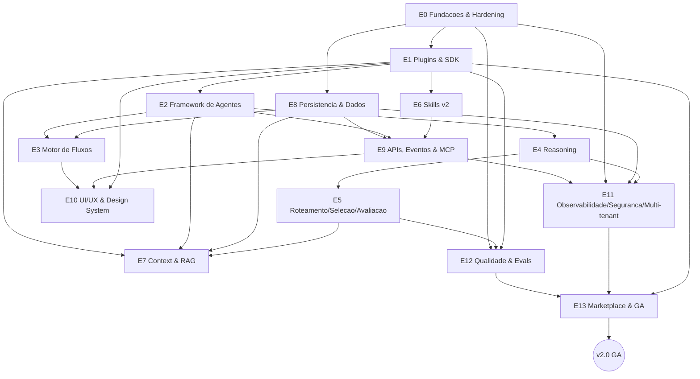

---

### 18.9 Ondas de release

O sequenciamento é entregue em três ondas cumulativas. Cada onda tem **conteúdo**
(épicos/histórias que entram) e **critérios de saída** (gate para avançar).

#### v2.0-alpha — "núcleo extensível utilizável"

| Item | Descrição |
| --- | --- |
| **Objetivo** | Provar o núcleo pequeno + bordas plugáveis end-to-end em modo local-first. |
| **Entra** | **E0** (completo); **E1** (Plugin Host, SDK, manifest, isolamento); **E2** (Agent Manifest, Agent Registry, agent-como-plugin); **E3** histórias de grafo/checkpointing/human-in-the-loop (editor visual pode ficar mínimo); **E8-S1/E8-S2** (schema multi-tenant + event store); **E9-S1** (Control Plane API /v2 mínima); **E12-S1** (pirâmide de testes) e início de **E12-S2** (contract tests dos pontos já existentes). |
| **Critérios de saída** | (1) Um fluxo declarativo executa um agent-plugin fim a fim com estado durável e replay do event store; (2) contract test verde para os pontos de extensão de E1/E2/E3; (3) modo local-first (SQLite + provider stub) roda sem dependências externas; (4) cobertura do núcleo ≥ 85%; (5) traços básicos emitidos por step. |

#### v2.0-beta — "plataforma completa em produção controlada"

| Item | Descrição |
| --- | --- |
| **Objetivo** | Completar capacidades de inteligência, contexto, dados, API, UI, segurança e qualidade para operação real controlada. |
| **Entra** | **E4** (Reasoning); **E5** (Router & Selector + Evaluation Service); **E6** (Skills v2); **E7** (Context & RAG com pgvector e recuperação híbrida); **E8-S3/E8-S4** (artefatos + backup/RPO/RTO); **E9-S2/S3/S4** (streaming, catálogo de eventos, MCP); **E10** (Design System, telas-chave, editor visual de fluxos, painéis plugáveis); **E11** (OpenTelemetry, RBAC, multi-tenant, quotas/budgets, runbooks); **E12-S2/S3/S4** (contract tests completos, agent evals, quality gates). |
| **Critérios de saída** | (1) Fluxo real planejar→codificar→aplicar patch→validar em sandbox→avaliar executa com RBAC, budgets que falham fechado e traços fim a fim; (2) recuperação híbrida atinge p95 < 300 ms e recall baseline; (3) streaming de run inicia < 1 s; (4) todos os pontos de extensão com contract test verde e quality gates bloqueando merge; (5) UI WCAG 2.2 AA nas telas-chave e editor de fluxos com round-trip; (6) backup/restore validado (RPO ≤ 5 min, RTO ≤ 30 min) em staging. |

#### v2.0-GA — "disponibilidade geral"

| Item | Descrição |
| --- | --- |
| **Objetivo** | Abrir o Marketplace e declarar disponibilidade geral com garantias de SLO, segurança e suporte a upgrade. |
| **Entra** | **E13** completo (publicação/instalação, assinatura/verificação, prontidão de GA); hardening final; migração de upgrade da v1; notas de release. |
| **Critérios de saída** | (1) Publicação e instalação de plugin verificado (assinatura + SBOM) end-to-end; (2) SLO 99.9% do Control Plane e p95 de leitura < 300 ms sob teste de carga (≥ 100 runs concorrentes por nó de referência); (3) RPO ≤ 5 min / RTO ≤ 30 min comprovados em produção; (4) checklist de GA assinado (SLOs, segurança, docs, backups, evals); (5) caminho de upgrade v1→v2 documentado e testado; (6) release GA publicado com notas. |

---

### 18.10 Governança por DoR/DoD e critérios ao longo do fluxo de estados

Os **DoR** e **DoD** e os **Critérios Funcionais/Não-Funcionais** são definidos no
**nível de História** (a unidade de valor com critérios de aceite); as
**Subtarefas** herdam esses critérios e aplicam os templates do Apêndice
(checklists H/I e template J). Eles não são documentação passiva: **governam**
cada etapa (épico) e história e se conectam diretamente ao **fluxo de estados**
definido na subseção 18.1.
Uma história só transiciona de *Backlog/Pronta* para *Em Execução* quando seu
**DoR** está integralmente satisfeito (dependências resolvidas, contratos e ADRs
aprovados, ambientes provisionados) — o mesmo gate que a subseção 18.1 descreve para
entrada de trabalho. Durante a execução, os **Critérios Funcionais** definem o
comportamento a ser demonstrado e os **Critérios Não-Funcionais** (as metas
globais de §6: latência, disponibilidade, cobertura ≥ 85%, WCAG 2.2 AA, budgets
que falham fechado, RPO/RTO, isolamento por tenant) são medidos e observados via
traços/métricas emitidos por cada `step`. A transição para *Concluída* exige o
**DoD** verde — incluindo os **Validation Gates** e **contract tests** de E12,
que bloqueiam qualquer merge/publicação fora de política. Assim, o mesmo par
DoR→(CF+CNF)→DoD que rege uma história escala, por composição, para
governar o épico e finalmente os **critérios de saída de cada onda de
release**, mantendo o encadeamento auditável e reproduzível descrito no fluxo de
estados da subseção 18.1 — do menor `Step` até o gate de GA.


---

## 19. Governança, Versionamento e Compatibilidade

Esta seção define como o AutoDev Architect v2.0 versiona seus artefatos, garante
compatibilidade entre core e extensões, conduz decisões técnicas e comunitárias
e evolui de forma previsível. O objetivo é permitir que uma comunidade publique
e mantenha **plugins**, **agents** e **skills** no **Marketplace** sem quebras
surpresa, honrando o princípio de **contratos estáveis e versionados** (E1) e a
superfície de **APIs, Eventos & MCP** (E9).

### 19.1 SemVer aplicado a todos os artefatos

Todo artefato versionável adota **SemVer** (`MAJOR.MINOR.PATCH`), com semântica
uniforme: **MAJOR** para mudanças incompatíveis, **MINOR** para adições
retrocompatíveis, **PATCH** para correções retrocompatíveis. A tabela abaixo fixa
o que constitui uma quebra (bump de MAJOR) por tipo de artefato.

| Artefato | Fonte da versão | O que é MAJOR (quebra) | O que é MINOR (aditivo) | O que é PATCH |
| --- | --- | --- | --- | --- |
| **Plataforma (core)** | Release do repositório | Remoção/alteração incompatível de ponto de extensão, contrato de SDK ou schema persistido | Novo ponto de extensão, novo campo opcional, nova capability do core | Correção de bug sem mudar contrato |
| **Plugin** | `plugin.yaml` | Alteração incompatível na superfície exposta ou no `hostApi` mínimo | Novo recurso/extensão adicionada, campo opcional novo | Correção interna sem mudar IO |
| **Agent** | `agent.yaml` | Mudança incompatível de IO schema, remoção de capability declarada | Nova capability, novo campo opcional de saída | Ajuste de prompt/política sem mudar contrato de IO |
| **Skill** | `skill.yaml` | Mudança incompatível de IO, novas permissões obrigatórias, remoção de gatilho | Novo parâmetro opcional, nova saída aditiva | Correção determinística sem mudar IO |
| **Fluxo (Flow)** | `flow.yaml` | Alteração de contrato de entrada/saída do fluxo ou remoção de nó público | Novo nó/ramo opcional, nova aresta condicional aditiva | Ajuste que não altera semântica observável |
| **Eval** | `eval.yaml` | Mudança de rubrica/métrica que invalida comparação histórica | Novo caso de teste, nova métrica aditiva | Correção de dataset sem afetar baseline |
| **API (`/v2`)** | Prefixo de rota + `schemaVersion` | Remoção/alteração incompatível de endpoint ou tipo | Novo endpoint, novo campo opcional em tipo | Correção sem mudar contrato |
| **Eventos** | Nome + `schemaVersion` do payload | Remoção de campo ou mudança de tipo/semântica | Novo campo opcional, novo tipo de evento | Correção de emissão |

**Regra de ouro para extensões:** um plugin/agent/skill depende de **contratos**
(pontos de extensão, IO schemas, eventos), nunca de internals do core. A
compatibilidade é declarada explicitamente, não presumida.

### 19.2 Matriz de compatibilidade host↔plugin (faixa `hostApi`)

O acoplamento entre o core e uma extensão é mediado pela **hostApi** — a versão
do contrato de pontos de extensão exposta pelo **Plugin Host** (E1). Cada plugin
declara a faixa suportada em seu manifest:

```yaml
# plugin.yaml (trecho)
id: acme/skill-jira-sync
version: 1.4.2
hostApi: ">=2.0 <3.0"   # faixa SemVer de contratos do core aceita
```

Na instalação/carregamento, o Plugin Host resolve a faixa contra a `hostApi`
efetiva do runtime. A resolução é **falha-fechada**: incompatibilidade impede a
ativação e emite `plugin.rejected` com motivo.

Matriz de compatibilidade (host = versão de `hostApi` do core; plugin = faixa
declarada):

| `hostApi` do host → / faixa declarada pelo plugin ↓ | host `2.0.x` | host `2.3.x` | host `2.9.x` | host `3.0.x` |
| --- | --- | --- | --- | --- |
| `">=2.0 <3.0"` | Compatível | Compatível | Compatível | Rejeitado (MAJOR incompatível) |
| `">=2.3 <3.0"` | Rejeitado (host abaixo do mínimo) | Compatível | Compatível | Rejeitado |
| `">=2.0 <2.5"` | Compatível | Compatível | Rejeitado (fora do teto) | Rejeitado |
| `">=3.0 <4.0"` | Rejeitado | Rejeitado | Rejeitado | Compatível |
| ausente/inválida | Rejeitado (manifest inválido) | Rejeitado | Rejeitado | Rejeitado |

Regras derivadas:

- Dentro de uma mesma MAJOR do host, MINORs são aditivas: um plugin que funciona
  em `2.0` continua funcionando em `2.9` se sua faixa cobrir o intervalo.
- Uma nova MAJOR do host (`3.0`) só carrega plugins cuja faixa a inclua; a
  migração exige revisão explícita do autor.
- O host oferece **modo de compatibilidade** opcional por período de suporte
  (ver 19.4), permitindo carregar extensões da MAJOR anterior sob shim declarado.
- O Marketplace exibe a faixa `hostApi` de cada versão publicada e sinaliza
  quando uma versão instalada deixou de ser compatível com o host atual.

### 19.3 Processo de RFC e ADR

Mudanças significativas seguem dois instrumentos complementares, cujos templates
estão no apêndice (**seção 21**):

- **RFC (Request for Comments)** — proposta formal de mudança para discussão
  aberta, usada **antes** de alterações que afetam contratos, pontos de extensão,
  APIs `/v2`, eventos, modelo de dados ou políticas de segurança. Ciclo:
  `Rascunho → Em discussão → Aceita/Rejeitada → Implementada`. Uma RFC aceita
  referencia o(s) épico(s) impactado(s) e as histórias resultantes.
- **ADR (Architecture Decision Record)** — registro imutável de uma decisão
  tomada e seu contexto/consequências, criado quando a decisão é fixada
  (frequentemente ao aceitar uma RFC). ADRs são numerados sequencialmente,
  versionados no repositório e nunca reescritos: mudanças são feitas por um novo
  ADR que **supersede** o anterior.

Gatilho: toda mudança que resulte em bump de **MAJOR** de qualquer artefato da
tabela em 19.1 exige RFC aceita e ADR correspondente. Mudanças MINOR/PATCH
dispensam RFC, mas mudanças MINOR em contratos públicos devem registrar ADR leve.

### 19.4 Política de deprecação e janelas de suporte

A plataforma comunica quebras com antecedência e mantém compatibilidade por
janelas previsíveis:

- **Suporte N-1 major:** o core suporta a MAJOR corrente e a anterior. Ao lançar
  a `N`, a `N-1` entra em manutenção (apenas correções de segurança/críticas) por
  no mínimo **6 meses** ou **um ciclo de MINOR**, o que for maior.
- **Ciclo de deprecação:** um contrato marcado como `deprecated` permanece
  funcional por ao menos **uma MINOR** antes de poder ser removido em uma MAJOR.
  A depreciação é anunciada via changelog, atributo `deprecated` no
  schema/manifest e evento `*.deprecated` observável.
- **Avisos em runtime:** o Plugin Host e a Control Plane API emitem avisos
  estruturados (traço + log + header `Deprecation`/`Sunset` em respostas `/v2`)
  quando um consumidor usa contrato depreciado.
- **Modo de compatibilidade:** durante a janela N-1, shims permitem operar
  extensões da MAJOR anterior; o modo é opt-in, auditável e desligado por padrão
  em ambientes que exigem apenas contratos correntes.
- **Migração guiada:** cada MAJOR acompanha guia de migração e, quando viável,
  scripts/codemods; migrações de dados são versionadas e reversíveis quando
  possível (alinhado às metas de RPO/RTO).

### 19.5 Governança OSS

Sendo **OSS-first e self-host**, o projeto define papéis e processos abertos:

- **CONTRIBUTING** — guia único de contribuição (setup do venv, padrões de
  código, testes/contract tests obrigatórios para pontos de extensão, fluxo de
  PR, exigência de DCO/sign-off e assinatura de commits). Referência de estilo e
  de handoff mantida em sincronia com `CLAUDE.md`/`AGENTS.md`.
- **Papéis de mantenedor:**
  - *Contributor* — abre issues/PRs; sem permissão de merge.
  - *Reviewer* — revisa e aprova PRs em áreas designadas.
  - *Maintainer* — merge, triagem, releases; responsável por um ou mais
    subsistemas.
  - *Core/Steering* — decide RFCs contestadas, define roadmap e políticas de
    versionamento; guardião dos contratos do core.
- **Processo de revisão:** todo PR exige ao menos **uma aprovação de Reviewer**
  (duas para mudanças em contratos/segurança), CI verde (lint, testes, contract
  tests, evals de regressão quando aplicável) e ausência de objeções de
  **CODEOWNERS**. Mudanças de contrato exigem RFC referenciada.
- **CODEOWNERS:** arquivo `CODEOWNERS` mapeia caminhos (ex.: SDK, pontos de
  extensão, API `/v2`, schemas de eventos, migrações) a mantenedores; a revisão
  desses donos é obrigatória para merge nas áreas cobertas.
- **Segurança:** política de divulgação responsável (SECURITY.md), embargo e
  janela de correção; releases de segurança podem ser retroportadas para a
  MAJOR N-1 durante a janela de suporte.

### 19.6 Versionamento de fluxos, agents e skills e migração

Fluxos, agents e skills são **declarativos e versionados** (E1/E9) e coexistem em
múltiplas versões no **Agent Registry** e **Skill Registry**:

- **Imutabilidade por versão:** uma versão publicada é imutável; correções geram
  nova versão SemVer. Runs registram a versão exata usada de cada
  fluxo/agent/skill para garantir **determinismo e replay**.
- **Resolução por faixa:** fluxos referenciam agents/skills por id + faixa SemVer
  (ex.: `autodev/agent-coder@^2.1`), resolvida na criação do run e "congelada" no
  estado durável do run.
- **Migração de fluxos em execução:** runs ativos permanecem na versão em que
  iniciaram; a migração para nova versão de fluxo é explícita (novo run ou passo
  de migração declarado), evitando alteração de semântica de runs em curso.
- **Migração de definições:** upgrades MAJOR de agent/skill exigem que fluxos
  dependentes atualizem sua faixa; o Registry sinaliza incompatibilidades e o CI
  roda **contract tests** e **evals** para detectar regressão antes da promoção.
- **Coexistência:** múltiplas MAJORs de um mesmo agent/skill podem coexistir no
  Registry durante a janela de suporte, permitindo migração gradual.

### 19.7 Evolução deste Documento de Referência

Este documento é ele próprio um artefato governado:

- **Owner:** o grupo *Core/Steering* é o dono do documento; cada seção tem um
  autor/mantenedor responsável por mantê-la alinhada ao **brief canônico**
  (glossário, componentes e ids de épico).
- **Versionamento:** o documento adota SemVer próprio, atrelado à MAJOR/MINOR da
  plataforma; mudanças de contrato descritas aqui só entram após RFC aceita e ADR
  correspondente.
- **Cadência de revisão:** revisão consolidada a cada **MINOR** da plataforma e
  revisão obrigatória a cada **MAJOR**; correções pontuais (PATCH do documento)
  podem entrar continuamente via PR com aprovação de CODEOWNERS da seção.
- **Rastreabilidade:** toda mudança de comportamento arquitetural referencia o
  épico/história e o ADR que a originou, mantendo o documento como fonte fiel do
  estado da plataforma.

### 19.8 Critérios de aceite

**Funcionais**

- Todo artefato (plataforma, plugin, agent, skill, fluxo, eval, API, evento)
  possui versão SemVer válida e declarada em seu manifest/schema.
- O Plugin Host resolve a faixa `hostApi` na instalação/carregamento e **rejeita
  (falha-fechada)** extensões incompatíveis, emitindo evento de rejeição com
  motivo.
- Contratos depreciados emitem aviso estruturado em runtime (traço/log e headers
  `Deprecation`/`Sunset` na API `/v2`) e permanecem funcionais por ao menos uma
  MINOR.
- Mudanças que causam bump de MAJOR possuem RFC aceita e ADR vinculados,
  referenciando os templates da seção 21.
- O Registry mantém versões imutáveis e permite coexistência de múltiplas MAJORs
  de agents/skills durante a janela de suporte; runs registram a versão exata
  usada.
- PRs em caminhos cobertos por `CODEOWNERS` só sofrem merge com aprovação dos
  donos e CI verde (incluindo contract tests dos pontos de extensão).

**Não-funcionais**

- Suporte a **N-1 major** garantido por no mínimo 6 meses ou um ciclo de MINOR
  (o maior), com correções de segurança retroportadas.
- Resolução de compatibilidade `hostApi` é determinística e reprodutível a partir
  do manifest, sem consultar internals do core.
- Cada MAJOR publica guia de migração; migrações de dados são versionadas e
  reversíveis quando possível, respeitando RPO ≤ 5 min e RTO ≤ 30 min.
- Contract tests para pontos de extensão são obrigatórios no CI (bloqueiam merge)
  e cobrem compatibilidade de faixa `hostApi`.
- O documento de referência é revisado a cada MINOR e revalidado a cada MAJOR,
  com owner e responsáveis por seção explicitamente atribuídos.


---

## 20. Métricas de Sucesso e KPIs

Esta seção define o conjunto canônico de KPIs (Key Performance Indicators) que
medem o sucesso do AutoDev Architect v2.0 nas dimensões de **produto**,
**qualidade**, **desempenho**, **custo**, **confiabilidade** e **experiência do
desenvolvedor (DX)**. As metas são coerentes com as Metas não-funcionais globais
do brief (seção 6) e todos os indicadores são instrumentados através da
infraestrutura entregue por **E11 — Observabilidade, Segurança & Multi-tenant**
(OpenTelemetry: traços, métricas e eventos do Event Bus) e realimentados pelo
ciclo de qualidade de **E12 — Qualidade & Evals** e **E13 — Marketplace & GA**.

Princípios de medição:

- **Observabilidade nativa como fonte** — nenhum KPI depende de coleta manual;
  todo dado deriva de traços/métricas OpenTelemetry, do Event Bus, do State
  Store (PostgreSQL) ou do Evaluation Service.
- **Segmentação por tenant** — todos os KPIs operacionais e de custo são
  dimensionáveis por `tenant`, respeitando o isolamento multi-inquilino (E11).
- **Determinismo e auditabilidade** — KPIs de qualidade referem-se a runs com
  Trace persistido, permitindo replay e reconciliação.
- **Metas versionadas** — os alvos abaixo compõem o baseline de GA (E13) e
  evoluem via ADR/RFC.

### 20.1 KPIs de Produto

Medem adoção, crescimento do ecossistema e valor entregue ao usuário.

- **Usuários ativos (WAU/MAU)** — usuários distintos que iniciam ao menos um Run
  por janela semanal/mensal. **Meta GA:** crescimento MoM ≥ 15% nos primeiros
  dois trimestres pós-GA. **Instrumentação:** eventos `run.started` correlacionados
  a identidade (Control Plane API / RBAC), agregados por `tenant` no State Store.
- **Plugins publicados no Marketplace** — número acumulado de Plugins (incluindo
  agents/skills-como-plugin) publicados e verificados no Marketplace (E13).
  **Meta GA:** ≥ 25 plugins publicados no primeiro trimestre pós-GA, com ≥ 10 de
  autores externos ao core. **Instrumentação:** eventos `plugin.published` /
  `plugin.installed` do Event Bus + catálogo do Marketplace.
- **Retenção (W4/M3)** — proporção de usuários/tenants ativos que permanecem
  ativos após 4 semanas (W4) e 3 meses (M3). **Meta GA:** retenção W4 ≥ 40% e
  M3 ≥ 25% para tenants com onboarding concluído. **Instrumentação:** coortes
  derivadas de `run.started` por identidade/tenant no State Store.
- **Tempo até primeiro valor (TTFV)** — tempo mediano entre o primeiro acesso de
  um tenant e a conclusão bem-sucedida do primeiro Run que produz um Patch
  aplicado ou passa por um Validation Gate. **Meta GA:** mediana < 30 min no
  modo local-first (SQLite/stub). **Instrumentação:** delta entre primeiro
  evento de sessão e primeiro `run.completed` com resultado aceito.

### 20.2 KPIs de Qualidade

Medem a eficácia dos agents, do roteamento e do fluxo de patch/validação. São
alimentados pelo **Evaluation Service (E5)** e pelos **quality gates de CI (E12)**.

- **Taxa de sucesso de tarefas** — fração de Runs que atingem o objetivo e passam
  por todos os Validation Gates aplicáveis, sem intervenção humana corretiva.
  **Meta GA:** ≥ 75% em suítes de referência. **Instrumentação:** status final de
  Run/Step no State Store + resultados de Validation Gate.
- **pass@k** — probabilidade de ao menos uma de `k` tentativas passar nos evals de
  referência (datasets + rubricas do Evaluation Service). **Meta GA:** pass@1 ≥
  0,60 e pass@5 ≥ 0,85 no dataset canônico. **Instrumentação:** execuções do
  Evaluation Service (E12), armazenadas com o Eval id/versão.
- **Regressões de eval** — número de evals cujo score cai além do limiar entre
  duas versões (de core, agent ou plugin). **Meta:** 0 regressões bloqueantes
  liberadas para GA; regressões falham o quality gate de CI. **Instrumentação:**
  comparação de execuções do Evaluation Service em CI (E12), série temporal por
  Eval id.
- **Taxa de patches aceitos** — fração de Patches gerados que são aplicados com
  sucesso (dry-run + guarda de path) e passam no Validation Gate, versus total de
  Patches propostos. **Meta GA:** ≥ 80%. **Instrumentação:** eventos de
  aplicação de Patch + resultado de Validation Gate, por run/tenant.

### 20.3 KPIs de Desempenho

Medem latência e vazão do Control Plane e do plano de execução, alinhados à
seção 6 do brief.

- **Latência p95 (leitura do Control Plane)** — p95 de endpoints de leitura da
  Control Plane API `/v2`. **Meta:** < 300 ms. **Instrumentação:** histogramas
  de latência OpenTelemetry por rota (E11).
- **Time-to-first-token de streaming** — tempo até o início do streaming de um
  Run. **Meta:** < 1 s. **Instrumentação:** span OpenTelemetry entre requisição
  de run e primeiro chunk emitido.
- **Throughput de runs** — Runs concorrentes sustentados por nó de trabalho de
  referência e Runs concluídos por minuto. **Meta:** ≥ 100 runs concorrentes por
  nó de referência, com escala horizontal dos workers de execução.
  **Instrumentação:** métricas de fila/worker (Redis) e contadores de
  `run.completed` por janela (E11).

### 20.4 KPIs de Custo

Medem o consumo de recursos de LLM por tarefa e por tenant, base para quotas e
budgets (E11).

- **Tokens por tarefa** — tokens (prompt + completion) consumidos por Run,
  segmentável por agent, Reasoning Strategy e modelo. **Meta:** dentro do Budget
  padrão do run; alerta ao atingir 80% do teto e falha-fechado no limite.
  **Instrumentação:** contadores emitidos pelo Agent Runtime/Reasoning Engine,
  agregados por run/tenant.
- **USD por tarefa** — custo monetário estimado por Run, derivado de tokens ×
  tabela de preços do provider. **Meta:** dentro do Budget de custo (USD) do run;
  respeita quotas por tenant. **Instrumentação:** métrica de custo do Agent
  Runtime + tabela de preços versionada, por tenant.
- **Custo por tenant (janela)** — soma de USD/tokens por tenant por período,
  confrontada com a quota contratada. **Meta:** consumo ≤ quota do tenant; sem
  estouros silenciosos. **Instrumentação:** agregação por `tenant` no State Store
  + subsistema de quotas/budgets (E11).

### 20.5 KPIs de Confiabilidade

Medem o cumprimento dos objetivos de serviço e a saúde operacional (E11).

- **Cumprimento de SLO (disponibilidade)** — disponibilidade efetiva do Control
  Plane em produção contra o SLO. **Meta:** ≥ 99,9%. **Instrumentação:** métricas
  de disponibilidade/health OpenTelemetry, janelas de SLO por serviço.
- **Error budget consumido** — fração do orçamento de erro (complemento do SLO,
  ~0,1%/mês) já consumida na janela. **Meta:** < 100% na janela; estouro
  dispara congelamento de mudanças e runbook. **Instrumentação:** cálculo de
  burn rate a partir das métricas de SLO (E11).
- **RPO/RTO em produção** — perda máxima de dados (RPO) e tempo de recuperação
  (RTO) validados em exercícios de recuperação. **Meta:** RPO ≤ 5 min e RTO ≤
  30 min. **Instrumentação:** telemetria de backup/replicação do State Store +
  registros de drills.

### 20.6 KPIs de Experiência do Desenvolvedor (DX)

Medem a fricção para estender a plataforma — central à visão de "núcleo pequeno,
bordas ricas" (E1/E13).

- **Tempo para criar um plugin/agent (scaffold → local)** — tempo mediano do
  `scaffold` do SDK até um Plugin/Agent rodando localmente e passando nos
  contract tests. **Meta:** < 30 min para um autor seguindo o guia. **Instrumentação:**
  telemetria opcional do SDK/CLI + medições de DX em onboarding.
- **Tempo para publicar no Marketplace** — tempo mediano entre plugin funcional
  localmente e sua publicação/verificação no Marketplace (assinatura + gates de
  E13). **Meta:** < 1 dia útil, com pipeline de verificação automatizado.
  **Instrumentação:** intervalo entre primeiro build válido e `plugin.published`
  no Event Bus (E13).
- **Taxa de aprovação em contract tests (1ª tentativa)** — fração de plugins que
  passam nos contract tests dos pontos de extensão na primeira submissão.
  **Meta:** ≥ 70%, sinalizando contratos claros e boa DX. **Instrumentação:**
  resultados dos contract tests de CI (E12) por submissão.

### 20.7 Tabela consolidada de KPIs

| KPI | Definição | Meta | Instrumentação |
| --- | --- | --- | --- |
| Usuários ativos (WAU/MAU) | Usuários distintos que iniciam ≥ 1 Run por semana/mês | Crescimento MoM ≥ 15% (2 primeiros trimestres pós-GA) | Eventos `run.started` + identidade (RBAC), agregados por tenant no State Store (E11) |
| Plugins publicados no Marketplace | Plugins verificados publicados no Marketplace | ≥ 25 no 1º trimestre pós-GA (≥ 10 externos) | Eventos `plugin.published`/`plugin.installed` + catálogo do Marketplace (E13) |
| Retenção (W4/M3) | Usuários/tenants ainda ativos após 4 semanas / 3 meses | W4 ≥ 40%; M3 ≥ 25% | Análise de coortes sobre `run.started` por tenant (State Store, E11) |
| Tempo até primeiro valor (TTFV) | Do 1º acesso até 1º Run com Patch aplicado/Validation Gate ok | Mediana < 30 min (local-first) | Delta entre 1º evento de sessão e 1º `run.completed` aceito |
| Taxa de sucesso de tarefas | Runs que atingem objetivo e passam nos Validation Gates sem correção humana | ≥ 75% em suítes de referência | Status de Run/Step + Validation Gate no State Store |
| pass@k | Prob. de ≥ 1 de k tentativas passar nos evals de referência | pass@1 ≥ 0,60; pass@5 ≥ 0,85 | Evaluation Service (E5/E12), por Eval id/versão |
| Regressões de eval | Evals com queda de score acima do limiar entre versões | 0 regressões bloqueantes em GA | Comparação de execuções do Evaluation Service em CI (E12) |
| Taxa de patches aceitos | Patches aplicados (dry-run/guarda) e aprovados no Validation Gate / propostos | ≥ 80% | Eventos de aplicação de Patch + Validation Gate por run/tenant |
| Latência p95 (leitura) | p95 dos endpoints de leitura da Control Plane API `/v2` | < 300 ms | Histogramas de latência OpenTelemetry por rota (E11) |
| Time-to-first-token (streaming) | Tempo até início do streaming de um Run | < 1 s | Span OpenTelemetry requisição → 1º chunk |
| Throughput de runs | Runs concorrentes por nó de referência e concluídos/min | ≥ 100 concorrentes por nó (escala horizontal) | Métricas de fila/worker (Redis) + `run.completed` (E11) |
| Tokens por tarefa | Tokens (prompt+completion) por Run, por agent/estratégia/modelo | Dentro do Budget; alerta a 80%, falha-fechado no teto | Contadores do Agent Runtime/Reasoning Engine por run/tenant |
| USD por tarefa | Custo estimado por Run (tokens × preço) | Dentro do Budget de custo; respeita quota do tenant | Métrica de custo do Agent Runtime + tabela de preços versionada |
| Custo por tenant (janela) | Soma de USD/tokens por tenant por período vs. quota | Consumo ≤ quota; sem estouros silenciosos | Agregação por tenant (State Store) + quotas/budgets (E11) |
| Cumprimento de SLO | Disponibilidade efetiva do Control Plane vs. SLO | ≥ 99,9% | Métricas de disponibilidade/health OpenTelemetry (E11) |
| Error budget consumido | Fração do orçamento de erro (~0,1%/mês) consumida na janela | < 100%; estouro congela mudanças | Burn rate sobre métricas de SLO (E11) |
| RPO/RTO | Perda máx. de dados e tempo de recuperação validados | RPO ≤ 5 min; RTO ≤ 30 min | Telemetria de backup/replicação (State Store) + drills |
| Tempo para criar plugin/agent | Do scaffold do SDK até rodar local + contract tests ok | < 30 min | Telemetria do SDK/CLI + medições de onboarding (E1) |
| Tempo para publicar no Marketplace | De plugin funcional local até publicação/verificação | < 1 dia útil (pipeline automatizado) | Intervalo até `plugin.published` no Event Bus (E13) |
| Aprovação em contract tests (1ª tentativa) | Plugins que passam nos contract tests na 1ª submissão | ≥ 70% | Resultados de contract tests de CI por submissão (E12) |


---

## 21. Apêndices — Templates e Checklists

Este apêndice reúne templates canônicos e prontos para copiar. Todos seguem as
convenções do brief: **ids** no formato `namespace/nome` (kebab-case), **versão**
em SemVer `MAJOR.MINOR.PATCH`, compatibilidade com o core declarada via
`hostApi` (ex.: `">=2.0 <3.0"`), **eventos** no formato `dominio.entidade.acao`
no passado e **contratos de API** sob o prefixo `/v2` com `schemaVersion`.
Os manifests declarativos são versionados e devem passar por validação de schema
(contract tests) antes de serem registrados nos respectivos registries.

### (A) Manifesto de Plugin — `plugin.yaml`

```yaml
# plugin.yaml — descritor de um Plugin (pacote versionado que habita pontos de extensão).
# Carregado, isolado e gerenciado pelo Plugin Host.
schemaVersion: "1"                 # versão do schema deste manifest (independente do plugin)

id: "acme/plugin-jira"             # id canônico: namespace/nome em kebab-case (obrigatório, único)
version: "1.4.2"                   # SemVer MAJOR.MINOR.PATCH do plugin
name: "Jira Integration"           # nome legível para humanos (UI/Marketplace)
description: "Sincroniza issues e sub-tarefas com o Jira Cloud."
publisher: "Acme Corp"             # editor/autor; exibido no Marketplace
license: "Apache-2.0"              # licença OSS-first (SPDX id)
homepage: "https://github.com/acme/plugin-jira"

# Faixa de compatibilidade com a API do core (contratos SemVer estáveis).
# O Plugin Host recusa o carregamento se a versão do core estiver fora da faixa.
hostApi: ">=2.0 <3.0"

# Pontos de extensão (Extension Points) que este plugin implementa.
# Cada entrada casa com uma interface tipada exposta pelo core.
extensionPoints:
  - type: "context-provider"       # ex.: context-provider | reasoning-strategy | evaluator | router | selector | ui-panel
    entrypoint: "acme_plugin_jira.providers:JiraContextProvider"  # módulo:classe (Python) ou export (TS)
  - type: "ui-panel"
    entrypoint: "acme_plugin_jira.ui:JiraPanel"

# Ativos declarativos entregues pelo plugin e registrados nos registries.
provides:
  agents:  ["agent.yaml"]          # Agent Manifests empacotados (Agent Registry)
  skills:  ["skills/jira-sync.yaml"]  # Skill Manifests (Skill Registry)
  flows:   ["flows/triage.yaml"]   # Fluxos declarativos publicados

# Permissões explícitas (menor privilégio). Sem entrada = negado por padrão.
permissions:
  network:                         # egress de rede exige allowlist explícita
    egress:
      - "https://*.atlassian.net"
  secrets:                         # segredos que o plugin pode ler (injetados pelo cofre, nunca hardcoded)
    - "JIRA_API_TOKEN"
  filesystem: "none"               # none | read | read-write (escopo do sandbox)
  events:                          # eventos do Event Bus que pode publicar/assinar
    publish: ["plugin.jira.synced"]      # dominio.entidade.acao no passado
    subscribe: ["run.step.completed"]

# Dependências entre plugins (resolvidas pelo Plugin Host via SemVer).
dependencies:
  - id: "autodev/plugin-core-http"
    version: ">=1.0 <2.0"

# Configuração exposta ao operador (validada por JSON Schema na instalação).
configSchema:
  type: object
  required: ["baseUrl", "projectKey"]
  properties:
    baseUrl:    { type: string, format: uri }
    projectKey: { type: string, pattern: "^[A-Z][A-Z0-9]+$" }

# Metadados de publicação/assinatura (verificação de integridade no Marketplace).
signing:
  algorithm: "cosign"              # assinatura verificada na instalação (E13)
  publicKeyRef: "acme/keys/plugin-jira.pub"
```

### (B) Manifesto de Agent — `agent.yaml`

```yaml
# agent.yaml — descritor declarativo de um Agent (unidade autônoma que recebe tarefa,
# raciocina e produz saída conforme contrato). Registrado no Agent Registry.
schemaVersion: "1"

id: "autodev/agent-coder"          # namespace/nome em kebab-case
version: "2.1.0"                   # SemVer do agent
name: "Coder Agent"
description: "Gera e edita código, produzindo patches em diff unificado."
hostApi: ">=2.0 <3.0"              # faixa de compatibilidade com o core

# Capabilities: contratos de habilidade que o Selector usa para casar tarefas com agents.
capabilities:
  - "code.generate"
  - "code.edit"
  - "patch.produce"

# Contrato de IO tipado (validado na entrada e na saída do Agent Runtime).
io:
  input:
    schemaVersion: "1"
    type: object
    required: ["task", "repoRef"]
    properties:
      task:    { type: string, description: "Descrição da tarefa de codificação." }
      repoRef: { type: string, description: "Referência do repositório/branch." }
      context: { type: array, items: { type: string }, description: "Trechos de contexto (RAG)." }
  output:
    schemaVersion: "1"
    type: object
    required: ["patch", "summary"]
    properties:
      patch:   { type: string, description: "Diff unificado a ser aplicado pela Validation Gate." }
      summary: { type: string, description: "Resumo legível das mudanças (separado da metadata de controle)." }

# Reasoning Strategy padrão e alternativas plugáveis (Reasoning Engine).
reasoning:
  strategy: "plan-and-execute"     # react | plan-and-execute | reflection | debate
  allowedStrategies: ["react", "reflection"]

# Tools de baixo nível e Skills reutilizáveis que o agent pode invocar.
# O Agent Runtime medeia todo acesso e aplica menor privilégio.
tools:
  - "fs.read"
  - "fs.write"
  - "sandbox.run"                  # execução na Execution Sandbox (sem rede por padrão)
skills:
  - id: "autodev/skill-run-tests"
    version: ">=1.0 <2.0"

# Preferências de modelo (o Selector decide o modelo final por política/custo).
model:
  preferred: "anthropic/claude-opus-4-8"
  fallbacks: ["anthropic/claude-sonnet-4-5"]

# Budgets impostos pelo Agent Runtime (falha fechado ao exceder).
budgets:
  maxTokens: 200000
  maxCostUsd: 1.50
  maxWallClockSec: 300
  maxSteps: 25

# Guardrails: verificações que bloqueiam/corrigem saídas fora de política.
guardrails:
  - type: "output-schema"          # valida a saída contra o io.output
  - type: "path-guard"             # patches restritos a paths permitidos + dry-run
    allow: ["src/**", "tests/**"]
  - type: "secret-scan"            # bloqueia vazamento de segredos

# Políticas declarativas associadas (seleção/roteamento/budget).
policies:
  - "autodev/policy-cost-aware"
```

### (C) Definição de Fluxo — `flow.yaml`

```yaml
# flow.yaml — grafo declarativo e versionado de nós que orquestra agents/skills/tools/humanos.
# Executado pelo Orchestration Engine (checkpointing, retries, human-in-the-loop).
schemaVersion: "1"

id: "autodev/flow-feature-delivery"  # namespace/nome em kebab-case
version: "1.0.0"                     # SemVer do fluxo
name: "Entrega de Feature"
description: "Planejar → codificar → aplicar patch → validar → revisão humana → avaliar."
hostApi: ">=2.0 <3.0"

# Gatilhos (Triggers) que iniciam o fluxo. Emitem run.* no Event Bus.
triggers:
  - type: "message"                  # message | webhook | cron | event
  - type: "event"
    on: "flow.run.requested"         # dominio.entidade.acao no passado

# Entrada tipada do run (persistida no estado durável do Run).
input:
  schemaVersion: "1"
  type: object
  required: ["task", "repoRef"]
  properties:
    task:    { type: string }
    repoRef: { type: string }

# Defaults aplicáveis a todos os nós (podem ser sobrescritos por nó).
defaults:
  retries:
    maxAttempts: 3                   # nº total de tentativas
    backoff: "exponential"           # fixed | exponential
    initialDelaySec: 2
  timeoutSec: 120                    # timeout por ativação de nó (Step)

# Nós do fluxo (Flow Nodes). Cada nó vira um Step no run.
nodes:
  - id: "plan"                       # nó do tipo agent
    type: "agent"
    ref: "autodev/agent-planner@>=1.0 <2.0"  # ref com faixa SemVer
    input:
      task: "{{ flow.input.task }}"  # binding do estado do fluxo (template)

  - id: "code"
    type: "agent"
    ref: "autodev/agent-coder@2.1.0"
    timeoutSec: 300                  # override do timeout padrão
    retries: { maxAttempts: 2, backoff: "exponential", initialDelaySec: 5 }

  - id: "apply-and-validate"         # nó do tipo skill (determinística)
    type: "skill"
    ref: "autodev/skill-apply-patch@>=1.0 <2.0"
    input:
      patch: "{{ nodes.code.output.patch }}"

  - id: "quality-gate"               # nó condicional: avalia estado e ramifica
    type: "conditional"
    # As arestas condicionais abaixo (em `edges`) governam a transição.

  - id: "human-review"               # nó human-in-the-loop: pausa aguardando decisão
    type: "human"
    prompt: "Revise o patch e os resultados da Validation Gate. Aprovar merge?"
    form:                            # schema da decisão/edição humana
      schemaVersion: "1"
      type: object
      required: ["decision"]
      properties:
        decision: { type: string, enum: ["approve", "reject", "request-changes"] }
        notes:    { type: string }
    timeoutSec: 86400                # SLA humano: 24h; ao expirar, segue aresta on: timeout
    onTimeout: "escalate"            # rótulo de aresta a seguir se o humano não responder

  - id: "evaluate"                   # nó skill que invoca o Evaluation Service
    type: "skill"
    ref: "autodev/skill-run-eval@>=1.0 <2.0"

  - id: "escalate"
    type: "skill"
    ref: "autodev/skill-notify@>=1.0 <2.0"

# Arestas: transições entre nós. Podem ser incondicionais ou condicionais
# (governadas por expressão/predicado sobre o estado do fluxo).
edges:
  - from: "plan"
    to: "code"
  - from: "code"
    to: "apply-and-validate"
  - from: "apply-and-validate"
    to: "quality-gate"

  # Arestas condicionais saindo do nó condicional:
  - from: "quality-gate"
    to: "human-review"
    when: "{{ nodes['apply-and-validate'].output.testsPassed == true }}"
  - from: "quality-gate"
    to: "code"                       # loop de correção se a Validation Gate falhar
    when: "{{ nodes['apply-and-validate'].output.testsPassed == false }}"

  # Arestas saindo do nó humano (por decisão e por timeout):
  - from: "human-review"
    to: "evaluate"
    when: "{{ nodes['human-review'].output.decision == 'approve' }}"
  - from: "human-review"
    to: "code"
    when: "{{ nodes['human-review'].output.decision == 'request-changes' }}"
  - from: "human-review"
    to: "escalate"
    on: "timeout"                    # aresta acionada quando o SLA humano expira

# Budgets do run inteiro (falha fechado ao exceder; complementa budgets por agent).
budgets:
  maxCostUsd: 10.0
  maxWallClockSec: 3600
  maxTokens: 2000000

# Saída final consolidada do run.
output:
  schemaVersion: "1"
  type: object
  properties:
    merged:     { type: boolean }
    evalScore:  { type: number }
```

### (D) Manifesto de Skill — `skill.yaml`

```yaml
# skill.yaml — descritor de uma Skill (função reutilizável, determinística ou assistida
# por LLM, invocável por agents/fluxos). Registrada no Skill Registry.
schemaVersion: "1"

id: "autodev/skill-run-tests"      # namespace/nome em kebab-case
version: "1.2.0"                   # SemVer da skill
name: "Run Tests"
description: "Executa a suíte de testes do projeto na Execution Sandbox e retorna o resultado."
hostApi: ">=2.0 <3.0"

kind: "deterministic"              # deterministic | llm-assisted
entrypoint: "autodev_skills.testing:run_tests"  # módulo:função (Python) ou export (TS)

# Contrato de IO tipado (validado na invocação).
io:
  input:
    schemaVersion: "1"
    type: object
    required: ["repoRef"]
    properties:
      repoRef: { type: string }
      command: { type: string, default: "pytest -q" }
  output:
    schemaVersion: "1"
    type: object
    required: ["testsPassed", "report"]
    properties:
      testsPassed: { type: boolean }
      report:      { type: string, description: "Saída/artefato de teste (referência no Artifact Store)." }

# Permissões explícitas (menor privilégio; negado por padrão).
permissions:
  filesystem: "read"               # none | read | read-write
  network: "none"                  # sandbox sem rede por padrão
  sandbox: true                    # requer Execution Sandbox (Docker endurecido)

# Dependências de outras skills (resolvidas por SemVer no Skill Registry).
dependencies:
  - id: "autodev/skill-checkout"
    version: ">=1.0 <2.0"

# Gatilhos que expõem/sugerem a skill (composição em fluxos e a agents).
triggers:
  - "code.after-edit"
  - "flow.validation"

# Budgets de execução da skill.
budgets:
  timeoutSec: 300
  maxCostUsd: 0.10                 # relevante quando kind == llm-assisted
```

### (E) Especificação de Eval — `eval.yaml`

```yaml
# eval.yaml — especificação de avaliação (dataset + rubrica + métricas) executável
# offline/online pelo Evaluation Service. Alimenta o feedback de roteamento (E5).
schemaVersion: "1"

id: "autodev/eval-coder-quality"   # namespace/nome em kebab-case
version: "1.0.0"                   # SemVer da eval
name: "Qualidade do Coder Agent"
description: "Avalia a qualidade dos patches produzidos pelo agent-coder."
hostApi: ">=2.0 <3.0"

# Alvo avaliado (agent/fluxo/skill + faixa de versão).
target:
  type: "agent"                    # agent | flow | skill | router
  ref: "autodev/agent-coder@>=2.0 <3.0"

# Dataset de casos. Pode ser inline ou referenciar artefato no Artifact Store.
dataset:
  source: "artifact://evals/coder/v1/cases.jsonl"  # ou `inline:` para casos embutidos
  format: "jsonl"
  splits:
    - name: "regression"
      count: 120
    - name: "smoke"
      count: 15
  # Cada caso deve conter { input, expected? } coerentes com o io do target.

# Rubrica: critérios de pontuação (determinísticos e/ou LLM-as-judge).
rubric:
  criteria:
    - id: "compiles"
      description: "O patch aplica e o projeto compila/importa sem erro."
      type: "deterministic"        # verificado via skill/sandbox
      weight: 0.3
    - id: "tests-pass"
      description: "A suíte de testes passa após aplicar o patch."
      type: "deterministic"
      weight: 0.4
    - id: "code-quality"
      description: "Legibilidade, coesão e aderência ao estilo do repo."
      type: "llm-judge"            # LLM-as-judge com escala 0..1
      judgeModel: "anthropic/claude-opus-4-8"
      weight: 0.3

# Métricas agregadas emitidas ao final da execução.
metrics:
  - name: "pass_rate"              # fração de casos com score >= threshold do caso
    aggregation: "mean"
  - name: "weighted_score"        # média ponderada pela rubrica
    aggregation: "mean"
  - name: "p95_cost_usd"
    aggregation: "p95"
  - name: "p95_latency_ms"
    aggregation: "p95"

# Thresholds: portões de qualidade. Falha => bloqueia promoção/roteamento (quality gate de CI).
thresholds:
  - metric: "pass_rate"
    op: ">="
    value: 0.90
  - metric: "weighted_score"
    op: ">="
    value: 0.80
  - metric: "p95_cost_usd"
    op: "<="
    value: 1.50

# Execução: offline (CI) e/ou online (amostragem de tráfego real).
execution:
  mode: "offline"                  # offline | online | both
  onlineSampleRate: 0.05           # amostragem se mode incluir online
  budgets:
    maxCostUsd: 25.0
    maxWallClockSec: 1800
```

### (F) Template de ADR (Architecture Decision Record)

```markdown
# ADR-<NNN>: <Título curto da decisão>

- **Status:** Proposto | Aceito | Rejeitado | Substituído por ADR-<NNN> | Obsoleto
- **Data:** AAAA-MM-DD
- **Autores:** <nome(s)>
- **Épico relacionado:** E<n>  <!-- referência à lista canônica de épicos -->
- **Supersede/Relaciona:** ADR-<NNN> (se aplicável)

## Contexto
<!-- Qual é o problema? Que forças (técnicas, de produto, de custo, de segurança)
     estão em jogo? Que restrições e requisitos não-funcionais se aplicam? -->

## Decisão
<!-- Qual foi a decisão tomada? Enuncie de forma afirmativa e inequívoca.
     Alinhe com as decisões preferidas do projeto (OSS-first, PostgreSQL, Redis,
     pgvector, MinIO, tree-sitter, Docker, Next.js, FastAPI) quando pertinente. -->

## Alternativas consideradas
1. **<Alternativa A>** — prós / contras / motivo da rejeição.
2. **<Alternativa B>** — prós / contras / motivo da rejeição.

## Consequências
- **Positivas:** <benefícios, capacidades desbloqueadas>
- **Negativas / trade-offs:** <dívida, riscos, limites>
- **Impacto em contratos:** <mudança de SemVer/hostApi, migrações, compat.>

## Plano de reversão
<!-- Como reverter se a decisão se mostrar errada? Migração reversível? -->

## Referências
- RFC-<NNN>, issues, benchmarks, links relevantes.
```

### (G) Template de RFC (Request for Comments)

```markdown
# RFC-<NNN>: <Título da proposta>

- **Status:** Rascunho | Em revisão | Aprovada | Rejeitada | Adiada
- **Autor(es):** <nome(s)>          **Data:** AAAA-MM-DD
- **Revisores:** <nomes/times>
- **Épico(s):** E<n>                 **Histórias:** E<n>-S<m> (se aplicável)
- **Prazo de comentários:** AAAA-MM-DD

## Sumário
<!-- 1 parágrafo: o que muda e por quê. -->

## Motivação
<!-- Problema, evidências, quem é afetado. Que princípio norteador atende? -->

## Design proposto
<!-- Descrição detalhada. Inclua contratos/schemas, componentes canônicos
     afetados (Control Plane API, Orchestration Engine, Plugin Host, ...),
     eventos (dominio.entidade.acao) e mudanças de manifest quando houver. -->

### Contratos e compatibilidade
- **Mudança de API:** <endpoints /v2, schemaVersion>
- **Mudança de hostApi/SemVer:** <MAJOR/MINOR/PATCH e impacto em plugins>
- **Migrações de dados:** <versionadas, reversíveis?>

## Alternativas consideradas
<!-- Opções descartadas e por quê. -->

## Impacto
- **Segurança / RBAC / permissões:** <...>
- **Observabilidade (traços/métricas/eventos):** <...>
- **Custo / budgets / quotas:** <...>
- **Acessibilidade (se UI):** WCAG 2.2 AA <...>
- **Performance / SLOs:** <p95, disponibilidade>

## Plano de implementação e rollout
<!-- Fases, feature flags, estratégia de migração, GA. -->

## Perguntas em aberto
<!-- Pontos que precisam de decisão da comunidade/revisores. -->
```

### (H) Checklist de Definition of Ready (DoR)

```markdown
# Definition of Ready (DoR) — <ID da História/Subtarefa: E<n>-S<m>[-T<k>]>

Marque todos antes de mover o item para execução. Itens não aplicáveis: marcar N/A com justificativa.

## Clareza e escopo
- [ ] Objetivo e valor descritos em 1–2 frases, sem ambiguidade.
- [ ] Escopo delimitado (o que está dentro e o que está fora).
- [ ] Vinculado ao épico correto (E0–E13) e à história pai.

## Critérios e contratos
- [ ] Critérios de aceite funcionais definidos e testáveis.
- [ ] Requisitos não-funcionais aplicáveis identificados (latência, segurança, custo, a11y).
- [ ] Contratos/schemas afetados identificados (io schema, /v2 schemaVersion, hostApi/SemVer).
- [ ] Eventos impactados nomeados (dominio.entidade.acao).

## Dependências e prontidão técnica
- [ ] Dependências (histórias, plugins, serviços) identificadas e desbloqueadas.
- [ ] Dados/ambiente/segredos necessários disponíveis (ou plano para provê-los).
- [ ] ADR/RFC necessária existe (ou decisão registrada) quando há impacto arquitetural.

## Riscos e estimativa
- [ ] Riscos e suposições listados, com mitigação inicial.
- [ ] Estimativa acordada pelo time.
- [ ] Métricas de sucesso definidas (como saberemos que funcionou).
```

### (I) Checklist de Definition of Done (DoD)

```markdown
# Definition of Done (DoD) — <ID da História/Subtarefa: E<n>-S<m>[-T<k>]>

Todos os itens aplicáveis devem estar marcados para o item ser considerado concluído.

## Implementação e contratos
- [ ] Todos os critérios de aceite funcionais atendidos e demonstrados.
- [ ] Requisitos não-funcionais atendidos (latência p95, budgets, a11y WCAG 2.2 AA quando UI).
- [ ] Contratos versionados corretamente (SemVer/hostApi/schemaVersion) sem quebra não anunciada.
- [ ] Manifests (plugin/agent/skill/flow/eval) validam contra o schema.

## Qualidade
- [ ] Testes unitários e de integração adicionados/atualizados.
- [ ] Contract tests para pontos de extensão passando (obrigatório).
- [ ] Cobertura do núcleo ≥ 85% de linhas mantida.
- [ ] Evals relevantes executadas e thresholds atendidos.
- [ ] Lint, type-check e quality gates de CI verdes.

## Segurança, observabilidade e dados
- [ ] Permissões mínimas revisadas; sem segredos hardcoded; sandbox sem rede por padrão.
- [ ] RBAC aplicado onde necessário.
- [ ] Traços/métricas/eventos emitidos e verificados.
- [ ] Migrações versionadas e reversíveis quando possível (RPO/RTO respeitados).

## Entrega e documentação
- [ ] Documentação atualizada em docs/ e raiz do projeto (comportamento/arquitetura).
- [ ] ADR/RFC finalizada/linkada quando houve decisão arquitetural.
- [ ] Revisão de código aprovada; PR com resumo legível (separado da metadata de controle).
- [ ] Rollback/feature flag verificado quando aplicável.
```

### (J) Template de História / Subtarefa

```markdown
# <E<n>-S<m>[-T<k>]> — <Título da história ou subtarefa>

- **Tipo:** História | Subtarefa
- **Épico:** E<n> — <nome do épico>
- **Pai:** <E<n>-S<m>> (se subtarefa)
- **Responsável:** <nome>            **Estado:** Backlog | Ready | Em progresso | Em revisão | Feito

## Descrição / valor
<!-- Como <persona>, quero <capacidade> para <benefício>. 1–2 parágrafos. -->

## Critérios de aceite funcionais
- [ ] Dado <contexto>, quando <ação>, então <resultado observável>.
- [ ] <...>

## Critérios não-funcionais
- [ ] **Latência/Performance:** <ex.: p95 endpoint de leitura < 300 ms>.
- [ ] **Segurança:** <RBAC, permissões explícitas, sandbox, segredos>.
- [ ] **Observabilidade:** <traços/métricas/eventos: dominio.entidade.acao>.
- [ ] **Custo/Budgets:** <tetos de tokens/USD/tempo; quotas por tenant>.
- [ ] **Acessibilidade (se UI):** WCAG 2.2 AA; navegação por teclado.
- [ ] **Confiabilidade de dados (se aplicável):** RPO ≤ 5 min, RTO ≤ 30 min.

## Definition of Ready (DoR)
- [ ] Escopo e valor claros; vinculado ao épico.
- [ ] Critérios de aceite testáveis definidos.
- [ ] Contratos/schemas e eventos afetados identificados.
- [ ] Dependências desbloqueadas; ADR/RFC existente se necessário.
<!-- Ver checklist completo em (H). -->

## Definition of Done (DoD)
- [ ] Critérios funcionais e não-funcionais atendidos.
- [ ] Testes + contract tests verdes; cobertura ≥ 85% no núcleo.
- [ ] Evals/quality gates atendidos; docs atualizadas.
- [ ] Revisão aprovada; observabilidade verificada.
<!-- Ver checklist completo em (I). -->

## Dependências
- **Bloqueada por:** <E<n>-S<m>, plugin/serviço, decisão>.
- **Bloqueia:** <itens dependentes>.
- **Componentes canônicos tocados:** <Control Plane API, Orchestration Engine, Plugin Host, ...>.

## Riscos e suposições
- **Risco:** <descrição> — **Probabilidade/Impacto:** <B/M/A> — **Mitigação:** <ação>.
- **Suposição:** <o que assumimos como verdadeiro>.

## Estimativa
- **Tamanho:** <story points / t-shirt (S/M/L/XL)>.
- **Confiança:** <baixa | média | alta>.

## Métricas de sucesso
- <Métrica de produto/técnica que valida o item, ex.: taxa de sucesso de runs, redução de p95, score de eval ≥ threshold>.
```
