# AutoDev Architect — Platform Reference Document v2.0

> **Status:** Architecture proposal (Draft) · **Document version:** `2.0.0-draft.1` · **Language:** pt-BR
> **Scope:** complete design of version 2.0 — an open-source, self-hostable AI software engineering platform, **highly customizable and expandable** (plugins, new agents, flow configuration, reasoning, agent routing/selection/evaluation, skills, and excellent UI/UX).

This document is the **single reference** that guides the design and delivery of v2.0.
It defines the vision, principles, architecture, each subsystem and its extension
points, the functional and **non-functional** requirements, and a **staged roadmap**
(epics → stories → subtasks) in which **each stage and sub-stage is governed by
explicit functional/non-functional criteria and by *Definition of Ready* (DoR) and
*Definition of Done* (DoD)** — see section 18 and the appendix templates (section 21).
### Document authority

| Question | Authoritative source | Note |
| --- | --- | --- |
| Architecture principles and stable contracts | This document | Normative for subsystem boundaries, extension points and non-functional requirements. |
| Implementation status, current wave, next action and known drift | `docs/v2_platform/progress.md` | Prevails for operational sequencing and the actual state of epics/stories. |
| Detailed epic/story scope | `docs/v2_platform/phases/e<N>_*.md` | Must remain aligned with the tracker; conflicts go into the drift ledger. |
| Architectural decisions | `docs/v2_platform/decisions/` | Accepted ADR/RFC prevail over old prose on the same decision. |

The **v2.3 — Platform Excellence** (E36-E40) planning layer complements
the roadmap with maturity recommendations: SDD operating model, context
independence via `PhaseHandoff`, harness engineering, looping engineering, SOTA
evidence matrix, competitive benchmark, product modes, agentic security,
minimal FinOps, fitness functions and local-first degradation.

**How to read:** sections 1–3 lay the foundation (vision, principles, canonical
glossary); 4 describes the architecture; 5–14 detail the subsystems and contracts;
15 covers the experience (UI/UX); 16–17 the non-functional and quality
requirements; 18 the execution roadmap with DoR/DoD; 19–20 governance and
metrics; 21 gathers the templates ready for use. Terms in **uppercase/italic**
and component names follow the glossary in section 3.

## Contents

- [1. Vision, Objectives, Non-Objectives, Personas and Use Cases](#1-vision-objectives-non-objectives-personas-and-use-cases)
- [2. Guiding Principles (Product + Architecture)](#2-guiding-principles-product--architecture)
- [3. Glossary and Definitions](#3-glossary-and-definitions)
- [4. High-Level Architecture](#4-high-level-architecture)
- [5. Plugin System and Extensibility](#5-plugin-system-and-extensibility)
- [6. Agent Framework](#6-agent-framework)
- [7. Flow Engine and Orchestration](#7-flow-engine-and-orchestration)
- [8. Reasoning (Pluggable Strategies)](#8-reasoning-pluggable-strategies)
- [9. Agent Routing, Selection and Evaluation](#9-agent-routing-selection-and-evaluation)
- [10. Skills](#10-skills)
- [11. Repository Intelligence and Code Context](#11-repository-intelligence-and-code-context)
- [12. Patches, Execution and Validation](#12-patches-execution-and-validation)
- [13. Persistence, State and Data Model](#13-persistence-state-and-data-model)
- [14. APIs, Contracts, Events and Interoperability](#14-apis-contracts-events-and-interoperability)
- [15. UI/UX and Design System](#15-uiux-and-design-system)
- [16. Non-Functional Requirements](#16-non-functional-requirements)
- [17. Quality, Testing and Evaluation Strategy](#17-quality-testing-and-evaluation-strategy)
- [18. Staged Delivery Roadmap](#18-staged-delivery-roadmap)
- [19. Governance, Versioning and Compatibility](#19-governance-versioning-and-compatibility)
- [20. Success Metrics and KPIs](#20-success-metrics-and-kpis)
- [21. Appendices - Templates and Checklists](#21-appendices---templates-and-checklists)
- [22. Spec & Harness Layer (v2.1)](#22-spec--harness-layer-v21)
- [23. SOTA Concept Integration Layer (v2.2)](#23-sota-concept-integration-layer-v22)
- [24. Platform Excellence (v2.3)](#24-platform-excellence-v23)

---

## 1. Vision, Objectives, Non-Objectives, Personas and Use Cases

### 1.1 v2.0 Vision

**AutoDev Architect v2.0** is an **open-source and self-hostable AI software
engineering platform**, designed to be **highly customizable and expandable**.
The central thesis of v2 is an architectural inversion relative to v1: where
v1 delivers a **fixed linear-pipeline orchestrator** (Navigator → Analyzer →
Architect → Coder → DevOps → Validator → Responder), v2 turns **every core
capability** — agents, flows, reasoning, routing, evaluation, skills,
context/RAG and even UI panels — into typed **Extension Points**, inhabited by
versioned **Plugins**. The **core stays small and stable**; value grows at the
edges.

Three commitments structure the vision:

1. **Everything as configuration, versioned.** Flows, agents, skills, routing
   policies and evals are **declarative** (`flow.yaml`, `agent.yaml`,
   `skill.yaml`, `eval.yaml`, `plugin.yaml`) and versioned via SemVer.
   Behavior is data, not buried code.
2. **Stable contracts between core and extensions.** The core exposes SemVer
   interfaces (`hostApi: ">=2.0 <3.0"`); extensions depend on contracts, never
   on internals. This enables an ecosystem and a **Marketplace** of
   plugins/agents/skills.
3. **Local-first with progressive upgrade.** The same base runs on the laptop
   with no external dependencies (SQLite + *stub* LLM provider) and scales to
   multi-tenant production (PostgreSQL + pgvector, Redis, MinIO) **without
   rewriting anything**.

The experience is **observable by default** (traces, metrics, deterministic
replay from durable state) and the **Web UI (Next.js)** prioritizes
professional-grade usability and accessibility (WCAG 2.2 AA). The product
ambition is twofold: **(a)** be the base on which a community publishes
extensions via the Marketplace; **(b)** be reliable enough to run real
engineering flows — **plan → code → apply patch → validate in sandbox →
evaluate** — with governance, security and cost under control.

> **Vision statement (one sentence):** be the reference OSS platform where any
> AI engineering capability can be plugged in, versioned, isolated and
> evaluated — from laptop to cluster — with no lock-in.

### 1.2 Measurable Objectives

The objectives below are **verifiable** and anchored in the brief's global
non-functional goals. Each one connects to epics (E0–E13).

| # | Objective | Metric / target | Epics |
|---|----------|----------------|--------|
| O1 | Extensible core with stable contracts | 100% of core capabilities exposed as Extension Points; **mandatory contract tests** on each one | E1, E2, E6, E12 |
| O2 | Flows as configuration | A flow defined purely in `flow.yaml` runs with checkpointing, retries and human-in-the-loop; lossless round-trip visual editor | E3 |
| O3 | Policy-governed routing and selection | Router/Selector choose agent/model/strategy by capability + policy + cost; decision recorded in the Trace | E5, E4 |
| O4 | Continuous evaluation with closed feedback | Offline/online evals that **feed back into** routing; results persisted and comparable across versions | E5, E12 |
| O5 | Control plane latency | **p95 < 300 ms** on read endpoints; **run streaming start < 1 s** | E9, E11 |
| O6 | Production availability | **99.9% SLO** for the Control Plane | E11 |
| O7 | Horizontal execution scale | **≥ 100 concurrent runs** per reference worker node; scalable workers | E8, E11 |
| O8 | Cost and security governance | Mandatory RBAC in production; **Budgets** (tokens/USD/time/steps) that **fail closed**; quotas per Tenant | E11 |
| O9 | Plugin and execution isolation | Plugins with explicit permissions; **Execution Sandbox with no network by default** | E1, E11 |
| O10 | Core code quality | **Coverage ≥ 85%** of lines in the core; CI quality gates | E12 |
| O11 | Data reliability | **RPO ≤ 5 min, RTO ≤ 30 min**; versioned migrations, reversible when possible | E0, E8 |
| O12 | Accessibility and usability | **WCAG 2.2 AA** on all screens; **100% keyboard** navigation | E10 |
| O13 | Determinism and replay | Every run reproducible from persisted state + Trace | E3, E8 |
| O14 | Interoperability and ecosystem | **MCP** interop; plugin publication/installation with signing/verification by **GA** | E9, E13 |

### 1.3 Non-Objectives (Explicit)

To keep the core small and the scope honest, v2.0 does **not** pursue:

- **NOT** being a full IDE or code editor — the UI orchestrates and observes;
  code editing happens via Patches and the user's own tools.
- **NOT** training, tuning (*fine-tuning*) or hosting its own foundation
  models — the platform **consumes** LLM providers (stub, OpenAI, Ollama, and
  the like) via contract.
- **NOT** requiring dependency on the cloud or paid APIs — paid APIs are
  supported, but **never the only path** (OSS-first, self-host).
- **NOT** offering code execution without isolation — there will be no "no
  sandbox" path in production; sandbox with no network is the default.
- **NOT** implementing a monolithic "does-everything" agent — capabilities
  live in pluggable agents/skills and are composed by flows.
- **NOT** guaranteeing backward compatibility of v1 data/API without
  migration — v2 introduces the `/v2` API and a multi-tenant model; migration
  is assisted, not transparent.
- **NOT** delivering a managed SaaS app as the main product — the target is
  the self-hostable platform; a managed service may exist later, outside the
  scope of this document.
- **NOT** covering domains outside software engineering (e.g., generic
  customer-support agents) — the Marketplace may, but the core is focused on
  the engineering cycle.
- **NOT** replacing human judgment in critical actions — human-in-the-loop and
  Validation Gates remain mandatory at sensitive points.

### 1.4 Personas

| Persona | Role | Pain points in v1 | What v2 delivers | Key epics |
|---------|-------|-------------|--------------------|--------------|
| **Mara — OSS Maintainer** | Maintains the project/repos and reviews contributions | Fixed pipeline; hard to accept external extensions; no stable contracts | Versioned Extension Points, contract tests, RFC/ADR, plugin governance | E1, E12, E13 |
| **Diego — Individual Developer** | Uses the platform on their laptop to evolve code | Needs heavy infra; few flows; no streaming | Local-first mode (SQLite + stub), declarative flows, accessible UI, replay | E0, E3, E10 |
| **Lia — Platform Lead** | Governs usage across a multi-team organization | No RBAC, no quotas, opaque cost, no SLO | Multi-tenant, RBAC, Budgets/quotas, cost measurement per run/tenant, SLOs | E8, E11, E5 |
| **Otto — Self-Host Operator** | Installs and operates on their own infrastructure | Partial Compose; Postgres/Redis/MinIO stub; no runbooks | Full OSS stack, reversible migrations, RPO/RTO, observability (OTel), runbooks | E0, E8, E11 |
| **Pris — Plugin Author** | Publishes agents/skills/reasoning to the ecosystem | No SDK, no manifest, no isolation or publication | SDK (Py/TS), manifests, isolated Plugin Host, signed Marketplace | E1, E2, E6, E13 |
| **Rui — Quality/AI Engineer** | Measures and improves the quality of agents/routing | No evals, no feedback to routing | Evaluation Service, datasets+rubrics, LLM-as-judge, closed feedback in the Selector | E5, E12 |

### 1.5 End-to-End Use Cases (Narratives)

**CU-1 — Diego evolves an existing repository (individual developer, local-first).**
Diego opens the local Web UI, starts a **Session** and describes the task
("add rate limiting to endpoint X"). The **Router** classifies the intent; the
**Selector** chooses, by capability and Budget, `autodev/agent-coder` with the
*Plan-and-Execute* strategy. The **Context/RAG Service** (tree-sitter + hybrid
retrieval) assembles the context with the relevant symbols. The declarative
flow executes: a plan node pauses on **human-in-the-loop** for Diego to
approve; the **Agent Runtime** generates a **Patch** (unified diff with path
guard and dry-run); the validation node runs lint+tests in the **Execution
Sandbox** (no network). The **Validation Gate** passes, the run completes and
Diego sees the full **Trace**, with cost in tokens/USD, and can trigger a
**replay**. No external infra was needed.
*Objectives exercised: O2, O5, O9, O13.*

**CU-2 — Pris publishes and distributes a plugin (plugin author → Marketplace).**
Pris uses the **SDK** (`autodev sdk scaffold`) to create `acme/agent-migrator`,
declares `agent.yaml` (capabilities, IO schema, tools/skills, budgets,
`hostApi: ">=2.0 <3.0"`) and writes contract tests against the Extension
Point. The **Plugin Host** loads the plugin in isolation, with explicit
permissions. After a green CI run (contract + agent evals), Pris publishes to
the **Marketplace**; the package is **signed and verified**. Mara, maintainer
of another instance, installs the plugin by id `acme/agent-migrator@1.2.0`,
which is then discovered by the **Agent Registry** and matched by the
Selector.
*Objectives exercised: O1, O9, O10, O14.*

**CU-3 — Lia governs multi-team usage in production (platform lead).**
Lia provisions two **Tenants**, defines **RBAC** by roles and configures
default **quotas** and **Budgets** (cap on tokens/USD/time per run, with
*fail-closed*). Teams create versioned flows; the **Evaluation Service** runs
online evals and feeds back into the **Selector**, which starts preferring
agents with a better score/cost. A dashboard shows p95 latency, cost per
tenant and patch approval rate. When a quota is exceeded, new runs fail closed
with a clear message. SLO alerts (99.9%) fire via observability.
*Objectives exercised: O3, O4, O6, O8.*

**CU-4 — Otto operates and recovers the self-host instance (self-host operator).**
Otto brings up the full stack (Control Plane API, Orchestration Engine,
workers, PostgreSQL+pgvector, Redis, MinIO) via Compose/K8s. They apply
versioned migrations (E0/E8), configure backups meeting **RPO ≤ 5 min / RTO ≤
30 min** and enable **OpenTelemetry**. When scaling, they add worker nodes to
sustain **≥ 100 concurrent runs**. Facing an incident, they follow a
**runbook**, restore the State Store and use the **Event Bus** + Traces to
audit what happened.
*Objectives exercised: O6, O7, O11.*

**CU-5 — Rui measures and improves agent quality (quality/AI engineering).**
Rui defines an **Eval** (`eval.yaml`: dataset + rubric + metrics) for the
bug-fixing task. The **Evaluation Service** runs offline, comparing two
versions of `autodev/agent-coder` and a new **Reasoning Strategy**
(*Reflection*). The results are persisted and comparable; the best parameters
are promoted and the feedback closes the loop in the **Router & Selector**.
Regressions block the merge via a CI quality gate.
*Objectives exercised: O3, O4, O10.*

**CU-6 — Mara safely accepts an external contribution (OSS maintainer).**
A contribution adds a new **Skill** (`skill.yaml` with permissions and
triggers). Mara reviews the manifest, the contract tests and the declared
permissions; the **Plugin Host** ensures isolation and least privilege. An
**RFC/ADR** documents the decision. The skill enters the **Skill Registry**
versioned, composable in flows, without touching the core.
*Objectives exercised: O1, O9, O14.*

### 1.6 Value Proposition vs. v1

| Dimension | v1 (current) | v2.0 | Impact |
|----------|------------|------|---------|
| Architecture | Fixed linear pipeline of 7 agents (`orchestrator/service.py`) | Small core + pluggable Extension Points | Extensibility, evolution without rewrites |
| Flows | Agent order in code; dynamic orchestration behind a flag (`AUTODEV_DYNAMIC_ORCH`) | **Flow-as-configuration** (`flow.yaml`), graph, checkpointing, human-in-the-loop, visual editor | Versioned and auditable flows |
| Extensions | No SDK, no manifest, no isolation | Signed **Plugin Host + SDK + manifests + Marketplace** | Ecosystem and community |
| Persistence | SQLite default; **Postgres/Redis/MinIO stub or planned** | PostgreSQL+pgvector, Redis, MinIO **production-ready**, local-first preserved | Real durability and scale |
| Routing/Evaluation | `SupervisorPolicy` defined but **not wired up**; no evals | **Router & Selector** by policy + **Evaluation Service** with closed feedback | Quality measured and improved |
| Reasoning | Prompt→text; no pluggable strategies | **Reasoning Engine** with ReAct/Plan-and-Execute/Reflection/Debate | Reasoning suited to the task |
| Execution/Patch | Patch dry-run; writing and sandbox behind flags; integration planned | Versioned Patches + **Validation Gates** + hardened Sandbox with no network | Security and reliability |
| Observability | Request-ID + `/metrics`; OTel and execution trace planned | **Native OpenTelemetry**, Traces, deterministic replay | Audit and reproducibility |
| Security/Multi-tenancy | No RBAC, no tenants, no quotas | First-class **RBAC + Tenants + Budgets/quotas** | Governed organizational use |
| UI | Dark theme, plain CSS, 6 pages, polling | **Design System** (shadcn/ui+Tailwind), WCAG 2.2 AA, streaming, flow editor | Professional usability |
| API | Ad hoc endpoints | Versioned **Control Plane API `/v2`**, streaming, events, **MCP** | Stable interoperability |

### 1.7 Platform Capability Map

v2 capabilities are organized into **Control Plane** (decision/coordination)
and **Data Plane** (execution/state), on top of a base of cross-cutting
foundations. Each capability maps to canonical components and epics.

| Layer | Capability | Canonical components | Epics |
|--------|-----------|------------------------|--------|
| **Foundations** | Config, security, observability, Postgres-default migration | State Store, Event Bus, OpenTelemetry | E0, E11 |
| **Control Plane** | API, authentication, RBAC, streaming, event catalog, MCP | Control Plane API `/v2` | E9, E11 |
| **Control Plane** | Declarative flow orchestration | Orchestration Engine, visual editor | E3 |
| **Control Plane** | Routing, selection and evaluation | Router & Selector, Evaluation Service | E5 |
| **Extensibility** | Plugin lifecycle, isolation and SDK | Plugin Host, SDK | E1 |
| **Extensibility** | Agents as plugin + registry | Agent Runtime, Agent Registry | E2 |
| **Extensibility** | Skills as plugin + registry + composition | Skill Registry | E6 |
| **Extensibility** | Pluggable reasoning strategies | Reasoning Engine | E4 |
| **Data Plane** | Code context and retrieval | Context/RAG Service, Vector Store (pgvector) | E7 |
| **Data Plane** | Isolated execution and validation | Execution Sandbox, Validation Gate | E3, E12 |
| **Data Plane** | Durable state, events and artifacts | State Store (PostgreSQL), Cache/Queue/Locks (Redis), Artifact Store (MinIO) | E8 |
| **Experience** | Design System, key screens, accessibility | Web UI (Next.js) | E10 |
| **Ecosystem** | Publication, installation, signing and GA | Marketplace | E13 |
| **Quality** | Test pyramid, contract tests, agent evals, CI gates | Evaluation Service + CI | E12 |

**Functional × non-functional legend.** The **functional** capabilities (what
the platform does: flows, agents, skills, RAG, patches, evals, marketplace)
are delivered by E1–E7, E13. The **non-functional** criteria (how it does it:
latency O5, availability O6, scale O7, security/cost O8–O9, data O11,
accessibility O12, determinism O13) are guaranteed cross-cuttingly by **E0,
E8, E11 and E12** and verified by **contract tests and quality gates** — being
a DoD condition for all other capabilities.


---

## 2. Guiding Principles (Product + Architecture)

The principles below form the conceptual contract of v2.0: they are the rules
that resolve design ambiguities when two solutions seem equally valid.
Each principle is expanded into **rationale** (why it exists), **design
implications** (what it requires building) and **trade-offs** (what it
costs). At the end, the "Principle → How it will be verified" table fixes a
concrete and auditable mechanism for each one — no principle is accepted as an
aspiration; all of them have a test.

The 13 principles are not independent: they create tension with one another.
Extensibility (1) puts pressure on contract stability (3); isolation (5)
costs latency that competes with the usability goals (10); determinism (7)
restricts the freedom of the Reasoning Strategies (part of 1). The general
tie-breaking rule is the Vision from §1: **small, stable core, value at the
edges**. When a conflict cannot be resolved by principle, it becomes an
**ADR**.

---

### 2.1. Extensibility by Default

**Rationale.** v1 fixed the flow in the core; every new capability required
changing the core, which does not scale with a community. In v2.0 every core
capability — agents, flows, reasoning, routing, evaluation, skills,
context/RAG and UI panels — is a typed **Extension Point**, inhabited by
versioned **Plugins**. Extensibility "by default" means that the default
decision for any new feature is *to be born as an extension*, and the
exception (entering the core) needs to be justified.

**Design implications.**

| Area | Implication |
|---|---|
| Core | Only coordinates: discovery, contracts, lifecycle (via **Plugin Host**). Does not host domain features. |
| Contracts | Each Extension Point publishes a typed, versioned (SemVer) interface. |
| SDK | **SDK** (Python/TS) with scaffolding, contracts and conformance tests for authors. |
| Discovery | The **Agent Registry**, **Skill Registry** and **Marketplace** list installable extensions. |

**Trade-offs.** Indirection and cognitive cost: a feature that would fit in 20
lines in the core requires a manifest, a contract and contract tests. Risk of
fragmentation (multiple competing, low-quality plugins). Larger attack surface
(see 2.5). Mitigated with a lean core, stable contracts (2.3) and Marketplace
curation (E13).

---

### 2.2. Everything as Configuration

**Rationale.** Behavior embedded in code is opaque, not versionable by
non-developers, and impossible to audit/reproduce. Flows, agents, skills,
routing policies and evals become **declarative and versioned** (`flow.yaml`,
`agent.yaml`, `skill.yaml`, `plugin.yaml`, `eval.yaml`), separating *what*
should happen from *how* the engine executes it.

**Design implications.**

- Versioned schemas (`schemaVersion`) for each manifest type, with validation
  at the edge (the Control Plane rejects invalid config before persisting it).
- Config is first-class data in the **State Store**: versioned, diffable,
  promotable across environments (dev → prod).
- The **Orchestration Engine** interprets the declarative graph; the visual
  editor (E3) is a reversible projection of the YAML (lossless round-trip).
- Strict separation between **user-visible summary** and **control metadata**
  (per CLAUDE.md), reflected in the schemas.

**Trade-offs.** Declarative configuration has an expressiveness ceiling: very
dynamic logic tends to "leak" into embedded expressions (conditional edges)
that can recreate the complexity it was meant to avoid. Schema versioning
requires migrating old config. Config errors move from compile time to
validation/execution time, requiring excellent error messages.

---

### 2.3. Stable, Versioned Contracts

**Rationale.** Extensions (2.1) are only viable if the target doesn't move.
The core exposes interfaces with **SemVer**, and extensions depend on
*contracts*, never on *internals*. Compatibility is declared by range
(`hostApi: ">=2.0 <3.0"`).

**Design implications.**

| Mechanism | Description |
|---|---|
| Versioning | Contracts and APIs follow SemVer; HTTP API under the `/v2` prefix. |
| Contract tests | Every Extension Point implementation goes through conformance tests (E12). |
| Negotiation | The Plugin Host checks `hostApi` at load time and rejects incompatible ones. |
| Deprecation | Breaking changes require a MAJOR bump + a documented deprecation window (ADR/RFC). |

**Trade-offs.** Stability slows evolution: fixing a poorly designed contract
costs a MAJOR cycle. Maintaining backward compatibility accumulates debt
(adapters, legacy paths). The balance is keeping the contract surface
**small** — which reinforces 2.4.

---

### 2.4. Small Core, Rich Edges

**Rationale.** The smaller the core, the smaller the surface that needs to be
stable (2.3), secure (2.5) and tested at 85%+ (E12). The core **coordinates**;
features live in plugins.

**Design implications.**

- Explicit boundary: the core includes the Plugin Host, Orchestration Engine,
  Agent Runtime, registries, State Store and Event Bus — it does not include
  concrete agents, skills, reasoning strategies, or context providers (all are
  extensions, even the "official" `autodev/*` ones).
- The Anthropic/AutoDev reference components are published as plugins that
  *consume* the same public contracts — SDK dogfooding.
- Health metric: core size/stability (core LOC, number of contracts,
  breaking-change rate) is tracked as an indicator.

**Trade-offs.** A complete "out-of-the-box" experience requires bundling a
default set of plugins — which blurs the boundary perceived by the user.
Flows that cross many plugins pay a coordination cost (serialization,
isolation). Risk of an "anemic core" that pushes too much responsibility onto
plugin authors.

---

### 2.5. Isolation and Least Privilege

**Rationale.** Third-party code (plugins) and execution of generated code
(patches, commands) are inherently untrusted. Every plugin/execution runs
with **explicit permissions** and a **sandbox**. The default is to *deny*: no
declaration, no access.

**Design implications.**

| Vector | Control |
|---|---|
| Plugins | Permissions declared in `plugin.yaml`; the Plugin Host grants only what is declared. |
| Code execution | **Execution Sandbox** (hardened Docker), **no network by default**. |
| Patches | **Patch** with path guard + dry-run before applying. |
| Secrets | Never exposed to plugins by default; access is mediated and audited. |

**Trade-offs.** Isolation costs latency and overhead (sandbox spin-up, IPC
between processes), creating tension with 2.10. Granular permissions increase
installation friction (the user needs to understand/grant them). A
network-less sandbox breaks plugins that legitimately need network access,
requiring an explicit and auditable grant.

---

### 2.6. Native Observability

**Rationale.** Agentic systems fail in diffuse ways (looping, drift, cost
blowups). Observability cannot be bolted on later: every **run/step/decision**
emits **traces**, metrics and events by construction.

**Design implications.**

- Structured **Trace**, ordered per run; each **Step** with status and
  attempts.
- OpenTelemetry instrumentation in the core and in the contracts (E11); the
  **Event Bus** publishes events following the `dominio.entidade.acao`
  pattern (e.g., `run.step.completed`).
- First-class tokens/cost/latency metrics per run/tenant (ties in with 2.11).
- Extensions receive a propagated tracing context — instrumentation is part
  of the contract, not optional for the author.

**Trade-offs.** Volume overhead (traces/events generate data that grows fast
— retention, sampling, storage cost). Traces can leak sensitive data
(requires redaction). Mandatory instrumentation adds weight to the contracts
that plugin authors must respect.

---

### 2.7. Determinism and Replay

**Rationale.** Auditing, debugging and agent regression testing require
reproducing an execution. Runs are **reproducible from persisted state**:
given the same state + recorded inputs, the **Orchestration Engine** replays
the path.

**Design implications.**

| Requirement | Mechanism |
|---|---|
| Checkpointing | Durable run/step state in the State Store; resumable. |
| I/O logging | Non-deterministic calls (LLM, tools) have their inputs/outputs recorded in the Trace. |
| Replay | Re-execution from a checkpoint or reproduction of a recorded trace. |
| Seeds | Sampling/seed parameters captured when applicable. |

**Trade-offs.** LLMs are non-deterministic by nature; "true" replay depends on
recording/reproducing outputs, not on re-executing the model. This inflates
storage (I/O payloads) and creates tension with privacy/retention. External
side effects (writes, tool side-effects) are not trivial to reproduce and
require clear idempotency boundaries.

---

### 2.8. Local-First, Production-Ready

**Rationale.** OSS adoption starts on the laptop; the platform must run with
no external dependencies (SQLite, "stub" LLM provider) and **scale to
multi-tenant production without rewriting anything**. Upgrade is progressive,
not a rewrite migration.

**Design implications.**

- Storage abstraction: SQLite ↔ PostgreSQL+pgvector behind the same
  interface; in-memory cache/queue/locks (local) ↔ Redis (prod); artifacts on
  disk ↔ MinIO.
- The **Control Plane** / **Data Plane** separation allows scaling workers
  horizontally (≥100 concurrent runs per reference node — §6) without
  touching the control plane.
- Configuration profiles (dev/prod) select backends without changing domain
  code.

**Trade-offs.** Maintaining parity across backends doubles the testing cost
and creates a risk of divergence (a feature that only works on Postgres). The
common denominator can limit backend-specific optimizations (e.g., advanced
pgvector features unavailable in SQLite mode). Configuration complexity to
cover the laptop→cluster spectrum.

---

### 2.9. OSS-First and Self-Host

**Rationale.** The value proposition is being open-source and self-hostable
with no **mandatory lock-in**. Stack choices are open and replaceable;
proprietary providers (including LLM providers) are pluggable, never a
requirement.

**Design implications.**

| Layer | OSS choice | Replaceable by |
|---|---|---|
| State | PostgreSQL / SQLite | (via State Store contract) |
| Vectors | pgvector | Dedicated Vector Store (plugin) |
| Queue/cache/locks | Redis | (via contract) |
| Artifacts | MinIO (S3-compat) | any S3 |
| LLM | "stub" provider / open weights | any provider (plugin) |

**Trade-offs.** Refusing proprietary dependencies can cost "premium" features
and more integration work. Abstracting providers behind contracts adds
indirection and can underuse a vendor's specific features. Self-hosting shifts
the burden of operation, backup and security onto the operator (mitigated by
runbooks — E11).
### 2.10. Usability and Accessibility as a Requirement

**Rationale.** The UI is not an accessory: it is the primary interface for operating
flows, catalogs and dashboards. Usability and **WCAG 2.2 AA** are *requirements*,
not "best-effort" goals.

**Design implications.**

- **Design System** (shadcn/ui + Tailwind base) with **Design Tokens** and **Components**
  accessible by default; **Web UI** in Next.js (E10).
- **100% keyboard** navigation; contrast, visible focus, ARIA on base components.
- Perceived performance targets: run streaming start < 1 s; Control Plane read p95
  < 300 ms (§6) — latency is a UX attribute.

**Trade-offs.** Rigorous accessibility restricts UI choices and slows down screen
delivery (each component needs an a11y audit). Latency targets create tension
with isolation (2.5) and with observability (2.6). Complex components (the flow
editor) are difficult to make fully keyboard-navigable.

---

### 2.11. Governed Security and Cost

**Rationale.** Operating real flows requires governance: **RBAC**, **budgets** and
**quotas** are first-class, and the system **fails closed** (safe default). Cost is
treated as a governable resource, not as a surprise at the end of the month.

**Design implications.**

| Control | Description |
|---|---|
| RBAC | Mandatory in production; enforced at the Control Plane (authentication/authorization). |
| Tenants | Data, quota and RBAC isolation per **Tenant**. |
| Budgets | Cap on tokens/cost (USD)/time/steps per agent/reasoning/run; fails closed by default. |
| Quotas | Per tenant, with token/cost measurement per run/tenant. |
| Guardrails | Checks that block/correct outputs outside of policy. |

**Trade-offs.** Failing closed can interrupt legitimate work (an exhausted budget
aborts the run), requiring good defaults and auditable overrides. RBAC/quotas add
friction and administrative complexity. Accurate cost measurement per run depends
on reliable provider telemetry (not always exact).

---

### 2.12. Continuous Evaluation

**Rationale.** Agent/routing quality is not opinion: it is measured. **Evals**
(dataset + rubric + metrics) run offline/online and **feed back into** the
**Router & Selector** — the system learns which agent/model/strategy best serves
each task.

**Design implications.**

- **Evaluation Service** runs evals, stores results and closes the loop with the
  Selector (E5); **Evaluator** as an Extension Point (rubrics, LLM-as-judge, metrics).
- Declarative **Eval** (`eval.yaml`), versioned like any config (2.2).
- **Agent evals** and CI **quality gates** (E12): quality regression blocks merge,
  analogous to tests.
- Closed feedback uses traces/metrics from 2.6 as input.

**Trade-offs.** Evals cost time and tokens (running LLM-as-judge is not free) and
can carry bias (an LLM judge with its own preferences). A closed feedback loop can
introduce instability (oscillating routing) if not damped. Eval datasets age and
require maintenance; overfitting to the dataset is a real risk.

---

### 2.13. API-first

**Rationale.** The **Control Plane API** (`/v2`) is the single entry point for all
platform capability. **Web UI**, **CLI** and integrations (**MCP**, automations,
Marketplace) are *clients* of that same API — they never access the **State Store**
or any internal state directly. No feature is born "UI-only" or "CLI-only": every
new capability is, first and foremost, an API contract.

**Design implications.**

| Area | Implication |
|---|---|
| New capability | Publishes or extends a contract under `/v2` before, or together with, any UI/CLI surface that exposes it. |
| Web UI and CLI | Consume exclusively the public API (HTTP/streaming); no direct access to Postgres/Redis/MinIO/internals from these clients. |
| Contracts | The API follows **SemVer** and `schemaVersion` per resource, like any other Extension Point (links with 2.3). |
| MCP and automations | Exposed as *facades* of the same `/v2` API, not as parallel paths with their own rules. |

**Trade-offs.** Purely local/CLI operations pay the indirection of going through
the API (latency, serialization) even when an internal shortcut would be simpler.
It requires surface discipline: every new route is an extension of the public
contract, which creates tension with the small core (2.4) and requires the same
versioning rigor as 2.3.

---

### 2.14. Verification Table — Principle → How It Will Be Verified

Each principle has a concrete, auditable mechanism. "Verified" means there is an
artifact (test, gate, metric or report) that **fails** when the principle is
violated.

| # | Principle | Concrete Verification Mechanism |
|---|---|---|
| 1 | Extensibility by default | Architecture audit: every core capability has a corresponding Extension Point + at least one plugin implementation (even the `autodev/*` ones). Review gate: a PR that adds a domain feature to the core requires an ADR justifying the exception. |
| 2 | Everything as configuration | Schema validation at the edge (Control Plane rejects an invalid manifest); editor↔YAML round-trip test with no loss; absence of domain behavior not expressed in `*.yaml` verified in review. |
| 3 | Stable and versioned contracts | **Contract tests** mandatory per Extension Point (E12); SemVer compatibility CI that detects breaking changes without a MAJOR bump; Plugin Host rejects an incompatible `hostApi` (integration test). |
| 4 | Small core, rich edges | Versioned core size/stability metric (core LOC, number of contracts, breaking-change rate per release) with a threshold in review; verification that official plugins consume only public contracts. |
| 5 | Isolation and least privilege | Security tests: sandbox with no network by default (network-denial test); a plugin without a declared permission has access denied (test); dry-run + path guard for patches (test); security review of sensitive PRs. |
| 6 | Native observability | Contract test: every run/step emits a trace + event in the `dominio.entidade.acao` pattern; presence of OpenTelemetry spans verified in an integration test; instrumentation coverage dashboard. |
| 7 | Determinism and replay | Replay test: re-executing from a checkpoint/trace reproduces the same recorded path and outputs; verification that non-deterministic calls are recorded in the Trace. |
| 8 | Local-first, production-ready | Test suite runs against both backends (SQLite and PostgreSQL+pgvector); "zero-dependency" smoke test (spin up with stub/SQLite) in CI; feature-parity test between profiles. |
| 9 | OSS-first and self-host | License verification (dependency scan: no mandatory proprietary component); test that providers (LLM, vectors, storage) are swappable via contract; documented, reproducible self-host deployment. |
| 10 | Usability and accessibility | Automated a11y tests (axe) on all screens against WCAG 2.2 AA; 100% keyboard-navigation test; measurement of p95 latency < 300 ms and streaming start < 1 s as a performance gate. |
| 11 | Governed security and cost | RBAC test (unauthorized access is denied); budget test that fails closed when the cap is exceeded; per-tenant quota test; token/cost measurement per run/tenant reported and verified. |
| 12 | Continuous evaluation | CI **quality gate**: regression in agent evals blocks merge; verification that eval results feed the Selector (feedback-loop test); versioned (`eval.yaml`), offline/online executable evals. |
| 13 | API-first | Contract/integration test: Web UI and CLI only call public endpoints under `/v2`, never accessing persistence/internals directly; architecture audit of a PR that introduces a domain feature verifies that a corresponding API contract exists (or is added). |


---

## 3. Glossary and Definitions

This section establishes the canonical vocabulary of the AutoDev Architect
platform v2.0. All terms below MUST be used uniformly (same spelling and same
meaning) throughout the remaining sections of this document, in the codebase,
in the manifests and in the documentation. The **Component/Where It Applies**
column indicates the subsystem, plane or artifact in which the term is
primarily materialized, connecting the vocabulary to the canonical architecture
(Section 4) and to epics E0–E13 (Section 18).

### 3.1 Canonical Glossary

| Term | Definition | Component/Where It Applies |
| --- | --- | --- |
| **Plugin** | Versioned package that extends the platform by inhabiting one or more core extension points; an installable and distributable unit with its own identity, version and permissions. | Plugin Host (E1); Marketplace (E13) |
| **Extension Point** | Typed, stable interface exposed by the core that a plugin can implement to inject behavior without altering internals. | Core / Plugin Host (E1) |
| **Plugin Host** | Subsystem that discovers, loads, isolates and manages the lifecycle (install, enable, update, remove) of plugins, enforcing explicit permissions. | Plugin Host (E1) |
| **SDK** | Development kit (Python/TS) with contracts, scaffolding, types and utilities for plugin authors; formalizes the developer experience (DX). | SDK (E1) |
| **Agent** | Autonomous unit that receives a task, reasons, and produces output according to its declared IO contract. | Agent Runtime; Agent Registry (E2) |
| **Agent Manifest** | Declarative descriptor of an agent (id, version, capabilities, IO schema, tools/skills, policy, budgets), published as `agent.yaml`. | Agent Registry (E2) |
| **Capability** | Skill label/contract that an agent declares and that the Selector uses to match tasks to suitable agents. | Agent Registry; Selector (E2, E5) |
| **Agent Runtime** | Environment that instantiates and executes agents, enforces budgets/guardrails and mediates access to tools and skills. | Agent Runtime (E2) |
| **Skill** | Reusable, declarable function, either deterministic or LLM-assisted, invocable by agents and by flows. | Skill Registry; Agent Runtime (E6) |
| **Skill Manifest** | Descriptor of a skill (id, version, IO, permissions, dependencies, triggers), published as `skill.yaml`. | Skill Registry (E6) |
| **Tool** | Low-level capability (function call) exposed to an agent, e.g.: read a file, run a command; the primitive on which skills and agents operate. | Agent Runtime (E2, E6) |
| **Flow** | Declarative, versioned graph of nodes that orchestrates agents, skills, tools and humans, published as `flow.yaml`. | Orchestration Engine (E3) |
| **Flow Node** | Executable unit of the flow: agent, skill, tool, conditional, human, sub-flow or map/reduce. | Orchestration Engine (E3) |
| **Conditional Edge** | Transition between nodes governed by an expression/predicate evaluated against the flow's state. | Orchestration Engine (E3) |
| **Trigger** | Event that starts a flow: message, webhook, cron or Event Bus event. | Orchestration Engine; Event Bus (E3, E9) |
| **Human-in-the-loop** | Node that pauses the flow awaiting a human decision or edit before proceeding. | Orchestration Engine; Web UI (E3, E10) |
| **Reasoning Strategy** | Pluggable reasoning strategy, e.g.: ReAct, Plan-and-Execute, Reflection, Debate/ToT. | Reasoning Engine (E4) |
| **Policy** | Declarative rule that governs selection, budgets, guardrails or routing. | Reasoning Engine; Router & Selector (E4, E5) |
| **Budget** | Limit on tokens, cost, time or steps imposed on an agent, reasoning or run; a safe default that fails closed. | Agent Runtime; Reasoning Engine (E2, E4) |
| **Trace** | Structured, ordered record of the decisions/steps of an execution, the basis for replay and audit. | Observability; State Store (E11) |
| **Run** | Concrete execution of a flow or task, with durable, reproducible state. | Orchestration Engine; State Store (E3, E8) |
| **Step** | Atomic unit within a run (an activation of a node/agent), with status and attempts. | Orchestration Engine; State Store (E3, E8) |
| **Session** | Conversational/work context that groups related runs and history. | Control Plane API; State Store (E8, E9) |
| **Context Provider** | Extension that supplies context (files, symbols, memory) to agents and flows. | Context/RAG Service (E7) |
| **Retriever** | Component that retrieves relevant snippets (lexical and/or vector-based) to compose the context. | Context/RAG Service (E7) |
| **RAG** | Retrieval-augmented generation; a code-context indexing + retrieval pipeline. | Context/RAG Service; Vector Store (E7) |
| **Router** | Component that classifies intent/task and decides the execution path. | Router & Selector (E5) |
| **Selector** | Component that chooses an agent/model/strategy based on capabilities, policies and cost. | Router & Selector (E5) |
| **Evaluator** | Extension that scores outputs/decisions via rubrics, LLM-as-judge or metrics. | Evaluation Service (E5, E12) |
| **Eval** | Evaluation specification (dataset + rubric + metrics) executable offline/online, published as `eval.yaml`. | Evaluation Service (E5, E12) |
| **Guardrail** | Check that blocks or corrects outputs outside of policy (security, format, content). | Agent Runtime; Reasoning Engine (E4) |
| **Sandbox / Execution Sandbox** | Isolated environment (hardened Docker, no network by default) for executing commands and validation. | Execution Sandbox (E3, E11) |
| **Patch** | Unified diff generated and applied with path guarding and dry-run. | Execution Sandbox; Artifact Store (E3, E8) |
| **Validation Gate** | Quality gate (lint/tests/coverage/security) that a result must pass. | Execution Sandbox; Quality & Evals (E12) |
| **Event Bus** | Asynchronous event bus between subsystems and plugins. | Event Bus (E9) |
| **Control Plane** | Control plane (API, orchestration, management): decisions and coordination. | Control Plane API; Orchestration Engine (E9) |
| **Data Plane** | Data plane (execution, storage, artifacts): heavy work and state. | Execution Sandbox; State/Vector/Artifact Stores (E8) |
| **Design Token** | Named design value (color, typography, spacing, radius, shadow) of the Design System. | Web UI / Design System (E10) |
| **Component** | Reusable UI building block of the Design System (shadcn/ui + Tailwind base). | Web UI / Design System (E10) |
| **Tenant** | Multi-tenant isolation unit (data, quotas, RBAC). | Multi-tenant; State Store (E11) |
| **RBAC** | Role-based access control. | Control Plane API; Security (E11) |
| **DoR (Definition of Ready)** | Checklist a stage must meet to enter execution. | Process / Epics and Stories (E12) |
| **DoD (Definition of Done)** | Checklist a stage must meet to be considered complete. | Process / Epics and Stories (E12) |
| **Epic** | Grouping of stories that delivers a platform capability. | Roadmap / Epics E0–E13 |
| **Story** | Unit of value with acceptance criteria; decomposed into subtasks. | Roadmap / Epics E0–E13 |
| **Subtask** | Executable technical step within a story. | Roadmap / Epics E0–E13 |
| **SLO** | Service-level objective (availability, latency). | Observability; non-functional targets (E11) |
| **ADR** | Architecture decision record. | Documentation / `docs/` |
| **RFC** | Formal change proposal for discussion. | Documentation / `docs/` |
| **SemVer** | Semantic versioning (MAJOR.MINOR.PATCH). | Contracts; manifests; Marketplace |
| **Marketplace** | Catalog of publishable, installable plugins/agents/skills. | Marketplace (E13) |

### 3.2 Naming Conventions

The conventions below are normative and derive from Section 7 of the canonical
brief. They must be respected in ids, versions, manifests, events, API
contracts and in the naming of epics/stories/subtasks.

- **Plugin/agent/skill ids**: `namespace/name` format in kebab-case, e.g.:
  `autodev/agent-coder`, `acme/skill-jira-sync`. The namespace identifies the
  publisher and the name describes the artifact.
- **Version**: SemVer `MAJOR.MINOR.PATCH`. Compatibility with the core is
  declared by range, e.g.: `hostApi: ">=2.0 <3.0"`. Incompatible changes
  increment MAJOR; extensions depend on contracts, not on internals.
- **Manifest files**: fixed names per type — `plugin.yaml`, `agent.yaml`,
  `skill.yaml`, `flow.yaml`, `eval.yaml`.
- **Events**: `dominio.entidade.acao` format, with the action in the past
  tense, e.g.: `run.step.completed`, `plugin.installed`, `flow.run.started`.
  Published on the Event Bus and consumed by subsystems and plugins.
- **API contracts**: exposed under the `/v2` prefix; types are versioned with
  the `schemaVersion` field, ensuring compatible evolution.
- **Epics/Stories/Subtasks**: hierarchical identifiers `E<n>`,
  `E<n>-S<m>` and `E<n>-S<m>-T<k>`, e.g.: `E3`, `E3-S2`, `E3-S2-T1`.


---

## 4. High-Level Architecture

This section describes the reference architecture of the AutoDev Architect
platform v2.0: the canonical layers and components, the separation between
**Control Plane** and **Data Plane**, the role of the **Event Bus**, the
lifecycle of a request/session/run, the deployment modes and how the
extension points fit together. The architecture materializes the brief's
principles — small core, rich edges; everything as configuration; stable,
versioned contracts; local-first with progressive upgrade. It connects
directly to **E0 — Foundations & Hardening** (security/config/observability
baseline and PostgreSQL as the default), **E9 — APIs, Events & MCP** (Control
Plane API `/v2`, streaming, event catalog, MCP interop) and **E11 —
Observability, Security & Multi-tenant** (OpenTelemetry, RBAC, tenants,
quotas).

### 4.1 Canonical Layers and Components

The platform is organized into six logical layers. Component names are those
from the brief and must be used without variation:

- **Web UI (Next.js)** — experience layer: Design System, flow editor,
  catalogs (agents/skills/plugins) and dashboards; consumes the Control
  Plane API `/v2` and the event stream.
- **Control Plane API** — HTTP API (FastAPI) that exposes sessions, flows,
  runs, config, registries and streaming; it is the entry point and is
  responsible for authentication and **RBAC**. Today it corresponds to the
  FastAPI service at `backend/api/main.py`, which in v2.0 gains the `/v2`
  prefix and contracts versioned by `schemaVersion` (E9).
- **Orchestration Engine (Flow Engine)** — executes declarative **Flows**
  (a graph of **Flow Nodes**), with checkpointing, retries, conditional
  edges and **human-in-the-loop**; it is the evolution of the LangGraph
  usage.
- **Agent Runtime** — instantiates and executes **Agents**, enforces
  **Budgets** and **Guardrails**, and mediates access to **Tools** and
  **Skills**.
- **Plugin Host** — discovers, loads, isolates, authorizes (least
  privilege) and manages the lifecycle of **Plugins** that inhabit the
  **Extension Points**.
- **Data services** — **State Store (PostgreSQL)**, **Vector Store
  (pgvector)**, **Cache/Queue/Locks (Redis)** and **Artifact Store (MinIO)**.

In addition to these, domain subsystems operate on top of the layers above:
**Reasoning Engine**, **Router & Selector**, **Evaluation Service**, **Skill
Registry**, **Agent Registry**, **Context/RAG Service** and **Execution
Sandbox**. All of them communicate asynchronously via the **Event Bus**.

#### Context Diagram (C4 Level 1)

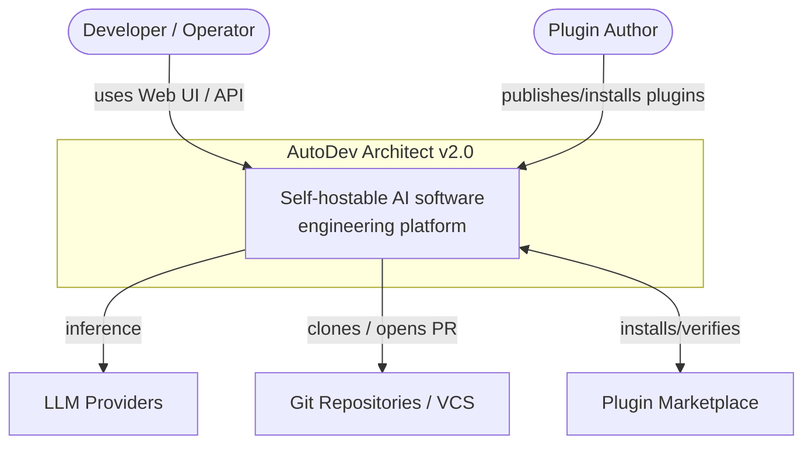
```mermaid
flowchart TB
    dev([Developer / Operator])
    author([Plugin Author])
    llm[LLM Providers]
    repo[Git Repositories / VCS]
    mkt[Plugin Marketplace]

    subgraph AutoDev[AutoDev Architect v2.0]
        platform[Self-hostable AI software\nengineering platform]
    end

    dev -->|uses Web UI / API| platform
    author -->|publishes/installs plugins| platform
    platform -->|inference| llm
    platform -->|clones / opens PR| repo
    platform <-->|installs/verifies| mkt
```

#### Container Diagram (C4 Level 2)

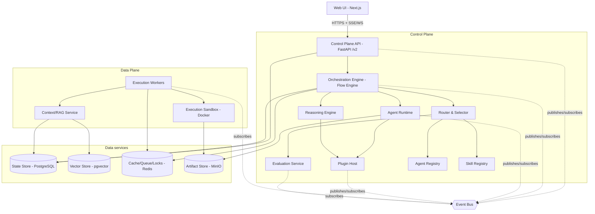
```mermaid
flowchart TB
    ui[Web UI - Next.js]

    subgraph CP[Control Plane]
        api[Control Plane API - FastAPI /v2]
        orch[Orchestration Engine - Flow Engine]
        rte[Agent Runtime]
        phost[Plugin Host]
        reason[Reasoning Engine]
        rs[Router & Selector]
        evalsvc[Evaluation Service]
        areg[Agent Registry]
        sreg[Skill Registry]
    end

    bus{{Event Bus}}

    subgraph DP[Data Plane]
        rag[Context/RAG Service]
        sandbox[Execution Sandbox - Docker]
        workers[Execution Workers]
    end

    subgraph DATA[Data services]
        pg[(State Store - PostgreSQL)]
        vec[(Vector Store - pgvector)]
        redis[(Cache/Queue/Locks - Redis)]
        minio[(Artifact Store - MinIO)]
    end

    ui -->|HTTPS + SSE/WS| api
    api --> orch
    orch --> rte
    orch --> reason
    orch --> rs
    rte --> phost
    reason --> phost
    rs --> areg
    rs --> sreg
    rs --> evalsvc

    api -. publishes/subscribes .-> bus
    orch -. publishes/subscribes .-> bus
    rte -. publishes/subscribes .-> bus
    phost -. publishes/subscribes .-> bus
    workers -. subscribes .-> bus
    evalsvc -. subscribes .-> bus

    workers --> sandbox
    workers --> rag
    rag --> vec
    rag --> pg

    api --> pg
    orch --> pg
    orch --> redis
    workers --> redis
    rte --> minio
    sandbox --> minio
```

### 4.2 Control Plane vs Data Plane Separation

The architecture separates **decision/coordination** from **heavy
work/state**, per the glossary:

- **Control Plane** — Control Plane API, Orchestration Engine, Agent Runtime,
  Plugin Host, Reasoning Engine, Router & Selector, Evaluation Service and the
  registries (Agent/Skill). This is where authentication, RBAC, policies,
  selection, checkpointing and run coordination live. It is stateless as much
  as possible: durable state resides in the State Store; ephemeral
  coordination uses Redis.
- **Data Plane** — Context/RAG Service, Execution Sandbox, execution workers
  and the data services (PostgreSQL, pgvector, Redis, MinIO). This is where
  the intensive work happens: indexing (tree-sitter/embeddings), hybrid
  retrieval, applying **Patch** and running **Validation Gates** in the
  sandbox.

This separation makes it possible to scale the **execution workers**
horizontally, independently of the API (target of ≥ 100 concurrent runs per
reference node, brief section 6), to isolate data-plane failures, and to
apply distinct security limits (the Data Plane runs the sandbox **with no
network by default** and with explicit permissions). The Control Plane never
executes untrusted code from plugins or repositories directly; it delegates
to the Data Plane, which confines it.

The boundary between the planes is crossed in two ways: (1) synchronous
**commands** via typed contracts (the API/Engine enqueues jobs in Redis) and
(2) asynchronous **events** via the Event Bus. This keeps the Control Plane
responsive (target of p95 < 300 ms on reads) while the Data Plane processes
long-running runs.

### 4.3 Event Bus and Event Flow

The **Event Bus** is the asynchronous event bus between subsystems and
plugins. It is the primary decoupling mechanism and the foundation of
**native observability**: every run/step/decision emits events that feed
traces, metrics, the UI stream (SSE/WebSocket) and the durable **event
store** (E8), enabling deterministic **replay** from persisted state.

- **Naming** (brief section 7): events follow `dominio.entidade.acao` in the
  past tense, e.g.: `flow.run.started`, `run.step.completed`,
  `plugin.installed`.
- **Delivery**: decoupled publish/subscribe; consumers include workers,
  Evaluation Service, telemetry collectors and plugins that subscribe to
  **Triggers** (`Trigger`) to start flows.
- The versioned **event catalog** is delivered in **E9**; ordered
  persistence (event store) and durability in **E8**.
- **Governance and tenant**: every event carries `tenant_id`, `session_id`,
  `run_id` and the trace context (E11) for correlation and isolation.

The Event Bus has a progressive implementation: in local mode it can be an
in-process broker; in production it uses Redis (streams/pub-sub) as the
transport for `Cache/Queue/Locks`, maintaining the same event contract.

### 4.4 Lifecycle of a Request / Session / Run

A **Session** groups **Runs** and history; a **Run** is the concrete
execution of a **Flow**, composed of **Steps** (node/agent activations). The
canonical lifecycle of a run — plan → code → apply patch → validate →
evaluate — crosses the Control Plane and Data Plane and is fully tracked on
the Event Bus.

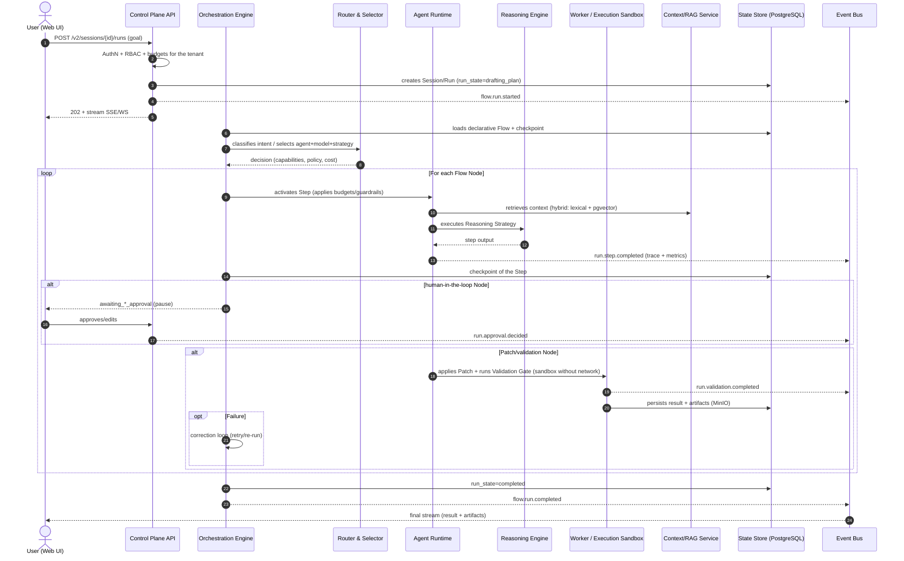
```mermaid
sequenceDiagram
    autonumber
    actor U as User (Web UI)
    participant API as Control Plane API
    participant ORCH as Orchestration Engine
    participant RS as Router & Selector
    participant RTE as Agent Runtime
    participant RE as Reasoning Engine
    participant W as Worker / Execution Sandbox
    participant RAG as Context/RAG Service
    participant DB as State Store (PostgreSQL)
    participant BUS as Event Bus

    U->>API: POST /v2/sessions/{id}/runs (goal)
    API->>API: AuthN + RBAC + budgets for the tenant
    API->>DB: creates Session/Run (run_state=drafting_plan)
    API-->>BUS: flow.run.started
    API-->>U: 202 + stream SSE/WS

    ORCH->>DB: loads declarative Flow + checkpoint
    ORCH->>RS: classifies intent / selects agent+model+strategy
    RS-->>ORCH: decision (capabilities, policy, cost)

    loop For each Flow Node
        ORCH->>RTE: activates Step (applies budgets/guardrails)
        RTE->>RAG: retrieves context (hybrid: lexical + pgvector)
        RTE->>RE: executes Reasoning Strategy
        RE-->>RTE: step output
        RTE-->>BUS: run.step.completed (trace + metrics)
        ORCH->>DB: checkpoint of the Step

        alt human-in-the-loop Node
            ORCH-->>U: awaiting_*_approval (pause)
            U->>API: approves/edits
            API-->>BUS: run.approval.decided
        end

        alt Patch/validation Node
            RTE->>W: applies Patch + runs Validation Gate (sandbox without network)
            W-->>BUS: run.validation.completed
            W->>DB: persists result + artifacts (MinIO)
            opt Failure
                ORCH->>ORCH: correction loop (retry/re-run)
            end
        end
    end

    ORCH->>DB: run_state=completed
    ORCH-->>BUS: flow.run.completed
    BUS-->>U: final stream (result + artifacts)
```

Key points of the cycle:

- **Durable states**: `run_state`/`step_state` (e.g.: `drafting_plan`,
  `awaiting_plan_approval`, `running_validation`, `completed`, `failed`) are
  persisted in the State Store, guaranteeing determinism and replay.
- **Failing closed**: budgets (tokens/cost/time/steps) and guardrails are
  enforced in the Agent Runtime; when a budget is exhausted, the run fails
  closed.
- **Streaming**: the start of streaming for a run must occur in < 1 s (brief
  section 6), served from the Event Bus events.
### 4.5 Extension points and where they fit

Consistent with the principle "every core capability is an extension point", each
subsystem exposes typed and versioned **Extension Points** (SemVer, `hostApi`),
inhabited by **Plugins** loaded by the **Plugin Host**:

| Extension point | Inhabits | Contract/Manifest |
|---|---|---|
| Agent | Agent Runtime / Agent Registry | `agent.yaml` (Agent Manifest) |
| Skill | Agent Runtime / Skill Registry | `skill.yaml` (Skill Manifest) |
| Reasoning Strategy | Reasoning Engine | policy + budgets |
| Router / Selector | Router & Selector | declarative policy |
| Evaluator | Evaluation Service | `eval.yaml` |
| Context Provider / Retriever | Context/RAG Service | retrieval contract |
| Flow / Flow Node | Orchestration Engine | `flow.yaml` |
| UI Panel | Web UI | panel contract |

Every plugin runs with **least privilege**: explicit permissions in
`plugin.yaml`, isolation by the Plugin Host and — when it executes code — inside the
Execution Sandbox. The **SDK** (Python/TS) provides the contracts, scaffolding and
utilities; mandatory **contract tests** (E12) guarantee interface
stability. Plugin publication/installation/verification is delivered by the
**Marketplace** (E13).

### 4.6 Deployment modes

The same base runs from laptop to cluster (local-first, production-ready), varying
only the materialization of data services and event transport:

- **Local (single-process, no external dependencies)** — Control Plane API +
  Orchestration Engine in the same process; **SQLite** as State Store, "stub"
  LLM provider, in-process Event Bus, artifacts on the file system and
  optional sandbox. Target of onboarding in minutes, without mandatory Docker.
- **docker-compose (reference self-host)** — separate services:
  Control Plane API, execution workers, **PostgreSQL + pgvector**, **Redis**,
  **MinIO** and Web UI. This is the recommended mode for small teams and for evaluating the
  platform with the full stack.
- **Kubernetes (multi-tenant production)** — API and workers as independently
  scalable deployments (HPA over queue depth on Redis);
  managed PostgreSQL/pgvector, Redis and MinIO as services; Execution
  Sandbox with restrictive network policy; OpenTelemetry/Prometheus/Grafana/Loki
  for observability (E11). Supports mandatory RBAC, tenants and quotas.

Upgrading between modes is progressive and **without rewriting**: swapping SQLite for
PostgreSQL, the in-process Event Bus for Redis and local FS for MinIO is a
configuration change, not a code change — a condition guaranteed by **E0** (PostgreSQL
migration as default) and **E8** (multi-tenant persistence and versioned
migrations).

### 4.7 Architectural non-functional criteria

The architecture is designed to meet the brief's global goals (section 6):

- **Latency** — stateless Control Plane + reads served from the State Store with
  Redis cache: p95 < 300 ms on reads; run streaming start < 1 s via
  Event Bus.
- **Availability** — 99.9% SLO for the Control Plane; API with no local state allows
  replicas behind a load balancer; workers reprocess idempotent jobs.
- **Scalability** — Control/Data Plane separation and queues on Redis allow
  horizontal scaling of workers (≥ 100 concurrent runs per reference
  node).
- **Security and least privilege** — mandatory RBAC in production; plugins with
  explicit permissions; sandbox with no network by default; secrets outside the Control
  Plane (E11).
- **Data reliability** — State Store as system of record; event
  store for replay; versioned and reversible migrations; RPO ≤ 5 min,
  RTO ≤ 30 min (E8/E11).
- **Governed cost** — per-run budgets and per-tenant quotas; token/cost
  measurement emitted as events and aggregated per tenant.
- **Observability and determinism** — end-to-end OpenTelemetry with
  correlation by `tenant_id`/`session_id`/`run_id`; every run reproducible
  from persisted state.

Together, these criteria express the architectural thesis of v2.0: a **small
and stable core** that coordinates, separate planes that scale and isolate, and an
Event Bus that makes behavior observable, extensible and reproducible.


---

## 5. Plugin System and Extensibility

The Plugin System is the heart of v2.0's architectural promise: **small core, rich edges**. Every core capability — agents, skills, tools, reasoning strategies, routing/selection, evaluation, context/RAG, validation gates, UI panels and event handlers — is exposed as a typed **Extension Point** that a versioned **Plugin** can implement. The **Plugin Host** discovers, loads, isolates and manages the lifecycle of these plugins, mediating access to the **Host API** through an explicit permissions/capabilities model.

This section is the normative specification of **epic E1 — Plugin Core & SDK**. It defines the extension point taxonomy, the **plugin manifest** format (`plugin.yaml`), the lifecycle, isolation/sandbox, versioning and the compatibility matrix, the author's SDK/DX and the loading strategies, closing with functional and non-functional criteria.

> Current base (v1): the additive auto-discovery "seams" (`backend/api/routers/__init__.py::include_all_routers`, `backend/agents/registry.py`, `backend/cli_plugins/__init__.py`) already prove the pattern of "new capability = new file in an observed directory, without touching hot files". v2.0 generalizes these seams into a single Plugin Host with typed contracts, permissions, versioning and isolation.

### 5.1 Extension point taxonomy

Each Extension Point is a SemVer interface of the core (typed contract). A single plugin can inhabit multiple points at the same time. The table below is the canonical taxonomy.

| Extension point | Contract (kind) | Host subsystem | What the plugin provides | Related epic |
|---|---|---|---|---|
| **Agents** | `agent` | Agent Runtime + Agent Registry | Autonomous unit with Agent Manifest (capabilities, IO schema, tools/skills, policy, budgets) | E2 |
| **Skills** | `skill` | Skill Registry | Reusable function (deterministic or LLM-assisted) with Skill Manifest | E6 |
| **Tools** | `tool` | Agent Runtime | Low-level function call exposed to agents (read file, run command) | E2 |
| **Reasoning strategies** | `reasoning` | Reasoning Engine | Pluggable strategy (ReAct, Plan-and-Execute, Reflection, Debate/ToT) | E4 |
| **Routers/Selectors** | `router` / `selector` | Router & Selector | Intent classification (Router) and agent/model/strategy choice (Selector) | E5 |
| **Evaluators** | `evaluator` | Evaluation Service | Scoring of outputs/decisions (rubric, LLM-as-judge, metric) | E5 / E12 |
| **Context providers / Retrievers** | `context_provider` / `retriever` | Context/RAG Service | Context provisioning (files, symbols, memory) and lexical/vector retrieval | E7 |
| **Validation gates** | `validation_gate` | Execution Sandbox + Orchestration Engine | Quality gate (lint/tests/coverage/security) executed in sandbox | E3 / E12 |
| **UI Panels** | `ui_panel` | Web UI (Next.js) | Panel/route/widget declared by manifest, mounted via a registered slot | E10 |
| **Event handlers** | `event_handler` | Event Bus | Subscription to `dominio.entidade.acao` events and asynchronous reaction | E9 |

Cross-cutting rules:

- Every extension point has a mandatory **contract test** published by the core (see 5.7). A plugin is only activatable if it passes the contract test for the contract version it declares.
- Extension points are **composed, not inherited**: a plugin declares in the manifest which points it inhabits; the core resolves and injects the corresponding Host API with minimal scope.
- Flows, although declarative and versioned, are publishable **content/config** (not a code interface) and therefore do not appear as a plugin extension point — they are consumed by the Orchestration Engine.

### 5.2 Plugin manifest (`plugin.yaml`)

The manifest is the plugin's single declarative descriptor. It identifies, versions, declares permissions and enumerates the extension points provided. Ids follow `namespace/nome` in kebab-case; version in SemVer; compatibility with the host declared by a range in `hostApi`.

```yaml
# plugin.yaml — complete example manifest
schemaVersion: "1.0"                 # version of the manifest's own schema

id: acme/coder-plus                  # namespace/name (kebab-case), globally unique
name: "Coder Plus"                   # human-readable name
version: 2.3.1                       # plugin SemVer MAJOR.MINOR.PATCH
description: >
  Coding agent with a reflection strategy, hybrid retriever
  and a test validation gate.
author:
  name: "ACME Engineering"
  email: "plugins@acme.example"
  url: "https://acme.example"
license: "Apache-2.0"
homepage: "https://github.com/acme/coder-plus"

# --- Host <-> plugin compatibility ------------------------------------------
compat:
  hostApi: ">=2.0 <3.0"              # Host API version range (core contracts)
  platform: ">=2.0.0"               # AutoDev platform version range
  python: ">=3.11 <3.14"            # required runtime (for in-process Python plugins)
  contracts:                         # version of each extension point contract used
    agent: "^1.2"
    reasoning: "^1.0"
    retriever: "^1.1"
    validation_gate: "^1.0"

# --- Loading and isolation strategy -----------------------------------------
runtime:
  loader: in-process                 # in-process | subprocess | wasm
  entrypoint: "coder_plus:register"  # registration callable (module:function)
  isolation: process                 # none | thread | process | container | wasm
  resources:                         # ceilings enforced by the Plugin Host
    memory_mb: 512
    cpu_millis: 1000
    timeout_s: 120

# --- Permissions / capabilities model ---------------------------------------
# Least privilege: nothing is granted by default; everything below is explicit.
permissions:
  hostApi:                           # Host API surfaces the plugin may call
    - registry.agents:read
    - context.retriever:read
    - events:subscribe
    - artifacts:write
  network:                           # egress; empty => no network (default)
    egress:
      - "api.openai.com:443"
  filesystem:
    read:  ["${workspace}/src", "${workspace}/tests"]
    write: ["${workspace}/.autodev/cache"]
  secrets:                           # declared secrets; injected by the host, never in the manifest
    - name: OPENAI_API_KEY
      required: true
  events:
    subscribe: ["run.step.completed", "flow.run.started"]
    publish:   ["plugin.coder_plus.suggestion.created"]

# --- Extension points provided ----------------------------------------------
extensionPoints:
  - kind: agent
    id: acme/coder-plus.agent
    contract: "^1.2"
    manifest: "agent.yaml"           # detailed Agent Manifest (capabilities, IO schema, budgets)
    capabilities: ["code.generate", "code.refactor", "test.write"]
  - kind: reasoning
    id: acme/coder-plus.reflection
    contract: "^1.0"
    strategy: reflection
  - kind: retriever
    id: acme/coder-plus.hybrid
    contract: "^1.1"
    mode: hybrid                     # lexical + vector (pgvector)
  - kind: validation_gate
    id: acme/coder-plus.pytest-gate
    contract: "^1.0"
    runsIn: sandbox                  # runs in the Execution Sandbox (hardened Docker)
  - kind: ui_panel
    id: acme/coder-plus.panel
    contract: "^1.0"
    slot: "run.detail.sidebar"       # mount slot registered by the Web UI
    entry: "ui/panel.js"

# --- Dependencies ------------------------------------------------------------
dependencies:
  plugins:                           # other plugins required, by SemVer range
    - id: autodev/skill-fs
      version: "^1.4"
  python:                            # third-party libs (resolved in an isolated environment)
    - "unidiff>=0.7,<1.0"

# --- Operator-facing configuration (validated by JSON Schema) ---------------
config:
  schema: "config.schema.json"
  defaults:
    max_reflection_rounds: 3
    temperature: 0.2

# --- Signing / provenance (verified in the Marketplace, E13) ----------------
signing:
  publisher: "acme"
  fingerprint: "sha256:…"
```

Minimum required fields: `schemaVersion`, `id`, `version`, `compat.hostApi`, `runtime.loader`, `runtime.entrypoint` and at least one item in `extensionPoints`. The Plugin Host **rejects** manifests that declare any unrecognized permission or that omit `compat.hostApi`.

### 5.3 Lifecycle

The Plugin Host manages the plugin through five stages: **discovery → loading → activation → hot-reload → deactivation**. Discovery occurs by scanning observed directories (evolution of the v1 seams) and the registry installed by the Marketplace (E13). Activation only occurs after manifest validation, compatibility resolution, permission grants and passing the contract tests.

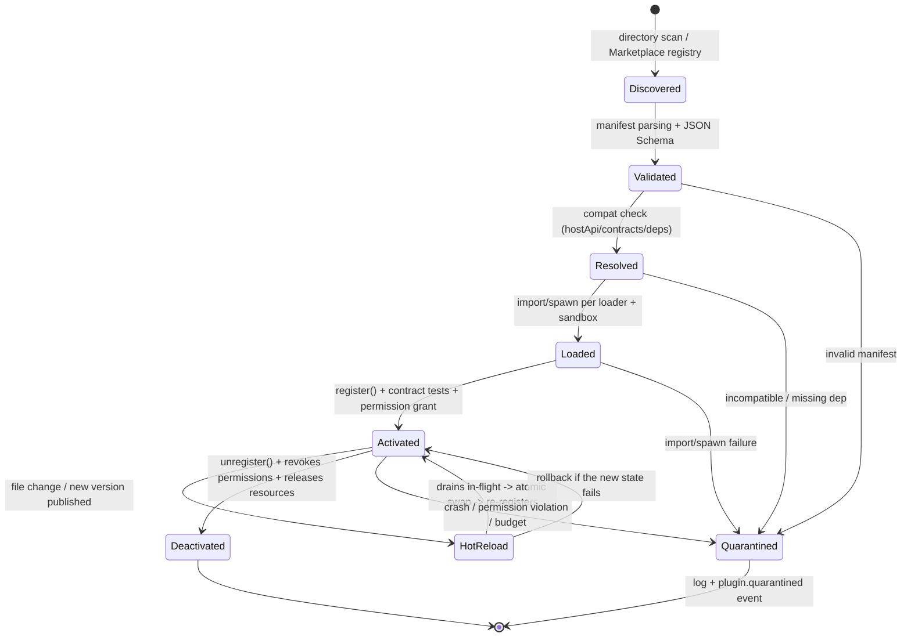
```mermaid
stateDiagram-v2
    [*] --> Discovered: directory scan / Marketplace registry
    Discovered --> Validated: manifest parsing + JSON Schema
    Validated --> Resolved: compat check (hostApi/contracts/deps)
    Resolved --> Loaded: import/spawn per loader + sandbox
    Loaded --> Activated: register() + contract tests + permission grant
    Activated --> HotReload: file change / new version published
    HotReload --> Activated: drains in-flight -> atomic swap -> re-registers
    Activated --> Deactivated: unregister() + revokes permissions + releases resources
    Deactivated --> [*]

    Validated --> Quarantined: invalid manifest
    Resolved --> Quarantined: incompatible / missing dep
    Loaded --> Quarantined: import/spawn failure
    Activated --> Quarantined: crash / permission violation / budget
    HotReload --> Activated: rollback if the new state fails
    Quarantined --> [*]: log + plugin.quarantined event
```

Lifecycle notes:

- **Discovery**: sources are the local directory (`plugins/`), installed packages and the Marketplace registry. Each source produces a candidate manifest.
- **Loading**: for `in-process`, imports the module and resolves `entrypoint`; for `subprocess`/`wasm`, provisions the isolated worker and establishes the RPC channel.
- **Activation**: calls `register(host)` passing a Host API scoped to the granted permissions; runs contract tests; publishes `plugin.activated`.
- **Hot-reload**: atomic swap with draining of in-flight work. Failure in the new version triggers **rollback** to the previous version. Active runs remain deterministic because durable state does not depend on the plugin binary.
- **Deactivation**: `unregister()` removes the extension points from the registry, revokes permissions and releases resources; already-persisted entities (traces, runs) remain.
- **Quarantine**: any failure (manifest, compat, crash, permission/budget violation) moves the plugin to an inactive, audited state — **fail-closed**, never taking down the host (same guarantee as the v1 router loader).

Each transition emits an event on the Event Bus (`plugin.discovered`, `plugin.activated`, `plugin.reloaded`, `plugin.deactivated`, `plugin.quarantined`) for observability and audit.

### 5.4 Isolation, sandbox and permissions model

The **isolation and least privilege** principle is applied in two layers: *execution* isolation (where the code runs) and *capability* control (what the code can do).

- **Permissions denied by default**: a plugin has no network, filesystem, secrets, events or Host API access unless declared in `permissions` and granted by the operator/tenant at installation. Every Host API call passes through a **broker** that verifies the granted capability before executing.
- **Scoped capabilities**: permissions are granular (`registry.agents:read`, `artifacts:write`, `events:subscribe`, egress by host:port, FS paths). Secrets never appear in the manifest; they are referenced by name and injected by the host at runtime.
- **Execution sandbox**: untrusted code and validation run in the **Execution Sandbox** (hardened Docker), **with no network by default**, with CPU/memory/time ceilings (`runtime.resources`). Validation gates always execute in sandbox.
- **Budgets and guardrails**: plugins that consume LLM inherit budgets (tokens/cost/time/steps) from the run; overrun is interrupted (fail-closed).
- **Audit**: every capability grant/use and every violation is recorded as events and traces, feeding RBAC/quotas per tenant (E11).

### 5.5 Versioning and host↔plugin compatibility matrix

The core exposes **stable SemVer contracts** (Host API and contracts per extension point). Plugins depend on contracts, not internals. The rules:

- **Host API** versioned globally; plugin declares a range in `compat.hostApi` (e.g.: `">=2.0 <3.0"`).
- **Contracts per extension point** versioned independently (e.g.: `agent: ^1.2`). A contract MAJOR is breaking; MINOR is additive/backward-compatible; PATCH is a fix.
- **Resolution at activation**: the Host refuses to activate if any range is not satisfied, moving the plugin to Quarantine with a diagnosis.

Compatibility matrix (resolution semantics):

| Host API | `agent` Contract | Plugin requires `hostApi` | Plugin requires `agent` | Result |
|---|---|---|---|---|
| 2.1 | 1.3 | `>=2.0 <3.0` | `^1.2` | Compatible (activates) |
| 2.5 | 1.3 | `>=2.0 <3.0` | `^1.4` | Incompatible (agent contract < required) → Quarantine |
| 3.0 | 2.0 | `>=2.0 <3.0` | `^1.2` | Incompatible (host MAJOR) → Quarantine |
| 2.2 | 1.5 | `>=2.2 <3.0` | `^1.2` | Compatible (additive MINOR covers `^1.2`) |

Deprecations follow a window policy: a contract marked `deprecated` remains functional for at least one MINOR cycle before being removed in a MAJOR, with a warning emitted at `plugin.compat.deprecated`.

### 5.6 Loading strategies (trade-offs)

The `runtime.loader` field selects the execution model. The choice balances performance, isolation and author language.

| Loader | Isolation | Latency/overhead | Languages | Blast radius | When to use |
|---|---|---|---|---|---|
| **in-process** | Low (host thread/GIL) | Minimal (direct call) | Python (host) | High — crash can affect the host | Trusted/first-party plugins, hot paths (retrievers, selectors) |
| **out-of-process / subprocess** | High (separate process, cgroups) | Medium (IPC/RPC, serialization) | Any (polyglot) | Contained — crash isolates in the worker | Third-party plugins, untrusted code, tools that execute commands |
| **WASM** | Very high (capability-based sandbox) | Low-medium (no filesystem/network except import) | Rust/Go/AssemblyScript → WASM | Minimal — deterministic sandbox | Untrusted plugins requiring portability and strong determinism |

Main trade-offs: **in-process** maximizes performance but requires trust (runs in the host process); **subprocess** gives strong isolation and polyglot support at the cost of IPC; **WASM** offers the strictest and most deterministic sandbox, but limits libraries and I/O. The v2.0 recommendation: **in-process only for signed first-party plugins**; **subprocess as default** for third parties; **WASM** for the Marketplace's maximum security/portability path. Regardless of the loader, permissions and budgets are enforced by the Host API broker.

### 5.7 SDK and author experience (DX)

The **SDK** (Python and TypeScript for UI panels) reduces authoring friction and ensures conformance with the contracts.

- **Scaffolding**: `autodev plugin new <namespace/nome>` generates a skeleton with `plugin.yaml`, `entrypoint`, `config.schema.json`, tests and a CI workflow.
- **Typed contracts**: the SDK exports the interfaces for each extension point (types/protocols), so the author implements against the contract, with autocomplete and static checking.
- **Local tests**: `autodev plugin test` runs the plugin against an ephemeral host (local-first, SQLite + stub provider) without external infrastructure.
- **Contract tests**: each extension point comes with a set of contract tests published by the core; `autodev plugin verify` runs these tests and is a **mandatory gate** for activation and for publishing to the Marketplace (E12/E13).
- **Packaging/publishing**: `autodev plugin package` validates the manifest, resolves deps, signs the artifact and produces the installable package; `autodev plugin publish` submits it to the Marketplace with signature verification (E13).
- **Inspection**: `autodev plugin inspect` shows extension points, required permissions and resolved compat before installation.

### 5.8 Acceptance criteria

**Functional**

- FR-1: The Plugin Host discovers, validates, loads, activates, hot-reloads and deactivates plugins from a `plugin.yaml` manifest, without restarting the host process.
- FR-2: A single plugin can inhabit multiple declared extension points; each is registered in the correct subsystem/registry.
- FR-3: Activation is blocked and the plugin goes to Quarantine if the manifest is invalid, compat does not resolve, a dependency is missing or a contract test fails — always with diagnosis and an event.
- FR-4: Permissions are denied by default and granted explicitly; every Host API call is checked by the broker against the granted capabilities.
- FR-5: Hot-reload swaps the version atomically, draining in-flight work, with automatic rollback on failure; runs in progress remain deterministic.
- FR-6: Support for the three loaders (in-process, subprocess, WASM) with uniform enforcement of permissions/budgets.
- FR-7: SDK offers scaffolding, local tests, contract tests, signed packaging and inspection; contract tests are a gate for activation and publishing.

**Non-functional**

- NFR-1 (security): plugins run with least privilege; sandbox with no network by default; secrets never in the manifest; RBAC/quotas per tenant applicable to installation and use (E11).
- NFR-2 (isolation/robustness): failure of any plugin never takes down the host (fail-closed); blast radius limited by the chosen loader.
- NFR-3 (compatibility): stable SemVer contracts; deterministic compat resolution; deprecation window of at least one MINOR cycle.
- NFR-4 (performance): negligible permission resolution/broker overhead in in-process hot paths; core contract tests run in CI within epic E12's time budget.
- NFR-5 (observability): every lifecycle transition and every permission/budget violation emits an auditable event and trace.
- NFR-6 (coverage/quality): mandatory contract tests for all extension points; Plugin Host core ≥ 85% line coverage.
- NFR-7 (DX/local-first): author can create, test and verify a plugin in a local environment without external dependencies.

This system materializes **epic E1 — Plugin Core & SDK** and is the foundation on which epics E2 (agents), E4 (reasoning), E5 (routing/evaluation), E6 (skills), E7 (context/RAG), E10 (UI panels) and E13 (Marketplace) deliver their capabilities as plugins.


---

## 6. Agent Framework

This section specifies v2.0's **Agent Framework**, materialized in epic
**E2 — Agent Framework** and sustained, at runtime, by the canonical
**Agent Runtime** component. The goal is to transform what in v1 are Python classes
coupled to the orchestrator (see `backend/agents/base.py`, `registry.py`,
`contracts.py`) into **agents-as-plugins**: declarative, versioned and
discoverable units, with **typed and stable IO contracts**, executed under budgets and
guardrails, and addable **without touching the core** through the **Plugin Host** (E1).

### 6.1 Agent definition in v2

Per the canonical glossary, an **Agent** is an *autonomous unit that receives a
task, reasons and produces output according to its contract*. In v2.0 this definition is
reinforced by three invariants:

1. **Declarative before imperative** — an agent's identity (id, version,
   capabilities, IO contracts, allowed tools/skills, default reasoning, budgets,
   prompts and context requirements) lives in an **Agent Manifest** (`agent.yaml`),
   not in code. The implementation is just the *handler* that the runtime invokes.
2. **Contract before implementation** — every agent exposes a **typed and
   versioned IO contract** (JSON Schema/Pydantic). The core depends on the contract, never
   on the agent's internals (Principle 3).
3. **Executed, not self-executing** — the agent does not decide its own cost
   limits alone, does not access tools directly and does not select itself. The one that instantiates,
   applies **budgets/guardrails** and **mediates access to tools/skills** is the
   **Agent Runtime**; the one that selects it is the **Selector** (E5); the one that orchestrates it is the
   **Orchestration Engine** (E3).

Comparison with v1 (evolution, not rupture):

| Aspect | v1 (current) | v2.0 (target) |
| --- | --- | --- |
| Identity | `class`/`name` in code | versioned `agent.yaml` (SemVer) |
| Discovery | `@register_agent` decorator + `discover_agents` | **Agent Registry** + **Plugin Host** |
| Output contract | `AGENT_METADATA_MODELS` (Pydantic, not versioned) | typed **and** versioned IO contract (`schemaVersion`) |
| Context | `AgentContext` (in-process dataclass) | declared **context requirements** + Context/RAG Service (E7) |
| Reasoning | fixed inside `run()` | pluggable **Reasoning Strategy** (E4) referenced in the manifest |
| Limits | implicit | declared **budgets** (tokens/cost/time/steps), fail-closed |
| Tool access | coupled to the agent | mediated by **Agent Runtime** with explicit permissions |

### 6.2 Agent Manifest (`agent.yaml`)

The **Agent Manifest** is the complete declarative descriptor of an agent. It follows the
canonical conventions: `id` in `namespace/nome` format in kebab-case, `version` in
SemVer, and a compatibility range with the host (`hostApi`). The manifest is the only
artifact the **Agent Registry** needs to register, version and discover an
agent, and the only one the **Selector** needs to match tasks via `capabilities`.

COMPLETE example — reshaping the current `coder` as a plugin:

```yaml
# agent.yaml — full manifest of an agent v2.0
schemaVersion: "2.0"                 # manifest format version
kind: Agent

# --- Identity ---
id: autodev/agent-coder              # namespace/name, kebab-case (canonical)
version: 2.1.0                       # SemVer of the agent
hostApi: ">=2.0 <3.0"                # compatibility range with the core
displayName: "Coder Agent"
description: "Decomposes a change into code tasks and generates patches."
license: Apache-2.0
maintainers: ["autodev-core"]
tags: ["engineering", "codegen", "patch"]

# --- Capabilities (labels/contracts that the Selector uses to match tasks) ---
capabilities:
  - id: code.implementation          # declared capability
    level: primary                   # primary | secondary
    languages: ["python", "typescript", "go"]
  - id: code.refactor
    level: secondary

# --- Typed and VERSIONED IO contract ---
io:
  contract: autodev/coder-io         # contract id (registered in the Agent Registry)
  contractVersion: 1.2.0             # SemVer of the IO contract
  input:
    $ref: "./contracts/coder.input.schema.json"
  output:
    $ref: "./contracts/coder.output.schema.json"
  # Failure mode: structured output even on error (fail-closed)
  onInvalidOutput: repair-then-fail  # repair-then-fail | fail | passthrough

# --- Allowed Tools and Skills (least privilege — Principle 5) ---
permissions:
  tools:
    - id: fs.read                    # file reading (sandbox)
    - id: fs.write
      constraints: { pathGlobs: ["src/**", "tests/**"] }  # path guard
    - id: patch.apply
      constraints: { dryRunFirst: true }
  skills:
    - id: autodev/skill-unified-diff # >=1.0 <2.0
      versionRange: ">=1.0 <2.0"
    - id: autodev/skill-test-scaffold
      versionRange: ">=0.3 <1.0"
  network: none                      # sandbox with no network by default (canonical)

# --- Default reasoning strategy (pluggable via E4) ---
reasoning:
  default: autodev/reasoning-plan-and-execute
  versionRange: ">=1.0 <2.0"
  allowOverrideBy: [selector, flow]  # who can override the strategy
  params:
    maxPlanSteps: 12
    reflection: true

# --- Budgets (tokens/cost/time/steps) — fail-closed by default ---
budgets:
  tokens: { input: 120000, output: 16000 }
  costUsd: 0.75
  wallClockSeconds: 180
  maxSteps: 24
  maxToolCalls: 40
  onExceeded: fail-closed            # fail-closed | degrade | ask-human

# --- Prompts / templates (versioned alongside the manifest) ---
prompts:
  system:
    template: "./prompts/coder.system.md.j2"
    engine: jinja2
    variables: [goal, constraints, style_guide]
  user:
    template: "./prompts/coder.user.md.j2"
    engine: jinja2
    variables: [user_request, plan, context_bundle]
  fewShots: "./prompts/coder.fewshots.yaml"

# --- Context requirements (what the agent needs to receive) ---
context:
  requires:
    - kind: repository.files         # via Context/RAG Service (E7)
      selector: { relatedTo: "task", topK: 20 }
      required: true
    - kind: symbols.tree-sitter
      required: false
    - kind: memory.long-term         # long-term memory (see 6.5)
      scope: session
      required: false
  budgetTokens: 60000                # cap on injected context
  redaction: [secrets, pii]          # context guardrails

# --- Memory (short and long term) ---
memory:
  shortTerm: { scope: run, ttl: run }          # discarded at the end of the run
  longTerm:  { scope: session, store: state }  # persisted in the State Store

# --- Observability (native — Principle 6) ---
observability:
  emitTrace: true
  metrics: [tokens, costUsd, latencyMs, toolCalls, outputValid]
  redactPromptsInTrace: true

# --- Handler (implementation loaded by the Plugin Host — E1) ---
entrypoint:
  runtime: python
  ref: "autodev_coder.agent:CoderAgent"   # class that implements the contract
```
### 6.3 Typed and versioned IO contract

Every agent publishes an **IO contract** with `schemaVersion`/`contractVersion`
independent of the code, registered in the **Agent Registry**. The contract is the
stable boundary between core and agent (Principle 3): the **Orchestration Engine**
validates the input before invoking and the output after invoking; violations
trigger `onInvalidOutput`. This replaces v1's `AGENT_METADATA_MODELS` with something
versionable and language-agnostic.

Input — JSON Schema (`coder.input.schema.json`):

```json
{
  "$schema": "https://json-schema.org/draft/2020-12/schema",
  "$id": "autodev/coder-io/1.2.0/input",
  "title": "CoderInput",
  "type": "object",
  "additionalProperties": false,
  "required": ["schemaVersion", "task", "context"],
  "properties": {
    "schemaVersion": { "const": "1.2.0" },
    "task": {
      "type": "object",
      "required": ["goal"],
      "properties": {
        "goal": { "type": "string", "minLength": 1 },
        "constraints": { "type": "array", "items": { "type": "string" } },
        "plan": { "type": "array", "items": { "type": "string" } }
      }
    },
    "context": {
      "type": "object",
      "properties": {
        "files": {
          "type": "array",
          "items": {
            "type": "object",
            "required": ["path", "content"],
            "properties": {
              "path": { "type": "string" },
              "content": { "type": "string" }
            }
          }
        },
        "symbols": { "type": "array", "items": { "type": "string" } }
      }
    }
  }
}
```

Output — equivalent TypeScript contract (source for type generation in the SDK):

```typescript
/** autodev/coder-io — output contract v1.2.0 */
export interface CoderOutput {
  schemaVersion: "1.2.0";
  /** Result mode: always structured, even on error (fail-closed). */
  status: "ok" | "partial" | "error";
  codingTasks: CodingTask[];
  testUpdates: string[];
  touchedComponents: string[];
  /** Patch in unified diff format, applied with path guard + dry-run. */
  patch?: { format: "unified-diff"; content: string };
  /** Filled in when status !== "ok". */
  diagnostics?: Array<{ severity: "warn" | "error"; message: string }>;
}

export interface CodingTask {
  component: string;
  task: string;
}
```

**Contract versioning** follows SemVer: adding an optional field is MINOR;
removing/renaming a field or tightening a constraint is MAJOR. The Agent Registry
keeps multiple versions coexisting, and the Orchestration Engine negotiates the
supported version via `contractVersion` (backward compatibility within the same
MAJOR).

### 6.4 Agent Registry — registration, discovery and versioning

The **Agent Registry** (canonical component) is the source of truth for which
agents exist, in which versions, with which capabilities and contracts. It evolves
the current `register_agent`/`discover_agents` (in-process, unversioned) into a
durable, multi-tenant registry in the **State Store**.

Responsibilities:

- **Registration**: when a plugin is installed, the **Plugin Host** (E1) validates
  the `agent.yaml` against the manifest schema and registers it `(id, version)`; IO
  contracts are registered by `(contract, contractVersion)`.
- **Discovery**: query by `id`, by `capability` (used by the **Selector** in E5),
  by `tag`, or by version range (`>=2.0 <3.0`).
- **Versioning**: multiple versions coexist; resolution by SemVer range; stable
  `latest` vs. `preview`. Deprecation marks versions and emits
  `agent.version.deprecated` on the **Event Bus**.
- **Programmatic interface** (core contract, stable):

```python
class AgentRegistry(Protocol):
    def register(self, manifest: AgentManifest) -> AgentRef: ...
    def resolve(self, id: str, version_range: str = "*") -> AgentRef: ...
    def find_by_capability(self, capability: str) -> list[AgentRef]: ...
    def deprecate(self, id: str, version: str, reason: str) -> None: ...
```

### 6.5 Agent lifecycle and memory

**Lifecycle** of an agent (governed by the **Agent Runtime**):

1. **Resolve** — Selector/Flow requests `(id, versionRange)`; the Registry resolves
   the version.
2. **Load** — the Plugin Host loads the `entrypoint` in isolation, with the
   manifest's permissions.
3. **Bind** — the Runtime injects the **required context** (via the Context/RAG
   Service), the memory, the proxies for the permitted tools/skills, and the
   Reasoning Strategy.
4. **Validate-in** — the input is validated against the IO contract.
5. **Reason/Act** — the agent reasons under the pluggable strategy, calling
   tools/skills **always** through the Runtime (never directly), under budgets and
   guardrails.
6. **Validate-out** — the output is validated; a violation triggers
   `onInvalidOutput`.
7. **Persist** — long-term memory, trace, metrics and artifacts are written.
8. **Teardown** — short-term memory is discarded; resources are released.

**Memory** (two levels, declared in the manifest and linked to the State Store — E8):

- **Short-term** (`shortTerm`): `run`/`step` scope, volatile; holds reasoning
  state, intermediate tool results, and local history. Discarded at teardown.
  Replaces v1's in-process `AgentContext.artifacts` with something governed.
- **Long-term** (`longTerm`): `session`/`tenant` scope, persisted in the **State
  Store**; facts, preferences and summaries retrievable across runs. Retrieval can
  be assisted by the **Context/RAG Service** (E7) when semantic. Access is always
  mediated by the Runtime, with `redaction` of secrets/PII.

### 6.6 Access to tools/skills and guardrails via Agent Runtime

The **Agent Runtime** is the mandatory mediator. It:

- **Injects only** the tools/skills declared in `permissions`, as *proxies* that
  apply `constraints` (e.g. `pathGlobs`, `dryRunFirst`) — least privilege
  (Principle 5).
- **Applies budgets** per call and accumulated over the run; on exceeding, it
  executes `onExceeded` (default `fail-closed`, aligned with the global
  non-functional goals).
- **Runs guardrails** on input, context and output (security, format, content);
  guardrails can be Guardrails-as-plugin.
- **Enforces isolation**: `network: none` by default; command execution goes to
  the hardened **Execution Sandbox**.
- **Emits observability**: every step generates `run.step.*` on the Event Bus,
  with trace and metrics for replay/audit (Principles 6 and 7).

### 6.7 Adding a new agent WITHOUT touching the core (via plugin, linked to E1)

A new agent is delivered as a **Plugin** (E1). The core is never modified:

1. **Scaffold** with the **SDK**: `autodev plugin new agent acme/agent-reviewer`
   generates `plugin.yaml`, `agent.yaml`, `contracts/*.schema.json`, `prompts/*`
   and the handler.
2. **Declare** capabilities, IO contract, permitted tools/skills, reasoning,
   budgets and context requirements in `agent.yaml`.
3. **Implement** the handler against the **Extension Point** `AgentHandler` (typed
   SDK contract) — depends on contracts, not on core internals.
4. **Package and sign**; publish to the **Marketplace** (E13).
5. **Install**: the **Plugin Host** discovers, validates the manifest, isolates,
   applies permissions and registers the agent in the **Agent Registry**. From
   there the **Selector** can already match it by capability, without a core
   redeploy.

Extension point (SDK):

```python
class AgentHandler(Protocol):
    manifest: AgentManifest                     # loaded from agent.yaml
    def run(self, req: AgentRequest) -> AgentResponse: ...
    #  req.input already validated; req.tools/req.skills are Runtime proxies;
    #  req.memory exposes short/long term; return value is validated against the contract.
```

This replaces v1's `@register_agent` + `discover_agents` mechanism (which
required importing modules into the orchestrator process) with isolated,
versioned installation.

### 6.8 Contract tests

Aligned with **E12 — Quality & Evals** (contract tests mandatory for extension
points) and with the non-functional goals (core ≥ 85% line coverage):

- **Manifest validation**: `agent.yaml` validates against the manifest JSON
  Schema; `id`, SemVer and `hostApi` conform to the conventions.
- **IO conformance**: for each contract version, a *golden dataset* of
  valid/invalid inputs verifies that the input is accepted/rejected and that
  every output satisfies the schema — including the error path (`status:
  "error"` remains valid → fail-closed).
- **Version compatibility**: a consumer on MAJOR `1.x` must keep working against
  any `1.y` (automated backward-compatibility test).
- **Permissions/budgets**: tests guarantee that the Runtime denies undeclared
  tools and stops on exceeding budget (`fail-closed`).
- **Registration**: registering/resolving by version range and by capability has
  coverage.

These tests run as CI **quality gates** (E12) and are a prerequisite for
publishing to the Marketplace (E13).

### 6.9 Reshaping the current agents

The v1 agents (`planner`, `coder`, `security`/`validator`, etc., currently in
`AGENT_METADATA_MODELS`) become plugins with their own manifest and contract:

| Agent v1 | id v2 | capabilities | IO contract | default reasoning |
| --- | --- | --- | --- | --- |
| planner | `autodev/agent-planner` | `planning.decompose` | `planner-io` (`steps[]`) | `plan-and-execute` |
| coder | `autodev/agent-coder` | `code.implementation`, `code.refactor` | `coder-io` (tasks + patch) | `plan-and-execute` + reflection |
| security | `autodev/agent-security` | `security.review` | `security-io` (findings + severity) | `reflection` |
| validator | `autodev/agent-validator` | `validation.plan` | `validator-io` (steps + criteria) | `react` |

Migration notes:

- **planner**: `PlannerOutput.steps` becomes `planner-io v1.0.0`; gains budgets
  and declared context (goal + repo summary).
- **coder**: absorbs `CoderOutput` (coding_tasks, test_updates,
  touched_components) and now emits `patch` (unified diff) mediated by
  `patch.apply` with `dryRunFirst`.
- **security**: new `security.review` agent with strong guardrails, `network:
  none`, and a findings contract with severity; feeds the **Validation Gates**.
- **validator**: `ValidatorOutput` (validation_steps, success_criteria) becomes
  `validator-io`; executable steps run in the **Execution Sandbox**, linking the
  agent to the **Validation Gates** (lint/tests/coverage/security).

### 6.10 Functional and non-functional criteria

**Functional (FR):**

- **FR1** — An agent is fully defined by `agent.yaml`; no core change is
  required to add/remove/version an agent.
- **FR2** — Every invocation validates input and output against the versioned IO
  contract.
- **FR3** — The Agent Registry allows registering, discovering (by
  id/capability/tag/range) and deprecating agents, with multiple versions
  coexisting.
- **FR4** — The Runtime injects only declared tools/skills and applies their
  constraints.
- **FR5** — Agents expose short- and long-term memory with declared scopes.
- **FR6** — Selector matches tasks to agents by capability (integration with
  E5).

**Non-functional (NFR):**

- **NFR1 — Security**: least privilege; `network: none` by default; explicit
  permissions; RBAC mandatory in production; `redaction` of secrets/PII.
- **NFR2 — Cost/Budgets**: token/cost/time/step budgets per agent and per run,
  with **fail-closed** default; measurement per run/tenant.
- **NFR3 — Contract stability**: SemVer in manifests and IO contracts;
  backward compatibility guaranteed within the MAJOR; contract tests mandatory.
- **NFR4 — Observability/Replay**: every step emits trace, metrics and events
  (`run.step.*`); reproducible executions from persisted state.
- **NFR5 — Isolation**: failure or error of one agent/plugin does not bring down
  the core or the other agents (isolated loading by the Plugin Host).
- **NFR6 — Performance**: Runtime overhead (validation + mediation) must not
  compromise the global target of a run's streaming start < 1 s.
- **NFR7 — Portability**: the same manifest runs local-first (SQLite/stub) and
  in production (PostgreSQL/pgvector/Redis/MinIO) without changes.

This framework is the backbone of epic **E2** and the main client of the
**Plugin Host** and the SDK defined in **E1**, consuming Reasoning (E4),
Routing/Selection/Evaluation (E5), Skills (E6), Context/RAG (E7) and Persistence
(E8) through stable contracts.


---

## 7. Flow Engine and Orchestration

The **Orchestration Engine (Flow Engine)** is the Control Plane subsystem that
executes **Flows** — declarative, versioned graphs that coordinate Agents,
Skills, Tools and human decisions. It materializes the central capability of
epic **E3 — Flow Engine** and is the direct evolution of the current use of
LangGraph in `OrchestratorService` (today a fixed linear graph, compiled in
`backend/orchestrator/service.py::_compile_graph`, with a conditional-routing
sketch in `backend/orchestrator/routing.py`/`graphs.py`).

The guiding principle is **flow-as-configuration** (Principle 2): the
topology, routing, budgets, retries and human-intervention points live in a
versioned `flow.yaml` artifact, not in Python code. The core only interprets,
executes and persists; behavior grows at the edges via Agents (E2), Skills (E6),
Reasoning (E4) and Router/Selector (E5).

### 7.1. Flow-as-configuration (declarative and versioned)

A Flow is a `flow.yaml` document that describes a DAG (with controlled cycles
allowed for reflection/retry loops). Its characteristics:

- **Declarative**: nodes, edges, triggers, policies and error handlers are data,
  not imperative code. The same document is read by the execution engine, by the
  **visual editor** (E10) and by validation/lint tools.
- **Versioned**: each Flow has an `id` (`namespace/name`, kebab-case) and a
  `version` (**SemVer**). Publishing a new version never mutates an existing
  one; **Runs** in progress remain pinned to the version they started with
  (execution immutability → enables deterministic replay).
- **Contracted**: declares `hostApi` (the SemVer range of the core it supports),
  `inputs`/`outputs` with JSON Schema, and the capabilities/skills it consumes.
  The engine refuses to load a Flow whose `hostApi` is incompatible.
- **Portable**: `flow.yaml` is a **Marketplace** (E13) resource and can be
  installed, inherited and reused as a **sub-flow**.

### 7.2. Graph/DAG model

The Flow state (**Flow State**) is a typed document, versioned by
`schemaVersion`, propagated and reduced (merged) between nodes — a
generalization of the current `AgentGraphState`. Each node reads and produces a
_patch_ of the state; the engine applies deterministic reducers to enable
replay.

#### Flow Node Types

| Type | Role | Consumes | Emits |
|------|-------|---------|-------|
| `agent` | Activates an Agent from the **Agent Registry** by capability/id (E2) | task + context | typed output, artifacts |
| `tool` | Invokes a low-level Tool (read file, run command) | args | result |
| `skill` | Invokes a versioned Skill from the **Skill Registry** (E6) | typed args | typed output |
| `conditional` | Routes via predicate/expression over the Flow State | state | edge choice |
| `router` | Delegates the path decision to the **Router & Selector** (E5) | intent/task | chosen route |
| `human` | **Human-in-the-loop**: pauses awaiting decision/edit | proposal | approval/edit/rejection |
| `subflow` | Executes another versioned Flow as a node (reuse) | mapped inputs | mapped outputs |
| `map` | Fan-out: applies a node/sub-flow over a collection | list | parallel results |
| `reduce` | Fan-in: aggregates the results of a `map` | results | aggregate |
| `parallel` | Concurrent branches with a join | state | merges |
| `timer` | Waits/schedules (delay, deadline, internal cron) | — | continuation |
| `noop`/`terminal` | Start/end markers (`START`/`END`) | — | — |

#### Edges, triggers and timers

- **Conditional edges**: each edge can carry a predicate (`when:`) evaluated
  over the Flow State by a **sandboxed** expression engine (safe subset, no I/O,
  no network access). The first edge whose predicate is true (or `default`) is
  followed. Cycles are allowed, but limited by `maxIterations` and by a
  **Budget** of steps/time (fail-closed).
- **Triggers**: start a Run. Types: `message` (chat/session), `webhook` (signed
  HTTP), `cron` (scheduled), `event` (subscription to an **Event Bus** topic,
  e.g. `run.step.completed`). Every trigger emits `flow.run.started`.
- **Timers**: `timer` for delays/deadlines; `timeout` per node and per Run; SLA
  per `human` node (escalate/expire). Timers are durable (survive worker
  restarts via checkpoint).

### 7.3. Complete `flow.yaml` example

```yaml
schemaVersion: "2.0"
id: autodev/flow-repo-change
version: "2.1.0"
hostApi: ">=2.0 <3.0"
name: "Change to existing repository"
description: >
  Plans, codes, applies patch, validates in sandbox and evaluates a change,
  with human approval before merging and rollback on failure.

inputs:
  schema:
    type: object
    required: [repo, task]
    properties:
      repo: { type: string }
      task: { type: string }
      branch: { type: string, default: "main" }
outputs:
  schema:
    type: object
    properties:
      pr_url: { type: string }
      status: { type: string, enum: [merged, rejected, failed] }

# Global execution configuration (inheritable per node)
defaults:
  timeout: "10m"
  retry:
    maxAttempts: 3
    backoff: { strategy: exponential, initialDelay: "2s", maxDelay: "1m", jitter: true }
    retryOn: [transient_error, rate_limited, timeout]
  budgets:
    tokens: 400000
    costUsd: 5.00
    wallClock: "45m"
    steps: 60

triggers:
  - type: message
    channel: session
  - type: webhook
    path: "/v2/flows/autodev/flow-repo-change/hooks/run"
    auth: hmac
  - type: event
    topic: "repo.push.received"

# Graph nodes
nodes:
  - id: plan
    type: agent
    agent: { capability: "planning", selector: "cheapest-capable" }
    inputs: { goal: "${inputs.task}", repo: "${inputs.repo}" }
    reasoning: { strategy: "plan-and-execute" }

  - id: route
    type: router
    router: autodev/router-run-type
    outputs: { runType: "$.decision" }

  - id: code
    type: agent
    agent: { capability: "coding" }
    inputs: { plan: "${nodes.plan.output}", repo: "${inputs.repo}" }
    retry: { maxAttempts: 2, retryOn: [transient_error] }
    timeout: "15m"

  - id: apply_patch
    type: tool
    tool: autodev/tool-apply-patch
    inputs: { diff: "${nodes.code.output.patch}", branch: "${inputs.branch}", dryRun: false }
    onError:
      compensate: rollback_patch      # triggers compensation node

  - id: validate
    type: subflow
    subflow: { id: autodev/flow-validation-gate, version: ">=1.2 <2.0" }
    inputs: { repo: "${inputs.repo}", branch: "${inputs.branch}" }
    # runs lint/tests/coverage/security in the Execution Sandbox

  - id: gate
    type: conditional
    branches:
      - when: "${nodes.validate.output.passed} == true"
        to: evaluate
      - when: "${nodes.validate.output.passed} == false && ${state.iteration} < 2"
        to: code                      # fix loop (controlled cycle)
        effect: { increment: "state.iteration" }
      - default: true
        to: rollback_patch

  - id: evaluate
    type: agent
    agent: { capability: "evaluation" }   # Evaluation Service (E5)
    inputs: { patch: "${nodes.code.output.patch}", results: "${nodes.validate.output}" }

  - id: human_review
    type: human
    role: "reviewer"                       # requires RBAC 'reviewer'
    prompt: "Approve merge of the patch?"
    present:
      - { kind: diff, value: "${nodes.code.output.patch}" }
      - { kind: report, value: "${nodes.evaluate.output.score}" }
    options: [approve, request_changes, reject]
    sla: { deadline: "24h", onExpire: reject }

  - id: merge
    type: tool
    tool: autodev/tool-merge-pr
    inputs: { branch: "${inputs.branch}" }
    outputs: { pr_url: "$.url" }

  - id: rollback_patch
    type: tool
    tool: autodev/tool-revert-patch
    inputs: { branch: "${inputs.branch}" }
    outputs: { status: "failed" }

  - id: notify_reject
    type: skill
    skill: { id: autodev/skill-notify, version: ">=1.0 <2.0" }
    inputs: { message: "Change rejected in review." }

# Explicit edges (the non-conditional ones)
edges:
  - { from: START, to: plan }
  - { from: plan, to: route }
  - { from: route, to: code }
  - { from: code, to: apply_patch }
  - { from: apply_patch, to: validate }
  - { from: validate, to: gate }
  - { from: gate }                         # edges via node branches
  - { from: evaluate, to: human_review }
  - from: human_review
    branches:
      - { when: "${nodes.human_review.output.decision} == 'approve'", to: merge }
      - { when: "${nodes.human_review.output.decision} == 'request_changes'", to: code }
      - { default: true, to: notify_reject }
  - { from: merge, to: END }
  - { from: rollback_patch, to: notify_reject }
  - { from: notify_reject, to: END }

# Declarative compensation/rollback (saga)
compensation:
  - node: apply_patch
    with: rollback_patch                   # undoes effects if a later node fails
```
### 7.4. Graph diagram

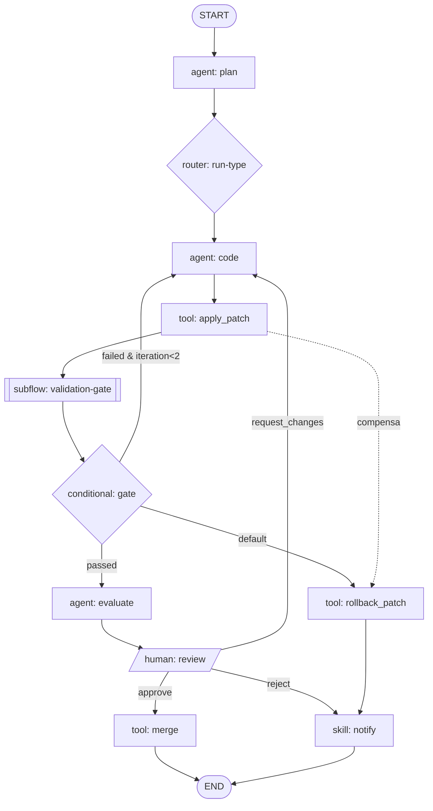
```mermaid
flowchart TD
    START([START]) --> plan[agent: plan]
    plan --> route{router: run-type}
    route --> code[agent: code]
    code --> apply_patch[tool: apply_patch]
    apply_patch --> validate[[subflow: validation-gate]]
    validate --> gate{conditional: gate}
    gate -- passed --> evaluate[agent: evaluate]
    gate -- "failed & iteration<2" --> code
    gate -- default --> rollback_patch[tool: rollback_patch]
    evaluate --> human_review[/human: review/]
    human_review -- approve --> merge[tool: merge]
    human_review -- request_changes --> code
    human_review -- reject --> notify_reject[skill: notify]
    merge --> END([END])
    rollback_patch --> notify_reject
    notify_reject --> END

    apply_patch -. compensa .-> rollback_patch
```

### 7.5. Execution engine (evolution of LangGraph and generalization)

v1 uses LangGraph with a `StateGraph` compiled from a fixed order of
agents. v2 **generalizes** this into a Flow interpreter with these
responsibilities:

1. **Compilation**: `flow.yaml` → validated executable graph (schema, node/edge
   references, capabilities existing in the Registry, `hostApi`). LangGraph
   remains a possible _execution backend_ behind a stable `FlowExecutor`
   interface, but the semantics (nodes, budgets, compensation, human-in-
   the-loop) are defined by the core, not by the lib.
2. **Scheduling**: enqueues ready nodes (dependencies
   satisfied) in **Redis**; **Data Plane** workers consume them, enabling
   parallelism (`parallel`, `map`) and horizontal scale (≥ 100 concurrent Runs
   per reference node).
3. **Node execution**: each node type has a handler that mediates access to the
   **Agent Runtime**, **Skill Registry**, Tools or Router/Selector, applying
   **Budgets** and **Guardrails**.
4. **Error control**: `retry` (exponential backoff with jitter), `timeout`,
   budget circuit-break and triggering of **compensation** (saga) — undoing
   side effects (e.g., `rollback_patch`) in reverse order.
5. **Native observability** (Principle 6): each node emits `Trace`/`Step` and
   events (`flow.run.started`, `run.step.completed`, `flow.run.completed`) on
   the **Event Bus**, with OpenTelemetry metrics (E11).

### 7.6. State persistence, checkpointing, replay and resume

Aligned with E8 (**Persistence & Data**) and Principle 7 (Determinism and
replay):

- **Durable state**: `Run`, `Step` and Flow State live in the **State Store**
  (PostgreSQL; SQLite in local-first mode). Large artifacts (patches, logs,
  diffs) go to the **Artifact Store (MinIO)**, referenced by pointer.
- **Checkpointing**: after each successful node (or at barrier points), the
  engine writes a transactional **checkpoint** (Flow State + graph cursor +
  node versions). This enables **resume** of Runs after worker failure
  or restart without repeating completed work (idempotency via `step_key` +
  `attempt`, generalizing the current `RunStep`).
- **Durable suspension**: `human` and `timer` nodes **suspend** the Run
  (freeing the worker) and persist a _wait token_. Resumption is triggered by
  an event (human decision, timer expiration, webhook), without keeping the
  process alive.
- **Deterministic replay**: since the Flow version is immutable and each node
  records inputs/outputs in the `Trace`, a Run can be **re-executed** from any
  checkpoint. Non-deterministic calls (LLM, network) are recorded and can be
  **reproduced from the trace** (record/replay) for debugging and audit.
- **RPO/RTO**: frequent checkpoints support the global goal RPO ≤ 5 min,
  RTO ≤ 30 min.

### 7.7. Visual flow editor (UX, connection to E10)

The **Web UI (Next.js)** offers a visual editor that is a faithful projection
of the `flow.yaml` (round-trip: YAML ⇄ canvas without loss). UX requirements
(detailed in E10):

- **Graph canvas**: drag/drop typed nodes (agent, tool, skill,
  conditional, human, subflow, map/reduce, timer), connect edges and edit
  predicates of conditional edges with autocomplete over the Flow State
  schema.
- **Resource palette**: pulls capabilities from the **Agent Registry**, Skills
  from the **Skill Registry** and available subflows; real-time validation of
  IO contracts and `hostApi`.
- **Version diff and review**: compare SemVer versions of the Flow side by
  side; view history and publish a new version without mutating previous ones.
- **Debugging/replay**: overlay a Run's `Trace` onto the graph, highlighting
  the traversed path, `Step`s with status/attempts, cost/tokens per node and
  human-in-the-loop points; allow "replay from here".
- **Accessibility**: WCAG 2.2 AA, 100% keyboard graph navigation and editing
  (global non-functional goal and Principle 10).

### 7.8. Subflows, reuse and versioning

- **Subflows**: the `subflow` node references another Flow by `id` + SemVer
  range, mapping `inputs`/`outputs` via contracted schemas. This encapsulates
  reusable patterns (e.g., `autodev/flow-validation-gate`) and reduces
  duplication.
- **Reuse & Marketplace**: Flows and subflows are publishable/installable
  via **Marketplace** (E13), with signing/verification.
- **Versioning** (Convention 7): `id` = `namespace/nome` (kebab-case),
  `version` = SemVer. Rules: incompatible IO schema change or removal of a
  required node → **MAJOR**; new backward-compatible optional node/edge →
  **MINOR**; fix without contract impact → **PATCH**. Runs pin the starting
  version (immutability). Range references (`>=1.2 <2.0`) resolve to the
  highest compatible version at compile time.

### 7.9. Acceptance criteria

#### Functional

- **F1** — The engine compiles and executes a valid `flow.yaml` containing all
  node types (agent, tool, skill, conditional, router, human, subflow,
  map/reduce, parallel, timer).
- **F2** — Conditional edges route based on predicates over the Flow
  State; the `default` branch is followed when no predicate matches.
- **F3** — Retries with exponential backoff + jitter, per-node/Run timeouts and
  budgets (tokens/cost/time/steps) are applied and **fail closed** when
  exceeded.
- **F4** — Compensation/rollback (saga) undoes effects of already-executed
  nodes when a later node fails, in reverse order.
- **F5** — `human` nodes durably suspend the Run and resume under decision,
  respecting role RBAC and SLA/expiration.
- **F6** — `message`, `webhook`, `cron` and `event` triggers start Runs and
  emit `flow.run.started`.
- **F7** — Subflows execute with contracted IO mapping; `hostApi`/schema
  incompatibility prevents compilation with a clear error.
- **F8** — Replay re-executes a Run from a checkpoint reproducing the
  `Trace`; resume resumes interrupted Runs without repeating completed steps.
- **F9** — The visual editor performs YAML ⇄ canvas round-trip without loss
  and validates contracts in real time.

#### Non-functional

- **NF1** — Streaming start of a Run < 1 s; per-node orchestration overhead
  (excluding handler work) with low p95, not dominating latency.
- **NF2** — Horizontal worker scaling; ≥ 100 concurrent Runs per reference
  worker node (global scale goal).
- **NF3** — Checkpointing guarantees RPO ≤ 5 min and RTO ≤ 30 min; no
  completed Step is re-executed after restart (idempotency).
- **NF4** — Deterministic/reproducible execution from persisted state
  (Principle 7); Flow versions are immutable.
- **NF5** — Every Run/Step/decision emits Trace, OpenTelemetry metrics and
  events on the Event Bus (Principle 6, E11).
- **NF6** — Security: edge predicates run in a sandboxed expression engine
  (no I/O/network); `tool`/`agent` nodes respect explicit permissions and
  network-free sandbox by default; sensitive actions require RBAC.
- **NF7** — Test coverage of the engine core ≥ 85% of lines; contract
  tests mandatory for the `FlowExecutor` interface and node handlers.
- **NF8** — Flow editor and screens compliant with WCAG 2.2 AA, 100%
  keyboard navigation.

### 7.10. Relationship with other epics

E3 is the coordinator that consumes E2 (`agent` nodes via Agent Registry/
Runtime), E6 (`skill` nodes), E4 (`reasoning` per node), E5 (`router`/
`evaluate` nodes), E7 (context injected into Flow State), E8 (persistence/
checkpoint/artifacts), E9 (webhook/event triggers, streaming, `flow.*`/
`run.*` events), E10 (visual editor) and E11 (observability, RBAC,
budgets/quotas per tenant).


---

## 8. Reasoning (Pluggable Strategies)

This section specifies the **Reasoning Engine** and the **Reasoning Strategy** contract, delivered by epic **E4 — Reasoning**. The Reasoning Engine is the **Agent Runtime** component responsible for _how_ an agent thinks: it provides and executes pluggable reasoning strategies, applies **policies** and **budgets** in a _fail-closed_ manner, emits **traces** for deterministic replay and cooperates with **Router & Selector** (E5) in choosing the strategy. New strategies enter the system as **plugins** (E1), inhabiting the `reasoning.strategy` extension point.

### 8.1 Role and boundaries

The Reasoning Engine is intentionally narrow: it coordinates an agent's reasoning cycle, but it does **not** implement tools/skills (mediated by the Agent Runtime), does **not** decide which agent runs (Router & Selector, E5) and does **not** persist flow state (Orchestration Engine, E3). Its responsibility is: (a) select/instantiate the appropriate strategy; (b) execute the reasoning loop within limits; (c) invoke tools/skills in a mediated way and verify outputs via guardrails; (d) emit structured traces. This keeps the **small core** and moves intelligence to the edges (pluggable strategies).

### 8.2 Supported reasoning strategies

v2.0 provides a set of reference strategies as first-party plugins (`autodev/reasoning-*`), all implementing the same contract:

- **ReAct** (`reasoning-react`): `Thought → Action → Observation` cycle with tool-calling; suited to exploratory tasks and heavy tool use.
- **Plan-and-Execute** (`reasoning-plan-execute`): generates an explicit plan and executes it step by step, with conditional re-planning; suited to multi-step, long-horizon tasks.
- **Reflection / Self-critique** (`reasoning-reflection`): executes, self-critiques the output against criteria and revises over N limited iterations; improves quality in code/patch generation.
- **Debate / Tree-of-Thought** (`reasoning-tot`): expands multiple reasoning branches (or personas in debate), scores and converges; used when there is high uncertainty and it is worth exploring alternatives under budget.
- **Native tool-calling** (`reasoning-native-tools`): delegates the tool loop to the LLM provider's native mechanism (function/tool calling), minimizing overhead when the model already orchestrates tools well.

The catalog is open: any combination (e.g., Plan-and-Execute + Reflection in branches) is expressible as a new pluggable strategy.

### 8.3 Contract of a Reasoning Strategy

The contract is a **typed and versioned** interface (SemVer, `hostApi: ">=2.0 <3.0"`). The strategy receives an immutable context (task, messages, available tools, budget and policy), an effect mediator (`ReasoningContext`) to invoke tools/LLM and emit traces, and returns a structured result. Every side effect passes through the mediator — the strategy never calls the provider/tool directly —, which guarantees budget enforcement, guardrails and replay.

```python
from __future__ import annotations
from dataclasses import dataclass
from typing import Any, AsyncIterator, Protocol, Sequence

@dataclass(frozen=True)
class ReasoningInput:
    task: str                          # task/goal description
    messages: Sequence[dict[str, Any]] # session history (roles)
    tools: Sequence["ToolSpec"]        # available tools/skills (schemas)
    policy: "ReasoningPolicy"          # guardrails + declarative selection
    budget: "Budget"                   # tokens/cost/time/steps
    seed: int | None = None            # seed for deterministic replay

@dataclass(frozen=True)
class ReasoningOutput:
    content: Any                       # final output (text/structured)
    stop_reason: str                   # "completed" | "budget_exhausted" |
                                       # "guardrail_blocked" | "error"
    usage: "Usage"                     # tokens/cost/time/steps consumed
    trace_id: str                      # trace anchor for replay/audit

class ReasoningContext(Protocol):
    """Effects mediator: single path to LLM/tools/traces.
    Each call debits the budget and is recorded in the trace."""
    async def call_llm(self, messages: Sequence[dict], **opts) -> "LLMResult": ...
    async def call_tool(self, name: str, args: dict) -> "ToolResult": ...
    async def check_budget(self) -> None: ...          # raises BudgetExceeded (fail-closed)
    async def verify(self, output: Any) -> "GuardrailResult": ...  # guardrails
    def emit(self, event: "TraceEvent") -> None: ...    # reasoning step -> trace

class ReasoningStrategy(Protocol):
    id: str                 # e.g.: "autodev/reasoning-react"
    version: str            # strategy SemVer
    host_api: str           # compatibility range, e.g.: ">=2.0 <3.0"

    def config_schema(self) -> dict: ...   # JSON Schema of the strategy's parameters

    async def run(
        self, input: ReasoningInput, ctx: ReasoningContext
    ) -> AsyncIterator["TraceEvent"] | ReasoningOutput: ...
    # implementations may stream TraceEvents (streaming) and finish
    # with a ReasoningOutput; the Engine aggregates usage and validates the stop_reason.
```

Contract rules: (1) all external I/O occurs via `ReasoningContext`; (2) the strategy is **stateless between runs** — state lives in the run's trace/state (E3/E8); (3) `run` must respect `budget` by calling `ctx.check_budget()` before each costly step; (4) the final output must pass through `ctx.verify()` (guardrails) before being returned. Contract tests (E12) validate any implementation against this contract.

### 8.4 Policies and budgets (fail-closed enforcement)

A reasoning **Policy** is declarative and versioned. It defines strategy selection, budgets, guardrails and failure behavior. **Budgets** limit four dimensions — tokens, cost (USD), time (wall-clock) and number of steps — and are enforced by the Reasoning Engine, not by the strategy: the mediator debits each `call_llm`/`call_tool` and, upon exceeding any cap, **fails closed** (`stop_reason = "budget_exhausted"`, with no new effects). The safe default is inherited from the global non-functional goals (token/cost/time cap per run, fail-closed by default).

```yaml
# reasoning-policy.yaml — reasoning policy (declarative, versioned)
schemaVersion: 1
id: autodev/reasoning-policy-default
version: 1.2.0
hostApi: ">=2.0 <3.0"

# Strategy selection (cooperates with Router & Selector, E5)
selection:
  default: autodev/reasoning-react
  rules:
    - when: { task.kind: "planning", complexity: ">=high" }
      use: autodev/reasoning-plan-execute
    - when: { task.kind: "code_patch" }
      use: autodev/reasoning-reflection
      config: { max_revisions: 2 }
    - when: { uncertainty: "high", budget.tokens: ">=20000" }
      use: autodev/reasoning-tot
      config: { branches: 3, beam: 2 }

# Budgets enforced by the Engine (fail-closed when any ceiling is exceeded)
budget:
  tokens: 24000          # token ceiling (prompt + completion)
  cost_usd: 0.75         # cost ceiling per run
  wall_clock_ms: 45000   # time ceiling
  max_steps: 12          # max number of steps/iterations
  on_exceed: fail_closed # fail_closed | degrade_to: <strategy>

# Output verification guardrails (E4 + interoperate with Validation Gate)
guardrails:
  - id: schema_conformance   # output must match the agent's IO schema
    on_violation: repair_once
  - id: no_secret_leakage
    on_violation: block
  - id: patch_path_guard     # patches restricted to allowed paths
    on_violation: block

# Telemetry / replay
tracing:
  level: full            # full | steps | summary
  record_prompts: true   # stored in the Artifact Store (redaction applied)
  deterministic_replay: true
```

Budget precedence: **run** cap > **agent** cap (Agent Manifest) > policy default. The lowest applicable cap wins. Per-tenant quotas (E11) can further reduce the effective cap.

### 8.5 Guardrails and output verification

Guardrails are checks applied before the output is accepted: schema conformance (against the agent's IO schema), security/content policies (e.g., secret leakage), and domain-specific guards (e.g., `patch_path_guard`). Each guardrail declares `on_violation`: `block` (fail closed, `stop_reason = "guardrail_blocked"`), `repair_once` (reinjects the violation for one correction attempt within the budget) or `warn` (logs and proceeds). Reasoning guardrails complement — not replace — the **Validation Gates** (lint/tests/security in sandbox) executed downstream in the flow.

### 8.6 Traces, telemetry and deterministic replay

Every reasoning step emits an ordered **TraceEvent** (e.g., `reasoning.step.thought`, `reasoning.tool.called`, `reasoning.guardrail.evaluated`), published on the **Event Bus** and persisted in the run's trace. The trace captures: normalized inputs, prompts/responses (with sensitive-data redaction, large artifacts in the **Artifact Store**), tool calls and results, guardrail decisions and accumulated `usage`. **Deterministic replay** is possible because (a) all non-determinism passes through the mediator — `seed` fixes sampling when the provider supports it, and LLM/tool responses are recorded — and (b) the strategy is stateless. Replay re-executes from the trace, serving debugging, audit and eval feedback (E5/E12).

### 8.7 Strategy selection (relationship with E5)

Strategy choice is resolved in layers, with increasing precedence: (1) platform default; (2) declaration in the **Agent Manifest** (`reasoning.strategy`); (3) override in the **Flow Node** (E3); (4) dynamic decision by the **Selector** (E5), which combines capabilities, cost and eval signals to choose strategy/model per task. The `reasoning-policy.yaml` (§8.4) expresses the rules the Selector consumes. The selection result is recorded in the trace for reproducibility, and the **Evaluation Service** (E5) closes the loop, adjusting policies based on quality/cost metrics per strategy.

### 8.8 How to plug in a new strategy (via plugin, E1)

A new strategy is delivered as a plugin that inhabits the `reasoning.strategy` extension point:

1. Implement `ReasoningStrategy` (§8.3) using the **SDK** (Python/TS) and expose `config_schema()`.
2. Declare the `plugin.yaml` with `id` `namespace/nome`, `version` SemVer, `hostApi`, explicit permissions (least privilege) and the extension point.
3. Pass the extension point's **contract tests** (mandatory, E12).
4. Publish to the **Marketplace** (E13) with signing/verification; install via the **Plugin Host**, which isolates and manages the lifecycle.

The strategy then becomes available for selection via policy/Manifest/Selector, with no changes to the core.

### 8.9 Acceptance criteria

**Functional**

- The Reasoning Engine executes any strategy that satisfies the contract (§8.3) with no strategy-specific code in the core.
- The five reference strategies (ReAct, Plan-and-Execute, Reflection, Debate/ToT, native tool-calling) are delivered as first-party plugins and pass the contract tests.
- Budgets (tokens, cost, time, steps) are enforced by the Engine and fail closed when any cap is exceeded; the output indicates the correct `stop_reason`.
- Guardrails evaluate the final output with `block`/`repair_once`/`warn` actions according to policy.
- Strategy selection respects the default → Manifest → Flow Node → Selector precedence, and is recorded in the trace.
- Each run produces a complete trace, deterministically replayable from persisted state.
- New strategies are installable via the Plugin Host without redeploying the core.

**Non-functional**

- **Overhead**: the Engine adds < 50 ms p95 per step, excluding LLM/tool latency.
- **Determinism**: replay from the trace reproduces the same sequence of steps and output (given the same `seed`/recorded responses) in 100% of test cases.
- **Fail-closed**: no external effect occurs after the budget is exceeded; verified by test.
- **Observability**: 100% of steps emit TraceEvent on the Event Bus; sensitive prompts redacted by default.
- **Compatibility**: contract versioned by SemVer; breaking changes only in MAJOR; contract tests mandatory for the extension point.
- **Security/cost**: strategies run with explicit permissions; budgets and per-tenant quotas respected (E11).


---

## 9. Agent Routing, Selection and Evaluation

This section specifies the **Router & Selector** subsystem and the **Evaluation Service**, delivered by epic **E5 — Routing/Selection/Evaluation** with **closed feedback**. The goal is to transform the decision of "which execution path to take" and "which agent/model/strategy to use" — today a static map (see `backend/orchestrator/routing.py`, with `RunTypeRouter` and `SupervisorPolicy`) — into **pluggable, declarative, measured and self-adjusting** capabilities. The Router & Selector consumes capabilities published by the **Agent Registry** (E2) and operates over the **Reasoning Strategies** of the **Reasoning Engine** (E4); the Evaluation Service scores the outputs and feeds back into routing policies, closing the loop.

### 9.1 Position in the architecture and relationship with E4 and E2

- **Router** classifies the intent/task from the run state (message, session, context, metadata) and produces a **Route Decision**: the task type, the execution path (flow/nodes) and applicable constraints.
- **Selector** receives the Route Decision and, matching **Capabilities** declared in the **Agent Registry (E2)** with the current policy, chooses **agent + model + Reasoning Strategy (E4) + budget**, producing a **Selection Decision**.
- **Evaluation Service** observes the results of these agents/strategies (offline and online) and feeds a **score store** that routing policies read from to adjust themselves.

```
Router (intent/task) ──► Selector (agent/model/strategy) ──► Agent Runtime (E2) + Reasoning Engine (E4)
        ▲                             ▲                                        │
        └───── policies ◄── scores ──┴──────────── Evaluation Service ◄───────┘ (traces/outputs)
```

The separation is deliberate: **Router decides "what/via which path"; Selector decides "with what"**. Both are versioned extension points (SemVer contracts, per principle 3 of the brief), allowing multiple pluggable implementations without touching the core.

### 9.2 Router and Selector contracts

Typed, stable contracts (`schemaVersion`), exposed as extension points. Every decision is serializable and goes to the **Trace** (replay/audit).

```yaml
# Logical contract (YAML representation of the typed schemas)
RouteRequest:
  schemaVersion: "1.0"
  session_id: string
  run_id: string
  input:            # user/trigger input
    text: string
    attachments: [uri]
  context_digest:   # summary from the Context/RAG Service (E7), optional
    repo: string
    signals: {has_tests: bool, languages: [string]}

RouteDecision:
  schemaVersion: "1.0"
  task_type: string            # e.g.: existing-repo-change, validation-only
  intent: string               # e.g.: fix-bug, add-feature, refactor, docs
  path: [string]               # suggested nodes/steps of the Flow (E3)
  confidence: number           # 0..1
  constraints:
    max_cost_usd: number
    latency_class: "interactive" | "batch"
  rationale: string            # human-readable text (separate from the metadata)

SelectRequest:
  schemaVersion: "1.0"
  route: RouteDecision
  required_capabilities: [string]   # e.g.: code.python, patch.unified, test.run
  budget: {tokens: int, cost_usd: number, time_s: int}

SelectDecision:
  schemaVersion: "1.0"
  agent_id: string             # namespace/name (E2), e.g.: autodev/agent-coder
  agent_version: string        # SemVer
  model: string                # e.g.: provider/model
  reasoning_strategy: string   # E4: react | plan-and-execute | reflection | debate
  budget: {tokens: int, cost_usd: number, time_s: int}
  fallbacks: [ {agent_id, model, reasoning_strategy} ]
  score_basis: string          # id of the score snapshot used (from the Eval Service)
```

Interfaces (SDK, Python) summarized:

```python
class RouterPlugin(Protocol):
    def route(self, req: RouteRequest, policy: RoutingPolicy) -> RouteDecision: ...

class SelectorPlugin(Protocol):
    def select(self, req: SelectRequest, policy: SelectionPolicy,
               registry: AgentRegistry, scores: ScoreSnapshot) -> SelectDecision: ...
```
### 9.3 Pluggable Routing and Selection Policies

The core does not fix a decision strategy; it offers **pluggable policies** that can be combined in a pipeline (deterministic order, the first one to resolve with sufficient confidence wins, otherwise cascades to the next):

- **Rules** — declarative predicates over state signals (deterministic default; a direct evolution of the current `_ROUTE_MAP`). Cheap, auditable, predictable.
- **Embeddings** — similarity-based classification against labeled examples (uses pgvector/E7). Robust to paraphrasing, no LLM cost per decision.
- **LLM-as-router** — an LLM classifies intent/task and/or chooses the agent when the previous ones have low confidence. More expensive; used as a tiebreaker.
- **Cost-aware** — reorders/filters candidates by expected cost and latency under the run's budget and the tenant's quotas (E11).
- **Capability matching** — matches the task's `required_capabilities` against the capabilities declared in the Agent Manifest (E2); discards incompatible agents before any LLM cost.

Example of a declarative, versioned **routing policy** (`routing.yaml`):

```yaml
schemaVersion: "1.0"
id: autodev/routing-default
version: 1.4.0
hostApi: ">=2.0 <3.0"

router:
  pipeline:                       # evaluated in order; short-circuit by confidence
    - kind: rules
      confidence_floor: 0.0
      rules:
        - when: "input.text ~= /(?i)\\b(doc|readme|changelog)\\b/"
          set: {task_type: documentation-update, path: [navigator, analyzer, responder]}
        - when: "context.signals.has_tests and intent == 'validate'"
          set: {task_type: validation-only, path: [navigator, validator, responder]}
    - kind: embeddings
      dataset: autodev/intents@2026-06
      threshold: 0.72
    - kind: llm-router
      model: provider/router-small
      max_cost_usd: 0.01
      only_if_confidence_below: 0.72

selector:
  pipeline:
    - kind: capability-matching
      require_all: true
    - kind: cost-aware
      objective: minimize_cost         # minimize_cost | minimize_latency | maximize_quality
      respect: {run_budget: true, tenant_quota: true}
    - kind: score-weighted             # uses Evaluation Service snapshot
      weights: {quality: 0.6, cost: 0.25, latency: 0.15}
  tie_breaker: lowest_cost

guardrails:
  input:  [pii-filter, prompt-injection-scan]
  output: [schema-validate, secret-scan, policy-content]

fallback:
  on_guardrail_block: {action: retry_with, agent_id: autodev/agent-coder-safe}
  on_budget_exceeded: {action: downgrade_model, then: fail_closed}
  on_agent_error:     {action: next_fallback, max_attempts: 2}
  default:            fail_closed
```

### 9.4 Evaluation Service

The Evaluation Service runs **Evals** (dataset + rubric + metrics) offline and online, persists results in the **State Store**, and publishes **score snapshots** consumed by the selection policies. First-class metrics across three dimensions: **quality**, **cost**, and **latency**.

- **Offline** — reproducible and pre-merge/CI (integrates with E12):
  - **Datasets & golden sets**: versioned inputs with reference (golden) outputs and/or cases with deterministic verification (e.g., patch applies cleanly, tests pass in the sandbox/E-execution).
  - **LLM-as-judge & rubrics**: `Evaluator` scores outputs against a declarative rubric (0–1 per criterion), with a fixed judge model and versioned prompt for comparability.
  - **Metrics**: pass@k, patch accuracy, post-patch coverage, format adherence, average cost (USD/tokens), p50/p95 latency.
- **Online** — in production, under sampling and with guardrails:
  - **Feedback**: implicit signals (patch accepted/reverted, validation gate passed) and explicit signals (thumbs, human review).
  - **A/B and canary**: routes a fraction of traffic to a variant (agent/model/strategy/policy), compares metrics with significance; canary automatically promotes/reverts based on thresholds.

Example of an **eval spec** (`eval.yaml`):

```yaml
schemaVersion: "1.0"
id: autodev/eval-coder-bugfix
version: 2.1.0
target:
  kind: agent
  agent_id: autodev/agent-coder
  reasoning_strategy: plan-and-execute   # evaluates agent+strategy combination (E4)

mode: offline
dataset:
  ref: autodev/bugfix-golden@2026-06
  split: test
  size: 240

evaluators:
  - kind: deterministic
    id: patch-applies
    check: "patch.dry_run.ok == true"
  - kind: deterministic
    id: tests-pass
    check: "sandbox.tests.exit_code == 0"     # Execution Sandbox, no network
  - kind: llm-as-judge
    id: solution-quality
    model: provider/judge-large
    rubric:
      correctness:   {weight: 0.5, scale: [0, 1]}
      minimality:    {weight: 0.3, scale: [0, 1]}
      style:         {weight: 0.2, scale: [0, 1]}

metrics:
  quality: {primary: tests-pass, aggregate: mean, min_pass_rate: 0.80}
  cost:    {budget_usd_p95: 0.35}
  latency: {p95_seconds: 45}

gate:                      # quality gate for CI (E12)
  fail_if: "quality.tests-pass.mean < 0.80 or cost.usd_p95 > 0.35"

online:                    # optional: promotion of the result to routing
  publish_scores: true
  ab_test:
    control: {policy: autodev/routing-default@1.4.0}
    variant: {policy: autodev/routing-default@1.5.0-rc}
    traffic: {variant_pct: 10}
    promote_if: "variant.quality >= control.quality and variant.cost <= control.cost"
    min_samples: 500
```

### 9.5 Closed Feedback Loop

The differentiator of v2 is closing the loop: evaluations feed back into the routing/selection policies in a **measured and reversible** way. Score snapshots are versioned and referenced by `score_basis`/`score_basis` in the decision, ensuring deterministic replay (principle 7).

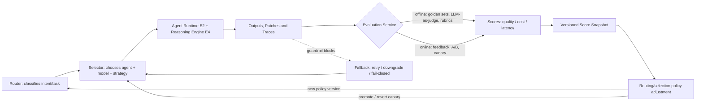
```mermaid
flowchart LR
    A[Router: classifies intent/task] --> B[Selector: chooses agent + model + strategy]
    B --> C[Agent Runtime E2 + Reasoning Engine E4]
    C --> D[Outputs, Patches and Traces]
    D --> E{Evaluation Service}
    E -->|offline: golden sets, LLM-as-judge, rubrics| F[Scores: quality / cost / latency]
    E -->|online: feedback, A/B, canary| F
    F --> G[Versioned Score Snapshot]
    G --> H[Routing/selection policy adjustment]
    H -->|new policy version| A
    H -->|promote / revert canary| B
    D -.guardrail blocks.-> I[Fallback: retry / downgrade / fail-closed]
    I --> B
```

Flow: (1) Router and Selector decide under the current policy; (2) the run executes and emits traces and outputs; (3) the Evaluation Service scores offline (in CI/scheduled) and online (sampling in production); (4) scores become a versioned snapshot; (5) the policy adjustment updates weights/thresholds or promotes/reverts a variant (A/B, canary); (6) the new policy version takes effect for subsequent runs. Adjustments are **proposed and auditable** (new SemVer version of the policy), never a silent mutation.

### 9.6 Guardrails and Fallback

- **Input guardrails**: PII filter and prompt-injection detection before routing.
- **Output guardrails**: schema validation, secret-scan, and content/policy verification before accepting an agent's output.
- **Cascading fallback**: on guardrail block, agent error, or budget overrun, the Selector walks through `fallbacks` (alternative agent/model, model downgrade) and, once attempts are exhausted, applies **fail-closed** — the brief's safe default (the NF goal for budgets that "fail closed"). Every fallback is logged in the Trace with the reason.
- **Budgets**: each decision respects the run's budget and the tenant's quotas (E11); estimated cost/latency feed into the cost-aware policy's objective function.

### 9.7 Acceptance Criteria

**Functional**

1. Router produces a typed `RouteDecision` with `task_type`, `path`, `confidence`, and `rationale`; Selector produces a `SelectDecision` with agent+model+strategy+budget and a list of `fallbacks`.
2. Routing and selection policies are declarative, versioned (SemVer), and pluggable: rules, embeddings, LLM-as-router, cost-aware, and capability matching, combinable in a pipeline with short-circuit by confidence.
3. Selector matches `required_capabilities` against the Agent Registry (E2) and chooses a Reasoning Strategy from the Reasoning Engine (E4).
4. Evaluation Service runs offline evals (datasets, golden sets, LLM-as-judge, rubrics, deterministic checks in the sandbox) and online evals (feedback, A/B, canary), persisting results and publishing score snapshots.
5. Closed loop: scores feed back into policies via a new policy version or variant promotion/reversion, with deterministic replay via `score_basis`.
6. Active input/output guardrails and cascading fallback terminating in fail-closed; every decision and fallback go to the Trace.
7. Eval quality gates integrable with CI (E12), failing merge below quality/cost/latency thresholds.

**Non-Functional**

1. **Latency**: Router+Selector decision overhead with a deterministic policy (rules/capability/cost-aware) < 50 ms p95; the LLM-as-router path is optional and triggered only by low confidence.
2. **Cost**: LLM-as-router and LLM-as-judge have an explicit budget per call; decision cost measured and attributed per run/tenant.
3. **Determinism/replay**: given the same input, policy, and score snapshot, the decision is reproducible; snapshots are immutable and versioned.
4. **Observability**: each RouteDecision/SelectDecision/Eval emits a trace and metrics (quality/cost/latency) via OpenTelemetry (E11).
5. **Extensibility**: new policies and evaluators are plugins with mandatory contract tests (E1/E12); adding one does not require a change to the core.
6. **Security/governance**: mandatory guardrails in production; fail-closed by default; auditable and reversible decisions.
7. **Coverage**: Router/Selector/Evaluation core ≥ 85% line coverage; contract tests for all extension points.


---

## 10. Skills

A **Skill** is a reusable and declarable function — deterministic or LLM-assisted — invocable by agents, flows, the Control Plane API, or the CLI. Skills encapsulate a named capability, with an explicit input/output (IO) contract, declared permissions, and SemVer versioning. In v2.0, skills stop being just self-registered in-process Python classes and become **first-class, versioned, and publishable artifacts** through the **Skill Registry** and, when distributed by third parties, packaged as **plugins** (see [E1](#) and the [E6](#) epic — Skills v2).

This section defines the boundary between Skill, Tool, and Agent, specifies the **Skill Manifest** (`skill.yaml`), the **Skill Registry**, the invocation/composition/chaining mechanisms, the permissions and sandbox model, the versioning and compatibility policy, the relationship with the plugin subsystem, and the evolution path of the current builtin skills.

### 10.1 Skill vs. Tool vs. Agent

The three concepts are distinct and complementary. The practical rule: **Tools** are low-level calls that an agent triggers directly; **Skills** are intermediate-level capabilities, named, versioned, and testable in isolation; **Agents** are autonomous units that reason about a task and compose tools and skills to produce an output according to their contract.

| Dimension | **Tool** | **Skill** | **Agent** |
|---|---|---|---|
| Definition | Low-level capability (function call) exposed to an agent | Reusable and declarable function, deterministic or LLM-assisted | Autonomous unit that receives a task, reasons, and produces output |
| Autonomy | None — executed when invoked | Low — executes a well-defined step | High — plans, decides, and iterates |
| Reasoning (LLM) | No | Optional (a skill can be deterministic or LLM-assisted) | Yes, by definition (via Reasoning Engine) |
| State | Stateless | Ideally stateless; effects via context/permissions | Maintains run/session state |
| Contract | Function signature | **Skill Manifest** (IO schema, permissions, deps) | **Agent Manifest** (capabilities, IO, tools/skills, budgets) |
| Versioning | Follows the host/plugin | **Own SemVer** (`skill.yaml`) | Own SemVer (`agent.yaml`) |
| Discovery | Registered in the Agent Runtime | **Skill Registry** | **Agent Registry** |
| Invocation | `tool.call(args)` by the agent | `invoke_skill(id, ctx)` by agent/flow/API/CLI | flow node activation / Selector |
| Composition | Does not compose others | **Composes tools and other skills** (chaining) | Composes skills, tools, and sub-agents |
| Granularity | E.g.: `read_file`, `run_command` | E.g.: `summarize_diff`, `extract_symbols` | E.g.: `agent-coder`, `agent-planner` |
| Cost/budget | Trivial (call) | Trivial if deterministic; under budget if LLM | Governed by Agent Runtime budgets |
| Extension point | Registered by the Agent Runtime | **E6 / skill plugin** | **E2 / agent plugin** |

Directional summary: a Tool "does one thing"; a Skill "does a reusable, contracted, and versioned thing"; an Agent "decides what to do and uses skills/tools to do it".

### 10.2 Skill Manifest (`skill.yaml`)

Every v2 skill is described by a declarative `skill.yaml` manifest, the canonical descriptor of a skill (id, version, IO, permissions, dependencies, triggers). The manifest is the single source of truth for discovery, contract validation, permission checking, and dependency resolution. The skill's code implements the contract; the manifest declares it.

Fields:

- **id** — `namespace/name` in kebab-case (e.g., `autodev/summarize-diff`).
- **version** — SemVer `MAJOR.MINOR.PATCH` of the skill itself.
- **hostApi** — SemVer range of compatibility with the core API (e.g., `">=2.0 <3.0"`).
- **io** — JSON Schema of `input` and `output` (typed and stable contract).
- **permissions** — explicit required capabilities (least privilege): FS, network, execution, LLM.
- **dependencies** — other skills (by SemVer range), packages, and LLM requirement.
- **discovery / triggers** — discovery and matching triggers (tags, capability, intent patterns used by the Router/Selector).
- **determinism** — `deterministic | llm-assisted` (affects replay and cache).
- **sandbox** — isolation profile required for execution.

```yaml
# skill.yaml — Skill Manifest (AutoDev Architect v2.0)
schemaVersion: "1.0"

id: autodev/summarize-diff          # namespace/name (kebab-case)
version: 2.0.0                       # SemVer of the skill
hostApi: ">=2.0 <3.0"                # compatibility with the core API

name: Summarize Diff
description: >
  Summarizes a unified diff: counts changed files and added/removed
  lines and produces a readable summary.
kind: deterministic                  # deterministic | llm-assisted
labels: [code, git, review]

# --- IO Contract (JSON Schema) ---------------------------------------
io:
  input:
    type: object
    additionalProperties: false
    required: [diff]
    properties:
      diff:
        type: string
        description: Unified diff.
      max_files:
        type: integer
        minimum: 1
        default: 200
  output:
    type: object
    required: [content, data, success]
    properties:
      content: { type: string, description: Readable summary (Markdown). }
      data:
        type: object
        properties:
          files_changed: { type: integer }
          lines_added:   { type: integer }
          lines_removed: { type: integer }
      success: { type: boolean }

# --- Permissions (least privilege; nothing is implicit) --------------------
permissions:
  filesystem:
    read:  []                        # no FS access
    write: []
  network: none                      # sandbox without network by default
  execution: none                    # does not run commands
  llm: none                          # purely deterministic skill

# --- Dependencies -------------------------------------------------------
dependencies:
  skills: []                         # e.g.: [{ id: autodev/parse-hunk, version: ">=1.2 <2.0" }]
  packages: []                       # pip/uv; empty for pure builtins
  llm: null                          # { capability: text, minContext: 8000 } when llm-assisted

# --- Discovery / triggers (used by Router & Selector) ---------------
discovery:
  capability: code.diff.summarize    # label matchable to tasks
  triggers:
    tags: [diff, changelog, review]
    intents:
      - "summarize changes"
      - "summarize changes"
    inputMatch:                      # heuristic: triggers when a diff is present in context
      - field: diff
        present: true

# --- Isolation / execution ----------------------------------------------
sandbox:
  profile: pure                      # pure | fs-read | fs-write | exec | network
  timeoutMs: 5000
  memoryMb: 128

# --- Publication metadata (Marketplace / E13) ------------------------
maintainer: autodev
license: Apache-2.0
homepage: https://github.com/autodev/architect
tests:
  contract: true                     # has contract tests for the IO schema
entrypoint: "autodev.skills.summarize_diff:SummarizeDiff"
```

### 10.3 Skill Registry

The **Skill Registry** is the canonical component for skill registration, discovery, and versioning. It generalizes the current registry (`backend/skills/registry.py`, `_REGISTRY: Dict[str, Skill]` with the `register_skill` decorator) into a **versioned, multi-source, manifest-aware** index.

Responsibilities:

- **Registration** — indexes skills by `id@version`; builtins self-register on import; plugin skills are registered by the **Plugin Host** during loading; multiple versions coexist.
- **Discovery** — resolves skills by `id`, by SemVer range, by `capability`, or by `triggers` (tags/intents/inputMatch) for consumption by the Router & Selector.
- **Validation** — at registration, validates `skill.yaml` against the manifest schema, checks `hostApi` compatibility, and verifies that the `entrypoint` satisfies the IO contract.
- **Dependency resolution** — resolves `dependencies.skills` by SemVer range, detects cycles, and fails closed on conflict.
- **Metadata** — exposes description, permissions, and versions via the Control Plane API (`GET /v2/skills`, `GET /v2/skills/{id}`) for Web UI catalogs.

The Registry is the single source consulted by invocation; the signature evolves from `invoke_skill(name, context)` to `invoke_skill(id, context, version=None)`, resolving the highest compatible version when `version` is omitted.

### 10.4 Invocation, Composition, and Chaining

**Invocation.** A skill is invoked with a `SkillContext` (inputs validated against the manifest's `io.input`) and returns a `SkillResult` (human-readable `content` + machine-readable `data` + `success`), maintaining the separation between the summary visible to the user and control metadata. Invocation points:

1. **Agent Runtime** — the agent selects the skill by `capability`/`id` and executes it mediated by the runtime (applying budgets/guardrails when `kind: llm-assisted`).
2. **Flow Node (Skill node)** — the Orchestration Engine activates the skill as a Flow Node, with checkpointing and retries.
3. **Control Plane API** — `POST /v2/skills/{id}/invoke` with body `{"inputs": {...}, "version": "..."}`.
4. **CLI** — `autodev skills invoke <id> --input k=v`.

**Composition.** A skill can declare other skills as `dependencies.skills` and invoke them via the same Registry, enabling high-level capabilities built from smaller deterministic blocks (e.g., a `code.review.brief` skill that composes `summarize-diff` + `extract-symbols` + `render-checklist`).

**Chaining.** At the flow level, the `data` of one skill feeds the `input` of the next; the Orchestration Engine binds `output` to `input` according to the schemas. Since deterministic skills are pure, the Registry can **cache** results by (id, version, hash(input)) — enabling determinism and replay (Principle 7). `llm-assisted` skills are only cacheable when the run's policy allows it.

### 10.5 Permissions and Sandbox

Skills execute under **least privilege** and **fail closed**: nothing not listed in `permissions` is allowed. The `sandbox.profile` block selects an isolation profile applied by the **Execution Sandbox** (hardened Docker) when the skill touches FS, network, or execution:

- `pure` — no FS/network/exec; runs in-process; ideal for deterministic builtins.
- `fs-read` / `fs-write` — access to paths declared in `permissions.filesystem`, with path guarding (relative to `project_root`).
- `exec` — can run commands, always inside the Execution Sandbox.
- `network` — network access, **denied by default** (a network-less sandbox is the global default, see NF Goals).

The Plugin Host applies the declared permissions at load time; the Agent Runtime reapplies them at invocation. `llm-assisted` skills consume the run's token/cost budget and go through output guardrails. Every invocation emits events (`skill.invoked`, `skill.completed`, `skill.failed`) and a Trace, for observability and audit.

### 10.6 Versioning and Compatibility

- **SemVer per skill** — `version` in the manifest evolves independently of the core. MAJOR breaks the IO/permissions contract; MINOR adds backward-compatible optional fields/capabilities; PATCH fixes without changing the contract.
- **Compatibility with the core** — `hostApi` declares the supported range; the Registry refuses incompatible skills at registration.
- **Version coexistence** — the Registry indexes by `id@version`; consumers pin ranges (`">=2.0 <3.0"`). Composed skills depend on ranges, not exact versions, avoiding rigid lock-in.
- **Contract tests** — mandatory for the (io.input, io.output) pair; contract changes require a MAJOR bump and are validated in CI (link to E12).
- **Deprecation** — versions can be marked `deprecated`; the Registry keeps serving them but flags the replacement in the catalog.

### 10.7 Relationship with Plugins (Skills-as-Plugin) and E1/E6

Under the "extensibility by default" principle, third-party skills are distributed as **plugins** occupying the skill extension point. A `plugin.yaml` can declare one or more skills, each with its own `skill.yaml`. The **Plugin Host** (E1) discovers, loads, isolates (applying `sandbox`/`permissions`), and manages the lifecycle; upon loading, it registers the skills in the **Skill Registry**. The **SDK** provides `skill.yaml` scaffolding, `SkillContext`/`SkillResult` types, and contract test utilities.

**E6 — Skills v2** delivers: the Skill Manifest, the versioned Skill Registry, composition/chaining, and skills-as-plugin. Publishing/installing/signing skill-plugins happens via the **Marketplace** (E13); external interop (e.g., exposing skills via MCP) is handled in E9.

### 10.8 Evolution of Builtin Skills

The current builtins (pure, with no LLM dependency, identical under the `stub` provider) are the foundation and migrate to the v2 format, gaining a manifest, IO schema, and namespaced id, without losing purity:

| Current Builtin | v2 Id | Evolution |
|---|---|---|
| `summarize_diff` | `autodev/summarize-diff` | Gains a `skill.yaml` with an IO schema; structured `data` (files_changed, lines_added/removed); `capability: code.diff.summarize`. |
| `render_checklist` | `autodev/render-checklist` | Manifest with `items[]` input and Markdown output; basis for DoR/DoD; `capability: text.checklist.render`. |
| `extract_symbols` (currently `extract_symbols_lexical`, regex) | `autodev/extract-symbols` | Stable contract maintained; the implementation can switch to using **tree-sitter** (via Context/RAG Service) under a MINOR/alternative backend, preserving the IO. |

Migration rule: the **id** and the **IO schema** are the public contract; the implementation (regex → tree-sitter) can evolve under backward compatibility. Builtins remain `sandbox.profile: pure` with empty `permissions`, ensuring cost-free execution in local-first mode.

### 10.9 Functional and Non-Functional Criteria

**Functional**

- **CF1** — Every skill has a valid `skill.yaml` (schema, `hostApi`, IO, permissions, deps, triggers); the Registry refuses invalid or incompatible manifests.
- **CF2** — The Skill Registry registers, discovers (by id/SemVer range/capability/triggers), versions, and resolves dependencies, with multiple versions coexisting.
- **CF3** — Skills are invocable by agent, Flow Node, API (`/v2/skills`), and CLI, with inputs validated against the schema and a `SkillResult` (content/data/success) return.
- **CF4** — Skills compose and chain other skills; the Orchestration Engine binds `output`→`input`.
- **CF5** — Third-party skills load as plugins (E1) and appear in the Web UI catalog and the Marketplace (E13).
- **CF6** — The builtins (`summarize-diff`, `render-checklist`, `extract-symbols`) operate identically under the `stub` provider.

**Non-Functional**

- **NF1 (isolation/security)** — least privilege; fail closed; network-less sandbox by default; permissions applied by the Plugin Host and Agent Runtime (NF Goals: Security).
- **NF2 (determinism/replay)** — `deterministic` skills are pure and cacheable by (id, version, hash(input)); results reproducible from the state (Principle 7).
- **NF3 (contracts/quality)** — mandatory contract tests for the IO schema; core coverage ≥ 85% (E12).
- **NF4 (performance)** — pure skills execute in-process with the manifest's `timeoutMs`/`memoryMb`; read invocation must not degrade the Control Plane's p95 < 300 ms.
- **NF5 (observability)** — each invocation emits a Trace and events (`skill.invoked`/`completed`/`failed`) and accounts for tokens/cost when `llm-assisted`.
- **NF6 (compatibility)** — strict SemVer; contract change requires MAJOR; `hostApi` ensures core↔skill interoperability across versions.


---

## 11. Repository Intelligence and Code Context

The **Context/RAG Service** is the subsystem responsible for transforming code
repositories into retrievable and citable context for agents, flows, and Reasoning
Strategies. It implements the canonical **RAG** pipeline (indexing +
retrieval) over code, exposes pluggable **Context Providers** (occupying the
context extension point defined in the Plugin & SDK Core, **E1**) and
materializes the **E7 — Context & RAG** epic. It aligns with the principles of
small core/rich edges, local-first with progressive upgrade (SQLite index +
lexical fallback on the laptop; **PostgreSQL + pgvector** in production) and
native observability (every retrieval emits traces and metrics).

The current state of the repository exposes a minimal, degradable foundation: the
`RepositoryIntelligenceService`
(`backend/repository/intelligence.py`) scans files and performs purely
lexical, term-based ranking, and the `TreeSitterProvider`
(`backend/repository/providers/treesitter_provider.py`) already defines the symbol
extraction contract with **graceful degradation** to a `LexicalProvider`
when `tree_sitter` is not installed. v2.0 promotes this foundation to a
complete service with incremental indexing, embeddings, and hybrid retrieval, keeping the
lexical fallback as the local-first floor.
### 11.1 Architecture and pipeline

The service has two symmetric halves: an **ingestion path** (offline,
driven by events from the **Event Bus**) and a **retrieval path** (online,
on the latency-critical path of a **Run**).

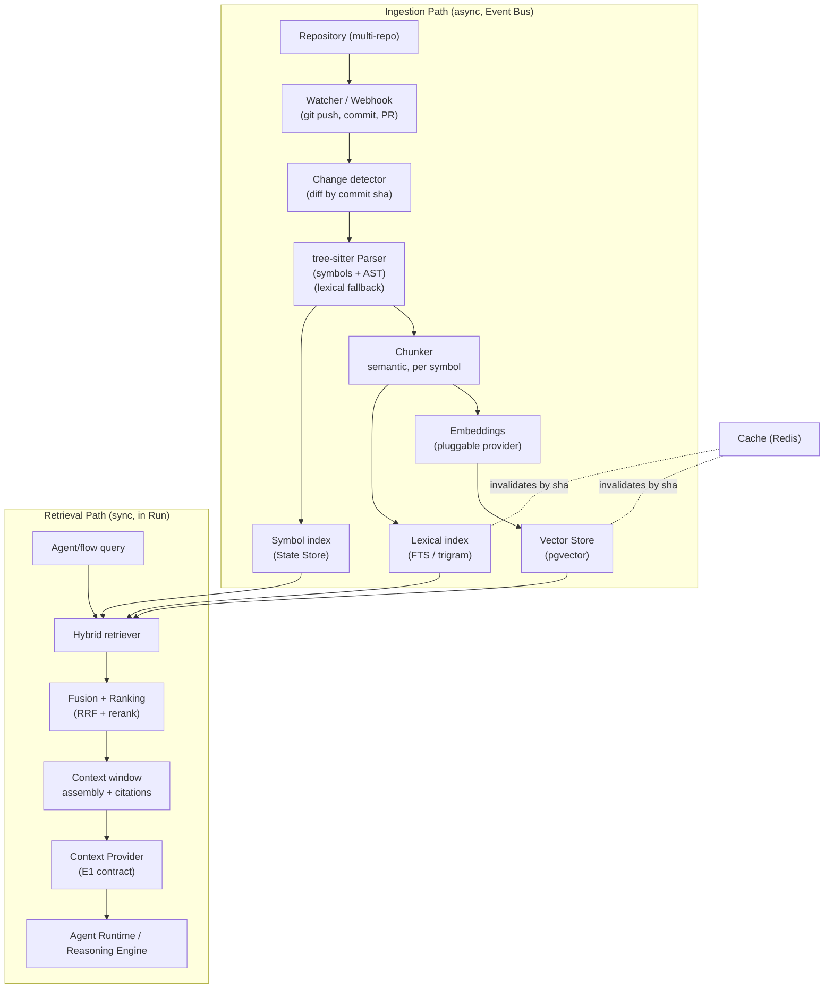
```mermaid
flowchart TB
    subgraph Ingestao["Ingestion Path (async, Event Bus)"]
        SRC["Repository (multi-repo)"] --> WATCH["Watcher / Webhook\n(git push, commit, PR)"]
        WATCH --> DIFF["Change detector\n(diff by commit sha)"]
        DIFF --> PARSE["tree-sitter Parser\n(symbols + AST)\n(lexical fallback)"]
        PARSE --> CHUNK["Chunker\nsemantic, per symbol"]
        CHUNK --> EMB["Embeddings\n(pluggable provider)"]
        EMB --> VEC["Vector Store\n(pgvector)"]
        PARSE --> SYM["Symbol index\n(State Store)"]
        CHUNK --> LEX["Lexical index\n(FTS / trigram)"]
    end

    subgraph Recuperacao["Retrieval Path (sync, in Run)"]
        Q["Agent/flow query"] --> RET["Hybrid retriever"]
        LEX --> RET
        VEC --> RET
        SYM --> RET
        RET --> FUSE["Fusion + Ranking\n(RRF + rerank)"]
        FUSE --> WIN["Context window\nassembly + citations"]
        WIN --> CP["Context Provider\n(E1 contract)"]
        CP --> AGT["Agent Runtime / Reasoning Engine"]
    end

    CACHE["Cache (Redis)"] -. invalidates by sha .- VEC
    CACHE -. invalidates by sha .- LEX
```

### 11.2 Incremental indexing

Indexing is **incremental and idempotent**, anchored to the `commit sha` of
each repository:

- **Trigger**: `repo.commit.pushed` / `repo.pr.updated` events on the Event
  Bus, periodic scan (cron), or on-demand indexing on the first query to a
  cold repo.
- **Delta**: only files changed/added/removed between the indexed sha and
  the target sha are reprocessed; renames preserve symbol identity when
  possible. This keeps the reindexing cost proportional to the diff, not to
  the size of the repository.
- **Unit of work**: one job per file (queued in **Redis**), allowing
  horizontal parallelism and resumption after failure (determinism/replay).
- **Filters**: reuses the list of ignored directories and preferred
  extensions already present in `RepositoryIntelligenceService` (e.g.:
  ignores `.git`, `node_modules`, `.venv`), avoiding indexing artifacts and
  dependencies.
- **Index versioning**: each index row carries `(tenant_id,
  repo_id, commit_sha, file_path, chunk_id, embedding_model, schema_version)`,
  which allows coexistence of versions during rebuilds and safe rollback.

### 11.3 tree-sitter, symbols and chunking

Parsing uses **tree-sitter** to produce an AST per language and extract
symbols (functions, classes, methods, imports), keeping the contract already
defined in `TreeSitterProvider.extract_symbols(code, language)` and its
**graceful degradation** to the `LexicalProvider` (regex) when the native
library is not available — consistent with local-first mode.

**Chunking is semantic**, not by fixed character window:

- Each top-level symbol (function/class/method) becomes a candidate chunk,
  preserving syntactic boundaries and avoiding cutting bodies in the middle.
- Large chunks are subdivided respecting blocks; small neighboring chunks
  may be coalesced up to a token ceiling.
- Each chunk retains structural metadata: `symbol_name`, `symbol_kind`,
  `language`, `start_line`/`end_line`, `parent_symbol`, docstring/header
  comment, and the file path. This metadata feeds ranking and citation.
- Files without a parser (config, markdown) fall back to chunking by
  sections/headings.

### 11.4 Embeddings and Vector Store (pgvector)

- **Embeddings** are produced by a **pluggable** provider (contract of the
  Plugin Core/E1), with a deterministic "stub" provider in local mode and
  real providers (e.g.: code models) in production. The `embedding_model` is
  recorded per chunk for invalidation when switching models.
- **Vector Store**: **pgvector** on top of PostgreSQL (OSS-first decision;
  no dedicated vector database before pgvector). **HNSW** index (or
  IVFFlat as fallback) with cosine metric; dimension fixed per model.
- **Multi-tenant**: filters by `tenant_id` and `repo_id` are applied in the
  vector query itself (predicates + partial index), guaranteeing data
  isolation between tenants.

### 11.5 Hybrid retrieval, ranking and context windows

Retrieval combines three signals and fuses the results:

1. **Lexical**: full-text search / trigram over content and symbol names
   (evolution of the term-based ranking of `_rank_files`, which already
   scores by filename/path/directory).
2. **Vector**: nearest-neighbor search in pgvector over the chunk
   embeddings.
3. **Structural/symbol**: direct matching by symbol name and graph
   neighborhood (callers/callees, imports) to bring in related context.

**Ranking** fuses the rankings via **Reciprocal Rank Fusion (RRF)** and
applies an optional **rerank** (pluggable cross-encoder) over the top-k,
with deterministic boosts for commit recency, path proximity to the file
being edited, and symbol type — preserving explainability (every result
carries `reasons`, as `RepositoryFileMatch` already does).

**Context window assembly** respects the agent's token **Budget** (E4/Reasoning
and Agent Runtime): it selects chunks up to the ceiling, deduplicates
overlaps, and produces structured **citations** — each delivered excerpt
comes with `{repo_id, commit_sha, file_path, start_line, end_line,
symbol_name, score, retriever}` — for traceability, audit, and to allow the
UI to link the answer to the exact source code.

### 11.6 Context Provider contract (extension point of E1)

A **Context Provider** is a pluggable extension that provides context to
agents/flows. The `Context/RAG Service` embeds the native code provider, but
any plugin (session memory, external docs, tickets) can implement the same
typed, stable (SemVer) contract, inhabiting the extension point defined in
**E1** and resolved by the **Plugin Host** with explicit permissions.

```python
# Stable contract (hostApi: ">=2.0 <3.0"), living in the extension
# point "context.provider" of the Plugin & SDK Core (E1).

class ContextQuery(TypedDict):
    text: str                       # natural language query / terms
    tenant_id: str
    repo_ids: list[str]             # multi-repo: search scope
    commit_sha: NotRequired[str]    # version anchor (default: indexed HEAD)
    token_budget: int               # ceiling for the context window
    filters: NotRequired[dict]      # language, path glob, symbol_kind...
    top_k: NotRequired[int]

class Citation(TypedDict):
    repo_id: str
    commit_sha: str
    file_path: str
    start_line: int
    end_line: int
    symbol_name: NotRequired[str]

class ContextChunk(TypedDict):
    content: str
    score: float
    retriever: str                  # "lexical" | "vector" | "symbol" | "fused"
    reasons: list[str]              # ranking explainability
    citation: Citation

class ContextResult(TypedDict):
    chunks: list[ContextChunk]      # already sorted and within token_budget
    matched_terms: list[str]
    total_candidates: int
    truncated: bool                 # True if the budget truncated results

class ContextProvider(Protocol):
    id: str                         # e.g.: "autodev/context-code"
    version: str                    # SemVer

    def capabilities(self) -> list[str]: ...        # e.g. ["code", "symbols"]
    def retrieve(self, query: ContextQuery) -> ContextResult: ...
    def health(self) -> dict: ...                   # readiness / cold index
```

The core merges results from multiple active providers (RRF fusion across
providers), respecting the same global `token_budget` and maintaining the
provenance (`retriever`/`reasons`) of each chunk.

### 11.7 Cache, invalidation and multi-repo

- **Cache (Redis)**: retrieval results and query embeddings are cached with
  key `(tenant_id, repo_ids, commit_sha, hash(query),
  embedding_model)`. Since the key includes the sha, the cache is naturally
  correct per version.
- **Invalidation**: a newly indexed commit publishes `repo.index.updated` on
  the Event Bus; cache entries tied to the old sha expire/are evicted.
  Changing `embedding_model` or `schema_version` invalidates the
  corresponding index partition and forces an incremental rebuild.
- **Multi-repo**: queries accept a list of `repo_ids`; fusion occurs between
  repositories with score normalization, and citations always carry
  `repo_id` to disambiguate. Isolation by `tenant_id` is applied at all
  layers (lexical index, vector, and cache).

### 11.8 Retrieval quality criteria (metrics)

Retrieval quality is measured continuously and feeds back into the system,
integrating with the **Evaluation Service** (E5/E12):

- **Recall@k / Precision@k**: proportion of relevant chunks retrieved in the
  top-k against a labeled dataset of queries→files/symbols.
- **MRR / nDCG@k**: ordering quality of the fused ranking.
- **Context precision / recall (RAG)**: fraction of the delivered window
  that is effectively useful, and coverage of the required context.
- **Groundedness / verifiable citation**: every claim by an agent that uses
  context must be traceable to a valid `Citation` (lines existing in the
  `commit_sha`).
- **Retrieval latency**: p95 of `retrieve` on the Run's path.
- **Index freshness (index lag)**: delay between `commit.pushed` and
  `index.updated`.

### 11.9 Functional criteria

- Index repositories **incrementally** by `commit_sha`, reprocessing only
  the diff.
- Extract symbols via **tree-sitter** with a guaranteed **lexical fallback**
  when the native lib is absent (`TreeSitterProvider` contract).
- Support **semantic chunking** by symbol with structural metadata.
- Perform **hybrid retrieval** (lexical + vector + symbol) with RRF fusion
  and optional rerank.
- Respect the **token budget** when assembling the window and return
  structured, verifiable **citations**.
- Expose the pluggable **Context Provider** contract (E1), with multiple
  active providers fused by the core.
- Support **multi-tenant and multi-repo** queries with strict isolation.
- Operate **local-first** (SQLite + lexical fallback) and scale to
  **PostgreSQL + pgvector** without rewriting.

### 11.10 Non-functional criteria

- **Latency**: p95 of `retrieve` (top-k, without rerank) < 300 ms aligned
  with the Control Plane target; start of streaming for a Run that depends
  on context < 1 s.
- **Freshness**: index lag p95 < 60 s after `repo.commit.pushed` for hot
  repositories.
- **Scale**: horizontally scalable indexing via Redis jobs; support large
  repositories with reindexing cost proportional to the diff.
- **Isolation and security**: `tenant_id`/`repo_id` filters mandatory;
  plugin providers execute with explicit permissions under the Plugin Host;
  no access to a repository outside the tenant's authorized scope.
- **Determinism/replay**: given the same query and `commit_sha`, the result
  is reproducible (deterministic RRF and boosts; versioned embeddings).
- **Observability**: every retrieval emits a trace (candidates, scores,
  `reasons`, provider) and metrics (§11.8) via OpenTelemetry (E11).
- **Reliability**: index reconstructible from the source repository; loss of
  the index does not imply loss of durable data (RPO/RTO inherited from
  E8/E11).
- **Stable contracts**: `ContextProvider` versioned by SemVer with mandatory
  contract tests (E12) for the extension point.

### 11.11 Relationship with epics and components

This section details **E7 — Context & RAG** and the canonical
**Context/RAG Service** component. It depends on **E1** (Context Provider
extension point and contract, Plugin Host), **E8** (pgvector Vector Store,
State Store, multi-tenant model), **Redis** (cache/queues), and the
**Event Bus** (indexing and invalidation triggers). It serves the
**Agent Runtime** and the **Reasoning Engine** (E2/E4) respecting their
Budgets, and feeds/is measured by the **Evaluation Service** (E5/E12)
through retrieval quality metrics.


---

## 12. Patches, Execution and Validation

This section specifies the code-change backbone of the AutoDev Architect
v2.0 platform: how an agent turns an intent into a **Patch** (unified
diff), how that patch is applied under path guarding and dry-run, how
verification commands run in the **Execution Sandbox** (hardened Docker),
and how the **Validation Gates** decide, in an auditable way, whether the
result is accepted. The platform's canonical engineering cycle — plan →
code → **apply patch → validate in sandbox** → evaluate — takes concrete
form here.

The subsystem is governed by the brief's principles: **isolation and
least privilege** (P5), **governed security and cost** (P11),
**determinism and replay** (P7), and **native observability** (P6). It
relies directly on **E8 — Persistence & Data** (durable state of
jobs/results and the **Artifact Store**/MinIO) and on **E11 —
Observability, Security & Multi-tenant** (RBAC, quotas, traces, and the
fail-closed security posture). The security improvements already delivered
in v1 — described in `docs/security.md` — are the starting point and remain
valid in v2.0.

### 12.1 Flow overview

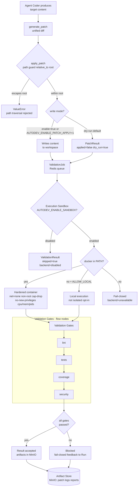
```mermaid
flowchart TD
    A[Agent Coder produces\ntarget content] --> B[generate_patch\nunified diff]
    B --> C{apply_patch\npath guard relative_to root}
    C -->|escapes root| X[ValueError\npath traversal rejected]
    C -->|within root| D{write mode?}
    D -->|dry-run default| E[PatchResult\napplied=false dry_run=true]
    D -->|enable=true or\nAUTODEV_ENABLE_PATCH_APPLY=1| F[Writes content\nto workspace]
    F --> G[ValidationJob\nRedis queue]
    E --> G
    G --> H{Execution Sandbox\nAUTODEV_ENABLE_SANDBOX?}
    H -->|disabled| S[ValidationResult\nskipped=true backend=disabled]
    H -->|enabled| I{docker in PATH?}
    I -->|yes| J[Hardened container\nnet=none non-root cap-drop\nno-new-privileges cpu/mem/pids]
    I -->|no + ALLOW_LOCAL| K[Local execution\nnot isolated opt-in]
    I -->|no| L[Fail-closed\nbackend=unavailable]
    J --> M[Validation Gates]
    K --> M
    subgraph Gates [Validation Gates - flow nodes]
        M --> N[lint]
        N --> O[tests]
        O --> P[coverage]
        P --> Q[security]
    end
    Q --> R{all gates\npassed?}
    R -->|yes| T[Result accepted\nartifacts in MinIO]
    R -->|no| U[Blocked\nfail-closed feedback to Run]
    T --> V[(Artifact Store\nMinIO: patch logs reports)]
    U --> V
```

The flow is modeled as **Flow Nodes** in the **Orchestration Engine**: patch
generation and application, submission of the `ValidationJob` to the
Sandbox, and each gate are discrete nodes, with checkpointing and retries.
This makes the pipeline reproducible from persisted state (replay) and
observable by default (every transition emits events and traces).

### 12.2 Patch-based flow

The platform never lets an agent write files directly. Every code change is
mediated by a **Patch** — a unified diff — which provides reviewability,
audit, and the possibility of dry-run before any side effect on the
filesystem.

**Diff generation.** From the original content and the content proposed by
the agent, the engine produces a unified diff (`fromfile=a/<path>`,
`tofile=b/<path>`). When there is no change, the diff is the empty string.
The reference implementation is `backend/patches/engine.py::generate_patch`.

**Application with path guard.** Application resolves the target path
against a `root` and requires that it remain inside it (`Path.resolve()` +
`relative_to(root)`); any path that escapes the root is rejected with
`ValueError` (path-traversal guard). This is the same filesystem
confinement described in `docs/security.md` and already in effect in v1.

**Dry-run by default (write fail-closed).** Writing to disk is **disabled
by default**. It only occurs when explicitly enabled (`enable=True`) or via
the environment variable `AUTODEV_ENABLE_PATCH_APPLY=1`. In default mode,
the result is a `PatchResult` with `applied=false` and `dry_run=true`,
allowing human or automatic review before the change takes effect.
Reference: `backend/patches/engine.py::apply_patch`.

Patch contract (summary):

| Field (`Patch`) | Description |
| --- | --- |
| `path` | logical path used in the diff header and as the target relative to the root |
| `original` | original content |
| `updated` | proposed content |
| `diff` | unified diff (empty when there is no change) |

| Field (`PatchResult`) | Description |
| --- | --- |
| `path` | target path |
| `applied` | `true` if written to disk |
| `dry_run` | `true` when the write was skipped |
| `message` | human-readable description of what happened |

### 12.3 Hardened Execution Sandbox

The **Execution Sandbox** runs verification commands (lint, tests, etc.) in
isolation. The reference implementation is
`backend/validation/sandbox.py::SandboxRunner`.

**Execution gate.** Execution is **disabled by default**; it only runs when
`AUTODEV_ENABLE_SANDBOX` is set. Without the flag, `run` returns a
`ValidationResult` with `skipped=true` and `backend="disabled"` — no
subprocess is created.

**Command allowlist.** `SandboxRunner` validates the basename of
`command[0]` against an allowlist (default: `pytest`, `ruff`, `npm`,
`python`, `python3`). A command outside the list returns
`backend="blocked"`. Security caveat (see `docs/security.md`): interpreters
on the allowlist can still execute arbitrary code — **container isolation,
not the allowlist, is the real security boundary**.

**Hardened Docker container.** When `docker` is on the PATH, the job runs
in a container with the following protections (least privilege, defense in
depth):

- **no network by default** — `--network=none` (re-enablable per
  deployment via `AUTODEV_SANDBOX_DOCKER_NETWORK` for legitimate workloads,
  e.g.: installing deps);
- **non-root** — `--user=65534:65534` (`nobody` user);
- **zeroed capabilities** — `--cap-drop=ALL`;
- **no privilege escalation** — `--security-opt=no-new-privileges`;
- **resource limits** — `--pids-limit=256`, `--memory=512m`, `--cpus=1`;
- fixed workdir `/workspace` on the `python:3.11-slim` image.

**Fail-closed policy without Docker.** If Docker is not available, the
runner **fails closed**: it returns `backend="unavailable"` and
`skipped=true`, without executing anything. Direct execution on the host
(without isolation) only occurs when the operator explicitly opts in via
`AUTODEV_SANDBOX_ALLOW_LOCAL=1` — the default deployment can never be
induced to run commands on the host without a sandbox. This gives concrete
form to the global non-functional goal "sandbox with no network by default"
and the least-privilege principle (E11).

### 12.4 Contracts: ValidationJob and ValidationResult

The contracts are typed and stable (SemVer; `schemaVersion` per §7 of the
brief) and travel between the **Control Plane** (which enqueues jobs) and
the **Data Plane** (Sandbox + Gates). They are persisted in **E8** and
queued via Redis.

`ValidationJob` (input):

| Field | Type | Description |
| --- | --- | --- |
| `job_id` | `str` | unique job identifier (for correlation/replay) |
| `command` | `list[str]` | command to execute; `command[0]` subject to the allowlist |
| `cwd` | `str \| None` | working directory (local execution) |

`ValidationResult` (output):

| Field | Type | Description |
| --- | --- | --- |
| `job_id` | `str` | correlates with the `ValidationJob` |
| `returncode` | `int` | exit code (`0` = success) |
| `stdout` | `str` | captured standard output |
| `stderr` | `str` | standard error / block message |
| `backend` | `str` | `docker` \| `local` \| `disabled` \| `blocked` \| `unavailable` |
| `skipped` | `bool` | `true` when no subprocess was executed |

The `backend` field is the audit discriminator: it makes explicit, in each
result, whether there was real isolation (`docker`), opt-in non-isolated
execution (`local`), or a fail-closed/gate condition
(`disabled`/`blocked`/`unavailable`).
### 12.5 Validation Gates

The **Validation Gates** are quality gates chained as **Flow Nodes** in the
Orchestration Engine. Each gate consumes one or more `ValidationResult` and
produces a verdict. A result is only **accepted** when all applicable gates
pass; otherwise the pipeline **fails closed** and feeds back into the **Run**
with the reason (feedback for replanning by the agent).

Canonical gates:

- **lint** — style and static errors (e.g. `ruff`).
- **tests** — automated suite (e.g. `pytest`, `npm test`).
- **coverage** — minimum coverage; aligned with the global non-functional
  targets (core ≥ 85% of lines; contract tests required for extension points).
- **security** — security checks (SAST/dependencies/secrets), consistent with
  the follow-ups in `docs/security.md`.

Being declarative flow nodes, gates are configurable per flow/tenant and
versioned — allowing distinct policies (e.g. a stricter coverage gate in the
core than in plugins). This connects the subsystem to **E12 — Quality &
Evals** (CI quality gates) without rewriting the pipeline.

### 12.6 Artifacts (Artifact Store / MinIO)

All material produced by the pipeline is persisted in the **Artifact Store**
(MinIO, S3-compatible): the **patch** (diff), the execution logs (stdout /
stderr per job), the gate reports (lint, coverage, security), and any
resulting builds. Artifacts are referenced by the corresponding `job_id`/`Run`,
which gives end-to-end traceability and enables **replay** and audit
(E8/E11). Lightweight metadata and pointers live in the **State Store**
(PostgreSQL); the heavy content lives in MinIO.

### 12.7 Real Execution of Plans and Tasks (Real Task Executor)

*(New content, authored in English — see E14 in §18.7.8 and
`docs/v2_platform/phases/e14_real_execution_governance.md`.)*

Today, `execute_plan` (`backend/orchestrator/service.py`) is a **simulation**: it
iterates over the derived `ExecutionTask`s and marks each `RunStep` as
`COMPLETED` without performing any real action — no file is created or edited,
no patch is applied, no command is run. **E14** replaces this with a real,
policy-governed **Task Executor**:

- **`ExecutionAction`** — the unit of real work: `create_file`, `edit_file`,
  `apply_patch`, `run_command`, or `run_validation`.
- **`ExecutionResult`** — the outcome: `stdout`, `stderr`, `exit_code`, `diff`,
  and any produced `artifacts`.
- The executor maps a Flow/plan step (an `ExecutionTask` or a dedicated
  `execute` Flow node, §7) to one or more `ExecutionAction`s and dispatches each
  to the runner appropriate for its category (§12.9's Sandbox-Backed Runners).
- Every result is persisted linked to `run_id`/`step_id`/`task_id` and emitted as
  `execution.action.started` / `.completed` / `.failed` events (naming
  convention, §7), giving the same observability/replay guarantees as any other
  Flow step.

This is additive to the Orchestration Engine (§7/E3): the executor is invoked
*from* a Flow node, not a parallel pipeline.

### 12.8 Permission and Policy Engine — Execution Modes (Approval / Auto / Hybrid)

*(New content, authored in English.)*

Every `ExecutionAction` is mediated by an explicit **permission/policy layer**
before dispatch, covering shell commands, filesystem writes, patch application,
network access, secrets reads, and validation runs. Default is **deny**
(least privilege, fail-closed, per Principle 2.5): with no matching policy
entry, an action is denied. Policies are allow/deny lists scoped to
project/repository/session.

Three execution modes govern how the policy result is applied:

- **Approval** — every sensitive action pauses for an explicit human decision,
  reusing the human-in-the-loop pause node (§7/E3-S4).
- **Auto** — actions already permitted by the active policy run automatically;
  anything not covered is denied (fail-closed), never silently allowed.
- **Hybrid** — permitted actions run automatically; for anything not covered,
  the operator is asked with three options: **(1)** run once only, **(2)** run
  and persist a dynamic permission for similar actions (e.g. a command-pattern
  rule), **(3)** deny. Example prompt: *"Run the command `sqlite -c "CREATE
  ..."`? 1) Yes, just this once. 2) Yes, and don't ask again for commands like
  `sqlite *`. 3) No."*

Dynamic permissions granted via option (2) are **persisted, independently
reviewable, and revocable** (Control Plane API and Web UX, §12.9/E14-S5), and
every decision — allowed, denied, or pending, with actor, timestamp, and reason
— is written to an audit trail.

### 12.9 `autodev` CLI and Governed Interactive Shell

*(New content, authored in English.)*

Per Principle 2.13 (API-first), the CLI is a client of the Control Plane API
`/v2` — it never touches the State Store, Redis, or MinIO directly, exactly
like the Web UI.

- `autodev` is installed as a packaged console-script entry point. With no
  arguments it starts the local web experience and opens a browser when
  possible.
- Flags: `--shell` (interactive REPL — an alternative surface to the Web UI,
  not a replacement), `--command "<text>"` (one-shot, non-interactive
  execution of a described task), `--mode approval|auto|hybrid` (selects the
  execution mode from §12.8), and a subcommand to configure/list/revoke
  persisted dynamic permissions.
- The interactive shell runs a conversational loop that executes actions under
  the active mode, streams logs (stdout/stderr/exit code) as they happen, shows
  condensed diffs/results, and prompts for approval identically to the Web
  UX — same policy engine, same API, same audit trail.
- Installation stays self-hosted-first: no mandatory paid-service dependency,
  per Principle 2.9 (OSS-first).

---

### 12.10 Acceptance Criteria

**Functional**

- `generate_patch` produces a correct unified diff; empty diff when there is
  no change.
- `apply_patch` rejects paths that escape the `root` (path traversal) and is
  dry-run by default; writes only with `enable=True` or
  `AUTODEV_ENABLE_PATCH_APPLY=1`.
- Without `AUTODEV_ENABLE_SANDBOX`, `run` returns a `skipped`/`disabled`
  result.
- With Docker available and sandbox enabled, the job runs in the hardened
  container and returns `backend="docker"`.
- Each gate (lint/tests/coverage/security) produces a verdict; a result is
  only accepted with all applicable gates passed.
- Patch, logs, and reports are persisted in the Artifact Store and
  correlatable to the `job_id`/Run.

**Non-functional and security**

- **Fail-closed by default**: patch writing, sandbox execution, and gate
  verdict assume the safe state in the absence of explicit opt-in.
- **Sandbox with no network by default** and **non-root** execution with
  `cap-drop=ALL`, `no-new-privileges`, and cpu/mem/pids limits (global
  non-functional target; E11).
- **Least privilege**: without Docker, no execution occurs unless
  `AUTODEV_SANDBOX_ALLOW_LOCAL=1` is set.
- **Filesystem confinement**: no writes outside the `root`.
- **Observability/replay**: `job_id` correlates job, result, artifacts, and
  events; `backend` audits the execution mode (P6/P7).
- **Cost governance** (E11): validation jobs respect budgets/quotas per
  run/tenant.

**Residual risks** (inherited from `docs/security.md`, follow-ups):
allowlisted interpreters execute arbitrary code (isolation is the real
boundary); container images use mutable tags (`python:3.11-slim`) — consider
pinning by digest; dependencies without a lockfile — consider pinning for
auditable builds.

**New in E14 (functional)**

- An `ExecutionAction` of type file/patch/command produces a real, observable
  result (file written, patch applied, command run with captured `exit_code`);
  an interrupted execution preserves partial state.
- An action outside the active policy is denied by default; under hybrid mode,
  choosing "always for this pattern" persists a reusable dynamic permission
  with no re-prompt for equivalent future actions.
- `autodev --shell` and `autodev --command` exercise the same policy engine and
  produce the same audit trail as the Web UX.

**New in E14 (non-functional and security)**

- Every `ExecutionAction` is audited (actor, action, decision, result) — no
  silent action outside the trace.
- Command and patch runners route exclusively through the hardened Execution
  Sandbox (§12.3); the patch runner never falls back to arbitrary command
  execution.
- The CLI and interactive shell make zero direct calls to Postgres/Redis/MinIO
  — API-first (§2.13) applies to this surface too.


---

## 13. Persistence, State and Data Model

This section defines how AutoDev Architect v2.0 stores durable state,
organizes its multi-tenant data model, versions migrations, and ensures
recoverability. It materializes **Epic E8 — Persistence & Data** and depends
on the security/observability foundations established by **E0** and consumed
by **E11**.

### 13.1 Persistence Principles

The design follows four invariant rules, inherited from the current data
model direction and promoted to a v2 contract:

1. **The durable source of truth lives in the State Store (PostgreSQL).**
   Sessions, runs, steps, and all business entities have their canonical
   source in the relational database.
2. **Artifacts live in the Artifact Store (MinIO)**, referenced by metadata
   rows in the State Store (never large blobs in the database).
3. **Redis holds only ephemeral state** — queues, cache, and locks — never the
   system's source of truth. Losing Redis degrades throughput, not integrity.
4. **Embeddings remain queryable via pgvector** within PostgreSQL, until scale
   justifies a dedicated vector service (OSS-first decision).

The platform is **local-first with progressive upgrade**: the same base runs
on SQLite on a laptop (zero external dependencies) and scales to multi-tenant
production (PostgreSQL + pgvector, Redis, MinIO) without rewriting the domain
layer. The core repositories depend on **repository protocols**
(SessionRepository, RunRepository, MessageRepository, PlanRepository, etc.),
and the adapters (`SQLiteStore`, `PostgresStore`) implement those protocols.

### 13.2 State Store: PostgreSQL (production) and SQLite (local)

| Aspect | SQLite (local mode) | PostgreSQL (production, default) |
|---|---|---|
| Use | dev, demos, single-user | multi-tenant, high concurrency |
| Concurrency | serialized writes | MVCC, concurrent writes |
| Multi-tenant | implicit single tenant | `tenant_id` + RLS |
| Vectors | no (degraded RAG) | pgvector |
| JSON | `json`/text | `jsonb` + GIN indexes |
| Migrations | MigrationRunner (namespaced) | same migrations, PG dialect |

The current state of the repository already provides the `SQLiteStore` with a
namespaced `MigrationRunner` (`store`, `plan_store`) and a `PostgresStore` as a
scaffold (`get_store()` routes by `DATABASE_URL`). v2 completes the
`PostgresStore` as the default production adapter, keeping SQLite as a
supported local path. Selection is made exclusively by the connection URL,
preserving the already existing `get_store()` contract.

### 13.3 Data Model (ER Diagram)

The v2 canonical model introduces platform entities (`tenant`, `agent`,
`plugin`, `skill`, `flow`, `flow_version`, `eval`, `eval_result`) in addition
to the already existing operational entities (`session`, `run`, `step`,
`artifact`) and the `event`/audit entity. All business data tables carry
`tenant_id`.

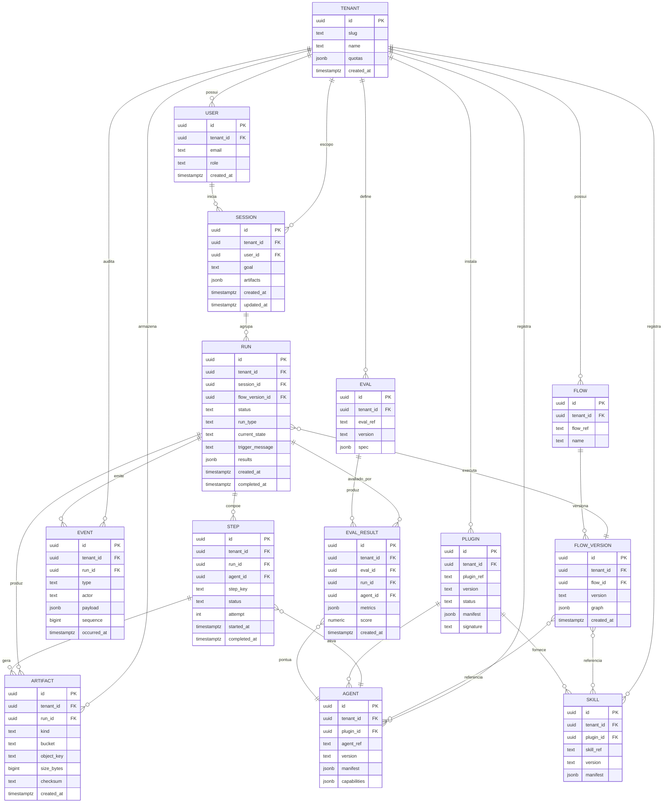
```mermaid
erDiagram
    TENANT ||--o{ USER : possui
    TENANT ||--o{ SESSION : escopo
    TENANT ||--o{ AGENT : registra
    TENANT ||--o{ PLUGIN : instala
    TENANT ||--o{ SKILL : registra
    TENANT ||--o{ FLOW : possui
    TENANT ||--o{ EVAL : define
    TENANT ||--o{ ARTIFACT : armazena
    TENANT ||--o{ EVENT : audita

    USER ||--o{ SESSION : inicia
    SESSION ||--o{ RUN : agrupa
    RUN ||--o{ STEP : compoe
    RUN }o--|| FLOW_VERSION : executa
    RUN ||--o{ ARTIFACT : produz
    RUN ||--o{ EVENT : emite
    RUN ||--o{ EVAL_RESULT : avaliado_por

    FLOW ||--o{ FLOW_VERSION : versiona
    FLOW_VERSION }o--o{ AGENT : referencia
    FLOW_VERSION }o--o{ SKILL : referencia

    STEP }o--|| AGENT : ativa
    STEP ||--o{ ARTIFACT : gera

    PLUGIN ||--o{ AGENT : fornece
    PLUGIN ||--o{ SKILL : fornece

    EVAL ||--o{ EVAL_RESULT : produz
    EVAL_RESULT }o--|| AGENT : pontua

    TENANT {
        uuid id PK
        text slug
        text name
        jsonb quotas
        timestamptz created_at
    }
    USER {
        uuid id PK
        uuid tenant_id FK
        text email
        text role
        timestamptz created_at
    }
    SESSION {
        uuid id PK
        uuid tenant_id FK
        uuid user_id FK
        text goal
        jsonb artifacts
        timestamptz created_at
        timestamptz updated_at
    }
    RUN {
        uuid id PK
        uuid tenant_id FK
        uuid session_id FK
        uuid flow_version_id FK
        text status
        text run_type
        text current_state
        text trigger_message
        jsonb results
        timestamptz created_at
        timestamptz completed_at
    }
    STEP {
        uuid id PK
        uuid tenant_id FK
        uuid run_id FK
        uuid agent_id FK
        text step_key
        text status
        int attempt
        timestamptz started_at
        timestamptz completed_at
    }
    AGENT {
        uuid id PK
        uuid tenant_id FK
        uuid plugin_id FK
        text agent_ref
        text version
        jsonb manifest
        jsonb capabilities
    }
    PLUGIN {
        uuid id PK
        uuid tenant_id FK
        text plugin_ref
        text version
        text status
        jsonb manifest
        text signature
    }
    SKILL {
        uuid id PK
        uuid tenant_id FK
        uuid plugin_id FK
        text skill_ref
        text version
        jsonb manifest
    }
    FLOW {
        uuid id PK
        uuid tenant_id FK
        text flow_ref
        text name
    }
    FLOW_VERSION {
        uuid id PK
        uuid tenant_id FK
        uuid flow_id FK
        text version
        jsonb graph
        timestamptz created_at
    }
    EVAL {
        uuid id PK
        uuid tenant_id FK
        text eval_ref
        text version
        jsonb spec
    }
    EVAL_RESULT {
        uuid id PK
        uuid tenant_id FK
        uuid eval_id FK
        uuid run_id FK
        uuid agent_id FK
        jsonb metrics
        numeric score
        timestamptz created_at
    }
    ARTIFACT {
        uuid id PK
        uuid tenant_id FK
        uuid run_id FK
        text kind
        text bucket
        text object_key
        bigint size_bytes
        text checksum
        timestamptz created_at
    }
    EVENT {
        uuid id PK
        uuid tenant_id FK
        uuid run_id FK
        text type
        text actor
        jsonb payload
        bigint sequence
        timestamptz occurred_at
    }
```

Modeling notes:

- **`flow` vs `flow_version`**: the flow is the stable identity
  (`namespace/name`); each change generates an immutable `flow_version`
  (versioned declarative graph). A `run` always points to a concrete
  `flow_version`, guaranteeing **determinism and replay** (Principle 7 of the
  brief).
- **`agent`/`skill`/`plugin`**: agents and skills are provided by plugins
  (relation `plugin ||--o{ agent`); ids follow `namespace/name` in kebab-case
  and SemVer versioning, per the brief's conventions. `manifest` holds the
  full declarative descriptor in `jsonb`.
- **`eval` / `eval_result`**: the evaluation spec is versioned; each execution
  produces an `eval_result` linked to `run` and to the evaluated `agent`,
  closing the feedback loop consumed by **E5** (Router & Selector).
- **`artifact`**: metadata only (bucket, object key, checksum, size); the
  content resides in MinIO.
- **`event`**: append-only record with a monotonic `sequence` per tenant/run,
  the basis of the event store/audit (see 13.6).
### 13.4 Redis: queue, cache and locks

Redis is the ephemeral coordination substrate of the **Data Plane**:

- **Queues**: run queue, indexing queue (RAG), async eval jobs and
  plugin publishing.
- **Cache**: retrieval results, registry catalogs, hot read
  responses from the Control Plane.
- **Distributed locks**: lock per workspace/repository (prevents concurrent
  indexing or patch application) and worker leases.
- **Rate limiting / short quotas**: per-tenant counters aligned with **E11**
  quotas.

Rule: any data in Redis must be **reconstructible** from PostgreSQL.
No business state transition is confirmed in Redis alone.

### 13.5 pgvector (RAG) and MinIO (artifacts)

- **pgvector**: code/document embeddings live in tables with a
  `vector` column, filtered by `tenant_id` and indexed by HNSW/IVFFlat. This keeps
  hybrid retrieval (lexical + vector) within a single relational
  transaction, avoiding a dedicated vector service until scale requires it —
  detailed in the Context/RAG Service (**E7**). In local SQLite mode, the vector
  path is degraded (lexical retrieval only).
- **MinIO** (S3-compatible): `patch-artifacts`, `validation-artifacts`,
  `run-exports` and `logs` buckets. Each object is referenced by a row in `artifact`
  with `bucket`, `object_key`, `checksum` and `size_bytes`, enabling
  integrity verification and orphan garbage collection.

### 13.6 Event store and audit

The `event` table is an **append-only log** that simultaneously serves as the event
store (for replay/observability) and audit trail (for security and
compliance). Each relevant transition emits an event with canonical
`dominio.entidade.acao` naming in the past tense (e.g.: `run.step.completed`,
`plugin.installed`, `flow.run.started`), consistent with the event catalog
of **E9** and the Event Bus.

Minimum required events (inherited from current guidance): `run.created`,
`plan.generated`, `approval.requested`, `approval.granted`/`approval.rejected`,
`patch.created`, `patch.approved`/`patch.rejected`, `validation.started`/
`validation.completed`, `run.completed`/`run.failed`/`run.cancelled`.

Properties: events are **immutable**, ordered by monotonic `sequence` per
run, carry `actor` (user, agent or system) and a structured `payload`.
The Event Bus publishes asynchronously; the `event` in PostgreSQL is the
durable source (outbox pattern — publication never precedes the state commit).

### 13.7 Versioned migrations

v2 evolves the already existing `MigrationRunner` (today applying
`STORE_MIGRATIONS` and `PLAN_STORE_MIGRATIONS` in a namespaced way in SQLite) into
a unified runner that:

- maintains **versioned, ordered and idempotent** migrations, with a
  version-control table per namespace;
- supports both dialects (SQLite and PostgreSQL) from a single set
  of definitions, with explicit divergences when necessary (e.g.: `jsonb`,
  `vector`, RLS);
- requires migrations to be **reversible when possible** (down migrations) and
  records each application as an audit event;
- runs automatically at startup in dev and via an explicit, gated step in
  production (never an implicit destructive migration).

### 13.8 Multi-tenant and data isolation

**Recommended decision: `tenant_id` column + PostgreSQL Row-Level Security
(RLS) as the default**, instead of schema-per-tenant.

| Criterion | `tenant_id` column + RLS (recommended) | Schema per tenant |
|---|---|---|
| Density / cost | high (thousands of tenants) | low (per-schema overhead) |
| Migrations | once, for all | N times (one per schema) |
| Isolation | strong via RLS + `app.tenant_id` | physical, stronger |
| Operation | simple | complex at scale |
| Noisy-neighbor | mitigated by quotas (E11) | isolated by design |

Rationale: `tenant_id` + RLS offers the best balance between isolation and
operability for a self-hostable OSS platform with many tenants, and avoids
the migration explosion of schema-per-tenant. Every business table includes
`tenant_id` (NOT NULL, FK to `tenant`), with RLS policies that filter by an
`app.tenant_id` session variable set by the Control Plane after
authentication/RBAC. Composite indexes start with `tenant_id`. Schema-per-tenant
remains a documented option for customers that require physical isolation
(compliance), without changing the domain layer.

### 13.9 Retention, backup and recovery (RPO/RTO)

Data reliability targets (aligned with the brief's global targets):

- **RPO ≤ 5 min** and **RTO ≤ 30 min** in production.
- **PostgreSQL**: periodic base backups + **continuous WAL archiving** (PITR)
  to achieve RPO ≤ 5 min; standby replica to speed up RTO.
- **MinIO**: object versioning + bucket replication; artifacts are
  referenced by checksum for corruption detection.
- **Redis**: treated as cache; recovery = repopulate from PostgreSQL
  (not part of the RPO calculation).
- **Retention**: per-tenant and per-type policies — events/audit with long
  retention (compliance), traces and intermediate artifacts with configurable TTL and
  archiving to cold storage; purging respects legal obligations.

### 13.10 Acceptance criteria

**Functional**

- `get_store()` selects SQLite or PostgreSQL via `DATABASE_URL` with no change
  in the domain layer; `PostgresStore` implements all repository
  protocols.
- All canonical entities (13.3) exist with FKs and `tenant_id` per the
  ER diagram; a `run` is always associated with an immutable `flow_version`.
- Each relevant transition writes an append-only `event` with canonical
  naming; the history enables deterministic replay of a run.
- Artifacts are written to MinIO and referenced by an `artifact` row with
  a verifiable checksum.
- Versioned migrations apply idempotently across both dialects and
  are recorded.

**Non-functional**

- Multi-tenant isolation guaranteed by RLS: no query returns data from
  another tenant (verified by isolation contract tests).
- RPO ≤ 5 min and RTO ≤ 30 min demonstrated in a recovery drill (PITR).
- Hot read queries under the Control Plane latency targets
  (p95 < 300 ms), supported by `tenant_id`-first indexes and Redis cache.
- Auditable backups and retention; no implicit destructive migration in
  production.
- Embeddings queryable via pgvector with per-tenant filtering, with no dependency on
  an external vector service.


---

## 14. APIs, Contracts, Events and Interoperability

This section specifies the external integration surface of the AutoDev
Architect v2.0 platform: the **Control Plane API** (REST versioned at `/v2`), the
**streaming** channels (SSE/WebSocket), the **event catalog** of the **Event
Bus**, **signed webhooks** and **interoperability** with the agent ecosystem,
with **MCP (Model Context Protocol)** as a first-class citizen. It
implements **Epic E9 — APIs, Events & MCP** and is the contractual boundary between
the **Control Plane** and all consumers (Web UI, CLIs, CI, plugins,
third-party frameworks).

Applicable principles from the brief: **stable and versioned contracts** (P3),
**native observability** (P6), **isolation and least privilege** (P5) and
**OSS-first/self-host** (P9). All payload types carry `schemaVersion`
and all event names follow `dominio.entidade.acao` in the past tense (brief §7).

### 14.1 Control Plane API (REST /v2)

The Control Plane API is served by the **Control Plane API** component (FastAPI) and
exposed under the `/v2` prefix. The current v1 (endpoints `/plan`, `/chat`, `/config`,
`/sessions`, etc., in `backend/api/main.py`) remains available as
`/v1` during the deprecation window (§14.7). v2 is the long-term contract.

Cross-cutting conventions:

- **Format**: JSON (`application/json`), UTF-8. Dates in ISO-8601/RFC-3339 UTC.
- **Type envelope**: every resource and every event payload includes
  `schemaVersion` (SemVer of the resource schema, independent of the route version).
- **Errors**: **RFC 9457 (Problem Details)** format in `application/problem+json`.
- **Tenancy**: the tenant is resolved from the token/claim (`tenant_id`); it does not go in the URL.
- **Correlation**: accepts/propagates `traceparent` (W3C Trace Context) to link
  calls to traces (E11); echoes `X-Request-Id`.

Error example (Problem Details):

```json
{
  "type": "https://docs.autodev.dev/errors/budget-exceeded",
  "title": "Run budget exceeded",
  "status": 409,
  "detail": "Token budget of 120000 exceeded for run run_01HZ...",
  "instance": "/v2/runs/run_01HZ...",
  "code": "budget.tokens.exceeded",
  "traceId": "0af7651916cd43dd8448eb211c80319c"
}
```

#### /v2 endpoint table (representative)

| Method | Path | Description | RBAC Scope | Idempotency |
|---|---|---|---|---|
| `GET` | `/v2/health` | Liveness (public, no auth) | — | — |
| `GET` | `/v2/meta` | API version, `schemaVersion`, features | — | — |
| `POST` | `/v2/sessions` | Creates a work session | `session:write` | `Idempotency-Key` |
| `GET` | `/v2/sessions` | Lists sessions (paginated) | `session:read` | — |
| `GET` | `/v2/sessions/{id}` | Session detail | `session:read` | — |
| `POST` | `/v2/flows` | Registers/updates a flow (flow.yaml) | `flow:write` | `Idempotency-Key` |
| `GET` | `/v2/flows` | Lists flows (paginated) | `flow:read` | — |
| `POST` | `/v2/runs` | Starts a run (triggers a flow) | `run:write` | `Idempotency-Key` |
| `GET` | `/v2/runs` | Lists runs (paginated, filters) | `run:read` | — |
| `GET` | `/v2/runs/{id}` | Durable state of a run | `run:read` | — |
| `POST` | `/v2/runs/{id}/cancel` | Cancels a run | `run:write` | `Idempotency-Key` |
| `POST` | `/v2/runs/{id}/resume` | Resumes a run (human-in-the-loop) | `run:write` | `Idempotency-Key` |
| `GET` | `/v2/runs/{id}/steps` | Lists steps of a run (paginated) | `run:read` | — |
| `GET` | `/v2/runs/{id}/events` | **SSE stream** of run events | `run:read` | — |
| `GET` | `/v2/runs/{id}/trace` | Structured trace (replay/audit) | `trace:read` | — |
| `GET` | `/v2/agents` | **Agent Registry** catalog | `agent:read` | — |
| `GET` | `/v2/agents/{id}/contract` | IO/capabilities contract | `agent:read` | — |
| `GET` | `/v2/skills` | **Skill Registry** catalog | `skill:read` | — |
| `GET` | `/v2/plugins` | Installed plugins (**Plugin Host**) | `plugin:read` | — |
| `POST` | `/v2/plugins` | Installs a plugin | `plugin:admin` | `Idempotency-Key` |
| `GET`/`PUT` | `/v2/config` | Reads/updates RuntimeConfig | `config:read`/`config:admin` | `PUT` uses `If-Match` |
| `GET` | `/v2/evals` / `POST` `/v2/evals/{id}/run` | Evals (**Evaluation Service**) | `eval:read`/`eval:write` | `Idempotency-Key` |
| `GET`/`POST` | `/v2/webhooks` | Lists/registers webhook endpoints | `webhook:admin` | `Idempotency-Key` |
| `GET`/`POST` | `/v2/mcp` (JSON-RPC) | **MCP Server** (§14.6) | `mcp:invoke` | — |
| `WS` | `/v2/ws` | Bidirectional WebSocket channel | per topic | — |

Example — creating a run:

```json
POST /v2/runs
Authorization: Bearer <access_token>
Idempotency-Key: 5f3c1e2a-1c2b-4a7d-9f10-2b6c8e0a1d33
Content-Type: application/json

{
  "schemaVersion": "2.0.0",
  "flowId": "autodev/flow-implement-feature",
  "flowVersion": ">=1.2 <2.0",
  "input": { "goal": "Add rate limiting to the /login endpoint" },
  "budget": { "tokens": 120000, "costUsd": 2.50, "timeSeconds": 900 },
  "labels": { "source": "ci", "pr": "org/repo#412" }
}
```

Response (`201 Created`):

```json
{
  "schemaVersion": "2.0.0",
  "id": "run_01HZX7M9Q0",
  "sessionId": "ses_01HZX7...",
  "status": "queued",
  "flowId": "autodev/flow-implement-feature",
  "flowVersion": "1.3.0",
  "createdAt": "2026-07-02T14:03:11Z",
  "links": {
    "self": "/v2/runs/run_01HZX7M9Q0",
    "events": "/v2/runs/run_01HZX7M9Q0/events",
    "trace": "/v2/runs/run_01HZX7M9Q0/trace"
  }
}
```

### 14.2 Authentication, authorization and RBAC

v2 evolves the current mechanism (optional bearer via `AUTODEV_API_TOKEN` in
`backend/api/security.py`, compared with `hmac.compare_digest`) without breaking
**local-first zero-config**:

- **Local mode (default)**: no token configured → open API (DX preserved),
  exactly as today. `/v2/health` and docs remain public.
- **Static token (compat)**: `AUTODEV_API_TOKEN` remains valid as a single-tenant
  **Personal Access Token**, mapped to the `admin` role. It is the migration
  bridge for existing installations.
- **Production (mandatory, brief §6)**: **OAuth2 / OIDC** with **Bearer JWT**.
  Supported flows: `client_credentials` (service/CI), `authorization_code +
  PKCE` (Web UI). Short-lived tokens + `refresh_token`. Keys published
  via JWKS; validation of `iss`, `aud`, `exp`, `tenant_id` and `scope`.
- **Service API Keys**: long per-tenant keys (prefixed, e.g.
  `adk_live_...`), stored only as a hash, for machine-to-machine integrations
  that do not use OIDC.

**RBAC** (brief §6, linked to E11): scopes in `resource:action` format
(`run:read`, `flow:write`, `plugin:admin`, `mcp:invoke`). Default roles:
`viewer` (read-only), `operator` (operates runs/sessions), `author` (publishes
flows/agents/skills), `admin` (config/plugins/webhooks/tenant). The tenant and
scopes come from the token claims; every route declares the required scope and
fails **closed** (`403`) when absent in production.

```json
// Claims relevantes de um access token (JWT)
{
  "iss": "https://auth.autodev.local/",
  "aud": "autodev-control-plane",
  "sub": "user_01HZ...",
  "tenant_id": "acme",
  "scope": "run:read run:write flow:read session:write mcp:invoke",
  "exp": 1751465000
}
```

### 14.3 Pagination, idempotency and concurrency

**Pagination** — opaque cursor (stable under insertions), preferred over
offset for the runs/steps/events tables (E8):

```
GET /v2/runs?limit=50&cursor=eyJvZmZzZXQiOiJydW5fMDFIWi4uLiJ9&status=running
```

```json
{
  "schemaVersion": "2.0.0",
  "items": [ { "id": "run_01HZ...", "status": "running" } ],
  "page": { "limit": 50, "nextCursor": "eyJvZmZzZXQiOiJydW5fMDF...", "hasMore": true }
}
```

**Idempotency** — every creating mutation (POST that generates an entity/effect) accepts
the `Idempotency-Key` header (client-generated UUID). The Control Plane persists
`(tenant_id, key, hash_do_corpo) → resposta` for 24h (key in Redis, brief §4):

- Repetition with the **same body** → returns the original response (same `id`), without
  duplicating the effect. Response marked with `Idempotency-Replayed: true`.
- Repetition with a **different body** for the same key → `409 Conflict`
  (`code: idempotency.key.reuse`).

**Optimistic concurrency** — mutable resources (e.g. `/v2/config`, `flow`) expose
`ETag`; `PUT`/`PATCH` require `If-Match`. Divergence → `412 Precondition Failed`.

### 14.4 Streaming: SSE and WebSocket

Non-functional requirement (brief §6): **run streaming start < 1 s**.

**SSE (Server-Sent Events)** — unidirectional channel, simple and proxy-friendly,
default for observing a single run/trace in real time:

```
GET /v2/runs/run_01HZX7M9Q0/events
Accept: text/event-stream
Last-Event-ID: 42        # resumption after reconnection
```

```
event: run.step.started
id: 43
data: {"schemaVersion":"2.0.0","runId":"run_01HZX7M9Q0","stepKey":"coder","agent":"autodev/agent-coder","ts":"2026-07-02T14:03:14Z"}

event: agent.token.delta
id: 44
data: {"schemaVersion":"2.0.0","runId":"run_01HZX7M9Q0","stepKey":"coder","delta":"Aplicando patch em backend/..."}

event: run.step.completed
id: 45
data: {"schemaVersion":"2.0.0","runId":"run_01HZX7M9Q0","stepKey":"coder","status":"succeeded"}
```

The `Last-Event-ID` header enables **resumption without loss** from the last
event delivered (the ids are the event store offset per run). A periodic
`event: ping` keeps the connection alive.

**WebSocket** (`/v2/ws`) — bidirectional channel for cases that require
interaction/multiplexing: subscribing to multiple runs, sending
human-in-the-loop responses, or the Web UI flow editor. Protocol based on
`{"op": "subscribe|unsubscribe|input|ping", ...}` messages:

```json
{ "op": "subscribe", "topics": ["run:run_01HZX7M9Q0", "trace:run_01HZX7M9Q0"] }
```

Choice: **SSE by default** (read-only, resumable observation); **WebSocket** when
there is client input or fan-in of multiple topics.

### 14.5 Event Bus, event catalog and webhooks

The **Event Bus** (brief §4) carries asynchronous events between subsystems and
plugins. Delivery guarantee is **at-least-once**: consumers MUST be
**idempotent** by `eventId`. Ordering is guaranteed **per partition key**
(typically `runId`), not globally. Events are persisted in the **event
store** (E8), which enables deterministic replay (P7) and feeds the SSE.

**Canonical envelope** of an event (identical across the bus, SSE and webhook):

```json
{
  "schemaVersion": "2.0.0",
  "eventId": "evt_01HZX7N2A4",
  "type": "run.step.completed",
  "occurredAt": "2026-07-02T14:03:15Z",
  "tenantId": "acme",
  "partitionKey": "run_01HZX7M9Q0",
  "traceId": "0af7651916cd43dd8448eb211c80319c",
  "subject": { "runId": "run_01HZX7M9Q0", "stepKey": "coder" },
  "data": { "status": "succeeded", "agent": "autodev/agent-coder", "attempt": 1 }
}
```

#### Event catalog (name `dominio.entidade.acao`)

| Event | Emitted by | Partition | `data` (summary) |
|---|---|---|---|
| `session.created` | Control Plane API | tenantId | `sessionId`, `goal` |
| `flow.run.started` | Orchestration Engine | runId | `flowId`, `flowVersion` |
| `run.step.started` | Orchestration Engine | runId | `stepKey`, `agent` |
| `run.step.completed` | Orchestration Engine | runId | `stepKey`, `status`, `attempt` |
| `run.step.failed` | Orchestration Engine | runId | `stepKey`, `error`, `attempt` |
| `agent.token.delta` | Agent Runtime | runId | `stepKey`, `delta` (streaming only) |
| `run.human.requested` | Orchestration Engine | runId | `stepKey`, `prompt` |
| `run.human.resolved` | Control Plane API | runId | `stepKey`, `decision` |
| `flow.run.completed` | Orchestration Engine | runId | `status`, `costUsd`, `tokens` |
| `flow.run.failed` | Orchestration Engine | runId | `error`, `failedStep` |
| `run.budget.exceeded` | Agent Runtime | runId | `dimension`, `limit`, `used` |
| `guardrail.violation.blocked` | Agent Runtime | runId | `guardrailId`, `reason` |
| `patch.applied` | Execution Sandbox | runId | `files`, `additions`, `deletions` |
| `validation.gate.passed` / `.failed` | Execution Sandbox | runId | `gate`, `report` |
| `eval.run.completed` | Evaluation Service | tenantId | `evalId`, `score`, `metrics` |
| `plugin.installed` / `plugin.removed` | Plugin Host | tenantId | `pluginId`, `version` |
| `agent.registered` / `skill.registered` | Registries | tenantId | `id`, `version` |

The JSON schemas for each `type` are published (JSON Schema) and versioned via
`schemaVersion`; contract tests (E12) validate producers and consumers against
them.
#### Signed webhooks

External endpoints are registered at `/v2/webhooks` with a list of `type`s of
interest. Delivery uses the **same envelope** above, via `POST` HTTPS, with
**HMAC-SHA256** signature for authenticity and replay protection:

```
POST https://cliente.example.com/hooks/autodev
Content-Type: application/json
Webhook-Id: evt_01HZX7N2A4
Webhook-Timestamp: 1751465000
Webhook-Signature: v1,3q2+7f...base64hmac...=
```

The signature is `HMAC(secret, "{id}.{timestamp}.{body}")`. The receiver MUST
reject timestamps outside a tolerance window (e.g. ±5 min) and deduplicate
by `Webhook-Id`. Redeliveries use **exponential backoff** on failure
(at-least-once); a `2xx` response from the receiver confirms delivery. Per-endpoint
secrets, rotatable. This is the integration point with flow **Triggers**
(the inbound webhook `POST /v2/triggers/{flowId}` starts runs).

### 14.6 Interoperability: MCP and adapters

**MCP (Model Context Protocol) as a first-class citizen** (E9): the
platform operates on both ends.

- **AutoDev as an MCP server** (`/v2/mcp`, JSON-RPC 2.0 over streamable HTTP /
  SSE): exposes internal capabilities to external MCP clients (IDEs, Claude
  Desktop, other agents). Canonical mapping:
  - **MCP Tools** ← **Skills** from the Skill Registry and agent **Tools** (invoking
    a skill, starting a run, applying a patch in a sandbox).
  - **MCP Resources** ← **Context Providers** and artifacts (repo files,
    traces, run outputs in the Artifact Store).
  - **MCP Prompts** ← reusable flow/agent templates.
  Authorization reuses RBAC (§14.2): the MCP session carries a token and `mcp:invoke`,
  and each tool inherits the scope of the underlying resource (least privilege, P5).

- **AutoDev as an MCP client**: the **Agent Runtime** can consume external MCP
  servers, exposing their tools/resources to agents as native **Tools**. MCP
  servers are declared as a type of **plugin**/config, with explicit
  permissions (network, scopes) governed by the Plugin Host.

**Adapters for other agent frameworks**: extension points that
translate external contracts into v2 contracts (Agent Manifest / IO schema).
Planned targets: LangGraph (already used internally by the Orchestration Engine),
LangChain tools, OpenAI-compatible "assistants/tools", and A2A. Each adapter is a
versioned plugin that declares `hostApi: ">=2.0 <3.0"` and converts
external requests/events into the canonical envelope, preserving traces and budgets.

### 14.7 Versioning and deprecation policy

- **Route version**: major prefix in `/v2` (incompatible changes create `/v3`).
- **Schema version**: `schemaVersion` (SemVer) per resource/event type;
  backward-compatible additions are MINOR, breaking changes are MAJOR and do not occur within
  a stable route version.
- **Compatibility**: within `/v2`, only **additive** changes (new
  optional fields, new events, new endpoints). Consumers must ignore
  unknown fields.
- **Deprecation**: a deprecated endpoint/field starts emitting the
  `Deprecation: true` and `Sunset: <RFC-1123 date>` headers and is announced in `/v2/meta` and
  in the CHANGELOG/ADR. **Minimum 6-month window** between announcement and removal; the
  legacy v1 is kept as `/v1` during the migration and removed via ADR.
- **Discovery**: `GET /v2/meta` returns the API version, supported
  `schemaVersion`s, feature flags, and active deprecation warnings. OpenAPI 3.1
  published at `/v2/openapi.json`.

### 14.8 Acceptance criteria

**Functional**

- F1. Every endpoint listed in §14.1 responds under `/v2`, with OpenAPI 3.1
  published and validated; v1 remains accessible at `/v1` during the migration window.
- F2. `POST /v2/runs` with a repeated `Idempotency-Key` (same body) does not create a
  second run and returns the original response; a divergent body returns `409`.
- F3. Authentication: no token → open (local); `AUTODEV_API_TOKEN` → admin
  access; valid OIDC/JWT → scopes applied; missing scope in production → `403`.
- F4. `GET /v2/runs/{id}/events` (SSE) starts emitting in < 1 s and resumes without
  loss from `Last-Event-ID` after reconnection.
- F5. Every event in the catalog (§14.5) is emitted in the canonical envelope, persisted
  in the event store, and reproducible via `GET /v2/runs/{id}/trace`.
- F6. Signed webhooks are delivered with a valid `Webhook-Signature` header,
  redelivered with backoff on failure, and deduplicable by `Webhook-Id`.
- F7. The MCP server `/v2/mcp` lists and invokes tools mapped to skills; the MCP
  client exposes tools from an external server to an agent while respecting permissions.
- F8. Cursor-based pagination is stable under concurrent insertions.

**Non-functional** (aligned with brief §6)

- NF1. p95 of `/v2` read endpoints < 300 ms; streaming start < 1 s.
- NF2. Control Plane availability 99.9% (SLO); errors in `application/problem+json`.
- NF3. **At-least-once** event/webhook delivery with idempotent consumers;
  ordering guaranteed by `partitionKey`.
- NF4. Security: RBAC mandatory in production (fail-closed); short-lived
  tokens; least-privilege webhooks and MCP; no secrets in logs.
- NF5. Versioned contracts with mandatory contract tests (E12) for every
  `/v2` route and every event `type`; deprecation with a minimum 6-month window.
- NF6. Backward compatibility: no change breaks existing `/v2`
  clients; any breaking change requires `/v3`.

> **Link to E9** — this section is the reference specification for Epic
> **E9 — APIs, Events & MCP**. It depends on the event store and the
> multi-tenant model from **E8** (persistence), on RBAC/tenancy from **E11**
> (observability/security), and on the contracts from **E1/E2/E6** (plugins, agents,
> skills) that the registry endpoints and the MCP server expose.


---

## 15. UI/UX and Design System

This section specifies the usage experience and the Design System of AutoDev Architect v2.0's **Web UI (Next.js)**. It materializes guiding principle #10 ("Usability and accessibility as a requirement") and is the product counterpart of epic **E10 — UI/UX & Design System**. The UI is a thin shell over the **Control Plane API /v2** (streaming, catalogs, registries, runs/traces): every screen consumes typed contracts with `schemaVersion` and never accesses internals. UI panels are themselves **extension points** — plugins can contribute screens, widgets, and visualizations within the same conventions defined here.

### 15.1 UX Principles

1. **Clarity** — every screen has an evident primary objective; visual hierarchy guides the eye from the "what" to the "how". Control metadata (ids, versions, budgets) is visually subordinate to value content.
2. **Focus** — one primary action per context; density calibrated by role (operator vs. plugin author). The `ChatLayout`'s `focus` mode already expresses this: it hides side navigation when the task is conversational.
3. **Immediate feedback** — every action produces feedback in ≤ 100 ms (visual state) even when the server result takes longer; token streaming, step progress bars, and event toasts (`run.step.completed`) make the system feel "alive".
4. **Predictability** — the same interaction grammar across all screens: navigation, shortcuts, the position of primary/destructive actions, and confirmation patterns are identical. No surprise behaviors.
5. **Progressive disclosure** — the simple first, the powerful one click away. Agent/flow configuration shows the essentials; advanced settings (budgets, guardrails, routing policies) live in collapsible sections and "advanced mode". The Marketplace shows the card before the full manifest.

Cross-cutting rules: separate the **user-visible summary** from **control metadata** (per the project's working style); destructive states require confirmation with the resource name; every long-running operation is cancelable.

### 15.2 Design System

Technology base: **shadcn/ui + Tailwind** (per the Component glossary), with tokens exposed as CSS variables in HSL — aligned with the current `tailwind.config.ts` (`--background`, `--foreground`, `--primary`, `--radius`, etc.). The token layer is the single source; Tailwind and components only reference it.

#### 15.2.1 Design tokens (sample)

Primitive and semantic tokens. Colors in HSL (compatible with `hsl(var(--token))`). Representative sample, not exhaustive:

```jsonc
// design-tokens.json (amostra)
{
  "color": {
    "primitive": {
      "blue-600": "221 83% 53%",
      "slate-50": "210 40% 98%",
      "slate-900": "222 47% 11%",
      "red-600": "0 72% 51%",
      "amber-500": "38 92% 50%",
      "green-600": "142 71% 45%"
    },
    "semantic": {
      "light": {
        "background": "0 0% 100%",
        "foreground": "222 47% 11%",
        "primary": "221 83% 53%",
        "primary-foreground": "210 40% 98%",
        "muted": "210 40% 96%",
        "muted-foreground": "215 16% 47%",
        "border": "214 32% 91%",
        "destructive": "0 72% 51%",
        "success": "142 71% 45%",
        "warning": "38 92% 50%",
        "ring": "221 83% 53%"
      },
      "dark": {
        "background": "222 47% 11%",
        "foreground": "210 40% 98%",
        "primary": "217 91% 60%",
        "primary-foreground": "222 47% 11%",
        "muted": "217 33% 17%",
        "muted-foreground": "215 20% 65%",
        "border": "217 33% 24%",
        "destructive": "0 63% 55%",
        "success": "142 64% 52%",
        "warning": "38 92% 60%",
        "ring": "217 91% 60%"
      }
    }
  },
  "typography": {
    "fontFamily": { "sans": "Inter, ui-sans-serif, system-ui", "mono": "JetBrains Mono, ui-monospace" },
    "scale": { "xs": "0.75rem", "sm": "0.875rem", "base": "1rem", "lg": "1.125rem", "xl": "1.25rem", "2xl": "1.5rem", "3xl": "1.875rem" },
    "lineHeight": { "tight": "1.25", "normal": "1.5", "relaxed": "1.7" },
    "weight": { "regular": 400, "medium": 500, "semibold": 600 }
  },
  "space": { "0": "0", "1": "0.25rem", "2": "0.5rem", "3": "0.75rem", "4": "1rem", "6": "1.5rem", "8": "2rem", "12": "3rem" },
  "radius": { "sm": "calc(var(--radius) - 4px)", "md": "calc(var(--radius) - 2px)", "lg": "var(--radius)", "base": "0.5rem" },
  "shadow": {
    "sm": "0 1px 2px 0 hsl(222 47% 11% / 0.05)",
    "md": "0 4px 6px -1px hsl(222 47% 11% / 0.1)",
    "lg": "0 10px 15px -3px hsl(222 47% 11% / 0.1)"
  },
  "motion": {
    "duration": { "fast": "120ms", "base": "200ms", "slow": "320ms" },
    "easing": { "standard": "cubic-bezier(0.2, 0, 0, 1)", "decelerate": "cubic-bezier(0, 0, 0, 1)" }
  }
}
```

CSS variables equivalent (theme is switched via the `.dark` class, consistent with `darkMode: ["class"]`):

```css
:root {
  --background: 0 0% 100%;
  --foreground: 222 47% 11%;
  --primary: 221 83% 53%;
  --primary-foreground: 210 40% 98%;
  --muted: 210 40% 96%;
  --muted-foreground: 215 16% 47%;
  --border: 214 32% 91%;
  --destructive: 0 72% 51%;
  --success: 142 71% 45%;
  --warning: 38 92% 50%;
  --ring: 221 83% 53%;
  --radius: 0.5rem;
  --duration-base: 200ms;
}
.dark {
  --background: 222 47% 11%;
  --foreground: 210 40% 98%;
  --primary: 217 91% 60%;
  --muted: 217 33% 17%;
  --muted-foreground: 215 20% 65%;
  --border: 217 33% 24%;
  --success: 142 64% 52%;
  --warning: 38 92% 60%;
  --ring: 217 91% 60%;
}
```

#### 15.2.2 Light/dark themes

`class` strategy (`.dark` on the root), with three modes: **light**, **dark**, and **system** (`prefers-color-scheme`). All foreground/background color pairs in the semantic tokens satisfy AA contrast (≥ 4.5:1 normal text; ≥ 3:1 large text/icons). No component hard-codes color; everything goes through the semantic tokens so the theme switch is atomic and without "flash".

#### 15.2.3 Component library

Layers: **primitives** (tokens) → **shadcn/ui base** (Button, Input, Select, Dialog, Tooltip, Tabs, Command, Toast, Sheet, Table, Badge, Skeleton) → **AutoDev composites** (Run/Step StatusBadge, TraceTimeline, TokenStream, FlowCanvasNode, PluginCard, BudgetMeter, EmptyState, DataChart) → **layouts** (`ChatLayout` with `sidebar`/`focus` modes, AppShell with `⌘K` command palette). Every component composes variants via tokens, exposes `aria-*`, and is keyboard-navigable by default.

### 15.3 Key screens (wireframes)

ASCII notation; boxes indicate regions, `[ ]` buttons, `▸` navigation.

#### 15.3.1 Workspace / Chat with token streaming (`focus` mode)

```
┌───────────────────────────────────────────────────────────────┐
│ AutoDev Architect · Chat workspace          [Config] [Theme ◐]   │
├───────────────────────────────────────────────────────────────┤
│                                                                 │
│  ● you         Implement cache in the Retriever                 │
│                                                                 │
│  ◆ agent-coder   ┌─ trace ─────────────────────────┐           │
│    ▌streaming…   │ step 1 plan     ✓  1.2s          │           │
│    Applying…▌   │ step 2 patch    ⟳  running       │           │
│                  │ budget  tokens ▓▓▓▓░ 3.1k/5k     │           │
│                  └─────────────────────────────────┘           │
│                  [ view diff ]  [ open trace ]  [ ⏹ cancel ]    │
│                                                                 │
├───────────────────────────────────────────────────────────────┤
│  [ Type a message…                              ] [ ⏎ Send ]    │
│  context: repo/main · agent: autodev/agent-coder ▾             │
└───────────────────────────────────────────────────────────────┘
```

Tokens arrive via streaming (SSE/WebSocket); the `▌` cursor + `aria-live="polite"` announce progress without flooding screen readers. Streaming start < 1 s (non-functional target §6).

#### 15.3.2 Visual flow editor (node canvas)

```
┌── Flow: entregar-feature@1.3 ─────────────────── [Validate][Save]┐
│ Palette       │  Canvas                          │ Inspector     │
│ ┌───────────┐ │   ┌────────┐   cond: ok?         │ Node: patch   │
│ │▸ Agent    │ │   │ plan   │──────┐              │ type: agent   │
│ │▸ Skill    │ │   └────────┘      ▼              │ agent: coder  │
│ │▸ Tool     │ │        │       ┌────────┐        │ budget tokens │
│ │▸ Condition│ │        └──────▶│ patch  │        │ [ 5000    ]   │
│ │▸ Human    │ │               └────────┘         │ retries [ 2 ] │
│ │▸ Sub-flow │ │                    │ failure      │ guardrails ▸  │
│ └───────────┘ │                    ▼              │               │
│               │               ┌────────┐          │ [advanced ▾]  │
│               │               │ human  │          │               │
│  [+] minimap  │               └────────┘          │               │
└───────────────┴──────────────────────────────────┴───────────────┘
```

Draggable nodes (keyboard drag too: move with arrow keys + `Enter` to connect). Labeled conditional edges. The canvas is the front-end of the **Orchestration Engine**; saving produces a versioned `flow.yaml`.

#### 15.3.3 Marketplace — plugin catalog/installation

```
┌── Marketplace ───────────────────────── [🔍 search plugins    ]┐
│ Filters        │  ┌───────────────┐  ┌───────────────┐         │
│ □ Agents       │  │ autodev/      │  │ acme/skill-   │         │
│ □ Skills       │  │ agent-coder   │  │ jira-sync     │         │
│ □ Reasoning    │  │ ★ 4.8  v2.1.0 │  │ ★ 4.2  v1.0.3 │         │
│ □ Context/RAG  │  │ hostApi >=2.0 │  │ verif. ✓      │         │
│ □ Dataviz      │  │ [ Install ]   │  │ [ Install ]   │         │
│ Verified ✓     │  └───────────────┘  └───────────────┘         │
│                │  ── on install ────────────────────────────    │
│                │  Requested permissions:                        │
│                │   • network: none   • fs: read repo            │
│                │   • tools: run_tests                           │
│                │  [ Review manifest ]   [ Cancel ][Confirm]     │
└────────────────┴───────────────────────────────────────────────┘
```

Installation always exposes declared permissions (least privilege) and signature verification before confirming — ties to E13.

#### 15.3.4 Agent / Skill management

```
┌── Agent Registry ───────────────────────── [+ New agent]───────┐
│ Name                 Version Capabilities        Status         │
│ autodev/agent-coder  2.1.0   code.patch, plan    ● active       │
│ autodev/agent-review 1.4.2   code.review         ● active       │
│ acme/agent-docs      0.9.0   docs.write          ○ draft        │
│ …                                                               │
│ [ selected row → side panel: manifest, IO schema,               │
│   tools/skills, budgets, policies, recent evals ]                │
└─────────────────────────────────────────────────────────────────┘
```

Skills use the same table (columns: id, version, IO, permissions, triggers). Editing opens a form with progressive disclosure (advanced = budgets/guardrails).

#### 15.3.5 Execution dashboards (Runs / Traces)

```
┌── Runs ──────────────────── [period ▾][status ▾][🔍]──────────┐
│ id        flow             status   dur    tokens  cost        │
│ run_8f2   entregar-feature ● ok     42s    12.4k   $0.09        │
│ run_8f1   corrigir-bug     ✕ failed 11s     3.1k   $0.02        │
│ run_8ee   entregar-feature ⟳ active —       —       —           │
├─────────────────────── run_8f2 · Trace ────────────────────────┤
│ 0s   ├ plan          ✓ 1.2s                                     │
│ 1.2s ├ patch         ✓ 8.4s   ▓ tokens 5.0k                     │
│ 9.6s ├ validate      ✓ 30s    (sandbox: tests 42/42)            │
│ 39s  └ evaluate      ✓ 3s     score 0.92                        │
│  [ replay ]  [ download artifacts ]  [ export trace (JSON) ]   │
└─────────────────────────────────────────────────────────────────┘
```

The step timeline is the front-end of **Trace/Replay** (principle #7). Cost/tokens per run are visible (cost target §6).

#### 15.3.6 Evals dashboard

```
┌── Evals ─────────────────────────────── [run eval ▾]─────────┐
│ Suite: coder-golden@3   dataset: 120 cases                      │
│ ┌ avg score 0.87 ▲0.03 ┐ ┌ pass rate 91% ┐ ┌ regressions 2 ┐ │
│ │  (timeline)      │ │  (bar)       │ │  (list)     │ │
│ └────────────────────────┘ └────────────────┘ └──────────────┘ │
│ by rubric:  correctness ▓▓▓▓▓ 0.93  style ▓▓▓░ 0.71            │
│ [ compare versions agent v2.0 ↔ v2.1 ]  [ open failed cases ] │
└─────────────────────────────────────────────────────────────────┘
```

Feeds the closed feedback loop of the **Evaluation Service** (E5/E12).

#### 15.3.7 Settings / RBAC

```
┌── Settings ▸ Access (RBAC) ─────────────────────────────────────┐
│ Tenant: acme            │  Roles                                 │
│ ▸ Profile               │  owner    · everything                 │
│ ▸ LLM Providers         │  maintainer · flows, agents, plugins   │
│ ▸ Budgets & Quotas      │  operator · run, view runs             │
│ ▸ Access (RBAC)  ◀      │  viewer   · read-only                  │
│ ▸ Security/Sandbox      │  ──────────────────────────────────   │
│ ▸ Appearance (theme)    │  Members: [+ invite]                   │
│                         │  alice@…  maintainer ▾   [remove]      │
│                         │  bob@…    operator   ▾   [remove]      │
└─────────────────────────┴───────────────────────────────────────┘
```

RBAC is mandatory in production; actions outside the role's scope are disabled with a tooltip explaining the missing permission (not silently hidden).

### 15.4 State patterns (empty / loading / error / success)

The `EmptyState` component and uniform conventions:

- **Empty** — discreet illustration/icon + title + 1 primary action (e.g.: "No runs yet — [Start flow]"). Never a blank screen.
- **Loading** — **skeletons** shaped like the final content (not generic spinners where the layout is predictable); spinners only for point actions < 1 s. Skeletons respect `prefers-reduced-motion` (no animated shimmer).
- **Error** — human-readable message + collapsible technical cause + recovery action ([Try again]/[View trace]). API errors mapped by `schemaVersion`/code; never a raw stack trace shown to the end user.
- **Success** — discreet confirmation (toast) + optimistic state update; destructive actions confirm with undo when feasible.
- **Partial/streaming** — explicit intermediate state (e.g.: "generating…") with the ability to cancel.

### 15.5 Accessibility (WCAG 2.2 AA)

- **Contrast** — text ≥ 4.5:1, large text/icons ≥ 3:1; validated by tokens (§15.2.1) and by automated CI testing (axe-core).
- **Keyboard** — 100% of functions operable via keyboard (target §6), including the flow canvas (moving/connecting nodes). Logical focus order; no focus traps; `Skip to content`.
- **Visible focus** — focus ring via `--ring` always visible (`:focus-visible`), never `outline: none` without a replacement; meets WCAG 2.2 (2.4.11 Focus Not Obscured, 2.4.13 Focus Appearance).
- **ARIA** — landmarks (`main`, `nav[aria-label]`, as already in `ChatLayout`), `aria-live="polite"` for streaming/toasts, `role`/`aria-selected` on tabs and nodes, labels on icon-buttons. ARIA only when semantic HTML isn't enough.
- **Touch targets** — minimum 24×24 px (WCAG 2.2 2.5.8 Target Size).
- **Motion** — `prefers-reduced-motion` disables non-essential animations (streaming becomes block-based updates; skeletons without shimmer); transitions respect motion tokens.
- **No color as the sole means** — status always combines color + icon + text (e.g.: `✓ ok`, `✕ falhou`).

### 15.6 Internationalization (i18n)

- All strings externalized (per-locale catalogs); pt-BR and en as the base, architecture ready for more.
- Formatting of dates, numbers, cost (USD), and durations via `Intl`; no sentence concatenation.
- Layout tolerant of text expansion (+30%) and **RTL** (use of logical properties `inline-start/end`).
- User locale persisted in the profile; independent of the theme.

### 15.7 Perceived performance

- **Skeletons** for screens with a predictable layout; token and step **streaming** to make the wait productive.
- **Optimistic UI** for reversible actions (rename, move node, toggles), with reconciliation and rollback on error.
- Streaming start < 1 s and p95 reads < 300 ms (targets §6) reflected in front-end budgets: TTI and INP monitored; virtualization of long lists (runs, catalogs).
- Code-splitting by route (canvas, dataviz, and Marketplace load on demand).
### 15.8 Accessible dataviz

Component `DataChart` centralizes rules (see the project's dataviz skill):

- **Accessible categorical palette** — sequence of tones distinguishable by luminance, tested for deuteranopia/protanopia; never rely on hue alone. Sequential palettes (e.g., latency heatmap) use a perceptually uniform scale; diverging palettes only when there is a real neutral point (e.g., regression vs. eval improvement).
- **Contrast** — series and labels ≥ 3:1 against the background; works in light and dark (colors derived from tokens).
- **Correct use of chart type**:
  - **Line** — continuous time series (eval score over versions, tokens/run time).
  - **Bar** — comparison of discrete categories (pass rate per suite, cost per agent). Horizontal bars when labels are long.
  - **Stacked area** — composition over time (cost per tenant), used with moderation.
  - **Sparkline** — inline trend in run tables.
  - Avoid pie charts (>2 slices) and misleading truncated axes; start the quantity axis at zero.
- **Non-visual redundancy** — tooltip with exact value, direct labels when feasible, accessible alternative table (`aria`/"view data"), legend associated by text in addition to color.
- **Density** — at most ~6 categorical series; beyond that, aggregate or facet.

### 15.9 Acceptance criteria

**Functional**
- Chat renders incremental token streaming with cancellation and budget/trace display.
- Flow editor creates/edits/validates the graph (agent/skill/tool/conditional/human/sub-flow nodes) and persists a versioned `flow.yaml`.
- Marketplace lists, filters, shows permissions/signature, and installs plugins with explicit confirmation.
- Agent and Skill registries support CRUD with manifest, IO schema, budgets, and policies.
- Runs/Traces dashboards display status, duration, tokens, cost, step timeline, and replay/export.
- Evals dashboard shows score, pass rate, regressions, per-rubric breakdown, and comparison across versions.
- Settings expose per-tenant RBAC, budgets/quotas, providers, and theme; actions outside the role are disabled and explained.
- All four states (empty/loading/error/success) implemented per screen.

**Non-functional**
- WCAG 2.2 AA on all screens; 100% keyboard navigation; axe-core with no critical violations in CI.
- Contrast ≥ 4.5:1 (text) and ≥ 3:1 (charts/icons) in light and dark.
- Streaming start < 1 s; p95 of reads < 300 ms; INP within budget.
- `prefers-reduced-motion` and light/dark/system themes respected without flash.
- i18n with no hard-coded strings; support for text expansion and RTL.
- Design tokens as the single source; zero hard-coded color in components.

### 15.10 Relationship with E10

This section is the product and design specification that the epic **E10 — UI/UX & Design System** implements: Design System (tokens, themes, shadcn/ui + Tailwind library), the key screens (with emphasis on the **visual flow editor**, delivered together with E3 — Flow Engine), WCAG 2.2 AA accessibility, and dataviz. It depends on E9 (Control Plane API /v2 and streaming) for data, integrates E11 (RBAC/tenants/quotas) in Settings, and consumes E5/E12 in the Runs/Traces and Evals dashboards. Since UI panels are extension points (E1), the Design System defined here is the visual contract that UI plugins must follow.


---

## 16. Non-Functional Requirements

This section consolidates the cross-cutting non-functional requirements (NFR) of the AutoDev Architect v2.0 platform. All numerical targets are consistent with the **global non-functional targets** (section 6 of the canonical brief) and are operationalized by the epic **E11 — Observability, Security & Multi-tenant**, with dependencies on **E0 — Foundations & Hardening** (security/config/observability base and migration to PostgreSQL) and **E8 — Persistence & Data** (multi-tenant model, migrations, RPO/RTO). The security posture currently implemented and the environment variables that govern it are documented in `docs/security.md`, which is the normative reference for the controls described here.

General principle: **local-first with progressive upgrade**. In local mode (SQLite, stub provider, loopback) many controls are opt-in to preserve frictionless dev; in **multi-tenant production** they are **mandatory and fail closed**.

### 16.1 Security

#### 16.1.1 Authentication, authorization and RBAC

- **Authentication** in the **Control Plane API** via `Authorization: Bearer <token>`. Today it is opt-in via `AUTODEV_API_TOKEN` (constant-time comparison with `hmac.compare_digest`), with `/health` and OpenAPI/docs public (see `docs/security.md`). In production, authentication is **mandatory**; v2.0 evolves toward per-identity tokens (user/service) and per-tenant API keys, with expiration and rotation.
- **Authorization/RBAC** mandatory in production (principle 11 and the security target from section 6). Minimum roles: `owner`, `admin`, `maintainer`, `operator`, `viewer`. Permissions are evaluated at the Control Plane API entry point and also cover auto-discovered plugin routers (FastAPI global security dependency).
- **Least privilege** (principle 5): agents, skills, tools, and plugins receive only the permissions declared in their manifests; any undeclared capability is denied.

| Scope | Example action | viewer | operator | maintainer | admin | owner |
|---|---|---|---|---|---|---|
| Sessions/Runs | Read traces and results | ✅ | ✅ | ✅ | ✅ | ✅ |
| Runs | Start/cancel run | ❌ | ✅ | ✅ | ✅ | ✅ |
| Flows/Agents/Skills | Publish/edit version | ❌ | ❌ | ✅ | ✅ | ✅ |
| Plugins | Install/update/remove | ❌ | ❌ | ❌ | ✅ | ✅ |
| Config/Secrets | Read (redacted)/write | ❌ | ❌ | partial | ✅ | ✅ |
| Tenant/Quotas/RBAC | Manage members and limits | ❌ | ❌ | ❌ | ✅ | ✅ |

#### 16.1.2 Secrets management

- LLM keys and other secrets are **never logged** and are **redacted** (`***`) in `GET/PUT /config` and in `/features`; the placeholder `PUT` preserves the previously stored value (see `docs/security.md`).
- `autodev.config.json` is written with `0600` permission and is git-ignored in local mode.
- v2.0 roadmap: pluggable secrets backend (environment variables by default; optional integration with an external vault), key rotation, and an **LLM `base_url` allowlist** to mitigate the residual exfiltration risk via a client-controlled `base_url`.

| Secrets control | Target |
|---|---|
| Secrets in logs/traces | 0 occurrences (mandatory redaction) |
| Local config file permission | `0600` |
| API key rotation (production) | ≤ 90 days; immediate revocation on demand |
| Token comparison | Constant-time (`hmac.compare_digest`) |

#### 16.1.3 Supply chain and plugin signing

Linked to **E13 — Marketplace & GA** and consumed by E11 in runtime verification:

- Plugins published in the **Marketplace** are **signed**; the **Plugin Host** verifies signature and integrity (hash) before installing/loading and rejects unverified artifacts in production.
- Compatibility declared via `hostApi` (SemVer range) and the plugin's SemVer version.
- **Pinned dependencies** and lockfiles for reproducible/auditable builds; base images pinned by digest (follow-ups recorded in `docs/security.md`).
- SBOM and dependency/secret scanning in CI (integrates with E12).

| Supply chain control | Target |
|---|---|
| Plugins installable in production | 100% signed and verified |
| Integrity verification (hash) on load | Mandatory; fail-closed |
| Builds with lockfile/dependency pinning | 100% (backend and frontend) |
| Container images | Pinned by digest |

#### 16.1.4 Plugin isolation and execution sandbox

- **Plugin Host** loads plugins with explicit permissions and isolation; sensitive capabilities (network, filesystem, execution) require a grant in the manifest.
- **Execution Sandbox** (hardened Docker) is the real isolation boundary: execution disabled by default (`AUTODEV_ENABLE_SANDBOX`); when enabled, it runs `--network=none` (no network by default), non-root `--user`, `--cap-drop=ALL`, `--security-opt=no-new-privileges`, and CPU/memory/pids limits. Without Docker, it **fails closed** (local host requires explicit opt-in `AUTODEV_SANDBOX_ALLOW_LOCAL=1`).
- **Filesystem confinement**: symbol reading and the **Patch** engine resolve paths against the project root and reject (`403`) escapes; patches are dry-run by default (`AUTODEV_ENABLE_PATCH_APPLY=1` to write).

| Isolation control | Default |
|---|---|
| Sandbox network | Off (`--network=none`) |
| Process privileges | Non-root, `cap-drop=ALL`, `no-new-privileges` |
| Patch application | Dry-run by default; path-guarded |
| Behavior without Docker | Fail-closed |

#### 16.1.5 Summarized threat model

Highest-value assets (per `docs/security.md`): **LLM API key**, **host filesystem** (read for code intel, write via patch engine), and **command execution** via sandbox. Surfaces and mitigations:

| Threat | Vector | Primary mitigation |
|---|---|---|
| LLM key exfiltration | Exposed log/config; malicious `base_url` | Redaction, `0600`, `AUTODEV_API_TOKEN`, base_url allowlist (roadmap) |
| Arbitrary host read | Path traversal in endpoints/patches | `relative_to(root)` guard, `403` on escape |
| RCE via execution | Command/interpreter in the sandbox | Hardened Docker without network, fail-closed, command allowlist |
| Malicious plugin | Untrusted package | Signature/verification, explicit permissions, isolation |
| Unauthorized API access | Open bind without token | Loopback by default; token + RBAC mandatory when exposed |
| Cross-tenant | Data leakage between tenants | Isolation by `tenant_id`, RBAC, quotas (§16.2) |

### 16.2 Privacy and Multi-tenant

- **Data isolation per Tenant**: every durable entity (sessions, runs, steps, artifacts, embeddings) is scoped by `tenant_id`; cross-tenant access is denied by default and validated by contract tests (E12). Model defined in E8.
- **Privacy**: a tenant's data (code, prompts, traces) is not shared nor used to train models; retention configurable per tenant and purge on request.
- **First-class per-tenant quotas** (principle 11): tokens/cost, concurrent runs, artifact storage, and request rate; when exceeded, the behavior **fails closed**.

| Resource | Quota metric (per tenant, configurable) | Reference default |
|---|---|---|
| Concurrent runs | Simultaneous count | per tenant plan |
| Cost/tokens | USD and tokens per window | monthly cap + alert at 80% |
| Artifacts (MinIO) | GB stored | quota per tenant |
| Control Plane requests | req/s (rate limit) | limit per API key |
| Cross-tenant isolation | Detected leaks | 0 (mandatory) |

### 16.3 Performance and Scalability

Consistent with section 6 of the brief:

| Metric | Target |
|---|---|
| p95 latency — Control Plane (read endpoints) | < 300 ms |
| Streaming start of a run | < 1 s |
| Concurrent runs per reference worker node | ≥ 100 |
| Execution worker scaling | Horizontal (stateless, no affinity) |

- **Horizontal scaling**: the Control Plane API and workers are stateless; durable state lives in the **State Store (PostgreSQL)** and asynchronous work is coordinated by **Redis queues** (Cache/Queue/Locks). New workers join/leave without reconfiguration.
- **Redis queues**: execution jobs, retries, and distributed locks; backpressure when queues saturate, respecting per-tenant quotas.
- **Data Plane vs Control Plane**: heavy work (execution/validation/RAG) runs on the Data Plane, isolating Control Plane latency.

### 16.4 Reliability and SLOs

| Objective | Target |
|---|---|
| Control Plane availability (SLO) in production | 99.9% |
| RPO (maximum data loss) | ≤ 5 min |
| RTO (maximum recovery time) | ≤ 30 min |
| Migrations | Versioned and reversible when possible |
| Monthly error budget (99.9%) | ~43 min of unavailability |

- **Graceful degradation**: when the LLM provider or an external dependency fails, the system degrades (queue/retry, model fallback via Selector, partial responses) instead of failing completely.
- **Circuit breakers** on calls to external dependencies (LLM, sandbox, stores) with timeouts, backoff retries, and attempt limits; runs preserve durable state for **replay** and resumption from **Orchestration Engine** checkpoints.
- **Determinism and replay** (principle 7): executions are reproducible from persisted state, supporting low RTO and post-incident diagnosis.

### 16.5 Observability

Core of E11 (principle 6 — native observability):

- **Structured logs** (JSON) with correlation by `run_id`/`step_id`/`tenant_id`; secrets redacted.
- **Metrics** (RED/USE): rate, errors, latency (p50/p95/p99) per endpoint; Redis queue saturation; worker utilization.
- **OpenTelemetry traces** end-to-end (Control Plane → Orchestration Engine → Agent Runtime → tools/sandbox), correlated with the run's decision **Trace**.
- **Dashboards** for service health, cost/tokens per tenant, and agent quality (via Evaluation Service).
- **Alerts** tied to SLO/quota targets (e.g., error budget burn rate, p95 above target, quota at 80%).
- **Runbooks** per alert for operational response.

| Signal | Instrumentation | Target |
|---|---|---|
| Logs | Structured, with correlation and redaction | 100% of services |
| Metrics | RED/USE + cost per tenant | p95 exported per endpoint |
| Traces | Distributed OpenTelemetry | Covering the critical path of a run |
| Alerts | Based on SLO/quota | Every alert with an associated runbook |

### 16.6 Cost

Governed cost (principle 11) tied to budgets/quotas:

- **Per-run budgets**: configurable caps on tokens, cost (USD), time, and steps; **safe default that fails closed** (section 6).
- **Token/cost measurement per run and per tenant**, exposed in metrics and dashboards; basis for billing/allocation and for the Selector to optimize cost.
- **Per-tenant quotas** (§16.2) bound aggregate consumption.

| Cost control | Target |
|---|---|
| Default per-run budget | Cap on tokens/cost/time/steps; fail-closed |
| Token/cost measurement | Per run and per tenant (100% of runs) |
| Aggregate quota per tenant | Monthly cap + alert at 80% |

### 16.7 Compliance and OSS Licensing

- **OSS-first and self-host** (principle 9): open stack (PostgreSQL, Redis, pgvector, MinIO, tree-sitter, FastAPI, Next.js), with no mandatory lock-in.
- **Licensing**: the core adopts a permissive OSS license; **Marketplace** plugins declare their license in the manifest, verified at publication (E13). License compatibility is a quality gate.
- **Compliance**: audit trails (immutable traces/events), per-tenant retention/purge controls, and RBAC provide the basis for privacy regimes (e.g., LGPD/GDPR); self-host operation keeps data under the operator's control.
- **Audit trail**: events following the `dominio.entidade.acao` pattern (e.g., `plugin.installed`, `run.step.completed`) record who did what and when.

| Compliance item | Target |
|---|---|
| Core license | Declared permissive OSS |
| Plugin license | Declared in manifest + verified (gate) |
| Audit trail | Immutable events per sensitive action |
| Data retention/purge | Configurable per tenant |


---

## 17. Quality, Testing and Evaluation Strategy

This section defines how AutoDev Architect v2.0 continuously and measurably guarantees functional and non-functional quality. The strategy materializes the epic **E12 — Quality & Evals** and rests on two complementary pillars: (a) a traditional **test pyramid** (unit → integration → contract → e2e), reinforced by **mandatory contract tests** at every **Extension Point**; and (b) **agent/prompt evals** — continuous evaluation of agents, prompts, and routing — operated by the **Evaluation Service** (epic **E5**). Both pillars feed into CI/CD **quality gates** and the runtime **Validation Gate**, applying the canonical principle of **continuous evaluation** and the global target of **core coverage ≥ 85%**.

Consistent with the **local-first with progressive upgrade** model, the entire suite runs on a plain code checkout (`make test`) with no external dependencies (SQLite, `stub` LLM provider) and scales to the same gates in multi-tenant CI (PostgreSQL + pgvector, Redis, MinIO) without rewriting anything.

### 17.1 Test pyramid

The pyramid balances speed and confidence: many fast, deterministic tests at the base, few expensive, realistic tests at the top. The **contract tests** layer is v2.0's structural innovation — it protects the **stable, versioned contracts** between the core and the extensions.

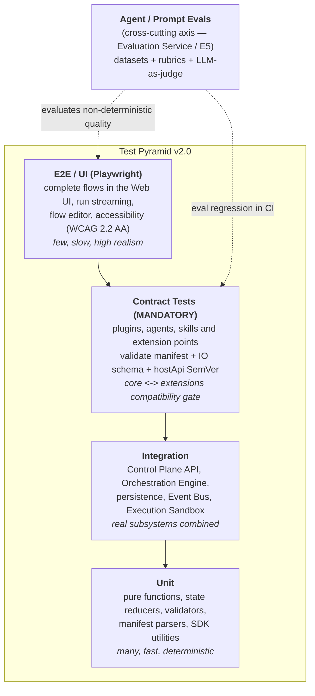
```mermaid
graph TD
    subgraph Test Pyramid v2.0
    E["<b>E2E / UI (Playwright)</b><br/>complete flows in the Web UI, run streaming,<br/>flow editor, accessibility (WCAG 2.2 AA)<br/><i>few, slow, high realism</i>"]
    C["<b>Contract Tests (MANDATORY)</b><br/>plugins, agents, skills and extension points<br/>validate manifest + IO schema + hostApi SemVer<br/><i>core &lt;-&gt; extensions compatibility gate</i>"]
    I["<b>Integration</b><br/>Control Plane API, Orchestration Engine,<br/>persistence, Event Bus, Execution Sandbox<br/><i>real subsystems combined</i>"]
    U["<b>Unit</b><br/>pure functions, state reducers, validators,<br/>manifest parsers, SDK utilities<br/><i>many, fast, deterministic</i>"]
    end
    EV["<b>Agent / Prompt Evals</b><br/>(cross-cutting axis — Evaluation Service / E5)<br/>datasets + rubrics + LLM-as-judge"]
    E --> C --> I --> U
    EV -.evaluates non-deterministic quality.-> E
    EV -.eval regression in CI.-> C
```

Description of the layers:

- **Unit** — cover deterministic core and SDK logic: parsing and validation of `plugin.yaml`/`agent.yaml`/`skill.yaml`/`flow.yaml`/`eval.yaml`, capability resolution, conditional edge expressions, budget calculation, trace redactors. Backend in `pytest`; frontend (`lib/`) in `vitest`. They are the numerical base of the coverage target.
- **Integration** — exercise real combined subsystems: `/v2` routes of the **Control Plane API**, graph execution in the **Orchestration Engine** (checkpointing, retries, human-in-the-loop), durability in the **State Store**, publish/consume on the **Event Bus**, and real execution in the **Execution Sandbox**. They run against SQLite in local mode and against PostgreSQL/Redis/MinIO in the production profile.
- **Contract Tests (MANDATORY)** — every **Extension Point** publishes a conformance suite that any **Plugin/Agent/Skill** MUST pass to be considered valid. They verify: manifest adherence to the schema, IO conformance to the extension point's typed contract, respect for the compatibility range (`hostApi: ">=2.0 <3.0"`), explicit permission declaration, and correct behavior under budgets and guardrails. The **Plugin Host** refuses to load extensions that fail the contract; the **Marketplace (E13)** requires the green contract seal at publication. These tests are the mechanism that prevents extensions from depending on internals.
- **E2E / UI (Playwright)** — drive the **Web UI (Next.js)** through end-to-end flows: create a session, assemble a flow in the visual editor, trigger a run, observe streaming of steps/traces, approve a human-in-the-loop node, install a plugin from the catalog. They include **accessibility** checks (100% keyboard navigation, automated WCAG 2.2 AA checks via axe).

### 17.2 Agent and prompt evals

Non-deterministic components (agents, Reasoning Strategies, Router & Selector) cannot be validated by exact asserts alone. They are evaluated by **Evals** — the canonical **dataset + rubric + metrics** specification — executed by the **Evaluation Service** and feeding back into the **Router & Selector** (epic **E5**, closed feedback).

- **Datasets** — versioned sets of cases (`eval.yaml`) with inputs, context, and, when applicable, reference (gold) outputs. They include happy-path, adversarial, and regression cases (reproducible bugs captured as a case). They are stored durably and versioned alongside the code.
- **Rubrics** — explicit, scorable criteria (correctness, completeness, adherence to format/IO schema, security, cost). They combine deterministic checks (valid schema, patch applies, tests pass) with qualitative judgment.
- **LLM-as-judge** — a pluggable **Evaluator** scores outputs against the rubric using a judge model, with a versioned judgment prompt, structured output (score + justification), and bias mitigation (randomized order, calibration against a human-labeled sample). Judgment is never the only source: hard gates remain deterministic.
- **Eval regression in CI** — the pipeline runs a cheap, stable subset of evals on every PR that touches agents/prompts/reasoning/routing and fails if the aggregate metric drops below the recorded baseline (configurable threshold, e.g., no regression > 2 percentage points in the rubric pass rate). Full, expensive eval suites run on a scheduled cadence (nightly), not blocking every PR.
- **Online / closed feedback** — in production, online evals sample real runs and feed metrics that the **Selector** uses to adjust agent/model/strategy choice by policy, closing the **continuous evaluation** loop.

### 17.3 Performance and load testing

Validate the brief's **global non-functional targets**:

- **Latency** — verifies Control Plane p95 (read endpoints) **< 300 ms** and **streaming start of a run < 1 s** under nominal load.
- **Load and concurrency** — scenarios that sustain **≥ 100 concurrent runs per reference worker node**, confirming the horizontal scaling of execution workers.
- **Soak/stability** — extended runs to detect memory leaks, Redis queue growth, and latency degradation over time.
- Executed outside each PR's critical path (dedicated profile), with results published as artifacts in the **Artifact Store (MinIO)** and compared against latency/throughput baselines; significant regression is a gate on promotion to release.

### 17.4 Security testing

Aligned with the **isolation and least privilege** principle and the brief's security targets:

- **SAST** — static analysis of core and SDK code on every PR (rules for injection, insecure deserialization, path traversal in **Patch** application, hardcoded secrets).
- **Dependency scan** — vulnerability and license scanning across Python and Node dependencies; fails the gate on high/critical severity vulnerabilities without an approved exception.
- **Sandbox escape test** — a specific suite that attempts to breach the **Execution Sandbox** (hardened Docker): network access (which must be **off by default**), escaping the mounted filesystem, privilege escalation, resource exhaustion beyond the budget. It is a mandatory security contract test for any change to the sandbox.
- **RBAC/tenant isolation** — tests that confirm one tenant cannot access another's data/quotas and that sensitive endpoints require an appropriate role (see E11).

### 17.5 Quality gates (CI/CD and Validation Gate)

Gates appear in two places: in **CI/CD** (before merge/release) and in the runtime **Validation Gate** (the gate that a flow result — e.g., a patch generated by an agent — must pass before being accepted). The canonical target of **core coverage ≥ 85%** is a hard gate in both applicable contexts.

| Gate | Criterion (blocks if it fails) | Where it applies | Epic(s) |
|------|-------------------------------|-------------|----------|
| Lint & format | `ruff`/`eslint` with no errors; consistent formatting | CI | E12 |
| Typecheck | `mypy` (backend) + `tsc --noEmit` (frontend) with no errors | CI | E12 |
| Unit + integration tests | 100% green (`make test`) | CI + Validation Gate | E12 |
| **Core coverage** | **≥ 85% of lines in the core** | CI | E12 / global target |
| **Contract tests** | **100% of touched extension points pass** | CI + Plugin Host (load-time) + Marketplace | E1, E2, E6, E12, E13 |
| Eval regression | aggregate metric ≥ baseline (configurable threshold) | CI (agent/prompt PRs) | E5, E12 |
| SAST | no unsuppressed high/critical findings | CI | E11, E12 |
| Dependency scan | no high/critical CVE without an approved exception | CI | E11, E12 |
| Sandbox escape | no successful escape vector | CI (sandbox changes) | E11, E12 |
| Performance/latency | read p95 < 300 ms; streaming < 1 s; ≥ 100 concurrent runs | dedicated profile / pre-release | E11, E12 |
| Accessibility | axe/WCAG 2.2 AA with no violations; keyboard navigation | CI frontend / E2E | E10, E12 |
| Build | frontend production build completes | CI | E12 |

The execution **Validation Gate** reuses the same checkers (lint/tests/coverage/security) applied to the workspace produced by an agent: a patch is only accepted if it passes lint, tests, and security checks in the **Execution Sandbox**, with **fail-closed** by default. This makes the same quality concept consistent between platform development and flow operation.

### 17.6 Test environments and data

- **Local (default dev/CI)** — SQLite, `stub` LLM provider (deterministic responses to make evals and integration reproducible), optional Docker sandbox. It is the mode in which `make check` reproduces the CI pipeline.
- **Integration/production-like** — real PostgreSQL + pgvector, Redis, and MinIO (via `make docker-up` or CI services), exercising the multi-tenant path and versioned migrations.
- **Test data** — deterministic fixtures and per-tenant factories; versioned eval datasets (`eval.yaml`); no real sensitive data. Databases are created and destroyed per run, and migrations are tested forward and (when possible) backward, supporting the RPO ≤ 5 min / RTO ≤ 30 min targets.
- **Determinism and replay** — persisted traces and state allow a run to be re-executed (replay) as a test case, turning production incidents into versioned regressions.

### 17.7 Functional and non-functional criteria

- **Functional** — observable behavior matches the contract: manifests validate against the schema; agent/skill IO adheres to the declared IO schema; flows execute the expected graph (including conditionals, human-in-the-loop, retries); patches apply with path guarding and dry-run; the UI fulfills the key flows. Verified by unit, integration, contract, and e2e tests; for non-deterministic outputs, by evals against a rubric.
- **Non-functional** — latency, availability (99.9% SLO), scale (≥ 100 concurrent runs), security (RBAC, network-free sandbox, tenant isolation), cost/budgets (token measurement and fail-closed), accessibility (WCAG 2.2 AA), and data reliability (RPO/RTO, reversible migrations). Verified by performance/load tests, security tests, accessibility gates, and recovery drills.

Together, the test pyramid, the mandatory contract tests, the agent/prompt evals, and the quality gates operationalize the epic **E12** and sustain v2.0's promise of a **small, stable core with rich, reliable edges**.


---

## 18. Staged Delivery Roadmap

This section defines **how** each stage (Epic) and sub-stage (Story → Subtask) of AutoDev Architect v2.0 is governed: by the **workflow with gates**, by global **Definition of Ready (DoR)** and **Definition of Done (DoD)**, by a **standard Story template**, and by explicit **functional and non-functional criteria**. The non-functional targets referenced here fully inherit the targets from Section 6 of the brief (p95 latency < 300 ms, 99.9% SLO, core coverage ≥ 85%, WCAG 2.2 AA, RPO ≤ 5 min / RTO ≤ 30 min, budgets that fail closed). Fine-grained sequencing (dependencies between stories, waves, and schedule) is detailed in subsections **18.7–18.9**; here is the **phase view** and the **breakdown of epics E0–E6**.

> Identification conventions (brief §7): Epic `E<n>`, Story `E<n>-S<m>`, Subtask `E<n>-S<m>-T<k>`. Plugin/agent/skill ids in `namespace/nome` kebab-case; versions in SemVer; events in `dominio.entidade.acao` in the past tense.

---

### 18.1 Workflow and states

Every unit of work (Story and, recursively, Subtask) transitions through six states. Between states there are **gates**: a set of verifiable conditions that MUST be true for the transition to occur. No transition is manual-without-evidence: each gate requires an artifact or signal (green CI, approved review, validation trace, checked checklist).

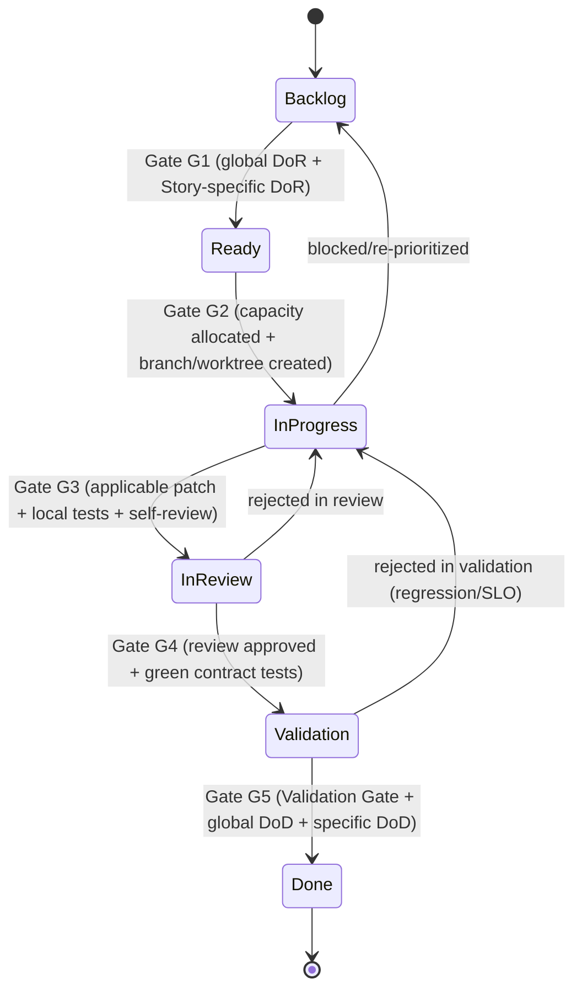
```mermaid
stateDiagram-v2
    [*] --> Backlog
    Backlog --> Ready: Gate G1 (global DoR + Story-specific DoR)
    Ready --> InProgress: Gate G2 (capacity allocated + branch/worktree created)
    InProgress --> InReview: Gate G3 (applicable patch + local tests + self-review)
    InReview --> Validation: Gate G4 (review approved + green contract tests)
    Validation --> Done: Gate G5 (Validation Gate + global DoD + specific DoD)
    InReview --> InProgress: rejected in review
    Validation --> InProgress: rejected in validation (regression/SLO)
    Done --> [*]
    InProgress --> Backlog: blocked/re-prioritized
```

Definition of the gates (what must be true to transition):

| Gate | Transition | Verifiable conditions (all mandatory) | Evidence |
| --- | --- | --- | --- |
| **G1** | Backlog → Ready | Global DoR (18.2) met; Story-specific DoR met; dependencies resolved or mockable; estimate recorded | DoR checklist checked on the card; linked issue |
| **G2** | Ready → In Progress | Owner defined; capacity/worker allocated; branch or worktree created; feature flag reserved when applicable | Branch created; card assigned |
| **G3** | In Progress → In Review | Patch (unified diff) applies with dry-run on a guarded path; local unit tests green; self-review done; no secrets in the diff | PR opened; `run_secret_scanning` clean |
| **G4** | In Review → Validation | ≥1 human review approved; **contract tests** of touched extension points green; ADR/RFC referenced when there is an architecture decision | PR approval; green contract CI |
| **G5** | Validation → Done | **Validation Gate** (lint + tests + coverage + security) green in the Execution Sandbox; SLOs do not regress; global + specific DoD complete; docs and observability delivered | Validation trace; dashboards; DoD checked |

Rollback rules: failing G4 returns to In Progress; failing G5 (SLO regression, coverage below the floor, security failure) returns to In Progress with the cause recorded as a correlated `run.step.failed` event.

---

### 18.2 Definition of Ready (DoR) — GLOBAL

A Story only enters **Ready** (Gate G1) when **all** the items below are satisfied:

- [ ] **Objective and value** described in 1–3 sentences, with the key result of the epic it belongs to.
- [ ] **Scope and non-scope** explicit (what is included and what is left out).
- [ ] **Functional acceptance criteria** written in verifiable form (Given/When/Then or a testable list).
- [ ] Applicable **non-functional criteria** cited with a numeric target (latency, coverage, budget, a11y).
- [ ] **Affected contracts** identified (extension point, IO schema, event, `/v2` endpoint) with `hostApi` range when applicable.
- [ ] **Dependencies** mapped (preceding stories/epics) and unblocked or mockable.
- [ ] Required **data/fixtures** and environment available (local SQLite, stub provider, seeds).
- [ ] Known **risks** listed with initial mitigation.
- [ ] **Estimate** recorded (relative size) and fits within one iteration.
- [ ] **Success metrics** defined (what will be measured to declare delivered value).
- [ ] **Security/RBAC/tenant impact** assessed (least privilege, plugin permissions, isolation).

---

### 18.3 Definition of Done (DoD) — GLOBAL

A Story only transitions to **Done** (Gate G5) when **all** the items below are true and evidenced:

- [ ] **All functional acceptance criteria** verified by automated test.
- [ ] **Non-functional criteria** measured and within target (no SLO regression).
- [ ] **Tests passing** at all applicable levels of the pyramid (unit → integration → e2e).
- [ ] **Coverage**: core ≥ 85% of lines; the touched area does not reduce overall coverage.
- [ ] Mandatory **contract tests** green for every touched extension point/endpoint/event.
- [ ] **Documentation updated** in `docs/` and the root (ADR/RFC when there is a decision; changelog; SDK examples).
- [ ] **Observability**: traces, metrics, and events emitted (OpenTelemetry) and visible in a dashboard; replay possible from persisted state.
- [ ] **Security**: RBAC applied; plugins with explicit permissions; sandbox with no network by default; `run_secret_scanning` clean; dependencies with no critical CVE.
- [ ] **Accessibility (when there is UI)**: WCAG 2.2 AA verified; 100% keyboard navigation; contrast and focus validated; no regression in a11y test.
- [ ] **Budgets**: execution paths respect token/cost/time/step caps and **fail closed**.
- [ ] **Migrations** versioned and reversible when possible; RPO ≤ 5 min / RTO ≤ 30 min preserved.
- [ ] **Feature flag** and rollback documented; release notes prepared.

---

### 18.4 Standard Story template

Every `E<n>-S<m>` MUST follow this template. Fields are mandatory; "N/A" is allowed only with justification.

```yaml
# story: E<n>-S<m> — <short title>
id: E<n>-S<m>
epico: E<n>
titulo: <short, actionable title>

objetivo: |
  <1-3 sentences: what platform capability this delivers and why>

escopo:
  inclui:
    - <item in scope>
  nao_inclui:
    - <item out of scope>

criterios_aceite_funcionais:
  - id: AC-1
    given_when_then: "Given ... When ... Then ..."   # verifiable via test
  - id: AC-2
    given_when_then: "..."

criterios_nao_funcionais:
  - dimensao: latencia|cobertura|seguranca|a11y|budget|disponibilidade|escala
    alvo: <numeric value from brief §6 or specific>
    como_medir: <metric/dashboard/test>

dor_especifico:                # in addition to the global DoR (18.2)
  - <precondition specific to this story>

dod_especifico:                # in addition to the global DoD (18.3)
  - <specific completion criterion>

dependencias:
  - <E<n>-S<m> or component>   # see 18.8 for sequencing

riscos:
  - risco: <description>
    prob_impacto: <low|medium|high>
    mitigacao: <action>

estimativa: <XS|S|M|L|XL>       # relative size, fits in 1 iteration

metricas_sucesso:
  - <measurable indicator of delivered value>

subtarefas:
  - id: E<n>-S<m>-T1
    desc: <actionable technical step>
  - id: E<n>-S<m>-T2
    desc: <...>
```

---
### 18.5 Release Phases and Waves (overview)

Three maturity milestones. The detailed sequencing (which stories in each wave, dependency graph) is in subsections **18.7–18.9**.

| Milestone | Milestone objective | Anchor epics | Milestone exit gate | Contract stability |
| --- | --- | --- | --- | --- |
| **Alpha** | Pluggable foundation usable internally; small, observable core | E0, E1, E2, E3 | Plugin Host loads/isolates plugins; a declarative Flow executes an Agent-as-plugin with trace; PostgreSQL default | `experimental` contracts; may break between minors |
| **Beta** | Platform complete in capability, hardened, open to early adopters | E4, E5, E6, E7, E8, E9, **E14** | Reasoning + Router/Selector + Evals closing the loop; Skills v2; RAG; `/v2` API + MCP stable; real task execution governed by policy/approval modes (E14, new — see §12.7-§12.10, §18.7.8) | `stable` contracts under SemVer; announced deprecations |
| **GA** | Secure multi-tenant production, with Marketplace | E10, E11, E12, E13 | UI/Design System WCAG 2.2 AA; RBAC/tenants/quotas; CI quality gates; plugin publishing/verification | `stable` contracts with compatibility guarantee within the major |

Minimum non-functional criteria per milestone:

| Dimension | Alpha | Beta | GA |
| --- | --- | --- | --- |
| Core coverage | ≥ 70% | ≥ 80% | ≥ 85% |
| Contract tests | key points | all extension points | all + contract fuzzing |
| p95 latency (CP read) | best-effort | < 400 ms | < 300 ms |
| Availability | dev | monitored staging | SLO 99.9% |
| a11y | — | key screens AA | 100% AA + keyboard |
| Security | secrets + sandbox | RBAC + plugin permissions | mandatory RBAC + plugin signing |

---

### 18.6 Breakdown of Epics E0–E6

For each epic: objective, key result and 3–6 stories; each story with subtasks and a criteria block (Functional, Non-Functional, specific DoR, specific DoD, Dependencies).

---

#### E0 — Foundations & Hardening

**Objective.** Establish the security, configuration and observability foundation and make **PostgreSQL** the default persistence (keeping SQLite in local-first mode).
**Key result.** A platform skeleton that boots locally (SQLite + provider stub) and in production (PostgreSQL + Redis + MinIO) without code changes, runs tests/CLI in the canonical container, already emitting traces/metrics via OpenTelemetry and with validated declarative configuration.

**Stories.**

- **E0-S0 — Containerized development/testing runtime**
  - Subtasks: `E0-S0-T1` dev/test backend container with `.venv` inside the container; `E0-S0-T2` Compose for tests, CLI and local SQLite/config state; `E0-S0-T3` README and v2 guide with container startup and usage.

  | Criterion | Detail |
  | --- | --- |
  | Functional | Backend and CLI tests run inside the backend container; host `.venv` is not a prerequisite for E0; local state is isolated in Docker volumes |
  | Non-Functional | Local-first boot uses provider stub and SQLite; no paid service or external cloud dependency |
  | Specific DoR | Existing Dockerfile/Compose and host Makefile inventoried |
  | Specific DoD | README documents startup; v2 docs define container execution as the E0 baseline |
  | Dependencies | — (epic root) |

- **E0-S1 — Container-first Makefile workflow**
  - Subtasks: `E0-S1-T1` canonical build/up/shell/test/check/down/logs targets; `E0-S1-T2` docs point agents/contributors to the container-first targets; `E0-S1-T3` local targets remain as a convenience, but are not the canonical gate for E0.

  | Criterion | Detail |
  | --- | --- |
  | Functional | Contributor can build, enter, test, validate, view logs and stop the container via Makefile |
  | Non-Functional | Targets are deterministic wrappers over Docker Compose and do not create versioned artifacts |
  | Specific DoR | E0-S0 available |
  | Specific DoD | `make help` shows container targets; `docs/testing.md` documents the workflow |
  | Dependencies | E0-S0 |

- **E0-S2 — Declarative and typed configuration layer**
  - Subtasks: `E0-S2-T1` config schema (Pydantic Settings) with local/prod profiles; `E0-S2-T2` loading via env/file with precedence; `E0-S2-T3` fail-fast validation + `config validate` command.

  | Criterion | Detail |
  | --- | --- |
  | Functional | Invalid config aborts boot with an actionable message; `local` (SQLite/stub) and `prod` (PostgreSQL/Redis/MinIO) profiles selectable by variable; secrets never logged |
  | Non-Functional | Boot with valid config < 2 s; 100% of fields with type and safe default; module coverage ≥ 85% |
  | Specific DoR | Inventory of all current v1 variables gathered |
  | Specific DoD | `docs/config.md` published; local×prod matrix tested in CI |
  | Dependencies | E0-S1 |

- **E0-S3 — Migration to PostgreSQL as default (State Store)**
  - Subtasks: `E0-S3-T1` initial modeling (sessions/runs/steps) with Alembic; `E0-S3-T2` agnostic repository abstraction (SQLite↔PostgreSQL); `E0-S3-T3` reversible migration/seed.

  | Criterion | Detail |
  | --- | --- |
  | Functional | Same test suite passes on SQLite and PostgreSQL; migrations apply and revert; dev seeds available |
  | Non-Functional | Versioned and reversible migration; RPO ≤ 5 min / RTO ≤ 30 min documented; no downtime on additive migration |
  | Specific DoR | "PostgreSQL as default" ADR approved |
  | Specific DoD | Backup/restore runbook in `docs/ops/`; migration round-trip test in CI |
  | Dependencies | E0-S2 |

- **E0-S4 — Base observability (OpenTelemetry)**
  - Subtasks: `E0-S4-T1` request/step tracing; `E0-S4-T2` metrics (counters/histograms) and OTLP exporter; `E0-S4-T3` trace↔run↔step correlation.

  | Criterion | Detail |
  | --- | --- |
  | Functional | Every request and every step generate a span correlated to `run_id`/`step_id`; latency and error metrics exposed |
  | Non-Functional | Tracing overhead < 5% latency; configurable sampling; no PII in spans |
  | Specific DoR | Span/metric naming convention defined |
  | Specific DoD | Base dashboard published; error-rate alert active in staging |
  | Dependencies | E0-S2 |

- **E0-S5 — Security baseline and secrets hygiene**
  - Subtasks: `E0-S5-T1` secrets management (env/secret store) without hardcoding; `E0-S5-T2` secrets scanning and SCA in CI; `E0-S5-T3` default HTTP headers/security.

  | Criterion | Detail |
  | --- | --- |
  | Functional | No secrets in the repository; pipeline blocks PR with secret/critical CVE |
  | Non-Functional | Default sandbox without network; dependencies without critical CVE; scanning < 3 min in CI |
  | Specific DoR | CVE severity policy agreed |
  | Specific DoD | `run_secret_scanning` integrated; `docs/security/baseline.md` |
  | Dependencies | E0-S2 |

- **E0-S6 — Redis (Cache/Queue/Locks) and MinIO (Artifact Store)**
  - Subtasks: `E0-S6-T1` Redis connection with distributed locks; `E0-S6-T2` MinIO/S3 client for artifacts; `E0-S6-T3` local fallback without these dependencies.

  | Criterion | Detail |
  | --- | --- |
  | Functional | Distributed locks prevent duplicate execution; artifacts (patch/log) persist and are recoverable; local mode degrades without crashing |
  | Non-Functional | Lock with timeout/renewal; artifact put/get p95 < 200 ms local; coverage ≥ 85% |
  | Specific DoR | Key/bucket convention defined |
  | Specific DoD | Lock contention test; `docs/ops/storage.md` |
  | Dependencies | E0-S2 |

---

#### E1 — Plugin Core & SDK

**Objective.** Create the **Plugin Host** and the typed **extension points**, with manifest, isolation, permissions and an **SDK** (Python/TS) with first-class DX.
**Key result.** A sample plugin is discovered, loaded, isolated and activated from `plugin.yaml`, respecting declared permissions, with a versioned contract (`hostApi`).

**Stories.**

- **E1-S1 — `plugin.yaml` specification and extension points**
  - Subtasks: `E1-S1-T1` manifest JSON schema (id, version, `hostApi`, permissions, extension points); `E1-S1-T2` typed catalog of extension points; `E1-S1-T3` manifest validator.

  | Criterion | Detail |
  | --- | --- |
  | Functional | Manifest with `namespace/name`, SemVer and `hostApi` range correctly validates/rejects; unknown extension point is refused |
  | Non-Functional | Manifest validation < 50 ms; **contract tests** cover each declared extension point |
  | Specific DoR | Canonical list of v2 extension points agreed (RFC) |
  | Specific DoD | Schema published in the SDK; `docs/plugins/manifest.md` |
  | Dependencies | E0-S1 |

- **E1-S2 — Discovery and lifecycle (Plugin Host)**
  - Subtasks: `E1-S2-T1` discovery (directory/entry points); `E1-S2-T2` install→enable→disable→uninstall states; `E1-S2-T3` `hostApi` version/compatibility resolution.

  | Criterion | Detail |
  | --- | --- |
  | Functional | Plugin incompatible with `hostApi` is rejected with a reason; lifecycle emits `plugin.installed`/`plugin.enabled`/`plugin.disabled` |
  | Non-Functional | Loading 50 plugins < 1 s; a single plugin failure does not bring down the host (isolated fail) |
  | Specific DoR | Plugin event convention defined (§7) |
  | Specific DoD | State machine tested; events on the Event Bus documented |
  | Dependencies | E1-S1, E0-S3 |

- **E1-S3 — Isolation and permissions (least privilege)**
  - Subtasks: `E1-S3-T1` declared permissions model (fs/net/exec/secrets); `E1-S3-T2` import/execution sandbox; `E1-S3-T3` broker that mediates access.

  | Criterion | Detail |
  | --- | --- |
  | Functional | Plugin without network permission does not perform network I/O; file access is limited to granted paths; violation is blocked and audited |
  | Non-Functional | Default denies everything (fail-closed); broker overhead < 10%; no privilege escalation in adversarial testing |
  | Specific DoR | Permission taxonomy approved |
  | Specific DoD | Per-permission denial test; audit via event; `docs/plugins/permissions.md` |
  | Dependencies | E1-S2, E0-S4 |

- **E1-S4 — SDK and DX (scaffolding)**
  - Subtasks: `E1-S4-T1` typed Python/TS contracts; `E1-S4-T2` `sdk new plugin` CLI (scaffold); `E1-S4-T3` contract test harness for authors.

  | Criterion | Detail |
  | --- | --- |
  | Functional | `sdk new plugin` generates a project that compiles, runs and passes contract tests; runnable examples included |
  | Non-Functional | Scaffold → first green test < 5 min; contracts with SemVer-stable types |
  | Specific DoR | Minimum SDK surface defined |
  | Specific DoD | "Write your first plugin" guide in `docs/sdk/`; SDK published and versioned |
  | Dependencies | E1-S1 |

- **E1-S5 — Registry and resolution of active plugins**
  - Subtasks: `E1-S5-T1` index of plugins/populated points; `E1-S5-T2` Control Plane query API; `E1-S5-T3` safe hot-reload in dev.

  | Criterion | Detail |
  | --- | --- |
  | Functional | Control Plane lists active plugins and populated points; reloading in dev does not corrupt state |
  | Non-Functional | Registry query p95 < 100 ms; consistent after enable/disable |
  | Specific DoR | Registry read contract defined |
  | Specific DoD | `/v2` endpoint documented; hot-reload test |
  | Dependencies | E1-S2 |

---

#### E2 — Agent Framework

**Objective.** Define the **Agent Manifest**, typed IO contracts and the **Agent Registry**, making agents first-class **plugins** with declared **capabilities**.
**Key result.** An `agent.yaml` publishes an agent with capabilities and IO schema; the Agent Runtime instantiates it, applies budgets/guardrails and executes it producing output per the contract.

**Stories.**

- **E2-S1 — `agent.yaml` specification and IO schema**
  - Subtasks: `E2-S1-T1` schema (id, version, capabilities, IO, tools/skills, policy, budgets); `E2-S1-T2` typed IO validation; `E2-S1-T3` capability versioning.

  | Criterion | Detail |
  | --- | --- |
  | Functional | Agent declares capabilities and IO schema; input/output outside the schema is rejected; budgets inherit a safe default |
  | Non-Functional | IO validation < 20 ms; contract tests per capability |
  | Specific DoR | Initial capabilities vocabulary agreed |
  | Specific DoD | Schema in the SDK; `docs/agents/manifest.md` |
  | Dependencies | E1-S1 |

- **E2-S2 — Agent Registry (registration/discovery/version)**
  - Subtasks: `E2-S2-T1` registry persistence; `E2-S2-T2` search by capability; `E2-S2-T3` SemVer version resolution.

  | Criterion | Detail |
  | --- | --- |
  | Functional | Searching agents by capability returns rankable candidates; multiple versions coexist; deprecation flagged |
  | Non-Functional | Search p95 < 100 ms; registry consistent with Plugin Host |
  | Specific DoR | Registry query contract defined |
  | Specific DoD | `/v2` catalog endpoint; version resolution test |
  | Dependencies | E2-S1, E1-S5 |

- **E2-S3 — Agent Runtime (execution, budgets, guardrails)**
  - Subtasks: `E2-S3-T1` agent execution cycle; `E2-S3-T2` budget enforcement (tokens/cost/time/steps); `E2-S3-T3` output guardrails.

  | Criterion | Detail |
  | --- | --- |
  | Functional | Agent exceeds budget → interrupted and flagged; guardrail blocks/corrects output outside policy; failure logs a step |
  | Non-Functional | Budgets **fail closed**; runtime overhead < 8%; trace per step |
  | Specific DoR | Definition of default budgets per run (brief §6) |
  | Specific DoD | Budget overflow and guardrail test; token/cost metrics emitted |
  | Dependencies | E2-S1, E0-S3 |

- **E2-S4 — Tools/skills mediation and LLM provider**
  - Subtasks: `E2-S4-T1` tools broker with permissions; `E2-S4-T2` provider abstraction (local stub ↔ real); `E2-S4-T3` per-call token/cost measurement.

  | Criterion | Detail |
  | --- | --- |
  | Functional | Agent only accesses granted tools/skills; stub provider runs offline; provider swap without changing the agent |
  | Non-Functional | Least privilege on tools; cost accounting per run/tenant; no network in the sandbox by default |
  | Specific DoR | Provider interface defined |
  | Specific DoD | Test with stub and with mocked real provider; `docs/agents/runtime.md` |
  | Dependencies | E2-S3, E1-S3 |

- **E2-S5 — Reference agent `autodev/agent-coder` as a plugin**
  - Subtasks: `E2-S5-T1` package existing v1 agent as a plugin; `E2-S5-T2` declare capabilities/IO; `E2-S5-T3` migrate behavior with parity.

  | Criterion | Detail |
  | --- | --- |
  | Functional | `autodev/agent-coder` runs via Agent Runtime with functional parity to v1; installable/uninstallable |
  | Non-Functional | No quality regression vs. v1 baseline; coverage ≥ 85% |
  | Specific DoR | v1 behavior baseline captured |
  | Specific DoD | Green parity suite; example in the SDK |
  | Dependencies | E2-S3, E2-S4, E1-S4 |

---

#### E3 — Flow Engine (Orchestration Engine)

**Objective.** Make **flow-as-configuration** real: versioned declarative graph, checkpointing, retries, **human-in-the-loop** and visual editor.
**Key result.** A `flow.yaml` defines a graph of nodes (agent/skill/tool/conditional/human/sub-flow/map-reduce) that the Orchestration Engine executes with durable, resumable and observable state.

**Stories.**

- **E3-S1 — `flow.yaml` specification (declarative graph)**
  - Subtasks: `E3-S1-T1` node and conditional edge schema; `E3-S1-T2` graph validation (cycles, IO types between nodes); `E3-S1-T3` flow versioning.

  | Criterion | Detail |
  | --- | --- |
  | Functional | Flow with nodes of all types validates; conditional edge evaluates a predicate over the state; invalid graph is rejected |
  | Non-Functional | Flow validation < 100 ms; schema contract tests |
  | Specific DoR | Canonical node types defined (brief §3) |
  | Specific DoD | Schema in the SDK; `docs/flows/spec.md` |
  | Dependencies | E1-S1 |

- **E3-S2 — Graph execution with durable state (Run/Step)**
  - Subtasks: `E3-S2-T1` graph executor; `E3-S2-T2` Run/Step persistence in the State Store; `E3-S2-T3` triggers (message/webhook/cron/Event Bus).

  | Criterion | Detail |
  | --- | --- |
  | Functional | A run executes the graph in the correct order; each step persists status/attempts; trigger starts a run |
  | Non-Functional | ≥ 100 concurrent runs per worker node; run streaming start < 1 s |
  | Specific DoR | Run/Step model (E0-S2) available |
  | Specific DoD | Concurrency test; `flow.run.started`/`run.step.completed` events emitted |
  | Dependencies | E3-S1, E0-S2, E2-S3 |

- **E3-S3 — Checkpointing, retries and deterministic replay**
  - Subtasks: `E3-S3-T1` per-step checkpoints; `E3-S3-T2` retry/backoff policy; `E3-S3-T3` replay from persisted state.

  | Criterion | Detail |
  | --- | --- |
  | Functional | Interrupted run resumes from the last checkpoint; retry respects policy; replay reproduces decisions |
  | Non-Functional | Determinism guaranteed from the trace; checkpoint overhead < 10% |
  | Specific DoR | Determinism boundary definition agreed |
  | Specific DoD | Crash-recovery test and identical replay |
  | Dependencies | E3-S2 |

- **E3-S4 — Human-in-the-loop**
  - Subtasks: `E3-S4-T1` pause/approval node; `E3-S4-T2` API to resume with decision/edit; `E3-S4-T3` timeout/expiration.

  | Criterion | Detail |
  | --- | --- |
  | Functional | Flow pauses at a human node and resumes after decision; human edit alters the state; timeout triggers an alternative route |
  | Non-Functional | Durable pause state (survives restart); RBAC applied to the decision |
  | Specific DoR | Human decision contract defined |
  | Specific DoD | Pause/resume and timeout test; approval event |
  | Dependencies | E3-S2, E0-S4 |

- **E3-S5 — Composite nodes: sub-flow and map/reduce**
  - Subtasks: `E3-S5-T1` nested sub-flow; `E3-S5-T2` parallel map/reduce; `E3-S5-T3` result aggregation and budget propagation.

  | Criterion | Detail |
  | --- | --- |
  | Functional | Sub-flow executes and returns to the parent; map triggers N branches and reduce aggregates; parent budget limits the children |
  | Non-Functional | Parallelism scales horizontally; aggregated budget fails closed |
  | Specific DoR | Budget propagation semantics defined |
  | Specific DoD | Map/reduce and sub-flow test; hierarchical trace |
  | Dependencies | E3-S2, E2-S3 |

- **E3-S6 — Visual flow editor (base)**
  - Subtasks: `E3-S6-T1` graph rendering from `flow.yaml`; `E3-S6-T2` bidirectional editing (visual↔YAML); `E3-S6-T3` inline validation.

  | Criterion | Detail |
  | --- | --- |
  | Functional | Editing on the canvas updates the `flow.yaml` and vice versa; validation errors appear inline |
  | Non-Functional | WCAG 2.2 AA; 100% keyboard editing; rendering a 50-node graph < 500 ms |
  | Specific DoR | Design tokens/base Components available (dependency on E10) |
  | Specific DoD | Visual↔YAML round-trip test; a11y audit |
  | Dependencies | E3-S1, E10 (base Design System) |

---

#### E4 — Reasoning

**Objective.** Provide the **Reasoning Engine** with pluggable **Reasoning Strategies** (ReAct, Plan-and-Execute, Reflection, Debate/ToT), governed by policies, budgets and traces.
**Key result.** An agent selects a pluggable reasoning strategy by policy; each reasoning step is traced, budgeted and reproducible.

**Stories.**

- **E4-S1 — Reasoning Strategy contract (extension point)**
  - Subtasks: `E4-S1-T1` typed strategy interface; `E4-S1-T2` instrumented step-by-step cycle; `E4-S1-T3` strategy contract tests.

  | Criterion | Detail |
  | --- | --- |
  | Functional | Strategy implements the contract and is pluggable; each step emits a trace; output conforms to the agent's IO |
  | Non-Functional | Mandatory contract tests; instrumentation overhead < 5% |
  | Specific DoR | Contract surface approved (RFC) |
  | Specific DoD | Schema in the SDK; `docs/reasoning/contract.md` |
  | Dependencies | E1-S1, E2-S3 |

- **E4-S2 — Reference strategies (ReAct, Plan-and-Execute)**
  - Subtasks: `E4-S2-T1` ReAct; `E4-S2-T2` Plan-and-Execute; `E4-S2-T3` comparative tests.

  | Criterion | Detail |
  | --- | --- |
  | Functional | Both run via the Reasoning Engine and produce valid output; switchable without changing the agent |
  | Non-Functional | Respect budgets (fail closed); coverage ≥ 85% |
  | Specific DoR | Reference tasks for comparison defined |
  | Specific DoD | Comparable traces; examples in the SDK |
  | Dependencies | E4-S1 |

- **E4-S3 — Advanced strategies (Reflection, Debate/ToT)**
  - Subtasks: `E4-S3-T1` Reflection; `E4-S3-T2` Debate/Tree-of-Thoughts; `E4-S3-T3` fan-out cost control.

  | Criterion | Detail |
  | --- | --- |
  | Functional | Reflection reviews and corrects; Debate/ToT explores and converges; fan-out limited by budget |
  | Non-Functional | Fan-out cost accounted per run; step cap enforced |
  | Specific DoR | Default fan-out limits defined |
  | Specific DoD | Convergence test and cost cap test |
  | Dependencies | E4-S1 |

- **E4-S4 — Reasoning policies and budgets**
  - Subtasks: `E4-S4-T1` declarative strategy-selection policy; `E4-S4-T2` per-strategy budgets; `E4-S4-T3` fallback on overflow.

  | Criterion | Detail |
  | --- | --- |
  | Functional | Policy selects a strategy by context; overflow triggers a defined fallback |
  | Non-Functional | Fail closed by default; policy decision traced |
  | Specific DoR | Policy DSL/format agreed |
  | Specific DoD | Selection and fallback test; `docs/reasoning/policies.md` |
  | Dependencies | E4-S1, E2-S3 |

---

#### E5 — Routing / Selection / Evaluation

**Objective.** Deliver **Router & Selector** (task classification and agent/model/strategy choice by policy/cost) and the **Evaluation Service**, closing the feedback loop.
**Key result.** A task is classified, routed and assigned to the best agent/model/strategy; evals measure quality and feed back into routing.

**Stories.**

- **E5-S1 — Router (intent/task classification)**
  - Subtasks: `E5-S1-T1` pluggable classifier; `E5-S1-T2` intent→execution path mapping; `E5-S1-T3` decision trace.

  | Criterion | Detail |
  | --- | --- |
  | Functional | Task is classified and routed to the correct path; decision traced with justification |
  | Non-Functional | Routing decision p95 < 150 ms; pluggable classifier (extension point) |
  | Specific DoR | Initial intent taxonomy defined |
  | Specific DoD | Contract tests; routing accuracy metrics |
  | Dependencies | E2-S2, E4-S1 |

- **E5-S2 — Selector (agent/model/strategy by policy and cost)**
  - Subtasks: `E5-S2-T1` capability matching; `E5-S2-T2` cost/quality policy; `E5-S2-T3` deterministic tie-breaking.

  | Criterion | Detail |
  | --- | --- |
  | Functional | Selector chooses a candidate by capabilities + policy + cost; choice reproducible given the same state |
  | Non-Functional | Selection p95 < 100 ms; respects tenant budgets and quotas |
  | Specific DoR | Cost×quality objective function agreed |
  | Specific DoD | Deterministic selection test; decision trace |
  | Dependencies | E5-S1, E2-S2 |

- **E5-S3 — Evaluation Service (offline/online evals)**
  - Subtasks: `E5-S3-T1` `eval.yaml` spec (dataset+rubric+metrics); `E5-S3-T2` offline/online execution; `E5-S3-T3` result storage.

  | Criterion | Detail |
  | --- | --- |
  | Functional | Eval runs over a dataset and produces a score per rubric; pluggable Evaluator (rubric/LLM-as-judge/metric) |
  | Non-Functional | Versioned and reproducible results; parallel execution scales |
  | Specific DoR | Dataset/rubric format defined |
  | Specific DoD | Evaluator contract tests; `docs/evals/spec.md` |
  | Dependencies | E2-S2, E0-S2 |

- **E5-S4 — Eval → routing feedback loop**
  - Subtasks: `E5-S4-T1` publish scores as a signal; `E5-S4-T2` adjust Selector policy by result; `E5-S4-T3` guard against regression.

  | Criterion | Detail |
  | --- | --- |
  | Functional | Eval scores influence subsequent selection; detected regression blocks promotion |
  | Non-Functional | Auditable policy change; no unstable loop (hysteresis/guard) |
  | Specific DoR | Promotion/regression criterion defined |
  | Specific DoD | Closed feedback test; policy change event |
  | Dependencies | E5-S2, E5-S3 |

---
#### E6 — Skills v2

**Objective.** Redefine skills with **Skill Manifest**, **Skill Registry**, composition, and **skills-as-plugin**, reusable by agents and flows.
**Key result.** A `skill.yaml` publishes a skill (deterministic or LLM-assisted) with IO/permissions/triggers; it is discovered, composed, and invoked by agents/flows with least privilege.

**Stories.**

- **E6-S1 — `skill.yaml` Specification**
  - Subtasks: `E6-S1-T1` schema (id, version, IO, permissions, dependencies, triggers); `E6-S1-T2` validation; `E6-S1-T3` versioning.

  | Criterion | Detail |
  | --- | --- |
  | Functional | Skill declares IO/permissions/triggers; IO outside the schema is rejected; deterministic vs. LLM-assisted distinguished |
  | Non-Functional | Validation < 20 ms; contract tests per skill |
  | Specific DoR | Skill permission model defined |
  | Specific DoD | Schema in the SDK; `docs/skills/manifest.md` |
  | Dependencies | E1-S1 |

- **E6-S2 — Skill Registry (registration/discovery/version)**
  - Subtasks: `E6-S2-T1` persistence; `E6-S2-T2` search by trigger/capability; `E6-S2-T3` SemVer resolution.

  | Criterion | Detail |
  | --- | --- |
  | Functional | Skills discovered by trigger/name; versions coexist; deprecation flagged |
  | Non-Functional | Search p95 < 100 ms; consistent with Plugin Host |
  | Specific DoR | Query contract defined |
  | Specific DoD | Catalog `/v2` endpoint; resolution test |
  | Dependencies | E6-S1, E1-S5 |

- **E6-S3 — Least-privilege invocation via Agent Runtime**
  - Subtasks: `E6-S3-T1` invocation broker; `E6-S3-T2` permission/budget enforcement; `E6-S3-T3` call trace.

  | Criterion | Detail |
  | --- | --- |
  | Functional | Agent/flow invokes a granted skill; missing permission blocks; result returns in schema |
  | Non-Functional | Least privilege (fail-closed); skill budget enforced; trace per invocation |
  | Specific DoR | Invocation contract defined |
  | Specific DoD | Permission-denial test; cost metrics |
  | Dependencies | E6-S1, E2-S4, E1-S3 |

- **E6-S4 — Skill composition**
  - Subtasks: `E6-S4-T1` skill chaining/pipeline; `E6-S4-T2` resolution of dependencies between skills; `E6-S4-T3` budget/error propagation.

  | Criterion | Detail |
  | --- | --- |
  | Functional | Skills compose in a pipeline; missing dependency is reported; error stops with clean state |
  | Non-Functional | Aggregate budget fails closed; composition traced end to end |
  | Specific DoR | Composition semantics defined |
  | Specific DoD | Pipeline test and missing-dependency test |
  | Dependencies | E6-S3 |

- **E6-S5 — Reference skills as plugin**
  - Subtasks: `E6-S5-T1` deterministic skill (e.g., applying a Patch with path-guard/dry-run); `E6-S5-T2` LLM-assisted skill; `E6-S5-T3` examples in the SDK.

  | Criterion | Detail |
  | --- | --- |
  | Functional | Patch skill applies a diff with path guard and dry-run; LLM skill respects guardrails; both installable |
  | Non-Functional | Dry-run with no side effects; coverage ≥ 85% |
  | Specific DoR | Reference patch cases defined |
  | Specific DoD | Parity suite; runnable examples in the SDK |
  | Dependencies | E6-S3, E1-S4 |

---

*The detailed sequencing between these stories, cross dependencies with E7–E13, and allocation across alpha/beta/GA waves are developed in subsections **18.7–18.9 (Epics E7–E13, Sequencing and Release Waves)**.*


---

### 18.7 Epics E7–E13

This subsection continues the breakdown started in 18.6 (E0–E6), keeping
the same format: for each epic, a block of **objective + key result** and
3 to 6 **stories** (`E<n>-S<m>`), each with its **subtasks** (`E<n>-S<m>-T<k>`)
and a table consolidating **Functional Criteria (CF)**, **Non-Functional Criteria
(CNF)**, **DoR**, **DoD**, and **Dependencies**. All terms, components, and ids
follow the canonical brief (§3–§7).

---

#### 18.7.1 E7 — Context & RAG

| Field | Description |
| --- | --- |
| **Objective** | Provide the **Context/RAG Service** with tree-sitter indexing, embeddings in the **Vector Store (pgvector)**, hybrid retrieval (lexical + vector), and pluggable **Context Providers**, serving code context to agents and flows. |
| **Key result** | An agent/flow obtains, via a stable contract, the N most relevant snippets from an indexed repository in ≤ 300 ms (p95) for hot queries, with source attribution and no leakage between tenants. |

##### Story E7-S1 — Indexing pipeline with tree-sitter

- **E7-S1-T1**: Incremental multi-language parser via tree-sitter; symbol extraction (functions, classes, imports).
- **E7-S1-T2**: Syntax-aware chunking (symbol boundaries, configurable overlap).
- **E7-S1-T3**: Incremental indexing queue in Redis, triggered by `repo.file.changed` events.
- **E7-S1-T4**: Persistence of chunk metadata (file, span, symbol, hash) in the State Store.

| Item | Content |
| --- | --- |
| **CF** | Indexes ≥ 10 languages; reindexes only changed files (delta); exposes `index(repo)`/`reindex(paths)`; records provenance of each chunk. |
| **CNF** | Indexing a 100k LOC repository < 5 min on the reference node; idempotent; parse failure does not stop the batch. |
| **DoR** | E0 (config/observability) and E8 (base schema) ready; target languages prioritized; tree-sitter grammars pinned by version. |
| **DoD** | CF/CNF green; Context Provider contract test; indexing traces emitted; language-support docs published. |
| **Dependencies** | E0, E8 |

##### Story E7-S2 — Embeddings and Vector Store (pgvector)

- **E7-S2-T1**: Pluggable `EmbeddingProvider` abstraction (local stub, external provider).
- **E7-S2-T2**: pgvector schema with HNSW/IVFFlat index and `tenant_id` column.
- **E7-S2-T3**: Batch/upsert of embeddings with deduplication by chunk hash.
- **E7-S2-T4**: Deterministic stub fallback for local-first mode (no external provider).

| Item | Content |
| --- | --- |
| **CF** | Generates and persists embeddings per chunk; top-k ANN query; provider swap without forced reindexing when dimension is compatible. |
| **CNF** | ANN query p95 < 150 ms for 1M vectors; tenant isolation guaranteed in the filter; configurable dimension. |
| **DoR** | E7-S1 complete; index decision (HNSW vs IVFFlat) recorded in an ADR. |
| **DoD** | Recall/latency benchmark attached; EmbeddingProvider contract test; reversible pgvector migration. |
| **Dependencies** | E7-S1, E8 |

##### Story E7-S3 — Hybrid retrieval (lexical + vector)

- **E7-S3-T1**: Lexical retriever (PostgreSQL BM25/full-text).
- **E7-S3-T2**: Ranking fusion (Reciprocal Rank Fusion) between lexical and vector.
- **E7-S3-T3**: Optional pluggable reranking and filters by path/symbol/language.
- **E7-S3-T4**: Context budget (token budget) with relevance-based truncation.

| Item | Content |
| --- | --- |
| **CF** | `retrieve(query, filters, budget)` returns snippets with score and source; supports lexical, vector, and hybrid modes. |
| **CNF** | p95 < 300 ms on hot queries; recall@10 ≥ the documented baseline in the retrieval evaluation set. |
| **DoR** | E7-S2 ready; retrieval evaluation dataset defined. |
| **DoD** | Recall/latency metrics in the Evaluation Service; Retriever contract test; fusion configuration docs. |
| **Dependencies** | E7-S1, E7-S2, E5 (for retrieval eval) |

##### Story E7-S4 — Pluggable Context Providers

- **E7-S4-T1**: `ContextProvider` extension point (files, symbols, session memory).
- **E7-S4-T2**: Composition/prioritization of multiple providers with deduplication.
- **E7-S4-T3**: Integration with the Agent Runtime (policy-based context injection).
- **E7-S4-T4**: Persisted session-memory provider.

| Item | Content |
| --- | --- |
| **CF** | Providers registered via Plugin Host; agent receives composed, attributable context; order/weight configurable per flow. |
| **CNF** | Isolated provider (explicit permissions); timeout per provider; failure of one provider does not bring down the run. |
| **DoR** | E1 (Plugin Host) and E2 (Agent Runtime) ready; ContextProvider contract approved. |
| **DoD** | Example provider published; contract test; per-step context traces. |
| **Dependencies** | E1, E2, E7-S3 |

---

#### 18.7.2 E8 — Persistence & Data

| Field | Description |
| --- | --- |
| **Objective** | Establish the durable **multi-tenant** data model in the **State Store (PostgreSQL)**, with versioned migrations, **event store**, integration with the **Artifact Store (MinIO)**, and SQLite support for local mode. |
| **Key result** | Sessions, runs, steps, and entities persist consistently and isolated per tenant, with RPO ≤ 5 min and reversible migrations; large artifacts live in MinIO referenced by metadata. |

##### Story E8-S1 — Multi-tenant data model and migrations

- **E8-S1-T1**: Sessions/runs/steps/entities schema with `tenant_id` and RLS (Row-Level Security).
- **E8-S1-T2**: Versioned migration framework (up/down) and reversibility check.
- **E8-S1-T3**: Repository layer with mandatory tenant scoping.
- **E8-S1-T4**: Local SQLite profile with essential schema parity.

| Item | Content |
| --- | --- |
| **CF** | Every read/write is filtered by tenant; migrations apply and roll back; SQLite runs the local-first core. |
| **CNF** | No unscoped cross-tenant query; reversible migration where possible; repository coverage ≥ 85%. |
| **DoR** | E0 complete; logical model reviewed in an ADR; tenancy policy defined. |
| **DoD** | RLS tested with negative cases; migration tested in CI up→down→up; data model docs. |
| **Dependencies** | E0 |

##### Story E8-S2 — Event Store and run durability

- **E8-S2-T1**: Append-only event table (`dominio.entidade.acao`) with per-run ordering.
- **E8-S2-T2**: Flow-state checkpointing for deterministic replay.
- **E8-S2-T3**: Projections/materializations for fast status queries.
- **E8-S2-T4**: Event retention and compaction policy.

| Item | Content |
| --- | --- |
| **CF** | Every step emits persisted events; a run can be reconstructed from the event store; projections reflect current state. |
| **CNF** | Event writes do not block the run (fast append); deterministic replay; RPO ≤ 5 min. |
| **DoR** | E8-S1 ready; event catalog aligned with E9. |
| **DoD** | Replay reproduces an identical run in test; configurable retention; event store docs. |
| **Dependencies** | E8-S1, E3 (Flow Engine), E9 (event catalog) |

##### Story E8-S3 — Artifact Store (MinIO)

- **E8-S3-T1**: S3-compatible client for patches, logs, outputs, and builds.
- **E8-S3-T2**: Artifact reference by metadata in the State Store (no binaries in the DB).
- **E8-S3-T3**: Pre-signed URLs with tenant scope and expiration.
- **E8-S3-T4**: Lifecycle/cleanup of orphaned artifacts.

| Item | Content |
| --- | --- |
| **CF** | Artifacts written/read by reference; download via pre-signed URL; tenant isolation in the bucket/prefix. |
| **CNF** | No large binaries in PostgreSQL; configurable URL expiration; checksum integrity. |
| **DoR** | E8-S1 ready; MinIO provisioned; retention policy defined. |
| **DoD** | Upload/download tested; orphan cleanup scheduled; artifact docs. |
| **Dependencies** | E8-S1 |

##### Story E8-S4 — Backup, RPO/RTO, and reversibility

- **E8-S4-T1**: Logical/physical backup of PostgreSQL and MinIO.
- **E8-S4-T2**: Restore runbook with RTO ≤ 30 min verification.
- **E8-S4-T3**: Automated periodic restore testing.

| Item | Content |
| --- | --- |
| **CF** | Schedulable backup; restore documented and runnable; post-restore integrity check. |
| **CNF** | RPO ≤ 5 min, RTO ≤ 30 min in production; restore test in CI/staging. |
| **DoR** | E8-S1..S3 ready; staging environment available. |
| **DoD** | Restore validated end to end; runbook published; backup-failure alarms. |
| **Dependencies** | E8-S1, E8-S2, E8-S3, E11 |

---

#### 18.7.3 E9 — APIs, Events & MCP

| Field | Description |
| --- | --- |
| **Objective** | Expose the **Control Plane API /v2** (FastAPI) with sessions, flows, runs, config, and registries; run streaming; the **event catalog** on the Event Bus; and **MCP** interoperability. |
| **Key result** | Clients (UI, CLI, external agents) operate the platform through versioned `/v2` contracts (`schemaVersion`), receive run streaming in < 1 s, and integrate tools via MCP. |

##### Story E9-S1 — Control Plane API /v2 (core)

- **E9-S1-T1**: Versioned REST endpoints for sessions, flows, runs, config, and registries.
- **E9-S1-T2**: Typed models with `schemaVersion` and input/output validation.
- **E9-S1-T3**: Integrated authentication and RBAC (delegated to E11).
- **E9-S1-T4**: Published OpenAPI and API contract tests.

| Item | Content |
| --- | --- |
| **CF** | CRUD of key resources under `/v2`; standardized errors; consistent pagination/filtering; generated OpenAPI. |
| **CNF** | Read p95 < 300 ms; backward compatibility within MAJOR; RBAC mandatory in production. |
| **DoR** | E8 (persistence) and resource contracts approved; §7 conventions followed. |
| **DoD** | Contract tests green; OpenAPI published; `/v2` API docs. |
| **Dependencies** | E8 (RBAC is not a prerequisite of the core; role-based authorization is integrated later via E11-S2 — see 18.9) |

##### Story E9-S2 — Run streaming

- **E9-S2-T1**: Streaming transport (SSE/WebSocket) for run/step events.
- **E9-S2-T2**: Backpressure and reconnection with resume by event cursor.
- **E9-S2-T3**: Filtering by event type and tenant scope.

| Item | Content |
| --- | --- |
| **CF** | Client subscribes to a run and receives steps/decisions in real time; reconnects without losing events (cursor). |
| **CNF** | Streaming start < 1 s; supports ≥ 100 concurrent subscriptions per node; no leakage between tenants. |
| **DoR** | E8-S2 (event store) ready; event catalog defined. |
| **DoD** | Reconnection/resume test; streaming latency metrics; docs. |
| **Dependencies** | E8-S2, E9-S1 |

##### Story E9-S3 — Event catalog and Event Bus

- **E9-S3-T1**: Central registry of event types (`dominio.entidade.acao`) with schema.
- **E9-S3-T2**: Asynchronous publish/subscribe between subsystems and plugins.
- **E9-S3-T3**: Versioning and compatible evolution of events.

| Item | Content |
| --- | --- |
| **CF** | Published events follow the registered schema; plugins subscribe by type; catalog documented and browsable. |
| **CNF** | Resilient asynchronous delivery (retry/dead-letter); breaking-free evolution within MAJOR. |
| **DoR** | §7 naming approved; Redis/broker provisioned. |
| **DoD** | Schemas validated in CI; catalog published; publish/subscribe contract test. |
| **Dependencies** | E8-S2 |

##### Story E9-S4 — MCP interoperability

- **E9-S4-T1**: Exposing platform tools/skills as an MCP server.
- **E9-S4-T2**: Consuming external MCP servers as agent tools.
- **E9-S4-T3**: Mapping MCP permissions ↔ least-privilege model.

| Item | Content |
| --- | --- |
| **CF** | Agents use external MCP tools; internal tools exposed via MCP; explicit discovery and permissions. |
| **CNF** | Isolation and least privilege; timeouts and budgets enforced on MCP calls. |
| **DoR** | E2 (Agent Runtime) and E6 (Skills) ready; MCP contract approved. |
| **DoD** | Interop tested with a reference MCP server; docs; contract test. |
| **Dependencies** | E2, E6, E9-S1 |

---

#### 18.7.4 E10 — UI/UX & Design System

| Field | Description |
| --- | --- |
| **Objective** | Deliver the **Web UI (Next.js)** with a **Design System** (shadcn/ui + Tailwind, Design Tokens), key screens, a **visual flow editor**, catalogs, and dashboards, with **WCAG 2.2 AA** accessibility. |
| **Key result** | An operator creates/edits flows, triggers runs, follows streaming, and browses agent/skill/plugin catalogs through a UI that is accessible and 100% keyboard-navigable. |

##### Story E10-S1 — Design System and Design Tokens

- **E10-S1-T1**: Base component library (shadcn/ui + Tailwind) and token-based theme.
- **E10-S1-T2**: Color/typography/spacing/radius/shadow tokens with light/dark mode.
- **E10-S1-T3**: Storybook/component catalog with accessibility tests.

| Item | Content |
| --- | --- |
| **CF** | Documented reusable components; light/dark themes; versioned tokens. |
| **CNF** | WCAG 2.2 AA contrast and focus; keyboard navigation; components with a11y tests. |
| **DoR** | Brand/token guide approved; Next.js stack defined. |
| **DoD** | Storybook published; a11y audit with no blocking violations; token docs. |
| **Dependencies** | — |

##### Story E10-S2 — Key screens (sessions, runs, catalogs, dashboards)

- **E10-S2-T1**: Session/run screens with streaming and traces.
- **E10-S2-T2**: Agent/skill/plugin catalogs with search and detail view.
- **E10-S2-T3**: Cost/token/quota dashboards per tenant.

| Item | Content |
| --- | --- |
| **CF** | Operator views runs live, inspects steps/traces, browses catalogs, and sees metrics. |
| **CNF** | Acceptable perceived-load p95; a11y AA; streaming consumption < 1 s. |
| **DoR** | E9 (API/streaming) and E10-S1 ready. |
| **DoD** | User flows tested (e2e); a11y validated; screen docs. |
| **Dependencies** | E9, E10-S1 |

##### Story E10-S3 — Visual flow editor

- **E10-S3-T1**: Graph canvas (nodes, conditional edges, sub-flows, map/reduce).
- **E10-S3-T2**: Declarative editing synchronized with `flow.yaml` (round-trip).
- **E10-S3-T3**: Real-time validation and human-in-the-loop in the UI.

| Item | Content |
| --- | --- |
| **CF** | Creates/edits a flow visually; exports/imports `flow.yaml` without loss; validates the graph and human nodes. |
| **CNF** | Keyboard-accessible editor; deterministic round-trip; immediate validation feedback. |
| **DoR** | E3 (Flow Engine) with a stable flow schema; E10-S1 ready. |
| **DoD** | Round-trip tested; a11y AA on the canvas; editor docs. |
| **Dependencies** | E3, E10-S1 |

##### Story E10-S4 — Pluggable panels (UI Extension Points)

- **E10-S4-T1**: UI extension point for plugin-contributed panels.
- **E10-S4-T2**: Sandbox/permissions for plugin panels.
- **E10-S4-T3**: Panel registration/discovery via Plugin Host.

| Item | Content |
| --- | --- |
| **CF** | Plugins register UI panels; user enables/disables them; panels respect tokens/theme. |
| **CNF** | Panel isolation; inherited a11y; panel failure does not break the app. |
| **DoR** | E1 (Plugin Host) and E10-S1 ready; UI Extension contract approved. |
| **DoD** | Example panel published; contract test; docs. |
| **Dependencies** | E1, E10-S1 |

---

#### 18.7.5 E11 — Observability, Security & Multi-tenant

| Field | Description |
| --- | --- |
| **Objective** | Instrument the platform with **OpenTelemetry**, implement **RBAC**, **tenant** isolation, **quotas/budgets**, and operational **runbooks**. |
| **Key result** | Every run/step/decision is traceable end to end; access is governed by RBAC mandatory in production; tenants have quotas and budgets that fail closed. |

##### Story E11-S1 — Observability (OpenTelemetry)

- **E11-S1-T1**: Traces/metrics/logs correlated by `run_id`/`trace_id`.
- **E11-S1-T2**: OTel exporters and latency/error/cost dashboards.
- **E11-S1-T3**: Configurable sampling and retention.

| Item | Content |
| --- | --- |
| **CF** | Each step emits a trace/metric; end-to-end correlation; operational dashboards available. |
| **CNF** | Acceptable instrumentation overhead; OTel standards; no sensitive PII in logs. |
| **DoR** | E0 (observability base) ready; OTel backend provisioned. |
| **DoD** | Correlated traces verified; dashboards published; observability docs. |
| **Dependencies** | E0 |

##### Story E11-S2 — RBAC and authentication

- **E11-S2-T1**: Role/permission model and enforcement in the Control Plane API.
- **E11-S2-T2**: Authentication (tokens/sessions) and per-resource scopes.
- **E11-S2-T3**: Access and denial auditing.

| Item | Content |
| --- | --- |
| **CF** | Role-based permissions enforced on all endpoints; access auditing; per-resource scope. |
| **CNF** | RBAC mandatory in production; access fails closed (deny-by-default). |
| **DoR** | E9-S1 (API) ready; role matrix approved. |
| **DoD** | Negative authorization tests; verifiable auditing; RBAC docs. |
| **Dependencies** | E9-S1 |

##### Story E11-S3 — Multi-tenant and quotas/budgets

- **E11-S3-T1**: Per-tenant data isolation (integrates E8's RLS) and tenant context in the API.
- **E11-S3-T2**: Per-tenant quotas (concurrent runs, storage) and per-run budgets (tokens/cost/time/steps).
- **E11-S3-T3**: Budget enforcement in the Agent Runtime and Reasoning Engine.

| Item | Content |
| --- | --- |
| **CF** | A tenant cannot access another's data; quotas/budgets enforced and observable; overrun stops with consistent state. |
| **CNF** | Safe default budgets that fail closed; token/cost measurement per run/tenant. |
| **DoR** | E8 (tenancy) and E4 (budgets in reasoning) ready. |
| **DoD** | Isolation and budget-overrun tests; quota panel; docs. |
| **Dependencies** | E8, E4, E11-S2 |

##### Story E11-S4 — Execution security and runbooks

- **E11-S4-T1**: No-network sandbox by default and explicit plugin permissions.
- **E11-S4-T2**: Secret management and dependency/secret scanning.
- **E11-S4-T3**: Incident/restoration runbooks and alerts.

| Item | Content |
| --- | --- |
| **CF** | Execution and plugins run with least privilege; secrets protected; runbooks executable. |
| **CNF** | No-network sandbox by default; secret scanning in CI; actionable alerts. |
| **DoR** | E1 (plugin permissions) and the base Execution Sandbox available. |
| **DoD** | Sandbox network-denial test; runbooks published; alerts configured. |
| **Dependencies** | E1, E8-S4 |

---
#### 18.7.6 E12 — Quality & Evals

| Field | Description |
| --- | --- |
| **Objective** | Establish the test pyramid, mandatory **contract tests** for extension points, **agent evals** via the **Evaluation Service**, and CI **quality gates**. |
| **Key result** | No change lands without passing the Validation Gates; extensions only integrate with a green contract test; agent/routing quality is measured and fed back. |

##### Story E12-S1 — Test pyramid and coverage

- **E12-S1-T1**: Unit/integration/e2e suites organized by subsystem.
- **E12-S1-T2**: Core coverage ≥ 85% with a CI gate.
- **E12-S1-T3**: Deterministic data/fixtures and a provider stub for tests.

| Item | Content |
| --- | --- |
| **CF** | Tests per layer run in CI; coverage is reported; the stub guarantees determinism. |
| **CNF** | Core ≥ 85% line coverage; stable suite (no blocking flakiness). |
| **DoR** | E0 (base CI) ready; test strategy approved. |
| **DoD** | Coverage gate active; report on every PR; test docs. |
| **Dependencies** | E0 |

##### Story E12-S2 — Contract tests for extension points

- **E12-S2-T1**: Contract test harness per Extension Point (plugin, agent, skill, provider).
- **E12-S2-T2**: `hostApi` compatibility verification (SemVer).
- **E12-S2-T3**: Mandatory gate for Marketplace publication.

| Item | Content |
| --- | --- |
| **CF** | Every extension point has a contract test; contract incompatibility fails the build. |
| **CNF** | Contract tests are mandatory; execution < agreed CI limit. |
| **DoR** | SemVer contracts published (E1–E6); harness defined. |
| **DoD** | All extension points have a contract test; gate active; docs. |
| **Dependencies** | E1, E2, E3, E4, E5, E6 |

##### Story E12-S3 — Agent evals and closed feedback

- **E12-S3-T1**: `eval.yaml` (dataset + rubric + metrics) executable offline/online.
- **E12-S3-T2**: Integration with the Evaluation Service and result storage.
- **E12-S3-T3**: Feedback to the Router & Selector.

| Item | Content |
| --- | --- |
| **CF** | Evals run in CI and on demand; results are persisted; scores feed routing. |
| **CNF** | Reproducible from a versioned dataset; observable execution. |
| **DoR** | E5 (Evaluation Service) ready; eval datasets defined. |
| **DoD** | Reference eval green; feedback to the Selector verified; docs. |
| **Dependencies** | E5 |

##### Story E12-S4 — CI Quality Gates (Validation Gates)

- **E12-S4-T1**: Chained lint/test/coverage/security gates.
- **E12-S4-T2**: Patch validation (dry-run, path guard) in the pipeline.
- **E12-S4-T3**: Merge blocked without green gates.

| Item | Content |
| --- | --- |
| **CF** | Merge only with all gates green; patch validated by dry-run/path guard. |
| **CNF** | Deterministic gates; clear failure feedback; CI time within the agreed limit. |
| **DoR** | E12-S1..S3 ready; protected-branch policy. |
| **DoD** | Gates applied on all PRs; contribution docs updated. |
| **Dependencies** | E12-S1, E12-S2, E12-S3 |

---

#### 18.7.7 E13 — Marketplace & GA

| Field | Description |
| --- | --- |
| **Objective** | Deliver plugin publishing/installation, package **signing/verification**, and the **GA** (General Availability) conditions for v2.0. |
| **Key result** | The community publishes and installs versioned, verified plugins/agents/skills; the platform meets the defined SLOs and GA criteria. |

##### Story E13-S1 — Marketplace publishing and catalog

- **E13-S1-T1**: Publishing flow (packaging, metadata, SemVer version).
- **E13-S1-T2**: Searchable catalog of plugins/agents/skills.
- **E13-S1-T3**: `hostApi` compatibility and deprecation policy.

| Item | Content |
| --- | --- |
| **CF** | Author publishes a versioned package; user discovers it via search/filters; compatibility declared and validated. |
| **CNF** | Consistent metadata; scalable catalog; green contract test on publication. |
| **DoR** | E1 (SDK/manifest) and E12-S2 (contract tests) ready. |
| **DoD** | End-to-end publication tested; catalog online; publishing docs. |
| **Dependencies** | E1, E12-S2 |

##### Story E13-S2 — Installation, isolation, and lifecycle

- **E13-S2-T1**: Install/update/remove via the Plugin Host with explicit permissions.
- **E13-S2-T2**: Dependency resolution and version ranges.
- **E13-S2-T3**: Installation rollback and plugin quarantine.

| Item | Content |
| --- | --- |
| **CF** | Installs/updates/removes an isolated plugin; resolves dependencies; rollback available. |
| **CNF** | Least privilege; plugin failure does not affect the core; idempotent operation. |
| **DoR** | E1 (Plugin Host) mature; E13-S1 ready. |
| **DoD** | Lifecycle tested; quarantine verified; docs. |
| **Dependencies** | E1, E13-S1 |

##### Story E13-S3 — Package signing and verification

- **E13-S3-T1**: Cryptographic signing of packages and verification at install time.
- **E13-S3-T2**: Chain of trust and trusted-publisher policies.
- **E13-S3-T3**: Integrity and provenance verification (SBOM).

| Item | Content |
| --- | --- |
| **CF** | An unsigned/tampered package is rejected; provenance is verifiable; trust policies are enforceable. |
| **CNF** | Verification mandatory in production; SBOM available; installation audit. |
| **DoR** | E13-S2 ready; trust model approved (ADR). |
| **DoD** | Tampered-package rejection tested; SBOM issued; Marketplace security docs. |
| **Dependencies** | E13-S2, E11-S4 |

##### Story E13-S4 — GA criteria and readiness

- **E13-S4-T1**: GA checklist (SLOs, security, docs, backups, evals).
- **E13-S4-T2**: Load testing and verification of global non-functional targets (§6).
- **E13-S4-T3**: Final hardening, upgrade migration, and release notes.

| Item | Content |
| --- | --- |
| **CF** | All GA checklist items met; upgrade from v1 documented; notes published. |
| **CNF** | Control Plane SLO 99.9%; p95 read < 300 ms; RPO ≤ 5 min/RTO ≤ 30 min under load test. |
| **DoR** | E0–E12 complete and beta stable; load environment available. |
| **DoD** | GA checklist signed off; load test passed; GA release published. |
| **Dependencies** | E0–E12 |

---

#### 18.7.8 E14 — Real Task Execution & Governed Autonomy

*(New epic, authored in English — see §12.7-§12.10 for the architecture
narrative and `docs/v2_platform/phases/e14_real_execution_governance.md` for
the full phase doc.)*

| Field | Description |
| --- | --- |
| **Objective** | Turn agent-generated plans/`ExecutionTask`s into real, auditable actions (create/edit files, apply patches, run commands, run validations) under an explicit permission/policy layer with three execution modes (approval, auto, hybrid), wired securely to the Execution Sandbox, exposed through both the Web UI and a governed interactive shell, and installable via an `autodev` CLI command. |
| **Key result** | `execute_plan` stops being a simulation that only marks steps completed and instead invokes a real, policy-mediated Task Executor whose result (stdout/stderr/exit code/diffs/artifacts) is persisted and linked to the run/session/task; the operator picks the execution mode and can grant persistent dynamic permissions. |

##### Story E14-S1 — Real Task Executor

- **E14-S1-T1**: `ExecutionAction` contract (create_file/edit_file/apply_patch/run_command/run_validation) and `ExecutionResult` contract (stdout/stderr/exit_code/diff/artifacts).
- **E14-S1-T2**: Executor that maps an `ExecutionTask`/Flow step to one or more `ExecutionAction`s and dispatches them to the appropriate runner, replacing `execute_plan`'s simulated loop.
- **E14-S1-T3**: Persistence of results linked to run_id/step_id/task_id and `execution.action.started`/`.completed`/`.failed` events.

| Item | Content |
| --- | --- |
| **CF** | An `ExecutionTask` with a file/patch/command action produces a real, observable result (diff applied, command run, exit code captured); an interrupted execution preserves partial state. |
| **CNF** | Every action is auditable (who, when, what, result); no silent action outside the trace. |
| **DoR** | Execution flow-node contract (E3) and a base Execution Sandbox (E11-S4, or the v1 precursor `backend/validation/sandbox.py`) available. |
| **DoD** | Test coverage per action type; `docs/execution/engine.md`; RFC+ADR if the contract is a MAJOR change (§19.3). |
| **Dependencies** | E2-S3, E3-S2, E9-S1 |

##### Story E14-S2 — Permission & Policy Engine

- **E14-S2-T1**: Policy model — allow/deny list per action category (shell, fs-write, patch, network, secrets-read, validation), scoped to project/repository/session.
- **E14-S2-T2**: Fail-closed policy evaluator — no action without an explicit policy entry is permitted.
- **E14-S2-T3**: Audit trail — every decision (allowed/denied/pending) recorded with actor and reason.

| Item | Content |
| --- | --- |
| **CF** | An action with no matching policy entry is denied by default; a project-scoped allow rule permits equivalent future actions; every decision is logged and auditable. |
| **CNF** | Policy evaluation < 50 ms; no implicit permission; evaluator errors fail closed. |
| **DoR** | Action-category taxonomy defined (from E14-S1); basic RBAC (E11-S2) or a local stub. |
| **DoD** | Default-deny and scope tests; `docs/execution/permissions.md`. |
| **Dependencies** | E14-S1, E11-S2 |

##### Story E14-S3 — Execution Modes: Approval, Auto, Hybrid

- **E14-S3-T1**: Approval mode — every sensitive action pauses for a human decision (reuses the E3-S4 human-in-the-loop node).
- **E14-S3-T2**: Auto mode — automatically executes anything the E14-S2 policy already allows.
- **E14-S3-T3**: Hybrid mode — auto-executes what's allowed; for anything else, offers the 3-option decision (run once / run and persist a dynamic permission for similar actions / deny) and persists the grant when option 2 is chosen.

| Item | Content |
| --- | --- |
| **CF** | Given hybrid mode and a command not covered by policy, the system prompts with the 3 documented options and, on "always", persists a reusable dynamic rule (e.g. `sqlite *`) with no further prompt for equivalent future actions. |
| **CNF** | A pending decision does not block unrelated independent actions; a decision timeout expires into a configurable fallback route (default: deny and stop the run), reusing E3-S4-T3. |
| **DoR** | E14-S2 available; E3-S4 human-decision contract reviewed. |
| **DoD** | Test of all 3 modes and all 3 response options; dynamic permissions reviewable/revocable via API; `docs/execution/modes.md`. |
| **Dependencies** | E14-S1, E14-S2, E3-S4 |

##### Story E14-S4 — Sandbox-Backed Runners

- **E14-S4-T1**: Command (shell) runner via `SandboxRunner` (hardened Docker, no network by default, allowlist).
- **E14-S4-T2**: Patch runner (apply with path guard and dry-run) — hardened, kept separate from the arbitrary-command runner.
- **E14-S4-T3**: Validation runner — reuses the existing Validation Gates; local fallback only behind explicit `AUTODEV_SANDBOX_ALLOW_LOCAL=1`.

| Item | Content |
| --- | --- |
| **CF** | A command-type `ExecutionAction` runs in the no-network sandbox; a patch-type action applies with path guard and never falls back to arbitrary exec; validation reuses the existing Validation Gate. |
| **CNF** | Sandbox has no network by default; fails closed without Docker; clear separation of responsibility across the 3 runners. |
| **DoR** | `backend/validation/sandbox.py` (E11-S4 / v1 precursor) reviewed; action taxonomy from E14-S1. |
| **DoD** | Reused sandbox-escape test (§16); fail-closed-without-Docker test; docs. |
| **Dependencies** | E14-S1, E11-S4 |

##### Story E14-S5 — Web UX for Governed Execution

- **E14-S5-T1**: Plan/action view, inline approve/deny, before/after diffs.
- **E14-S5-T2**: Real-time logs (stdout/stderr/exit code) via the E9-S2 streaming transport.
- **E14-S5-T3**: Dynamic permission management (list/revoke) and pause/cancel/resume of runs.

| Item | Content |
| --- | --- |
| **CF** | An operator approves/denies an action from the Web UI and sees the result in real time; can revoke a previously saved dynamic permission; can pause/cancel/resume a running run. |
| **CNF** | WCAG 2.2 AA; log streaming starts < 1 s (inherited from E9-S2). |
| **DoR** | E10 (base Design System) and E9-S2 (streaming) available. |
| **DoD** | End-to-end approve/deny UI test; a11y audit; docs. |
| **Dependencies** | E14-S2, E14-S3, E9-S2, E10 |

##### Story E14-S6 — Governed Interactive Shell (`autodev --shell`)

- **E14-S6-T1**: REPL loop that consumes only the Control Plane API (`/v2`), never the State Store directly (API-first).
- **E14-S6-T2**: Inline confirmation of sensitive actions and terminal log streaming.
- **E14-S6-T3**: Support for all 3 modes (approval/auto/hybrid) and condensed diff/result summaries in the terminal.

| Item | Content |
| --- | --- |
| **CF** | `autodev --shell` starts a conversational loop that executes actions with approval per the active mode, shows condensed diffs, and streams logs. |
| **CNF** | Zero direct calls to Postgres/Redis/MinIO from the shell (API-first, §2.13); approval UX parity with the Web UI. |
| **DoR** | E14-S3 (modes) and E9-S1 (API) available. |
| **DoD** | Contract test "shell only calls `/v2`"; `docs/execution/shell.md`. |
| **Dependencies** | E14-S3, E9-S1 |

##### Story E14-S7 — `autodev` CLI Packaging & Install

- **E14-S7-T1**: Packaged entry point (`autodev` on PATH/bin) via Python packaging (console script) or an equivalent OSS installer.
- **E14-S7-T2**: Default behavior (`autodev`) starts the web/local experience and opens the browser when possible; flags `--shell`, `--command "<text>"`, `--mode approval|auto|hybrid`, and a permission config/persistence subcommand.
- **E14-S7-T3**: Self-hosted installation guide (no mandatory paid-service dependency).

| Item | Content |
| --- | --- |
| **CF** | Installing the package registers `autodev` on PATH; `autodev` with no args starts web/local and opens the browser; `autodev --shell`, `autodev --command "..."`, and `autodev --mode <mode>` behave as specified. |
| **CNF** | 100% self-hosted install by default; no mandatory paid infrastructure dependency. |
| **DoR** | E14-S6 (shell) and E9-S1 (API) available; packaging choice (setuptools/uv/pipx) recorded in a lightweight ADR if it changes current distribution. |
| **DoD** | Local (container/dev) install test verifying the entry point; `docs/execution/cli-install.md`. |
| **Dependencies** | E14-S6, E14-S1, E14-S4 |

---

#### 18.7.9 E15 — Frontend Redesign: Design Language & App Shell

*(New epic, authored in English — prototype reference:
`layout_prototype_brainstorm/Autodev Redesing.html`,
`layout_prototype_brainstorm/AutoDev - Project Description.pdf`, and
screenshots in `Frontend redesign proposal.zip` (`shots/`). UI language:
English by default, pt-BR via i18n — see RFC-006.)*

| Field | Description |
| --- | --- |
| **Objective** | Establish the "Execution Control Center" visual language (tokens, typography, app shell) from the redesign prototype as the new UI foundation, migrate legacy-styled screens onto it, and lay an i18n foundation — without touching the Control Plane API surface. |
| **Key result** | `styles/globals.css` and `tailwind.config.ts` express the prototype's token set and pass WCAG 2.2 AA; the 3-region app shell (sidebar rail / contextual header / dismissible execution panel) renders consistently; legacy-styled pages are migrated onto the shared token/Radix kit; UI copy is externalized behind `en` (default) / `pt-BR` locales. |

##### Story E15-S1 — Design tokens v2: prototype design language

- **E15-S1-T1**: Token set — warm-paper light (`#faf8f4`) / charcoal dark (`#100f12`) surfaces, iris accent (`#5a4fe0` light / `#8e88ff` dark), low-saturation success/warning/danger, and diff-tint (addition/removal) tokens.
- **E15-S1-T2**: Typography scale — Newsreader (display/serif), Instrument Sans (UI sans), JetBrains Mono (code/diff) — extending `styles/globals.css` and `tailwind.config.ts`.
- **E15-S1-T3**: Update `frontend/docs/design-tokens.md` and Storybook token stories; verify WCAG 2.2 AA contrast for both themes.

| Item | Content |
| --- | --- |
| **CF** | Applying the new tokens renders the warm-paper light theme and charcoal dark theme with the specified accent/status/diff colors; Storybook exposes the updated type scale (Newsreader/Instrument Sans/JetBrains Mono). |
| **CNF** | All token pairs meet WCAG 2.2 AA contrast in both themes; token changes are additive (no removal of tokens still consumed by existing E10 screens) until E15-S3 migrates them. |
| **DoR** | E10-S1 (base Design System tokens) available; prototype reference (`layout_prototype_brainstorm/Autodev Redesing.html`) reviewed. |
| **DoD** | Contrast-ratio test for token pairs; `frontend/docs/design-tokens.md` updated; Storybook token stories updated. |
| **Dependencies** | E10-S1 |

##### Story E15-S2 — Execution Control Center shell

- **E15-S2-T1**: 250px sidebar rail — brand, workspace switcher, primary nav (Chat/Plans/Patches/Flows/Sessions/Config/Extensions) with count badges, provider status card, theme toggle.
- **E15-S2-T2**: 64px contextual header — title/subtitle, repo chip, execution-panel toggle, "+ New session" action.
- **E15-S2-T3**: Dismissible 400px right execution panel wired to the header toggle.

| Item | Content |
| --- | --- |
| **CF** | The shell renders the sidebar rail, contextual header, and execution panel exactly per the prototype's 3-region layout; toggling the header control shows/hides the 400px panel; nav badges reflect live counts; the provider status card and theme toggle are present in the rail. |
| **CNF** | WCAG 2.2 AA; shell layout is responsive down to the documented minimum viewport; panel state persists across navigation within a session. |
| **DoR** | E15-S1 (tokens) available; E10-S2 (base screens/navigation) reviewed for continuity. |
| **DoD** | Shell a11y audit; visual regression baseline vs. the prototype; shell layout documented. |
| **Dependencies** | E15-S1, E10-S2 |

##### Story E15-S3 — Legacy CSS migration

- **E15-S3-T1**: Inventory legacy-styled pages (dashboard, config, plans, patches, agents, skills) and their legacy shell tokens.
- **E15-S3-T2**: Migrate each page onto the token/Radix kit established in E15-S1/E15-S2, preserving existing functionality.
- **E15-S3-T3**: Remove now-unused legacy shell tokens and legacy CSS entry points.

| Item | Content |
| --- | --- |
| **CF** | Every listed legacy-styled page renders using only the new token/Radix kit; no legacy shell token remains referenced in the codebase. |
| **CNF** | No regression in existing page functionality during migration; bundle size does not regress beyond an agreed threshold. |
| **DoR** | E15-S1 and E15-S2 available; inventory of legacy-styled pages confirmed against E10-S1/E10-S2 output. |
| **DoD** | Per-page migration checklist complete; legacy token removal verified by grep/lint; docs updated. |
| **Dependencies** | E15-S1, E15-S2, E10-S1, E10-S2 |

##### Story E15-S4 — i18n foundation

- **E15-S4-T1**: i18n library/provider setup with `en` as the default locale and `pt-BR` as a supported locale.
- **E15-S4-T2**: Externalize all UI copy introduced by E10/E15 screens into locale resource files.
- **E15-S4-T3**: Language-switch mechanism (settings/theme area) and fallback-to-`en` behavior for missing keys.

| Item | Content |
| --- | --- |
| **CF** | Switching locale to pt-BR re-renders UI copy in pt-BR; a missing pt-BR key falls back to the English string without breaking the UI. |
| **CNF** | No hardcoded UI copy remains in migrated components; locale switch requires no full page reload. |
| **DoR** | RFC-006 (i18n strategy) available; E10-S2 screens reviewed for copy inventory. |
| **DoD** | i18n coverage check (lint rule or script) over migrated components; docs note on supported locales. |
| **Dependencies** | E10-S2; RFC-006 |

---

#### 18.7.10 E16 — Frontend Redesign: Control-Plane API Enablement

*(New epic, authored in English — API-first rule (§2.13): these `/v2`
contracts ship before or alongside the E17 screens that consume them. Each
story below is an adjustment to a prior epic (E1–E9), cited as its origin.)*

| Field | Description |
| --- | --- |
| **Objective** | Expose the `/v2` Control Plane endpoints required by the redesigned screens — chat/execution timeline, step-gated plans, patch review/apply, and extensions/provider config — before or alongside any UI work, replacing remaining root-relative/legacy endpoints those screens would otherwise depend on. |
| **Key result** | Each of chat, plans, patches, and extensions has a versioned `/v2` contract (request/response schema and, where relevant, an event taxonomy) that E17's screens consume exclusively; no new UI in E17 talks to a non-`/v2` endpoint or the State Store directly. |

##### Story E16-S1 — /v2 chat & execution timeline contract

- **E16-S1-T1**: Run-event taxonomy (planning → analysis → patch → validation) with a per-step output payload shape.
- **E16-S1-T2**: `/v2` chat/execution-timeline endpoints (extending the E9-S2 streaming transport) emitting and serving the taxonomy.
- **E16-S1-T3**: Replace the legacy root-relative `chat` endpoint with the `/v2` contract; document the migration for existing consumers.

| Item | Content |
| --- | --- |
| **CF** | A chat/execution request against `/v2` returns a timeline whose events follow the planning → analysis → patch → validation taxonomy with per-step output; the legacy root-relative `chat` endpoint has a documented `/v2` replacement. |
| **CNF** | API-first (§2.13) — no UI reads chat/timeline data outside `/v2`; streaming start < 1 s (inherited from E9-S2). |
| **DoR** | E9-S2 (streaming transport) and E3 (flow/step model) available. |
| **DoD** | Contract test for the event taxonomy; OpenAPI schema updated; migration note for the replaced legacy endpoint. |
| **Dependencies** | E9-S2, E3, E2 |

##### Story E16-S2 — /v2 plans with step-level approval gates

- **E16-S2-T1**: List/edit endpoints for plans and their steps under `/v2`.
- **E16-S2-T2**: Per-step approve/reject endpoints plus an execute-approved action, backed by an explicit state machine.
- **E16-S2-T3**: Emit plan/step approval events consumable by the E17 plans screen.

| Item | Content |
| --- | --- |
| **CF** | A plan's steps can be listed, edited, approved/rejected individually, and executed once approved, entirely via `/v2`; state transitions follow the documented state machine. |
| **CNF** | Illegal state transitions (e.g., executing an unapproved step) are rejected; every transition is event-logged. |
| **DoR** | E3 (flow/step model) and E9-S1 (base `/v2` API) available; E14 governance model (approval semantics) reviewed. |
| **DoD** | State-machine transition tests; contract test for approve/reject/execute-approved; OpenAPI schema updated. |
| **Dependencies** | E3, E9-S1, E14 |

##### Story E16-S3 — /v2 patches review & apply

- **E16-S3-T1**: Endpoint returning the file list with +/− stats and the unified diff for a patch.
- **E16-S3-T2**: Edited-content override endpoint allowing a reviewer to modify a hunk/file before apply.
- **E16-S3-T3**: Apply endpoint defaulting to dry-run, with explicit opt-in for a real apply, and a discard action.

| Item | Content |
| --- | --- |
| **CF** | A patch's file list (+/− stats) and unified diff are retrievable via `/v2`; an apply request defaults to dry-run and only mutates the workspace when explicitly requested; discard removes the pending patch. |
| **CNF** | Apply is never silently non-dry-run; edited-content overrides are validated against the same path guard as E14-S4's patch runner. |
| **DoR** | E0 (patch model precursor) and E9-S1 available; E14 patch runner contract reviewed. |
| **DoD** | Contract test for dry-run-by-default; apply/discard integration test; OpenAPI schema updated. |
| **Dependencies** | E0, E9-S1, E14 |

##### Story E16-S4 — /v2 extensions & provider config

- **E16-S4-T1**: Unified catalog endpoint covering agents/skills/plugins/MCP with enable/disable per item.
- **E16-S4-T2**: Create/edit endpoints for catalog items, including an agent's system prompt.
- **E16-S4-T3**: Provider configuration endpoints (Stub/Ollama/OpenAI-class providers) with live status reporting.

| Item | Content |
| --- | --- |
| **CF** | The catalog endpoint returns agents/skills/plugins/MCP entries with enable/disable state; an agent's system prompt can be created/edited via `/v2`; provider config changes are reflected in a live status check. |
| **CNF** | Provider secrets are never returned in list responses; status checks do not block the catalog listing call. |
| **DoR** | E1, E2, E6 (plugin/agent/skills models) and E9-S4 (MCP) available; E5 (provider routing) reviewed for status semantics. |
| **DoD** | Contract test per catalog type; provider live-status integration test; OpenAPI schema updated. |
| **Dependencies** | E1, E2, E6, E9-S4, E5 |

---

#### 18.7.11 E17 — Frontend Redesign: Control Center Screens

*(New epic, authored in English — prototype reference:
`layout_prototype_brainstorm/Autodev Redesing.html`,
`layout_prototype_brainstorm/AutoDev - Project Description.pdf`, and
screenshots in `Frontend redesign proposal.zip` (`shots/`).)*

| Field | Description |
| --- | --- |
| **Objective** | Rebuild the key operator-facing screens (chat, plans, patches, sessions/config, extensions, flow builder) inside the E15 shell, consuming exclusively the E16 `/v2` contracts, so the product matches the Execution Control Center prototype end to end. |
| **Key result** | Every screen listed in this epic's stories renders inside the E15 shell, reads/writes only through `/v2` (per E16), and matches the prototype's interaction model (approval gates, diff review, live status) documented in `layout_prototype_brainstorm/`. |

##### Story E17-S1 — Chat execution view

- **E17-S1-T1**: Editorial column layout with an empty-state suggestions view for a fresh session.
- **E17-S1-T2**: Agent-role message stream and composer with provider chip and `@context` reference support.
- **E17-S1-T3**: Live SSE timeline panel driven by the E16-S1 event taxonomy.

| Item | Content |
| --- | --- |
| **CF** | A new chat session shows the empty-state suggestions; sending a message renders an agent-role stream and a live timeline panel reflecting planning → analysis → patch → validation events. |
| **CNF** | WCAG 2.2 AA; the timeline panel streams updates without a full re-render of the message column. |
| **DoR** | E15-S2 (shell) and E16-S1 (`/v2` chat/timeline contract) available. |
| **DoD** | End-to-end chat-to-timeline UI test; a11y audit; docs. |
| **Dependencies** | E15-S2, E16-S1, E9-S2 |

##### Story E17-S2 — Plans screen with approval gates

- **E17-S2-T1**: Stat cards summarizing plan/step counts and approval status.
- **E17-S2-T2**: Inline step editing and approve/reject pills per step.
- **E17-S2-T3**: Execute-approved footer action, gated on all required approvals being present.

| Item | Content |
| --- | --- |
| **CF** | The plans screen lists steps with approve/reject pills wired to `/v2`; the execute-approved action is disabled until required approvals are in place and, once enabled, triggers execution. |
| **CNF** | WCAG 2.2 AA; step edits are optimistic with rollback on `/v2` rejection. |
| **DoR** | E15-S2 (shell) and E16-S2 (`/v2` plans contract) available. |
| **DoD** | End-to-end approve/reject/execute-approved UI test; a11y audit; docs. |
| **Dependencies** | E15-S2, E16-S2, E3 |

##### Story E17-S3 — Patches review screen

- **E17-S3-T1**: File panel showing +/− stat counts per changed file.
- **E17-S3-T2**: Diff/Edit segmented viewer toggling between the unified diff and an editable view.
- **E17-S3-T3**: Dry-run badge and apply/discard actions wired to E16-S3.

| Item | Content |
| --- | --- |
| **CF** | Selecting a file shows its +/− stats and diff; the Diff/Edit toggle switches views without losing an in-progress edit; apply defaults to dry-run (visible via the badge) and discard removes the patch. |
| **CNF** | WCAG 2.2 AA; edited content is validated client-side before the E16-S3 override call. |
| **DoR** | E15-S2 (shell) and E16-S3 (`/v2` patches contract) available. |
| **DoD** | End-to-end review/apply/discard UI test; a11y audit; docs. |
| **Dependencies** | E15-S2, E16-S3, E0 |

##### Story E17-S4 — Sessions & Config screens

- **E17-S4-T1**: Session list with a status glow indicator and a reopen-as-chat action.
- **E17-S4-T2**: Provider configuration screen covering Stub/Ollama/OpenAI-class providers.
- **E17-S4-T3**: Live provider status surfaced consistently between the sidebar status card (E15-S2) and the config screen.

| Item | Content |
| --- | --- |
| **CF** | The session list shows a status glow per session and reopen-as-chat navigates into E17-S1's chat view with the session loaded; the config screen edits provider settings and reflects live status changes. |
| **CNF** | WCAG 2.2 AA; provider secrets are masked in the config form. |
| **DoR** | E15-S2 (shell) and E16-S4 (`/v2` extensions & provider contract) available. |
| **DoD** | End-to-end reopen-as-chat UI test; provider status live-update UI test; a11y audit; docs. |
| **Dependencies** | E15-S2, E16-S4, E8-S1, E5 |

##### Story E17-S5 — Extensions hub screen

- **E17-S5-T1**: Tabbed layout (Agents/Skills/Plugins/MCP) backed by the E16-S4 catalog endpoint.
- **E17-S5-T2**: Cards with a status pill and enable/disable toggle per catalog item.
- **E17-S5-T3**: Create/edit modal, including an agent's system-prompt field.

| Item | Content |
| --- | --- |
| **CF** | Switching tabs lists the corresponding catalog type; toggling a card's switch enables/disables the item via `/v2`; the create/edit modal persists a new or updated agent including its system prompt. |
| **CNF** | WCAG 2.2 AA; toggle actions are optimistic with rollback on `/v2` rejection. |
| **DoR** | E15-S2 (shell) and E16-S4 (`/v2` extensions contract) available. |
| **DoD** | End-to-end toggle/create/edit UI test; a11y audit; docs. |
| **Dependencies** | E15-S2, E16-S4, E1, E2, E6, E9-S4 |

##### Story E17-S6 — Flow builder alignment

- **E17-S6-T1**: Palette/canvas/inspector layout matching the prototype, inside the E15 shell.
- **E17-S6-T2**: Branch-labeled edges reflecting flow-engine branching semantics.
- **E17-S6-T3**: `flow.yaml` export consistent with the E3-S6 flow-definition format.

| Item | Content |
| --- | --- |
| **CF** | The flow builder renders palette/canvas/inspector inside the E15 shell; branch edges show their labels; exporting produces a `flow.yaml` that round-trips through the E3 flow engine. |
| **CNF** | WCAG 2.2 AA; canvas remains usable (pan/zoom/drag) at the prototype's reference viewport sizes. |
| **DoR** | E15-S2 (shell) and E3-S6 (flow definition/export) available. |
| **DoD** | Round-trip export/import test; a11y audit; docs. |
| **Dependencies** | E15-S2, E3-S6, E10-S3 |

---
#### 18.7.12 E20 — Spec Core: Constitution, Spec Artifacts & Registry

*(New epic, wave "v2.1 — Spec & Harness", authored in English — architecture
narrative in §22.1–§22.3; full story/subtask detail in
`docs/v2_platform/phases/e20_spec_core.md`; layer proposal in RFC-007. E18 —
Control Center Front Door — and the proposed E19 — visual-parity audit — are
tracked in `docs/v2_platform/` only, hence the numbering gap in this section.)*

| Field | Description |
| --- | --- |
| **Objective** | Make specifications first-class, versioned platform objects: a project-wide constitution (durable steering principles) plus per-feature `spec.yaml` documents (requirements in EARS grammar with stable IDs, design, acceptance scenarios, task refs) in a tenant-scoped Spec Registry with an immutable-published lifecycle, a requirement-scoped delta/change-proposal model for brownfield edits, a `/v2/specs` API, and a "Spine" Context Provider delivering scoped spec bundles to agents. |
| **Key result** | A spec is authored, validated against a published schema, versioned, and queried through `/v2/specs`; parallel change proposals touching different requirements do not conflict; agent runs receive the Spine bundle through the E7 `ContextComposer`. |

Stories (detail in the phase doc):

- **E20-S1 — `spec.yaml` contract & constitution model** (deps: E1-S1, RFC-007)
- **E20-S2 — Spec Registry & lifecycle** (`draft→under_review→approved→published`, `spec.*` events; deps: E20-S1, E8-S1, E9-S3)
- **E20-S3 — Delta / change-proposal model** (ADDED/MODIFIED/REMOVED, propose→apply→sync→archive; deps: E20-S2)
- **E20-S4 — `/v2/specs` API, MCP exposure & constitution interop** (`AGENTS.md` export; deps: E20-S2/S3, E9-S1, E9-S4)
- **E20-S5 — Spec Context Provider ("the Spine")** (deps: E20-S2, E7-S4)

#### 18.7.13 E21 — Spec Compiler: Scoping, Decomposition & Traceability

*(New epic, wave "v2.1 — Spec & Harness", authored in English — §22.4;
`docs/v2_platform/phases/e21_spec_compiler.md`; RFC-007.)*

| Field | Description |
| --- | --- |
| **Objective** | A governed, inspectable path from intent to executable work: project intake/scoping (greenfield vs. brownfield, pre-spec prototype escape hatch), a Spec Compiler decomposing approved requirements into an approvable design + task dependency graph scheduled in waves, compilation of tasks into ordinary `flow.yaml` runs, and a persisted requirement↔task↔run↔patch↔test↔eval traceability graph. |
| **Key result** | From an approved spec the platform produces a reviewable task graph (every task carries its requirement IDs), executes it as Flow Engine runs with Selector-chosen agents, and answers via API which runs/patches/tests implement a requirement and which requirements a patch touches. |

Stories (detail in the phase doc):

- **E21-S1 — Project intake & scoping artifact** (deps: E20-S2, E7)
- **E21-S2 — Spec Compiler: requirements → design → tasks** (dependency graph + waves, multi-variant; deps: E20-S2, E16-S2 pattern, E2)
- **E21-S3 — Task-to-flow compilation & agent binding** (deps: E21-S2, E3, E5)
- **E21-S4 — Traceability graph & queries** (`GET /v2/specs/{id}/trace`; deps: E21-S3, E8-S1)

#### 18.7.14 E22 — Spec Verification: Executable Acceptance & Drift Enforcement

*(New epic, wave "v2.1 — Spec & Harness", authored in English — §22.5;
`docs/v2_platform/phases/e22_spec_verification.md`; RFC-007.)*

| Field | Description |
| --- | --- |
| **Objective** | Keep the spec authoritative mechanically: acceptance criteria compiled to runnable sandbox tests, requirement-targeted evals (additive `eval.yaml` extension), Intent-Graph-vs-Evidence-Graph drift detection as a blocking `validation_gate`, same-change spec+code coupling with HARD/SOFT/AUTO tiers, and human-legible verification-evidence bundles. |
| **Key result** | "Requirement satisfied" is a computed, evidence-backed state (scenarios pass in the sandbox, eval thresholds hold, no open drift), and a patch changing spec'd behavior without a matching spec delta is blocked or explicitly waived. |

Stories (detail in the phase doc):

- **E22-S1 — Acceptance-criteria compiler** (Given/When/Then → sandbox tests, generation stamps; deps: E20-S1, E21-S4, E14-S4)
- **E22-S2 — Spec-linked evals** (`target: requirement`; deps: E20-S1, E21-S4, E12, E5-S3/S4)
- **E22-S3 — Drift detection: Intent Graph vs Evidence Graph** (deps: E20-S1, E7-S1, E12-S2)
- **E22-S4 — Same-change spec+code coupling & gate tiers** (deps: E22-S3, E20-S3, E14-S1/S4)
- **E22-S5 — Verification artifacts** (evidence bundles, optional browser-in-the-loop; deps: E22-S1, E8-S3, E14-S4)

#### 18.7.15 E23 — Harness Engine & Loop Engineering

*(New epic, wave "v2.1 — Spec & Harness", authored in English — §22.6;
`docs/v2_platform/phases/e23_harness_engine.md`; RFC-007.)*

| Field | Description |
| --- | --- |
| **Objective** | The agent harness as a named, governed, reusable unit: `harness.yaml` binding spec + flow + loop policy + verification gates + budgets with typed result states; pluggable loop policies (evaluator-optimizer, fresh-context, circuit-breaker, heartbeat); durable loop state (gate checklist + progress journal) with resume/fork; parallel isolation with task claiming and a candidate-race pattern; `/v2/harnesses` observability. |
| **Key result** | A harness run iterates plan→execute→verify against spec-derived gates until an external validator declares success or a typed stop state is reached; the run is crash-resumable, forkable, and every iteration's cost, trace, and evidence are inspectable. |

Stories (detail in the phase doc):

- **E23-S1 — `harness.yaml` contract** (typed result states, `harness.*` events; deps: E20-S1, E22)
- **E23-S2 — Loop policies (pluggable)** (new `loop_policy` extension point; deps: E23-S1, E3, E4, E14)
- **E23-S3 — Durable loop state & session lifecycle** (checklist/journal, resume/fork; deps: E23-S2, E3-S3, E8)
- **E23-S4 — Parallel isolation, task claiming & candidate race** (deps: E23-S2/S3, E14-S4, E0-S6, E5)
- **E23-S5 — Harness observability & `/v2/harnesses` API** (deps: E23-S1, E9-S1, E9-S2)

#### 18.7.16 E24 — Spec Studio: AI-Assisted Spec Builder (UI)

*(New epic, wave "v2.1 — Spec & Harness", authored in English — §22.7;
`docs/v2_platform/phases/e24_spec_studio.md`; RFC-007.)*

| Field | Description |
| --- | --- |
| **Objective** | The operator surface of the spec-driven layer inside the Control Center: constitution wizard, AI-assisted spec editor (EARS assist, clarify loop, multi-variant comparison), task board with dependency graph/waves and approval gates, traceability/drift/evidence dashboards, and a visual harness composer — all exclusively over `/v2`. |
| **Key result** | An operator takes a project from empty to executing without leaving the UI, with authoring itself assisted by platform agents. |

Stories (detail in the phase doc):

- **E24-S1 — Constitution wizard & steering editor** (deps: E20-S1/S4, E15, E17)
- **E24-S2 — Spec editor: EARS assist & clarify loop** (deps: E20-S2, E21-S2, E17)
- **E24-S3 — Task board: dependency graph, waves & approval gates** (deps: E21, E16-S2, E17)
- **E24-S4 — Traceability, drift & evidence dashboards** (deps: E21-S4, E22-S3/S4/S5, E17)
- **E24-S5 — Harness composer** (deps: E23, E17-S6)

#### 18.7.17 E25 — Extension Studio: AI-Assisted Agent/Skill/Plugin Development

*(New epic, wave "v2.1 — Spec & Harness", authored in English — §22.8;
`docs/v2_platform/phases/e25_extension_studio.md`; RFC-007.)*

| Field | Description |
| --- | --- |
| **Objective** | Build the platform's own extensions (agents, skills, plugins, flows, evals) inside the platform, assisted by AI and governed by the spec/harness machinery: `/v2`-exposed SDK scaffolding, spec-driven authoring where a builder harness generates manifest + code + contract tests, activation gated on contract tests/evals/sandboxed runs, and a publish path to the local registry (marketplace via E13). |
| **Key result** | From a described need to a published, gate-evidenced extension without leaving the platform — the extension only activates after its gates pass in the sandbox. |

Stories (detail in the phase doc):

- **E25-S1 — Scaffolding service & templates** (deps: E1-S4, E9-S1, E17-S5)
- **E25-S2 — Spec-driven extension authoring (dogfooding)** (deps: E20, E22-S1, E23)
- **E25-S3 — Activation gates** (deps: E25-S2, E12-S2, E14-S4, E1-S3)
- **E25-S4 — Publish path** (deps: E25-S3, E1-S5; marketplace half gated on E13)

#### 18.7.18 E26 — Agent Runtime Context Engineering

*(New epic, wave "v2.2 — Concept Integration", authored in English —
architecture narrative in §23.2; full story/subtask detail in
`docs/v2_platform/phases/e26_runtime_context_engineering.md`; layer proposal
in RFC-008.)*

| Field | Description |
| --- | --- |
| **Objective** | Make the Agent Runtime cost- and coherence-aware by contract: KV-cache-friendly invariants (stable prefixes, append-only context, deterministic serialization) with a measured cache-hit-rate metric, a pluggable `condenser` extension point for context compaction, tool masking instead of mid-run tool removal, and external-memory primitives (durable notes with reversible compression, plan recitation, keep-errors-in-context). |
| **Key result** | A 50+-step run keeps a high measured cache hit rate, never exceeds its context budget thanks to condensers, and retains plan/notes/errors across compaction via durable external memory — at measurably lower input-token cost than the uncompacted baseline. |

Stories (detail in the phase doc):

- **E26-S1 — KV-cache-aware runtime invariants & metric** (deps: E2-S3/S4)
- **E26-S2 — `condenser` extension point** (new RFC-001 kind + two reference condensers; deps: E26-S1, E1, E5)
- **E26-S3 — Tool masking over removal** (deps: E26-S1, E1, E2-S4)
- **E26-S4 — External memory primitives & loop-policy options** (`recitation`, `keep_errors`; deps: E26-S2, E8, E23-S2/S3)

#### 18.7.19 E27 — Execution-Grounded Verification & Test-Time Compute

*(New epic, wave "v2.2 — Concept Integration", authored in English — §23.3;
`docs/v2_platform/phases/e27_execution_grounded_verification.md`; RFC-008.)*

| Field | Description |
| --- | --- |
| **Objective** | Test-time compute as a first-class quality lever: best-of-N candidate generation with execution-based selection, multi-verifier composition with calibrated multi-sample LLM judges (never outvoting execution), a cross-model "oracle" second opinion (`distinct_provider_from` Selector policy), property-based acceptance oracles, and hardening against weak test oracles and reward hacking — plus the decontaminated, resource-aware internal evaluation methodology E12 executes. |
| **Key result** | N candidate patches are generated, executed against compiled acceptance tests, scored by a composed verifier set (optionally including a distinct-provider oracle), and one winner is selected with the full decision trace persisted; tautological suites and test-tampering candidates are detected and rejected. |

Stories (detail in the phase doc):

- **E27-S1 — Best-of-N candidate generation & execution-based selection** (`candidate.*` events; deps: E23-S4, E22-S1, E5, E14-S4)
- **E27-S2 — Multi-verifier composition & calibrated LLM judges** (deps: E27-S1, E5, E12)
- **E27-S3 — Cross-model second opinion ("oracle" role)** (deps: E27-S2, E5, E2-S4)
- **E27-S4 — Property-based acceptance oracles** (deps: E22-S1, E20, E14-S4)
- **E27-S5 — Oracle hardening & internal evaluation methodology** (deps: E27-S1, E22, E12, E20)

#### 18.7.20 E28 — Execution Environments & Self-Verification

*(New epic, wave "v2.2 — Concept Integration", authored in English — §23.4;
`docs/v2_platform/phases/e28_execution_environments.md`; RFC-008.)*

| Field | Description |
| --- | --- |
| **Objective** | Evolve execution from "a container per validation" to a governed environment layer: machine snapshots (provisioned environment images in the artifact store, resumable in seconds, `/v2/snapshots`), a tiered isolation policy (microVM class for untrusted/LLM-generated code, Docker retained for trusted validation), a browser self-verification runner feeding E22-S5 evidence bundles, and code-mode MCP (tools projected as code APIs executed in the sandbox with on-demand definition loading and in-sandbox data filtering). |
| **Key result** | Harness iterations resume from snapshots instead of re-provisioning; untrusted code runs under the stronger isolation class fail-closed; UI patches carry agent-produced browser evidence; multi-tool tasks run through generated code with measured context-token usage far below the direct tool-call baseline. |

Stories (detail in the phase doc):

- **E28-S1 — Machine snapshots & environment resume** (`snapshot.*` events; deps: E14-S4, E0-S7, E8)
- **E28-S2 — Tiered isolation policy** (deps: E14-S4, E28-S1, E11)
- **E28-S3 — Browser self-verification runner** (deps: E28-S2, E22-S5, E1, E6)
- **E28-S4 — Code-mode MCP (tools as code APIs)** (deps: E9-S4, E28-S2, E1, E26-S1)

#### 18.7.21 E29 — Durable Learning & Skill Library

*(New epic, wave "v2.2 — Concept Integration", authored in English — §23.5;
`docs/v2_platform/phases/e29_learning_skill_library.md`; RFC-008.)*

| Field | Description |
| --- | --- |
| **Objective** | Memory that compounds without fine-tuning: a tenant-scoped, verified, embedding-indexed skill/playbook/insight library (`/v2/knowledge`, immutable published versions), an incremental curation loop turning run experience into bounded playbook deltas (reflector/curator, promotion policy, decay), a progressive-disclosure skill pack format interoperable with external `SKILL.md`-style packs, and machine-generated repo knowledge served through the E7 context-provider seam. |
| **Key result** | Agents retrieve top-k relevant playbooks at task start; verified runs yield reviewable deltas that become new immutable versions; a repeated task class shows measured improvement (fewer iterations/tokens to `success`) attributable to library hits. |

Stories (detail in the phase doc):

- **E29-S1 — Skill/playbook library (verified, embedding-indexed)** (`knowledge.*` events; deps: E6, E7-S2/S3, E8, E20-S2 pattern)
- **E29-S2 — Incremental curation loop (ACE pattern)** (deps: E29-S1, E22, E23, E26-S4)
- **E29-S3 — Progressive-disclosure skill packs & interop** (deps: E29-S1, E6, E26-S1)
- **E29-S4 — Machine-generated repo knowledge** (deps: E29-S1, E7, E16-S3)

#### 18.7.22 E30 — FinOps & Autonomy Governance

*(New epic, wave "v2.2 — Concept Integration", authored in English — §23.6;
`docs/v2_platform/phases/e30_finops_governance.md`; RFC-008. Extends E11's
governance surface with the cost slice; the shared boundary is recorded in
both epic ADRs.)*

| Field | Description |
| --- | --- |
| **Objective** | Cost as a first-class, legible, enforceable resource: pre-run cost estimation (`cost_estimator` extension kind, `/v2/estimates`, estimates surfaced on plan approval and harness start), hierarchical fail-closed budget caps (tenant → team/project → run → task) with checkpoint ceilings and kill switches, draft-vs-final execution tiers as Selector policy (`tier: draft | final` — tiering changes cost, never verification rigor), and per-surface metering (API/UI/CLI/MCP) with cost dashboards delivered through E11. |
| **Key result** | Operators see an estimated cost range before approving work; runaway loops stop at ceilings with typed states instead of surprise bills; draft iterations run cheap and final passes run strong under identical gates; spend is attributable per tenant/team/run/surface. |

Stories (detail in the phase doc):

- **E30-S1 — Pre-run cost estimation & price legibility** (deps: E2-S4, E16-S2, E1)
- **E30-S2 — Hierarchical budget caps, ceilings & kill switches** (`cost.*` events; deps: E2, E3/ADR-006, E8, E11)
- **E30-S3 — Draft-vs-final execution tiers** (deps: E5, E30-S1, E23, E27)
- **E30-S4 — Per-surface metering & cost observability** (deps: E30-S2, E9, E11, E15/E17)

#### 18.7.23 E31 — Library Spec Registry

*(New epic, wave "v2.2 — Concept Integration", authored in English — §23.7;
`docs/v2_platform/phases/e31_library_spec_registry.md`; RFC-008. Resolves the
library-spec open question RFC-007 deferred.)*

| Field | Description |
| --- | --- |
| **Objective** | A registry of verified specs for external dependencies ("spec-as-lockfile"): a `library-spec.yaml` contract per `ecosystem:package@version-range` (public API surface, behavioral clauses, verified usage examples), tenant-scoped registry reusing the E20 pattern (`/v2/library-specs`), an acquisition pipeline that verifies every claim against the real library in the sandbox, retrieval-time injection scoped to the versions a repo's lockfile pins (anti-hallucination), and a marketplace sharing path with provenance. |
| **Key result** | Codegen against a pinned dependency retrieves the verified spec for exactly that version; a seeded hallucination eval shows the registry-on vs registry-off delta; every `verified` claim traces to a sandbox execution; specs import/export with signatures and re-verify locally. |

Stories (detail in the phase doc):

- **E31-S1 — Dependency-spec contract & registry** (`library_spec.*` events; deps: E20-S1/S2, E1)
- **E31-S2 — Spec acquisition & verification pipeline** (deps: E31-S1, E3, E14, E7)
- **E31-S3 — Retrieval integration (anti-hallucination context)** (deps: E31-S1, E7-S4, E20-S5, E5/E12)
- **E31-S4 — Sharing & marketplace publish path** (deps: E31-S1/S2, E13, E11)

---

### 18.8 Epic Dependencies

The table below consolidates epic-level dependencies (direct predecessors).

| Epic | Depends on | Enables / Notes |
| --- | --- | --- |
| **E0 — Foundations & Hardening** | — | Base for all; PostgreSQL as the default, config, observability, CI. |
| **E1 — Plugin Core & SDK** | E0 | Enables E2, E4, E6, E7-S4, E10-S4, E13. |
| **E2 — Agent Framework** | E0, E1 | Enables E4, E5, E9-S4. |
| **E3 — Flow Engine** | E0, E2 | Enables E10-S3; consumes E8-S2 (checkpoint/events). |
| **E4 — Reasoning** | E1, E2 | Enables E5; consumes budgets from E11-S3. |
| **E5 — Routing/Selection/Evaluation** | E2, E4 | Enables E7-S3 (retrieval eval), E12-S3. |
| **E6 — Skills v2** | E1 | Enables E9-S4 (MCP) and composition in flows. |
| **E7 — Context & RAG** | E1, E2, E8, E5 | Provides context to agents/flows. |
| **E8 — Persistence & Data** | E0 | Durable base for E3, E9, E11; integrates with E11 (backup). |
| **E9 — APIs, Events & MCP** | E8, E2, E6 | Enables E10; exposes streaming/events/MCP. RBAC is integrated later via E11-S2 (does not create a circular dependency with E11). |
| **E10 — UI/UX & Design System** | E3, E9, E1 | Consumes API/streaming; flow editor; pluggable panels. |
| **E11 — Observability, Security & Multi-tenant** | E0, E8, E9-S1, E4 | Governs access, tenants, quotas/budgets; integrates backups. |
| **E12 — Quality & Evals** | E0, E1–E6, E5 | CI gates; contract tests; agent evals. |
| **E13 — Marketplace & GA** | E1, E12-S2, E11-S4, E0–E12 | Verified publication/installation; GA readiness. |
| **E14 — Real Task Execution & Governed Autonomy** *(new, English)* | E2, E3, E9-S1, E11-S4 | Anchors the Beta exit criterion (real plan→code→patch→validate→evaluate flow, §18.9); E14-S5 additionally consumes E10. |
| **E15 — Frontend Redesign: Design Language & App Shell** *(new, English)* | E10 | Enables E16, E17, E14-S5 (governed-execution UI reuses the E15 shell). |
| **E16 — Frontend Redesign: Control-Plane API Enablement** *(new, English)* | E9, E3, E8-S1 | Enables E17, E14-S5; API-first (§2.13) — ships `/v2` contracts ahead of the E17 screens. |
| **E17 — Frontend Redesign: Control Center Screens** *(new, English)* | E15, E16 | Enables E14-S5 (governed-execution Web UX renders inside these screens). |
| **E20 — Spec Core: Constitution, Spec Artifacts & Registry** *(new, English, wave v2.1)* | E1, E8-S1, E9, E16-S2 (pattern) | First epic of the "v2.1 — Spec & Harness" wave; enables E21–E25. |
| **E21 — Spec Compiler: Scoping, Decomposition & Traceability** *(new, English, wave v2.1)* | E20, E3, E5, E7 | Enables E22 (verification targets), E23 (harness runs compiled flows), E24-S3. |
| **E22 — Spec Verification: Executable Acceptance & Drift Enforcement** *(new, English, wave v2.1)* | E20, E21, E12, E14-S1–S4, E7-S1 | Verification gates are the harness's reward signal (E23) and feed the E24-S4 dashboards. |
| **E23 — Harness Engine & Loop Engineering** *(new, English, wave v2.1)* | E3, E4, E14, E20, E22 | Enables E24-S5 (composer) and E25-S2 (builder harness). |
| **E24 — Spec Studio (UI)** *(new, English, wave v2.1)* | E15–E17, E20–E23 | Operator surface of the v2.1 wave. |
| **E25 — Extension Studio** *(new, English, wave v2.1)* | E1, E6, E12-S2, E20, E23; E13 (publish half) | AI-assisted extension development; feeds the E13 marketplace. |
| **E26 — Agent Runtime Context Engineering** *(new, English, wave v2.2)* | E2, E3, E8; E23-S2 (loop-policy options) | Cost/coherence primitives for every agent run; feeds E29 (external memory) and E30-S1 (estimation model). |
| **E27 — Execution-Grounded Verification & Test-Time Compute** *(new, English, wave v2.2)* | E5, E22, E23, E14, E12 | Generalizes the E23-S4 race into reusable candidate/verifier contracts; defines the internal eval methodology E12 executes. |
| **E28 — Execution Environments & Self-Verification** *(new, English, wave v2.2)* | E14, E0-S7, E9-S4, E22-S5 | Snapshots, tiered isolation, browser evidence, code-mode MCP; closes weakness 7 together with E14-S4. |
| **E29 — Durable Learning & Skill Library** *(new, English, wave v2.2)* | E6, E7, E8, E22 | Shared verified memory tier; enables E25 publishing of library entries and E13 marketplace content. |
| **E30 — FinOps & Autonomy Governance** *(new, English, wave v2.2)* | E2, E3 (ADR-006), E5, E11 | Cost slice of the governance surface (boundary with E11 recorded in both epic ADRs). |
| **E31 — Library Spec Registry** *(new, English, wave v2.2)* | E20, E7, E14; E13 (publish half) | Verified dependency specs ("spec-as-lockfile"); resolves RFC-007's deferred open question. |

#### Sequencing Diagram

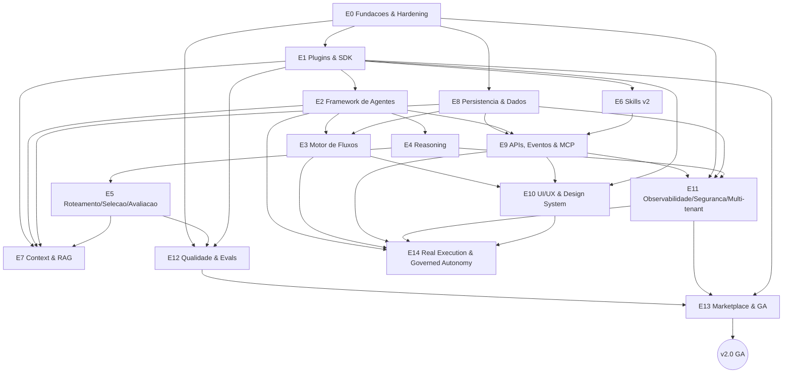
```mermaid
graph TD
    E0[E0 Fundacoes & Hardening]
    E1[E1 Plugins & SDK]
    E2[E2 Framework de Agentes]
    E3[E3 Motor de Fluxos]
    E4[E4 Reasoning]
    E5[E5 Roteamento/Selecao/Avaliacao]
    E6[E6 Skills v2]
    E7[E7 Context & RAG]
    E8[E8 Persistencia & Dados]
    E9[E9 APIs, Eventos & MCP]
    E10[E10 UI/UX & Design System]
    E11[E11 Observabilidade/Seguranca/Multi-tenant]
    E12[E12 Qualidade & Evals]
    E13[E13 Marketplace & GA]
    E14[E14 Real Execution & Governed Autonomy]

    E0 --> E1
    E0 --> E8
    E1 --> E2
    E1 --> E6
    E2 --> E3
    E2 --> E4
    E4 --> E5
    E8 --> E3
    E1 --> E7
    E2 --> E7
    E8 --> E7
    E5 --> E7
    E8 --> E9
    E9 --> E11
    E2 --> E9
    E6 --> E9
    E3 --> E10
    E9 --> E10
    E1 --> E10
    E0 --> E11
    E8 --> E11
    E4 --> E11
    E0 --> E12
    E5 --> E12
    E1 --> E12
    E12 --> E13
    E11 --> E13
    E1 --> E13
    E13 --> GA((v2.0 GA))
    E2 --> E14
    E3 --> E14
    E9 --> E14
    E11 --> E14
    E10 --> E14
```

---

### 18.9 Release Waves

The sequencing is delivered in three cumulative waves. Each wave has **content**
(epics/stories that go in) and **exit criteria** (gate to advance).

#### v2.0-alpha — "usable extensible core"

| Item | Description |
| --- | --- |
| **Objective** | Prove the small core + pluggable edges end-to-end in local-first mode. |
| **In Scope** | **E0** (complete); **E1** (Plugin Host, SDK, manifest, isolation); **E2** (Agent Manifest, Agent Registry, agent-as-plugin); **E3** graph/checkpointing/human-in-the-loop stories (the visual editor can stay minimal); **E8-S1/E8-S2** (multi-tenant schema + event store); **E9-S1** (minimal Control Plane API /v2); **E12-S1** (test pyramid) and the start of **E12-S2** (contract tests for already-existing extension points). |
| **Exit Criteria** | (1) A declarative flow executes an agent-plugin end to end with durable state and event-store replay; (2) green contract test for the E1/E2/E3 extension points; (3) local-first mode (SQLite + provider stub) runs without external dependencies; (4) core coverage ≥ 85%; (5) basic traces emitted per step. |

#### v2.0-beta — "complete platform in controlled production"

| Item | Description |
| --- | --- |
| **Objective** | Complete intelligence, context, data, API, UI, security, and quality capabilities for real controlled operation. |
| **In Scope** | **E4** (Reasoning); **E5** (Router & Selector + Evaluation Service); **E6** (Skills v2); **E7** (Context & RAG with pgvector and hybrid retrieval); **E8-S3/E8-S4** (artifacts + backup/RPO/RTO); **E9-S2/S3/S4** (streaming, event catalog, MCP); **E10** (Design System, key screens, visual flow editor, pluggable panels); **E11** (OpenTelemetry, RBAC, multi-tenant, quotas/budgets, runbooks); **E12-S2/S3/S4** (complete contract tests, agent evals, quality gates); **E14** (real task execution, permission/approval policy engine with approval/auto/hybrid modes, governed sandbox runners, Web UX for approval, governed interactive shell, `autodev` CLI install — *new epic, English*); **E15/E16/E17** (frontend redesign — v2 design language and Execution Control Center app shell, `/v2` API enablement for chat/plans/patches/extensions, and Control Center screens aligned to the prototype — *new epics, English*); **E32–E35** (Beta slice of the container-first isolated execution environment, secrets governance, global packaging/installation, and Beta readiness gates — *new epics, English*; ADR-013/014/015 Accepted). |
| **Exit Criteria** | (1) Real plan→code→apply patch→validate in sandbox→evaluate flow executes with RBAC, fail-closed budgets, and end-to-end traces; (2) hybrid retrieval reaches p95 < 300 ms and baseline recall; (3) run streaming starts in < 1 s; (4) all extension points have a green contract test and quality gates block merge; (5) UI WCAG 2.2 AA on key screens and flow editor with round-trip; (6) backup/restore validated (RPO ≤ 5 min, RTO ≤ 30 min) in staging; (7) v2 design language (tokens, typography) and the Execution Control Center app shell (E15) adopted, with legacy pages migrated to the tokens/Radix kit; (8) `/v2` API parity (E16) for chat/execution timeline, plans with approval gates, patches (review/apply), and extensions/provider config, consumed exclusively by the new screens; (9) Control Center screens (E17: chat, plans, patches, sessions/config, extensions, flow builder) implemented inside the E15 shell and matching the prototype in `layout_prototype_brainstorm/`; (10) real task execution runs by default in a fail-closed isolated environment (container-first, local fallback only with explicit `AUTODEV_SANDBOX_ALLOW_LOCAL=1`), with default-deny network/filesystem policy, and the backend/profile decision recorded durably and auditably on every execution (E32); (11) no secret is ever returned in the clear by any API, log, event, trace, diff, or artifact — only by scoped reference, with exact-value redaction applied before any persistence, and a leak fixture demonstrably detected and audited (E33); (12) an installation on a clean environment (without a repository checkout) produces an operational `autodev` whose version is reported by `autodev --version`, with installation steps documented and verified, and an upgrade between two versions preserves data under the schema *compatibility check* (E34). Evidence map per criterion (fact vs. recommendation, per E35-S1-T3): `docs/v2_platform/beta_gap_analysis.md` §11. |

#### v2.0-GA — "general availability"

| Item | Description |
| --- | --- |
| **Objective** | Open the Marketplace and declare general availability with SLO, security, and upgrade-support guarantees. |
| **In Scope** | **E13** complete (publication/installation, signing/verification, GA readiness); final hardening; v1 upgrade migration; release notes. |
| **Exit Criteria** | (1) End-to-end publication and installation of a verified plugin (signature + SBOM); (2) 99.9% Control Plane SLO and read p95 < 300 ms under load test (≥ 100 concurrent runs per reference node); (3) RPO ≤ 5 min / RTO ≤ 30 min proven in production; (4) signed GA checklist (SLOs, security, docs, backups, evals); (5) v1→v2 upgrade path documented and tested; (6) GA release published with notes. |

#### v2.1 — "Spec & Harness" *(new wave, authored in English)*

| Item | Description |
| --- | --- |
| **Objective** | Add the spec-driven development + agent-harness layer on top of the GA platform: specs as first-class governed artifacts, a compiler from requirements to executable work, mechanical verification (executable acceptance + drift enforcement), the harness as a named loop-engineering unit, and the two Studio surfaces (spec authoring, extension building). See §22 and RFC-007. |
| **In Scope** | **E20** (Spec Core: constitution, `spec.yaml`, registry, deltas, `/v2/specs`, Spine context provider); **E21** (Spec Compiler: scoping, requirements→design→tasks with waves, task-to-flow compilation, traceability graph); **E22** (Spec Verification: acceptance compiler, requirement-targeted evals, drift gate, spec+code coupling tiers, evidence bundles); **E23** (Harness Engine: `harness.yaml`, loop policies, durable loop state, parallel isolation/race, `/v2/harnesses`); **E24** (Spec Studio UI); **E25** (Extension Studio). E20-S1/S2 may start before the GA gate (additive, no v2.0 exit criterion touched); E22/E23 execution-dependent stories are gated on **E14** and **E12** landing first. |
| **Exit Criteria** | (1) A spec authored (or imported) through `/v2/specs` compiles to an approved task graph and executes end to end as Flow Engine runs with full requirement↔task↔run↔patch traceability; (2) acceptance scenarios of a reference project run as real sandbox tests and gate "requirement satisfied" (no model self-approval anywhere); (3) the drift gate blocks a patch that changes spec'd behavior without a matching spec delta (HARD tier) and records waivers; (4) a harness run demonstrates every typed result state, crash-resume, and a candidate race with a gate/eval-chosen winner; (5) an extension is built from an extension spec to a published, gate-evidenced version entirely inside the platform; (6) every new extension point (`loop_policy`, spec context provider profile) has a green mandatory contract test; (7) both Studios operate exclusively over `/v2` (API-first, §2.13) and meet WCAG 2.2 AA. |

#### v2.2 — "Concept Integration" *(new wave, authored in English)*

| Item | Description |
| --- | --- |
| **Objective** | Integrate the remaining state-of-the-art concepts identified by the July 2026 platform/literature evaluation (RFC-008), keeping the platform model-agnostic: context engineering as runtime contract, execution-grounded test-time compute, durable environments with self-verification, compounding memory, cost governance, and verified dependency specs. See §23 and RFC-008. |
| **In Scope** | **E26** (Runtime Context Engineering: cache invariants + metric, condensers, tool masking, external memory); **E27** (Execution-Grounded Verification: best-of-N + execution selection, multi-verifier + calibrated judges, cross-model oracle, property oracles, hardening + eval methodology); **E28** (Execution Environments: machine snapshots, tiered isolation with a microVM class, browser self-verification, code-mode MCP); **E29** (Durable Learning: knowledge library, ACE curation, skill packs, repo knowledge); **E30** (FinOps: estimation, hierarchical caps + ceilings + kill switches, draft/final tiers, per-surface metering); **E31** (Library Spec Registry: dependency specs, verified acquisition, anti-hallucination retrieval, sharing). E26-S1 and E30-S1 may start before the v2.1 gate (additive, no exit criterion touched); E27/E28 execution-dependent stories are gated on **E14** and **E12** landing first — the v2.2 critical path runs through finishing E14, E12, and E11. |
| **Exit Criteria** | (1) A long-horizon harness run shows the measured cache-hit-rate metric, at least one condensation event, and durable-memory reconstruction after a fresh-context iteration, at documented lower input-token cost than the uncompacted baseline; (2) a candidate set of N patches is generated, execution-verified, and resolved to one winner with the composed verifier trace (including a distinct-provider oracle verdict where two providers are configured) persisted and inspectable via `/v2`; (3) a reward-hacking fixture (candidate edits a test to pass) is rejected fail-closed, and a tautological acceptance suite is flagged by the weak-oracle check; (4) a harness iteration resumes from a machine snapshot with measured setup-time savings, and untrusted generated code demonstrably executes under the stronger isolation class; (5) a UI-affecting patch carries agent-produced browser evidence in its bundle; (6) a repeated task class shows measured improvement attributable to knowledge-library hits, with every promoted playbook delta traceable to its evidence; (7) every plan approval and harness start surfaces a cost estimate; a runaway-retry fixture stops at its checkpoint ceiling with a typed state; a tenant-level kill switch halts descendant runs auditably; (8) a hallucination eval demonstrates the registry-on vs registry-off delta for a pinned dependency, with every `verified` claim traced to a sandbox run; (9) every new extension point (`condenser`, `cost_estimator`) has a green mandatory contract test, and all new surfaces (`/v2/estimates`, `/v2/snapshots`, `/v2/knowledge`, `/v2/library-specs`) are exercised end to end API-first (§2.13). |

---

### 18.10 Governance via DoR/DoD and Criteria Across the State Flow

The **DoR** and **DoD** and the **Functional/Non-Functional Criteria** are defined at the
**Story level** (the unit of value with acceptance criteria); the
**Subtasks** inherit these criteria and apply the Appendix templates
(checklists H/I and template J). They are not passive documentation: they **govern**
each stage (epic) and story and connect directly to the **state flow**
defined in subsection 18.1.
A story only transitions from *Backlog/Ready* to *In Execution* when its
**DoR** is fully satisfied (dependencies resolved, contracts and ADRs
approved, environments provisioned) — the same gate that subsection 18.1 describes for
work intake. During execution, the **Functional Criteria** define the
behavior to be demonstrated, and the **Non-Functional Criteria** (the
global targets from §6: latency, availability, coverage ≥ 85%, WCAG 2.2 AA, fail-closed
budgets, RPO/RTO, tenant isolation) are measured and observed via
traces/metrics emitted by each `step`. The transition to *Done* requires a green
**DoD** — including the **Validation Gates** and **contract tests** from E12,
which block any merge/publication outside of policy. Thus, the same
DoR→(FC+NFC)→DoD pair that governs a story scales, by composition, to
govern the epic and finally the **exit criteria for each release
wave**, keeping the auditable and reproducible chain described in the state
flow of subsection 18.1 — from the smallest `Step` to the GA gate.


---

## 19. Governance, Versioning and Compatibility

This section defines how AutoDev Architect v2.0 versions its artifacts, ensures
compatibility between the core and extensions, conducts technical and community
decisions, and evolves predictably. The goal is to allow a community to publish
and maintain **plugins**, **agents**, and **skills** in the **Marketplace** without
surprise breakage, honoring the principle of **stable, versioned contracts** (E1) and
the **APIs, Events & MCP** surface (E9).

### 19.1 SemVer Applied to All Artifacts

Every versionable artifact adopts **SemVer** (`MAJOR.MINOR.PATCH`), with uniform
semantics: **MAJOR** for incompatible changes, **MINOR** for backward-compatible
additions, **PATCH** for backward-compatible fixes. The table below sets
what constitutes a break (MAJOR bump) per artifact type.

| Artifact | Version source | What is MAJOR (break) | What is MINOR (additive) | What is PATCH |
| --- | --- | --- | --- | --- |
| **Platform (core)** | Repository release | Incompatible removal/change of an extension point, SDK contract, or persisted schema | New extension point, new optional field, new core capability | Bug fix without changing the contract |
| **Plugin** | `plugin.yaml` | Incompatible change to the exposed surface or to the minimum `hostApi` | New feature/extension added, new optional field | Internal fix without changing IO |
| **Agent** | `agent.yaml` | Incompatible IO schema change, removal of a declared capability | New capability, new optional output field | Prompt/policy adjustment without changing the IO contract |
| **Skill** | `skill.yaml` | Incompatible IO change, new mandatory permissions, trigger removal | New optional parameter, new additive output | Deterministic fix without changing IO |
| **Flow** | `flow.yaml` | Change to the flow's input/output contract or removal of a public node | New optional node/branch, new additive conditional edge | Adjustment that does not change observable semantics |
| **Eval** | `eval.yaml` | Rubric/metric change that invalidates historical comparison | New test case, new additive metric | Dataset fix without affecting baseline |
| **API (`/v2`)** | Route prefix + `schemaVersion` | Incompatible removal/change of an endpoint or type | New endpoint, new optional field on a type | Fix without changing the contract |
| **Events** | Name + payload `schemaVersion` | Field removal or type/semantics change | New optional field, new event type | Emission fix |

**Golden rule for extensions:** a plugin/agent/skill depends on **contracts**
(extension points, IO schemas, events), never on core internals. Compatibility
is declared explicitly, not assumed.
### 19.2 Host↔plugin compatibility matrix (`hostApi` range)

The coupling between the core and an extension is mediated by **hostApi** — the
version of the extension point contract exposed by the **Plugin Host** (E1). Each
plugin declares the supported range in its manifest:

```yaml
# plugin.yaml (trecho)
id: acme/skill-jira-sync
version: 1.4.2
hostApi: ">=2.0 <3.0"   # faixa SemVer de contratos do core aceita
```

On install/load, the Plugin Host resolves the range against the runtime's
effective `hostApi`. The resolution is **fail-closed**: incompatibility prevents
activation and emits `plugin.rejected` with a reason.

Compatibility matrix (host = core's `hostApi` version; plugin = declared range):

| host `hostApi` → / plugin declared range ↓ | host `2.0.x` | host `2.3.x` | host `2.9.x` | host `3.0.x` |
| --- | --- | --- | --- | --- |
| `">=2.0 <3.0"` | Compatible | Compatible | Compatible | Rejected (incompatible MAJOR) |
| `">=2.3 <3.0"` | Rejected (host below minimum) | Compatible | Compatible | Rejected |
| `">=2.0 <2.5"` | Compatible | Compatible | Rejected (above the ceiling) | Rejected |
| `">=3.0 <4.0"` | Rejected | Rejected | Rejected | Compatible |
| absent/invalid | Rejected (invalid manifest) | Rejected | Rejected | Rejected |

Derived rules:

- Within the same host MAJOR, MINORs are additive: a plugin that works on `2.0`
  continues to work on `2.9` if its range covers the interval.
- A new host MAJOR (`3.0`) only loads plugins whose range includes it; migration
  requires explicit review by the author.
- The host offers an optional **compatibility mode** for a support period (see
  19.4), allowing extensions from the previous MAJOR to be loaded under a
  declared shim.
- The Marketplace displays the `hostApi` range of each published version and
  flags when an installed version is no longer compatible with the current host.

### 19.3 RFC and ADR Process

Significant changes follow two complementary instruments, whose templates are
in the appendix (**section 21**):

- **RFC (Request for Comments)** — a formal change proposal for open discussion,
  used **before** changes that affect contracts, extension points, `/v2` APIs,
  events, the data model, or security policies. Cycle:
  `Draft → Under discussion → Accepted/Rejected → Implemented`. An accepted RFC
  references the impacted epic(s) and the resulting stories.
- **ADR (Architecture Decision Record)** — an immutable record of a decision
  made and its context/consequences, created when the decision is finalized
  (often upon accepting an RFC). ADRs are numbered sequentially, versioned in
  the repository, and never rewritten: changes are made via a new ADR that
  **supersedes** the previous one.

Trigger: every change that results in a **MAJOR** bump of any artifact in the
table in 19.1 requires an accepted RFC and a corresponding ADR. MINOR/PATCH
changes do not require an RFC, but MINOR changes to public contracts must
record a lightweight ADR.

### 19.4 Deprecation Policy and Support Windows

The platform communicates breaking changes in advance and maintains
compatibility through predictable windows:

- **N-1 major support:** the core supports the current MAJOR and the previous
  one. When `N` is released, `N-1` enters maintenance (security/critical fixes
  only) for at least **6 months** or **one MINOR cycle**, whichever is longer.
- **Deprecation cycle:** a contract marked as `deprecated` remains functional
  for at least **one MINOR** before it can be removed in a MAJOR. Deprecation
  is announced via changelog, the `deprecated` attribute in the schema/manifest,
  and an observable `*.deprecated` event.
- **Runtime warnings:** the Plugin Host and the Control Plane API emit
  structured warnings (trace + log + `Deprecation`/`Sunset` header in `/v2`
  responses) when a consumer uses a deprecated contract.
- **Compatibility mode:** during the N-1 window, shims allow extensions from the
  previous MAJOR to operate; the mode is opt-in, auditable, and disabled by
  default in environments that require only current contracts.
- **Guided migration:** each MAJOR ships with a migration guide and, when
  feasible, scripts/codemods; data migrations are versioned and reversible when
  possible (aligned with RPO/RTO targets).

### 19.5 OSS Governance

Being **OSS-first and self-host**, the project defines open roles and
processes:

- **CONTRIBUTING** — the single contribution guide (venv setup, code standards,
  mandatory tests/contract tests for extension points, PR flow, DCO/sign-off
  requirement, and commit signing). Style and handoff reference kept in sync
  with `CLAUDE.md`/`AGENTS.md`.
- **Maintainer roles:**
  - *Contributor* — opens issues/PRs; no merge permission.
  - *Reviewer* — reviews and approves PRs in designated areas.
  - *Maintainer* — merge, triage, releases; responsible for one or more
    subsystems.
  - *Core/Steering* — decides contested RFCs, defines roadmap and versioning
    policies; guardian of the core contracts.
- **Review process:** every PR requires at least **one Reviewer approval** (two
  for changes to contracts/security), green CI (lint, tests, contract tests,
  regression evals when applicable), and no objections from **CODEOWNERS**.
  Contract changes require a referenced RFC.
- **CODEOWNERS:** the `CODEOWNERS` file maps paths (e.g., SDK, extension points,
  `/v2` API, event schemas, migrations) to maintainers; review by these owners
  is mandatory for merges in the covered areas.
- **Security:** responsible disclosure policy (SECURITY.md), embargo and fix
  window; security releases may be backported to MAJOR N-1 during the support
  window.

### 19.6 Flow, Agent, and Skill Versioning and Migration

Flows, agents, and skills are **declarative and versioned** (E1/E9) and coexist
in multiple versions in the **Agent Registry** and **Skill Registry**:

- **Immutability per version:** a published version is immutable; fixes
  generate a new SemVer version. Runs record the exact version used of each
  flow/agent/skill to guarantee **determinism and replay**.
- **Range resolution:** flows reference agents/skills by id + SemVer range
  (e.g., `autodev/agent-coder@^2.1`), resolved at run creation and "frozen" in
  the run's durable state.
- **Migration of running flows:** active runs remain on the version they
  started with; migration to a new flow version is explicit (new run or
  declared migration step), avoiding semantic changes to in-progress runs.
- **Definition migration:** MAJOR upgrades of agent/skill require dependent
  flows to update their range; the Registry flags incompatibilities and CI
  runs **contract tests** and **evals** to detect regressions before promotion.
- **Coexistence:** multiple MAJORs of the same agent/skill can coexist in the
  Registry during the support window, enabling gradual migration.

### 19.7 Evolution of this Reference Document

This document is itself a governed artifact:

- **Owner:** the *Core/Steering* group owns the document; each section has an
  author/maintainer responsible for keeping it aligned with the **canonical
  brief** (glossary, components, and epic ids).
- **Versioning:** the document adopts its own SemVer, tied to the platform's
  MAJOR/MINOR; contract changes described here are only merged after an
  accepted RFC and corresponding ADR.
- **Review cadence:** a consolidated review each platform **MINOR** and a
  mandatory review each **MAJOR**; point fixes (document PATCH) can be merged
  continuously via PR with CODEOWNERS approval for the section.
- **Traceability:** every architectural behavior change references the
  epic/story and the ADR that originated it, keeping the document as a
  faithful source of the platform's state.

### 19.8 Acceptance Criteria

**Functional**

- Every artifact (platform, plugin, agent, skill, flow, eval, API, event) has a
  valid SemVer version declared in its manifest/schema.
- The Plugin Host resolves the `hostApi` range at install/load and **rejects
  (fail-closed)** incompatible extensions, emitting a rejection event with a
  reason.
- Deprecated contracts emit a structured warning at runtime (trace/log and
  `Deprecation`/`Sunset` headers in the `/v2` API) and remain functional for at
  least one MINOR.
- Changes that cause a MAJOR bump have an accepted RFC and linked ADR,
  referencing the templates in section 21.
- The Registry keeps versions immutable and allows coexistence of multiple
  MAJORs of agents/skills during the support window; runs record the exact
  version used.
- PRs in paths covered by `CODEOWNERS` are only merged with owner approval and
  green CI (including contract tests for extension points).

**Non-functional**

- **N-1 major** support guaranteed for at least 6 months or one MINOR cycle
  (whichever is longer), with backported security fixes.
- `hostApi` compatibility resolution is deterministic and reproducible from the
  manifest, without consulting core internals.
- Each MAJOR publishes a migration guide; data migrations are versioned and
  reversible when possible, respecting RPO ≤ 5 min and RTO ≤ 30 min.
- Contract tests for extension points are mandatory in CI (block merge) and
  cover `hostApi` range compatibility.
- The reference document is reviewed each MINOR and revalidated each MAJOR,
  with owner and section responsibles explicitly assigned.


---

## 20. Success Metrics and KPIs

This section defines the canonical set of KPIs (Key Performance Indicators)
that measure the success of AutoDev Architect v2.0 across the dimensions of
**product**, **quality**, **performance**, **cost**, **reliability**, and
**developer experience (DX)**. The targets are consistent with the brief's
global non-functional targets (section 6) and all indicators are instrumented
through the infrastructure delivered by **E11 — Observability, Security &
Multi-tenant** (OpenTelemetry: traces, metrics, and Event Bus events) and fed
back by the quality cycle of **E12 — Quality & Evals** and **E13 —
Marketplace & GA**.

Measurement principles:

- **Native observability as source** — no KPI depends on manual collection;
  all data derives from OpenTelemetry traces/metrics, the Event Bus, the State
  Store (PostgreSQL), or the Evaluation Service.
- **Segmentation by tenant** — all operational and cost KPIs are dimensionable
  by `tenant`, respecting multi-tenant isolation (E11).
- **Determinism and auditability** — quality KPIs refer to runs with a
  persisted Trace, enabling replay and reconciliation.
- **Versioned targets** — the targets below make up the GA baseline (E13) and
  evolve via ADR/RFC.

### 20.1 Product KPIs

Measure adoption, ecosystem growth, and value delivered to the user.

- **Active users (WAU/MAU)** — distinct users who start at least one Run per
  weekly/monthly window. **GA target:** MoM growth ≥ 15% in the first two
  quarters post-GA. **Instrumentation:** `run.started` events correlated to
  identity (Control Plane API / RBAC), aggregated by `tenant` in the State
  Store.
- **Plugins published on the Marketplace** — cumulative number of Plugins
  (including agents/skills-as-plugin) published and verified on the
  Marketplace (E13). **GA target:** ≥ 25 plugins published in the first
  quarter post-GA, with ≥ 10 from authors external to the core.
  **Instrumentation:** `plugin.published` / `plugin.installed` Event Bus
  events + Marketplace catalog.
- **Retention (W4/M3)** — proportion of active users/tenants that remain
  active after 4 weeks (W4) and 3 months (M3). **GA target:** W4 retention ≥
  40% and M3 ≥ 25% for tenants with completed onboarding. **Instrumentation:**
  cohorts derived from `run.started` by identity/tenant in the State Store.
- **Time to first value (TTFV)** — median time between a tenant's first access
  and the successful completion of the first Run that produces an applied
  Patch or passes a Validation Gate. **GA target:** median < 30 min in
  local-first mode (SQLite/stub). **Instrumentation:** delta between the first
  session event and the first `run.completed` with an accepted result.

### 20.2 Quality KPIs

Measure the effectiveness of the agents, routing, and the patch/validation
flow. Fed by the **Evaluation Service (E5)** and the **CI quality gates
(E12)**.

- **Task success rate** — fraction of Runs that reach the objective and pass
  all applicable Validation Gates, without corrective human intervention.
  **GA target:** ≥ 75% on reference suites. **Instrumentation:** final
  Run/Step status in the State Store + Validation Gate results.
- **pass@k** — probability that at least one of `k` attempts passes the
  reference evals (datasets + rubrics from the Evaluation Service). **GA
  target:** pass@1 ≥ 0,60 and pass@5 ≥ 0,85 on the canonical dataset.
  **Instrumentation:** Evaluation Service executions (E12), stored with the
  Eval id/version.
- **Eval regressions** — number of evals whose score drops beyond the
  threshold between two versions (of core, agent, or plugin). **Target:** 0
  blocking regressions released to GA; regressions fail the CI quality gate.
  **Instrumentation:** comparison of Evaluation Service executions in CI
  (E12), time series by Eval id.
- **Accepted patches rate** — fraction of generated Patches that are applied
  successfully (dry-run + path guard) and pass the Validation Gate, versus
  total proposed Patches. **GA target:** ≥ 80%. **Instrumentation:** Patch
  application events + Validation Gate result, per run/tenant.

### 20.3 Performance KPIs

Measure latency and throughput of the Control Plane and the execution plane,
aligned with section 6 of the brief.

- **p95 latency (Control Plane read)** — p95 of Control Plane API `/v2` read
  endpoints. **Target:** < 300 ms. **Instrumentation:** OpenTelemetry latency
  histograms per route (E11).
- **Streaming time-to-first-token** — time until streaming starts for a Run.
  **Target:** < 1 s. **Instrumentation:** OpenTelemetry span between run
  request and first chunk emitted.
- **Run throughput** — concurrent Runs sustained per reference worker node and
  Runs completed per minute. **Target:** ≥ 100 concurrent runs per reference
  node, with horizontal scaling of execution workers. **Instrumentation:**
  queue/worker metrics (Redis) and `run.completed` counters per window (E11).

### 20.4 Cost KPIs

Measure LLM resource consumption per task and per tenant, the basis for
quotas and budgets (E11).

- **Tokens per task** — tokens (prompt + completion) consumed per Run,
  segmentable by agent, Reasoning Strategy, and model. **Target:** within the
  run's default Budget; alert at 80% of the ceiling and fail-closed at the
  limit. **Instrumentation:** counters emitted by the Agent Runtime/Reasoning
  Engine, aggregated by run/tenant.
- **USD per task** — estimated monetary cost per Run, derived from tokens ×
  provider pricing table. **Target:** within the run's cost Budget (USD);
  respects per-tenant quotas. **Instrumentation:** Agent Runtime cost metric +
  versioned pricing table, per tenant.
- **Cost per tenant (window)** — sum of USD/tokens per tenant per period,
  compared against the contracted quota. **Target:** consumption ≤ tenant
  quota; no silent overruns. **Instrumentation:** aggregation by `tenant` in
  the State Store + quotas/budgets subsystem (E11).

### 20.5 Reliability KPIs

Measure service objective compliance and operational health (E11).

- **SLO compliance (availability)** — effective Control Plane availability in
  production against the SLO. **Target:** ≥ 99,9%. **Instrumentation:**
  OpenTelemetry availability/health metrics, SLO windows per service.
- **Error budget consumed** — fraction of the error budget (SLO complement,
  ~0,1%/month) already consumed in the window. **Target:** < 100% in the
  window; an overrun triggers a change freeze and runbook. **Instrumentation:**
  burn rate calculation from SLO metrics (E11).
- **RPO/RTO in production** — maximum data loss (RPO) and recovery time (RTO)
  validated in recovery exercises. **Target:** RPO ≤ 5 min and RTO ≤ 30 min.
  **Instrumentation:** State Store backup/replication telemetry + drill
  records.

### 20.6 Developer Experience (DX) KPIs

Measure the friction of extending the platform — central to the vision of
"small core, rich edges" (E1/E13).

- **Time to create a plugin/agent (scaffold → local)** — median time from the
  SDK `scaffold` to a Plugin/Agent running locally and passing the contract
  tests. **Target:** < 30 min for an author following the guide.
  **Instrumentation:** optional SDK/CLI telemetry + DX measurements in
  onboarding.
- **Time to publish on the Marketplace** — median time between a locally
  functional plugin and its publication/verification on the Marketplace
  (signing + E13 gates). **Target:** < 1 business day, with an automated
  verification pipeline. **Instrumentation:** interval between first valid
  build and `plugin.published` on the Event Bus (E13).
- **Contract test approval rate (1st attempt)** — fraction of plugins that
  pass the extension point contract tests on the first submission.
  **Target:** ≥ 70%, signaling clear contracts and good DX.
  **Instrumentation:** CI contract test results (E12) per submission.

### 20.7 Consolidated KPI Table

| KPI | Definition | Target | Instrumentation |
| --- | --- | --- | --- |
| Active users (WAU/MAU) | Distinct users who start ≥ 1 Run per week/month | MoM growth ≥ 15% (first 2 quarters post-GA) | `run.started` events + identity (RBAC), aggregated by tenant in the State Store (E11) |
| Plugins published on the Marketplace | Verified plugins published on the Marketplace | ≥ 25 in the 1st quarter post-GA (≥ 10 external) | `plugin.published`/`plugin.installed` events + Marketplace catalog (E13) |
| Retention (W4/M3) | Users/tenants still active after 4 weeks / 3 months | W4 ≥ 40%; M3 ≥ 25% | Cohort analysis over `run.started` by tenant (State Store, E11) |
| Time to first value (TTFV) | From 1st access to 1st Run with applied Patch/Validation Gate ok | Median < 30 min (local-first) | Delta between 1st session event and 1st accepted `run.completed` |
| Task success rate | Runs that reach the objective and pass the Validation Gates without human correction | ≥ 75% on reference suites | Run/Step status + Validation Gate in the State Store |
| pass@k | Prob. of ≥ 1 of k attempts passing the reference evals | pass@1 ≥ 0,60; pass@5 ≥ 0,85 | Evaluation Service (E5/E12), by Eval id/version |
| Eval regressions | Evals with a score drop above the threshold between versions | 0 blocking regressions in GA | Comparison of Evaluation Service executions in CI (E12) |
| Accepted patches rate | Patches applied (dry-run/guard) and approved in the Validation Gate / proposed | ≥ 80% | Patch application events + Validation Gate per run/tenant |
| p95 latency (read) | p95 of the Control Plane API `/v2` read endpoints | < 300 ms | OpenTelemetry latency histograms per route (E11) |
| Time-to-first-token (streaming) | Time until streaming starts for a Run | < 1 s | OpenTelemetry span request → 1st chunk |
| Run throughput | Concurrent runs per reference node and completed/min | ≥ 100 concurrent per node (horizontal scale) | Queue/worker metrics (Redis) + `run.completed` (E11) |
| Tokens per task | Tokens (prompt+completion) per Run, by agent/strategy/model | Within the Budget; alert at 80%, fail-closed at the ceiling | Agent Runtime/Reasoning Engine counters per run/tenant |
| USD per task | Estimated cost per Run (tokens × price) | Within the cost Budget; respects the tenant quota | Agent Runtime cost metric + versioned pricing table |
| Cost per tenant (window) | Sum of USD/tokens per tenant per period vs. quota | Consumption ≤ quota; no silent overruns | Aggregation by tenant (State Store) + quotas/budgets (E11) |
| SLO compliance | Effective Control Plane availability vs. SLO | ≥ 99,9% | OpenTelemetry availability/health metrics (E11) |
| Error budget consumed | Fraction of the error budget (~0,1%/month) consumed in the window | < 100%; overrun freezes changes | Burn rate over SLO metrics (E11) |
| RPO/RTO | Max. data loss and recovery time validated | RPO ≤ 5 min; RTO ≤ 30 min | Backup/replication telemetry (State Store) + drills |
| Time to create plugin/agent | From SDK scaffold to running locally + contract tests ok | < 30 min | SDK/CLI telemetry + onboarding measurements (E1) |
| Time to publish on the Marketplace | From locally functional plugin to publication/verification | < 1 business day (automated pipeline) | Interval to `plugin.published` on the Event Bus (E13) |
| Contract test approval (1st attempt) | Plugins that pass the contract tests on the 1st submission | ≥ 70% | CI contract test results per submission (E12) |


---

## 21. Appendices - Templates and Checklists

This appendix gathers canonical, ready-to-copy templates. All follow the
brief's conventions: **ids** in `namespace/nome` format (kebab-case),
**version** in SemVer `MAJOR.MINOR.PATCH`, core compatibility declared via
`hostApi` (e.g., `">=2.0 <3.0"`), **events** in `dominio.entidade.acao`
format in the past tense, and **API contracts** under the `/v2` prefix with
`schemaVersion`. Declarative manifests are versioned and must pass schema
validation (contract tests) before being registered in their respective
registries.

### (A) Plugin Manifest — `plugin.yaml`

```yaml
# plugin.yaml — descriptor for a Plugin (a versioned package that lives at extension points).
# Loaded, isolated and managed by the Plugin Host.
schemaVersion: "1"                 # schema version of this manifest (independent of the plugin)

id: "acme/plugin-jira"             # canonical id: namespace/name in kebab-case (required, unique)
version: "1.4.2"                   # plugin SemVer MAJOR.MINOR.PATCH
name: "Jira Integration"           # human-readable name (UI/Marketplace)
description: "Syncs issues and subtasks with Jira Cloud."
publisher: "Acme Corp"             # publisher/author; shown in the Marketplace
license: "Apache-2.0"              # OSS-first license (SPDX id)
homepage: "https://github.com/acme/plugin-jira"

# Compatibility range with the core API (stable SemVer contracts).
# The Plugin Host refuses to load if the core version is outside the range.
hostApi: ">=2.0 <3.0"

# Extension Points implemented by this plugin.
# Each entry matches a typed interface exposed by the core.
extensionPoints:
  - type: "context-provider"       # e.g.: context-provider | reasoning-strategy | evaluator | router | selector | ui-panel
    entrypoint: "acme_plugin_jira.providers:JiraContextProvider"  # module:class (Python) or export (TS)
  - type: "ui-panel"
    entrypoint: "acme_plugin_jira.ui:JiraPanel"

# Declarative assets delivered by the plugin and registered in the registries.
provides:
  agents:  ["agent.yaml"]          # Packaged Agent Manifests (Agent Registry)
  skills:  ["skills/jira-sync.yaml"]  # Skill Manifests (Skill Registry)
  flows:   ["flows/triage.yaml"]   # Published declarative flows

# Explicit permissions (least privilege). No entry = denied by default.
permissions:
  network:                         # network egress requires an explicit allowlist
    egress:
      - "https://*.atlassian.net"
  secrets:                         # secrets the plugin can read (injected by the vault, never hardcoded)
    - "JIRA_API_TOKEN"
  filesystem: "none"               # none | read | read-write (sandbox scope)
  events:                          # Event Bus events the plugin may publish/subscribe to
    publish: ["plugin.jira.synced"]      # domain.entity.action in the past tense
    subscribe: ["run.step.completed"]

# Dependencies between plugins (resolved by the Plugin Host via SemVer).
dependencies:
  - id: "autodev/plugin-core-http"
    version: ">=1.0 <2.0"

# Configuration exposed to the operator (validated by JSON Schema on install).
configSchema:
  type: object
  required: ["baseUrl", "projectKey"]
  properties:
    baseUrl:    { type: string, format: uri }
    projectKey: { type: string, pattern: "^[A-Z][A-Z0-9]+$" }

# Publication/signing metadata (integrity verification in the Marketplace).
signing:
  algorithm: "cosign"              # signature verified on install (E13)
  publicKeyRef: "acme/keys/plugin-jira.pub"
```
### (B) Agent Manifest — `agent.yaml`

```yaml
# agent.yaml — declarative descriptor for an Agent (autonomous unit that receives a task,
# reasons, and produces output per the contract). Registered in the Agent Registry.
schemaVersion: "1"

id: "autodev/agent-coder"          # namespace/name in kebab-case
version: "2.1.0"                   # agent's SemVer
name: "Coder Agent"
description: "Generates and edits code, producing patches as a unified diff."
hostApi: ">=2.0 <3.0"              # compatibility range with the core

# Capabilities: skill contracts the Selector uses to match tasks with agents.
capabilities:
  - "code.generate"
  - "code.edit"
  - "patch.produce"

# Typed IO contract (validated on Agent Runtime input and output).
io:
  input:
    schemaVersion: "1"
    type: object
    required: ["task", "repoRef"]
    properties:
      task:    { type: string, description: "Description of the coding task." }
      repoRef: { type: string, description: "Repository/branch reference." }
      context: { type: array, items: { type: string }, description: "Context snippets (RAG)." }
  output:
    schemaVersion: "1"
    type: object
    required: ["patch", "summary"]
    properties:
      patch:   { type: string, description: "Unified diff to be applied by the Validation Gate." }
      summary: { type: string, description: "Human-readable summary of the changes (separate from control metadata)." }

# Default Reasoning Strategy and pluggable alternatives (Reasoning Engine).
reasoning:
  strategy: "plan-and-execute"     # react | plan-and-execute | reflection | debate
  allowedStrategies: ["react", "reflection"]

# Low-level Tools and reusable Skills the agent can invoke.
# The Agent Runtime mediates all access and applies least privilege.
tools:
  - "fs.read"
  - "fs.write"
  - "sandbox.run"                  # execution in the Execution Sandbox (no network by default)
skills:
  - id: "autodev/skill-run-tests"
    version: ">=1.0 <2.0"

# Model preferences (the Selector decides the final model by policy/cost).
model:
  preferred: "anthropic/claude-opus-4-8"
  fallbacks: ["anthropic/claude-sonnet-4-5"]

# Budgets enforced by the Agent Runtime (fail-closed on exceeding).
budgets:
  maxTokens: 200000
  maxCostUsd: 1.50
  maxWallClockSec: 300
  maxSteps: 25

# Guardrails: checks that block/correct outputs outside policy.
guardrails:
  - type: "output-schema"          # validates the output against io.output
  - type: "path-guard"             # patches restricted to allowed paths + dry-run
    allow: ["src/**", "tests/**"]
  - type: "secret-scan"            # blocks secret leakage

# Associated declarative policies (selection/routing/budget).
policies:
  - "autodev/policy-cost-aware"
```

### (C) Flow Definition — `flow.yaml`

```yaml
# flow.yaml — a declarative, versioned node graph that orchestrates agents/skills/tools/humans.
# Executed by the Orchestration Engine (checkpointing, retries, human-in-the-loop).
schemaVersion: "1"

id: "autodev/flow-feature-delivery"  # namespace/name in kebab-case
version: "1.0.0"                     # flow SemVer
name: "Feature Delivery"
description: "Plan → code → apply patch → validate → human review → evaluate."
hostApi: ">=2.0 <3.0"

# Triggers that start the flow. Emit run.* on the Event Bus.
triggers:
  - type: "message"                  # message | webhook | cron | event
  - type: "event"
    on: "flow.run.requested"         # domain.entity.action, past tense

# Typed run input (persisted in the Run's durable state).
input:
  schemaVersion: "1"
  type: object
  required: ["task", "repoRef"]
  properties:
    task:    { type: string }
    repoRef: { type: string }

# Defaults applied to all nodes (can be overridden per node).
defaults:
  retries:
    maxAttempts: 3                   # total number of attempts
    backoff: "exponential"           # fixed | exponential
    initialDelaySec: 2
  timeoutSec: 120                    # timeout per node activation (Step)

# Flow Nodes. Each node becomes a Step in the run.
nodes:
  - id: "plan"                       # agent-type node
    type: "agent"
    ref: "autodev/agent-planner@>=1.0 <2.0"  # ref with SemVer range
    input:
      task: "{{ flow.input.task }}"  # binding to flow state (template)

  - id: "code"
    type: "agent"
    ref: "autodev/agent-coder@2.1.0"
    timeoutSec: 300                  # override of the default timeout
    retries: { maxAttempts: 2, backoff: "exponential", initialDelaySec: 5 }

  - id: "apply-and-validate"         # skill-type node (deterministic)
    type: "skill"
    ref: "autodev/skill-apply-patch@>=1.0 <2.0"
    input:
      patch: "{{ nodes.code.output.patch }}"

  - id: "quality-gate"               # conditional node: evaluates state and branches
    type: "conditional"
    # The conditional edges below (in `edges`) govern the transition.

  - id: "human-review"               # human-in-the-loop node: pauses awaiting a decision
    type: "human"
    prompt: "Review the patch and the Validation Gate results. Approve the merge?"
    form:                            # schema for the human decision/edit
      schemaVersion: "1"
      type: object
      required: ["decision"]
      properties:
        decision: { type: string, enum: ["approve", "reject", "request-changes"] }
        notes:    { type: string }
    timeoutSec: 86400                # human SLA: 24h; on expiry, follows the on: timeout edge
    onTimeout: "escalate"            # edge label to follow if the human does not respond

  - id: "evaluate"                   # skill node that invokes the Evaluation Service
    type: "skill"
    ref: "autodev/skill-run-eval@>=1.0 <2.0"

  - id: "escalate"
    type: "skill"
    ref: "autodev/skill-notify@>=1.0 <2.0"

# Edges: transitions between nodes. Can be unconditional or conditional
# (governed by an expression/predicate over the flow state).
edges:
  - from: "plan"
    to: "code"
  - from: "code"
    to: "apply-and-validate"
  - from: "apply-and-validate"
    to: "quality-gate"

  # Conditional edges leaving the conditional node:
  - from: "quality-gate"
    to: "human-review"
    when: "{{ nodes['apply-and-validate'].output.testsPassed == true }}"
  - from: "quality-gate"
    to: "code"                       # fix loop if the Validation Gate fails
    when: "{{ nodes['apply-and-validate'].output.testsPassed == false }}"

  # Edges leaving the human node (by decision and by timeout):
  - from: "human-review"
    to: "evaluate"
    when: "{{ nodes['human-review'].output.decision == 'approve' }}"
  - from: "human-review"
    to: "code"
    when: "{{ nodes['human-review'].output.decision == 'request-changes' }}"
  - from: "human-review"
    to: "escalate"
    on: "timeout"                    # edge triggered when the human SLA expires

# Budgets for the whole run (fail-closed on excess; complements per-agent budgets).
budgets:
  maxCostUsd: 10.0
  maxWallClockSec: 3600
  maxTokens: 2000000

# Final consolidated output of the run.
output:
  schemaVersion: "1"
  type: object
  properties:
    merged:     { type: boolean }
    evalScore:  { type: number }
```

### (D) Skill Manifest — `skill.yaml`

```yaml
# skill.yaml — descriptor of a Skill (reusable function, deterministic or LLM-assisted,
# invocable by agents/flows). Registered in the Skill Registry.
schemaVersion: "1"

id: "autodev/skill-run-tests"      # namespace/name in kebab-case
version: "1.2.0"                   # SemVer of the skill
name: "Run Tests"
description: "Runs the project's test suite in the Execution Sandbox and returns the result."
hostApi: ">=2.0 <3.0"

kind: "deterministic"              # deterministic | llm-assisted
entrypoint: "autodev_skills.testing:run_tests"  # module:function (Python) or export (TS)

# Typed IO contract (validated on invocation).
io:
  input:
    schemaVersion: "1"
    type: object
    required: ["repoRef"]
    properties:
      repoRef: { type: string }
      command: { type: string, default: "pytest -q" }
  output:
    schemaVersion: "1"
    type: object
    required: ["testsPassed", "report"]
    properties:
      testsPassed: { type: boolean }
      report:      { type: string, description: "Test output/artifact (reference in the Artifact Store)." }

# Explicit permissions (least privilege; denied by default).
permissions:
  filesystem: "read"               # none | read | read-write
  network: "none"                  # sandbox without network by default
  sandbox: true                    # requires Execution Sandbox (hardened Docker)

# Dependencies on other skills (resolved via SemVer in the Skill Registry).
dependencies:
  - id: "autodev/skill-checkout"
    version: ">=1.0 <2.0"

# Triggers that expose/suggest the skill (composition in flows and to agents).
triggers:
  - "code.after-edit"
  - "flow.validation"

# Skill execution budgets.
budgets:
  timeoutSec: 300
  maxCostUsd: 0.10                 # relevant when kind == llm-assisted
```

### (E) Eval Specification — `eval.yaml`

```yaml
# eval.yaml — executable evaluation spec (dataset + rubric + metrics)
# offline/online by the Evaluation Service. Feeds the routing feedback loop (E5).
schemaVersion: "1"

id: "autodev/eval-coder-quality"   # namespace/name in kebab-case
version: "1.0.0"                   # eval SemVer
name: "Coder Agent Quality"
description: "Evaluates the quality of patches produced by agent-coder."
hostApi: ">=2.0 <3.0"

# Evaluated target (agent/flow/skill + version range).
target:
  type: "agent"                    # agent | flow | skill | router
  ref: "autodev/agent-coder@>=2.0 <3.0"

# Case dataset. Can be inline or reference an artifact in the Artifact Store.
dataset:
  source: "artifact://evals/coder/v1/cases.jsonl"  # or `inline:` for embedded cases
  format: "jsonl"
  splits:
    - name: "regression"
      count: 120
    - name: "smoke"
      count: 15
  # Each case must contain { input, expected? } consistent with the target's io.

# Rubric: scoring criteria (deterministic and/or LLM-as-judge).
rubric:
  criteria:
    - id: "compiles"
      description: "The patch applies and the project compiles/imports without error."
      type: "deterministic"        # verified via skill/sandbox
      weight: 0.3
    - id: "tests-pass"
      description: "The test suite passes after applying the patch."
      type: "deterministic"
      weight: 0.4
    - id: "code-quality"
      description: "Readability, cohesion and adherence to the repo's style."
      type: "llm-judge"            # LLM-as-judge on a 0..1 scale
      judgeModel: "anthropic/claude-opus-4-8"
      weight: 0.3

# Aggregated metrics emitted at the end of the run.
metrics:
  - name: "pass_rate"              # fraction of cases with score >= the case's threshold
    aggregation: "mean"
  - name: "weighted_score"        # rubric-weighted average
    aggregation: "mean"
  - name: "p95_cost_usd"
    aggregation: "p95"
  - name: "p95_latency_ms"
    aggregation: "p95"

# Thresholds: quality gates. Failure => blocks promotion/routing (CI quality gate).
thresholds:
  - metric: "pass_rate"
    op: ">="
    value: 0.90
  - metric: "weighted_score"
    op: ">="
    value: 0.80
  - metric: "p95_cost_usd"
    op: "<="
    value: 1.50

# Execution: offline (CI) and/or online (real traffic sampling).
execution:
  mode: "offline"                  # offline | online | both
  onlineSampleRate: 0.05           # sampling if mode includes online
  budgets:
    maxCostUsd: 25.0
    maxWallClockSec: 1800
```

### (F) ADR Template (Architecture Decision Record)

```markdown
# ADR-<NNN>: <Short decision title>

- **Status:** Proposed | Accepted | Rejected | Superseded by ADR-<NNN> | Obsolete
- **Date:** YYYY-MM-DD
- **Authors:** <name(s)>
- **Related epic:** E<n>  <!-- reference to the canonical list of epics -->
- **Supersedes/Relates to:** ADR-<NNN> (if applicable)

## Context
<!-- What is the problem? What forces (technical, product, cost, security)
     are at play? What constraints and non-functional requirements apply? -->

## Decision
<!-- What was the decision made? State it affirmatively and unambiguously.
     Align with the project's preferred decisions (OSS-first, PostgreSQL, Redis,
     pgvector, MinIO, tree-sitter, Docker, Next.js, FastAPI) when relevant. -->

## Alternatives considered
1. **<Alternative A>** — pros / cons / reason for rejection.
2. **<Alternative B>** — pros / cons / reason for rejection.

## Consequences
- **Positive:** <benefits, unlocked capabilities>
- **Negative / trade-offs:** <debt, risks, limits>
- **Impact on contracts:** <SemVer/hostApi change, migrations, compat.>

## Rollback plan
<!-- How to roll back if the decision proves wrong? Reversible migration? -->

## References
- RFC-<NNN>, issues, benchmarks, relevant links.
```

### (G) RFC Template (Request for Comments)

```markdown
# RFC-<NNN>: <Proposal title>

- **Status:** Draft | In review | Approved | Rejected | Deferred
- **Author(s):** <name(s)>          **Date:** YYYY-MM-DD
- **Reviewers:** <names/teams>
- **Epic(s):** E<n>                 **Stories:** E<n>-S<m> (if applicable)
- **Comment deadline:** YYYY-MM-DD

## Summary
<!-- 1 paragraph: what changes and why. -->

## Motivation
<!-- Problem, evidence, who is affected. Which guiding principle does this serve? -->

## Proposed design
<!-- Detailed description. Include contracts/schemas, canonical components
     affected (Control Plane API, Orchestration Engine, Plugin Host, ...),
     events (domain.entity.action) and manifest changes if any. -->

### Contracts and compatibility
- **API change:** <endpoints /v2, schemaVersion>
- **hostApi/SemVer change:** <MAJOR/MINOR/PATCH and impact on plugins>
- **Data migrations:** <versioned, reversible?>

## Alternatives considered
<!-- Discarded options and why. -->

## Impact
- **Security / RBAC / permissions:** <...>
- **Observability (traces/metrics/events):** <...>
- **Cost / budgets / quotas:** <...>
- **Accessibility (if UI):** WCAG 2.2 AA <...>
- **Performance / SLOs:** <p95, availability>

## Implementation and rollout plan
<!-- Phases, feature flags, migration strategy, GA. -->

## Open questions
<!-- Points requiring decision from the community/reviewers. -->
```
### (H) Definition of Ready (DoR) Checklist

```markdown
# Definition of Ready (DoR) — <Story/Subtask ID: E<n>-S<m>[-T<k>]>

Check every item before moving the item into execution. Mark inapplicable items N/A with a justification.

## Clarity and scope
- [ ] Objective and value described in 1-2 sentences, unambiguous.
- [ ] Scope delimited (what is in, what is out).
- [ ] Linked to the correct epic (E0-E13) and parent story.

## Criteria and contracts
- [ ] Functional acceptance criteria defined and testable.
- [ ] Applicable non-functional requirements identified (latency, security, cost, a11y).
- [ ] Affected contracts/schemas identified (io schema, /v2 schemaVersion, hostApi/SemVer).
- [ ] Impacted events named (domain.entity.action).

## Dependencies and technical readiness
- [ ] Dependencies (stories, plugins, services) identified and unblocked.
- [ ] Required data/environment/secrets available (or a plan to provide them).
- [ ] Required ADR/RFC exists (or the decision is recorded) when there is architectural impact.

## Risks and estimate
- [ ] Risks and assumptions listed, with initial mitigation.
- [ ] Estimate agreed by the team.
- [ ] Success metrics defined (how we'll know it worked).
```

### (I) Definition of Done (DoD) Checklist

```markdown
# Definition of Done (DoD) — <Story/Subtask ID: E<n>-S<m>[-T<k>]>

All applicable items must be checked for the item to be considered complete.

## Implementation and contracts
- [ ] All functional acceptance criteria met and demonstrated.
- [ ] Non-functional requirements met (p95 latency, budgets, a11y WCAG 2.2 AA when UI).
- [ ] Contracts versioned correctly (SemVer/hostApi/schemaVersion) with no unannounced break.
- [ ] Manifests (plugin/agent/skill/flow/eval) validate against their schema.

## Quality
- [ ] Unit and integration tests added/updated.
- [ ] Contract tests for extension points passing (mandatory).
- [ ] Core coverage >= 85% of lines maintained.
- [ ] Relevant evals executed and thresholds met.
- [ ] Lint, type-check, and CI quality gates green.

## Security, observability, and data
- [ ] Minimal permissions reviewed; no hardcoded secrets; sandbox with no network by default.
- [ ] RBAC applied where required.
- [ ] Traces/metrics/events emitted and verified.
- [ ] Migrations versioned and reversible when possible (RPO/RTO respected).

## Delivery and documentation
- [ ] Documentation updated in docs/ and the project root (behavior/architecture).
- [ ] ADR/RFC finalized/linked when there was an architectural decision.
- [ ] Code review approved; PR with a readable summary (kept separate from control metadata).
- [ ] Rollback/feature flag verified when applicable.
```

### (J) Story / Subtask Template

```markdown
# <E<n>-S<m>[-T<k>]> — <Story or subtask title>

- **Type:** Story | Subtask
- **Epic:** E<n> — <epic name>
- **Parent:** <E<n>-S<m>> (if subtask)
- **Owner:** <name>            **State:** Backlog | Ready | In progress | In review | Done

## Description / value
<!-- As a <persona>, I want <capability> so that <benefit>. 1-2 paragraphs. -->

## Functional acceptance criteria
- [ ] Given <context>, when <action>, then <observable result>.
- [ ] <...>

## Non-functional criteria
- [ ] **Latency/Performance:** <e.g. p95 read endpoint < 300 ms>.
- [ ] **Security:** <RBAC, explicit permissions, sandbox, secrets>.
- [ ] **Observability:** <traces/metrics/events: domain.entity.action>.
- [ ] **Cost/Budgets:** <token/USD/time ceilings; tenant quotas>.
- [ ] **Accessibility (if UI):** WCAG 2.2 AA; keyboard navigation.
- [ ] **Data reliability (if applicable):** RPO <= 5 min, RTO <= 30 min.

## Definition of Ready (DoR)
- [ ] Scope and value clear; linked to the epic.
- [ ] Testable acceptance criteria defined.
- [ ] Affected contracts/schemas and events identified.
- [ ] Dependencies unblocked; ADR/RFC exists if needed.
<!-- See the full checklist in (H). -->

## Definition of Done (DoD)
- [ ] Functional and non-functional criteria met.
- [ ] Tests + contract tests green; core coverage >= 85%.
- [ ] Evals/quality gates met; docs updated.
- [ ] Review approved; observability verified.
<!-- See the full checklist in (I). -->

## Dependencies
- **Blocked by:** <E<n>-S<m>, plugin/service, decision>.
- **Blocks:** <dependent items>.
- **Canonical components touched:** <Control Plane API, Orchestration Engine, Plugin Host, ...>.

## Risks and assumptions
- **Risk:** <description> — **Probability/Impact:** <L/M/H> — **Mitigation:** <action>.
- **Assumption:** <what we're assuming to be true>.

## Estimate
- **Size:** <story points / t-shirt (S/M/L/XL)>.
- **Confidence:** <low | medium | high>.

## Success metrics
- <product/technical metric that validates the item, e.g. run success rate, p95 reduction, eval score >= threshold>.
```

---

## 22. Spec & Harness Layer (v2.1)

*(New section, authored in English per the convention for post-§18.6 additions.
This is the architecture narrative for the "v2.1 — Spec & Harness" wave — epics
E20–E25, roadmap entries §18.7.12–§18.7.17, wave definition §18.9, layer
proposal RFC-007. It is additive: nothing here modifies the contracts defined
in §5–§14.)*

### 22.1 Purpose and posture

The v2.0 platform executes work (flows, budgets, checkpoints, approvals,
patches, sandbox validation) but has no first-class representation of
**intent**. This layer adds it: **specifications** (what the system shall do,
in a testable grammar) and **harnesses** (how agents iterate until the
specification is mechanically satisfied) become governed platform artifacts
with the same discipline as flows and evals — SemVer, published schemas,
registries, contract tests, `/v2` surfaces, and append-only events.

Posture (RFC-007): **spec-anchored, code-coupled, drift-enforced**. Code
remains the executable source of truth; the spec is a verified contract kept
authoritative by three mechanisms — executable acceptance criteria, a blocking
drift gate, and same-change spec+code coupling. The layer explicitly rejects
spec-first (specs that go stale after kickoff) and spec-as-source (code as a
generated artifact) postures.

Two design laws govern the layer:

1. **External validation gates "done".** A harness run reaches `success` only
   through gate verdicts computed by the platform (tests, evals, drift
   checks) — never through model self-assessment.
2. **Reuse, don't reinvent.** The Flow Engine (§7) is the loop runtime, the
   Evaluation Service (§9.4) is the scoring engine, the E14 runners execute
   verification, the E16-S2 state machine gates approvals, and the E7
   `ContextComposer` delivers spec context. The layer adds contracts and
   policy on top of these seams, not parallel runtimes.

### 22.2 Constitution and `spec.yaml` (E20)

- **Constitution** — a project-scoped, versioned document of durable steering
  principles (stack choices, conventions, non-negotiables), size-bounded and
  written as imperatives. It sits *above* any feature spec, is injected into
  agent context, and is exported as `AGENTS.md`/`CLAUDE.md` so external agents
  (Cursor, Claude Code, Codex) natively read the same rules.
- **`spec.yaml`** — a per-feature document: `requirements[]` in a constrained
  EARS grammar (`WHEN <condition> THE SYSTEM SHALL <behavior>`, one behavior
  per clause, stable IDs `R-<n>`); `design` split into **public contract**
  (visible to dependents) and **internal design** (private — Parnas
  information hiding, which later scopes the drift boundary); `acceptance[]`
  Given/When/Then scenarios bound to requirement IDs; and `tasks[]` refs
  filled by the compiler.

Both are validated against published JSON schemas and exported through the
SDK, exactly like `flow.yaml`/`eval.yaml`.

### 22.3 Spec Registry, lifecycle and deltas (E20)

Specs live in a tenant-scoped **Spec Registry** (State Store, dual-backend,
RLS) with the lifecycle `draft → under_review → approved → published`;
published versions are **immutable** (a change is a new SemVer version), and
`spec.*` events extend the catalog append-only. Brownfield iteration uses a
**change-proposal** artifact: requirement-scoped deltas marked
ADDED/MODIFIED/REMOVED with a `propose → apply → sync → archive` lifecycle;
two in-flight proposals conflict only when they touch the same requirement ID.
A **Spec Context Provider** ("the Spine") assembles the scoped bundle an agent
actually needs — target spec + one hop of dependency public contracts +
constitution slices — instead of whole-corpus dumps.

### 22.4 Spec Compiler and traceability (E21)

Intake starts with a **scoping artifact** (greenfield/brownfield, constraints,
explicit out-of-scope, optional time-boxed pre-spec prototype — SDD is
execution, not discovery). The **Spec Compiler** then turns approved
requirements into an approvable design and a **task dependency graph**: every
task declares the requirement IDs it implements, cycles are rejected,
uncovered requirements are reported at compile time, and independent tasks are
scheduled concurrently within sequential **waves**. Approved graphs compile to
ordinary `flow.yaml` runs (the Flow Engine is untouched); the Router/Selector
(§9) binds agents per task, and every run carries `spec_id`/`task_id`
correlation. The **traceability graph** persists
requirement↔task↔run↔patch↔test↔eval edges append-only and answers coverage
("which requirements are unsatisfied?") and impact ("which requirements does
this patch touch?") queries through `GET /v2/specs/{id}/trace`.

### 22.5 Mechanical verification (E22)

Four mechanisms keep spec and code aligned without relying on discipline:

- **Acceptance compiler** — `acceptance[]` scenarios compile to runnable tests
  (pluggable per stack; Python/pytest first) executed by the E14-S4 validation
  runner in the sandbox; emitted files carry generation stamps so hand edits
  are detectable.
- **Requirement-targeted evals** — `eval.yaml` gains the additive target
  `{type: requirement, ref: <spec>#R-<n>}`; "requirement satisfied" requires
  its eval thresholds to hold, scored by the existing Evaluation Service.
- **Drift gate** — an **Intent Graph** (components, public contracts, declared
  dependencies — derived from specs) is compared with an **Evidence Graph**
  (modules, exported symbols, import edges — derived via the E7 tree-sitter
  registry); orphan code, ghost specs, undeclared dependencies, and
  boundary-crossing imports are findings, enforced by a `validation_gate`
  plugin.
- **Same-change coupling with tiers** — a patch touching spec-owned code
  requires the matching spec delta in the same change, enforced at
  **HARD/SOFT/AUTO** tiers by blast radius (public contract / internal design
  / leaf), with recorded, auditable waivers. The AUTO tier is the anti-ceremony
  escape hatch for trivial changes — bypass is a waiver, never silence.

Verification produces **evidence bundles** (diffs, test results, eval scores,
drift findings, optional browser-in-the-loop screenshots/recordings via the
Artifact Store) — the human review surface, replacing raw-log reading.

### 22.6 Harness Engine (E23)

A **harness** is a named, versioned unit binding
`{spec, flow, loop policy, gates[], budgets, context strategy}` with **typed
result states**: `success | max_iterations | max_budget | stalled |
needs_human | error`. Each iteration is an ordinary Flow Engine run
(checkpointed, budgeted, traced); the harness layer decides only whether and
how to start the next iteration.

- **Loop policies** (new `loop_policy` extension point): *evaluator-optimizer*
  (a second agent returns structured feedback), *fresh-context* (each
  iteration starts clean and re-hydrates from durable state — no hidden
  conversational memory), *circuit-breaker* (no gate progress across N
  iterations → `stalled`), *heartbeat* (wake on schedule/event). Loop policies
  are the **outer** loop; §8's reasoning strategies remain the **inner** loop
  (boundary fixed in the E23 ADR, mirroring ADR-007/ADR-008 discipline).
- **Durable loop state** — a gate/feature checklist where every item starts
  *failing* (only external verification flips it) plus an append-only progress
  journal; a mandatory session-init sequence (checklist + journal tail + repo
  state) precedes any new work; runs resume after crashes and can be forked.
- **Parallelism** — per-task worktree/container isolation with lock-based task
  claiming (no duplicate work), and the **candidate race**: the same task run
  as N candidates (different agent/model/strategy via the Selector) with the
  winner chosen by gate/eval score, decision traced.
- **Observability** — `/v2/harnesses` (registry, runs, per-iteration
  breakdown), per-iteration OTel traces and cost metrics, `harness.*` events
  streamed over the E9-S2 transport.

### 22.7 Spec Studio (E24)

The operator surface of the layer inside the Control Center (E15–E17 shell and
patterns): constitution wizard and steering editor; an AI-assisted spec editor
(free-text intent → well-formed EARS clauses, a **clarify loop** that resolves
ambiguities before review, multi-variant design comparison); the task board
(dependency DAG, waves, phase approvals via the E16-S2 machine); traceability,
drift, and evidence dashboards; and a visual **harness composer** extending the
flow builder. Authoring agents are ordinary traced platform agents — the
platform dogfoods its own agent framework to write its specs. Everything
operates exclusively over `/v2` (§2.13).

### 22.8 Extension Studio (E25)

AI-assisted development of the platform's own extensions, governed by the same
machinery: SDK scaffolding exposed via `/v2`; an **extension-spec** profile
whose EARS requirements describe the extension's typed IO behavior and whose
acceptance scenarios become its contract tests; a packaged **builder harness**
that iterates generate → test-in-sandbox until gates pass or a typed stop
state; **activation gates** (schema validation → contract tests → sandboxed
test-run → optional evals, plus explicit human review of requested
permissions) that fail closed; and a publish path to the tenant registry now
and the E13 marketplace (signing/SBOM) when it lands.

### 22.9 Composition summary and layer acceptance criteria

| This layer adds | It composes with (unchanged) |
| --- | --- |
| `constitution`, `spec.yaml`, change proposals, Spec Registry, `/v2/specs`, `spec.*` events | State Store/tenancy (§13, ADR-010), event catalog (E9-S3), approval state machine (E16-S2) |
| Spec Compiler, task graph, waves, traceability edges, `/v2/specs/{id}/trace` | Flow Engine (§7), Router/Selector (§9), plan/patch workflows (E16) |
| Acceptance compiler (`skill`), requirement-targeted evals, drift `validation_gate`, coupling tiers, evidence bundles | Evaluation Service (§9.4, RFC-005), E14 runners/sandbox, tree-sitter registry (E7), Artifact Store (E8-S3) |
| `harness.yaml`, `loop_policy` extension point, durable loop state, race, `/v2/harnesses`, `harness.*` events | Flow Engine runs/checkpoints (E3), reasoning strategies (§8), budgets (ADR-006), streaming (E9-S2) |
| Spec Studio + Extension Studio screens | E15 shell, E17 screens/flow builder, E16 `/v2` enablement, SDK scaffolding (E1-S4), Plugin Host gates (E1/E12) |

The wave-level acceptance criteria live in §18.9 (v2.1). At the layer level,
the platform claim this section exists to make true is: **an operator can
define intent as governed specs, compile it to work, and let harnessed agents
iterate until the intent is mechanically verified — with every step
API-first, traced, replayable, and reviewable through human-legible
evidence.**

---

## 23. SOTA Concept Integration Layer (v2.2)

*(New section, authored in English per the repository convention for new
additions to this document.)*

This is the architecture narrative for the "v2.2 — Concept Integration" wave —
epics E26–E31, roadmap entries §18.7.18–§18.7.23, wave definition §18.9, layer
proposal RFC-008, full story detail in
`docs/v2_platform/phases/e26_*.md`–`phases/e31_*.md`.

### 23.1 What this layer is and why it exists

The July 2026 research pass evaluated eleven mainstream agentic development
platforms (Claude Code/Agent SDK, Cursor, OpenAI Codex, Devin, Manus, GitHub
Copilot, Google Antigravity/Jules, Windsurf, the OpenHands/Aider/Cline OSS
tier, the Factory/Amp/Warp/Replit class, and the Spec Kit/Kiro/Tessl SDD
tier), seven creative/media AI platforms whose managed-generation patterns
transfer to development work (ElevenLabs, HeyGen, Runway/Pika/Kling, Google
Flow/Veo, Suno/Udio, Midjourney), and the 2024–2026 academic literature on
agentic software engineering. RFC-008 dispositions every evaluated concept as
covered / gap / guidance / rejected. Two findings organize this layer:

1. **The durable, model-agnostic value is the harness, not the model** —
   scaffolding accounts for 5–15 points on agentic benchmarks at fixed model
   capability, and every platform's distinctive strength (Devin's snapshots,
   Manus's cache discipline, Amp's cross-model oracle, Antigravity's
   verification artifacts) is a harness property. This platform's existing
   bets (durable state, patch workflows, sandbox validation, API-first
   control plane, spec/harness layer) are each independently corroborated.
2. **The single most under-invested area relative to the evidence is
   execution-grounded verification with test-time compute** — generating N
   candidates and selecting by real execution beats elaborate single-shot
   agency on cost-adjusted quality, and weak test oracles / reward hacking
   are the systemic failure the verification stack must be hardened against.

The layer is additive. It introduces two extension-point kinds (`condenser`,
`cost_estimator`), four `/v2` surfaces (`/v2/estimates`, `/v2/snapshots`,
`/v2/knowledge`, `/v2/library-specs`), five append-only event families
(`candidate.*`, `snapshot.*`, `knowledge.*`, `cost.*`, `library_spec.*`), and
additive-MINOR vocabulary on existing contracts (Selector `tier` and
`distinct_provider_from`; `harness.yaml` context/loop options). Everything
else composes with E0–E25 unchanged.

### 23.2 Runtime context engineering (E26)

The Agent Runtime gains contractual cost/coherence guarantees: a stable
prompt prefix per run, append-only history, deterministic serialization —
measured by a per-run cache-hit-rate metric (cached input tokens are roughly
an order of magnitude cheaper, making this the highest-ROI runtime
invariant). Context growth is bounded by pluggable `condenser` policies
(pinned head + recent tail preserved, middle compressed, every condensation
an auditable event). The action space is constrained by masking tools, never
by removing their definitions mid-run (which invalidates the cache and
confuses references to earlier calls). Long-horizon coherence comes from
external memory: durable notes and workspace files holding full content with
only references + summaries in context (reversible compression), plan
recitation to keep goals in recent attention, and retained error records so
the model stops repeating mistakes — the last two exposed as harness
loop-policy options (`recitation`, `keep_errors`).

### 23.3 Execution-grounded verification & test-time compute (E27)

Verification quality becomes a dialable resource. A candidate set runs the
same task N ways (agent/model/strategy varied via the E5 Selector, isolation
via E23-S4), each candidate is executed against compiled acceptance tests,
and selection composes verifiers with execution always primary: calibrated
multi-sample LLM judges may only score non-executable dimensions; an
optional **oracle** role — guaranteed by Selector policy to resolve to a
different provider than the actor — reviews the winner, voting or vetoing by
gate tier. This cross-model second opinion is a capability only a
model-agnostic control plane can offer natively. Acceptance oracles are
strengthened by property-based tests compiled from universally-quantified
requirements, and the whole stack is hardened against the documented failure
modes: weak-oracle detection (a suite nothing can fail is flagged),
lucky-pass flagging, and fail-closed rejection of candidates that touch
tests/gates/specs outside the spec change process. E27-S5 also fixes the
internal evaluation methodology (held-out, decontaminated, resource-aware,
harness-disclosed) that E12 executes.

### 23.4 Execution environments & self-verification (E28)

Environments become durable and proportional to trust. **Machine snapshots**
capture a provisioned environment (deps installed, services declared) as a
content-addressed image in the artifact store; harness iterations resume
from snapshots instead of re-provisioning, with staleness policies and
GC that never breaks frozen-run replay. **Tiered isolation** keeps Docker
for trusted validation and adds a microVM-class profile (Firecracker/Kata,
gVisor fallback) for untrusted or LLM-generated code, selected by fail-closed
policy, with the class recorded on every execution. **Browser
self-verification** gives agents a permissioned headless browser inside the
sandbox to verify their own UI work, attaching screenshots/recordings to the
E22-S5 evidence bundle. **Code-mode MCP** projects registered MCP servers as
typed code APIs: agents write code that calls many tools inside the sandbox,
loading definitions on demand and returning only filtered results to model
context — collapsing tool-call token overhead and keeping sensitive
intermediate data out of the context window entirely.

### 23.5 Durable learning & skill library (E29)

The platform accumulates verified experience without touching model weights.
A tenant-scoped library holds `playbook` / `snippet` / `insight` entries —
each with provenance to the runs/patches/gates that produced it, embedding-
indexed and retrieved top-k through the same path as code context (never
prompt-stuffed). An ACE-style curation loop (reflector extracts candidate
lessons from finished runs; curator emits bounded deltas; promotion requires
a configured signal, decay deprecates stale entries) keeps the library alive
without context collapse. Skill packs adopt progressive disclosure
(descriptor loaded always, body on demand) and interoperate with the
external `SKILL.md` ecosystem. Machine-generated repo knowledge (architecture
overviews, module summaries, entry-point maps rendered from the E7 index and
knowledge-graph artifacts) serves first-party understanding through the same
context-provider seam that E31 uses for third-party dependencies.
### 23.6 FinOps & autonomy governance (E30)

Cost becomes legible before, enforceable during, and attributable after
execution. Before: `cost_estimator` plugins produce estimate ranges with
confidence from historical run statistics and operator-configured price
tables, surfaced on every plan approval and harness start
(`/v2/estimates`), with estimate-vs-actual accuracy tracked. During:
hierarchical budgets (tenant → team/project → run → task, currency and
tokens, period caps) enforce reserve-then-settle fail-closed; iteration-
producing constructs carry checkpoint ceilings independent of token budgets
(the runaway-retry failure mode); kill switches freeze any level auditably.
Throughout: draft-vs-final tiers route cheap profiles to draft iterations
and strong profiles to final passes as pure Selector policy — tiering
changes cost, never verification rigor. After: every operation is
attributed to its originating surface (Web UI/CLI/MCP/API), aggregated into
dashboards delivered through the E11 governance surface (the E30/E11
boundary is recorded in both epic ADRs).

### 23.7 Library Spec Registry (E31)

The registry RFC-007 deferred: verified contracts for the code the platform
does not own. A `library-spec.yaml` per `ecosystem:package@version-range`
captures the public API surface, behavioral clauses, and usage examples —
with **per-claim verification status**, earned by executing every claim
against the real installed library in the sandbox. Retrieval integration
couples to the repo's lockfile: a task touching a dependency receives the
verified spec slice for exactly the pinned version (anti-hallucination,
anti-version-mixup), composed with Spine bundles for spec-scoped work, and
its effectiveness is measured by a seeded hallucination eval. Specs
import/export as signed artifacts (imported specs re-verify locally or enter
via trust policy), publish through the E13 marketplace with mandatory
provenance and licensing metadata, and a curated seed set keeps self-hosted
installs useful from day one.

### 23.8 Guidance adopted without epics

Recorded in RFC-008 and binding as review guidance: **multi-agent
restraint** (lean orchestrator + few verified workers; explicit completion
contracts on every handoff; fan-out breadth always budgeted — the empirical
failure taxonomy attributes most multi-agent failures to design and
verification, not model capacity); **benchmark discipline** (no score
without its harness disclosed; internal tracking on held-out decontaminated
tasks under resource budgets); **provenance-by-design** (shareable artifacts
private by default, provenance stamped at creation, licensing mandatory at
publish); **KV-cache economics awareness** (every runtime/protocol design
review states its effect on prefix stability).

### 23.9 Composition summary and layer acceptance criteria

| This layer adds | It composes with (unchanged) |
| --- | --- |
| Runtime cache invariants + hit-rate metric, `condenser` kind, tool masking, external memory, `recitation`/`keep_errors` options | Agent Runtime (E2), budgets (ADR-006), harness loop policies (E23-S2/S3), State Store (E8) |
| Candidate sets, verifier composition, calibrated judges, oracle role, property oracles, hardening checks, `candidate.*` events | Selector/Evaluation (E5, RFC-004/005), acceptance compiler + gates (E22), race mechanics (E23-S4), sandbox (E14) |
| Machine snapshots + `/v2/snapshots`, isolation classes, browser runner, code-mode MCP, `snapshot.*` events | Sandbox runners (E14-S4), artifact store (E0-S7/E8-S3), MCP adapters (E9-S4), evidence bundles (E22-S5) |
| Knowledge library + `/v2/knowledge`, curation loop, skill packs, repo knowledge, `knowledge.*` events | Skills (E6), retrieval + context providers (E7), registry pattern (E20-S2), traceability (E21-S4) |
| `cost_estimator` kind + `/v2/estimates`, budget hierarchy + ceilings + kill switches, `tier` policy, per-surface metering, `cost.*` events | Metering (E2-S4), budget propagation (ADR-006), plan approval (E16-S2), Selector (E5), governance surface (E11) |
| `library-spec.yaml` + `/v2/library-specs`, verified acquisition, lockfile-coupled retrieval, sharing path, `library_spec.*` events | Spec registry pattern (E20), indexing/retrieval (E7), sandbox (E14), marketplace publish (E13) |

The wave-level acceptance criteria live in §18.9 (v2.2). At the layer level,
the platform claim this section exists to make true is: **agents on this
platform run cheaper and longer (context engineering), prove their work
harder (execution-grounded test-time compute), start warmer (snapshots and
compounding memory), spend predictably (FinOps governance), and stop
hallucinating the outside world (verified dependency specs) — on any model,
under one API-first control plane.**


---

## 24. Platform Excellence (v2.3)

The **v2.3 — Platform Excellence** wave turns the plan's maturity audit into
executable epics. It does not replace E20-E35; it hardens their operating
rules so that AutoDev can compete with mature agentic platforms while
maintaining OSS/self-hosting and vendor independence.

| Epic | Theme | Expected outcome |
| --- | --- | --- |
| E36 | SDD Operating Model & Document Authority | A single operating discipline for intake, specs, waivers, execution, and documentation drift. |
| E37 | Harness & Looping Excellence | Harness engineering and looping engineering as contracts: `PhaseHandoff`, loop patterns, independent context, replay, and stop/recovery taxonomies. |
| E38 | SOTA Evidence Matrix & Capability Benchmark | SOTA claims with graded evidence and a self-hostable benchmark for comparing releases. |
| E39 | Product Modes, Agentic Security & Minimum FinOps | Clear product modes, an agentic threat model, and a minimum cost/autonomy contract before expensive loops. |
| E40 | Architecture Fitness & Local-First Degradation | Fitness functions and a degradation matrix to prevent architectural erosion and silent failures in local/offline installs. |

**Integration rule.** E36-E40 stories can be pulled forward into Beta/v2.1
when they are a security or governance precondition for an earlier story
(e.g.: minimum FinOps before candidate races; `PhaseHandoff` before loops with
independent agents). When this happens, `progress.md` must record the
pulled-forward dependency, and the original phase doc remains the complete description.
