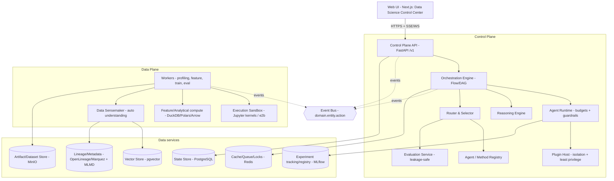

# AutoDS Architect — Proposal for an Evidence-First, Self-Hostable Control Plane for Agentic Data Science

> **Status:** Proposal / design brief (v0.1) · **Date:** 2026-07-24
> **Working name:** **AutoDS Architect** (alternatives considered: *Empirica*, *OpenDataLab Architect*).
> **Relationship to AutoDev Architect:** sibling product. AutoDev is a control plane for
> *software engineering* agents; this proposes the same architecture, principles, and design
> language applied to the *data science, statistics, causal inference, and ML/DL/RL* lifecycle.

This document is a **proposal only**. It idealizes a new open-source platform by transposing the
proven DNA of [AutoDev Architect](../architecture/v2_platform_reference.md) into the data science
domain, reusing the specialist agent library already authored in
[`acpguedes/agents-md/data_science`](https://github.com/acpguedes/agents-md/tree/master/data_science),
and grounding every state-of-the-art claim in 2023–2026 research (see [§16 References](#16-references)).

---

## Table of contents

1. [What transfers from AutoDev Architect](#1-what-transfers-from-autodev-architect)
2. [Vision, problem, and thesis](#2-vision-problem-and-thesis)
3. [Guiding principles (product + architecture)](#3-guiding-principles-product--architecture)
4. [Personas and end-to-end use cases](#4-personas-and-end-to-end-use-cases)
5. [What makes it different (vs. notebooks, AutoML, BI, closed SaaS)](#5-what-makes-it-different)
6. [High-level architecture](#6-high-level-architecture)
7. [Flagship subsystem — Automatic Data Understanding (the "Data Sensemaker")](#7-flagship-subsystem--automatic-data-understanding)
8. [Agent framework and the specialist roster](#8-agent-framework-and-the-specialist-roster)
9. [Flow engine and exemplar workflows](#9-flow-engine-and-exemplar-workflows)
10. [Reasoning, routing, and evaluation (evidence-grounded)](#10-reasoning-routing-and-evaluation)
11. [State-of-the-art strategies adopted](#11-state-of-the-art-strategies-adopted)
12. [Governance, reproducibility, and the Analysis Narrative Contract](#12-governance-reproducibility-and-the-analysis-narrative-contract)
13. [Experience — the "Data Science Control Center" UI](#13-experience--the-data-science-control-center-ui)
14. [Recommended OSS stack](#14-recommended-oss-stack)
15. [Roadmap, success metrics, risks, non-goals](#15-roadmap-success-metrics-risks-non-goals)
16. [References](#16-references)

---

## 1. What transfers from AutoDev Architect

AutoDev Architect is, at its core, **an auditable workflow control plane for engineering agents** —
not a chatbot that emits snippets. Its v2 architecture inverts the old fixed pipeline into a
**small, stable core surrounded by typed Extension Points inhabited by versioned Plugins**; the core
stays small and the value grows at the edges. The following elements are domain-agnostic and transfer
directly to data science:

| AutoDev concept | Transfers as-is? | Data-science reading |
|---|---|---|
| Small core + typed **Extension Points** + versioned **Plugins** | Yes | Same seam model; extension kinds change (agents, analyses, estimators, evaluators, connectors) |
| **Everything as configuration** (`flow.yaml`, `agent.yaml`, `skill.yaml`, `eval.yaml`, `plugin.yaml`), SemVer | Yes | Add `dataset.yaml`, `analysis.yaml`, `metric.yaml`, data-contract manifests |
| **Control Plane vs. Data Plane** separation | Yes | Data Plane does profiling, feature compute, training, validation in sandbox |
| **Event Bus** (`domain.entity.action`), event store, deterministic **replay** | Yes | A run's every step (query, transform, fit, eval) is an event; replayable |
| **Session → Run → Steps** lifecycle with checkpointing | Yes | A "run" is an analysis/experiment; steps are profiling/EDA/fit/validate |
| **Router & Selector** by capability + policy + cost | Yes | Route "causal question" → causal-analyst; "forecast" → time-series-analyst |
| **Reasoning Engine** with pluggable strategies (ReAct, Plan-and-Execute, Reflection, Debate) | Yes | Same strategies; verification signal becomes held-out metrics, not tests |
| **Evaluation Service** with **closed feedback loop** | Yes | Evals become leakage-safe held-out metrics, calibration, reproducibility |
| **Budgets** (tokens/USD/time/steps) that **fail closed**; HITL approval gates | Yes | Add compute/GPU-hour and row-scan budgets; approve before expensive fits |
| **Execution Sandbox**, no network by default | Yes | Notebooks/kernels run confined; data never silently leaves the sandbox |
| **Local-first → docker-compose → Kubernetes**, no rewrite | Yes | SQLite+DuckDB local → Postgres+MinIO+Redis → K8s with GPU nodes |
| Repository **intelligence** (tree-sitter → graph → hybrid retrieval) | **Re-domained** | Becomes **data intelligence**: automatic dataset understanding (§7) |
| Patch-based, review-friendly change model | **Re-domained** | Becomes **artifact-based**: every insight/model/report is a versioned, reviewable artifact |
| **RFC-008 SOTA method** (evaluate platforms + academic evidence; disposition every concept as covered/gap/guidance/rejected) | Yes | We reuse the method to disposition DS-specific SOTA (§11) |
| Design language — "Execution Control Center" (warm-paper/charcoal, iris accent, Newsreader/Instrument Sans/JetBrains Mono, three-region shell, WCAG 2.2 AA) | Yes | Rebadged as the **Data Science Control Center** (§13) |

The single biggest re-domaining is **code intelligence → data intelligence**. In AutoDev, the platform
first *understands the repository* (tree-sitter symbols, hybrid retrieval) before acting. In AutoDS, the
platform must first *understand the data* — its semantic types, quality, sensitivity, and relationships —
before any analysis is trustworthy. That is the flagship subsystem in [§7](#7-flagship-subsystem--automatic-data-understanding),
and it is exactly the capability the request asked for: *agents that interpret the input data and figure
out on their own what it is.*

---

## 2. Vision, problem, and thesis

### 2.1 Vision

> Be the reference open-source platform where any data-science capability — exploratory analysis,
> statistics, causal inference, forecasting, supervised/unsupervised ML, deep learning, reinforcement
> learning, and GenAI — can be **plugged, versioned, isolated, and evaluated**, turning a question into
> a **reproducible, auditable, governed** analysis, model, or report — from the laptop to the cluster —
> without lock-in.

### 2.2 The problem

Most data teams operate a fragile chain: ad hoc notebooks, one-off scripts, disconnected dashboards,
and prompts in closed tools. The systemic gaps are the same ones AutoDev identified for software, mapped
to data work:

- **No traceability** from *question → hypothesis → data → method → result → decision*.
- **Low reproducibility** — results depend on un-versioned data snapshots, seeds, and environments.
- **Weak governance** over sensitive data, model risk, and automated decisions.
- **Experiments that can't be compared** — inconsistent metrics, forgotten baselines, silent leakage.
- **Analyses that are hard to audit** — correlation dressed up as causation; p-hacking; the file-drawer effect.
- **Models disconnected from the analysis that motivated them**, and from monitoring once deployed.

### 2.3 Thesis

Treat data science as a **governed operational loop**, exactly as AutoDev treats software delivery as an
auditable pipeline. The unit of work is not a notebook cell — it is a **run**: a versioned, checkpointed,
replayable execution of a declarative flow, where every step emits events, every artifact is persisted with
its lineage, every claim ships with its evidence and limitations, and human approval gates guard the
expensive and the sensitive.

The differentiator is not "another AutoML" and not "a notebook with a chat box". It is an
**evidence-first control plane**: the platform's native output is not just a number or a chart, but a
*defensible, reproducible, governed* answer.

---

## 3. Guiding principles (product + architecture)

These adapt AutoDev's 13 v2 principles to the data domain. Each is stated with how it will be **verified**
(mirroring AutoDev's "principle → how it is checked" discipline).

| # | Principle | Data-science meaning | Verified by |
|---|---|---|---|
| P1 | **Extensibility by default** | Every capability (agent, analysis, estimator, connector, evaluator, panel) is a typed Extension Point | Contract tests per extension point |
| P2 | **Everything as configuration, versioned** | Flows, agents, analyses, metrics, datasets, evals are declarative + SemVer | Round-trip a `flow.yaml`/`analysis.yaml` with no loss |
| P3 | **Stable, versioned contracts** | `hostApi: ">=1.0 <2.0"`; extensions depend on contracts, never internals | CI blocks breaking changes without a MAJOR bump |
| P4 | **Small core, rich edges** | Core = orchestration, state, events, policy; methods live in plugins | Core LOC/coverage budget; methods shipped as plugins |
| P5 | **Isolation & least privilege** | Sandboxed kernels; **no network by default**; data access is explicit and scoped | Sandbox escapes fail; data-scope tests |
| P6 | **Native observability** | Every step emits events → traces, metrics, cost, lineage | Every run replayable from persisted state |
| P7 | **Determinism & replay** | Pinned data version + seed + env + code → identical result | Reproducibility check re-runs and diffs artifacts |
| P8 | **Local-first, production-ready** | SQLite+DuckDB+FS locally → Postgres+MinIO+Redis+K8s, no rewrite | Same run passes in all three deployment modes |
| P9 | **OSS-first, self-host** | Core path uses only OSS; paid APIs supported, never required | "Airplane mode" run with local models + local data |
| P10 | **Usability & accessibility** | Control Center UI, WCAG 2.2 AA, keyboard-first | axe-core in CI; keyboard-only E2E |
| P11 | **Governed security & cost** | RBAC, tenants, quotas; budgets (tokens/USD/**compute/GPU-hours/rows**) fail closed | Quota-exceed run fails closed with a clear message |
| P12 | **Continuous evaluation** | Held-out, leakage-safe evals feed routing; regressions block merges | Eval gate in CI; decontaminated held-out sets |
| P13 | **API-first** | Every capability exposed via the versioned `/v1` control-plane API before any UI/CLI/MCP surface | UI/CLI/MCP are pure API clients; no back-door state access |

Three **domain-specific principles** are added because data work fails in ways software does not:

| # | Added principle | Why data needs it | Verified by |
|---|---|---|---|
| P14 | **Data out of the prompt** | Raw sensitive rows must not flow to an LLM by default; agents reason over **schemas, aggregate statistics, controlled samples, and masked data** | Egress guard: raw-row-to-LLM without policy fails |
| P15 | **Hypotheses explicit, pre-registered when confirmatory** | Separate *question / hypothesis / evidence / method / assumptions / threats-to-validity / result / recommendation*; commit MDE and decision rules before peeking | Confirmatory runs carry a pre-registration record; exploratory ≠ confirmatory flag |
| P16 | **Nothing is "done" without validation** | No analysis/model ships without data-quality checks, a baseline, evaluation, a limitations section, persisted artifacts, and an audit trail | Definition-of-Done gate on every run |

---

## 4. Personas and end-to-end use cases

### 4.1 Personas

| Persona | Role | Pain today | What AutoDS delivers |
|---|---|---|---|
| **Ana — Data analyst** | Answers business questions with EDA, stats, charts, reports | Messy notebooks; irreproducible; "just one more cut" | Analysis plans, guided EDA, governed report generation, question→data→chart→conclusion traceability |
| **Bruno — Data scientist** | Builds supervised/unsupervised models; compares experiments | Loose experiments; forgotten baselines; **leakage**; deploy disconnected from training | Experiment plans, leakage checks, model comparison, explainability, model registry, validation gates |
| **Clara — Statistician / causal lead** | Inference, experiment design, A/B tests, causality | Implicit assumptions; undocumented DAGs; unhandled confounders; correlation≠causation confusion | DAG builder, assumption registry, estimand→estimator workflow, sensitivity analysis, honest causal reports |
| **Diego — ML engineer** | Turns experiments into pipelines/APIs/jobs | Notebook code doesn't productionize; no monitoring; drift found late | Pipeline packaging, serving templates, drift/monitoring, CI/CD for models, rollback |
| **Elisa — Governance / compliance** | Safe, auditable use of data and models | Sensitive datasets uncontrolled; undocumented models; opaque automated decisions | Policies, approvals, audit trails, model/data cards, PII controls, fairness reports |
| **Otto — Self-host operator** | Installs and operates the platform | Partial compose; stubbed services; no runbooks | Full OSS stack, versioned migrations, RPO/RTO, OTel observability, runbooks |
| **Pris — Extension author** | Publishes agents/estimators/connectors | No SDK, manifest, isolation, or marketplace | SDK, manifests, isolated Plugin Host, signed marketplace |

### 4.2 End-to-end use cases (narratives)

- **UC-1 — Ana, from question to validated report (local-first).** Ana opens the local UI, starts a
  Session, and asks *"What explains the churn increase last quarter?"*. The Router classifies the intent;
  the Data Sensemaker (§7) profiles the connected tables, infers semantic types, flags a PII column, and
  proposes joins. A plan node pauses for approval; the `eda-analyst` and `hypothesis-engine` run; findings
  are ranked; `insight-reporter` drafts a report framed by the Analysis Narrative Contract (§12). Ana sees
  the full trace, cost, and can **replay**. No external infra was required. *(Exercises P7, P8, P14, P16.)*

- **UC-2 — Clara runs a defensible causal analysis.** She asks *"Did the discount cause higher retention?"*.
  The `causal-analyst` names the **estimand** (ATT), helps draft the **DAG** with her, selects an
  identification strategy whose assumptions the data can sustain, estimates with correct uncertainty, and
  runs **mandatory refutations** (placebo, negative control, E-value). If nothing is identifiable, the run
  says so — an honest *"not identifiable with these data"* beats a decorated coefficient. *(Exercises P15, P16.)*

- **UC-3 — Bruno trains a model without leakage.** Task = churn classification. The flow validates data,
  fixes a leakage-safe split **before** any fit, races **N candidate models** (§10/§11), selects by a
  held-out metric, runs explainability + fairness slices, emits a **model card** (Croissant/HF format), and
  gates deployment on approval. *(Exercises P5, P12, P16.)*

- **UC-4 — Elisa audits a decision six months later.** She opens a completed run; every step, dataset
  version, seed, prompt, chart, metric, approval, and limitation is persisted and replayable; the model
  card and data card are attached; the PII column was masked at ingestion. The audit reproduces the result
  bit-for-bit. *(Exercises P6, P7, P11, P14.)*

- **UC-5 — Diego monitors a production model.** A drift signal (Evidently/whylogs) opens a monitoring run;
  NannyML estimates the *actual* performance impact without labels; slice + root-cause analysis runs; a
  retraining recommendation is produced and gated on approval. *(Exercises P6, P12.)*

---

## 5. What makes it different

| Compared to… | AutoDS Architect advantage |
|---|---|
| **Notebooks (Jupyter, Colab)** | Reproducible, governed, workflow-oriented, team-scale, replayable — without giving up the notebook as the *execution substrate* |
| **AutoML (H2O, AutoGluon, cloud AutoML)** | Broader than "train a model": covers automatic data understanding, EDA, statistics, **causal inference**, explainability, and governance — and treats AutoML as *one* governed step, not the whole product |
| **BI (Looker, Metabase, Power BI)** | Scientific, not just descriptive: hypotheses, inference, experimentation, modeling, and causal reasoning with explicit assumptions |
| **Closed agentic SaaS** | Self-hostable, provider-flexible, auditable, extensible via signed plugins; **data stays in your infrastructure** |
| **MLOps point tools (MLflow, Feast, Evidently alone)** | Not a tool — a **control plane** that composes these tools behind one API, one event model, one governance layer, and one UI |

The wedge: **an auditable, evidence-first control plane for agentic data science**, where every insight,
chart, test, model, and decision is traceable, reproducible, governed, and extensible.

---

## 6. High-level architecture

Same six-layer shape as AutoDev v2, re-domained. The core stays small; methods live in plugins.



### 6.1 Control Plane vs. Data Plane

- **Control Plane** — API, orchestration, agent runtime, plugin host, reasoning, router/selector,
  evaluation, registries. Stateless where possible; durable state in the State Store; ephemeral
  coordination in Redis. It **never executes untrusted code or touches raw data directly** — it delegates
  to the Data Plane.
- **Data Plane** — the Data Sensemaker, sandboxed kernels, and workers that do the heavy, stateful work:
  profiling, feature compute, training, evaluation. Runs **no-network by default**; data access is explicit,
  scoped, and logged. Scales horizontally (and onto GPU nodes) independently of the API.

### 6.2 Session → Run → Steps

A **Session** groups **Runs** and history; a **Run** is a concrete execution of a **Flow**, composed of
**Steps** (node/agent activations). Durable run/step states (`profiling`, `awaiting_plan_approval`,
`fitting`, `running_validation`, `completed`, `failed`) live in the State Store, guaranteeing determinism
and replay. Budgets and guardrails apply in the Agent Runtime and **fail closed**.

### 6.3 Declarative manifests

Everything is configuration. The manifest set extends AutoDev's with data-native kinds:

| Manifest | Purpose |
|---|---|
| `plugin.yaml` | Plugin identity, `hostApi` range, extension points provided, **least-privilege permissions** (data read/write scopes, network allow-list, compute/GPU), signature/provenance |
| `agent.yaml` | Agent identity, capabilities, **typed + versioned IO schema**, allowed tools/skills, default reasoning strategy, **budgets** (tokens/USD/time/steps/**rows/GPU-hours**), prompts, context requirements, memory |
| `flow.yaml` | Declarative DAG of nodes (agent, analysis, human-approval, validation, sub-flow), edges/conditions, checkpointing, retries, saga/rollback |
| `dataset.yaml` | A dataset/source: connector, version/partition/sample policy, **data contract** (ODCS-style), sensitivity/PII policy, masking rules |
| `analysis.yaml` | A reusable analysis template (inputs, method, assumptions, acceptance criteria, expected artifacts) |
| `metric.yaml` | A governed metric definition (dbt-semantic-layer style) so every surface computes it identically |
| `eval.yaml` | Dataset + rubric + metrics + **leakage/decontamination policy** for offline/online evaluation |

### 6.4 Deployment modes

Same as AutoDev, no rewrite between them:

- **Local (single process, zero external deps)** — SQLite State Store, **DuckDB** analytical engine,
  filesystem artifacts, in-process Event Bus, local/stub LLM. Onboarding in minutes.
- **docker-compose (self-host reference)** — separate services: API, workers, PostgreSQL + pgvector,
  Redis, MinIO, MLflow, Marquez, and the Web UI.
- **Kubernetes (production, multi-tenant)** — API and workers scale independently (HPA on Redis queue
  depth); **GPU node pools** for DL/RL; sandbox with restrictive network policy; OTel/Prometheus/Grafana/Loki;
  RBAC, tenants, quotas.

---

## 7. Flagship subsystem — Automatic Data Understanding

*This is the capability the request singled out: "agents to interpret the input data and understand on
their own what it is."* In AutoDev, repository intelligence is what makes the platform trustworthy before
it acts. Its data-science analog is the **Data Sensemaker**: a Data-Plane subsystem (plus a lead
`data-interpreter` agent) that, given any table/file/source, figures out **what the data is, how good it is,
what is sensitive, and how it relates to everything else** — and emits that understanding as
**machine-readable, enforceable artifacts**, not prose.

The design follows the strongest evidence in the 2023–2026 literature (see [§16](#16-references)).

### 7.1 The understanding pipeline

```
Connect source
  → Structural profiling (shape, dtypes, cardinality, missingness, duplicates, constants/IDs)
  → Semantic type inference (ENSEMBLE: values + headers + table-context + KB grounding)
  → Sensitivity/PII gate (early, context-aware)
  → Quality & constraint inference (proposed contract, then validated/pruned)
  → Relationship & join-key discovery (statistics prune → LLM adjudicate)
  → Zero-training probing (tabular foundation model)
  → Emit artifacts: Data Card + data contract + expectations + lineage events
  → Persist to metadata/lineage store; index for semantic search
```

### 7.2 Semantic type inference — layer, don't pick one

The Sherlock → Sato → Doduo/TURL arc proves each signal layer adds accuracy; the design **ensembles all
four** rather than choosing one:

1. **Value statistics** (Sherlock, KDD 2019) — character/word distributions and stats catch the obvious
   types.
2. **Headers/column names** (Attribute-Based Semantic Type Detection, 2024) — cheap, high-signal metadata
   that value-only models ignore.
3. **Table context** (Sato, VLDB 2020; Doduo, 2021) — neighboring columns and whole-table intent
   disambiguate ambiguous/low-support types via joint prediction.
4. **Knowledge-base grounding / entity linking** (TURL, VLDB 2021) — map columns/cells to real-world
   concepts (an ontology/KB), grounding "what this column *means*".
5. **LLM adjudication** (LLM-CTA, 2025) — resolve the long tail from headers + a few sample rows + context.
   Ensemble strategies (knowledge-generation, prompt-augmented/LoRA-tuned) — no single prompt is best.

**Design rule:** *statistics prune → LLM adjudicate.* Cheap deterministic profiling generates a small,
evidence-backed candidate set; the LLM does semantic resolution over it. This is the primary defense
against hallucination, and it applies to typing, relationships, and constraint inference alike.

### 7.3 Sensitivity / PII — an early, context-aware gate (principle P14)

Run **before** any downstream step or sharing. Combine **Microsoft Presidio** (regex/NER/checksum/context
recognizers, incl. Presidio Structured for tabular PII) with **LLM contextual detection** for
context-dependent sensitivity (e.g., a free-text "notes" column) that pattern matchers miss. Sensitivity
depends on a column's *role and neighbors*, not just token patterns — so it is decided at table/context
level, and the result drives masking and access scopes.

### 7.4 Quality & constraint inference — propose, then validate

Auto-profilers over-generate, so inferred constraints are **proposals** requiring a pruning/validation pass:

- **Profile** with **ydata-profiling** (fast first fingerprint) and **whylogs** (compact, mergeable,
  privacy-preserving profiles that don't ship raw rows).
- **Infer constraints** the way **Deequ's `ConstraintSuggestionRunner`** does (zero nulls → `isComplete`;
  observed range → bounds) and **Pandera's `infer_schema()`** does (types, nullability, ranges).
- **Emit as an enforceable contract**: a **Great Expectations** suite and/or an **Open Data Contract
  Standard (ODCS v3)** document — the same artifact the platform later *enforces* at ingestion boundaries.

### 7.5 Relationship & join-key discovery — statistics + LLM

Never let name-matching alone decide relationships — it **fails silently** when naming diverges. Use the
classic statistical backbone (**multi-column FK discovery via inclusion dependencies**, VLDB 2010) to
generate candidates, then LLM adjudication over the evidence (the hybrid "deep context" pattern, 2026) to
resolve primary/foreign keys and semantic relationships.

### 7.6 Zero-training probing — tabular foundation models

Exploit **TabPFN v2** (Nature 2025) in-context learning to get instant predictions/embeddings on a brand-new
table with **no per-dataset training** — use it to score candidate feature importance, test candidate
relationships, impute, and detect anomalies. Use **TableGPT2**-style encoders for schema-level Q&A on messy
or unnamed columns. Use **CAAFE** (NeurIPS 2023) as the template for *self-explaining, verified* inference:
generate code **+** a natural-language rationale, then keep it only if an empirical check confirms it. Every
inferred type, constraint, feature, or relationship therefore ships with a rationale and a passing check —
not just a label.

### 7.7 Output — the Data Card and continuous lineage

The subsystem's deliverable is a **Data Card** (Croissant JSON-LD + datasheet fields) plus the enforceable
contract and expectations, written back to an **OpenMetadata/DataHub-style** catalog and emitted as
**OpenLineage** run/job/dataset events into **Marquez**. Understanding accumulates as **durable, queryable
state behind the versioned API**, not one-shot reports — and governed metric definitions (dbt-semantic-layer
style, via `metric.yaml`) mean every agent and surface computes a metric identically.

### 7.8 The `data-interpreter` agent

The subsystem is fronted by a new specialist agent (added to the agents-md roster — see the companion
[data-interpreter agent](https://github.com/acpguedes/agents-md/tree/master/data_science) delivered
alongside this proposal). It orchestrates the pipeline above, obeys the Analysis Narrative Contract, and
hands a validated Data Card to the `eda-analyst` and downstream specialists. It never emits a semantic label
or a relationship without evidence; when the data can't sustain a claim, it says so.

---

## 8. Agent framework and the specialist roster

The most valuable reuse: **the 19 specialist agents already authored in `agents-md/data_science` map almost
one-to-one onto AutoDS's Agent framework.** Each already carries a typed trigger vocabulary, a model/effort
assignment, least-privilege tools, and — crucially — the **Analysis Narrative Contract**. Wrapping each in an
`agent.yaml` (capabilities, typed IO schema, budgets) turns them into versioned, routable, evaluable
platform agents **without rewriting their expertise**.

### 8.1 The roster (reused verbatim, + one new agent)

| Agent | Platform capability | Default model/effort* |
|---|---|---|
| `data-interpreter` **(new, §7)** | `data.understand`, `data.type`, `data.pii`, `data.relations` | opus / high |
| `eda-analyst` | `eda.profile`, `eda.quality`, `eda.leakage` | opus / high |
| `statistician` | `stats.test`, `stats.bayes`, `stats.power`, `stats.equivalence` | opus / high |
| `causal-analyst` | `causal.dag`, `causal.identify`, `causal.estimate`, `causal.sensitivity` | opus / high |
| `hypothesis-engine` | `hyp.generate`, `hyp.formalize`, `hyp.prioritize`, `hyp.register` | opus / high |
| `feature-engineer` | `feature.create`, `feature.select`, `feature.validate` | sonnet |
| `ml-modeler` | `ml.train`, `ml.tune`, `ml.ensemble` | sonnet |
| `dl-architect` | `dl.architecture`, `dl.train` | opus / high |
| `nlp-engineer` | `nlp.transformers`, `nlp.finetune`, `nlp.embeddings` | opus / high |
| `cv-engineer` | `cv.detect`, `cv.segment`, `cv.classify` | opus / high |
| `genai-engineer` | `genai.rag`, `genai.finetune`, `genai.prompt` | opus / high |
| `rl-engineer` | `rl.env`, `rl.policy`, `rl.eval` | opus / high |
| `time-series-analyst` | `ts.forecast`, `ts.anomaly` | sonnet |
| `clustering-analyst` | `cluster.segment`, `cluster.topic` | sonnet |
| `unsupervised-learner` | `unsup.reduce`, `unsup.autoencoder`, `unsup.anomaly` | sonnet |
| `xai-analyst` | `xai.shap`, `xai.interpret`, `xai.fairness` | sonnet |
| `mlops-engineer` | `mlops.track`, `mlops.serve`, `mlops.drift`, `mlops.cicd` | sonnet |
| `ml-reviewer` **(read-only gate)** | `review.methodology` | opus / high |
| `notebook-reviewer` **(read-only gate)** | `review.notebook` | sonnet |
| `insight-reporter` | `report.executive`, `report.technical`, `report.translate` | opus / high |

\* The model/effort split (opus/high for hard reasoning — causal, stats, DL; sonnet for mechanical work) is
inherited from the existing agents and validates AutoDev's **Router & Selector by capability + cost**: route
the hard reasoning to the strong model, the mechanical work to the cheaper one.

### 8.2 Two agent classes, mirroring AutoDev

- **Executors** — produce code, analyses, models, artifacts (the 17 specialists above).
- **Reviewers / validation gates** — `ml-reviewer` and `notebook-reviewer` are **read-only** and run before
  a model is registered or a notebook is shared. This is AutoDev's Validation Gate pattern, re-domained: no
  result is "done" until a reviewer and the automated checks pass (principle P16).

### 8.3 Agents that learn (no fine-tuning)

Per RFC-008's "agents that learn" line, the platform keeps a **verified skill/playbook library** (Voyager /
ACE style): analyses that passed review become reusable, versioned **skills**; recurring feature recipes,
method choices, and domain conventions accrue as a curated playbook — improving agents over durable state
**without touching model weights**.

---

## 9. Flow engine and exemplar workflows

Flows are declarative DAGs (`flow.yaml`) with agent nodes, human-approval gates, validation nodes, and
sub-flows; the engine does checkpointing, retries, conditional edges, and saga rollback. Five exemplar
flows ship as templates:

**A — Exploratory analysis**
```
Question intake → Data Sensemaker (understand) → Quality gate
  → Profiling/EDA → EDA-plan approval → EDA execution
  → Insight ranking → Report draft → Human review → Publish
```

**B — Statistical inference**
```
Question intake → Hypothesis formalization (H0/H1, MDE, pre-register)
  → Data eligibility + power check → Test selection → Assumption diagnostics
  → Execution → Effect interpretation (CI, effect size) → Limitations → Review
```

**C — Causal inference**
```
Question intake → Treatment/outcome/population + estimand
  → DAG draft (with domain owner) → Confounder review GATE
  → Identification strategy → Estimation (correct SEs)
  → Refutation + sensitivity (placebo, negative control, E-value) → Causal report → Approval
```

**D — Supervised ML**
```
Task definition → Data Sensemaker → Leakage check → Split-strategy approval
  → Baseline → Candidate race (N models) → Held-out selection
  → Explainability + fairness → Model card → Deployment approval
```

**E — Model monitoring**
```
Production signal → Drift detection (Evidently/whylogs)
  → Label-free performance estimation (NannyML) → Slice + root-cause
  → Retraining recommendation → Approval → Retraining sub-flow
```

Every flow's terminal artifact obeys the **Analysis Narrative Contract** (§12) and carries its lineage,
cost, and limitations.

---

## 10. Reasoning, routing, and evaluation

### 10.1 Reasoning and routing

The **Reasoning Engine** offers pluggable strategies (ReAct, Plan-and-Execute, Reflection, Debate), chosen
per task by policy and budget. The **Router & Selector** matches a task's capability to an agent + model +
strategy under cost/budget policy, and records the decision in the trace. This is AutoDev's contract,
unchanged — only the capability vocabulary is data-native (§8.1).

### 10.2 Evaluation — the signal is evidence, not vibes

Data science has failure modes software evaluation doesn't: **leakage**, **overfitting to the test set**,
**p-hacking**, and **metric-hacking**. The Evaluation Service is therefore built around *execution-grounded,
leakage-safe* signals:

- **Held-out, decontaminated evaluation** is the reward signal — never the data used to generate a
  hypothesis or select features (principle P12, P15). Confirmatory claims are pre-registered.
- **Best-of-N with held-out selection** — generate N candidate analyses/models and select by an
  out-of-sample metric (the AutoDev "race" pattern, re-domained; RFC-008 concept #4).
- **Calibrated, multi-sampled LLM-as-judge** — used **only** for non-executable dimensions (narrative
  quality, assumption plausibility), multi-sampled because it is noisy run-to-run.
- **Reproducibility as a gate** — a run is re-executed from pinned data+seed+env; artifacts must match.
- **Anti-metric-hacking** — guardrail metrics that must not degrade; leakage sentinels; a healthy skepticism
  toward suspiciously high held-out scores (they are leakage suspects first, breakthroughs second).

Results are persisted, comparable across versions, and **feed back into the Selector** (closed loop), so the
platform prefers agents/methods that are *actually* better on held-out evidence.

---

## 11. State-of-the-art strategies adopted

We reuse AutoDev's **RFC-008 method** rather than inventing one: evaluate the leading systems *and* the
peer-reviewed evidence, then **disposition every concept** as `adopt` (planned into a section/epic),
`guidance` (a written rule, no epic), or `rejected`. The point is not to chase a leaderboard but to
integrate named techniques, each proven by at least one system or corroborated by evidence, over durable,
self-hostable, model-agnostic state — which no single competitor does.

### 11.1 System evaluation (2024–2026 research pass)

Autonomous / agentic data-science systems — distinctive concepts, and what transfers:

- **Data Interpreter (MetaGPT, arXiv:2402.18679)** — represents a task as a **dynamic hierarchical graph of
  subtasks** with real-time replanning as intermediate data changes. → validates the mutable-DAG flow engine
  (§9); *the plan is data, and it changes mid-run.*
- **AIDE (Weco AI, arXiv:2502.13138)** — frames ML engineering as **tree search over code**: each script is a
  node, LLM patches spawn children, a validation metric prunes. The de-facto scaffold OpenAI benchmarked in
  MLE-bench. → adopt as an evaluation/search strategy: model *solution nodes + patches + held-out metric* as
  first-class versioned objects (§10).
- **DS-Agent (ICML 2024, arXiv:2402.17453)** — **case-based reasoning**: retrieve and adapt expert Kaggle
  solutions; a cheaper "deployment" stage reuses past successes (~$0.13/run). → validates a durable
  **experience/case library** as a cost lever (§8.3).
- **AutoKaggle (arXiv:2410.20424)** — **phase-based multi-agent** roles (Reader/Planner/Developer/Reviewer/
  Summarizer) with **unit tests on generated code** and a shared validated-tools library. → validates the
  reviewer gates (§8.2) and machine-checked validation (§10).
- **Agent K v1.0 (arXiv:2411.03562)** — **Grandmaster-equivalent** on Kaggle (Elo-MMR top ~38%) via long-lived
  **experiential memory** on an open backbone — evidence that *cross-task memory, not model scale*, drives
  autonomous performance. → adopt into the learned skill/playbook library (§8.3).
- **AutoMind (arXiv:2506.10974)** — **knowledge-grounded tree search** + self-adaptive coding, ~3× faster at
  ~63% lower token cost than AIDE. → affirms cost/latency as first-class for a self-hostable platform (P11).
- **MLE-STAR (Google, arXiv:2506.15692)** — **targeted, block-level refinement** (edit one pipeline component
  at a time) instead of whole-script rewrites. → affirms the artifact/patch-based edit vocabulary (§1) as more
  auditable than rewrites.
- **The AI Scientist v1/v2 (Sakana, arXiv:2408.06292 / 2504.08066)** — the fullest **hypothesis → experiment →
  written report** loop, with a progressive agentic tree search. → informs the hypothesis (§8) and reporting
  flows (§9); also a **safety caution** (documented self-modifying execution) reinforcing sandboxing (P5).
- **Operand Quant (arXiv:2510.11694)** — a **single-agent** architecture rivaling multi-agent scaffolds. →
  guidance: orchestration **topology is configuration**, never hard-coded to "many agents".

Execution substrate — the field has converged on **a stateful kernel in a sandbox with a self-correcting
loop**: **DatawiseAgent (EMNLP 2025, arXiv:2503.07044)** makes the **notebook cell the execution/state
primitive**; **Hugging Face Jupyter Agent** ships an open, self-hostable notebook stack; **e2b** provides
Firecracker-microVM isolation with a Jupyter server inside each sandbox. → adopt: notebook cells for the agent
loop **plus** a compile/export to a durable, versioned pipeline (§6, §9).

### 11.2 Evidence base (benchmarks and failure modes)

- **Realistic autonomy is still unreliable** — best agents solve only ~34% of DSBench analysis tasks
  (arXiv:2409.07703) and ~16% of DABStep real-world analytics (arXiv:2506.23719); MLE-bench's best setup
  reached bronze in ~16.9% of competitions (arXiv:2410.07095). → **guidance:** keep humans in the loop; ship
  honest difficulty tiers; treat autonomy as assistive, not turnkey.
- **Documented failure modes map directly to platform guardrails:** overfitting to the validation metric;
  **self-inflicted validation leakage** (the agent's own eval harness leaks); long-horizon **stage-incompletion**;
  weak **root-cause debugging**; and Kaggle **contamination** in pre-training. → adopt: enforced train/val/test
  separation, leakage sentinels, stage-completion checks, structured error-trace feeding, and **private,
  time-gated held-out eval sets** (§10).
- **Build the eval harness in from day one** — MLE-bench's Docker-isolated, per-task, fresh-attempt design is
  the template for the platform's own regression suite. → adopt (§10, E7).

### 11.3 Concept disposition catalog

`adopt` = planned into a section/epic (cited). `guidance` = written rule, no epic. `rejected` = not adopted.

| # | Concept (best-in-class exemplar) | Disposition | Where |
|---|---|---|---|
| 1 | Mutable hierarchical task-DAG with replanning (Data Interpreter) | adopt | §6.2, §9 flow engine |
| 2 | Tree search over code/solutions, metric-pruned (AIDE, AutoMind) | adopt | §10 (best-of-N + held-out selection) |
| 3 | Notebook cell as execution/state primitive (DatawiseAgent) | adopt | §6 Data Plane, §9 |
| 4 | Compile notebook → durable versioned pipeline (MLZero, AutoML-Agent) | adopt | §6.3 manifests, §9 |
| 5 | Sandboxed stateful kernel; microVM/Docker isolation (e2b, MLE-bench) | adopt | §6.1 (no-network default), §14 |
| 6 | Case-based reuse of prior solutions (DS-Agent) | adopt | §8.3 experience/case library |
| 7 | Experiential cross-task memory (Agent K) | adopt | §8.3 learned skill/playbook library |
| 8 | Knowledge-grounded search for cost/latency (AutoMind) | adopt | §10, P11 budgets |
| 9 | Machine-checked unit tests on generated code (AutoKaggle) | adopt | §8.2 reviewer gates, §10 |
| 10 | Multi-agent role specialization (AutoKaggle, AutoML-Agent) | adopt | §8 roster; §8.1 |
| 11 | Targeted block-level refinement over rewrites (MLE-STAR) | adopt | §1 artifact/patch vocabulary |
| 12 | Automatic semantic type / column understanding (Sherlock→Sato→TURL) | adopt | §7.2 |
| 13 | "Statistics prune → LLM adjudicate" (hybrid FK discovery, LLM-CTA) | adopt | §7.2, §7.5 |
| 14 | Tabular foundation model, zero-training probing (TabPFN v2) | adopt | §7.6 |
| 15 | Self-explaining + verified inference (CAAFE) | adopt | §7.6, §15.3 |
| 16 | Enforced train/val/test separation + leakage sentinels | adopt | §10, §15.3 |
| 17 | Private, time-gated, contamination-controlled held-out evals (MLE-bench) | adopt | §10, E7 |
| 18 | Calibrated, multi-sampled LLM-as-judge (non-executable dims only) | adopt | §10 |
| 19 | Pre-registration; MDE + decision rules before peeking (hypothesis-engine) | adopt | P15, §9 flow B |
| 20 | Mandatory causal refutation/sensitivity (DoWhy refuters, E-value) | adopt | §9 flow C, §14 |
| 21 | Machine-readable governance artifacts (Croissant, cards, ODCS, OpenLineage) | adopt | §7.7, §12.2 |
| 22 | Data out of the prompt; context-aware PII gate (Presidio + LLM) | adopt | §7.3, P14 |
| 23 | Budgets fail closed incl. compute/GPU-hours/rows; pre-run cost estimation | adopt | P11, §15.3 |
| 24 | Durable execution for long agent runs (Temporal) | adopt | §14 |
| 25 | Pluggable orchestration topology (single-agent ↔ multi-agent) (Operand Quant) | guidance | §10 |
| 26 | Multi-agent restraint; explicit completion contracts (MAST evidence) | guidance | §8.2, §15.3 |
| 27 | Humans-in-the-loop because autonomy is unreliable (DSBench, DABStep) | guidance | §4, §12.3 |
| 28 | Benchmark skepticism; disclose the harness; decontaminated internal evals | guidance | §10 |
| 29 | Fully autonomous "AI scientist" with no human gates | rejected | safety + reliability (§12.3) |
| 30 | Swarm-by-default / large agent fleets as primary topology | rejected | MAST: most failures are design/verification, not capacity |
| 31 | Fine-tuning-based agent improvement as the core mechanism | rejected | prefer durable-memory learning (§8.3), model-agnostic |

---

## 12. Governance, reproducibility, and the Analysis Narrative Contract

Governance is not a bolt-on; it is the product. Three pillars, all reused or extended from existing material.

### 12.1 The Analysis Narrative Contract (reused verbatim from agents-md)

Every deliverable — notebook, report, or document section — is framed by a **before/after narrative**,
contextualized to the domain and written in the user's working language. Raw outputs (tables, metrics,
charts) never appear without this frame. This is the data-science analog of AutoDev's Trace + approval
discipline, and it already exists in the `agents-md/data_science` package:

- **Before:** *Motivation · Question · Objective · Hypothesis · Methodology (and why) · How to interpret.*
- **After:** *Results (with numbers: effects, CIs, metrics, n) · Interpretation (in domain terms, with
  uncertainty) · Impact (recommended action, honest limitations, next steps).*

For causal work the before-block additionally names the **estimand, identification strategy, and
assumptions**; the after-block reports diagnostics and sensitivity next to the estimate. `insight-reporter`
owns the template; `notebook-reviewer` audits conformance.

### 12.2 Reproducibility artifacts

Every run persists: dataset version/partition/sample, query, transformations, parameters, environment,
seed, code version, artifacts, metrics, charts, conclusions, **limitations**, and approvals. Machine-readable
governance artifacts are first-class:

- **Data Cards** — Croissant JSON-LD + datasheet fields (from §7).
- **Model Cards** — Hugging Face YAML / Model Card Toolkit format.
- **Data contracts** — ODCS v3 + Great Expectations suites, enforced at boundaries.
- **Lineage** — OpenLineage events → Marquez; ML metadata via MLMD; experiments/registry via MLflow.

### 12.3 Security, privacy, and human-in-the-loop

RBAC, tenants, and quotas; **budgets that fail closed** (now including compute/GPU-hours and rows scanned);
sandboxed, no-network-by-default execution; **data out of the prompt** (P14). Human approval is **mandatory**
for: using sensitive datasets, publishing reports, deploying models, automated decisions, processing personal
data, high-impact causal claims, and expensive compute workloads.

---

## 13. Experience — the "Data Science Control Center" UI

Reuse AutoDev's **Execution Control Center** design language verbatim (RFC-006 / ADR-012), rebadged for data
work. It is calm and editorial (NotebookLM-inspired), high-contrast, and technically dense where operators
need it — with WCAG 2.2 AA and keyboard-first navigation.

### 13.1 Design language (reused tokens)

- **Themes:** warm-paper light (`#faf8f4`) / charcoal dark (`#100f12`), with an **iris accent**
  (`#5a4fe0` light / `#8e88ff` dark). All fg/bg pairs verified WCAG 2.2 AA.
- **Typography:** **Newsreader** (editorial serif for headings/prose), **Instrument Sans** (UI),
  **JetBrains Mono** (code, diffs, metrics, logs).
- **Shell:** the same three-region shell — a **250px sidebar** rail, a **64px contextual header**, and a
  dismissible **400px execution panel** for live agent activity.

### 13.2 Shell regions

- **Sidebar:** Projects · Questions · Datasets · EDA · Statistics · Causal Lab · Experiments · Models ·
  Reports · Deployments · Governance · Extensions — plus a provider/status card.
- **Contextual header:** active project · active dataset · environment · provider/model · **budget** ·
  "New analysis".
- **Right execution panel:** live run steps, logs, **data-quality alerts**, token/compute cost, and training
  progress — streamed over SSE/WS from the Event Bus.

### 13.3 Key screens

`Lab Overview` · `Question Studio` (question → structured analysis plan) · `Dataset Explorer` (schema,
profiling, missingness, **Data Card**, masked sample viewer) · `EDA Workspace` · `Statistics Lab`
(hypothesis builder, test selector, power analysis) · `Causal Lab` (DAG editor, confounder registry,
estimand explorer, sensitivity) · `ML Workbench` (task, split, baseline, candidate race, metrics,
explainability, **model card**) · `Deep Learning Studio` · `Reinforcement Learning Lab` · `Reports &
Narratives` (executive/technical, approval-before-publish) · `Governance Center` (policies, PII, approvals,
audit, fairness, lineage) · `Flow Builder` (visual editor round-tripping `flow.yaml`).

---

## 14. Recommended OSS stack

All-permissive-license, self-hostable. Two license flags are load-bearing (see notes). Each pick maps to a
principle or pillar; the platform *composes* these behind one API — it does not reinvent them.

| Layer | Pick | Why (tie to pillars) |
|---|---|---|
| **Backend / API** | **FastAPI** (+ Pydantic + JSON Schema) | API-first control plane; typed contracts (P13) |
| **Frontend** | **Next.js** + shadcn/ui + Tailwind | Reuse AutoDev design system (P10) |
| **State store** | **PostgreSQL** (+ **pgvector**) | Durable state + semantic search over analyses/datasets (P6, P8) |
| **Cache/queue/locks** | **Redis** | Coordination, queues, HPA signal |
| **Artifact/dataset store** | **MinIO** (S3 API) | Versioned datasets, models, reports, charts |
| **Local analytical compute** | **DuckDB** + **Polars** over **Arrow/Parquet** | Warehouse-grade speed locally; no cluster; ideal for sandboxed reproducible runs (P8) |
| **Experiment tracking / registry / GenAI tracing** | **MLflow 3.x** (Apache-2.0) | One system for classic ML **and** OTel-native LLM/agent tracing — the platform is itself agentic |
| **Data/model versioning** | **DVC / DVCLive** | Reproducibility as code — data+model pinned in Git (P7) |
| **Causal core (differentiator)** | **DoWhy + EconML + CausalML + causal-learn** (PyWhy; MIT/Apache-2.0) | causal-learn discovers the DAG → DoWhy identifies/refutes → EconML/CausalML estimate heterogeneous/uplift effects. DoWhy's **refutation API is continuous validation for causal claims** |
| **Continuous validation & drift** | **whylogs → Evidently → NannyML → Great Expectations** (Apache-2.0) | Cheap profiling → drift+quality+LLM evals with CI gates → **label-free** performance estimation → contract enforcement |
| **Feature store** | **Feast** (Apache-2.0) | Train/serve consistency + versioned feature definitions |
| **Data orchestration** | **Dagster** (or Prefect) | Asset-centric pipelines with built-in lineage |
| **Durable agent/flow execution** | **Temporal** (MIT) | Crash-proof state for long, expensive agent runs — different layer from data orchestration |
| **Explainability & fairness** | **SHAP + InterpretML (EBM glassbox) + Captum + Fairlearn + AIF360** | Glassbox-first + permissive post-hoc attribution + dual fairness toolkits |
| **Governance artifacts / lineage** | **Croissant + Model/Data Cards + OpenLineage + Marquez + MLMD** | Machine-readable, FAIR, versionable governance the control plane owns |
| **Sandboxed execution** | **e2b (Firecracker) + Docker + Jupyter kernels** (Apache-2.0) | Secure, reproducible execution of agent-generated analysis |
| **DS/ML/DL/RL/NLP/CV libraries** | The `agents-md/data_science` `requirements.txt` (scikit-learn, statsmodels, XGBoost/LightGBM/CatBoost, Optuna, PyMC/ArviZ, PyTorch, Transformers/PEFT/TRL, stable-baselines3/Gymnasium, PyOD, Prophet/NeuralForecast/StatsForecast, …) | A curated, battle-tested method surface already exists in the sibling repo |
| **Local model serving** | **vLLM / Ollama** | Provider-flexible, "airplane-mode" path (P9) |
| **Observability** | **OpenTelemetry + Prometheus + Grafana + Loki** | Native traces/metrics/logs (P6) |

**Two explicit decisions:**
1. **Avoid Seldon's Alibi / Alibi-Detect for the production path** — they relicensed to **BSL 1.1 (Jan
   2024)**: free for dev/test only, commercial for production. For an OSS-first, self-hostable product this is
   disqualifying; Evidently + NannyML + whylogs + SHAP + Captum + InterpretML cover the same ground under
   Apache-2.0/MIT/BSD. Keep Alibi optional/dev-only at most.
2. **Orchestration is two problems, not one** — data-asset pipelines (**Dagster/Prefect**) vs. durable
   long-running agent execution (**Temporal**). Forcing one engine to do both is a common cause of lost agent
   state and runaway cost.

---

## 15. Roadmap, success metrics, risks, non-goals

### 15.1 Roadmap (epics, wave-ordered)

| Epic | Scope |
|---|---|
| **E0 — Foundations** | FastAPI + Next.js, PostgreSQL/pgvector, Redis, MinIO, DuckDB, OTel; Session/Run/Step model; Event Bus; local-first stub |
| **E1 — Data Sensemaker** | The §7 pipeline: connectors (CSV/Parquet/Postgres/DuckDB), profiling, semantic typing, PII gate, constraint inference, Data Cards, lineage |
| **E2 — Agent framework** | `agent.yaml`, runtime, budgets, typed IO, tool permissions; wrap the 19 agents + `data-interpreter` |
| **E3 — Flow engine** | `flow.yaml`, orchestration, checkpointing, approval gates, artifact persistence; the 5 exemplar flows |
| **E4 — EDA & statistics** | `eda-analyst`, `statistician`, `hypothesis-engine` wired end-to-end; report generation |
| **E5 — ML workbench** | Experiment tracking, candidate race, held-out selection, model cards, explainability/fairness |
| **E6 — Causal Lab** | DAG editor, estimand workflow, PyWhy methods, mandatory refutation/sensitivity, causal reports |
| **E7 — Evaluation & routing** | Leakage-safe evals, best-of-N, calibrated judges, closed feedback into Selector |
| **E8 — Governance & security** | RBAC, tenants, quotas, PII masking, data policies, audit logs, approval rules |
| **E9 — Deployment & monitoring** | Serving, batch scoring, drift (Evidently/whylogs), label-free perf (NannyML), retraining flows |
| **E10 — Control Center UI** | Design language + shell + the key screens (§13) |
| **E11 — Marketplace & extensions** | Plugin SDK, method/estimator/connector registry, signed publish, report/eval packs |

### 15.2 Success metrics

- **Product:** time from question → validated report; analysis approval rate; **reproducibility rate**;
  time-to-baseline model; time-to-causal-report; self-hosted deployment success.
- **Data:** data-quality score; freshness; missingness; schema drift; lineage coverage; PII exposure rate.
- **Models:** baseline lift; generalization gap; fairness gap; drift rate; rollback rate; cost per experiment.
- **Governance:** % analyses with complete approvals; % reports with data/model cards; auditable-reproducible
  rate; policy violations blocked; % sensitive-data runs masked.

### 15.3 Risks and mitigations

| Risk | Mitigation |
|---|---|
| **Silent data leakage** inflating results | Leakage sentinels in the Sensemaker + Evaluation Service; held-out, decontaminated evals; MI-based leakage flags (already in `eda-analyst`) |
| **Metric-/p-hacking** | Pre-registration for confirmatory work; guardrail metrics; multiple-comparison correction; file-drawer registry (already in `hypothesis-engine`) |
| **LLM hallucination on schema/relationships** | "statistics prune → LLM adjudicate"; every inference ships with evidence + a passing check (CAAFE pattern) |
| **Runaway compute/token cost** | Budgets fail closed (incl. GPU-hours/rows); pre-run cost estimation; checkpoint ceilings |
| **Multi-agent complexity** (MAST: ~56% of failures are design/verification) | Lean orchestrator + few verified workers; explicit completion contracts; no swarm-by-default |
| **Governance theater** | Machine-readable, enforced artifacts (contracts, cards, lineage) — not prose; Definition-of-Done gate |

### 15.4 Non-goals

- **Not** a foundation-model trainer — the platform *consumes* providers (local or hosted) via contract.
- **Not** a mandatory-cloud or paid-API product — OSS-first, self-host; paid APIs supported, never required.
- **Not** an un-sandboxed execution path in production.
- **Not** a monolithic "do-everything" agent — capabilities live in versioned, composable plugins.
- **Not** a replacement for human judgment on sensitive/high-impact decisions — HITL gates stay mandatory.

---

## 16. References

**Agentic / autonomous data science & benchmarks.**
Data Interpreter (MetaGPT) https://arxiv.org/abs/2402.18679 ·
AIDE (Weco AI) https://arxiv.org/abs/2502.13138 · https://github.com/WecoAI/aideml ·
DS-Agent (ICML 2024) https://arxiv.org/abs/2402.17453 ·
AutoKaggle https://arxiv.org/abs/2410.20424 ·
Agent K v1.0 https://arxiv.org/abs/2411.03562 ·
AutoMind https://arxiv.org/abs/2506.10974 ·
MLE-STAR (Google) https://arxiv.org/abs/2506.15692 ·
MLZero (AutoGluon) https://arxiv.org/abs/2505.13941 ·
AutoML-Agent (ICML 2025) https://deepauto-ai.github.io/automl-agent/ ·
The AI Scientist v1/v2 (Sakana) https://arxiv.org/abs/2408.06292 · https://arxiv.org/abs/2504.08066 ·
Operand Quant https://arxiv.org/abs/2510.11694 ·
Survey — LLM DS agents (capabilities/challenges) https://arxiv.org/abs/2510.04023 ·
MLE-bench (OpenAI, ICLR 2025) https://arxiv.org/abs/2410.07095 · https://github.com/openai/mle-bench ·
DSBench (ICLR 2025) https://arxiv.org/abs/2409.07703 ·
DABStep (Adyen + HF) https://arxiv.org/abs/2506.23719 ·
MLAgentBench https://arxiv.org/abs/2310.03302 ·
DatawiseAgent (EMNLP 2025) https://arxiv.org/abs/2503.07044 ·
Jupyter Agent (HF) https://huggingface.co/blog/jupyter-agent-2 ·
ReAct https://arxiv.org/abs/2210.03629 · Reflexion https://arxiv.org/abs/2303.11366 ·
Tree of Thoughts https://arxiv.org/abs/2305.10601 · Self-Debug https://arxiv.org/abs/2304.05128

**Automatic data understanding.**
Sherlock (KDD 2019) https://arxiv.org/abs/1905.10688 ·
Sato (VLDB 2020) https://arxiv.org/abs/1911.06311 ·
Doduo / Annotating Columns with PLMs (2021) https://arxiv.org/abs/2104.01785 ·
TURL (VLDB 2021) https://arxiv.org/abs/2006.14806 ·
LLM Column Type Annotation (2025) https://arxiv.org/abs/2503.02718 ·
Attribute-Based Semantic Type Detection + DQ (2024) https://arxiv.org/abs/2410.14692 ·
ydata-profiling https://docs.profiling.ydata.ai/ ·
Great Expectations https://docs.greatexpectations.io/ ·
Pandera schema inference https://pandera.readthedocs.io/en/latest/schema_inference.html ·
Soda https://www.soda.io/ ·
Deequ constraint suggestion https://github.com/awslabs/deequ ·
TabPFN v2 (Nature 2025, DOI s41586-024-08328-6) https://www.nature.com/articles/s41586-024-08328-6 ·
TableGPT2 (2024) https://arxiv.org/abs/2411.02059 ·
CAAFE (NeurIPS 2023) https://arxiv.org/abs/2305.03403 ·
OpenMetadata https://open-metadata.org/ · DataHub https://datahubproject.io/ ·
OpenLineage https://openlineage.io/ · Marquez https://marquezproject.ai/ ·
dbt Semantic Layer / MetricFlow https://docs.getdbt.com/docs/use-dbt-semantic-layer/dbt-sl ·
Open Data Contract Standard https://bitol-io.github.io/open-data-contract-standard/ ·
Microsoft Presidio https://github.com/microsoft/presidio ·
LLM PII detection in structured data (2025) https://arxiv.org/abs/2506.22305 ·
Multi-column FK discovery (VLDB 2010) https://dl.acm.org/doi/10.14778/1920841.1920944

**OSS stack, governance, causal, monitoring.**
MLflow 3 https://mlflow.org/releases/3/ · MLflow GenAI tracing https://mlflow.org/docs/latest/genai/tracing/ ·
Aim https://github.com/aimhubio/aim · DVC https://dvc.org/ ·
PyWhy https://www.pywhy.org/ · DoWhy (arXiv 2011.04216) https://arxiv.org/abs/2011.04216 ·
DoWhy-GCM (arXiv 2206.06821) https://arxiv.org/abs/2206.06821 ·
causal-learn (JMLR 2024, arXiv 2307.16405) https://arxiv.org/abs/2307.16405 ·
CausalML (arXiv 2002.11631) https://arxiv.org/abs/2002.11631 · EconML https://econml.azurewebsites.net/ ·
Evidently https://github.com/evidentlyai/evidently · NannyML https://www.nannyml.com/ ·
whylogs https://github.com/whylabs/whylogs · Alibi BSL relicense https://www.seldon.io/strengthening-our-commitment-to-open-core/ ·
Feast https://docs.feast.dev/ · Dagster/Prefect/Airflow survey https://www.pracdata.io/p/state-of-workflow-orchestration-ecosystem-2025 ·
Temporal for agents https://temporal.io/blog/build-resilient-agentic-ai-with-temporal ·
DuckDB https://duckdb.org/ · Polars https://pola.rs/ ·
SHAP https://github.com/shap/shap · InterpretML (arXiv 1909.09223) https://arxiv.org/abs/1909.09223 ·
Captum https://captum.ai/ · Fairlearn https://fairlearn.org/ · AIF360 https://github.com/Trusted-AI/AIF360 ·
Croissant (NeurIPS 2024) https://mlcommons.org/2024/03/croissant_metadata_announce/ ·
Hugging Face Model Cards https://huggingface.co/docs/hub/en/model-cards ·
OpenLineage https://github.com/OpenLineage/OpenLineage · e2b https://e2b.dev/docs

**Source material (this proposal builds on).**
AutoDev Architect v2 reference `docs/architecture/v2_platform_reference.md` ·
RFC-006 frontend redesign `docs/v2_platform/decisions/RFC-006-frontend-redesign-control-center.md` ·
RFC-008 SOTA concept integration `docs/v2_platform/decisions/RFC-008-sota-concept-integration.md` ·
Design tokens `frontend/docs/design-tokens.md` ·
`agents-md/data_science` specialist agents + Analysis Narrative Contract
https://github.com/acpguedes/agents-md/tree/master/data_science
